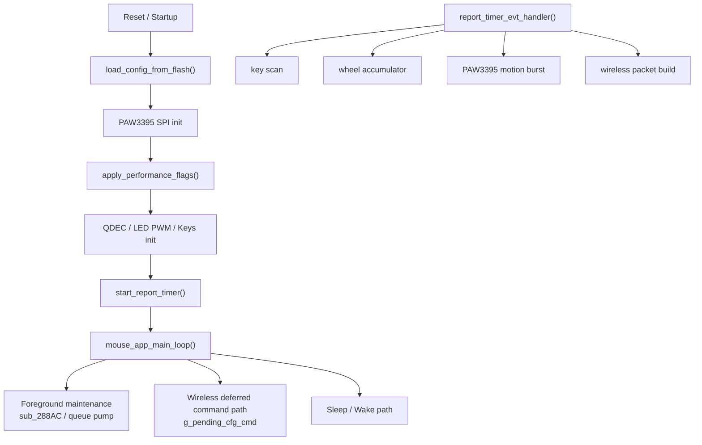
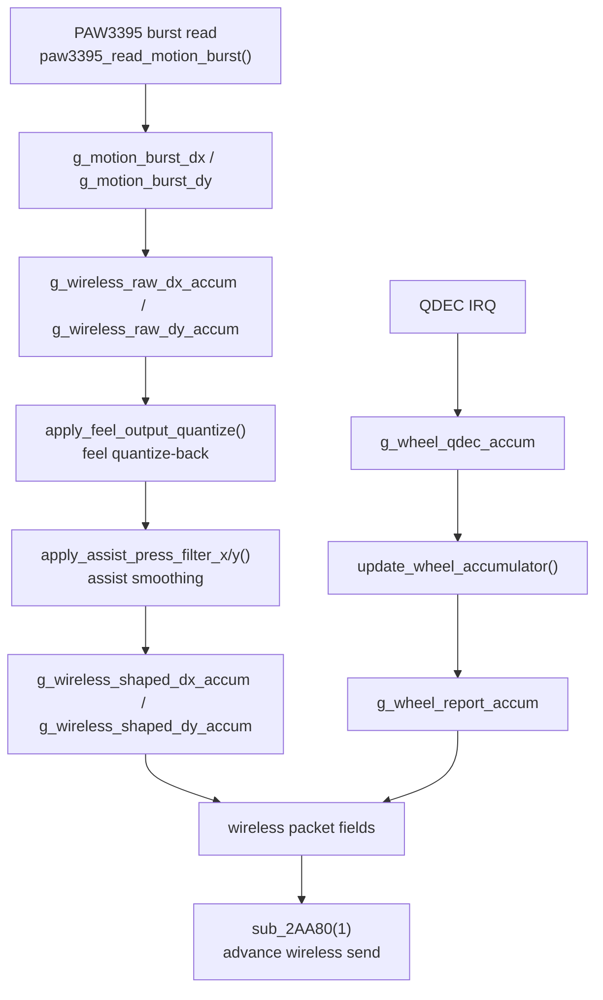

# CHAOS 8K Mouse Firmware Architecture and Behavior Analysis

> [!IMPORTANT]
> <sub><strong>Reverse-Engineering Notice:</strong> This report is provided solely for lawful interoperability research, defensive security analysis, education, archival study, and owner-authorized repair or maintenance. It does not authorize unauthorized flashing, redistribution, circumvention, infringement, or other unlawful use; all third-party rights remain with their respective owners.</sub>

## Why This Family Was Selected

This report is included because the CHAOS family serves as a representative sample of self-developed entry-level wireless mouse firmware. Compared with the other families in this repository, it shows weaker code quality, architectural discipline, feature completeness, and performance stability, but it remains valuable as a lower-cost counterexample for studying tuning logic and firmware tradeoffs.

## 0. Document Notes

### 0.1 Purpose

This document consolidates the current reverse-engineering results for the firmware, with emphasis on:

- firmware code framework and module boundaries
- code style and runtime organization
- the sensor motion data path
- the semantics and register writes behind the `0x15` performance-mode bitfield
- the implementation logic of the two firmware-level feel features: `feel` and `assist press`
- the configuration protocol semantics table

### 0.2 Source Basis

This document is based primarily on first-hand IDA Pro decompilation from the current database, with the following materials used as supporting references:

- `dever.bin.i64` / current IDA database
- exported decompilation [dever.bin.c](./dever.bin.c)

### 0.3 Engineering Conventions

- “High Performance”, “Competition”, “Overclock”, and “Low Power” all refer to the PAW3395 profiles selected by the `0x15` mode bitfield.
- `feel` and `assist press` are not “one PAW3395 register that directly changes feel”. They are firmware-side motion transformations built on remapping, quantization, and smoothing.
- The “25,000 fps” note is an engineering interpretation. The firmware does not literally store the string `"25000 fps"`, but the script deltas, the extra register-write path, and known project-side conclusions support reading Overclock as the 25,000 fps sampling tier.

### 0.4 Update Record (Updated: 2026-04-30, New Firmware: `deverV0.1.4_20260430.bin`)

This section records the delta observed relative to the previous sample. The short version is straightforward: this update adds a noticeable amount of product-facing functionality, but it still very much looks like CHAOS-family firmware, meaning the development pattern is still “keep stuffing things in until it works, then keep adding patches until it stops collapsing immediately.” From a firmware-engineering standpoint, this revision is still not good. It does more than the previous build and covers more link scenarios, but those gains come mainly from piling on more modules, more state machines, and more compatibility branches rather than from any real structural cleanup. The sample still shows obvious engineering-quality problems: heavy global-state dependence, continuously accumulating legacy compatibility burden, repeated mismatches between naming and actual behavior, and strong reliance on patch-style fixes and path branching. In other words, what improved here is the deliverable surface, not the implementation quality; the gap with mainstream mouse firmware remains large.

#### 0.4.1 Most visible change: from a wireless-main-path firmware to a mixed-link platform

In terms of functional scope, the new build is no longer just a single wireless-main-path firmware. It has grown into a mixed-link platform that explicitly covers wireless, wired, and charging scenarios:

- startup logs now include `USB mouse APP starting...`
- the architecture banner explicitly says `modular APP + low-latency wired HID`
- the firmware switches between `WIRELESS / WIRED_HOST / CHARGER_ONLY`
- the wired side no longer exposes only mouse HID; it also brings up keyboard / config / media interfaces

From an engineering-quality perspective, however, this is scope expansion, not architectural convergence. The firmware simply layers more links and more device roles on top of the existing implementation without establishing a sufficiently clean unified control plane. There are more link states, more service roles, and longer init/switch paths, but the core organization is still global state plus branch-heavy dispatch. Platform capability has increased, but implementation complexity has grown faster, and structural quality has not improved accordingly.

#### 0.4.2 The configuration protocol is more complete, but also exposes more incremental patching

Compared with the previous build, this revision clearly expands the configuration protocol and fills in several entry points that were previously ambiguous or absent:

- `0x14` is no longer an unresolved “special hardware action”; it now lands clearly as `SET_DFU`
- a new `0x24` factory reset command is added while the old `0xFF` legacy factory reset path is still kept for compatibility
- `0x25` is added for pair-token writeback
- `0x27` is added for charge-status query
- configuration replies no longer rely only on wireless ACK flow; they can also be routed through a dedicated `cfg_hid` queue

This shows the protocol has moved from “barely sufficient” toward “feature-complete,” but the way it evolves is still additive patching rather than controlled refactoring. New commands keep being added, old commands keep being retained, and reply paths keep branching. The protocol looks more complete on the surface, yet its internal semantics are not noticeably more unified. In mature firmware, protocol growth is usually accompanied by clearer version boundaries, semantic normalization, and shrinking legacy burden; this sample instead looks like more patches being attached to the existing protocol surface. That may satisfy product requirements in the short term, but it raises maintenance cost and behavioral ambiguity over time.

#### 0.4.3 `feel` and “assist press” were not removed; they were moved into a shared motion-processing layer

This is one of the most important implementation-level changes in the update: motion-feel logic that used to be scattered across the old wireless path has started to be consolidated into a shared motion-processing layer.

- `feel` still keeps the same core algorithm: amplify internal CPI by `min(26000 / dpi, feel)`, then fold it back through remainder-preserving quantization
- “assist press” still keeps the 5-sample moving average; it did not become a new algorithm, it only changed landing point
- both features are no longer tied only to the old wireless main path; they are now collected into an explicit `motion_processor`
- wired and wireless paths both reuse this same motion-processing layer

That is somewhat better than the previous build’s scattered path-local implementation, but it still does not qualify as real decoupling. The current `motion_processor` looks more like centralized wrapping around old logic than a clean redesign of motion-processing boundaries. Configuration state, mode bits, link differences, and output behavior are still obviously coupled through globals, and control/data separation is still incomplete. In practical terms, this update solves the “stop copying the same logic everywhere” problem, but it does not solve the more important “how should this logic be modeled cleanly and stably” problem.

#### 0.4.4 PAW3395 profile semantics drifted, and the naming is less honest than before

In the previous report, Low Power / High Performance / Competition / Overclock could still be mapped into a relatively stable set of mode semantics. In the new build, the directly confirmable top-level profile names have become:

- `legacy low-power profile`
- `legacy high-performance profile`
- `legacy USB profile`
- `2W5 overclock init/profile`

This means the profile semantics have drifted. The previously identifiable `competition profile` is no longer present as a clean standalone mode and is effectively replaced, at least at the naming layer, by `legacy USB profile`. From an engineering-review perspective, this is not a good sign. In mature firmware, UI names, configuration-bit meaning, low-level scripts, and runtime behavior should stay as monotonically aligned as possible. What this sample shows instead is that naming, historical tuning intent, and current implementation were not reorganized; they were merely left piled together and kept running. That directly hurts maintainability and raises the cost of later verification and reverse engineering.

#### 0.4.5 A whole ring of surrounding state machines was added: pairing, charging, DFU, and link recovery

This revision clearly fills in many surrounding operational flows, and it does so mainly by adding more state machines and more process branches:

- there is now a formal pairing flow with enter, timeout, success, and failure handling
- successful pairing stores `rand/model` bytes and refreshes the wireless base address
- charging detection and `CHARGER_ONLY` switching are present
- a DFU entry path is present
- USB session start/stop, stall recovery, and power-removal shutdown paths are also present

This shows the firmware has started to cover the edge cases a real shipping product must handle, but the implementation style remains coarse. These flows are not managed through a genuinely unified session manager, event model, or lifecycle abstraction. Instead, the firmware keeps adding explicit enter/exit/fail/retry/recover paths and distributing behavior across more local states and conditions. The product-level coverage is broader, but the state space has expanded substantially. In engineering terms, this is “the scenarios are covered,” not “the system has been made orderly.”

#### 0.4.6 Some old problems were not solved; they were only hidden behind the new framework

The most obvious example is `motion sync`. In the new build it still behaves like a preserved historical placeholder that never actually closes into a concrete behavior:

- the flag can still be stored
- the configuration surface can still carry it
- but it still does not enter a clear, concrete motion-processing main path

From an engineering standpoint, this kind of leftover bit is not harmless detail; it is direct evidence of weak implementation discipline. It shows a continued gap between exposed capability and actual landed behavior: an interface can be exposed first, a config bit can be preserved first, but the behavior definition is not closed and the call chain is not completed. This “declare the semantic first, maybe implement it later, possibly never finish it” pattern is common in low-quality firmware. It keeps producing ambiguity, false assumptions, and historical debt, and it is one of the reasons samples like this remain structurally weak over time.

#### 0.4.7 Overall Assessment of This Update

The essence of this update is not an implementation-quality upgrade. It is a visible functional expansion. The firmware now includes wired USB, config HID, pairing, charging, DFU, and link-recovery capabilities that product firmware is expected to cover, so the set of things it can do is indeed larger than before. But from an engineering standpoint, these changes did not make the system more orderly; they amplified structural problems that were already there. The firmware still depends heavily on global state, still uses more state machines and compatibility entry points to cover more scenarios, and still lacks sufficiently clear module boundaries and consistent control abstractions. As a result, implementation quality did not rise in step with feature count.

To put it more directly, this revision is still a low-quality firmware sample:

- it addresses feature gaps, not structural loss of control
- it adds paths and branches, not verifiable and convergent unifying mechanisms
- it repackages old logic into new modules without clearing the old global dependencies or semantic baggage
- it looks more complete as a product, but it still carries obvious patchwork, stitched-together, and low-consistency implementation traits

So the most accurate summary of this update is not “the firmware matured,” but “the firmware got bigger.” It is more deliverable-looking than the previous revision, but it is still far from a mature implementation with clear design, explicit boundaries, controlled state, and constrained technical debt; measured against mainstream mouse-firmware engineering standards, the gap remains large.

---

## 1. Overall Firmware Framework

### 1.1 Execution Model

This report focuses only on the 2.4 GHz wireless operating path. From that wireless viewpoint, the firmware uses a classic no-RTOS embedded structure:

- one foreground super-loop: `mouse_app_main_loop()`
- one high-frequency report timer callback: `report_timer_evt_handler()`
- several hardware IRQ paths:
  - QDEC wheel
  - SPI / GPIO / low-power wakeup
- a large global-state model used as shared runtime context

### 1.2 Main Subsystems

From function naming and runtime behavior, the wireless-side system can be split into the following major subsystems:

| Subsystem | Responsibility | Representative Functions |
| --- | --- | --- |
| Configuration storage | load config from flash, save config, restore defaults | `load_config_from_flash`, `save_config_to_flash`, `restore_default_config_and_save` |
| Wireless ESB / config protocol | 2.4G data TX/RX, deferred command execution, wireless send-state advancement | `esb_restart_rx`, `sub_2AA80`, `run_special_key_chord_sequence` |
| PAW3395 sensor | init, burst read, DPI, performance profile switching | `paw3395_init_registers`, `paw3395_read_motion_burst`, `apply_performance_flags` |
| Input / output peripherals | key scan, QDEC wheel, LED PWM | `keys_scan_and_build_bindings`, `wheel_qdec_init`, `key_led_pwm_init` |
| System maintenance | watchdog, sleep, wake, voltage / status sampling | `watchdog_init_and_kick`, `enable_sleep_wakeup_inputs`, `disable_sleep_wakeup_inputs` |

### 1.3 Startup Sequence

From the wireless-main-path viewpoint, `mouse_app_main_loop()` can be summarized as this startup order:

1. Load configuration from flash.
2. Validate the first button binding. If it is no longer a valid default semantic, restore the default config.
3. Build the startup measurement baseline.
4. Initialize PAW3395 SPI.
5. Apply the performance mode according to `g_perf_mode_flags`.
6. Initialize wheel QDEC, LED PWM, and key GPIOs.
7. Start the report timer according to the polling-rate setting.
8. Clear the wireless runtime accumulators.
9. Apply the current DPI.
10. Start the watchdog.

### 1.4 Runtime Phase

At runtime, the logic mainly splits into two major paths:

- high-frequency wireless data path
  - `report_timer_evt_handler()` completes key scanning, wheel update, sensor burst read, motion shaping, wireless-packet field writes, and send advancement in each tick
- foreground control path
  - `mouse_app_main_loop()` handles `g_pending_cfg_cmd`, config persistence, mode switching, sleep / wake, and watchdog maintenance

### 1.5 Code Style

The firmware shows a very explicit embedded-engineering style rather than a highly abstract application architecture.

#### Trait 1: heavy reliance on global state

Almost all state is stored in globals, for example:

- configuration state: `g_perf_mode_flags`, `g_dpi_table`, `g_button_bindings`, `g_sensor_angle_tune`, `g_sensor_feel_value`
- runtime state: `g_wireless_raw_dx_accum`, `g_wireless_raw_dy_accum`, `g_wireless_shaped_dx_accum`, `g_wireless_shaped_dy_accum`, `g_wheel_report_accum`
- transport state: `g_pending_cfg_cmd`

#### Trait 2: light interrupt work, heavy foreground work

The design tries to avoid expensive work in interrupt context:

- once a wireless config packet is received, it is only copied into `g_pending_cfg_cmd`
- the actual stop-timer, register-write, and flash-write work is done later in the main loop

#### Trait 3: profiles are register scripts, not parameter formulas

Performance modes are not “one level in, many formulas out”. The firmware directly calls dedicated profile functions:

- `paw3395_apply_low_power_profile()`
- `paw3395_apply_high_performance_profile()`
- `paw3395_apply_competition_profile()`
- `paw3395_apply_overclock_profile()`

This suggests a tuning workflow based on fixed sensor scripts rather than a complex policy layer in firmware.

#### Trait 4: high-frequency wireless path and foreground config path are decoupled

The wireless side uses one fixed opcode semantic set:

- `0x11` query config
- `0x12` / `0x19` DPI
- `0x15` performance mode
- `0x22` angle
- `0x23` feel

The high-frequency motion path only cares about the current global state, while the config path only cares about when those globals should be changed. The decoupling is implemented through shared runtime globals.

---

## 2. Configuration System and Command Entry Points

### 2.1 Flash Configuration Image

`load_config_from_flash()` deserializes the following flash-backed layout:

| Offset | Meaning |
| --- | --- |
| `0` | version byte |
| `1` | DPI slot count |
| `2` | current active slot |
| `3..14` | six 16-bit DPI values |
| `15` | polling-rate code |
| `16` | `0x15` mode bitfield |
| `17..18` | sleep timeout |
| `19` | debounce |
| `20` | LED switch value |
| `21..22` | reserved / legacy bytes |
| `23..34` | six button-binding pairs |
| `35` | angle tune |
| `36..39` | scaling float |
| `40` | feel value |

### 2.2 Wireless Configuration Entry

After a wireless config payload arrives, it enters the config system through this backbone:

- validate the payload checksum first
- copy the 5-byte command into `g_pending_cfg_cmd`
- let the foreground main loop process it by `g_pending_cfg_cmd.opcode`

### 2.3 Configuration Execution Model

The engineering benefits of this structure are:

- short IRQ paths
- no stop-timer, register-write, or flash-write work in interrupt context
- the high-speed wireless sampling path is not directly interrupted by config execution

For the wireless mode, the key point is:

- the receive side is only responsible for “storing the command”
- `mouse_app_main_loop()` is responsible for “deciding when to actually execute it”
- so there is a clear foreground/background split between config execution and the high-frequency motion path

---

## 3. Sensor Motion Data Flow

This chapter discusses only the sensor-motion path in 2.4 GHz wireless mode.  
From the wireless backbone, the motion data travels through this path in each report period:

```text
report_timer_evt_handler()
-> keys_scan_and_build_bindings()
-> update_wheel_accumulator()
-> paw3395_read_motion_burst()
-> raw dx/dy enter wireless accumulators
-> feel quantization reconstruction
-> later output shaping
-> wireless packet field write
-> sub_2AA80(1) advances wireless sending
```

### 3.1 Sampling Trigger: report-timer tick

In wireless mode, all high-frequency motion handling starts from `report_timer_evt_handler()`.

From the IDA Pro decompilation, when `event_id == 324`, the function completes the following sequence in the same tick:

1. key scan: `keys_scan_and_build_bindings()`
2. wheel accumulation fold-down: `update_wheel_accumulator()`
3. PAW3395 burst read: `paw3395_read_motion_burst()`
4. raw motion accumulation
5. `feel` quantization reconstruction
6. later output shaping
7. wireless packet field write
8. `sub_2AA80(1)` to advance wireless sending

In other words, in wireless mode there is no long pipeline like “sample now, send much later”. Sampling, shaping, packet write, and send advancement all happen almost in the same report period.

### 3.2 Preceding Input Paths: keys and wheel enter packet construction before sensor motion

Before the PAW3395 motion path runs, the firmware first handles two other input sources that are parallel to motion.

#### 3.2.1 Key path

`keys_scan_and_build_bindings()` completes the following work in every tick:

- read GPIO key states
- debounce according to `g_debounce_code`
- map physical inputs into logical button bits according to `g_button_bindings`
- return the current button bitmap in `byte_20000201`

This button bitmap is then written directly into the wireless packet, so the button state and X/Y motion are merged into the same report frame.

#### 3.2.2 Wheel path

The wheel path is separate from the optical motion path. QDEC IRQ first updates `g_wheel_qdec_accum`, and then `update_wheel_accumulator()` folds it down:

```text
g_wheel_qdec_accum >= 2 or <= -2
-> g_wheel_report_accum += g_wheel_qdec_accum / 2
-> g_wheel_qdec_accum keeps the remainder
```

This means the wheel is not “report whatever arrived immediately”. Instead it works as:

- accumulate by QDEC half-steps first
- fold that into real wheel steps inside the report cadence
- then write `g_wheel_report_accum` into the wireless packet field

### 3.3 Sensor Sampling Stage: how the PAW3395 burst is read

Main function: `paw3395_read_motion_burst()`

This function converts one PAW3395 burst read into raw motion data that the firmware can actually use.

According to the IDA Pro decompilation, its steps can be split into:

1. check the busy flag `byte_20000088`  
   If the sensor / SPI side is still busy, wait up to roughly 5000 short delay loops.
2. assert SPI chip select and prepare the burst read
3. send the PAW3395 burst-read start register `0x16`
4. call `paw3395_read_burst_payload()` to read back the burst payload
5. recombine the raw bytes into signed 16-bit motion values:
   - `g_motion_burst_dx`
   - `g_motion_burst_dy`
6. store the high bytes into auxiliary bytes for later packet formatting

From the decompilation, the X/Y decode uses:

```text
dx = low_byte | (high_byte << 8)
dy = low_byte | (high_byte << 8)
```

That means the firmware is not receiving “some already post-processed displacement”. It is receiving the raw increment from this burst.

### 3.4 Raw motion enters the wireless accumulators

After the PAW3395 burst read is complete, raw `dx/dy` is not written directly into the wireless packet. It first enters the wireless-side raw accumulators:

```c
g_wireless_raw_dx_accum += sub_28150(&g_motion_burst_dx);
g_wireless_raw_dy_accum += sub_28150(&g_motion_burst_dy);
```

IDA Pro confirms that `sub_28150()` simply returns the input value and does no extra scaling or transformation.  
So the engineering meaning of this stage is very clear:

- `g_motion_burst_dx/dy` is the raw displacement from this burst
- `g_wireless_raw_dx_accum / g_wireless_raw_dy_accum` is the raw-motion accumulator on the wireless main path

Why this matters:

- it shows that the firmware first collects multiple finer raw displacements
- later `feel` does not operate on one isolated burst byte, but on the accumulated raw motion amount

### 3.5 `feel` stage: how the raw accumulated amount is folded back to host scale

Main function: `apply_feel_output_quantize()`

This is the most important step in the wireless motion path.

The previous stage produced a finer raw accumulated amount, but it is not sent directly to the host. It first passes through `feel` quantization reconstruction:

```c
v6 = apply_feel_output_quantize(&g_wireless_raw_dx_accum);
v7 = apply_feel_output_quantize(&g_wireless_raw_dy_accum);
```

What it does is not just a simple integer division. Instead it:

1. divides by `g_feel_quantize_factor` to get the integer amount that should be emitted this time
2. keeps the remainder in `g_wireless_raw_*_accum`
3. uses half the factor as a threshold for a near-rounding compensation
4. leaves unresolved error to later ticks

The practical meaning of this step is:

- raw motion is first sampled more finely
- then folded back to host scale by firmware with remainder preservation
- tiny displacement is not crudely truncated, but can be paid back over later ticks

This is the root reason why `feel` can change micro-movement granularity in wireless mode.

### 3.6 Later shaping stage: data still keeps being processed after `feel`

In wireless mode, `feel` is not the last step.  
The output of `apply_feel_output_quantize()` continues into the later shaping chain:

```c
g_wireless_shaped_dx_accum += apply_assist_press_filter_x(v6);
g_wireless_shaped_dy_accum += apply_assist_press_filter_y(v7);
```

That means the wireless motion-processing order is:

```text
raw motion
-> feel quantization reconstruction
-> later output shaping
-> shaped accumulators
```

So:

- `feel` decides how finer raw displacement is folded back
- later shaping decides whether the folded-back displacement will still be processed in the time domain

From an engineering layering viewpoint, `feel` sits between “raw motion” and “host-scale motion”, not at the final layer.

### 3.7 Wireless packet write stage: how shaped results enter the packet

Once X/Y handling is done, `report_timer_evt_handler()` writes the current tick result into the wireless-packet-related fields:

- `byte_200000CF = byte_20000201`  
  current button bitmap
- `word_200000D0 = g_wireless_shaped_dx_accum`  
  current shaped X accumulation
- `word_200000D2 = g_wireless_shaped_dy_accum`  
  current shaped Y accumulation
- `byte_200000D4 = g_wheel_report_accum`  
  current wheel accumulation
- `byte_200000D5`  
  checksum accumulated from the first 6 bytes
- `byte_200000D6 = byte_20000015`  
  extra status / flag field

So by the packet-write stage, the wireless packet already contains:

- the current button state
- X/Y after `feel` and later shaping
- the current wheel value
- checksum and status fields

From an engineering viewpoint, this stage marks:

```text
the raw sensor motion has been fully transformed into a payload that belongs to the wireless protocol layer.
```

### 3.8 Send-advance stage: when wireless sending is actually pushed forward

After the packet fields are ready, `report_timer_evt_handler()` calls:

```c
sub_2AA80(1);
```

From its call position, its handling of wireless buffers, and the later send-state operations, the high-confidence interpretation is:

- advance the wireless send state machine
- select / update the current packet slot
- push the prepared packet into the wireless send flow

We do not need to fully unfold the RF scheduling details inside `sub_2AA80()`, but its position in the backbone is very clear:

```text
it is the bridge between “packet content is ready” and “2.4G transmission is actually pushed forward”.
```

### 3.9 Why this dataflow directly changes wireless feel

The final order on the wireless main path can be summarized as:

```text
key / wheel preparation
-> sensor burst read
-> raw dx/dy enter accumulators
-> feel quantization reconstruction
-> later output shaping
-> write into wireless packet
-> advance wireless sending
```

This order determines one key fact:

- in wireless mode, `feel` is not a side-path switch
- it sits exactly between “raw sensor motion amount” and “final X/Y inside the wireless packet”

So its impact on feel is direct:

- it changes how small displacement is distributed in each tick
- it changes when small displacement actually enters the wireless packet
- it changes the granularity, continuity, and fine-adjustment texture the player finally feels

### 3.10 One-sentence summary of this chapter

In wireless mode, the raw displacement sampled by PAW3395 is not sent out directly. It first goes through:

```text
raw accumulation -> feel reconstruction -> later shaping -> wireless packet write -> send advancement
```

That is why, from an engineering perspective, “wireless feel” is not a single-register problem. It is a full dataflow problem.

---

## 4. `0x15` Performance Mode Bitfield

### 4.1 Bit Layout

Based on both the driver document and firmware implementation, the `0x15` bitfield is:

| Bit | Meaning | Firmware Action |
| --- | --- | --- |
| `bit7` | Overclock | select overclock profile |
| `bit6` | Assist Press | enable the firmware-level smoothing state machine |
| `bit5` | Competition Mode | select competition profile |
| `bit4` | High Performance | select high-performance profile |
| `bit3` | Motion Sync | currently stored in `g_motion_sync_flag`, but no active use was found |
| `bit2` | Ripple Control | writes PAW3395 `reg 0x5A` |
| `bit1` | Straight Line Correction | writes PAW3395 `reg 0x56` |
| `bit0` | LOD 1mm / 2mm | writes PAW3395 bank `0x0C`, `reg 0x4E` |

### 4.2 Profile Selection Logic

`apply_performance_flags()` behaves as:

- `0x80` -> Overclock
- `0x20` -> Competition
- `0x10` -> High Performance
- otherwise -> Low Power

Important notes:

- the firmware does not enforce mutual exclusion between `bit7`, `bit5`, and `bit4`
- unexpected combinations fall through the default branch, which is Low Power

### 4.3 Non-Profile Bits and Their Actual Register Effects

#### LOD

`paw3395_set_lod_mode()`:

- `1mm -> bank 0x0C, reg 0x4E = 0x08`
- `2mm -> bank 0x0C, reg 0x4E = 0x0A`

#### Straight Line Correction

`paw3395_set_straight_line_correction()`:

- enabled: `reg 0x56 = 0x8D`
- disabled: `reg 0x56 = 0x0D`

#### Ripple Control

`paw3395_set_ripple_control()`:

- enabled: `reg 0x5A = 0x90`
- disabled: `reg 0x5A = 0x10`

#### Angle Tune

`paw3395_set_angle_tune()`:

- `bank 0x05, reg 0x77 = angle`
- `bank 0x05, reg 0x78 = 0x80` as the apply trigger

### 4.4 Register Scripts Used by the Profile Functions

The tables below compare the mode-specific profile functions only. One major caveat:

- Overclock mode also executes the full `paw3395_init_registers()` script before its profile-specific script
- High Performance, Competition, and Low Power only use `paw3395_reinit_for_profile_change()`

#### 4.4.1 Low Power Profile

`paw3395_apply_low_power_profile()`

| Order | Bank / Reg | Value |
| --- | --- | --- |
| 1 | `7F` | `05` |
| 2 | `51` | `40` |
| 3 | `53` | `40` |
| 4 | `61` | `3B` |
| 5 | `6E` | `1F` |
| 6 | `7F` | `07` |
| 7 | `42` | `32` |
| 8 | `43` | `00` |
| 9 | `7F` | `0D` |
| 10 | `51` | `00` |
| 11 | `52` | `49` |
| 12 | `53` | `00` |
| 13 | `54` | `5B` |
| 14 | `55` | `00` |
| 15 | `56` | `64` |
| 16 | `57` | `02` |
| 17 | `58` | `A5` |
| 18 | `7F` | `00` |
| 19 | `54` | `54` |
| 20 | `78` | `01` |
| 21 | `79` | `9C` |
| 22 | `40` | `01` |

#### 4.4.2 High Performance Profile

`paw3395_apply_high_performance_profile()`

| Order | Bank / Reg | Value |
| --- | --- | --- |
| 1 | `7F` | `05` |
| 2 | `51` | `40` |
| 3 | `53` | `40` |
| 4 | `61` | `31` |
| 5 | `6E` | `0F` |
| 6 | `7F` | `07` |
| 7 | `42` | `32` |
| 8 | `43` | `00` |
| 9 | `7F` | `0D` |
| 10 | `51` | `00` |
| 11 | `52` | `49` |
| 12 | `53` | `00` |
| 13 | `54` | `5B` |
| 14 | `55` | `00` |
| 15 | `56` | `64` |
| 16 | `57` | `02` |
| 17 | `58` | `A5` |
| 18 | `7F` | `00` |
| 19 | `54` | `54` |
| 20 | `78` | `01` |
| 21 | `79` | `9C` |
| 22 | `40` | `read(0x40) & 0xFC` |

#### 4.4.3 Competition Profile

`paw3395_apply_competition_profile()`

| Order | Bank / Reg | Value |
| --- | --- | --- |
| 1 | `7F` | `05` |
| 2 | `51` | `40` |
| 3 | `53` | `40` |
| 4 | `61` | `31` |
| 5 | `6E` | `0F` |
| 6 | `7F` | `07` |
| 7 | `42` | `2F` |
| 8 | `43` | `00` |
| 9 | `7F` | `0D` |
| 10 | `51` | `12` |
| 11 | `52` | `DB` |
| 12 | `53` | `12` |
| 13 | `54` | `DC` |
| 14 | `55` | `12` |
| 15 | `56` | `EA` |
| 16 | `57` | `15` |
| 17 | `58` | `2D` |
| 18 | `7F` | `00` |
| 19 | `54` | `55` |
| 20 | `40` | `83` |

#### 4.4.4 Overclock Profile

`paw3395_apply_overclock_profile()`

| Order | Bank / Reg | Value |
| --- | --- | --- |
| 1 | `7F` | `05` |
| 2 | `51` | `40` |
| 3 | `53` | `40` |
| 4 | `61` | `31` |
| 5 | `6E` | `0F` |
| 6 | `7F` | `06` |
| 7 | `62` | `02` |
| 8 | `7A` | `03` |
| 9 | `6B` | `27` |
| 10 | `7F` | `07` |
| 11 | `41` | `10` |
| 12 | `42` | `32` |
| 13 | `43` | `00` |
| 14 | `7F` | `0D` |
| 15 | `51` | `12` |
| 16 | `52` | `DB` |
| 17 | `53` | `12` |
| 18 | `54` | `DC` |
| 19 | `55` | `12` |
| 20 | `56` | `EA` |
| 21 | `57` | `15` |
| 22 | `58` | `2D` |
| 23 | `7F` | `00` |
| 24 | `40` | `83` |

### 4.5 Common Points, Differences, and Key Deltas

#### 4.5.1 High Performance vs Low Power

Common points:

- both use the conservative bank `0x0D` coefficient set:
  - `51=00`
  - `52=49`
  - `53=00`
  - `54=5B`
  - `55=00`
  - `56=64`
  - `57=02`
  - `58=A5`
- both set:
  - `bank 0x07, reg 42 = 0x32`
  - `reg 54 = 0x54`
  - `reg 78 = 0x01`
  - `reg 79 = 0x9C`

Differences:

- High Performance:
  - `61 = 0x31`
  - `6E = 0x0F`
  - `reg 40 = read(0x40) & 0xFC`
- Low Power:
  - `61 = 0x3B`
  - `6E = 0x1F`
  - `reg 40 = 0x01`

Engineering interpretation:

- High Performance and Low Power belong to the same conservative filter family
- the main delta is in bank `0x05` timing / internal cadence parameters and the final `reg 40` working bits

#### 4.5.2 Competition vs Overclock

Common points:

- both use the aggressive bank `0x0D` coefficient set:
  - `51=12`
  - `52=DB`
  - `53=12`
  - `54=DC`
  - `55=12`
  - `56=EA`
  - `57=15`
  - `58=2D`
- both use the same bank `0x05` profile values:
  - `51=40`
  - `53=40`
  - `61=31`
  - `6E=0F`
- both ultimately drive `reg 40` toward `0x83`

Differences:

- Competition:
  - `bank 0x07, reg 42 = 0x2F`
  - `reg 54 = 0x55`
  - no bank `0x06` profile writes
  - only uses `paw3395_reinit_for_profile_change()`
- Overclock:
  - adds bank `0x06` writes:
    - `62 = 0x02`
    - `7A = 0x03`
    - `6B = 0x27`
  - adds `bank 0x07, reg 41 = 0x10`
  - uses `bank 0x07, reg 42 = 0x32`
  - does not use the `reg 54 = 0x55` step
  - runs the full `paw3395_init_registers()` script before applying the overclock profile

Engineering interpretation:

- Competition and Overclock should be viewed as the same aggressive tracking family with different sampling-rate intent
- the most important engineering distinction is the sensor sampling frame-rate target
- one key reminder for this project:
  - **Overclock and Competition mainly differ in sensor sampling frame rate**
  - **Overclock mode is set to 25,000 fps**
- the firmware does not self-label that number in plain text, but the extra bank `0x06` / `0x07` writes, the full-init path, and the known tuning intent strongly support that interpretation

#### 4.5.3 Why Overclock Is Not Just “Competition + One Extra Bit”

There are three reasons:

1. Overclock does not reuse only `paw3395_reinit_for_profile_change()`. It goes through the full `paw3395_init_registers()` sequence.
2. Overclock adds an extra bank `0x06` write group not used by Competition.
3. Overclock also changes bank `0x07` behavior.

So, from the firmware implementation perspective, Overclock is a separate profile, not simply a renamed Competition mode.

### 4.6 Sleep / Wake Profiles

To fully understand runtime profile handling, two additional scripts matter.

#### Sleep Profile `paw3395_apply_sleep_profile()`

Before entering idle / sleep, the firmware switches to a reduced-power script and additionally writes:

- `reg 78 = 0x0A`
- `reg 79 = 0x0F`
- `reg 40 = (read(0x40) & 0xFC) + 2`
- `reg 77 = 0x01`
- `reg 78 = 0x01`
- `reg 79 = 0x01`
- `reg 7A = 0x08`
- `reg 7B = 0x01`
- `reg 7C = 0x0D`

#### Wake Restore Profile `paw3395_restore_run_profile()`

After wakeup, the firmware restores:

- `77 = 0x4E`
- `78 = 0x01`
- `79 = 0x0F`
- `7A = 0x08`
- `7B = 0x5E`
- `7C = 0x08`

---

## 5. How `feel` Works

### 5.1 Conclusion First

`feel` is not a standalone PAW3395 “feel register switch”. It is a firmware-layer algorithm that runs through the main dataflow:

1. It first scales the current user DPI up into a higher internal sampling DPI and programs that into the sensor.
2. It lets the sensor produce finer raw `dx/dy`.
3. It then folds those finer raw motion amounts back to host scale with the same factor, preserves the remainder, and emits the output across later reports in batches.

So what `feel` truly changes is not the nominal DPI tier itself, but:

- the internal sensor sampling density
- the quantization behavior of tiny motion inside the firmware
- how tiny displacement is distributed across consecutive reports on the time axis

That is why it can clearly change micro-granularity and low-speed adjustment texture.

### 5.2 Dataflow Overview

From the control flow already confirmed in IDA Pro, the backbone dataflow of `feel` can be written directly as:

```text
wireless config command 0x23
-> g_sensor_feel_value
-> paw3395_apply_dpi()
-> compute_feel_scaled_dpi()
-> PAW3395 internal DPI amplification
-> paw3395_read_motion_burst()
-> raw dx/dy enter wireless accumulators
-> apply_feel_output_quantize()
-> final wireless packet
```

If we keep only the most important backbone stages, the algorithm can be split into five parts:

1. configuration entry
2. DPI reprogramming
3. raw motion accumulation
4. firmware-side quantization reconstruction
5. report emission

The rest of this chapter explains `feel` according to those five backbone stages.

### 5.3 Stage 1: configuration entry

Main function: `mouse_app_main_loop()`

IDA Pro confirms that, on the wireless path covered by this report, the configuration entry of `feel` is:

- wireless config command: `g_pending_cfg_cmd.opcode == 0x23`
- runtime variable: `g_sensor_feel_value`

The supporting paths are also confirmed:

- query readback: `build_config_query_reply()`
- persistence: `save_config_to_flash()`
- startup restore: `load_config_from_flash()`
- default value: `0` inside `restore_default_config_and_save()`

The single most important fact of this stage is:

```c
g_sensor_feel_value = new_value;
paw3395_apply_dpi(g_dpi_table[g_active_dpi_slot]);
```

That means once `0x23` is received, `feel` does not merely “update one config field”. It immediately re-runs the current DPI apply flow.

So the practical meaning of this stage is:

```text
it turns feel from “a stored config field” into “a live runtime state that later sensor sampling and output reconstruction both depend on”.
```

### 5.4 Stage 2: DPI reprogramming stage

Main function: `paw3395_apply_dpi()`  
Core helper: `compute_feel_scaled_dpi()`

This is the first half of the `feel` algorithm, and also the first stage where the data path is really rewritten.

#### 5.4.1 First compute the `feel` factor

The core formula in `compute_feel_scaled_dpi()` is:

```text
factor = min(floor(26000 / user_dpi), g_sensor_feel_value)
```

That means:

- the lower the current DPI, the larger the possible amplification factor
- the higher the `feel` value, the higher the allowed upper bound
- what actually takes effect is the smaller of those two values

So the strength of `feel` is never determined by the UI value alone. It depends on:

- the current DPI slot
- the current `feel` value
- the final `factor` computed from both

#### 5.4.2 Then write the amplified DPI into the sensor

If `factor > 0`, the firmware first computes:

```text
effective_sensor_dpi = user_dpi * factor
```

Then `paw3395_apply_dpi()` encodes that value and writes it into the PAW3395 DPI registers:

- `0x48`
- `0x49`
- `0x4A`
- `0x4B`
- finally `0x47 = 1`

This is where misunderstandings often happen, so the point should be stated clearly:

- `feel` really does cause the DPI registers to be rewritten
- but it is not “that one register directly changes feel”
- the register writes are only there so the sensor can first run at a denser internal sampling scale

One more critical runtime state is produced here:

```c
g_feel_quantize_factor
```

It stores the same `factor` that will later be used in output reconstruction.

The essence of this stage is:

```text
sample the raw input more finely first.
```

### 5.5 Stage 3: raw motion accumulation stage

Main function: `paw3395_read_motion_burst()`  
Runtime landing point: `report_timer_evt_handler()` / `mouse_app_main_loop()`

Once the sensor is already working at a higher internal DPI, the next step is not to send reports immediately. Instead, the firmware first reads the finer raw `dx/dy` and puts them into firmware accumulators.

The backbone flow is:

1. `paw3395_read_motion_burst()` reads raw motion
2. the finer raw `dx/dy` first enters accumulators
3. the later quantization-reconstruction stage folds it back to host scale

In the wireless mode covered by this report, those accumulators are:

- `g_wireless_raw_dx_accum`
- `g_wireless_raw_dy_accum`

This stage does not yet expose the final feel by itself. It only stores the “finer raw input” inside the wireless path for the next stage.

It can be understood as:

```text
first hold those finer, more fragmented raw displacements in the accumulator.
```

### 5.6 Stage 4: firmware-side quantization reconstruction

Main function: `apply_feel_output_quantize()`

This is the true core of `feel`, and the most important stage in the entire dataflow.

After the sensor has sampled finer raw motion, the firmware does not send those finer displacements to the host directly. Instead, it uses `g_feel_quantize_factor` to fold them back to host scale.

But it does not simply do:

```text
output = accum / factor
```

and throw the remainder away.

What it actually does is:

1. integer-divide first and get the integer output that should be emitted this time
2. keep the remainder inside the accumulator
3. use “half the factor” as a near-rounding compensation threshold
4. carry the unresolved error forward into later frames

Equivalent pseudocode:

```c
int apply_feel_output_quantize(int *accum)
{
    int out;
    int half;

    if (g_feel_quantize_factor <= 0) {
        out = *accum;
        *accum = 0;
        return out;
    }

    out = *accum / g_feel_quantize_factor;
    *accum %= g_feel_quantize_factor;

    half = g_feel_quantize_factor / 2 + g_feel_quantize_factor % 2;

    if (*accum >= half) {
        *accum -= g_feel_quantize_factor;
        out += 1;
    } else if (*accum < -half) {
        *accum += g_feel_quantize_factor;
        out -= 1;
    }

    return out;
}
```

Why this is the soul of `feel` is simple:

- the previous stage only makes the sensor sample more finely
- the stage that truly decides what granularity the user finally touches is this redistribution of fine raw displacement across each output frame

Its practical effects are:

- small displacement is less likely to be erased directly
- tiny displacement is not crudely truncated
- the remainder is paid back over later frames
- low-speed micro-adjustment feels denser and more connected

The essence of this stage is:

```text
take finer raw displacement and emit it in batches, continuously, with compensation.
```

### 5.7 How `feel` actually becomes “feel” in wireless mode

Sections 5.3 to 5.6 explain the algorithmic skeleton of `feel`. What actually determines what the player finally feels is how this algorithm runs inside the 2.4G wireless report cycle.  
According to the IDA Pro decompilation of `report_timer_evt_handler()`, the wireless backbone can be summarized as:

```text
timer tick
-> paw3395_read_motion_burst()
-> g_wireless_raw_dx_accum / g_wireless_raw_dy_accum accumulate raw motion
-> apply_feel_output_quantize()
-> later output chain
-> write into current wireless packet
-> sub_2AA80(1) advances sending
```

So in wireless mode, the key to how `feel` changes feel is not “whether the formula looks like some filter”, but:

```text
for the same physical displacement, how coarse the captured granularity is, and how that displacement is split and distributed across consecutive wireless reports.
```

#### 5.7.1 What `feel` actually does in each wireless report cycle

From the dataflow perspective, the six most important actions inside one wireless report cycle are:

1. the report-timer tick arrives and enters `report_timer_evt_handler()`
2. `paw3395_read_motion_burst()` reads this tick's raw `dx/dy` from PAW3395
3. the raw displacement first enters `g_wireless_raw_dx_accum` / `g_wireless_raw_dy_accum`, which now hold “finer internal-sampling units”
4. `apply_feel_output_quantize()` folds the accumulated amount back to host scale according to `g_feel_quantize_factor`, while leaving the still-unemitted remainder inside the accumulator
5. the folded-back result enters the later output chain and is then written into the wireless packet fields of the current tick
6. `sub_2AA80(1)` advances sending so this tick's result enters the 2.4G transmit flow as soon as possible

This shows that on the wireless path, `feel` is not a “side-path cosmetic tweak”. It sits directly on the key node between:

```text
raw sensor motion
-> current wireless report output
```

#### 5.7.2 From an engineering perspective, what two things does `feel` actually change

| Changed Item | Engineering Meaning | What It Becomes in Feel |
| --- | --- | --- |
| Sampling granularity | `paw3395_apply_dpi()` first amplifies the internal sensor DPI so smaller physical displacement can be captured | low-speed micro-movement is easier to “see” and less likely to collapse into coarse steps |
| Report-time distribution | `apply_feel_output_quantize()` is not a simple truncation, but “integer division + remainder preservation + half-factor compensation” | the same displacement is split into finer, more continuous multi-frame output instead of being dumped out coarsely in one shot |

Once these two changes stack together, `feel` changes more than just “how large the amount is”. It also changes:

- how fine the raw displacement is when first captured
- the actual step size emitted in each wireless report
- how the same displacement is distributed over time

#### 5.7.3 Why players perceive it as denser and more connected

If we translate 5.7.2 into actual user feel, the core points are:

1. the sensor samples at a finer internal granularity first, so small displacement is more likely to enter the firmware accumulator
2. the output stage does not throw the remainder away, but keeps the still-unemitted part for the next tick
3. every wireless tick repeats the backbone sequence “read -> fold back -> send”, so the same displacement behaves more like it is continuously spread across multiple frames

That directly leads to the following subjective results:

- during low-speed micro-adjustment, the cursor or crosshair is less likely to feel like it is “jumping grid by grid”
- on movement start, stop, and small continuous corrections, the displacement feels more like an ongoing flow than a stop-and-go release
- under mid-to-low DPI with a larger `factor`, this refinement and continuity becomes more obvious

In other words, `feel` does not really “make the mouse faster”. What it rewrites is:

```text
what step size should be used to emit one segment of displacement
```

#### 5.7.4 Plain-language explanation: why `feel` off and `feel` on do not feel the same

If we describe it only from what the player touches, the wireless path can be seen as two different output styles.

**`feel = 0`: "Fei Leishen" off**

- the sensor works directly at the current user DPI
- the firmware does not run the “amplify internal sampling first, then fold back with remainder preservation” reconstruction
- the same displacement enters the current report at the current raw granularity

The subjective feel tends to be:

- direct
- crisp
- coarser in granularity
- easier to notice step-like output during low-speed micro-movement

**`feel > 0`: "Fei Leishen" on**

- the sensor first samples motion at a higher internal DPI
- the firmware then folds those finer displacements back to host scale using `factor`
- the remainder is not discarded, but paid back in later ticks

The subjective feel tends to be:

- denser
- smoother
- more connected
- finer during low-speed, small-range, continuous correction

So the real difference is not “which one is faster”, but:

```text
with feel off, the same physical displacement is emitted more directly with a coarser grain;
with feel on, it is first refined, then split into many smaller pieces and emitted continuously.
```

#### 5.7.5 Concrete examples

##### Example 1: `400 DPI`, `feel = 10`

Calculation result:

- `26000 / 400 = 65`
- `factor = min(65, 10) = 10`
- internal sensor DPI is about `4000`

That means:

- the sensor samples at a much higher precision first
- the firmware then folds the output back by `10`
- the remainder stays in the accumulator and is paid back gradually across later ticks

The typical subjective result is:

- finer micro-movement
- denser low-speed control
- smaller granularity

In wireless mode, this effect is especially easy to feel because every report tick repeats the same backbone: “read finer raw motion -> fold back -> send”. So the user more easily feels that:

- small displacement is released tick by tick
- the crosshair no longer jumps in coarse chunks, but slides more like fine-grained motion

##### Example 2: `1600 DPI`, `feel = 4`

Calculation result:

- `26000 / 1600 = 16`
- `factor = min(16, 4) = 4`
- internal sensor DPI is about `6400`

The effect is still present, but not as strong as `400 DPI + feel 10`.

The reason is not that the algorithm changed, but that:

- the current DPI is higher
- the usable `factor` is smaller
- the internal oversampling space and later reconstruction headroom are both reduced

So even though wireless feel still becomes finer, the refinement and “dense” texture are not as exaggerated as under low DPI.

##### Example 3: `feel = 0`

In this case:

- `factor = 0`
- internal DPI is not amplified
- the output stage does not run this quantization-reconstruction mechanism

This is equivalent to turning `feel` off. The wireless motion data no longer passes through the “amplify first, then reconstruct” fine-granularity distribution logic.

#### 5.7.6 Engineering summary

A more accurate engineering definition of `feel` is:

```text
a feel-shaping mechanism that increases the internal sensor CPI and then uses firmware-side remainder-preserving quantization reconstruction to distribute tiny motion more finely across consecutive wireless reports.
```

It is most visible in:

- mid-to-low DPI slots
- low-speed micro-adjustment
- continuous small-displacement corrections

It is not:

- simply a speed boost
- simply some special sensor-register mode
- simply a smoothing filter

What it truly changes is:

- how the raw motion amount is discretized
- how tiny displacement is distributed across later wireless reports

---

## 6. How “Assist Press” Works

### 6.1 This Is Not a Sensor Register Feature

“Assist Press” maps to `bit6` of `0x15`.

It is not:

- a PAW3395 recoil-control register

It is:

- a firmware-side key-triggered state machine
- plus a 5-sample moving-average filter applied to the final motion output

### 6.2 State Machine

`g_assist_press_enabled` has three key states:

| State | Meaning |
| --- | --- |
| `0` | feature disabled or released |
| `1` | feature enabled, but not yet in active assist smoothing state |
| `3` | active assist smoothing state, output is filtered |

Transition logic:

1. when `bit6` is enabled, `g_assist_press_enabled = 1`
2. when the first button is held long enough, the firmware executes `g_assist_press_enabled |= 2`, so state becomes `3`
3. when that button is released, the state is cleared back to `0`

### 6.3 X/Y Smoothing

`sub_2A424()` and `sub_2A4A4()` handle X and Y respectively.

They only actively filter when `g_assist_press_enabled == 3`:

- push the newest output into a 5-entry ring buffer
- compute the average
- return the average as the current output

If the state is only `1`:

- the feature is armed but not actively smoothing yet
- the functions clear their ring buffers and pass the raw value through

### 6.4 Code-Level Pseudocode

```c
int assist_filter_push(int sample)
{
    if (assist_state == 3) {
        ring[idx] = sample;
        idx = (idx + 1) % 5;
        if (count < 5)
            count++;

        if (count == 5)
            return average(ring[0..4]);

        return sample;
    }

    if (assist_state == 1) {
        clear_ring_buffer();
    }

    return sample;
}
```

### 6.5 Why It Changes Mouse Feel

Because the host does not receive the raw burst output anymore. It receives a smoothed version.

That causes:

- reduced short-term jitter
- smoother trajectories
- blunted spikes in small consecutive motion
- a more stable “recoil control” feel

### 6.6 Plain-Language Example

Suppose without assist smoothing, five consecutive X-axis outputs are:

```text
2, 8, 1, 7, 2
```

That feels jumpy.

Once assist smoothing is active, the 5-point average is:

```text
(2 + 8 + 1 + 7 + 2) / 5 = 4
```

So the output becomes closer to:

```text
4, 4, 4, 4, 4
```

That feels steadier, but also less sharp in transients.

### 6.7 Difference Between `feel` and `assist press`

Both change the subjective feel, but at different stages:

| Feature | Stage | Mechanism |
| --- | --- | --- |
| `feel` | sensor CPI programming + output quantization | increase internal CPI first, then scale output back down |
| `assist press` | output shaping stage | apply a 5-sample moving average to the final output |

In simple terms:

- `feel` changes the sampling / quantization model
- `assist press` changes the output waveform

---

## 7. Other Important Engineering Conclusions

### 7.1 Motion Sync Appears Latent or Unused in This Build

The firmware stores `bit3` into `g_motion_sync_flag`, but in the current IDA Pro database:

- no further profile register programming was found for that flag
- no active motion processing path consumes it

So the current build looks like:

- protocol support kept the bit
- runtime implementation is either incomplete, disabled, or removed

### 7.2 Overclock Is a Real Separate Profile

From the firmware’s own behavior, Overclock is clearly treated as a separate mode:

- full sensor init path
- extra bank `0x06` / `0x07` writes
- aggressive coefficient family shared with Competition

So it should not be treated as merely a renamed Competition mode.

---

## 8. Appendix A: Firmware Framework Diagram



---

## 9. Appendix B: Sensor Data Flow Diagram



---

## 10. Appendix C: Configuration Semantics Table

| Opcode | Name | Payload | Runtime Action | Persisted |
| --- | --- | --- | --- | --- |
| `0x11` | query config | `arg0=1` | build and return current config | No |
| `0x12` | set DPI and switch to slot | `slot + dpi` | update slot DPI and activate it | Yes |
| `0x13` | LED config | `rgb + switch` | update LED state / brightness | Yes |
| `0x14` | special hardware action | unresolved | touches MCU register path and dispatches a specific action | No |
| `0x15` | performance bitfield | `mode` | apply profile, LOD, correction flags, assist toggle | Yes |
| `0x16` | polling rate | `rate` | update timer cadence and scale factor | Yes |
| `0x17` | sleep time | `time code` | update sleep timeout threshold | Yes |
| `0x18` | debounce | `delay` | update key debounce timing | Yes |
| `0x19` | update slot DPI only | `slot + dpi` | update table entry without switching current slot | Yes |
| `0x20` | DPI slot count | `count` | update slot count | Yes |
| `0x21` | button mapping | `buttonIndex + func + keycode` | update button binding | Yes |
| `0x22` | angle tune | `angle` | write angle tuning | Yes |
| `0x23` | feel | `feel` | update quantization rule and reapply DPI | Yes |
| `0xFF` | factory reset | none | rebuild default config and reset behavior | Yes |

---

## 11. Summary

The “mouse feel” of this firmware is not decided by any single setting. It is the combined result of three layers:

1. PAW3395 profile register scripts
2. `feel` internal-CPI amplification plus quantization fold-back
3. `assist press` 5-sample moving-average smoothing

Among them:

- the profile defines the sensor's low-level operating style
- `feel` defines the quantization model
- `assist press` defines the output smoothing model
