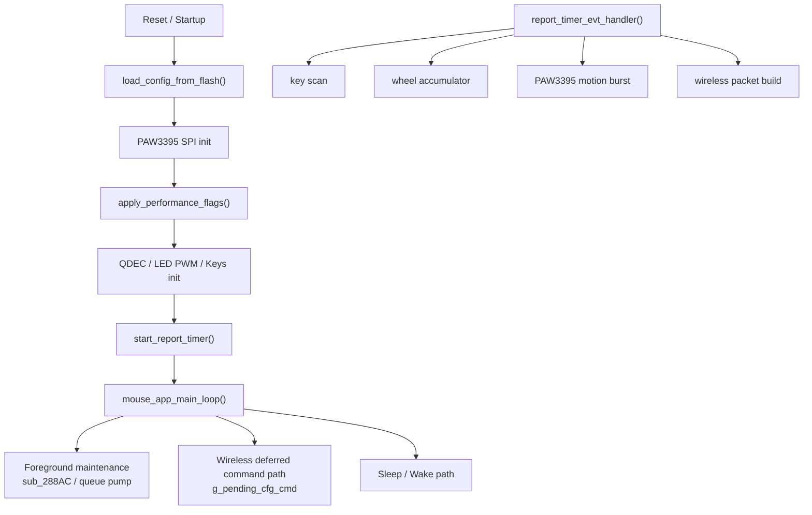
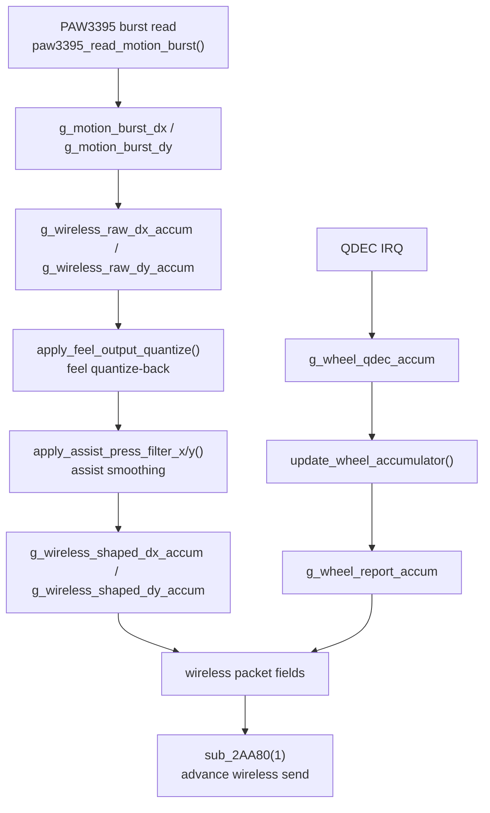

# CHAOS 8K 鼠标固件架构与行为分析

> [!IMPORTANT]
> <sub><strong>逆向声明：</strong>本报告仅供合法的互操作性研究、防御性安全分析、教学、资料保存，以及设备所有人或经授权者进行维修与维护时参考之用；不授权未经许可的刷写、再分发、规避、侵权或其他违法用途，相关第三方权利仍归各自权利人所有。</sub>

## 家族选用说明

收录本报告，是因为 CHAOS 家族可作为低端自研无线鼠标固件的代表样本。相较本仓库中的另外两个家族，它在代码质量、架构纪律、功能完整度与性能稳定性上都更弱，但正因如此，它仍然适合作为观察低成本产品在调校逻辑与固件取舍上典型问题的反面样本。

## 0. 文档说明

### 0.1 目标

本文档固化当前固件逆向分析结论，重点覆盖以下问题：

- 固件代码框架与模块边界
- 代码设计风格与运行组织方式
- 传感器运动数据的流转路径
- `0x15` 性能模式位图的语义与寄存器写入
- `feel` 与 `辅助压枪` 两个“固件层手感功能”的实现原理
- 配置协议的语义表

### 0.2 分析依据

本文件以 IDA Pro 当前数据库中的一手反编译结果为主，辅助参考以下材料：

- `dever.bin.i64` / IDA 数据库
- 导出的反编译代码 [dever.bin.c](./dever.bin.c)

### 0.3 工程约定

- 本文中的“高性能 / 竞技 / 超频 / 低功耗”均指 `0x15` 模式位图驱动的 PAW3395 profile。
- 本文中的“feel”与“辅助压枪”均不是“单纯通过 PAW3395 某个寄存器改变手感”的功能，而是固件层对运动数据做重映射、量化、平滑之后形成的体感变化。
- 对“25,000 fps”的说明属于工程语义说明。固件中没有直接存放字符串 `"25000 fps"`，但从模式脚本差异、额外寄存器写入路径以及项目侧已知结论可以将超频模式理解为 25,000 fps 采样档。

---

## 1. 固件总体框架

### 1.1 运行模型

本报告只关注 2.4G 无线运行视角下的固件结构。就无线主路径而言，该固件是典型的无 RTOS 嵌入式结构：

- 一个前台超级循环：`mouse_app_main_loop()`
- 一个高频报告定时器回调：`report_timer_evt_handler()`
- 若干硬件 IRQ：
  - QDEC 滚轮
  - SPI / GPIO / 低功耗唤醒
- 大量全局状态变量作为共享运行时上下文

### 1.2 主模块划分

从函数命名和运行路径可以将无线主系统划分为以下几个主要子系统：

| 子系统 | 主要职责 | 代表函数 |
| --- | --- | --- |
| 配置存储 | 从 flash 读取配置、写回配置、恢复默认配置 | `load_config_from_flash`, `save_config_to_flash`, `restore_default_config_and_save` |
| 无线 ESB / 配置协议 | 2.4G 数据收发、配置命令延后执行、无线侧发包状态推进 | `esb_restart_rx`, `sub_2AA80`, `run_special_key_chord_sequence` |
| PAW3395 传感器 | 初始化、burst 读取、DPI、性能模式切换 | `paw3395_init_registers`, `paw3395_read_motion_burst`, `apply_performance_flags` |
| 输入 / 输出外设 | 按键扫描、QDEC 滚轮、LED PWM | `keys_scan_and_build_bindings`, `wheel_qdec_init`, `key_led_pwm_init` |
| 系统维护 | 看门狗、睡眠、唤醒、电压/状态采样 | `watchdog_init_and_kick`, `enable_sleep_wakeup_inputs`, `disable_sleep_wakeup_inputs` |

### 1.3 启动阶段

在无线主路径视角下，`mouse_app_main_loop()` 启动时可概括为以下顺序：

1. 从 flash 装载配置。
2. 校验首个按钮绑定是否仍为合法默认语义，不合法则恢复默认配置。
3. 建立启动测量基线。
4. 初始化 PAW3395 SPI。
5. 根据 `g_perf_mode_flags` 应用性能模式。
6. 初始化滚轮 QDEC、LED PWM、按键 GPIO。
7. 根据 polling rate 启动报告定时器。
8. 清理无线运行时累计状态。
9. 应用当前 DPI。
10. 启动看门狗。

### 1.4 运行阶段

运行阶段主要分成两条主路径：

- 无线高频数据路径
  - `report_timer_evt_handler()` 每个 tick 完成按键扫描、滚轮更新、传感器 burst 读取、运动量整形、无线包字段写入与发包推进。
- 前台控制路径
  - `mouse_app_main_loop()` 负责处理 `g_pending_cfg_cmd`、保存配置、模式切换、睡眠唤醒和看门狗维护。

### 1.5 代码设计风格

该固件呈现出明确的“简单嵌入式工程型”风格，而非抽象层次很高的应用型风格。

#### 特征 1：大量全局状态

状态几乎全部保存在全局变量中，例如：

- 配置态：`g_perf_mode_flags`, `g_dpi_table`, `g_button_bindings`, `g_sensor_angle_tune`, `g_sensor_feel_value`
- 运行态：`g_wireless_raw_dx_accum`, `g_wireless_raw_dy_accum`, `g_wireless_shaped_dx_accum`, `g_wireless_shaped_dy_accum`, `g_wheel_report_accum`
- 通信态：`g_pending_cfg_cmd`

#### 特征 2：中断轻处理，主循环重处理

设计上尽量避免在中断上下文里做复杂工作：

- 无线配置包收到后，只复制到 `g_pending_cfg_cmd`
- 真正停表、改寄存器、写 flash 的逻辑都在主循环前台完成

#### 特征 3：Profile 采用寄存器脚本而非参数求解

性能模式不是“给一个档位，再算一堆公式”，而是直接执行独立函数：

- `paw3395_apply_low_power_profile()`
- `paw3395_apply_high_performance_profile()`
- `paw3395_apply_competition_profile()`
- `paw3395_apply_overclock_profile()`

这说明原工程更像“调好寄存器脚本后直接烧录”，而不是在固件里做复杂策略层。

#### 特征 4：无线高频链路与前台配置链路解耦

无线侧使用一套固定 opcode 语义：

- `0x11` 查询配置
- `0x12` / `0x19` DPI
- `0x15` 性能模式
- `0x22` angle
- `0x23` feel

高频运动链路只关心“当前全局状态是什么”，而配置链路只负责“何时修改这些状态”，两者通过全局变量完成解耦。

---

## 2. 配置系统与命令入口

### 2.1 Flash 配置镜像

`load_config_from_flash()` 反序列化的 flash 镜像布局如下：

| 偏移 | 含义 |
| --- | --- |
| `0` | 版本字节 |
| `1` | DPI slot 数量 |
| `2` | 当前激活 slot |
| `3..14` | 6 个 16-bit DPI 值 |
| `15` | polling rate code |
| `16` | `0x15` 模式位图 |
| `17..18` | sleep timeout |
| `19` | debounce |
| `20` | LED 开关值 |
| `21..22` | 预留 / 旧版字段 |
| `23..34` | 6 个按钮映射对 |
| `35` | angle tune |
| `36..39` | 标度浮点值 |
| `40` | feel 值 |

### 2.2 无线配置入口

无线侧收到配置负载后，会沿着以下主干进入配置系统：

- 先校验 payload checksum
- 再把 5 字节命令拷贝到 `g_pending_cfg_cmd`
- 最后由主循环前台按 `g_pending_cfg_cmd.opcode` 进行处理

### 2.3 配置执行模型

这种结构的工程优点是：

- IRQ 路径短
- 停定时器 / 改寄存器 / 写 flash 不会发生在中断上下文
- 高速无线采样链不会被配置处理直接打断

就无线模式而言，真正重要的是：

- 接收侧只负责“把命令存起来”
- `mouse_app_main_loop()` 才负责“何时真正执行命令”
- 因此配置写入和高频运动链路之间存在一个明确的前后台分层

---

## 3. 传感器运动数据流转流程

本章只讨论 2.4G 无线模式下的传感器运动数据链路。  
从无线主干看，运动数据每个报告周期都会沿着下面这条路径流动：

```text
report_timer_evt_handler()
-> keys_scan_and_build_bindings()
-> update_wheel_accumulator()
-> paw3395_read_motion_burst()
-> 原始 dx/dy 进入无线累计器
-> feel 量化重建
-> 后续输出整形
-> 无线包字段写入
-> sub_2AA80(1) 推进无线发送流程
```

### 3.1 采样触发点：报告定时器 tick

无线模式下，所有高频运动处理都从 `report_timer_evt_handler()` 开始。

从 IDA Pro 反编译结果看，当 `event_id == 324` 时，该函数会在同一个 tick 内依次完成：

1. 按键扫描：`keys_scan_and_build_bindings()`
2. 滚轮累计折算：`update_wheel_accumulator()`
3. PAW3395 burst 读取：`paw3395_read_motion_burst()`
4. 原始运动累计
5. `feel` 量化重建
6. 后续输出整形
7. 无线包字段写入
8. 调用 `sub_2AA80(1)` 推进无线发送

也就是说，无线模式下并不存在“先采样，过很久再发包”的长链路，采样、整形、写包、发包推进基本都发生在同一个报告周期里。

### 3.2 前置输入链路：按键与滚轮先于传感器运动进入包构建

在进入 PAW3395 运动链路之前，固件会先处理两个与运动数据并行的输入源：

#### 3.2.1 按键链路

`keys_scan_and_build_bindings()` 会在每个 tick 内完成：

- 读取 GPIO 按键状态
- 按 `g_debounce_code` 做消抖
- 按 `g_button_bindings` 映射为逻辑按钮位
- 返回当前按钮状态位图 `byte_20000201`

这个按钮位图随后会直接写入无线包中的按钮字段，所以它和 X/Y 运动是在同一帧里合并的。

#### 3.2.2 滚轮链路

滚轮与光学传感器运动链路是分离的，先由 QDEC 中断更新 `g_wheel_qdec_accum`，再由 `update_wheel_accumulator()` 做折算：

```text
g_wheel_qdec_accum >= 2 或 <= -2
-> g_wheel_report_accum += g_wheel_qdec_accum / 2
-> g_wheel_qdec_accum 保留余数
```

这说明滚轮也不是“来多少就立刻发多少”，而是：

- 先按 QDEC 半步累计
- 再在报告节拍内折算成真正的滚轮步进
- 最后把 `g_wheel_report_accum` 写进无线报文字段

### 3.3 传感器采样阶段：PAW3395 burst 是如何被读出来的

主干函数：`paw3395_read_motion_burst()`

这个函数负责把一次 PAW3395 burst 读成固件可用的原始运动数据。

根据 IDA Pro 反编译结果，它的步骤可以拆成：

1. 检查 `byte_20000088` 忙标志  
   如果传感器 / SPI 侧还忙，就最多等待约 5000 次小延时。
2. 拉起 SPI 片选并准备 burst 读取
3. 向 PAW3395 发出 burst 读取起始寄存器 `0x16`
4. 调用 `paw3395_read_burst_payload()` 把 burst 载荷读回
5. 将原始字节重新组合成 16-bit 有符号运动量：
   - `g_motion_burst_dx`
   - `g_motion_burst_dy`
6. 同时把高字节暂存到辅助字节，供后续包字段使用

从反编译结果看，X/Y 解码使用的是：

```text
dx = low_byte | (high_byte << 8)
dy = low_byte | (high_byte << 8)
```

也就是说，固件拿到的并不是“某种已经处理好的位移”，而是本次 burst 的原始传感器增量。

### 3.4 原始运动进入无线累计器

PAW3395 burst 读完后，原始 `dx/dy` 不会直接写入无线包，而是先进入无线侧的原始累计器：

```c
g_wireless_raw_dx_accum += sub_28150(&g_motion_burst_dx);
g_wireless_raw_dy_accum += sub_28150(&g_motion_burst_dy);
```

这里的 `sub_28150()` 经 IDA Pro 确认只是直接返回输入值，本身不做额外缩放或变换。  
因此这一阶段的工程含义非常明确：

- `g_motion_burst_dx/dy` 是这一次 burst 的原始位移
- `g_wireless_raw_dx_accum / g_wireless_raw_dy_accum` 是无线主链路上的原始运动累计量

这一步为什么重要：

- 说明固件先把若干个更细的原始位移攒起来
- 后续 `feel` 不是对单个 burst 字节做花样，而是对“累计起来的原始运动量”做量化重建

### 3.5 `feel` 阶段：原始累计量如何被折回主机尺度

主干函数：`apply_feel_output_quantize()`

这是无线模式下运动链路里最关键的一步。

前一阶段得到的是更细的原始累计量，但这些量并不会直接发给主机，而是要先经过 `feel` 量化重建：

```c
v6 = apply_feel_output_quantize(&g_wireless_raw_dx_accum);
v7 = apply_feel_output_quantize(&g_wireless_raw_dy_accum);
```

它做的事情不是简单整除，而是：

1. 先按 `g_feel_quantize_factor` 整除得到本次应吐出的整数运动量
2. 把余数继续留在 `g_wireless_raw_*_accum` 里
3. 用半个因子作为阈值做接近四舍五入的补偿
4. 把还没吐完的误差继续留给后续 tick

这一步的实际意义是：

- 原始 motion 先被采得更细
- 再由固件带余数地折回主机尺度
- 微小位移不会被粗暴截断，而会在后续 tick 中继续补出来

这是无线模式下 `feel` 能改变微动颗粒感的根本原因。

### 3.6 后续整形阶段：`feel` 之后的数据还会继续被处理

在无线模式下，`feel` 并不是最后一步。  
`apply_feel_output_quantize()` 的输出会继续进入后续整形链路：

```c
g_wireless_shaped_dx_accum += apply_assist_press_filter_x(v6);
g_wireless_shaped_dy_accum += apply_assist_press_filter_y(v7);
```

这说明无线主链路的运动处理顺序是：

```text
原始 motion
-> feel 量化重建
-> 后续输出整形
-> shaped 累计量
```

因此：

- `feel` 决定的是“更细的原始位移如何折回”
- 后续整形决定的是“折回后的位移还要不要再做时间域处理”

从工程层次上讲，`feel` 位于“原始运动 -> 主机尺度运动”的中间，而不是最终一层。

### 3.7 无线包写入阶段：整形后的结果如何进入报文

当 X/Y 处理完成后，`report_timer_evt_handler()` 会把当前 tick 的结果写入无线报文相关字段：

- `byte_200000CF = byte_20000201`  
  当前按钮位图
- `word_200000D0 = g_wireless_shaped_dx_accum`  
  当前 X 方向整形后累计量
- `word_200000D2 = g_wireless_shaped_dy_accum`  
  当前 Y 方向整形后累计量
- `byte_200000D4 = g_wheel_report_accum`  
  当前滚轮累计量
- `byte_200000D5`  
  由前 6 字节累加得到的校验值
- `byte_200000D6 = byte_20000015`  
  额外状态 / 标志字段

也就是说，到了写包阶段，无线报文已经同时包含了：

- 当前按钮状态
- 经 `feel` 和后续整形处理后的 X/Y
- 当前滚轮值
- 校验与状态字段

从工程视角看，这一步标志着：

```text
传感器原始运动数据，已经彻底转变成无线协议层的可发送载荷。
```

### 3.8 发包推进阶段：什么时候真正推动无线发送

当包字段准备好后，`report_timer_evt_handler()` 会调用：

```c
sub_2AA80(1);
```

从它的调用位置、对无线缓冲区的处理，以及后续对发送状态的操作来看，可以把它高概率解释为：

- 推进无线发送状态机
- 选择 / 更新当前发包槽位
- 把当前准备好的报文送入无线发送流程

这里不需要把 `sub_2AA80()` 的内部射频调度细节全展开，但它在数据流主干里的地位很明确：

```text
它是“从包内容准备完成”进入“真正推动 2.4G 发射”的桥梁。
```

### 3.9 为什么这条数据流会直接改变无线手感

无线主链路的最终顺序可以总结成：

```text
按键 / 滚轮准备
-> 传感器 burst 读取
-> 原始 dx/dy 进入累计器
-> feel 量化重建
-> 后续输出整形
-> 写入无线包
-> 推进无线发送
```

这条顺序决定了一个关键事实：

- 无线模式下，`feel` 不是一个旁路开关
- 它正好卡在“原始传感器运动量”和“无线包里的最终 X/Y”之间

所以它对手感的影响是直接的：

- 改变每个 tick 里小位移的分配方式
- 改变小位移何时真正进入无线包
- 改变玩家最终摸到的颗粒感、连续性和微调质感

### 3.10 一句话总结本章数据流

无线模式下，PAW3395 采到的原始位移并不会直接发出去，而是先经过：

```text
原始累计 -> feel 重建 -> 后续整形 -> 无线包写入 -> 发包推进
```

这就是为什么从工程上看，“无线手感”不是一个单寄存器问题，而是一条完整的数据流问题。

---

## 4. `0x15` 性能模式位图语义

### 4.1 位布局

根据驱动文档和固件实现，`0x15` 的位图语义如下：

| 位 | 含义 | 固件动作 |
| --- | --- | --- |
| `bit7` | 超频 | 选择 overclock profile |
| `bit6` | 辅助压枪 | 打开固件层运动平滑状态机 |
| `bit5` | 竞技模式 | 选择 competition profile |
| `bit4` | 高性能 | 选择 high-performance profile |
| `bit3` | 移动同步 | 当前版本仅保存到 `g_motion_sync_flag`，未见后续实际应用 |
| `bit2` | 波纹修正 | 写 PAW3395 `reg 0x5A` |
| `bit1` | 直线修正 | 写 PAW3395 `reg 0x56` |
| `bit0` | LOD 1mm/2mm | 写 PAW3395 bank `0x0C`, `reg 0x4E` |

### 4.2 profile 选择逻辑

`apply_performance_flags()` 的 profile 选择逻辑可概括为：

- `0x80` -> 超频
- `0x20` -> 竞技
- `0x10` -> 高性能
- 其他情况 -> 低功耗

注意：

- 固件没有对 `bit7/bit5/bit4` 做互斥校验
- 如果出现未覆盖的组合，最终会落入默认分支，也就是低功耗

### 4.3 非 profile 位的实际寄存器动作

#### LOD

`paw3395_set_lod_mode()`：

- `1mm -> bank 0x0C, reg 0x4E = 0x08`
- `2mm -> bank 0x0C, reg 0x4E = 0x0A`

#### 直线修正

`paw3395_set_straight_line_correction()`：

- 开：`reg 0x56 = 0x8D`
- 关：`reg 0x56 = 0x0D`

#### 波纹修正

`paw3395_set_ripple_control()`：

- 开：`reg 0x5A = 0x90`
- 关：`reg 0x5A = 0x10`

#### angle tune

`paw3395_set_angle_tune()`：

- `bank 0x05, reg 0x77 = angle`
- `bank 0x05, reg 0x78 = 0x80` 作为应用触发

### 4.4 profile 函数的寄存器脚本

下表只比较“模式专用 profile 函数”的寄存器写入。需要特别注意：

- 超频模式在执行自己的 profile 脚本之前，还会额外执行一次完整的 `paw3395_init_registers()`
- 高性能 / 竞技 / 低功耗只做 `paw3395_reinit_for_profile_change()`

#### 4.4.1 低功耗 profile

`paw3395_apply_low_power_profile()`

| 顺序 | Bank / Reg | 值 |
| --- | --- | --- |
| 1 | `7F` | `05` |
| 2 | `51` | `40` |
| 3 | `53` | `40` |
| 4 | `61` | `3B` |
| 5 | `6E` | `1F` |
| 6 | `7F` | `07` |
| 7 | `42` | `32` |
| 8 | `43` | `00` |
| 9 | `7F` | `0D` |
| 10 | `51` | `00` |
| 11 | `52` | `49` |
| 12 | `53` | `00` |
| 13 | `54` | `5B` |
| 14 | `55` | `00` |
| 15 | `56` | `64` |
| 16 | `57` | `02` |
| 17 | `58` | `A5` |
| 18 | `7F` | `00` |
| 19 | `54` | `54` |
| 20 | `78` | `01` |
| 21 | `79` | `9C` |
| 22 | `40` | `01` |

#### 4.4.2 高性能 profile

`paw3395_apply_high_performance_profile()`

| 顺序 | Bank / Reg | 值 |
| --- | --- | --- |
| 1 | `7F` | `05` |
| 2 | `51` | `40` |
| 3 | `53` | `40` |
| 4 | `61` | `31` |
| 5 | `6E` | `0F` |
| 6 | `7F` | `07` |
| 7 | `42` | `32` |
| 8 | `43` | `00` |
| 9 | `7F` | `0D` |
| 10 | `51` | `00` |
| 11 | `52` | `49` |
| 12 | `53` | `00` |
| 13 | `54` | `5B` |
| 14 | `55` | `00` |
| 15 | `56` | `64` |
| 16 | `57` | `02` |
| 17 | `58` | `A5` |
| 18 | `7F` | `00` |
| 19 | `54` | `54` |
| 20 | `78` | `01` |
| 21 | `79` | `9C` |
| 22 | `40` | `read(0x40) & 0xFC` |

#### 4.4.3 竞技 profile

`paw3395_apply_competition_profile()`

| 顺序 | Bank / Reg | 值 |
| --- | --- | --- |
| 1 | `7F` | `05` |
| 2 | `51` | `40` |
| 3 | `53` | `40` |
| 4 | `61` | `31` |
| 5 | `6E` | `0F` |
| 6 | `7F` | `07` |
| 7 | `42` | `2F` |
| 8 | `43` | `00` |
| 9 | `7F` | `0D` |
| 10 | `51` | `12` |
| 11 | `52` | `DB` |
| 12 | `53` | `12` |
| 13 | `54` | `DC` |
| 14 | `55` | `12` |
| 15 | `56` | `EA` |
| 16 | `57` | `15` |
| 17 | `58` | `2D` |
| 18 | `7F` | `00` |
| 19 | `54` | `55` |
| 20 | `40` | `83` |

#### 4.4.4 超频 profile

`paw3395_apply_overclock_profile()`

| 顺序 | Bank / Reg | 值 |
| --- | --- | --- |
| 1 | `7F` | `05` |
| 2 | `51` | `40` |
| 3 | `53` | `40` |
| 4 | `61` | `31` |
| 5 | `6E` | `0F` |
| 6 | `7F` | `06` |
| 7 | `62` | `02` |
| 8 | `7A` | `03` |
| 9 | `6B` | `27` |
| 10 | `7F` | `07` |
| 11 | `41` | `10` |
| 12 | `42` | `32` |
| 13 | `43` | `00` |
| 14 | `7F` | `0D` |
| 15 | `51` | `12` |
| 16 | `52` | `DB` |
| 17 | `53` | `12` |
| 18 | `54` | `DC` |
| 19 | `55` | `12` |
| 20 | `56` | `EA` |
| 21 | `57` | `15` |
| 22 | `58` | `2D` |
| 23 | `7F` | `00` |
| 24 | `40` | `83` |

### 4.5 相同点、不同点、差异点

#### 4.5.1 高性能 vs 低功耗

相同点：

- 都使用较保守的 bank `0x0D` 系数：
  - `51=00`
  - `52=49`
  - `53=00`
  - `54=5B`
  - `55=00`
  - `56=64`
  - `57=02`
  - `58=A5`
- 都设置：
  - `bank 0x07, reg 0x42 = 0x32`
  - `reg 0x54 = 0x54`
  - `reg 0x78 = 0x01`
  - `reg 0x79 = 0x9C`

不同点：

- 高性能：
  - `61 = 0x31`
  - `6E = 0x0F`
  - `reg 40 = read(0x40) & 0xFC`
- 低功耗：
  - `61 = 0x3B`
  - `6E = 0x1F`
  - `reg 40 = 0x01`

工程含义：

- 高性能与低功耗大体属于同一套“保守滤波族”
- 差异主要体现在 bank `0x05` 的时序 / 内部节奏参数，以及最终 `reg 40` 的工作位

#### 4.5.2 竞技 vs 超频

相同点：

- 两者都使用更激进的 bank `0x0D` 系数：
  - `51=12`
  - `52=DB`
  - `53=12`
  - `54=DC`
  - `55=12`
  - `56=EA`
  - `57=15`
  - `58=2D`
- 两者的 bank `0x05` 也一致：
  - `51=40`
  - `53=40`
  - `61=31`
  - `6E=0F`
- 最终都把 `reg 40` 推到 `0x83`

不同点：

- 竞技：
  - `bank 0x07, reg 42 = 0x2F`
  - `reg 54 = 0x55`
  - 不额外写 bank `0x06`
  - 只走 `paw3395_reinit_for_profile_change()`
- 超频：
  - 额外写 bank `0x06`：
    - `62 = 0x02`
    - `7A = 0x03`
    - `6B = 0x27`
  - `bank 0x07, reg 41 = 0x10`
  - `bank 0x07, reg 42 = 0x32`
  - 不写 `reg 54 = 0x55`
  - 先走完整的 `paw3395_init_registers()`，再走 overclock profile

工程解释：

- 竞技和超频属于同一类“激进性能 profile 家族”
- 从工程目标上看，可以将两者理解为“同一套激进跟踪策略，不同的采样帧率档位”
- 根据项目侧已知结论，需要特别提醒：
  - **超频模式与竞技模式最关键的工程差异是传感器采样帧率**
  - **超频模式被设定到 25,000 fps**
- 固件本身不直接写出字符串 `"25000 fps"`，但从其额外的 bank `0x06` / `0x07` 写入、完整初始化路径以及激进 profile 组合，可以将这组脚本理解为超频采样帧率档

#### 4.5.3 超频为什么不仅仅是“竞技 + 一个开关”

原因有三点：

1. 超频模式不是复用 `paw3395_reinit_for_profile_change()`，而是直接走 `paw3395_init_registers()` 全量初始化。
2. 超频模式比竞技模式多写了 bank `0x06` 的一组寄存器。
3. 超频模式在 bank `0x07` 上也存在额外写入和不同取值。

所以从固件实现上看，超频不是“竞技模式再多置一位”，而是单独的一套更深 profile。

### 4.6 睡眠 / 唤醒相关 profile

为了完整理解运行时性能模式切换，还需要注意两套睡眠相关脚本。

#### 睡眠脚本 `paw3395_apply_sleep_profile()`

它将 profile 降为更省电状态，并额外写入：

- `reg 78 = 0x0A`
- `reg 79 = 0x0F`
- `reg 40 = (read(0x40) & 0xFC) + 2`
- `reg 77 = 0x01`
- `reg 78 = 0x01`
- `reg 79 = 0x01`
- `reg 7A = 0x08`
- `reg 7B = 0x01`
- `reg 7C = 0x0D`

#### 唤醒恢复脚本 `paw3395_restore_run_profile()`

唤醒后再恢复：

- `77 = 0x4E`
- `78 = 0x01`
- `79 = 0x0F`
- `7A = 0x08`
- `7B = 0x5E`
- `7C = 0x08`

---

## 5. “feel”功能实现原理

### 5.1 结论先行

`feel` “飞雷神”不是一个单独的 PAW3395 手感寄存器开关，而是一条贯穿主干数据流的固件层算法：

1. 先把用户当前 DPI 放大成更高的“内部采样 DPI”写进传感器。
2. 让传感器先产生更细的原始 `dx/dy`。
3. 再由固件把这些更细的原始运动量按同一个因子折回主机尺度，并保留余数，分批吐到后续报告里。

所以 `feel` 真正改变的不是“名义 DPI 档位”，而是：

- 传感器内部采样密度
- 微小运动量在固件中的量化方式
- 微小位移在时间维度上如何分配到连续报告中

这也是它会明显改变“微动颗粒感”和“低速修正细腻度”的原因。

### 5.2 数据流总览

从 IDA Pro 已确认的控制流看，`feel` 的主干数据流可以直接写成：

```text
0x23 无线配置命令
-> g_sensor_feel_value
-> paw3395_apply_dpi()
-> compute_feel_scaled_dpi()
-> PAW3395 内部 DPI 放大
-> paw3395_read_motion_burst()
-> 原始 dx/dy 进入无线累计器
-> apply_feel_output_quantize()
-> 最终无线报文
```

如果只抓最关键的主干阶段，可以分成 5 段：

1. 配置进入阶段
2. DPI 重编程阶段
3. 原始运动累计阶段
4. 固件量化重建阶段
5. 报告吐出阶段

下面按这 5 段数据流主干来解释。

### 5.3 阶段 1：配置进入阶段

主干函数：`mouse_app_main_loop()`

IDA Pro 已确认，在本报告关注的无线链路里，`feel` 的配置入口是：

- 无线配置命令：`g_pending_cfg_cmd.opcode == 0x23`
- 运行时变量：`g_sensor_feel_value`

配套路径也已经确认：

- 查询回读：`build_config_query_reply()`
- 持久化保存：`save_config_to_flash()`
- 启动恢复：`load_config_from_flash()`
- 默认值：`restore_default_config_and_save()` 中为 `0`

这一阶段最重要的事实只有一条：

```c
g_sensor_feel_value = new_value;
paw3395_apply_dpi(g_dpi_table[g_active_dpi_slot]);
```

也就是说，`feel` 在收到 `0x23` 之后不是“只改个配置值”，而是会立刻重跑当前 DPI 应用流程。

因此这一阶段做的事情可以概括为：

```text
把 feel 从“一个配置项”变成“后续传感器采样和输出重建都会读取的运行时状态”。
```

### 5.4 阶段 2：DPI 重编程阶段

主干函数：`paw3395_apply_dpi()`  
核心子函数：`compute_feel_scaled_dpi()`

这一阶段是 `feel` 算法的前半段，也是数据流第一次真正被改写的地方。

#### 5.4.1 先计算 `feel` 因子

`compute_feel_scaled_dpi()` 的核心公式是：

```text
factor = min(floor(26000 / user_dpi), g_sensor_feel_value)
```

这意味着：

- 当前 DPI 越低，可放大的倍数越大
- `feel` 值越高，允许使用的倍数上限越大
- 真正生效的是两者中的较小值

所以 `feel` 的强弱从来不是只看 UI 上写了多少，而是看：

- 当前 DPI 档位是多少
- 当前 `feel` 值是多少
- 两者共同算出的 `factor` 是多少

#### 5.4.2 再把 DPI 放大后写入传感器

若 `factor > 0`，固件会先得到：

```text
effective_sensor_dpi = user_dpi * factor
```

然后 `paw3395_apply_dpi()` 再把它编码后写入 PAW3395 的 DPI 寄存器：

- `0x48`
- `0x49`
- `0x4A`
- `0x4B`
- 最后写 `0x47 = 1`

这里最容易产生误解，需要明确写清：

- `feel` 确实会导致 DPI 寄存器被改写
- 但它不是“某个寄存器本身直接决定手感”
- 它改寄存器只是为了让传感器先工作在更高的内部采样密度上

这一阶段留下的关键状态还有一个：

```c
g_feel_quantize_factor
```

它保存的就是后续输出重建要用的那个同一 `factor`。

这一阶段做的事情，本质上是：

```text
先把原始输入采得更细。
```

### 5.5 阶段 3：原始运动累计阶段

主干函数：`paw3395_read_motion_burst()`  
运行落点函数：`report_timer_evt_handler()`、`mouse_app_main_loop()`

传感器已经按更高内部 DPI 在工作之后，下一步不是直接发报告，而是先读取更细的原始 `dx/dy`，再把它们放进固件累计器。

主干流程是：

1. `paw3395_read_motion_burst()` 读出原始 motion
2. 更细的原始 `dx/dy` 先进入累计器
3. 等待后续量化重建阶段把它折回主机尺度

在本报告关注的无线模式下，累计器就是：

- `g_wireless_raw_dx_accum`
- `g_wireless_raw_dy_accum`

这一阶段本身还没有把最终手感完全表现出来，它只是把“更细的原始输入”暂存在无线链路内部，给下一阶段使用。

可以把它理解为：

```text
先攒住那些更细、更碎的原始位移。
```

### 5.6 阶段 4：固件量化重建阶段

主干函数：`apply_feel_output_quantize()`

这是 `feel` 真正改变手感的核心阶段，也是整条数据流最重要的地方。

传感器更细地采到了原始 motion 之后，固件并不会把这些更细的位移直接原样发给主机，而是会用 `g_feel_quantize_factor` 把它们折回主机尺度。

但这里不是简单做：

```text
output = accum / factor
```

然后把余数直接丢掉。

它真正做的是：

1. 先整除，得到本次应该吐出的整数输出
2. 把余数继续留在累计变量里
3. 用“半个因子”做一次接近四舍五入的补偿
4. 把没来得及吐掉的误差延续到后续帧

等价伪代码如下：

```c
int apply_feel_output_quantize(int *accum)
{
    int out;
    int half;

    if (g_feel_quantize_factor <= 0) {
        out = *accum;
        *accum = 0;
        return out;
    }

    out = *accum / g_feel_quantize_factor;
    *accum %= g_feel_quantize_factor;

    half = g_feel_quantize_factor / 2 + g_feel_quantize_factor % 2;

    if (*accum >= half) {
        *accum -= g_feel_quantize_factor;
        out += 1;
    } else if (*accum < -half) {
        *accum += g_feel_quantize_factor;
        out -= 1;
    }

    return out;
}
```

这一步为什么是 `feel` 的灵魂，原因很简单：

- 前面只是让传感器先采得更细
- 真正决定用户最终摸到什么“颗粒感”的，是这一步如何把细碎位移重新分配到每一帧输出里

它带来的实际效果是：

- 小位移不容易被直接抹掉
- 微小位移不会被粗暴截断
- 余数会在后续帧里慢慢补出来
- 低速微调时会感觉更“绵密”、更“连”

这一阶段做的事情，本质上是：

```text
把那些更细的原始位移，分批、连续、带补偿地吐出去。
```

### 5.7 无线模式下，`feel` 如何真正落到“手感”上

前面 5.3 到 5.6 解释的是 `feel` 的算法骨架；真正决定玩家最后“摸到什么”的，是这套算法在 2.4G 无线报告周期里如何工作。  
根据 IDA Pro 已确认的 `report_timer_evt_handler()`，无线主干路径可以直接概括为：

```text
定时器 tick
-> paw3395_read_motion_burst()
-> g_wireless_raw_dx_accum / g_wireless_raw_dy_accum 累加原始 motion
-> apply_feel_output_quantize()
-> 后续输出链
-> 写入当前无线报文
-> sub_2AA80(1) 推进发送
```

因此，无线模式下 `feel` 改变手感的关键，不是“公式看起来像不像某个滤波器”，而是：

```text
同样一段物理位移，最终是以多粗的颗粒被采到，以及它们是怎样被拆开后分配到连续无线报告里的。
```

#### 5.7.1 每个无线报告周期里，`feel` 实际做了什么

从数据流看，一个无线报告周期内最关键的 6 个动作是：

1. 报告定时器 tick 到来，进入 `report_timer_evt_handler()`。
2. `paw3395_read_motion_burst()` 从 PAW3395 读出这一拍的原始 `dx/dy`。
3. 原始位移先进入 `g_wireless_raw_dx_accum` / `g_wireless_raw_dy_accum`，此时保存的是“更细的内部采样量”。
4. `apply_feel_output_quantize()` 按 `g_feel_quantize_factor` 把累计量折回主机尺度，并把暂时吐不完的余数继续留在累计器里。
5. 折回后的结果进入当前 tick 的后续输出链，随后写入无线报文字段。
6. `sub_2AA80(1)` 推进发送，让这一拍的结果尽快进入 2.4G 发包流程。

这说明在无线链路里，`feel` 不是一个“旁路小修饰”，而是直接卡在：

```text
原始传感器运动
-> 当前无线报告输出
```

这条主干中间的关键节点。

#### 5.7.2 从工程上看，`feel` 实际改了哪两件事

| 改变项 | 工程含义 | 最终会反映成什么手感 |
| --- | --- | --- |
| 采样颗粒度 | `paw3395_apply_dpi()` 先把传感器内部 DPI 放大，让更小的物理位移也能先被采到 | 低速微动更容易被“看见”，不那么容易糊成大颗粒 |
| 报告时序分配 | `apply_feel_output_quantize()` 不是简单截断，而是“整除 + 余数保留 + 半因子补偿” | 同样一段位移会被拆成更细、更连续的多拍输出，而不是粗糙地一把吐完 |

这两件事叠加后，`feel` 改变的就不只是“量有多大”，而是同时改变了：

- 原始位移被测到的细度
- 每一拍无线报告里实际吐出的步进大小
- 同一段位移在时间轴上的分布方式

#### 5.7.3 为什么玩家会觉得更“绵”、更“连”

把 5.7.2 再翻译成用户真正摸到的效果，核心就是下面 3 点：

1. 传感器先按更细的内部颗粒采样，所以小位移更容易先进入固件累计器。
2. 输出阶段不会把余数直接扔掉，而是把吐不完的那一部分继续留到下一拍。
3. 每个无线 tick 都会重复“读取 -> 折回 -> 发包”这条主干，因此同一段位移会更像被连续分摊到多帧里。

这会直接带来以下主观结果：

- 低速微调时，准星或光标不容易表现成“几格几格地跳”。
- 起手、停手和连续小修正时，位移更像在持续流动，而不是一顿一顿地释放。
- 在中低 DPI 且 `factor` 较大时，这种细化和连续化的感觉会更明显。

换句话说，`feel` 并不是把鼠标“变快”了，而是把：

```text
一段位移应该用多大的步进吐出来
```

这个问题改写掉了。

#### 5.7.4 通俗解释：关闭 `feel` 与开启 `feel` 时，为什么摸起来不一样

如果只从玩家手感去理解，无线链路里其实可以把它看成两种输出方式：

**`feel = 0`：关闭“飞雷神”**

- 传感器按当前用户 DPI 直接工作。
- 固件不会做这套“先放大内部采样，再带余数折回”的重建。
- 同样一段位移，会按当前原始颗粒度直接进入当前报告。

这时的主观感觉通常更偏向：

- 直接
- 干脆
- 颗粒更粗
- 低速微动时更容易感觉到“步进感”

**`feel > 0`：开启“飞雷神”**

- 传感器先在更高的内部 DPI 下把运动采得更细。
- 固件再把这些更细的位移按 `factor` 折回主机尺度。
- 吐不完的余数不会丢，而是继续留到下一拍补出来。

这时的主观感觉通常更偏向：

- 更绵
- 更顺
- 更连
- 低速、小幅、连续修正时更细腻

所以两者真正的区别不是“谁更快”，而是：

```text
同样一段物理位移，关闭 feel 时更像按较粗的颗粒直接吐出；
开启 feel 时更像先磨细，再分很多小份连续吐出。
```

#### 5.7.5 具体例子

##### 例 1：`400 DPI`, `feel = 10`

计算结果：

- `26000 / 400 = 65`
- `factor = min(65, 10) = 10`
- 内部传感器 DPI 约等于 `4000`

这意味着：

- 传感器先按更高精度采样
- 固件再按 `10` 折回去
- 余数继续留在累计器里，后续 tick 再慢慢补出来

主观感受通常是：

- 微动更细
- 低速更绵
- 颗粒感更密

在无线模式下，这种效果尤其容易被摸出来，因为每个报告 tick 都在重复“读取更细原始量 -> 折回 -> 发包”这条主干，所以用户会更明显地感觉到：

- 小位移是一拍一拍连续释放的
- 枪线或准星不是粗颗粒跳动，而更像细粒度滑动

##### 例 2：`1600 DPI`, `feel = 4`

计算结果：

- `26000 / 1600 = 16`
- `factor = min(16, 4) = 4`
- 内部传感器 DPI 约等于 `6400`

这时效果仍然存在，但没有 `400 DPI + feel 10` 那么强。

原因不是算法换了，而是：

- 当前 DPI 更高
- 可用 `factor` 更小
- 内部采样放大量和后续重建空间也一起变小

所以无线模式下虽然仍然会觉得更细，但细化程度和“绵密感”没有低 DPI 场景那么夸张。

##### 例 3：`feel = 0`

这时：

- `factor = 0`
- 不放大内部 DPI
- 输出阶段也不做这套量化重建

等价于关闭“飞雷神”，无线模式下的运动数据就不会再经过这套“先放大再重建”的细粒度分配逻辑。

#### 5.7.6 工程归纳

`feel` “飞雷神”的更准确工程定义是：

```text
通过提高传感器内部 CPI，并在固件层使用带余数保留的量化重建，把微小运动更细地分配到连续无线报告中的一种手感整形机制。
```

它最明显作用于：

- 中低 DPI 档位
- 低速微调
- 连续小位移修正

它不等于：

- 单纯提高速度
- 单纯开启某个传感器寄存器模式
- 单纯平滑滤波

它真正改变的是：

- 原始运动量如何被离散化
- 微小位移如何在时间上分配到后续无线报告里

---

## 6. “辅助压枪”功能实现原理

### 6.1 这不是传感器寄存器功能

`辅助压枪` 对应 `0x15` 的 `bit6`。

其本质不是：

- 改 PAW3395 某个 recoil 寄存器

而是：

- 在固件层维护一个按键触发状态机
- 在特定条件下对 X/Y 输出做 5 点滑动平均

### 6.2 状态机

`g_assist_press_enabled` 有三个关键状态：

| 状态 | 含义 |
| --- | --- |
| `0` | 功能未使能或已释放 |
| `1` | 功能开关已使能，但尚未进入压枪平滑态 |
| `3` | 已进入压枪平滑态，X/Y 输出经过滑动平均 |

状态转移逻辑：

1. 配置位 `bit6` 打开后，`g_assist_press_enabled = 1`
2. 第一个按键持续按住达到阈值后，固件执行 `g_assist_press_enabled |= 2`，于是状态变成 `3`
3. 释放该按键后，状态清零

### 6.3 X/Y 平滑实现

`sub_2A424()` 和 `sub_2A4A4()` 分别处理 X / Y。

只有在 `g_assist_press_enabled == 3` 时才会生效：

- 把最近的 5 个输出值放入 ring buffer
- 求均值
- 返回均值作为本次输出

如果当前只是状态 `1`：

- 说明功能开关打开，但还没进入压枪态
- 此时函数会清空平滑缓存，不改变当前输出值

### 6.4 代码级伪代码

```c
int assist_filter_push(int sample)
{
    if (assist_state == 3) {
        ring[idx] = sample;
        idx = (idx + 1) % 5;
        if (count < 5)
            count++;

        if (count == 5)
            return average(ring[0..4]);

        return sample;
    }

    if (assist_state == 1) {
        clear_ring_buffer();
    }

    return sample;
}
```

### 6.5 它为什么会改变“手感”

因为最终上报给主机的不是“原始 burst 结果”，而是“滑动平均后的结果”。

这会带来几个体感变化：

- 快速抖动会被压低
- 轨迹更平滑
- 连续小位移的尖峰被钝化
- 主观上更容易感觉“压枪更稳”

### 6.6 通俗举例

假设没有辅助压枪时，连续 5 帧 X 轴增量是：

```text
2, 8, 1, 7, 2
```

这会让轨迹看起来比较跳。

如果进入辅助压枪平滑态，5 点均值可能变成：

```text
(2 + 8 + 1 + 7 + 2) / 5 = 4
```

于是输出会更接近：

```text
4, 4, 4, 4, 4
```

体感上会更稳，但也会牺牲瞬态锐利度。

### 6.7 与 `feel` 的区别

两者都改变手感，但改变的位置完全不同：

| 功能 | 作用阶段 | 原理 |
| --- | --- | --- |
| `feel` | 传感器 CPI 编程 + 输出量化 | 先放大内部 CPI，再按因子折算输出 |
| `辅助压枪` | 输出整形阶段 | 对最终输出做 5 点滑动平均 |

可以把它们理解为：

- `feel` 改变“采样与量化方式”
- `辅助压枪` 改变“输出波形”

---

## 7. 其他需要提醒的工程结论

### 7.1 `motion sync` 当前版本疑似未真正生效

固件会把 `bit3` 保存到 `g_motion_sync_flag`，但在当前 IDA 数据库中：

- 未见该标志继续参与 profile 写寄存器
- 未见其进入运动数据处理链

因此当前版本更像：

- 协议层保留了该位
- 运行时实现未完成，或已被裁掉

### 7.2 超频模式不是简单的 UI 档位名称

从固件实现上看，超频模式确实被单独对待：

- 走全量初始化
- 多写 bank `0x06/0x07`
- 与竞技共享激进系数集

因此它应被视为单独 profile，而不是“竞技模式换个名字”。

---

## 8. 附录 A：固件框架图



---

## 9. 附录 B：传感器数据流图



---

## 10. 附录 C：配置语义表

| Opcode | 名称 | 载荷 | 运行时动作 | 是否落盘 |
| --- | --- | --- | --- | --- |
| `0x11` | 查询配置 | `arg0=1` | 组包当前配置并回传 | 否 |
| `0x12` | 设置 DPI 并切到该 slot | `slot + dpi` | 更新 slot DPI，切换当前 DPI | 是 |
| `0x13` | LED 设置 | `rgb + switch` | 更新 LED 开关 / 亮度 | 是 |
| `0x14` | 特殊硬件动作 | 未完全确认 | 触发 MCU 寄存器与特定流程 | 否 |
| `0x15` | 性能模式位图 | `mode` | 应用 profile、LOD、修正、辅助压枪开关 | 是 |
| `0x16` | polling rate | `rate` | 改定时器节奏与比例因子 | 是 |
| `0x17` | sleep time | `time code` | 改自动休眠阈值 | 是 |
| `0x18` | debounce | `delay` | 改按键消抖参数 | 是 |
| `0x19` | 只改指定 slot DPI | `slot + dpi` | 不切当前 slot，只改表项 | 是 |
| `0x20` | DPI slot 数量 | `count` | 改 slot 数 | 是 |
| `0x21` | 按键映射 | `buttonIndex + func + keycode` | 改按钮绑定 | 是 |
| `0x22` | angle tune | `angle` | 写 angle tuning | 是 |
| `0x23` | feel | `feel` | 改量化因子规则，并重新应用 DPI | 是 |
| `0xFF` | 恢复默认 | 无 | 重建默认配置并复位 | 是 |

---

## 11. 总结

这份固件的“手感”不是单点配置决定的，而是三层共同作用的结果：

1. PAW3395 profile 寄存器脚本
2. `feel` 的内部 CPI 放大与量化回缩
3. `辅助压枪` 的 5 点滑动平均

其中：

- profile 决定传感器底层工作形态
- `feel` 决定量化方式
- `辅助压枪` 决定输出平滑方式


