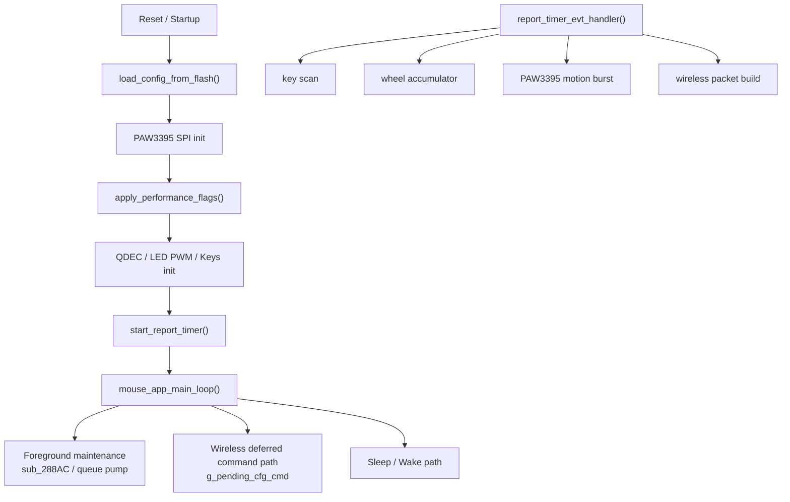
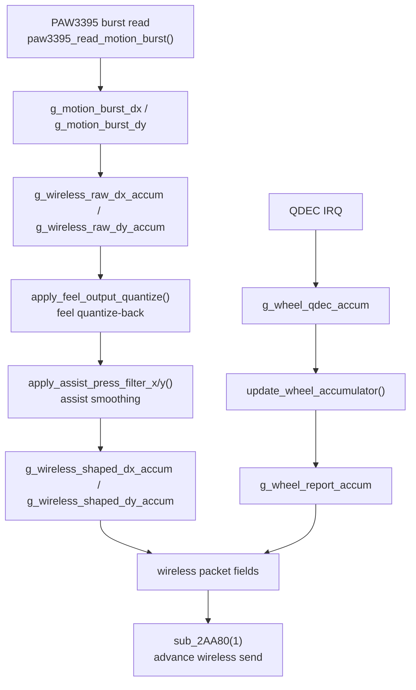

# CHAOS 8K 滑鼠韌體架構與行為分析

> [!IMPORTANT]
> <sub><strong>逆向宣告：</strong>本報告僅供合法的互操作性研究、防禦性安全分析、教學、資料儲存，以及裝置所有人或經授權者進行維修與維護時參考之用；不授權未經許可的刷寫、再分發、規避、侵權或其他違法用途，相關第三方權利仍歸各自權利人所有。</sub>

## 家族選用說明

收錄本報告，是因為 CHAOS 家族可作為低端自研無線滑鼠韌體的代表樣本。相較本倉庫中的另外兩個家族，它在程式碼質量、架構紀律、功能完整度與效能穩定性上都更弱，但正因如此，它仍然適合作為觀察低成本產品在調校邏輯與韌體取捨上典型問題的反面樣本。

## 0. 文件說明

### 0.1 目標

本文件固化當前韌體逆向分析結論，重點覆蓋以下問題：

- 韌體程式碼框架與模組邊界
- 程式碼設計風格與執行組織方式
- 感測器運動資料的流轉路徑
- `0x15` 效能模式點陣圖的語義與暫存器寫入
- `feel` 與 `輔助壓槍` 兩個“韌體層手感功能”的實現原理
- 配置協議的語義表

### 0.2 分析依據

本檔案以 IDA Pro 當前資料庫中的一手反編譯結果為主，輔助參考以下材料：

- `dever.bin.i64` / IDA 資料庫
- 匯出的反編譯程式碼 [dever.bin.c](./dever.bin.c)

### 0.3 工程約定

- 本文中的“高效能 / 競技 / 超頻 / 低功耗”均指 `0x15` 模式點陣圖驅動的 PAW3395 profile。
- 本文中的“feel”與“輔助壓槍”均不是“單純透過 PAW3395 某個暫存器改變手感”的功能，而是韌體層對運動資料做重對映、量化、平滑之後形成的體感變化。
- 對“25,000 fps”的說明屬於工程語義說明。韌體中沒有直接存放字串 `"25000 fps"`，但從模式指令碼差異、額外暫存器寫入路徑以及專案側已知結論可以將超頻模式理解為 25,000 fps 取樣檔。

---

## 1. 韌體總體框架

### 1.1 執行模型

本報告只關注 2.4G 無線執行視角下的韌體結構。就無線主路徑而言，該韌體是典型的無 RTOS 嵌入式結構：

- 一個前臺超級迴圈：`mouse_app_main_loop()`
- 一個高頻報告定時器回撥：`report_timer_evt_handler()`
- 若干硬體 IRQ：
  - QDEC 滾輪
  - SPI / GPIO / 低功耗喚醒
- 大量全域性狀態變數作為共享執行時上下文

### 1.2 主模組劃分

從函式命名和執行路徑可以將無線主系統劃分為以下幾個主要子系統：

| 子系統 | 主要職責 | 代表函式 |
| --- | --- | --- |
| 配置儲存 | 從 flash 讀取配置、寫回配置、恢復預設配置 | `load_config_from_flash`, `save_config_to_flash`, `restore_default_config_and_save` |
| 無線 ESB / 配置協議 | 2.4G 資料收發、配置命令延後執行、無線側發包狀態推進 | `esb_restart_rx`, `sub_2AA80`, `run_special_key_chord_sequence` |
| PAW3395 感測器 | 初始化、burst 讀取、DPI、效能模式切換 | `paw3395_init_registers`, `paw3395_read_motion_burst`, `apply_performance_flags` |
| 輸入 / 輸出外設 | 按鍵掃描、QDEC 滾輪、LED PWM | `keys_scan_and_build_bindings`, `wheel_qdec_init`, `key_led_pwm_init` |
| 系統維護 | 看門狗、睡眠、喚醒、電壓/狀態取樣 | `watchdog_init_and_kick`, `enable_sleep_wakeup_inputs`, `disable_sleep_wakeup_inputs` |

### 1.3 啟動階段

在無線主路徑視角下，`mouse_app_main_loop()` 啟動時可概括為以下順序：

1. 從 flash 裝載配置。
2. 校驗首個按鈕繫結是否仍為合法預設語義，不合法則恢復預設配置。
3. 建立啟動測量基線。
4. 初始化 PAW3395 SPI。
5. 根據 `g_perf_mode_flags` 應用效能模式。
6. 初始化滾輪 QDEC、LED PWM、按鍵 GPIO。
7. 根據 polling rate 啟動報告定時器。
8. 清理無線執行時累計狀態。
9. 應用當前 DPI。
10. 啟動看門狗。

### 1.4 執行階段

執行階段主要分成兩條主路徑：

- 無線高頻資料路徑
  - `report_timer_evt_handler()` 每個 tick 完成按鍵掃描、滾輪更新、感測器 burst 讀取、運動量整形、無線包欄位寫入與發包推進。
- 前臺控制路徑
  - `mouse_app_main_loop()` 負責處理 `g_pending_cfg_cmd`、儲存配置、模式切換、睡眠喚醒和看門狗維護。

### 1.5 程式碼設計風格

該韌體呈現出明確的“簡單嵌入式工程型”風格，而非抽象層次很高的應用型風格。

#### 特徵 1：大量全域性狀態

狀態幾乎全部儲存在全域性變數中，例如：

- 配置態：`g_perf_mode_flags`, `g_dpi_table`, `g_button_bindings`, `g_sensor_angle_tune`, `g_sensor_feel_value`
- 執行態：`g_wireless_raw_dx_accum`, `g_wireless_raw_dy_accum`, `g_wireless_shaped_dx_accum`, `g_wireless_shaped_dy_accum`, `g_wheel_report_accum`
- 通訊態：`g_pending_cfg_cmd`

#### 特徵 2：中斷輕處理，主迴圈重處理

設計上儘量避免在中斷上下文裡做複雜工作：

- 無線配置包收到後，只複製到 `g_pending_cfg_cmd`
- 真正停表、改暫存器、寫 flash 的邏輯都在主迴圈前臺完成

#### 特徵 3：Profile 採用暫存器指令碼而非引數求解

效能模式不是“給一個檔位，再算一堆公式”，而是直接執行獨立函式：

- `paw3395_apply_low_power_profile()`
- `paw3395_apply_high_performance_profile()`
- `paw3395_apply_competition_profile()`
- `paw3395_apply_overclock_profile()`

這說明原工程更像“調好暫存器指令碼後直接燒錄”，而不是在韌體裡做複雜策略層。

#### 特徵 4：無線高頻鏈路與前臺配置鏈路解耦

無線側使用一套固定 opcode 語義：

- `0x11` 查詢配置
- `0x12` / `0x19` DPI
- `0x15` 效能模式
- `0x22` angle
- `0x23` feel

高頻運動鏈路只關心“當前全域性狀態是什麼”，而配置鏈路只負責“何時修改這些狀態”，兩者透過全域性變數完成解耦。

---

## 2. 配置系統與命令入口

### 2.1 Flash 配置映象

`load_config_from_flash()` 反序列化的 flash 映象佈局如下：

| 偏移 | 含義 |
| --- | --- |
| `0` | 版本位元組 |
| `1` | DPI slot 數量 |
| `2` | 當前啟用 slot |
| `3..14` | 6 個 16-bit DPI 值 |
| `15` | polling rate code |
| `16` | `0x15` 模式點陣圖 |
| `17..18` | sleep timeout |
| `19` | debounce |
| `20` | LED 開關值 |
| `21..22` | 預留 / 舊版欄位 |
| `23..34` | 6 個按鈕對映對 |
| `35` | angle tune |
| `36..39` | 標度浮點值 |
| `40` | feel 值 |

### 2.2 無線配置入口

無線側收到配置負載後，會沿著以下主幹進入配置系統：

- 先校驗 payload checksum
- 再把 5 位元組命令複製到 `g_pending_cfg_cmd`
- 最後由主迴圈前臺按 `g_pending_cfg_cmd.opcode` 進行處理

### 2.3 配置執行模型

這種結構的工程優點是：

- IRQ 路徑短
- 停定時器 / 改暫存器 / 寫 flash 不會發生在中斷上下文
- 高速無線取樣鏈不會被配置處理直接打斷

就無線模式而言，真正重要的是：

- 接收側只負責“把命令存起來”
- `mouse_app_main_loop()` 才負責“何時真正執行命令”
- 因此配置寫入和高頻運動鏈路之間存在一個明確的前後臺分層

---

## 3. 感測器運動資料流轉流程

本章只討論 2.4G 無線模式下的感測器運動資料鏈路。  
從無線主幹看，運動資料每個報告週期都會沿著下面這條路徑流動：

```text
report_timer_evt_handler()
-> keys_scan_and_build_bindings()
-> update_wheel_accumulator()
-> paw3395_read_motion_burst()
-> 原始 dx/dy 進入無線累計器
-> feel 量化重建
-> 後續輸出整形
-> 無線包欄位寫入
-> sub_2AA80(1) 推進無線傳送流程
```

### 3.1 取樣觸發點：報告定時器 tick

無線模式下，所有高頻運動處理都從 `report_timer_evt_handler()` 開始。

從 IDA Pro 反編譯結果看，當 `event_id == 324` 時，該函式會在同一個 tick 內依次完成：

1. 按鍵掃描：`keys_scan_and_build_bindings()`
2. 滾輪累計折算：`update_wheel_accumulator()`
3. PAW3395 burst 讀取：`paw3395_read_motion_burst()`
4. 原始運動累計
5. `feel` 量化重建
6. 後續輸出整形
7. 無線包欄位寫入
8. 呼叫 `sub_2AA80(1)` 推進無線傳送

也就是說，無線模式下並不存在“先取樣，過很久再發包”的長鏈路，取樣、整形、寫包、發包推進基本都發生在同一個報告週期裡。

### 3.2 前置輸入鏈路：按鍵與滾輪先於感測器運動進入包構建

在進入 PAW3395 運動鏈路之前，韌體會先處理兩個與運動資料並行的輸入源：

#### 3.2.1 按鍵鏈路

`keys_scan_and_build_bindings()` 會在每個 tick 內完成：

- 讀取 GPIO 按鍵狀態
- 按 `g_debounce_code` 做消抖
- 按 `g_button_bindings` 對映為邏輯按鈕位
- 返回當前按鈕狀態點陣圖 `byte_20000201`

這個按鈕點陣圖隨後會直接寫入無線包中的按鈕欄位，所以它和 X/Y 運動是在同一幀裡合併的。

#### 3.2.2 滾輪鏈路

滾輪與光學感測器運動鏈路是分離的，先由 QDEC 中斷更新 `g_wheel_qdec_accum`，再由 `update_wheel_accumulator()` 做折算：

```text
g_wheel_qdec_accum >= 2 或 <= -2
-> g_wheel_report_accum += g_wheel_qdec_accum / 2
-> g_wheel_qdec_accum 保留餘數
```

這說明滾輪也不是“來多少就立刻發多少”，而是：

- 先按 QDEC 半步累計
- 再在報告節拍內折算成真正的滾輪步進
- 最後把 `g_wheel_report_accum` 寫進無線報文欄位

### 3.3 感測器取樣階段：PAW3395 burst 是如何被讀出來的

主幹函式：`paw3395_read_motion_burst()`

這個函式負責把一次 PAW3395 burst 讀成韌體可用的原始運動資料。

根據 IDA Pro 反編譯結果，它的步驟可以拆成：

1. 檢查 `byte_20000088` 忙標誌  
   如果感測器 / SPI 側還忙，就最多等待約 5000 次小延時。
2. 拉起 SPI 片選並準備 burst 讀取
3. 向 PAW3395 發出 burst 讀取起始暫存器 `0x16`
4. 呼叫 `paw3395_read_burst_payload()` 把 burst 載荷讀回
5. 將原始位元組重新組合成 16-bit 有符號運動量：
   - `g_motion_burst_dx`
   - `g_motion_burst_dy`
6. 同時把高位元組暫存到輔助位元組，供後續包欄位使用

從反編譯結果看，X/Y 解碼使用的是：

```text
dx = low_byte | (high_byte << 8)
dy = low_byte | (high_byte << 8)
```

也就是說，韌體拿到的並不是“某種已經處理好的位移”，而是本次 burst 的原始感測器增量。

### 3.4 原始運動進入無線累計器

PAW3395 burst 讀完後，原始 `dx/dy` 不會直接寫入無線包，而是先進入無線側的原始累計器：

```c
g_wireless_raw_dx_accum += sub_28150(&g_motion_burst_dx);
g_wireless_raw_dy_accum += sub_28150(&g_motion_burst_dy);
```

這裡的 `sub_28150()` 經 IDA Pro 確認只是直接返回輸入值，本身不做額外縮放或變換。  
因此這一階段的工程含義非常明確：

- `g_motion_burst_dx/dy` 是這一次 burst 的原始位移
- `g_wireless_raw_dx_accum / g_wireless_raw_dy_accum` 是無線主鏈路上的原始運動累計量

這一步為什麼重要：

- 說明韌體先把若干個更細的原始位移攢起來
- 後續 `feel` 不是對單個 burst 位元組做花樣，而是對“累計起來的原始運動量”做量化重建

### 3.5 `feel` 階段：原始累計量如何被折回主機尺度

主幹函式：`apply_feel_output_quantize()`

這是無線模式下運動鏈路裡最關鍵的一步。

前一階段得到的是更細的原始累計量，但這些量並不會直接發給主機，而是要先經過 `feel` 量化重建：

```c
v6 = apply_feel_output_quantize(&g_wireless_raw_dx_accum);
v7 = apply_feel_output_quantize(&g_wireless_raw_dy_accum);
```

它做的事情不是簡單整除，而是：

1. 先按 `g_feel_quantize_factor` 整除得到本次應吐出的整數運動量
2. 把餘數繼續留在 `g_wireless_raw_*_accum` 裡
3. 用半個因子作為閾值做接近四捨五入的補償
4. 把還沒吐完的誤差繼續留給後續 tick

這一步的實際意義是：

- 原始 motion 先被採得更細
- 再由韌體帶餘數地折回主機尺度
- 微小位移不會被粗暴截斷，而會在後續 tick 中繼續補出來

這是無線模式下 `feel` 能改變微動顆粒感的根本原因。

### 3.6 後續整形階段：`feel` 之後的資料還會繼續被處理

在無線模式下，`feel` 並不是最後一步。  
`apply_feel_output_quantize()` 的輸出會繼續進入後續整形鏈路：

```c
g_wireless_shaped_dx_accum += apply_assist_press_filter_x(v6);
g_wireless_shaped_dy_accum += apply_assist_press_filter_y(v7);
```

這說明無線主鏈路的運動處理順序是：

```text
原始 motion
-> feel 量化重建
-> 後續輸出整形
-> shaped 累計量
```

因此：

- `feel` 決定的是“更細的原始位移如何折回”
- 後續整形決定的是“折回後的位移還要不要再做時間域處理”

從工程層次上講，`feel` 位於“原始運動 -> 主機尺度運動”的中間，而不是最終一層。

### 3.7 無線包寫入階段：整形後的結果如何進入報文

當 X/Y 處理完成後，`report_timer_evt_handler()` 會把當前 tick 的結果寫入無線報文相關欄位：

- `byte_200000CF = byte_20000201`  
  當前按鈕點陣圖
- `word_200000D0 = g_wireless_shaped_dx_accum`  
  當前 X 方向整形後累計量
- `word_200000D2 = g_wireless_shaped_dy_accum`  
  當前 Y 方向整形後累計量
- `byte_200000D4 = g_wheel_report_accum`  
  當前滾輪累計量
- `byte_200000D5`  
  由前 6 位元組累加得到的校驗值
- `byte_200000D6 = byte_20000015`  
  額外狀態 / 標誌欄位

也就是說，到了寫包階段，無線報文已經同時包含了：

- 當前按鈕狀態
- 經 `feel` 和後續整形處理後的 X/Y
- 當前滾輪值
- 校驗與狀態欄位

從工程視角看，這一步標誌著：

```text
感測器原始運動資料，已經徹底轉變成無線協議層的可傳送載荷。
```

### 3.8 發包推進階段：什麼時候真正推動無線傳送

當包欄位準備好後，`report_timer_evt_handler()` 會呼叫：

```c
sub_2AA80(1);
```

從它的呼叫位置、對無線緩衝區的處理，以及後續對傳送狀態的操作來看，可以把它高機率解釋為：

- 推進無線傳送狀態機
- 選擇 / 更新當前發包槽位
- 把當前準備好的報文送入無線傳送流程

這裡不需要把 `sub_2AA80()` 的內部射頻排程細節全展開，但它在資料流主幹裡的地位很明確：

```text
它是“從包內容準備完成”進入“真正推動 2.4G 發射”的橋樑。
```

### 3.9 為什麼這條資料流會直接改變無線手感

無線主鏈路的最終順序可以總結成：

```text
按鍵 / 滾輪準備
-> 感測器 burst 讀取
-> 原始 dx/dy 進入累計器
-> feel 量化重建
-> 後續輸出整形
-> 寫入無線包
-> 推進無線傳送
```

這條順序決定了一個關鍵事實：

- 無線模式下，`feel` 不是一個旁路開關
- 它正好卡在“原始感測器運動量”和“無線包裡的最終 X/Y”之間

所以它對手感的影響是直接的：

- 改變每個 tick 裡小位移的分配方式
- 改變小位移何時真正進入無線包
- 改變玩家最終摸到的顆粒感、連續性和微調質感

### 3.10 一句話總結本章資料流

無線模式下，PAW3395 採到的原始位移並不會直接發出去，而是先經過：

```text
原始累計 -> feel 重建 -> 後續整形 -> 無線包寫入 -> 發包推進
```

這就是為什麼從工程上看，“無線手感”不是一個單暫存器問題，而是一條完整的資料流問題。

---

## 4. `0x15` 效能模式點陣圖語義

### 4.1 位佈局

根據驅動文件和韌體實現，`0x15` 的點陣圖語義如下：

| 位 | 含義 | 韌體動作 |
| --- | --- | --- |
| `bit7` | 超頻 | 選擇 overclock profile |
| `bit6` | 輔助壓槍 | 開啟韌體層運動平滑狀態機 |
| `bit5` | 競技模式 | 選擇 competition profile |
| `bit4` | 高效能 | 選擇 high-performance profile |
| `bit3` | 移動同步 | 當前版本僅儲存到 `g_motion_sync_flag`，未見後續實際應用 |
| `bit2` | 波紋修正 | 寫 PAW3395 `reg 0x5A` |
| `bit1` | 直線修正 | 寫 PAW3395 `reg 0x56` |
| `bit0` | LOD 1mm/2mm | 寫 PAW3395 bank `0x0C`, `reg 0x4E` |

### 4.2 profile 選擇邏輯

`apply_performance_flags()` 的 profile 選擇邏輯可概括為：

- `0x80` -> 超頻
- `0x20` -> 競技
- `0x10` -> 高效能
- 其他情況 -> 低功耗

注意：

- 韌體沒有對 `bit7/bit5/bit4` 做互斥校驗
- 如果出現未覆蓋的組合，最終會落入預設分支，也就是低功耗

### 4.3 非 profile 位的實際暫存器動作

#### LOD

`paw3395_set_lod_mode()`：

- `1mm -> bank 0x0C, reg 0x4E = 0x08`
- `2mm -> bank 0x0C, reg 0x4E = 0x0A`

#### 直線修正

`paw3395_set_straight_line_correction()`：

- 開：`reg 0x56 = 0x8D`
- 關：`reg 0x56 = 0x0D`

#### 波紋修正

`paw3395_set_ripple_control()`：

- 開：`reg 0x5A = 0x90`
- 關：`reg 0x5A = 0x10`

#### angle tune

`paw3395_set_angle_tune()`：

- `bank 0x05, reg 0x77 = angle`
- `bank 0x05, reg 0x78 = 0x80` 作為應用觸發

### 4.4 profile 函式的暫存器指令碼

下表只比較“模式專用 profile 函式”的暫存器寫入。需要特別注意：

- 超頻模式在執行自己的 profile 指令碼之前，還會額外執行一次完整的 `paw3395_init_registers()`
- 高效能 / 競技 / 低功耗只做 `paw3395_reinit_for_profile_change()`

#### 4.4.1 低功耗 profile

`paw3395_apply_low_power_profile()`

| 順序 | Bank / Reg | 值 |
| --- | --- | --- |
| 1 | `7F` | `05` |
| 2 | `51` | `40` |
| 3 | `53` | `40` |
| 4 | `61` | `3B` |
| 5 | `6E` | `1F` |
| 6 | `7F` | `07` |
| 7 | `42` | `32` |
| 8 | `43` | `00` |
| 9 | `7F` | `0D` |
| 10 | `51` | `00` |
| 11 | `52` | `49` |
| 12 | `53` | `00` |
| 13 | `54` | `5B` |
| 14 | `55` | `00` |
| 15 | `56` | `64` |
| 16 | `57` | `02` |
| 17 | `58` | `A5` |
| 18 | `7F` | `00` |
| 19 | `54` | `54` |
| 20 | `78` | `01` |
| 21 | `79` | `9C` |
| 22 | `40` | `01` |

#### 4.4.2 高效能 profile

`paw3395_apply_high_performance_profile()`

| 順序 | Bank / Reg | 值 |
| --- | --- | --- |
| 1 | `7F` | `05` |
| 2 | `51` | `40` |
| 3 | `53` | `40` |
| 4 | `61` | `31` |
| 5 | `6E` | `0F` |
| 6 | `7F` | `07` |
| 7 | `42` | `32` |
| 8 | `43` | `00` |
| 9 | `7F` | `0D` |
| 10 | `51` | `00` |
| 11 | `52` | `49` |
| 12 | `53` | `00` |
| 13 | `54` | `5B` |
| 14 | `55` | `00` |
| 15 | `56` | `64` |
| 16 | `57` | `02` |
| 17 | `58` | `A5` |
| 18 | `7F` | `00` |
| 19 | `54` | `54` |
| 20 | `78` | `01` |
| 21 | `79` | `9C` |
| 22 | `40` | `read(0x40) & 0xFC` |

#### 4.4.3 競技 profile

`paw3395_apply_competition_profile()`

| 順序 | Bank / Reg | 值 |
| --- | --- | --- |
| 1 | `7F` | `05` |
| 2 | `51` | `40` |
| 3 | `53` | `40` |
| 4 | `61` | `31` |
| 5 | `6E` | `0F` |
| 6 | `7F` | `07` |
| 7 | `42` | `2F` |
| 8 | `43` | `00` |
| 9 | `7F` | `0D` |
| 10 | `51` | `12` |
| 11 | `52` | `DB` |
| 12 | `53` | `12` |
| 13 | `54` | `DC` |
| 14 | `55` | `12` |
| 15 | `56` | `EA` |
| 16 | `57` | `15` |
| 17 | `58` | `2D` |
| 18 | `7F` | `00` |
| 19 | `54` | `55` |
| 20 | `40` | `83` |

#### 4.4.4 超頻 profile

`paw3395_apply_overclock_profile()`

| 順序 | Bank / Reg | 值 |
| --- | --- | --- |
| 1 | `7F` | `05` |
| 2 | `51` | `40` |
| 3 | `53` | `40` |
| 4 | `61` | `31` |
| 5 | `6E` | `0F` |
| 6 | `7F` | `06` |
| 7 | `62` | `02` |
| 8 | `7A` | `03` |
| 9 | `6B` | `27` |
| 10 | `7F` | `07` |
| 11 | `41` | `10` |
| 12 | `42` | `32` |
| 13 | `43` | `00` |
| 14 | `7F` | `0D` |
| 15 | `51` | `12` |
| 16 | `52` | `DB` |
| 17 | `53` | `12` |
| 18 | `54` | `DC` |
| 19 | `55` | `12` |
| 20 | `56` | `EA` |
| 21 | `57` | `15` |
| 22 | `58` | `2D` |
| 23 | `7F` | `00` |
| 24 | `40` | `83` |

### 4.5 相同點、不同點、差異點

#### 4.5.1 高效能 vs 低功耗

相同點：

- 都使用較保守的 bank `0x0D` 係數：
  - `51=00`
  - `52=49`
  - `53=00`
  - `54=5B`
  - `55=00`
  - `56=64`
  - `57=02`
  - `58=A5`
- 都設定：
  - `bank 0x07, reg 0x42 = 0x32`
  - `reg 0x54 = 0x54`
  - `reg 0x78 = 0x01`
  - `reg 0x79 = 0x9C`

不同點：

- 高效能：
  - `61 = 0x31`
  - `6E = 0x0F`
  - `reg 40 = read(0x40) & 0xFC`
- 低功耗：
  - `61 = 0x3B`
  - `6E = 0x1F`
  - `reg 40 = 0x01`

工程含義：

- 高效能與低功耗大體屬於同一套“保守濾波族”
- 差異主要體現在 bank `0x05` 的時序 / 內部節奏引數，以及最終 `reg 40` 的工作位

#### 4.5.2 競技 vs 超頻

相同點：

- 兩者都使用更激進的 bank `0x0D` 係數：
  - `51=12`
  - `52=DB`
  - `53=12`
  - `54=DC`
  - `55=12`
  - `56=EA`
  - `57=15`
  - `58=2D`
- 兩者的 bank `0x05` 也一致：
  - `51=40`
  - `53=40`
  - `61=31`
  - `6E=0F`
- 最終都把 `reg 40` 推到 `0x83`

不同點：

- 競技：
  - `bank 0x07, reg 42 = 0x2F`
  - `reg 54 = 0x55`
  - 不額外寫 bank `0x06`
  - 只走 `paw3395_reinit_for_profile_change()`
- 超頻：
  - 額外寫 bank `0x06`：
    - `62 = 0x02`
    - `7A = 0x03`
    - `6B = 0x27`
  - `bank 0x07, reg 41 = 0x10`
  - `bank 0x07, reg 42 = 0x32`
  - 不寫 `reg 54 = 0x55`
  - 先走完整的 `paw3395_init_registers()`，再走 overclock profile

工程解釋：

- 競技和超頻屬於同一類“激進效能 profile 家族”
- 從工程目標上看，可以將兩者理解為“同一套激進跟蹤策略，不同的取樣幀率檔位”
- 根據專案側已知結論，需要特別提醒：
  - **超頻模式與競技模式最關鍵的工程差異是感測器取樣幀率**
  - **超頻模式被設定到 25,000 fps**
- 韌體本身不直接寫出字串 `"25000 fps"`，但從其額外的 bank `0x06` / `0x07` 寫入、完整初始化路徑以及激進 profile 組合，可以將這組指令碼理解為超頻取樣幀率檔

#### 4.5.3 超頻為什麼不僅僅是“競技 + 一個開關”

原因有三點：

1. 超頻模式不是複用 `paw3395_reinit_for_profile_change()`，而是直接走 `paw3395_init_registers()` 全量初始化。
2. 超頻模式比競技模式多寫了 bank `0x06` 的一組暫存器。
3. 超頻模式在 bank `0x07` 上也存在額外寫入和不同取值。

所以從韌體實現上看，超頻不是“競技模式再多置一位”，而是單獨的一套更深 profile。

### 4.6 睡眠 / 喚醒相關 profile

為了完整理解執行時效能模式切換，還需要注意兩套睡眠相關指令碼。

#### 睡眠指令碼 `paw3395_apply_sleep_profile()`

它將 profile 降為更省電狀態，並額外寫入：

- `reg 78 = 0x0A`
- `reg 79 = 0x0F`
- `reg 40 = (read(0x40) & 0xFC) + 2`
- `reg 77 = 0x01`
- `reg 78 = 0x01`
- `reg 79 = 0x01`
- `reg 7A = 0x08`
- `reg 7B = 0x01`
- `reg 7C = 0x0D`

#### 喚醒恢復指令碼 `paw3395_restore_run_profile()`

喚醒後再恢復：

- `77 = 0x4E`
- `78 = 0x01`
- `79 = 0x0F`
- `7A = 0x08`
- `7B = 0x5E`
- `7C = 0x08`

---

## 5. “feel”功能實現原理

### 5.1 結論先行

`feel` “飛雷神”不是一個單獨的 PAW3395 手感暫存器開關，而是一條貫穿主幹資料流的韌體層演算法：

1. 先把使用者當前 DPI 放大成更高的“內部取樣 DPI”寫進感測器。
2. 讓感測器先產生更細的原始 `dx/dy`。
3. 再由韌體把這些更細的原始運動量按同一個因子折回主機尺度，並保留餘數，分批吐到後續報告裡。

所以 `feel` 真正改變的不是“名義 DPI 檔位”，而是：

- 感測器內部取樣密度
- 微小運動量在韌體中的量化方式
- 微小位移在時間維度上如何分配到連續報告中

這也是它會明顯改變“微動顆粒感”和“低速修正細膩度”的原因。

### 5.2 資料流總覽

從 IDA Pro 已確認的控制流看，`feel` 的主幹資料流可以直接寫成：

```text
0x23 無線配置命令
-> g_sensor_feel_value
-> paw3395_apply_dpi()
-> compute_feel_scaled_dpi()
-> PAW3395 內部 DPI 放大
-> paw3395_read_motion_burst()
-> 原始 dx/dy 進入無線累計器
-> apply_feel_output_quantize()
-> 最終無線報文
```

如果只抓最關鍵的主幹階段，可以分成 5 段：

1. 配置進入階段
2. DPI 重程式設計階段
3. 原始運動累計階段
4. 韌體量化重建階段
5. 報告吐出階段

下面按這 5 段資料流主幹來解釋。

### 5.3 階段 1：配置進入階段

主幹函式：`mouse_app_main_loop()`

IDA Pro 已確認，在本報告關注的無線鏈路裡，`feel` 的配置入口是：

- 無線配置命令：`g_pending_cfg_cmd.opcode == 0x23`
- 執行時變數：`g_sensor_feel_value`

配套路徑也已經確認：

- 查詢回讀：`build_config_query_reply()`
- 持久化儲存：`save_config_to_flash()`
- 啟動恢復：`load_config_from_flash()`
- 預設值：`restore_default_config_and_save()` 中為 `0`

這一階段最重要的事實只有一條：

```c
g_sensor_feel_value = new_value;
paw3395_apply_dpi(g_dpi_table[g_active_dpi_slot]);
```

也就是說，`feel` 在收到 `0x23` 之後不是“只改個配置值”，而是會立刻重跑當前 DPI 應用流程。

因此這一階段做的事情可以概括為：

```text
把 feel 從“一個配置項”變成“後續感測器取樣和輸出重建都會讀取的執行時狀態”。
```

### 5.4 階段 2：DPI 重程式設計階段

主幹函式：`paw3395_apply_dpi()`  
核心子函式：`compute_feel_scaled_dpi()`

這一階段是 `feel` 演算法的前半段，也是資料流第一次真正被改寫的地方。

#### 5.4.1 先計算 `feel` 因子

`compute_feel_scaled_dpi()` 的核心公式是：

```text
factor = min(floor(26000 / user_dpi), g_sensor_feel_value)
```

這意味著：

- 當前 DPI 越低，可放大的倍數越大
- `feel` 值越高，允許使用的倍數上限越大
- 真正生效的是兩者中的較小值

所以 `feel` 的強弱從來不是隻看 UI 上寫了多少，而是看：

- 當前 DPI 檔位是多少
- 當前 `feel` 值是多少
- 兩者共同算出的 `factor` 是多少

#### 5.4.2 再把 DPI 放大後寫入感測器

若 `factor > 0`，韌體會先得到：

```text
effective_sensor_dpi = user_dpi * factor
```

然後 `paw3395_apply_dpi()` 再把它編碼後寫入 PAW3395 的 DPI 暫存器：

- `0x48`
- `0x49`
- `0x4A`
- `0x4B`
- 最後寫 `0x47 = 1`

這裡最容易產生誤解，需要明確寫清：

- `feel` 確實會導致 DPI 暫存器被改寫
- 但它不是“某個暫存器本身直接決定手感”
- 它改暫存器只是為了讓感測器先工作在更高的內部取樣密度上

這一階段留下的關鍵狀態還有一個：

```c
g_feel_quantize_factor
```

它儲存的就是後續輸出重建要用的那個同一 `factor`。

這一階段做的事情，本質上是：

```text
先把原始輸入採得更細。
```

### 5.5 階段 3：原始運動累計階段

主幹函式：`paw3395_read_motion_burst()`  
執行落點函式：`report_timer_evt_handler()`、`mouse_app_main_loop()`

感測器已經按更高內部 DPI 在工作之後，下一步不是直接發報告，而是先讀取更細的原始 `dx/dy`，再把它們放進韌體累計器。

主幹流程是：

1. `paw3395_read_motion_burst()` 讀出原始 motion
2. 更細的原始 `dx/dy` 先進入累計器
3. 等待後續量化重建階段把它折回主機尺度

在本報告關注的無線模式下，累計器就是：

- `g_wireless_raw_dx_accum`
- `g_wireless_raw_dy_accum`

這一階段本身還沒有把最終手感完全表現出來，它只是把“更細的原始輸入”暫存在無線鏈路內部，給下一階段使用。

可以把它理解為：

```text
先攢住那些更細、更碎的原始位移。
```

### 5.6 階段 4：韌體量化重建階段

主幹函式：`apply_feel_output_quantize()`

這是 `feel` 真正改變手感的核心階段，也是整條資料流最重要的地方。

感測器更細地採到了原始 motion 之後，韌體並不會把這些更細的位移直接原樣發給主機，而是會用 `g_feel_quantize_factor` 把它們折回主機尺度。

但這裡不是簡單做：

```text
output = accum / factor
```

然後把餘數直接丟掉。

它真正做的是：

1. 先整除，得到本次應該吐出的整數輸出
2. 把餘數繼續留在累計變數裡
3. 用“半個因子”做一次接近四捨五入的補償
4. 把沒來得及吐掉的誤差延續到後續幀

等價虛擬碼如下：

```c
int apply_feel_output_quantize(int *accum)
{
    int out;
    int half;

    if (g_feel_quantize_factor <= 0) {
        out = *accum;
        *accum = 0;
        return out;
    }

    out = *accum / g_feel_quantize_factor;
    *accum %= g_feel_quantize_factor;

    half = g_feel_quantize_factor / 2 + g_feel_quantize_factor % 2;

    if (*accum >= half) {
        *accum -= g_feel_quantize_factor;
        out += 1;
    } else if (*accum < -half) {
        *accum += g_feel_quantize_factor;
        out -= 1;
    }

    return out;
}
```

這一步為什麼是 `feel` 的靈魂，原因很簡單：

- 前面只是讓感測器先採得更細
- 真正決定使用者最終摸到什麼“顆粒感”的，是這一步如何把細碎位移重新分配到每一幀輸出裡

它帶來的實際效果是：

- 小位移不容易被直接抹掉
- 微小位移不會被粗暴截斷
- 餘數會在後續幀裡慢慢補出來
- 低速微調時會感覺更“綿密”、更“連”

這一階段做的事情，本質上是：

```text
把那些更細的原始位移，分批、連續、帶補償地吐出去。
```

### 5.7 無線模式下，`feel` 如何真正落到“手感”上

前面 5.3 到 5.6 解釋的是 `feel` 的演算法骨架；真正決定玩家最後“摸到什麼”的，是這套演算法在 2.4G 無線報告週期裡如何工作。  
根據 IDA Pro 已確認的 `report_timer_evt_handler()`，無線主幹路徑可以直接概括為：

```text
定時器 tick
-> paw3395_read_motion_burst()
-> g_wireless_raw_dx_accum / g_wireless_raw_dy_accum 累加原始 motion
-> apply_feel_output_quantize()
-> 後續輸出鏈
-> 寫入當前無線報文
-> sub_2AA80(1) 推進傳送
```

因此，無線模式下 `feel` 改變手感的關鍵，不是“公式看起來像不像某個濾波器”，而是：

```text
同樣一段物理位移，最終是以多粗的顆粒被採到，以及它們是怎樣被拆開後分配到連續無線報告裡的。
```

#### 5.7.1 每個無線報告週期裡，`feel` 實際做了什麼

從資料流看，一個無線報告週期內最關鍵的 6 個動作是：

1. 報告定時器 tick 到來，進入 `report_timer_evt_handler()`。
2. `paw3395_read_motion_burst()` 從 PAW3395 讀出這一拍的原始 `dx/dy`。
3. 原始位移先進入 `g_wireless_raw_dx_accum` / `g_wireless_raw_dy_accum`，此時儲存的是“更細的內部取樣量”。
4. `apply_feel_output_quantize()` 按 `g_feel_quantize_factor` 把累計量折回主機尺度，並把暫時吐不完的餘數繼續留在累計器裡。
5. 折回後的結果進入當前 tick 的後續輸出鏈，隨後寫入無線報文欄位。
6. `sub_2AA80(1)` 推進傳送，讓這一拍的結果儘快進入 2.4G 發包流程。

這說明在無線鏈路裡，`feel` 不是一個“旁路小修飾”，而是直接卡在：

```text
原始感測器運動
-> 當前無線報告輸出
```

這條主幹中間的關鍵節點。

#### 5.7.2 從工程上看，`feel` 實際改了哪兩件事

| 改變項 | 工程含義 | 最終會反映成什麼手感 |
| --- | --- | --- |
| 取樣顆粒度 | `paw3395_apply_dpi()` 先把感測器內部 DPI 放大，讓更小的物理位移也能先被採到 | 低速微動更容易被“看見”，不那麼容易糊成大顆粒 |
| 報告時序分配 | `apply_feel_output_quantize()` 不是簡單截斷，而是“整除 + 餘數保留 + 半因子補償” | 同樣一段位移會被拆成更細、更連續的多拍輸出，而不是粗糙地一把吐完 |

這兩件事疊加後，`feel` 改變的就不只是“量有多大”，而是同時改變了：

- 原始位移被測到的細度
- 每一拍無線報告裡實際吐出的步進大小
- 同一段位移在時間軸上的分佈方式

#### 5.7.3 為什麼玩家會覺得更“綿”、更“連”

把 5.7.2 再翻譯成使用者真正摸到的效果，核心就是下面 3 點：

1. 感測器先按更細的內部顆粒取樣，所以小位移更容易先進入韌體累計器。
2. 輸出階段不會把餘數直接扔掉，而是把吐不完的那一部分繼續留到下一拍。
3. 每個無線 tick 都會重複“讀取 -> 折回 -> 發包”這條主幹，因此同一段位移會更像被連續分攤到多幀裡。

這會直接帶來以下主觀結果：

- 低速微調時，準星或游標不容易表現成“幾格幾格地跳”。
- 起手、停手和連續小修正時，位移更像在持續流動，而不是一頓一頓地釋放。
- 在中低 DPI 且 `factor` 較大時，這種細化和連續化的感覺會更明顯。

換句話說，`feel` 並不是把滑鼠“變快”了，而是把：

```text
一段位移應該用多大的步進吐出來
```

這個問題改寫掉了。

#### 5.7.4 通俗解釋：關閉 `feel` 與開啟 `feel` 時，為什麼摸起來不一樣

如果只從玩家手感去理解，無線鏈路裡其實可以把它看成兩種輸出方式：

**`feel = 0`：關閉“飛雷神”**

- 感測器按當前使用者 DPI 直接工作。
- 韌體不會做這套“先放大內部取樣，再帶餘數折回”的重建。
- 同樣一段位移，會按當前原始顆粒度直接進入當前報告。

這時的主觀感覺通常更偏向：

- 直接
- 乾脆
- 顆粒更粗
- 低速微動時更容易感覺到“步進感”

**`feel > 0`：開啟“飛雷神”**

- 感測器先在更高的內部 DPI 下把運動採得更細。
- 韌體再把這些更細的位移按 `factor` 折回主機尺度。
- 吐不完的餘數不會丟，而是繼續留到下一拍補出來。

這時的主觀感覺通常更偏向：

- 更綿
- 更順
- 更連
- 低速、小幅、連續修正時更細膩

所以兩者真正的區別不是“誰更快”，而是：

```text
同樣一段物理位移，關閉 feel 時更像按較粗的顆粒直接吐出；
開啟 feel 時更像先磨細，再分很多小份連續吐出。
```

#### 5.7.5 具體例子

##### 例 1：`400 DPI`, `feel = 10`

計算結果：

- `26000 / 400 = 65`
- `factor = min(65, 10) = 10`
- 內部感測器 DPI 約等於 `4000`

這意味著：

- 感測器先按更高精度取樣
- 韌體再按 `10` 折回去
- 餘數繼續留在累計器裡，後續 tick 再慢慢補出來

主觀感受通常是：

- 微動更細
- 低速更綿
- 顆粒感更密

在無線模式下，這種效果尤其容易被摸出來，因為每個報告 tick 都在重複“讀取更細原始量 -> 折回 -> 發包”這條主幹，所以使用者會更明顯地感覺到：

- 小位移是一拍一拍連續釋放的
- 槍線或準星不是粗顆粒跳動，而更像細粒度滑動

##### 例 2：`1600 DPI`, `feel = 4`

計算結果：

- `26000 / 1600 = 16`
- `factor = min(16, 4) = 4`
- 內部感測器 DPI 約等於 `6400`

這時效果仍然存在，但沒有 `400 DPI + feel 10` 那麼強。

原因不是演算法換了，而是：

- 當前 DPI 更高
- 可用 `factor` 更小
- 內部取樣放大量和後續重建空間也一起變小

所以無線模式下雖然仍然會覺得更細，但細化程度和“綿密感”沒有低 DPI 場景那麼誇張。

##### 例 3：`feel = 0`

這時：

- `factor = 0`
- 不放大內部 DPI
- 輸出階段也不做這套量化重建

等價於關閉“飛雷神”，無線模式下的運動資料就不會再經過這套“先放大再重建”的細粒度分配邏輯。

#### 5.7.6 工程歸納

`feel` “飛雷神”的更準確工程定義是：

```text
透過提高感測器內部 CPI，並在韌體層使用帶餘數保留的量化重建，把微小運動更細地分配到連續無線報告中的一種手感整形機制。
```

它最明顯作用於：

- 中低 DPI 檔位
- 低速微調
- 連續小位移修正

它不等於：

- 單純提高速度
- 單純開啟某個感測器暫存器模式
- 單純平滑濾波

它真正改變的是：

- 原始運動量如何被離散化
- 微小位移如何在時間上分配到後續無線報告裡

---

## 6. “輔助壓槍”功能實現原理

### 6.1 這不是感測器暫存器功能

`輔助壓槍` 對應 `0x15` 的 `bit6`。

其本質不是：

- 改 PAW3395 某個 recoil 暫存器

而是：

- 在韌體層維護一個按鍵觸發狀態機
- 在特定條件下對 X/Y 輸出做 5 點滑動平均

### 6.2 狀態機

`g_assist_press_enabled` 有三個關鍵狀態：

| 狀態 | 含義 |
| --- | --- |
| `0` | 功能未使能或已釋放 |
| `1` | 功能開關已使能，但尚未進入壓槍平滑態 |
| `3` | 已進入壓槍平滑態，X/Y 輸出經過滑動平均 |

狀態轉移邏輯：

1. 配置位 `bit6` 開啟後，`g_assist_press_enabled = 1`
2. 第一個按鍵持續按住達到閾值後，韌體執行 `g_assist_press_enabled |= 2`，於是狀態變成 `3`
3. 釋放該按鍵後，狀態清零

### 6.3 X/Y 平滑實現

`sub_2A424()` 和 `sub_2A4A4()` 分別處理 X / Y。

只有在 `g_assist_press_enabled == 3` 時才會生效：

- 把最近的 5 個輸出值放入 ring buffer
- 求均值
- 返回均值作為本次輸出

如果當前只是狀態 `1`：

- 說明功能開關開啟，但還沒進入壓槍態
- 此時函式會清空平滑快取，不改變當前輸出值

### 6.4 程式碼級虛擬碼

```c
int assist_filter_push(int sample)
{
    if (assist_state == 3) {
        ring[idx] = sample;
        idx = (idx + 1) % 5;
        if (count < 5)
            count++;

        if (count == 5)
            return average(ring[0..4]);

        return sample;
    }

    if (assist_state == 1) {
        clear_ring_buffer();
    }

    return sample;
}
```

### 6.5 它為什麼會改變“手感”

因為最終上報給主機的不是“原始 burst 結果”，而是“滑動平均後的結果”。

這會帶來幾個體感變化：

- 快速抖動會被壓低
- 軌跡更平滑
- 連續小位移的尖峰被鈍化
- 主觀上更容易感覺“壓槍更穩”

### 6.6 通俗舉例

假設沒有輔助壓槍時，連續 5 幀 X 軸增量是：

```text
2, 8, 1, 7, 2
```

這會讓軌跡看起來比較跳。

如果進入輔助壓槍平滑態，5 點均值可能變成：

```text
(2 + 8 + 1 + 7 + 2) / 5 = 4
```

於是輸出會更接近：

```text
4, 4, 4, 4, 4
```

體感上會更穩，但也會犧牲瞬態銳利度。

### 6.7 與 `feel` 的區別

兩者都改變手感，但改變的位置完全不同：

| 功能 | 作用階段 | 原理 |
| --- | --- | --- |
| `feel` | 感測器 CPI 程式設計 + 輸出量化 | 先放大內部 CPI，再按因子折算輸出 |
| `輔助壓槍` | 輸出整形階段 | 對最終輸出做 5 點滑動平均 |

可以把它們理解為：

- `feel` 改變“取樣與量化方式”
- `輔助壓槍` 改變“輸出波形”

---

## 7. 其他需要提醒的工程結論

### 7.1 `motion sync` 當前版本疑似未真正生效

韌體會把 `bit3` 儲存到 `g_motion_sync_flag`，但在當前 IDA 資料庫中：

- 未見該標誌繼續參與 profile 寫暫存器
- 未見其進入運動資料處理鏈

因此當前版本更像：

- 協議層保留了該位
- 執行時實現未完成，或已被裁掉

### 7.2 超頻模式不是簡單的 UI 檔位名稱

從韌體實現上看，超頻模式確實被單獨對待：

- 走全量初始化
- 多寫 bank `0x06/0x07`
- 與競技共享激進係數集

因此它應被視為單獨 profile，而不是“競技模式換個名字”。

---

## 8. 附錄 A：韌體框架圖



---

## 9. 附錄 B：感測器資料流圖



---

## 10. 附錄 C：配置語義表

| Opcode | 名稱 | 載荷 | 執行時動作 | 是否落盤 |
| --- | --- | --- | --- | --- |
| `0x11` | 查詢配置 | `arg0=1` | 組包當前配置並回傳 | 否 |
| `0x12` | 設定 DPI 並切到該 slot | `slot + dpi` | 更新 slot DPI，切換當前 DPI | 是 |
| `0x13` | LED 設定 | `rgb + switch` | 更新 LED 開關 / 亮度 | 是 |
| `0x14` | 特殊硬體動作 | 未完全確認 | 觸發 MCU 暫存器與特定流程 | 否 |
| `0x15` | 效能模式點陣圖 | `mode` | 應用 profile、LOD、修正、輔助壓槍開關 | 是 |
| `0x16` | polling rate | `rate` | 改定時器節奏與比例因子 | 是 |
| `0x17` | sleep time | `time code` | 改自動休眠閾值 | 是 |
| `0x18` | debounce | `delay` | 改按鍵消抖引數 | 是 |
| `0x19` | 只改指定 slot DPI | `slot + dpi` | 不切當前 slot，只改表項 | 是 |
| `0x20` | DPI slot 數量 | `count` | 改 slot 數 | 是 |
| `0x21` | 按鍵對映 | `buttonIndex + func + keycode` | 改按鈕繫結 | 是 |
| `0x22` | angle tune | `angle` | 寫 angle tuning | 是 |
| `0x23` | feel | `feel` | 改量化因子規則，並重新應用 DPI | 是 |
| `0xFF` | 恢復預設 | 無 | 重建預設配置並復位 | 是 |

---

## 11. 總結

這份韌體的“手感”不是單點配置決定的，而是三層共同作用的結果：

1. PAW3395 profile 暫存器指令碼
2. `feel` 的內部 CPI 放大與量化回縮
3. `輔助壓槍` 的 5 點滑動平均

其中：

- profile 決定感測器底層工作形態
- `feel` 決定量化方式
- `輔助壓槍` 決定輸出平滑方式

