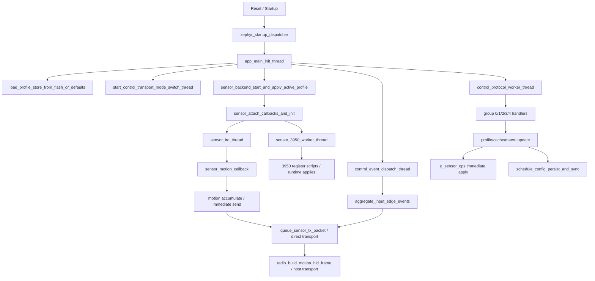
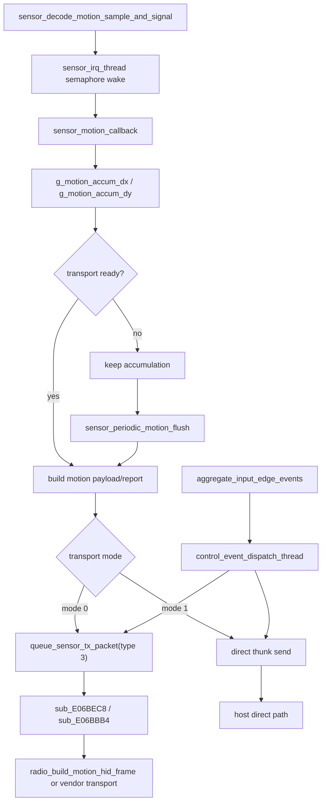

# CRDRAKO 54H Mouse Firmware Architecture and Behavior Analysis

> [!IMPORTANT]
> <sub><strong>Reverse-Engineering Notice:</strong> This report is provided solely for lawful interoperability research, defensive security analysis, education, archival study, and owner-authorized repair or maintenance. It does not authorize unauthorized flashing, redistribution, circumvention, infringement, or other unlawful use; all third-party rights remain with their respective owners.</sub>

## Why This Family Was Selected

This report is included because the CRDRAKO family serves as a representative sample of high-end wireless gaming mouse firmware delivered by a specialized embedded solution provider. It is useful as a reference point for the implementation patterns, engineering maturity, and overall firmware level seen across a large share of the commercial market.

## 0. Document Notes

### 0.1 Objective

This document consolidates the reverse-engineering conclusions for mouse firmware `54H_mouse_Cpurad_App_v01.06.01.12`, with emphasis on the following topics:

- firmware code framework and module boundaries
- threads, callbacks, queues, and runtime organization
- the path from raw sensor motion samples to final host reports
- WebHID / Vendor configuration protocol, opcodes, and configuration field semantics
- runtime modes and 3950 register scripts associated with the competition-mode switch
- motion / event timing logic that truly belongs to the firmware layer
- sleep, wakeup, power-management, and reset-supervision paths

### 0.2 Basis of Analysis

This file uses the current IDA Pro reverse-engineering database as the primary source, with auxiliary reference to the following material:

- IDA database: `/54H_mouse_Cpurad_App_v01.06.01.12.hex.i64`

### 0.3 Update Section (Updated: 2026-04-30, New Firmware: `54H_mouse_Cpurad_App_v01.07.01.14.bin`, vs `v01.06.01.12`)

#### 0.3.1 Conclusion

This update is a clear productization iteration rather than a simple parameter refresh. The firmware base has not changed: it still follows the same `Zephyr + PAW3950 + profile/macro/protocol` line. The main delta is in runtime organization and in the expansion of product-facing subsystems.

The previous version, as reflected in the old report and the old decompiled C, was still heavily centered on `feature_report_rx_thread`, `control_protocol_worker_thread`, `control_event_dispatch_thread`, `control_transport_mode_switch_thread`, and the `sensor_3950_worker_thread + sensor_irq_thread` pair. The new image keeps that general backbone, but it exposes a much broader set of named background services.

#### 0.3.2 Confirmed Changes

##### 1. The build baseline is now explicit

- The new firmware directly exposes:
  - `Booting nRF Connect SDK v3.1.0-6c6e5b32496e`
  - `Using Zephyr OS v4.1.99-1612683d4010`
- In the older version, the platform family could be inferred from the runtime model. In the new version, the SDK / OS combination is directly visible in the image.

##### 2. Runtime task decomposition increased substantially

Compared with the old version, which relied on a smaller number of large worker threads, the new startup path now creates the following named services:

| New runtime unit | Creation site | Functional direction |
| --- | --- | --- |
| `battery_adc_thread` | `sub_E05C5C8` | battery sampling |
| `Button liftoff Thread` | `sub_E05D490` | button release / edge handling |
| `Button event Main Thread` | `sub_E05E19C` | input-event aggregation |
| `Keep CPU alive Thread` | `sub_E05E4C0` | keepalive policy |
| `effect process Thread` | `sub_E05ED4C` | effect-side processing |
| `Sleep Wakeup check Thread` | `sub_E05F044` | sleep / wake checking |
| `SPI_Prepare_Thread` | `sub_E05FB10` | sensor-side SPI preparation |
| `rf_voice_ctrl cmd process Thread` | `sub_E060310` | auxiliary RF-side command path |
| `macro Main Thread` | `sub_E0619D4` | macro service |
| `system mode Thread` | `sub_E061D34` | mode management |
| `Protocol cmd process Thread` | `sub_E062538` | protocol command execution |
| `RF_test_Thread` | `sub_E0632F8` | RF test path |
| `usbd_app` | `sub_E064620` | USB application-side service |
| `RF_RX_DECODE_Thread` | `sub_E0654A0` | RF receive decode stage |
| `RF_RX_RECV_Thread` | `sub_E0659B4` | RF receive receive stage |
| `usbd` | `sub_E0688B8` | USB device-side service |
| `PAW3950 Main Thread` + `PAW3950 Poll done Thread` | `sub_E070188` | sensor main loop and poll-completion handling |

From an engineering perspective, this is the most visible architectural change in the new image. The firmware moved from a model where a few large workers carried most responsibilities toward a model where responsibilities are broken out by product subsystem.

##### 3. The sensor backend is now organized as a clearer pipeline

- The old report described the 3950 backend mainly through `sensor_3950_worker_thread` and `sensor_irq_thread`.
- The new image explicitly adds:
  - `SPI_Prepare_Thread`
  - `PAW3950 Main Thread`
  - `PAW3950 Poll done Thread`
- `sub_E070230()` shows a staged PAW3950 handshake / bring-up path.
- `sub_E070530()` shows a batch replay of cached runtime parameters after that bring-up completes.

This indicates a more complete backend organization, with bus preparation, main backend work, and poll-completion handling exposed as separate stages.

##### 4. Power and battery logic became explicit subsystems

- The new image adds:
  - `battery_adc_thread`
  - `Keep CPU alive Thread`
  - `Sleep Wakeup check Thread`
- In the older version, low-power and recovery logic was still described mainly through transport switching and reset supervision.

The new organization is closer to a product firmware structure, because battery sampling, keepalive behavior, and wake-state checks are now independent scheduled services.

##### 5. USB and RF receive paths are more complete

- New strings directly expose:
  - `USBHS_CORE`
  - `hid_dev_0/1/2`
  - `hid_0/1/2`
  - `usbhs@86000`
- New threads also include:
  - `usbd_app`
  - `usbd`
  - `RF_RX_DECODE_Thread`
  - `RF_RX_RECV_Thread`
  - `RF_test_Thread`

Relative to the older report, which emphasized feature-report ingress and unified control handling, the new version presents a much more explicit USB device stack and RF receive pipeline.

##### 6. Side-feature surface area expanded

- `effect process Thread` shows that effect-side handling has been separated.
- `rf_voice_ctrl cmd process Thread` shows an additional RF-side auxiliary command path.
- The product string `KO-ONE` is also present in the new binary.

This suggests that the new build is not only reorganizing internals, but also carrying a broader product-facing feature surface.

#### 0.3.3 What Did Not Change

- The new image still follows the same family direction:
  - still Zephyr / nRF Connect SDK based
  - still PAW3950 based
  - still driven by the same profile / protocol / macro model
- As a result, the update is better understood as an extension of the old base rather than a redesign.

#### 0.3.4 Engineering Meaning

Relative to `v01.06.01.12`, the new version is more complete as a product firmware. USB, RF receive, battery management, sleep/wakeup handling, and sensor-backend orchestration are all more explicit and easier to identify in the runtime structure.

At the same time, the evolution remains incremental. Capability is expanded by adding background services and state organization on top of the old base, rather than by performing a converging architecture cleanup. In other words, this is a materially richer update, but not a from-scratch rewrite.

#### 0.3.5 Protocol-Field and Profile-Semantic Update

In `v01.06.01.12`, the active-configuration hot path still looked very close to a direct `214B profile` record model: fixed offsets were updated, and runtime behavior was driven almost immediately through `g_sensor_ops`. In `v01.07.01.14`, the `sub_E070530()` / `sub_E0705C0()` path is already organized differently: active settings are first expanded into scalar caches, and are then replayed through internal message cases and sensor-side script selection. That means the old “profile offset equals runtime meaning” reading model still works partially, but it no longer describes the full hot path.

| Old field / structure | Meaning in `v01.06.01.12` | Landing point in `v01.07.01.14` | Update reading |
| --- | --- | --- | --- |
| `profile +0x35/+0x37`, `+0x39/+0x3B`, `+0x5C` | active DPI pair, secondary DPI pair, and the selector between them | `word_2300A4CA/word_2300A4C8`, internal `case 2`, `sub_E070530()`; `sub_E0705C0()` still preserves the `6999 DPI` threshold coupling | The DPI pair itself is clearly retained, but it is no longer exposed as a single profile-byte-driven callback path. The old standalone `+0x5C` selector is no longer visible as an independent field in this hot path and appears to have been absorbed into cached state and mode state |
| `profile +0x59` | `LOD code` | `byte_2300B882`, internal `case 5` | High-confidence carry-over. The new version still keeps a raw encoded byte with backend/mode-dependent value handling, but it is no longer presented as a naked profile offset |
| `profile +0x5A` | `Angle Tune` | `byte_2300B87F`, internal `case 8` | High-confidence carry-over. The old scalar tuning item remains a dedicated scalar cache plus a dedicated apply case |
| `profile +0x54` | `Motion Sync` | very likely `byte_2300B87E`, internal `case 9`, `sub_E06FE2C()` / `sub_E070490()` | High-probability mapping. This is no longer a simple boolean callback; it has become an explicit enable/disable sequence with register-bit and parameter replay on the sensor side |
| `profile +0x55`, `+0x56`, `+0x58` | `Angle Snap`, `Ripple Control`, and `XY Sync` | `byte_2300B883`, `byte_2300B881`, `byte_2300B880`, via internal `case 4/6/7` | It is clear that these three small boolean sensor options still exist, but the new version materializes them as separate active caches. From the worker thread alone, the exact one-to-one naming of `case 4/6/7` is not yet fully disambiguated; one more hop through the outer protocol dispatcher is still needed |
| `profile +0x57`, `+0x5B` | `Hyper Mode`, `Competition Mode`, with polling/perf coupling | `byte_2300B885`, `byte_2300B884`, internal `case 3`, and the sensor-script set `sub_E076FB8()`, `sub_E0772B6()`, `sub_E0775B4()`, `sub_E07798A()`, `sub_E077CB2()`, `sub_E077FDE()` | This is the clearest semantic rewrite in the update. The old model used two profile flags plus conditional branches; the new model is an explicit state machine with a requested mode value, a currently applied backend-script class, and multiple script entry points. `value == 4` still preserves the `6999 DPI` threshold driven auto-selection path |
| `profile +0x53` | mixed polling / perf control byte | no longer exposed as a single hot profile field in the current new worker path; only outer state such as the `case 1/10` replay gate, `byte_2300B87C/byte_2300B87D`, and `word_2300A49C` remains visible | This does not prove the control disappeared, but it does show that it no longer sits next to the other hot sensor fields in the same obvious contiguous profile-byte form |

The engineering meaning of this update is straightforward: the old version was much closer to “storage layout equals runtime semantics,” while the new version already separates storage semantics, active caches, internal commands, and backend scripts into four layers. The direct payoff is that sensor bring-up can be followed by a centralized replay through `sub_E070530()`, which is better suited for initialization failure handling, backend switching, and mode re-entry.

At the same time, the current evidence only proves that the runtime hot path has been re-serialized. It is not yet sufficient, from this path alone, to claim that the persistent blob underneath has fully abandoned the old `214B profile` structure. What is confirmed is the semantic shift: behavior is no longer driven by fixed offsets alone, but by cached state plus an internal state machine.

---

## 1. Overall Firmware Framework

### 1.1 Runtime Model

The overall runtime model of this firmware is:

- `Zephyr-style RTOS multithreading + callbacks + queues + interrupt/semaphore mixed model`
- High-frequency data path:
  - raw sample decode in `sensor_decode_motion_sample_and_signal`
  - `sensor_irq_thread` `0xE07C084`
  - `sensor_motion_callback` `0xE06FCE8`
  - `sensor_periodic_motion_flush` `0xE0700A4`
- Foreground control path:
  - control frontend receive thread `feature_report_rx_thread` `0xE06F9B4`
  - unified command execution thread `control_protocol_worker_thread`
  - asynchronous event thread `control_event_dispatch_thread`
  - transport-mode switch thread `control_transport_mode_switch_thread`

### 1.2 Main Module Breakdown

| Subsystem | Primary responsibility | Representative functions / objects |
| --- | --- | --- |
| Startup and thread framework | static init, application init, thread creation | `zephyr_startup_dispatcher`, `app_main_init_thread` |
| Configuration storage | load profile blob, CRC validation, default fallback, persistence scheduling | `load_profile_store_from_flash_or_defaults`, `schedule_config_persist_and_sync`, `g_default_profile_store_blob` |
| Configuration protocol / command entry | parse group/cmd and call subsystems | `control_protocol_worker_thread`, `handle_device_misc_command_group`, `handle_perf_sensor_command_group` |
| Sensor abstraction layer | map protocol items to the 3950 backend vtable | `g_sensor_ops`, `apply_active_profile_runtime_state`, each `set_*_from_command` |
| 3950 backend | initialization, control-message handling, register-script application | `sensor_3950_initialize`, `sensor_3950_worker_thread`, `sensor_3950_load_startup_register_table` |
| Input subsystem | motion samples, button edges / extended event aggregation | `sensor_decode_motion_sample_and_signal`, `sensor_motion_callback`, `aggregate_input_edge_events` |
| Output subsystem | build motion packets / status packets and queue them | `queue_sensor_tx_packet`, `queue_control_status_report`, `radio_build_motion_hid_frame` |
| Macro storage | 20-slot index, flash page allocation, chunked read/write | `macro_slot_allocate_storage`, `macro_slot_write_chunk`, `macro_slot_delete` |
| Power and recovery | transport switching, supervisor timer, reset requests | `control_transport_mode_switch_thread`, `reset_supervisor_thread`, `request_system_reset_forever` |

### 1.3 Startup Phase

During startup, the firmware establishes the system in the following order:

1. `zephyr_startup_dispatcher()` prints the Zephyr banner, walks the static init table `unk_E084BB0`, and then transfers into the application initialization thread.
2. `app_main_init_thread()` performs hardware / watchdog-style initialization and calls `load_profile_store_from_flash_or_defaults()` to load configuration.
3. It initializes the control channel, asynchronous event thread, macro thread, transport-mode switch thread, and wireless / transport worker threads.
4. It calls `sensor_backend_start_and_apply_active_profile()`, binds the 3950 callbacks, and starts `sensor_3950_worker_thread + sensor_irq_thread`.
5. `sensor_3950_initialize()` executes the one-time startup register table and, once ready, restores runtime state including DPI, LOD, Motion Sync, Angle Snap, Ripple, Angle Tune, and perf mode.
6. The main initialization thread then enters a long-lived wait / semaphore-style maintenance loop.

### 1.4 Runtime Phase

- Data sampling path
  - `sensor_decode_motion_sample_and_signal` decodes raw samples and posts a semaphore
  - `sensor_irq_thread` indirectly calls `sensor_motion_callback` through the installed callback
- Report generation path
  - motion accumulation first enters `g_motion_accum_dx/g_motion_accum_dy`
  - then follows either a direct-send path or the `queue_sensor_tx_packet()` queue path depending on transport mode
  - on the wireless side, `radio_build_motion_hid_frame()` finally constructs a compact HID frame
- Configuration handling path
  - the transport frontend thread receives packets and converts them to internal requests
  - `control_protocol_worker_thread` executes command groups `0..4` in a unified way
  - after writing profile / cache / macro data, it triggers `schedule_config_persist_and_sync()`
- Mode switching path
  - profile switching, DPI switching, Hyper / Competition switching, and delayed profile-subblock application all coordinate through the unified event thread and the sensor backend
- Low-power / recovery path
  - `control_transport_mode_switch_thread` and `reset_supervisor_thread` jointly participate in transport switching and supervision
  - this round of analysis has firmly established the "supervised reset and recovery" path; deeper SoC sleep-level classification is not the focus of this report

### 1.5 Code Design Style

#### Feature 1: State Organization

- `large number of global variables + small context structures + task queues`
- Notes:
  - for example, profile runtime state is spread across global objects such as `g_profile_storage/g_profile_records`, `g_active_dpi_x/g_active_dpi_y`, `g_motion_queue_payload`, and `byte_2300B87D`
  - the sensor backend uses `g_sensor_ops` to separate "protocol logic" from the "3950-specific implementation"

#### Feature 2: Division Between Interrupts and Foreground Threads

- IRQ / callback context mainly performs:
  - raw sample decode
  - semaphore / event wakeups
  - small status-bit updates
- Foreground threads mainly perform:
  - register-script writes
  - updates to profile / macro / cache state
  - construction of asynchronous status packets and motion packets

#### Feature 3: Configuration Application Style

- `update RAM profile / cache first, then immediately apply to the sensor backend only if the profile is active, while persistence is scheduled asynchronously`
- Notes:
  - almost all group 1/2/3 commands follow the pattern "update RAM -> if current profile is active, call `g_sensor_ops` -> `schedule_config_persist_and_sync()` -> `queue_control_status_report()`"

#### Feature 4: Mode Implementation Style

- `bitmap switches + enumerated perf mode + long register-script driven behavior`
- Notes:
  - competition mode is not just a UI boolean; it ultimately drives `sensor_backend_apply_perf_mode()` and selects different 3950 register scripts

---

## 2. Configuration System and Command Entry

### 2.1 Chapter Boundary

This chapter keeps only the runtime path of "where commands enter and how they are executed". Configuration image layout, profile fields, macro storage, packet format, and configuration-item mapping are all consolidated into Chapter 7 to avoid repeating the protocol summary.

### 2.2 Configuration Command Entry Points

The command entry points are described by transport channel:

#### USB / WebHID / HID Feature

- Control frontend receive thread: `feature_report_rx_thread` `0xE06F9B4`
- Frontend workspace: `unk_23009818` and the surrounding 20-byte structure
- Internal dispatch function: `sub_E07103C()`
- Unified execution entry: `control_protocol_worker_thread()`
- Working model: the frontend thread converts each received control frame into an internal work item, and the unified worker executes it by `group/cmd`

#### BLE / GATT / Vendor Service

- This report does not expand BLE as a separate configuration entry path.

#### 2.4G / Vendor Custom Protocol

- Outbound asynchronous packet entry: `queue_sensor_tx_packet()` -> `sub_E06BEC8()` -> `sub_E06BBB4()`
- Wireless motion-frame construction: `radio_build_motion_hid_frame()`
- Wireless scheduling configuration: `radio_apply_polling_schedule_profile()`, `radio_restart_timeslot_scheduler()`
- Queue messages are organized by internal packet type and payload length, without a separate checksum field being appended.

### 2.3 Configuration Execution Model

The configuration execution style of this firmware can be summarized as:

- `frontend receives packet -> unified worker executes by group/cmd -> write RAM profile/cache/macro -> if current profile is active, immediately apply to g_sensor_ops -> schedule asynchronous status reporting and persistence`

Advantages:

- all configuration items ultimately land in the same profile / cache objects, giving good power-loss recovery consistency
- 3950 register writes are isolated in the sensor backend, keeping a clear boundary between the protocol layer and the hardware layer
- asynchronous `queue_control_status_report()` decouples UI state echo from the core configuration-write logic

Reading notes:

- In this report, `feature_report_rx_thread` is treated uniformly as the "control frontend receive layer", without further splitting by lower transport bus.
- Aliasing between `g_profile_storage` and `g_profile_records` can make decompiled offsets look misleading; analysis must return to copy sizes and stride constants.
- Some low offsets, such as `+0x17/+0x18`, only have stable command-level semantics, so this report focuses on engineering behavior rather than forcing overly specific field names.

---
## 3. Sensor Motion Data Flow

### 3.1 Sampling Entry

The sensor sampling entry functions / interrupt / callback chain are:

- raw sample decode: `sensor_decode_motion_sample_and_signal(unsigned char *raw, ...)`
- IRQ thread: `sensor_irq_thread()`
- callback installation: `sensor_attach_callbacks_and_init()` writes `motion_cb/raw_cb/ready_cb` into `unk_2300A3C4/unk_2300A3C0/unk_2300A3BC`
- final motion callback: `sensor_motion_callback(sensor_motion_sample_t *sample)`
- sampling trigger method:
  - after 3950 raw sample decode, a semaphore is posted
  - `sensor_irq_thread` blocks on that semaphore and, once awakened, calls the installed motion callback

### 3.2 Raw Data Decode

`sensor_decode_motion_sample_and_signal()` performs the following conversions on the sample bytes:

| Raw field | Meaning | Target variable / structure |
| --- | --- | --- |
| `raw[0] >> 7` | motion status bit | `g_sensor_sample_motion_flag` |
| `raw[0] & 0x08` | extra status bit | `g_sensor_sample_aux_flag` |
| `(raw[0] & 0x20) == 0` | sample status bit; later participates in error / recovery gating in `sub_E07C330()` | `g_sensor_sample_bit20_clear` |
| `raw[1]` | extra sample status / flag byte | local output `out_value` |
| `*(uint16_t *)(raw + 2)` | `dx` | `g_sensor_sample_dx` |
| `*(uint16_t *)(raw + 4)` | `dy` | `g_sensor_sample_dy` |

Notes:

- The assignment paths for `dx/dy`, `motion flag`, `aux flag`, and `bit20_clear` were all directly confirmed in IDA.
- This section records only the actual bit operations and storage destinations that occur in the firmware. If needed later, these bits can be mapped more precisely to the 3950 datasheet fields in a separate register / burst-field appendix.

### 3.3 Intermediate Accumulation and Shaping

The intermediate state between raw motion and final output is:

- Accumulator variables:
  - `g_motion_accum_dx`
  - `g_motion_accum_dy`
- Handling model:
  - every sample received by `sensor_motion_callback()` is first accumulated into those two variables
  - if the current transport can send, the function immediately tries to build the current payload / report and clears the accumulators only after success
  - if the transport does not send at that moment, the accumulated values are kept until the next periodic flush in `sensor_periodic_motion_flush()`
- Smoothing / filtering:
  - between `sensor_decode_motion_sample_and_signal()` and `sensor_motion_callback()`, there is no additional software smoothing / filtering branch
  - options such as Motion Sync, Ripple, and Angle Snap are primarily implemented through 3950 register scripts and should not be mischaracterized as software algorithms in this section
- Event scheduling:
  - `sample->has_button_event` triggers `sub_E068ADC()` or `sub_E068B14()` and intersects with the button-event pipeline

### 3.4 Data Paths Under Different Transport Modes

#### transport mode 0

1. `sensor_motion_callback()` builds a local 8-byte payload and writes it into `g_motion_queue_payload[0..7]`.
2. The payload contains button bits and `dx/dy`.
3. It calls `queue_sensor_tx_packet(3, ..., 8)` to try entering the transmit queue. That helper itself also checks `BYTE1(g_control_transport_mode)`, so successful enqueueing depends on higher-level transport state as well.
4. The queue item is later consumed by `sub_E06BEC8()` and then forwarded into `sub_E06BBB4()`.

Engineering interpretation:

- This path first enqueues the payload and then routes it through a unified backend path.
- What IDA directly confirms is that this path depends on the internal packet queue rather than a RAM-thunk direct-send path.

#### transport mode 1

1. `sensor_motion_callback()` checks send availability through the RAM thunk `sub_E084490()` / `sub_E084498()` and transmits the report through that direct path.
2. If sending succeeds, the accumulated `dx/dy` are cleared.
3. Some paths also process button bits and call `refresh_activity_supervisor_timer()` to maintain the activity timer.

Engineering interpretation:

- This is a more direct transmit path and does not pass through `queue_sensor_tx_packet()`.
- What IDA directly confirms is that `sub_E084490()` / `sub_E084498()` form a direct-send branch independent of the packet queue.

#### Wireless HID frame construction path

- `radio_build_motion_hid_frame()` packs the current button bits, status bits, and `dx/dy` into a compact wireless HID frame.
- `sub_E087DEC()` is its higher-level scheduling / transmit path, subject to the wireless state machine and polling-schedule parameters.

### 3.5 Wheel Data Path

The wheel path is described separately:

- Wheel / extended input event aggregation exists:
  - `aggregate_input_edge_events()` handles multiple event types and posts bit-level changes into event objects such as `587241424` / `587241420`
  - `control_event_dispatch_thread()` converts case `5/6` class events into short packets and routes them through either the direct path or `queue_sensor_tx_packet(9)` depending on transport mode
- Configuration items related to the wheel:
  - `Tournament Scroll / Window Time` is read and written through group 0 `cmd 0x19/0x99`
- This report covers the firmware-layer path of "configuration entry -> event aggregation -> asynchronous short packet" and does not further expand the lower-level wheel sampling peripheral.

### 3.6 Final Report Generation

The final report is formed as follows:

- Standard motion report:
  - mode 1 direct path: `sensor_motion_callback()` / `sensor_periodic_motion_flush()` -> RAM-thunk send
  - mode 0 queue path: `queue_sensor_tx_packet(3)` -> `sub_E06BEC8()` -> `sub_E06BBB4()` -> backend send
- Wireless final HID frame:
  - `radio_build_motion_hid_frame()`
- Asynchronous status / configuration echo:
  - `queue_control_status_report()` builds 8-byte status packets according to report kind
- Busy retry / carry retention:
  - if the current path fails to send, `g_motion_accum_dx/g_motion_accum_dy` are not cleared, and later samples or the next periodic flush continue trying
- Cases where no packet is sent:
  - `queue_sensor_tx_packet()` works only when `BYTE1(g_control_transport_mode)` is non-zero
  - the mode 1 direct-send path first checks thunk return status; if not ready, it neither clears the accumulators nor transmits

---

## 4. Competition Mode

### 4.1 Mode Definition

In this firmware, "Competition Mode" is not a single boolean state independent of other options. It is one part of the 3950 backend `perf mode` selection chain. Three profile fields are directly involved in that chain:

- `profile +0x53`: polling code / perf-rate code
- `profile +0x57`: Hyper Mode bit
- `profile +0x5B`: Competition Mode bit

In IDA, `set_hyper_mode_enabled_from_command()`, `set_competition_mode_enabled_from_command()`, and `apply_polling_rate_command()` all directly call `g_sensor_ops->apply_perf_mode()`. This shows that the real hardware meaning of "Competition Mode" is not the UI toggle itself, but switching the 3950 into a different perf-mode register-script family.

### 4.2 Mode Selection Logic

From IDA decompilation and disassembly, the selection chain can be reconstructed directly:

1. `set_hyper_mode_enabled_from_command()` writes `profile +0x57`.
2. `set_competition_mode_enabled_from_command()` writes `profile +0x5B`.
3. After updating `profile +0x53`, `apply_polling_rate_command()` re-selects the backend perf mode that matches the current rate code.
4. `sensor_backend_apply_perf_mode()` packages the target mode as worker message `case 3` and hands it to `sensor_3950_worker_thread()` to execute the actual script.

For user-visible configuration combinations, the firmware's internal mode reduction is as follows:

| Hyper | Competition | Rate-code effect | Final perf mode |
| --- | --- | --- | --- |
| `0` | `0/1` | low-rate codes pull the backend back to the base script | `2` |
| `1` | `0` | high-rate codes / the Hyper path switch to the high-performance script family | `4` |
| `1` | `1` | once Competition is enabled, it forces the competition script | `5` |

Additional notes:

- `Competition` only pushes the backend to `perf mode 5` when `Hyper` is enabled. If `Hyper` is off, the code falls straight back to `perf mode 2`.
- `apply_polling_rate_command()` divides `g_active_polling_code` into two groups:
  - `0x20/0x40/0x80` belong to the high-performance rate-code group, which returns to `mode 4` when Competition is off
  - `0x01/0x02/0x04/0x08/0x10` take the base script path, which returns to `mode 2` when Competition is off
- `sensor_backend_apply_perf_mode(4)` is not a single-script call. It first chooses a `mode 4` sub-selector based on the two cached 16-bit DPI words, then packages that as the worker message.
- In `sensor_3950_worker_thread()`, after `case 2` writes `reg 0x48..0x4B`, it checks the `0x1B57` (`6999`) threshold again using `g_sensor_cached_dpi_x/g_sensor_cached_dpi_y` and, if needed, posts another `case 3` so the final `mode 4` script is corrected to match the current DPI stage.
- When `g_sensor_backend_id == 2`, the Competition-enabled path is rejected and `mode 5` is not forcibly applied.

### 4.3 Register / Parameter Writes for Each Mode

The `v42/v43` dispatch inside `sensor_3950_worker_thread(case 3)` can be organized into the following script families. The list below follows the real function boundaries and real register writes in IDA. For readability, the repeated bank-switch writes `reg 0x7F = bank` are omitted and only the effective register assignments within each bank are kept.

| Internal perf mode | Worker selector | Function | Description |
| --- | --- | --- | --- |
| `1` | `v42 = 1` | `sub_E083F76` | 3950 perf script 1 |
| `2` | `v42 = 2` | `sub_E083C4A` | 3950 perf script 2 |
| `3` | `v42 = 3` | `sub_E083922` | 3950 perf script 3 |
| `4A` | `v42 = 4, v43 = 1` | `sub_E082F50` | high-DPI variant of perf mode 4; worker `case 2` ultimately lands here when either axis is `> 6999` |
| `4B` | `v42 = 4, v43 = 2` | `sub_E08324E` | low-DPI variant of perf mode 4; worker `case 2` ultimately lands here when both axes are `<= 6999` |
| `5` | `v42 = 5` | `sub_E08354C` | script used by Competition mode |

#### perf mode 1 / `sub_E083F76`

Entry characteristic:
First reads `bank 0, reg 0x40`, then writes back `reg 0x40 = (old & 0xFC) | 0x02` at the end.

Full write set:
bank `0x07`: `0x40=0x40, 0x42=0x28, 0x43=0x00`
bank `0x05`: `0x43=0xE4, 0x44=0x05, 0x49=0x10, 0x51=0x28, 0x53=0x30, 0x55=0xFB, 0x5B=0xFB, 0x5F=0x90, 0x61=0x3B, 0x6D=0xB8, 0x6E=0xDF, 0x7B=0x10`
bank `0x06`: `0x53=0x03, 0x62=0x01, 0x7A=0x02, 0x6B=0x20, 0x6D=0x8F, 0x6E=0x70, 0x6F=0x04`
bank `0x09`: `0x40=0x01, 0x43=0x13, 0x44=0x88, 0x47=0x00, 0x4F=0x0C, 0x51=0x04, 0x55=0x3F, 0x56=0x3F, 0x59=0x0F, 0x5A=0x0F, 0x73=0x0C`
bank `0x0A`: `0x4A=0x14`
bank `0x19`: `0x41=0x53, 0x47=0x64, 0x4B=0x02, 0x4C=0x02`
bank `0x0C`: `0x4A=0x1C, 0x4B=0x14, 0x4C=0x4F, 0x4D=0x02, 0x50=0x00, 0x51=0x01, 0x53=0x16, 0x55=0x10, 0x62=0x18`
bank `0x14`: `0x62=0x14`
bank `0x18`: `0x48=0x65, 0x50=0x34, 0x51=0x54, 0x52=0x38, 0x53=0x5F, 0x55=0x7F, 0x61=0x1C, 0x62=0x60, 0x63=0xFF, 0x64=0x00, 0x70=0x22, 0x71=0xF2, 0x72=0xF6, 0x77=0x32, 0x79=0xCC`
bank `0x00`: `0x4E=0x00, 0x4F=0x4F, 0x51=0x00, 0x52=0x4F, 0x47=0x01, 0x54=0x52, 0x5A=0x80, 0x78=0x0A, 0x79=0x10, 0x40=(old & 0xFC) | 0x02`

#### perf mode 2 / `sub_E083C4A`

Entry characteristic:
First reads `bank 0, reg 0x40`, then writes back `reg 0x40 = (old & 0xFC) | 0x01` at the end.

Full write set:
bank `0x07`: `0x40=0x41, 0x42=0x28, 0x43=0x00`
bank `0x05`: `0x43=0xE4, 0x44=0x05, 0x49=0x10, 0x51=0x40, 0x53=0x40, 0x55=0xFC, 0x5B=0xFC, 0x5F=0x90, 0x61=0x3B, 0x6D=0xB8, 0x6E=0xDF, 0x7B=0x10`
bank `0x06`: `0x53=0x03, 0x62=0x01, 0x7A=0x02, 0x6B=0x20, 0x6D=0x8F, 0x6E=0x70, 0x6F=0x04`
bank `0x09`: `0x40=0x01, 0x43=0x13, 0x44=0x88, 0x47=0x00, 0x4F=0x0C, 0x51=0x04, 0x55=0x3F, 0x56=0x3F, 0x59=0x0F, 0x5A=0x0F, 0x73=0x0C`
bank `0x0A`: `0x4A=0x11`
bank `0x19`: `0x41=0x32, 0x47=0x12, 0x4B=0x01, 0x4C=0x01`
bank `0x0C`: `0x4A=0x1C, 0x4B=0x14, 0x4C=0x4F, 0x4D=0x02, 0x50=0x00, 0x51=0x01, 0x53=0x16, 0x55=0x10, 0x62=0x18`
bank `0x14`: `0x62=0x14`
bank `0x18`: `0x48=0x65, 0x50=0x34, 0x51=0x54, 0x52=0x38, 0x53=0x5F, 0x55=0x7F, 0x61=0x1C, 0x62=0x60, 0x63=0xFF, 0x64=0x00, 0x70=0x22, 0x71=0xF2, 0x72=0xF6, 0x77=0x32, 0x79=0xCC`
bank `0x00`: `0x4E=0x00, 0x4F=0x4F, 0x51=0x00, 0x52=0x4F, 0x47=0x01, 0x54=0x53, 0x5A=0x80, 0x78=0x01, 0x79=0x9C, 0x40=(old & 0xFC) | 0x01`

#### perf mode 3 / `sub_E083922`

Entry characteristic:
First reads `bank 0, reg 0x40`, then writes back `reg 0x40 = old & 0xFC` at the end.

Full write set:
bank `0x07`: `0x40=0x41, 0x42=0x28, 0x43=0x00`
bank `0x05`: `0x43=0xE4, 0x44=0x05, 0x49=0x10, 0x51=0x40, 0x53=0x40, 0x55=0xFB, 0x5B=0xFB, 0x5F=0x90, 0x61=0x31, 0x6D=0xB8, 0x6E=0xCF, 0x7B=0x10`
bank `0x06`: `0x53=0x03, 0x62=0x01, 0x7A=0x02, 0x6B=0x20, 0x6D=0x8F, 0x6E=0x70, 0x6F=0x04`
bank `0x09`: `0x40=0x01, 0x43=0x13, 0x44=0x88, 0x47=0x00, 0x4F=0x0C, 0x51=0x04, 0x55=0x3F, 0x56=0x3F, 0x59=0x0F, 0x5A=0x0F, 0x73=0x0C`
bank `0x0A`: `0x4A=0x14`
bank `0x19`: `0x41=0x32, 0x47=0x12, 0x4B=0x01, 0x4C=0x01`
bank `0x0C`: `0x4A=0x1C, 0x4B=0x14, 0x4C=0x4F, 0x4D=0x02, 0x50=0x00, 0x51=0x01, 0x53=0x16, 0x55=0x10, 0x62=0x18`
bank `0x14`: `0x62=0x14`
bank `0x18`: `0x48=0x65, 0x50=0x34, 0x51=0x54, 0x52=0x38, 0x53=0x5F, 0x55=0x7F, 0x61=0x1C, 0x62=0x60, 0x63=0xFF, 0x64=0x00, 0x70=0x22, 0x71=0xF2, 0x72=0xF6, 0x77=0x32, 0x79=0xCC`
bank `0x00`: `0x4E=0x00, 0x4F=0x4F, 0x51=0x00, 0x52=0x4F, 0x47=0x01, 0x54=0x53, 0x5A=0x80, 0x78=0x01, 0x79=0x9C, 0x40=old & 0xFC`

#### perf mode 4A / `sub_E082F50`

Full write set:
bank `0x07`: `0x40=0x41, 0x42=0x14, 0x43=0x00`
bank `0x05`: `0x43=0x64, 0x44=0x05, 0x49=0x20, 0x51=0x40, 0x53=0x40, 0x55=0xFB, 0x5B=0xFB, 0x5F=0x90, 0x61=0x31, 0x6D=0xB8, 0x6E=0xCF, 0x7B=0x50`
bank `0x06`: `0x53=0x03, 0x62=0x02, 0x7A=0x03, 0x6B=0x20, 0x6D=0x8F, 0x6E=0x70, 0x6F=0x07`
bank `0x09`: `0x40=0x01, 0x43=0x23, 0x44=0x88, 0x47=0x00, 0x4F=0x0C, 0x51=0x04, 0x55=0x3F, 0x56=0x3F, 0x59=0x0F, 0x5A=0x0F, 0x73=0x0C`
bank `0x0A`: `0x4A=0x14`
bank `0x19`: `0x41=0x32, 0x47=0x24, 0x4B=0x02, 0x4C=0x02`
bank `0x0C`: `0x4A=0x20, 0x4B=0x1F, 0x4C=0x5C, 0x4D=0x90, 0x50=0x14, 0x51=0x15, 0x53=0x1E, 0x55=0x02, 0x62=0x02`
bank `0x14`: `0x62=0x14`
bank `0x18`: `0x48=0x55, 0x50=0x18, 0x51=0x40, 0x52=0x20, 0x53=0x38, 0x55=0x68, 0x61=0x0A, 0x62=0x1A, 0x63=0x48, 0x64=0x40, 0x70=0x22, 0x71=0x88, 0x72=0x88, 0x77=0x22, 0x79=0xCB`
bank `0x00`: `0x4C=0x20, 0x4D=0x30, 0x4E=0x28, 0x4F=0x4F, 0x51=0x00, 0x52=0x4F, 0x47=0x01, 0x54=0x55, 0x5A=0x80, 0x5B=0x24, 0x5D=0x02, 0x5E=0x01, 0x6D=0x85, 0x6E=0x0C, 0x6F=0x0A, 0x40=0x83`

#### perf mode 4B / `sub_E08324E`

Full write set:
bank `0x07`: `0x40=0x41, 0x42=0x14, 0x43=0x00`
bank `0x05`: `0x43=0x64, 0x44=0x05, 0x49=0x20, 0x51=0x10, 0x53=0x40, 0x55=0xFB, 0x5B=0xFB, 0x5F=0x80, 0x61=0x31, 0x6D=0xA7, 0x6E=0xCD, 0x7B=0x50`
bank `0x06`: `0x53=0x02, 0x62=0x02, 0x7A=0x03, 0x6B=0x20, 0x6D=0x98, 0x6E=0x80, 0x6F=0x07`
bank `0x09`: `0x40=0x03, 0x43=0x23, 0x44=0x98, 0x47=0x18, 0x4F=0x00, 0x51=0x11, 0x55=0x54, 0x56=0x54, 0x59=0x20, 0x5A=0x20, 0x73=0x0E`
bank `0x0A`: `0x4A=0x14`
bank `0x19`: `0x41=0x32, 0x47=0x24, 0x4B=0x02, 0x4C=0x02`
bank `0x0C`: `0x4A=0x20, 0x4B=0x1F, 0x4C=0x5C, 0x4D=0x90, 0x50=0x14, 0x51=0x15, 0x53=0x1E, 0x55=0x02, 0x62=0x02`
bank `0x14`: `0x62=0x14`
bank `0x18`: `0x48=0x55, 0x50=0x18, 0x51=0x40, 0x52=0x20, 0x53=0x38, 0x55=0x68, 0x61=0x0A, 0x62=0x1A, 0x63=0x48, 0x64=0x40, 0x70=0x22, 0x71=0x88, 0x72=0x88, 0x77=0x22, 0x79=0xCB`
bank `0x00`: `0x4E=0x00, 0x4F=0x95, 0x51=0x00, 0x52=0x95, 0x47=0x01, 0x54=0x55, 0x5A=0x80, 0x40=0x83`

#### perf mode 5 / `sub_E08354C`

Entry characteristic:
The script begins by directly preloading the DPI-related registers to `0x003F / 0x003F`, then executes a main body sharing the same core as `perf mode 4B`, and finally appends the same tail sequence twice in `bank 0`.

Initial DPI preload:
bank `0x00`: `0x48=0x3F, 0x49=0x00, 0x4A=0x3F, 0x4B=0x00, 0x47=0x01`

Main body:
identical to the write set of `perf mode 4B / sub_E08324E` across `bank 0x07/0x05/0x06/0x09/0x0A/0x19/0x0C/0x14/0x18/0x00`.

Competition-mode appended tail:
bank `0x00`: `0x40=0x03, 0x7D=0x0A, 0x77=0xFF, 0x7E=0x77, 0x79=0xFF, 0x7B=0xFF, 0x7A=0x01, 0x40=0x83`
The tail above is repeated twice in succession.

Fixed action after script exit:
After executing `sub_E08354C()`, `sensor_3950_worker_thread()` delays by `0x4E20`, then re-applies the current runtime DPI via `g_sensor_ops->set_dpi_xy()`.

### 4.4 Mode Difference Analysis

#### Commonality

- All scripts batch-dispatch `bank/reg/value` triplets through `sensor_reg_write_u8()`.
- `bank 0x0C/0x14/0x18/0x19` form the most shared common body, and mode `1/2/3/4/5` all write many base parameters in these banks.
- The three script groups `perf mode 1/2/3` all share the structure of "read `reg 0x40` first, then write it back with bit masking at the end".

#### Differences

- The main difference between `perf mode 4A` and `4B` is concentrated in `bank 0x05`, `bank 0x06`, `bank 0x09`, and the tail in `bank 0x00`, indicating that mode 4 itself is a script family with variants.
- Switching between `sub_E082F50` and `sub_E08324E` is not a UI-layer abstraction. It is the worker's final script selection after writing the current DPI and evaluating the `6999 DPI` threshold.
- `perf mode 5` uses `4B` as its main body but adds a DPI preload and two repeated tail rounds, which is its most distinctive signature.
- `perf mode 1/2/3` differ heavily from `4/5` in `bank 0x19`, `bank 0x18`, and the tail in `bank 0x00`, confirming that the firmware really contains multiple performance-script families rather than one parameter set with only minor tuning.

#### Key Engineering Interpretation

- What "Competition Mode" really does in firmware is switch the 3950 into the `perf mode 5` script family.
- The three configuration items `Hyper / Polling / Competition` collectively determine the backend script family, not a single register bit.
- The reason `perf mode 4` needs two variants is that, after DPI is actually written to the 3950, the firmware fixes the script to either the high-DPI or low-DPI variant based on the `6999 DPI` threshold.
- This entire chapter describes the register-script and mode system. It does not belong to firmware-layer motion-shaping algorithms.

### 4.5 Flow Before and After Mode Switch

The Competition-mode and related script switching path can be summarized from the real IDA execution order as follows:

1. The protocol layer first writes fields such as `profile +0x57/+0x5B/+0x53`.
2. `set_hyper_mode_enabled_from_command()`, `set_competition_mode_enabled_from_command()`, or `apply_polling_rate_command()` selects the target `perf mode`.
3. `sensor_backend_apply_perf_mode()` packages that target mode into worker message `case 3`.
4. If the target mode is `4`, the packaging stage already carries a sub-selector. If a later DPI write changes the threshold relation, worker `case 2` posts another `case 3`, so the final result lands in either `sub_E082F50()` or `sub_E08324E()`.
5. If the target mode is `5`, the worker enters `sub_E08354C()`, and after the script finishes it performs a fixed delay and re-applies the current DPI setting.
6. A normal Competition / Hyper switch does not call the full `sensor_3950_initialize()` sequence. Full reinitialization belongs to the separate worker `case 10`.

---

## 5. Vendor-Specific Functionality and Firmware-Layer Motion / Event Processing Algorithms

### 5.1 Feature List

| Feature name | Configuration entry | Effective layer | Firmware-layer algorithm? | Notes |
| --- | --- | --- | --- | --- |
| Motion accumulation and send gating | No separate UI; triggered automatically by the normal motion path | motion processing / output timing | Yes | core responsibility of `sensor_motion_callback` |
| Carry compensation reinjection | internal event bit `0x20` | motion processing / retransmit compensation | Yes | linkage between `aggregate_input_edge_events` and `sensor_motion_callback` |
| Periodic flush | rhythm indirectly determined by `Polling Rate` | output timing | Yes | `sensor_periodic_motion_flush` forces a send attempt on each tick schedule |
| Input-edge aggregation and asynchronous event packetization | buttons / extended inputs / combo keys | event processing | Yes | `aggregate_input_edge_events` + `control_event_dispatch_thread` |
| Mapping from report rate to radio timeslot schedule | `Polling Rate` | output timing / radio scheduling | Yes | affects both flush rhythm and radio subslot density |
| Competition / Hyper / Motion Sync / LOD etc. | group 1 configuration items | sensor registers | No | these belong to the register-script system in Chapter 4 |

### 5.2 Motion Accumulation, Carry Merge, and Immediate Send

#### Functional Positioning

- User-visible behavior: motion is not "mechanically send one packet for every sample". Samples first enter an accumulator, and transport readiness then decides whether a packet is sent immediately.
- Firmware-side goal: merge the sensor sample rate, the link's send window, and button / extended-input events into one stable output rhythm.
- Key objects: `g_motion_accum_dx`, `g_motion_accum_dy`, `g_pending_carry_dx`, `g_pending_carry_dy`, `g_motion_queue_payload[8]`

#### Execution Chain Directly Visible in IDA

1. `sensor_motion_callback(sample)` first checks `sample->has_motion`; if motion is present, it accumulates `sample->dx/dy` into `g_motion_accum_dx/dy`.
2. If `transport mode == 0`, the function clears `g_motion_queue_payload[0..7]`, then fills the 8-byte payload with button bits, extended-event count, and accumulated `dx/dy`, and finally calls `queue_sensor_tx_packet(3, ..., 8)`.
3. If `transport mode == 1`, the function first probes send readiness via `sub_E084490()`, then follows the direct-send path through `sub_E084498()`.
4. On either path, the accumulators are cleared only after a successful send. If transmission fails, the accumulators remain unchanged until the next sample or the next periodic flush.
5. `queue_sensor_tx_packet()` itself also checks `BYTE1(g_control_transport_mode)`, so "queued payload was built" and "payload was actually enqueued" are two different conditions.

#### Carry / Compensation Reinjection

This is a firmware-layer path that was directly nailed down in IDA during this round and is worth calling out separately:

- In `aggregate_input_edge_events()`, `case 8` adds a pair of 16-bit deltas into `g_pending_carry_dx` and `g_pending_carry_dy`, while also setting bit `0x20` in event object `587241424`.
- On the `transport mode == 1` path inside `sensor_motion_callback()`, if that `0x20` bit is observed set, the function clears the bit first, then adds `g_pending_carry_dx/g_pending_carry_dy` back into `g_motion_accum_dx/dy`, and only then transmits.
- This shows that the firmware has a "delayed compensation reinjection" channel: the compensation is not forcibly inserted into the current sample immediately, but is merged back into the accumulator just before the next suitable transmit window.

This is not a sensor-register feature. It is a real firmware-layer event / motion fusion mechanism.

#### Key Functions

| Function | Role |
| --- | --- |
| `sensor_motion_callback` | accumulate `dx/dy`, immediately transmit or keep the accumulation depending on transport state |
| `queue_sensor_tx_packet` | on the `mode 0` path, try to push a motion packet into the asynchronous queue; actual success still depends on the high-byte transport state |
| `sub_E084490` | send-readiness probe for the `mode 1` direct-send path |
| `sub_E084498` | actual send routine for the `mode 1` direct-send path |
| `refresh_activity_supervisor_timer` | refreshes the activity timer after successful motion or short-event sends |

#### Pseudocode

```c
on_motion_sample(sample):
    if (sample.has_motion) {
        accum_dx += sample.dx;
        accum_dy += sample.dy;
    }

    if (transport_mode == 0) {
        build_8byte_motion_payload(button_bits, edge_count, accum_dx, accum_dy);
        if (queue_sensor_tx_packet(TYPE_MOTION, payload, 8)) {
            accum_dx = 0;
            accum_dy = 0;
            clear_pending_edge_counters_if_needed();
        }
    } else if (transport_mode == 1) {
        if (pending_carry_bit_0x20) {
            clear_pending_carry_bit();
            accum_dx += carry_dx;
            accum_dy += carry_dy;
        }
        if (direct_send_ready() && direct_send_motion() == 1) {
            accum_dx = 0;
            accum_dy = 0;
        }
        if (pending_button_or_edge_bits && direct_send_short_event() == 1) {
            clear_pending_edge_counters();
        }
        refresh_activity_timer();
    }

    dispatch_button_scan_followup(sample.has_button_event);
```

#### Illustrative Examples

- Example 1: if three small motion frames arrive in a row while the current link window is busy, the firmware does not lose those three frames. Instead, it continues accumulating them in `g_motion_accum_dx/dy` and sends them together at the next available opportunity.
- Example 2: if a "delayed compensation delta" appears in the middle, it is not immediately inserted out of order. It is first stored in `g_pending_carry_dx/g_pending_carry_dy`, then merged back into the accumulator just before the next direct-send window.

#### Engineering Conclusion

- What this logic truly changes is: `send timing, accumulation behavior, and when retransmit compensation is merged`
- What it is not: `3950 internal filtering, Angle Snap, Motion Sync, or other register-level features`

### 5.3 Periodic Flush and Coupling to Report Rate

#### The Periodic Flush Itself

`sensor_periodic_motion_flush()` is not a trivial timer callback. It is the second transmit outlet for the motion accumulator:

- `g_motion_flush_tick_counter` increments on every entry.
- When the counter reaches `g_motion_flush_period_ticks`, the function clears the counter and attempts a forced send of the current `g_motion_accum_dx/dy`.
- If the sensor backend provides its own `periodic_flush` callback, that callback is used first. Otherwise, the function reuses the same queued/direct transmit paths as `sensor_motion_callback()`, and also synchronizes any pending short-event count bytes.

Its engineering meaning is: even if no new sample arrives, as long as unsent motion remains in the accumulator, the firmware will still push one send attempt when the flush period is reached.

#### How Report Rate Directly Affects Flush Rhythm

`apply_polling_rate_command()` directly rewrites `g_motion_flush_period_ticks`:

| polling code | `g_motion_flush_period_ticks` | parameter to `sub_E06BAAC()` | backend perf-mode fallback |
| --- | --- | --- | --- |
| `0x80` | `1` | `125` | returns to `mode 4` when Competition is off |
| `0x40` | `1` | `250` | returns to `mode 4` when Competition is off |
| `0x20` | `1` | `500` | returns to `mode 4` when Competition is off |
| `0x10` | `1` | `1000` | returns to `mode 2` when Competition is off |
| `0x01` | `1` | `1000` | returns to `mode 2` when Competition is off |
| `0x02` | `2` | `1000` | returns to `mode 5` when Competition is on |
| `0x04` | `4` | `1000` | returns to `mode 5` when Competition is on |
| `0x08` | `8` | `1000` | returns to `mode 5` when Competition is on |

This table shows one important fact: when the user changes Polling Rate, the firmware is not only changing the radio-side send window, but also directly changing how often the firmware layer forces a flush of the accumulator.

#### Wireless-Side Timeslot Scheduling Mapping

`radio_apply_polling_schedule_profile()` maps the same polling code to wireless scheduling parameters:

| polling code | `g_radio_base_polling_rate_hz` | `g_radio_subslots_per_cycle` |
| --- | --- | --- |
| `0x40` / `0x80` | `125` | `4` |
| `0x20` | `250` | `4` |
| `0x10` / `0x01` | `500` | `4` |
| `0x02` | `1000` | `6` |
| `0x04` | `1000` | `8` |
| `0x08` | `1000` | `12` |

Therefore, a polling code controls three things at the same time:

- flush rhythm
- backend perf-mode fallback
- radio subslot scheduling density

This is a very explicit firmware-layer timing strategy chain, not a single-point register configuration.

### 5.4 Input-Edge Aggregation and Asynchronous Event Packetization

#### What `aggregate_input_edge_events()` Does

In IDA, this is not a simple "read button and send packet immediately" function. It is a 20-slot scanner:

- The main loop iterates 20 times, showing that it scans a fixed slot table of input / macro / extended event sources.
- Each slot has its own delay counter, current position, remaining length, and reload value.
- Different event types follow different aggregation logic.

Among the event types most relevant to feel and timing, the following are key:

- `case 8`: accumulate a pair of displacement deltas into `g_pending_carry_dx/g_pending_carry_dy` and set bit `0x20` on the event object so the motion callback can reinject them before the next send window
- `case 16`: update `byte_2300A6DE` and set bit `0x10` on the event object, which enters the "extra count byte" in the motion packet
- `case 9/10`: set / clear a bitmap and maintain the corresponding counters, ultimately affecting asynchronous short packets or extra button states
- `case 4/5/6/7`: write short-event data into a shared area and signal the event object so `control_event_dispatch_thread()` will package a short report

#### How `control_event_dispatch_thread()` Turns Them Into Host-Visible Events

This thread consumes the internal event queue and then branches by transport mode:

- `transport mode == 0`:
  - button-bit changes use `queue_sensor_tx_packet(2, ...)`
  - extended-state changes use `queue_sensor_tx_packet(6, ...)`
  - some short events use `queue_sensor_tx_packet(9, ...)`
- `transport mode == 1`:
  - the thread first calls `sub_E084490()` to probe send readiness
  - then calls `sub_E084498()` to directly send the short payload
  - after success, it refreshes the activity timer

The engineering implication is clear: button edges, short events, and extended status are not separate auxiliary channels. Like motion, they obey the same transport-ready / direct-send / queued-send strategy.

#### Pseudocode

```c
aggregate_input_edge_events():
    for each slot in 20_slots:
        if slot.delay_not_expired:
            continue;
        event = decode_slot_event(slot);
        switch (event.type) {
        case CARRY_DELTA:
            carry_dx += event.dx;
            carry_dy += event.dy;
            set_event_bit(0x20);
            break;
        case EXTRA_COUNTER:
            extra_counter = event.value;
            set_event_bit(0x10);
            break;
        case BUTTON_SET:
        case BUTTON_CLEAR:
            update_internal_button_bitmap_and_counters();
            break;
        case SHORT_EVENT:
            write_shared_short_event_buffer();
            signal_dispatch_thread();
            break;
        }

control_event_dispatch_thread():
    pop_async_event();
    if (transport_mode == 0)
        queue_sensor_tx_packet(packet_type, payload, len);
    else if (transport_mode == 1)
        direct_send(payload, len);
```

### 5.5 Final Wireless Framing and Subjective Output Behavior

`radio_build_motion_hid_frame()` is the last shaping stage in the firmware-layer motion path:

- It pulls button state, extended status, and `dx/dy` from the wireless transmit cache.
- The low 5 bits carry button / flag bits.
- The high bits pack a short status field.
- It finally constructs a compact wireless mouse report with `report_id = 2` and `length = 7`.

Its role is not to "change the motion trajectory". Its role is to compress the already accumulated, compensated, and merged motion / event result into the final format actually sent over the wireless link.

### 5.6 Relationships Among These Features

- `sensor_motion_callback()` is responsible for "turn raw samples into accumulated state and try immediate transmission when sending is possible".
- `aggregate_input_edge_events()` is responsible for "turn buttons, extended inputs, and delayed compensation deltas into unified internal event bits and short-packet material".
- `sensor_periodic_motion_flush()` is responsible for "pushing a send at the scheduled rhythm even if no new sample arrives".
- `apply_polling_rate_command()` and `radio_apply_polling_schedule_profile()` together decide "how often to flush and how dense the wireless windows are".
- `radio_build_motion_hid_frame()` compresses the already organized result into the final wireless report.

When these chains are viewed together, the real "feel-layer difference" in the current firmware mainly comes from the following three points:

1. motion does not pass straight through one sample at a time; it first enters an accumulator
2. delayed compensation deltas are reinjected through a dedicated event bit rather than inserted immediately
3. flush rhythm and wireless subslots are jointly controlled by the polling code, changing the event flow and transmit timing

---

## 6. Sleep, Wakeup, and Power Management

### 6.1 Conditions for Entering Low Power

- A 16-bit inactivity / sleep parameter exists:
  - group 0 `cmd 0x07` writes a 16-bit value into the profile after `__rev16()`
  - `refresh_activity_supervisor_timer()` reads the current active profile's value and calls `set_activity_timeout_or_clear()` to arm or clear the supervisor timer
- A supervisor thread exists:
  - `reset_supervisor_thread()` polls multiple event objects and, when needed, writes magic values to `0x2FC0FFF0/0x2FC0FFF4` before finally calling `request_system_reset_forever()`
- When transport state satisfies the required conditions, `refresh_activity_supervisor_timer()` uses the profile timeout value and calls `arm_supervisor_timeout_seconds(timeout)`; otherwise it falls back to a fixed supervisor window of `30`.

### 6.2 Actions Before Sleep

Along the transport-switch / recovery path `rebuild_transport_and_sensor_link()`, the following actions occur:

1. Clear transmit channels and state:
   - `sub_E06BB30()`
   - `sub_E06BA4C()`
   - `sub_E07CE50()`
2. Then, based on transport state bytes `0x2300A9D6/0x2300A9D7`, call either `g_sensor_ops->reserved_2C` or `reserved_30`, and on one branch clear `g_sensor_ops`.
3. After that, rebuild the transport / timer state and re-arm a supervisor window of `864000` for `587235328`.

Engineering interpretation:

- This is the shutdown sequence executed before transport / sensor-backend reconstruction. It should be categorized under the supervised recovery path rather than described as an SoC deep-sleep path.

### 6.3 Wake Sources

| Wake source | Implementation | Notes |
| --- | --- | --- |
| transport-mode switch event | `control_transport_mode_switch_thread` handles the message and restarts related paths | responsible for link reconstruction |
| input activity / motion activity | `refresh_activity_supervisor_timer()` / `sub_E06B238()` update supervisor timer and event bits | directly related to the activity timer |
| supervisor timer timeout | `reset_supervisor_thread` polls multiple event objects | enters the supervised recovery path |
| GPIO / USB wake sources | not separately expanded here | this report focuses on the already confirmed supervision and recovery chain |

### 6.4 Recovery Actions After Wake

1. If the 3950 recovery path is taken, it calls `sensor_3950_reinitialize_and_restore_settings()`.
2. It restores DPI, Motion Sync, LOD, Angle Snap, Angle Tune, Ripple, and perf mode.
3. It rebuilds transport / timer state and re-arms the supervisor window.

### 6.5 Power-Related Profiles / Parameters

| Stage | Register / parameter | Value | Description |
| --- | --- | --- | --- |
| `runtime` | profile 16-bit sleep parameter | host configurable | group 0 `cmd 0x07` |
| `runtime` | `set_activity_timeout_or_clear(param)` | arms supervisor timer when `param != 0` | unified entry for inactivity / supervision timing |
| `reset path` | `SCB->AIRCR = 0x5FA0004` | fixed | clearly a system-reset request and should not be described as sleep |

Conclusion:

- This section describes the `activity timeout + supervisor recovery` system.
- The focus of this chapter is transport switching, supervision timing, and recovery actions. It no longer mixes system reset requests with deeper SoC sleep levels.

---

## 7. Protocol and Configuration Semantics Summary

### 7.1 Configuration Storage Layout

#### 7.1.1 profile blob

| Offset / field | Meaning | Length | Notes |
| --- | --- | --- | --- |
| `0x000` | `total_size_bytes` | `2` | default value `0x0290`; `load_profile_store_from_flash_or_defaults()` uses it to validate the configuration blob length |
| `0x002` | `header_02` | `1` | version / flag field; not named further in this report |
| `0x003` | `header_03` | `1` | version / flag field; not named further in this report |
| `0x004` | `active_profile_index` | `1` | corresponds to `g_active_profile_index` at runtime |
| `0x005` | `profile_count` | `1` | corresponds to `g_profile_count` at runtime; firmware upper limit is `3` |
| `0x006..0x00D` | `reserved_06[8]` | `8` | reserved header area |
| `0x00E..0x289` | `profiles[3]` | `3 x 214` | raw span of each profile record is `214` bytes |

Additional notes:

- `load_profile_store_from_flash_or_defaults()` reads a 656-byte configuration image from `0x1A7000`; if the length or CRC does not match, the entire image falls back to `g_default_profile_store_blob`.
- At runtime, `g_profile_storage` and `g_profile_records` are aliased; this report consistently describes fields using the "214-byte profile record" model.
- Both the configuration blob and the macro directory use `sub_E07D062()` for CRC validation.

#### 7.1.2 Confirmed Fields in the 214-Byte Profile Record

| Profile-relative offset | Meaning | Basis |
| --- | --- | --- |
| `+0x10` | 16-bit sleep / inactivity parameter | group 0 `cmd 0x07` writes the 16-bit value after `__rev16()` |
| `+0x13` | `Speed Click` enable | group 0 `cmd 0x1A` writes a boolean |
| `+0x14` | `Tournament Scroll` mode / enable | group 0 `cmd 0x19` writes a single byte |
| `+0x15..0x16` | 16-bit `Tournament Scroll` window parameter | group 0 `cmd 0x19` writes a 16-bit value |
| `+0x35/+0x37` | currently active DPI X / Y | `set_active_dpi_stage_from_command`, `handle_perf_sensor_command_group(cmd 3)` |
| `+0x39/+0x3B` | secondary DPI pair X / Y | `set_secondary_dpi_pair_from_command`, getter `cmd 0x97` |
| `+0x3D` | number of DPI stages | group 1 `cmd 0x01` |
| `+0x3E` | current DPI stage index | group 1 `cmd 0x02` |
| `+0x53` | polling / perf-rate code byte | `apply_polling_rate_command()` and `sub_E06DB90()` participate in conversion |
| `+0x54` | Motion Sync | group 1 `cmd 0x09` |
| `+0x55` | Angle Snap | group 1 `cmd 0x04` |
| `+0x56` | Ripple Control | group 1 `cmd 0x0A` |
| `+0x57` | Hyper Mode | group 1 `cmd 0x0B` |
| `+0x58` | XY Sync | group 1 `cmd 0x0D` |
| `+0x59` | LOD code | group 1 `cmd 0x08` |
| `+0x5A` | Angle Tune | group 1 `cmd 0x14` |
| `+0x5B` | Competition Mode | group 1 `cmd 0x13` |
| `+0x5C` | select flag for using the secondary DPI pair | supported jointly by getter `cmd 0x97` and `sensor_backend_start_and_apply_active_profile()` |
| `+0x5E..` | 7 button-binding records | `button_binding_record_t[7]`, each `16` bytes |

#### 7.1.3 Profile Subblock Cache and Macro Storage

| Object | Layout | Role |
| --- | --- | --- |
| `g_profile_subblock_cache[3]` | `72` bytes per entry | staging / delayed application for group 2 26-byte subblocks, 15-byte DPI colors, and brightness-related data |
| `g_macro_slot_table[20]` | `macro_slot_entry_t[20]` | 20-slot macro index, recording `macro_id/size/storage_addr/crc16` |
| `g_macro_page_free_bitmap[4]` | 128-bit bitmap | tracks macro-page free state |
| `g_macro_page_staging_buffer[2048]` | 2 KB | flash page-level read-modify-write staging buffer |
| macro data pool | `0x1A9000`, `100 x 2048B` | paged storage area for macro bodies |

Runtime global-variable mapping:

- DPI runtime state: `g_dpi_stage_count[]`, `g_active_dpi_stage_index`, `g_active_dpi_x`, `g_active_dpi_y`
- sensor-option runtime state: `byte_2300B87D[0..5]`, `g_sensor_cached_dpi_y/g_sensor_cached_dpi_x`, `unk_2300B884`

### 7.2 Protocol Entry and Packet Format

The frontend control protocol has two representations in the firmware:

1. a 64-byte host-side control frame, with key fields `byte[4]=group` and `byte[5]=cmd`
2. an internal 20-byte work item compressed by `feature_report_rx_thread()` into the region around `unk_23009818`, then passed to `sub_E07103C()` and `control_protocol_worker_thread()`

The command groups are divided as follows:

| Command group | Scope | Representative content |
| --- | --- | --- |
| `group 0` | device / basic profile items | active profile, profile count, sleep, Tournament Scroll, Speed Click |
| `group 1` | sensor / performance items | polling, DPI, Hyper, Competition, Motion Sync, LOD, Angle Tune |
| `group 2` | profile subblocks | DPI colors, brightness, lighting effects / subblock cache |
| `group 3` | button system | button bindings, combo keys, button-mode bytes |
| `group 4` | macro system | allocate macro pages, delete macros, chunk-write macros |

The outbound asynchronous path uses internal packet types:

- `type 2`: short packet for button-bit changes
- `type 3`: motion packet
- `type 6`: extended-state / combo-state packet
- `type 9`: some asynchronous short-event packets

### 7.3 Configuration Item Semantics and Runtime Landing Points

| Configuration item | profile / global object | Runtime landing point |
| --- | --- | --- |
| Polling Rate | `profile +0x53`, `g_active_polling_code` | flush period, radio scheduling, perf-mode fallback |
| Hyper Mode | `profile +0x57` | `sensor_backend_apply_perf_mode(4)` or fall back to `2` |
| Competition Mode | `profile +0x5B` | `sensor_backend_apply_perf_mode(5)` |
| Active DPI / DPI Table | `profile +0x35/+0x37/+0x3D/+0x3E` | worker `case 2` writes `reg 0x48..0x4B` |
| Tournament Scroll | `profile +0x14/+0x15..16` | extended-input / short-event path |
| Speed Click | near `profile +0x13` | internal event bits and short-event path |
| Macro | `g_macro_slot_table` + flash pool | paged allocation and chunked read/write |

Appendix C keeps a more lookup-oriented configuration semantics index.

---

## 8. Risks and Follow-Up Analysis Suggestions

### 8.1 Core Conclusions

- The firmware as a whole uses a Zephyr-style multithreaded architecture.
- The profile blob length is `656`, using the model `14B header + 3 x 214B profile`.
- `control_protocol_worker_thread()` is the unified execution center for configuration commands and dispatches groups `0..4`.
- 3950 initialization and control writes are isolated through `sensor_3950_worker_thread()` and `g_sensor_ops`.
- The motion path contains a firmware-layer timing mechanism of "accumulate first, then send according to transport readiness / periodic flush".
- Competition mode drives different 3950 perf scripts and is not a simple UI flag.
- The macro system uses a `20`-slot directory plus a `100 x 2KB` paged data pool.

---

## 9. Appendix A: Firmware Framework Diagram



## 10. Appendix B: Sensor Data Flow Diagram



## 11. Appendix C: Configuration Semantics Table

| Configuration item | Protocol field | Global variable / profile field | Effective path | Persisted? |
| --- | --- | --- | --- | --- |
| Active Profile | `G0:0x05` | `g_active_profile_index` | schedules profile switching and delayed subblock application | Yes |
| Profile Count | `G0:0x06` | `g_profile_count` | directly updated by worker | Yes |
| Polling Rate | `G1:0x00` | perf/polling code byte | wireless scheduling mapping + status packet | Yes |
| DPI Table | `G1:0x01` | `g_dpi_stage_count[]` + profile DPI table | immediately writes sensor DPI when active | Yes |
| Active DPI Stage | `G1:0x02` | `g_active_dpi_stage_index` | `set_active_dpi_stage_from_command()` | Yes |
| Active DPI X/Y | `G1:0x03` | `g_active_dpi_x/g_active_dpi_y` | `sensor_backend_set_dpi_xy()` | Yes |
| Secondary DPI Pair | `G1:0x97` / setter path | profile secondary pair + select flag | may be used in the start/apply path | Yes |
| Motion Sync | `G1:0x09` | profile `+0x54` | `sensor_backend_set_motion_sync()` | Yes |
| Angle Snap | `G1:0x04` | profile `+0x55` | `sensor_backend_set_angle_snap()` | Yes |
| Ripple Control | `G1:0x0A` | profile `+0x56` | `sensor_backend_set_ripple_control()` | Yes |
| Hyper Mode | `G1:0x0B` | profile `+0x57` | `sensor_backend_apply_perf_mode()` | Yes |
| Competition Mode | `G1:0x13` | profile `+0x5B` | `sensor_backend_apply_perf_mode()` -> perf script | Yes |
| Angle Tune | `G1:0x14` | profile `+0x5A` | `sensor_backend_set_angle_tune()` | Yes |
| LOD | `G1:0x08` | profile `+0x59` | `sensor_backend_set_lod_code()` | Yes |
| Speed Click | `G0:0x1A` | near `profile +0x13` | writes profile byte and drives internal event bits | Yes |
| Tournament Scroll | `G0:0x19` | `profile +0x14/+0x15..16` | writes profile fields and enters the extended-input event path | Yes |
| Button Binding | `G3:0x00` | `button_binding_record_t[7]` | input-event interpretation layer | Yes |
| Profile Subblock | `G2:0x00` | `g_profile_subblock_cache[]` | delayed application to lighting-effect / UI subsystem | Yes / delayed |
| Macro | `G4:*` | `g_macro_slot_table` + flash pool | flash-page allocation and chunked read/write | Yes |

## 12. Summary

This document systematically organizes the firmware's main skeleton into four layers. First, the overall architecture is a standard Zephyr-style multithreaded model, and the layering relationship among the configuration protocol, sensor backend, asynchronous events, and wireless scheduling is now clear. Second, the 3950-related Hyper / Competition / Polling settings are not isolated register bits. Together they drive six script families: `perf mode 1/2/3/4A/4B/5`, with `mode 4` further corrected to its final variant after the real DPI write based on the `6999 DPI` threshold. Third, configuration commands ultimately converge on `control_protocol_worker_thread`, and the mapping among profile fields, runtime global objects, and backend application paths can now be aligned item by item. Fourth, the firmware-layer mechanisms that truly change subjective output rhythm are not sensor-register options such as Motion Sync or Angle Snap, but the entire event-timing chain of `motion accumulation + carry reinjection + periodic flush + radio subslot scheduling`.


