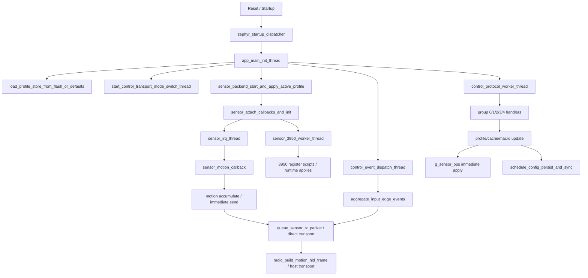
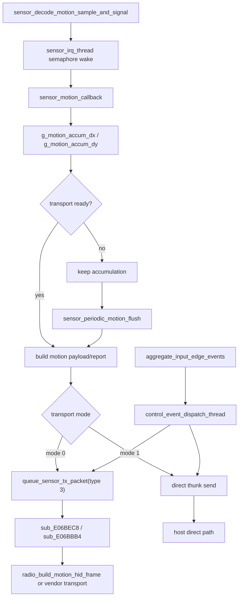

# CRDRAKO 54H 鼠标固件架构与行为分析

> [!IMPORTANT]
> <sub><strong>逆向声明：</strong>本报告仅供合法的互操作性研究、防御性安全分析、教学、资料保存，以及设备所有人或经授权者进行维修与维护时参考之用；不授权未经许可的刷写、再分发、规避、侵权或其他违法用途，相关第三方权利仍归各自权利人所有。</sub>

## 家族选用说明

收录本报告，是因为 CRDRAKO 家族可作为由专门嵌入式方案供应商提供的高端无线游戏鼠标固件代表样本。它能够较好反映市场上大量商用鼠标在实现模式、工程成熟度与整体固件水准上的常见做法。

## 0. 文档说明

### 0.1 目标

本文档用于固化 `54H_mouse_Cpurad_App_v01.06.01.12` 鼠标固件的逆向分析结论，重点覆盖以下问题：

- 固件代码框架与模块边界
- 线程、回调、队列和运行组织方式
- 传感器运动数据从原始采样到最终上报的路径
- WebHID / Vendor 配置协议、命令字与配置项语义
- 竞技模式开关对应的运行时模式与 3950 寄存器脚本
- 真正属于固件层的运动 / 事件时序处理逻辑
- 睡眠、唤醒、功耗与重置监督路径

### 0.2 分析依据

本文件以当前 IDA Pro 逆向数据库为一手分析结果，辅助参考以下材料：

- IDA 数据库：`/54H_mouse_Cpurad_App_v01.06.01.12.hex.i64`

---

## 1. 固件总体框架

### 1.1 运行模型

该固件的整体运行模型为：

- `Zephyr 风格 RTOS 多线程 + 回调 + 队列 + 中断/信号量混合模型`
- 高频数据路径：
  - `sensor_decode_motion_sample_and_signal` 原始 sample 解码
  - `sensor_irq_thread` `0xE07C084`
  - `sensor_motion_callback` `0xE06FCE8`
  - `sensor_periodic_motion_flush` `0xE0700A4`
- 前台控制路径：
  - 控制前端接收线程 `feature_report_rx_thread` `0xE06F9B4`
  - 统一命令执行线程 `control_protocol_worker_thread`
  - 异步事件线程 `control_event_dispatch_thread`
  - 传输模式切换线程 `control_transport_mode_switch_thread`

### 1.2 主模块划分

| 子系统 | 主要职责 | 代表函数 / 代表对象 |
| --- | --- | --- |
| 启动与线程框架 | 静态 init、应用初始化、线程创建 | `zephyr_startup_dispatcher`, `app_main_init_thread` |
| 配置存储 | 装载 profile blob、CRC 校验、默认回退、落盘调度 | `load_profile_store_from_flash_or_defaults`, `schedule_config_persist_and_sync`, `g_default_profile_store_blob` |
| 配置协议 / 命令入口 | 解析 group/cmd，调用各子系统 | `control_protocol_worker_thread`, `handle_device_misc_command_group`, `handle_perf_sensor_command_group` |
| 传感器抽象层 | 将协议项映射到 3950 后端 vtable | `g_sensor_ops`, `apply_active_profile_runtime_state`, 各 `set_*_from_command` |
| 3950 后端 | 初始化、控制消息处理、寄存器脚本应用 | `sensor_3950_initialize`, `sensor_3950_worker_thread`, `sensor_3950_load_startup_register_table` |
| 输入系统 | 运动 sample、按键边沿 / 扩展事件聚合 | `sensor_decode_motion_sample_and_signal`, `sensor_motion_callback`, `aggregate_input_edge_events` |
| 输出系统 | 运动包 / 状态包构造与发队列 | `queue_sensor_tx_packet`, `queue_control_status_report`, `radio_build_motion_hid_frame` |
| 宏存储 | 20 槽索引、flash 页分配、分块读写 | `macro_slot_allocate_storage`, `macro_slot_write_chunk`, `macro_slot_delete` |
| 功耗与恢复 | 传输切换、监督定时器、重置请求 | `control_transport_mode_switch_thread`, `reset_supervisor_thread`, `request_system_reset_forever` |

### 1.3 启动阶段

固件启动时按以下顺序建立系统：

1. `zephyr_startup_dispatcher()` 输出 Zephyr banner，遍历静态 init 表 `unk_E084BB0`，随后进入应用初始化线程。
2. `app_main_init_thread()` 执行硬件 / watchdog 风格初始化，并调用 `load_profile_store_from_flash_or_defaults()` 装载配置。
3. 初始化控制通道、异步事件线程、宏线程、传输模式切换线程、无线/传输工作线程。
4. 调用 `sensor_backend_start_and_apply_active_profile()`，绑定 3950 回调并启动 `sensor_3950_worker_thread + sensor_irq_thread`。
5. `sensor_3950_initialize()` 执行一次性 startup register table，并在 ready 后恢复 DPI、LOD、Motion Sync、Angle Snap、Ripple、Angle Tune、perf mode 等运行态。
6. 主初始化线程随后进入长期等待 / 信号量式维护循环。

### 1.4 运行阶段

- 数据采样路径
  - `sensor_decode_motion_sample_and_signal` 解码原始 sample 并 post semaphore
  - `sensor_irq_thread` 通过 callback 间接调用 `sensor_motion_callback`
- 报告生成路径
  - 运动累加先进入 `g_motion_accum_dx/g_motion_accum_dy`
  - 再按 transport mode 走直接发送路径或 `queue_sensor_tx_packet()` 排队路径
  - 无线侧最终由 `radio_build_motion_hid_frame()` 构造紧凑 HID 帧
- 配置处理路径
  - 传输前端线程收包并转成内部请求
  - `control_protocol_worker_thread` 统一执行 group 0..4 命令
  - 写 profile / cache / macro 后触发 `schedule_config_persist_and_sync()`
- 模式切换路径
  - profile 切换、DPI 切换、Hyper / Competition 切换、profile 子块延迟应用，均通过统一事件线程与 sensor backend 协同
- 低功耗 / 恢复路径
  - `control_transport_mode_switch_thread` 和 `reset_supervisor_thread` 共同参与传输切换与监督
  - 本轮已经明确“监督复位与恢复”路径；本文不把更深层 SoC sleep 分级作为主体展开

### 1.5 代码设计风格

#### 特征 1：状态组织方式

- `大量全局变量 + 小型上下文结构 + 任务队列`
- 说明：
  - 例如 profile 运行态分散在 `g_profile_storage/g_profile_records`、`g_active_dpi_x/g_active_dpi_y`、`g_motion_queue_payload`、`byte_2300B87D` 等全局对象中
  - 传感器后端通过 `g_sensor_ops` 把“协议逻辑”和“3950 具体实现”隔离开

#### 特征 2：中断与前台分工

- IRQ / callback 中主要做：
  - 原始 sample 解码
  - semaphore / event 唤醒
  - 少量状态位更新
- 前台线程中主要做：
  - 寄存器脚本写入
  - profile / macro / cache 的更新
  - 异步状态包和运动包构造

#### 特征 3：配置应用风格

- `先改 RAM profile / cache，再按是否为 active profile 决定是否立即作用于 sensor backend，同时异步调度持久化`
- 说明：
  - group 1/2/3 命令几乎都遵循“改 RAM -> 若当前 profile 生效则调用 g_sensor_ops -> schedule_config_persist_and_sync() -> queue_control_status_report()”这一统一处理范式

#### 特征 4：模式实现风格

- `位图开关 + 枚举 perf mode + 长寄存器脚本驱动`
- 说明：
  - 竞技模式不是单纯 UI 布尔位；它最终会驱动 `sensor_backend_apply_perf_mode()`，进入不同 3950 寄存器脚本

---

## 2. 配置系统与命令入口

### 2.1 章节边界

本章只保留“命令从哪里进来、怎样被执行”的运行路径；配置镜像布局、profile 字段、宏存储、报文格式和配置项映射统一收拢到第 7 章，避免与协议摘要重复展开。

### 2.2 配置命令入口

按传输通道分别说明命令入口：

#### USB / WebHID / HID Feature

- 控制前端接收线程：`feature_report_rx_thread` `0xE06F9B4`
- 前端工作区：`unk_23009818` 及周边 20 字节结构
- 内部分发函数：`sub_E07103C()`
- 统一执行入口：`control_protocol_worker_thread()`
- 工作方式：前端线程把收到的控制帧整理成内部工作项，再由统一 worker 按 `group/cmd` 执行

#### BLE / GATT / Vendor Service

- 本报告不把 BLE 单独作为配置入口展开。

#### 2.4G / Vendor 自定义协议

- 出站异步包入口：`queue_sensor_tx_packet()` -> `sub_E06BEC8()` -> `sub_E06BBB4()`
- 无线运动帧构造：`radio_build_motion_hid_frame()`
- 无线调度配置：`radio_apply_polling_schedule_profile()`, `radio_restart_timeslot_scheduler()`
- 队列消息依赖内部 packet type 与 payload length 组织，不单独附加 checksum 字段。

### 2.3 配置执行模型

该固件的配置执行风格可概括为：

- `前端收包 -> 统一 worker 按 group/cmd 执行 -> 写 RAM profile/cache/macro -> 若当前 profile 生效则立即下发到 g_sensor_ops -> 调度异步状态上报与持久化`

优点：

- 所有配置项最终都落到同一套 profile / cache 对象，断电恢复一致性好
- 3950 寄存器写入被隔离在 sensor backend，协议层与硬件层边界清晰
- 异步 `queue_control_status_report()` 让 UI 状态回显与核心写配置逻辑解耦

阅读注意点：

- `feature_report_rx_thread` 在本文统一视作“控制前端接收层”，不再强分更底层承载总线。
- `g_profile_storage` / `g_profile_records` 的别名会让反编译公式出现偏移错觉，分析时必须回到复制长度与步长常量。
- 某些低位 offset（如 `+0x17/+0x18`）只有稳定的命令级语义，因此本文以工程行为描述为主。

---

## 3. 传感器运动数据流转流程

### 3.1 采样入口

传感器采样入口函数 / 中断 / 回调链如下：

- 原始 sample 解码：`sensor_decode_motion_sample_and_signal(unsigned char *raw, ...)`
- IRQ 线程：`sensor_irq_thread()`
- 回调安装：`sensor_attach_callbacks_and_init()` 将 `motion_cb/raw_cb/ready_cb` 写入 `unk_2300A3C4/unk_2300A3C0/unk_2300A3BC`
- 最终运动回调：`sensor_motion_callback(sensor_motion_sample_t *sample)`
- 采样触发方式：
  - 3950 raw sample 解码后 post semaphore
  - `sensor_irq_thread` 阻塞在 semaphore 上，唤醒后调用安装好的 motion callback

### 3.2 原始数据解码

`sensor_decode_motion_sample_and_signal()` 对 sample 字节做了如下转换：

| 原始字段 | 含义 | 目标变量 / 结构 |
| --- | --- | --- |
| `raw[0] >> 7` | motion 状态位 | `g_sensor_sample_motion_flag` |
| `raw[0] & 0x08` | 额外状态位 | `g_sensor_sample_aux_flag` |
| `(raw[0] & 0x20) == 0` | 样本状态位；后续参与 `sub_E07C330()` 的异常 / 恢复门控 | `g_sensor_sample_bit20_clear` |
| `raw[1]` | sample 附加状态 / 标志字节 | 局部输出 `out_value` |
| `*(uint16_t *)(raw + 2)` | `dx` | `g_sensor_sample_dx` |
| `*(uint16_t *)(raw + 4)` | `dy` | `g_sensor_sample_dy` |

说明：

- `dx/dy`、`motion flag`、`aux flag` 与 `bit20_clear` 这四条赋值路径都由 IDA 直接确认。
- 本节只记录固件里真实发生的位运算与落点；如果后续需要把这些位精确映射到 3950 数据手册字段，可再单独补寄存器 / burst 字段附表。

### 3.3 中间态累计与整形

从原始运动量到最终输出之间的中间状态如下：

- 累计变量：
  - `g_motion_accum_dx`
  - `g_motion_accum_dy`
- 处理方式：
  - `sensor_motion_callback()` 每收到一帧 sample 先累加到上述两个变量
  - 如果 transport 当前可发送，则立刻尝试构造本次 payload / report，成功后清空累计值
  - 如果 transport 暂时不发包，则累计值保留到下一次周期冲刷 `sensor_periodic_motion_flush()`
- 平滑 / 滤波：
  - 在 `sensor_decode_motion_sample_and_signal()` 到 `sensor_motion_callback()` 之间，没有额外的软件平滑 / 滤波分支。
  - Motion Sync / Ripple / Angle Snap 等选项主要通过 3950 寄存器脚本实现，不应误写为本节的软件算法。
- 事件编排：
  - `sample->has_button_event` 会触发 `sub_E068ADC()` 或 `sub_E068B14()`，并与按键事件管线交叉

### 3.4 不同传输模式下的数据路径

#### transport mode 0

1. `sensor_motion_callback()` 构造本地 8 字节 payload，写入 `g_motion_queue_payload[0..7]`。
2. payload 中包含按钮位和 `dx/dy`。
3. 调用 `queue_sensor_tx_packet(3, ..., 8)` 尝试进入发送队列；该 helper 自身还会检查 `BYTE1(g_control_transport_mode)`，因此真正排队成功依赖更高层 transport 状态。
4. 队列项后续由 `sub_E06BEC8()` 消费，再转入 `sub_E06BBB4()`。

工程解释：

- 这是一个“先排队、后统一路由”的路径。
- 从 IDA 能确认的是：这一路径依赖内部 packet queue，而不是 RAM thunk 直发。

#### transport mode 1

1. `sensor_motion_callback()` 通过 RAM thunk `sub_E084490()` / `sub_E084498()` 检查发送可用性并下发本次 report。
2. 若发送成功，则清零累计的 `dx/dy`。
3. 某些路径会顺带处理按钮位并调用 `refresh_activity_supervisor_timer()` 维持活动定时器。

工程解释：

- 这是一个更直接的发送路径，没有经过 `queue_sensor_tx_packet()` 队列。
- 从 IDA 能确认的是：`sub_E084490()` / `sub_E084498()` 组成了独立于 packet queue 的直发分支。

#### 无线 HID 构帧路径

- `radio_build_motion_hid_frame()` 把当前按钮位、状态位和 `dx/dy` 打成紧凑无线 HID 帧。
- `sub_E087DEC()` 是其上层调度 / 发送路径，受无线状态机与 polling schedule 参数影响。

### 3.5 滚轮数据链路

单独描述滚轮链路：

- 存在滚轮 / 扩展输入事件聚合：
  - `aggregate_input_edge_events()` 会处理多种事件类型，并向 `587241424`/`587241420` 等 event 对象投递位级变化
  - `control_event_dispatch_thread()` 会把 case `5/6` 类事件打成短包，并按 transport mode 走直接路径或 `queue_sensor_tx_packet(9)`
- 与滚轮相关的配置项：
  - `Tournament Scroll / Window Time` 由 group 0 `cmd 0x19/0x99` 读写
- 本报告覆盖到“配置入口 -> 事件聚合 -> 异步短包”的固件层路径，不继续展开更底层滚轮采样外设。

### 3.6 最终报告生成

最终报告的形成方式如下：

- 标准运动报告：
  - mode 1 直接路径：`sensor_motion_callback()` / `sensor_periodic_motion_flush()` -> RAM thunk 发送
  - mode 0 队列路径：`queue_sensor_tx_packet(3)` -> `sub_E06BEC8()` -> `sub_E06BBB4()` -> 后端发送
- 无线最终 HID 帧：
  - `radio_build_motion_hid_frame()`
- 异步状态 / 配置回显：
  - `queue_control_status_report()` 根据 report kind 构造 8 字节状态包
- busy 重试 / carry 保留：
  - 如果当前路径发送失败，`g_motion_accum_dx/g_motion_accum_dy` 不会被清零，后续由下一次 sample 或周期冲刷继续尝试发送。
- 何时不发包：
  - `queue_sensor_tx_packet()` 仅在 `BYTE1(g_control_transport_mode)` 非零时工作
  - mode 1 直发路径会先检查 thunk 返回状态，未就绪则不清累计、不发包

---

## 4. 竞技模式

### 4.1 模式定义

本固件中的“竞技模式”不是独立于其它选项的单一布尔状态，而是 3950 后端 `perf mode` 选择链中的一环。与该链直接相关的 profile 字段有三项：

- `profile +0x53`：polling code / perf 速率编码
- `profile +0x57`：Hyper Mode 位
- `profile +0x5B`：Competition Mode 位

IDA 中 `set_hyper_mode_enabled_from_command()`、`set_competition_mode_enabled_from_command()`、`apply_polling_rate_command()` 三条路径都会直接调用 `g_sensor_ops->apply_perf_mode()`。这说明“竞技模式”的真实硬件含义不是 UI 开关本身，而是把 3950 切到另一组 perf mode 寄存器脚本。

### 4.2 模式选择逻辑

从 IDA 反编译和反汇编可以直接还原出这条选择链：

1. `set_hyper_mode_enabled_from_command()` 写 `profile +0x57`。
2. `set_competition_mode_enabled_from_command()` 写 `profile +0x5B`。
3. `apply_polling_rate_command()` 在更新 `profile +0x53` 后，会重新把 backend 拉回与当前速率编码匹配的 perf mode。
4. `sensor_backend_apply_perf_mode()` 把目标 mode 打包为 worker 消息 `case 3`，交给 `sensor_3950_worker_thread()` 执行真正脚本。

对用户可见的配置组合，固件内部的 mode 归约关系如下：

| Hyper | Competition | 速率编码作用 | 最终 perf mode |
| --- | --- | --- | --- |
| `0` | `0/1` | 低速率编码会把 backend 拉回基础脚本 | `2` |
| `1` | `0` | 高速率编码 / Hyper 路径会切到高性能脚本族 | `4` |
| `1` | `1` | Competition 打开后强制切到竞技脚本 | `5` |

补充说明：

- `Competition` 只有在 `Hyper` 打开的情况下才会把 backend 推到 `perf mode 5`；如果 `Hyper` 关闭，代码会直接回到 `perf mode 2`。
- `apply_polling_rate_command()` 会把 `g_active_polling_code` 分成两组：
  - `0x20/0x40/0x80` 这一组属于高性能速率编码，Competition 关闭时回到 `mode 4`
  - `0x01/0x02/0x04/0x08/0x10` 这一组走基础脚本，Competition 关闭时回到 `mode 2`
- `sensor_backend_apply_perf_mode(4)` 不是单脚本调用，而是先依据两枚 16 位 DPI 缓存字选择一个 `mode 4` 子选择器，再封装成 worker 消息。
- `sensor_3950_worker_thread()` 在 `case 2` 写完 `reg 0x48..0x4B` 后，会用 `g_sensor_cached_dpi_x/g_sensor_cached_dpi_y` 再次检查 `0x1B57`（6999）阈值，并在需要时补发 `case 3`，把 `mode 4` 的最终脚本校正到与当前 DPI 档位一致。
- `g_sensor_backend_id == 2` 时，Competition 打开路径会被拒绝，不会强行下发 `mode 5`。

### 4.3 模式的寄存器写入 / 参数写入

`sensor_3950_worker_thread(case 3)` 中的 `v42/v43` 分发可以直接整理成以下脚本族。下面的清单按 IDA 中真实函数边界和真实寄存器写入组织；为了可读性，列表中省略了每次切 bank 的 `reg 0x7F = bank` 写入，只保留各 bank 内的有效寄存器赋值。

| 内部 perf mode | worker 选择器 | 函数 | 说明 |
| --- | --- | --- | --- |
| `1` | `v42 = 1` | `sub_E083F76` | 3950 perf script 1 |
| `2` | `v42 = 2` | `sub_E083C4A` | 3950 perf script 2 |
| `3` | `v42 = 3` | `sub_E083922` | 3950 perf script 3 |
| `4A` | `v42 = 4, v43 = 1` | `sub_E082F50` | perf mode 4 的高 DPI 变体；worker `case 2` 中任一轴 `> 6999` 时最终落此脚本 |
| `4B` | `v42 = 4, v43 = 2` | `sub_E08324E` | perf mode 4 的低 DPI 变体；worker `case 2` 中双轴 `<= 6999` 时最终落此脚本 |
| `5` | `v42 = 5` | `sub_E08354C` | Competition 对应脚本 |

#### perf mode 1 / `sub_E083F76`

入口特点：
先读 `bank 0, reg 0x40`，结尾按位回写 `reg 0x40 = (old & 0xFC) | 0x02`。

完整写入：
bank `0x07`：`0x40=0x40, 0x42=0x28, 0x43=0x00`
bank `0x05`：`0x43=0xE4, 0x44=0x05, 0x49=0x10, 0x51=0x28, 0x53=0x30, 0x55=0xFB, 0x5B=0xFB, 0x5F=0x90, 0x61=0x3B, 0x6D=0xB8, 0x6E=0xDF, 0x7B=0x10`
bank `0x06`：`0x53=0x03, 0x62=0x01, 0x7A=0x02, 0x6B=0x20, 0x6D=0x8F, 0x6E=0x70, 0x6F=0x04`
bank `0x09`：`0x40=0x01, 0x43=0x13, 0x44=0x88, 0x47=0x00, 0x4F=0x0C, 0x51=0x04, 0x55=0x3F, 0x56=0x3F, 0x59=0x0F, 0x5A=0x0F, 0x73=0x0C`
bank `0x0A`：`0x4A=0x14`
bank `0x19`：`0x41=0x53, 0x47=0x64, 0x4B=0x02, 0x4C=0x02`
bank `0x0C`：`0x4A=0x1C, 0x4B=0x14, 0x4C=0x4F, 0x4D=0x02, 0x50=0x00, 0x51=0x01, 0x53=0x16, 0x55=0x10, 0x62=0x18`
bank `0x14`：`0x62=0x14`
bank `0x18`：`0x48=0x65, 0x50=0x34, 0x51=0x54, 0x52=0x38, 0x53=0x5F, 0x55=0x7F, 0x61=0x1C, 0x62=0x60, 0x63=0xFF, 0x64=0x00, 0x70=0x22, 0x71=0xF2, 0x72=0xF6, 0x77=0x32, 0x79=0xCC`
bank `0x00`：`0x4E=0x00, 0x4F=0x4F, 0x51=0x00, 0x52=0x4F, 0x47=0x01, 0x54=0x52, 0x5A=0x80, 0x78=0x0A, 0x79=0x10, 0x40=(old & 0xFC) | 0x02`

#### perf mode 2 / `sub_E083C4A`

入口特点：
先读 `bank 0, reg 0x40`，结尾按位回写 `reg 0x40 = (old & 0xFC) | 0x01`。

完整写入：
bank `0x07`：`0x40=0x41, 0x42=0x28, 0x43=0x00`
bank `0x05`：`0x43=0xE4, 0x44=0x05, 0x49=0x10, 0x51=0x40, 0x53=0x40, 0x55=0xFC, 0x5B=0xFC, 0x5F=0x90, 0x61=0x3B, 0x6D=0xB8, 0x6E=0xDF, 0x7B=0x10`
bank `0x06`：`0x53=0x03, 0x62=0x01, 0x7A=0x02, 0x6B=0x20, 0x6D=0x8F, 0x6E=0x70, 0x6F=0x04`
bank `0x09`：`0x40=0x01, 0x43=0x13, 0x44=0x88, 0x47=0x00, 0x4F=0x0C, 0x51=0x04, 0x55=0x3F, 0x56=0x3F, 0x59=0x0F, 0x5A=0x0F, 0x73=0x0C`
bank `0x0A`：`0x4A=0x11`
bank `0x19`：`0x41=0x32, 0x47=0x12, 0x4B=0x01, 0x4C=0x01`
bank `0x0C`：`0x4A=0x1C, 0x4B=0x14, 0x4C=0x4F, 0x4D=0x02, 0x50=0x00, 0x51=0x01, 0x53=0x16, 0x55=0x10, 0x62=0x18`
bank `0x14`：`0x62=0x14`
bank `0x18`：`0x48=0x65, 0x50=0x34, 0x51=0x54, 0x52=0x38, 0x53=0x5F, 0x55=0x7F, 0x61=0x1C, 0x62=0x60, 0x63=0xFF, 0x64=0x00, 0x70=0x22, 0x71=0xF2, 0x72=0xF6, 0x77=0x32, 0x79=0xCC`
bank `0x00`：`0x4E=0x00, 0x4F=0x4F, 0x51=0x00, 0x52=0x4F, 0x47=0x01, 0x54=0x53, 0x5A=0x80, 0x78=0x01, 0x79=0x9C, 0x40=(old & 0xFC) | 0x01`

#### perf mode 3 / `sub_E083922`

入口特点：
先读 `bank 0, reg 0x40`，结尾按位回写 `reg 0x40 = old & 0xFC`。

完整写入：
bank `0x07`：`0x40=0x41, 0x42=0x28, 0x43=0x00`
bank `0x05`：`0x43=0xE4, 0x44=0x05, 0x49=0x10, 0x51=0x40, 0x53=0x40, 0x55=0xFB, 0x5B=0xFB, 0x5F=0x90, 0x61=0x31, 0x6D=0xB8, 0x6E=0xCF, 0x7B=0x10`
bank `0x06`：`0x53=0x03, 0x62=0x01, 0x7A=0x02, 0x6B=0x20, 0x6D=0x8F, 0x6E=0x70, 0x6F=0x04`
bank `0x09`：`0x40=0x01, 0x43=0x13, 0x44=0x88, 0x47=0x00, 0x4F=0x0C, 0x51=0x04, 0x55=0x3F, 0x56=0x3F, 0x59=0x0F, 0x5A=0x0F, 0x73=0x0C`
bank `0x0A`：`0x4A=0x14`
bank `0x19`：`0x41=0x32, 0x47=0x12, 0x4B=0x01, 0x4C=0x01`
bank `0x0C`：`0x4A=0x1C, 0x4B=0x14, 0x4C=0x4F, 0x4D=0x02, 0x50=0x00, 0x51=0x01, 0x53=0x16, 0x55=0x10, 0x62=0x18`
bank `0x14`：`0x62=0x14`
bank `0x18`：`0x48=0x65, 0x50=0x34, 0x51=0x54, 0x52=0x38, 0x53=0x5F, 0x55=0x7F, 0x61=0x1C, 0x62=0x60, 0x63=0xFF, 0x64=0x00, 0x70=0x22, 0x71=0xF2, 0x72=0xF6, 0x77=0x32, 0x79=0xCC`
bank `0x00`：`0x4E=0x00, 0x4F=0x4F, 0x51=0x00, 0x52=0x4F, 0x47=0x01, 0x54=0x53, 0x5A=0x80, 0x78=0x01, 0x79=0x9C, 0x40=old & 0xFC`

#### perf mode 4A / `sub_E082F50`

完整写入：
bank `0x07`：`0x40=0x41, 0x42=0x14, 0x43=0x00`
bank `0x05`：`0x43=0x64, 0x44=0x05, 0x49=0x20, 0x51=0x40, 0x53=0x40, 0x55=0xFB, 0x5B=0xFB, 0x5F=0x90, 0x61=0x31, 0x6D=0xB8, 0x6E=0xCF, 0x7B=0x50`
bank `0x06`：`0x53=0x03, 0x62=0x02, 0x7A=0x03, 0x6B=0x20, 0x6D=0x8F, 0x6E=0x70, 0x6F=0x07`
bank `0x09`：`0x40=0x01, 0x43=0x23, 0x44=0x88, 0x47=0x00, 0x4F=0x0C, 0x51=0x04, 0x55=0x3F, 0x56=0x3F, 0x59=0x0F, 0x5A=0x0F, 0x73=0x0C`
bank `0x0A`：`0x4A=0x14`
bank `0x19`：`0x41=0x32, 0x47=0x24, 0x4B=0x02, 0x4C=0x02`
bank `0x0C`：`0x4A=0x20, 0x4B=0x1F, 0x4C=0x5C, 0x4D=0x90, 0x50=0x14, 0x51=0x15, 0x53=0x1E, 0x55=0x02, 0x62=0x02`
bank `0x14`：`0x62=0x14`
bank `0x18`：`0x48=0x55, 0x50=0x18, 0x51=0x40, 0x52=0x20, 0x53=0x38, 0x55=0x68, 0x61=0x0A, 0x62=0x1A, 0x63=0x48, 0x64=0x40, 0x70=0x22, 0x71=0x88, 0x72=0x88, 0x77=0x22, 0x79=0xCB`
bank `0x00`：`0x4C=0x20, 0x4D=0x30, 0x4E=0x28, 0x4F=0x4F, 0x51=0x00, 0x52=0x4F, 0x47=0x01, 0x54=0x55, 0x5A=0x80, 0x5B=0x24, 0x5D=0x02, 0x5E=0x01, 0x6D=0x85, 0x6E=0x0C, 0x6F=0x0A, 0x40=0x83`

#### perf mode 4B / `sub_E08324E`

完整写入：
bank `0x07`：`0x40=0x41, 0x42=0x14, 0x43=0x00`
bank `0x05`：`0x43=0x64, 0x44=0x05, 0x49=0x20, 0x51=0x10, 0x53=0x40, 0x55=0xFB, 0x5B=0xFB, 0x5F=0x80, 0x61=0x31, 0x6D=0xA7, 0x6E=0xCD, 0x7B=0x50`
bank `0x06`：`0x53=0x02, 0x62=0x02, 0x7A=0x03, 0x6B=0x20, 0x6D=0x98, 0x6E=0x80, 0x6F=0x07`
bank `0x09`：`0x40=0x03, 0x43=0x23, 0x44=0x98, 0x47=0x18, 0x4F=0x00, 0x51=0x11, 0x55=0x54, 0x56=0x54, 0x59=0x20, 0x5A=0x20, 0x73=0x0E`
bank `0x0A`：`0x4A=0x14`
bank `0x19`：`0x41=0x32, 0x47=0x24, 0x4B=0x02, 0x4C=0x02`
bank `0x0C`：`0x4A=0x20, 0x4B=0x1F, 0x4C=0x5C, 0x4D=0x90, 0x50=0x14, 0x51=0x15, 0x53=0x1E, 0x55=0x02, 0x62=0x02`
bank `0x14`：`0x62=0x14`
bank `0x18`：`0x48=0x55, 0x50=0x18, 0x51=0x40, 0x52=0x20, 0x53=0x38, 0x55=0x68, 0x61=0x0A, 0x62=0x1A, 0x63=0x48, 0x64=0x40, 0x70=0x22, 0x71=0x88, 0x72=0x88, 0x77=0x22, 0x79=0xCB`
bank `0x00`：`0x4E=0x00, 0x4F=0x95, 0x51=0x00, 0x52=0x95, 0x47=0x01, 0x54=0x55, 0x5A=0x80, 0x40=0x83`

#### perf mode 5 / `sub_E08354C`

入口特点：
脚本开始先直接把 DPI 相关寄存器写成 `0x003F / 0x003F`，随后执行一套与 `perf mode 4B` 同核的主体脚本，最后在 `bank 0` 追加两次完全相同的尾段。

脚本起始 DPI 预装载：
bank `0x00`：`0x48=0x3F, 0x49=0x00, 0x4A=0x3F, 0x4B=0x00, 0x47=0x01`

主体脚本：
与 `perf mode 4B / sub_E08324E` 的 `bank 0x07/0x05/0x06/0x09/0x0A/0x19/0x0C/0x14/0x18/0x00` 写入集合相同。

竞技模式追加尾段：
bank `0x00`：`0x40=0x03, 0x7D=0x0A, 0x77=0xFF, 0x7E=0x77, 0x79=0xFF, 0x7B=0xFF, 0x7A=0x01, 0x40=0x83`
上述尾段会连续重复两次。

脚本退出后的固定动作：
`sensor_3950_worker_thread()` 在执行完 `sub_E08354C()` 后，会额外延时 `0x4E20`，然后通过 `g_sensor_ops->set_dpi_xy()` 重新下发当前运行时 DPI。

### 4.4 模式差异分析

#### 共性

- 所有脚本都通过 `sensor_reg_write_u8()` 成批下发 bank/reg/value 三元组。
- `bank 0x0C/0x14/0x18/0x19` 是共享度最高的公共主体，mode 1/2/3/4/5 都在这些 bank 上写了大量基础参数。
- `perf mode 1/2/3` 这三组脚本都包含“先读 `reg 0x40`、末尾按位回写”的结构。

#### 差异点

- `perf mode 4A` 与 `4B` 的主要差异集中在 `bank 0x05`、`bank 0x06`、`bank 0x09` 和 `bank 0x00` 尾段，说明 mode 4 本身就是一个带变体的脚本族。
- `sub_E082F50` 与 `sub_E08324E` 的切换不是 UI 层抽象，而是 worker 在写完当前 DPI 后再围绕 `6999 DPI` 阈值做的最终脚本选择。
- `perf mode 5` 以 `4B` 为主体，但额外加入了 DPI 预装载和两轮重复尾段，这是它最显著的识别特征。
- `perf mode 1/2/3` 与 `4/5` 在 `bank 0x19`、`bank 0x18` 和 `bank 0x00` 尾段差异很大，说明内部确实存在多套性能脚本，而不是同一套参数做轻微微调。

#### 关键工程解释

- “竞技模式”在固件里真正做的事，是把 3950 切换到 `perf mode 5` 脚本族。
- “Hyper / Polling / Competition” 三个配置项共同决定的是 backend 脚本族，而不是单一寄存器位。
- `perf mode 4` 之所以需要两个变体，是因为固件会在 DPI 真正写入 3950 后，再按 `6999 DPI` 阈值把脚本固定到高 DPI 或低 DPI 变体。
- 这一整章描述的是寄存器脚本与模式系统，不属于固件层运动整形算法。

### 4.5 模式切换前后流程

竞技模式及其相关脚本切换，按 IDA 中的真实执行顺序可归纳为：

1. 协议层先写 `profile +0x57/+0x5B/+0x53` 等字段。
2. `set_hyper_mode_enabled_from_command()`、`set_competition_mode_enabled_from_command()` 或 `apply_polling_rate_command()` 选出目标 `perf mode`。
3. `sensor_backend_apply_perf_mode()` 把目标 mode 封装成 worker 消息 `case 3`。
4. 若目标 mode 为 `4`，封装时会先带一个子选择器；若后续 DPI 写入使阈值关系发生变化，worker `case 2` 会再补发一次 `case 3`，最终落到 `sub_E082F50()` 或 `sub_E08324E()`。
5. 若目标 mode 为 `5`，worker 进入 `sub_E08354C()`，执行完脚本后固定延时并重下发 DPI。
6. 正常 Competition/Hyper 切换路径不会调用 `sensor_3950_initialize()` 全量初始化；全量重初始化属于独立的 worker `case 10`。

---

## 5. 厂商独有功能与固件层运动 / 事件处理算法

### 5.1 功能清单

| 功能名 | 入口配置 | 生效层级 | 是否为固件层算法 | 备注 |
| --- | --- | --- | --- | --- |
| 运动累计与发送门控 | 无独立 UI；由常规 motion path 自动触发 | 运动数据处理 / 输出时序 | 是 | `sensor_motion_callback` 核心职责 |
| carry 补偿量回灌 | 内部事件位 `0x20` | 运动数据处理 / 重发补偿 | 是 | `aggregate_input_edge_events` 与 `sensor_motion_callback` 联动 |
| 周期冲刷 | `Polling Rate` 间接决定节拍 | 输出时序 | 是 | `sensor_periodic_motion_flush` 按 tick 强制尝试发包 |
| 输入边沿聚合与异步包化 | 按键 / 扩展输入 / 组合键 | 事件处理 | 是 | `aggregate_input_edge_events` + `control_event_dispatch_thread` |
| 回报率到无线时隙调度映射 | `Polling Rate` | 输出时序 / 无线调度 | 是 | 同时影响 flush 节拍和 radio 子时隙 |
| Competition / Hyper / Motion Sync / LOD 等 | group 1 配置项 | 传感器寄存器 | 否 | 这些属于第 4 章的寄存器脚本系统 |

### 5.2 运动累计、carry 合并与即时发送

#### 功能定位

- 用户侧表现：运动并不是“每来一个 sample 就机械发一个包”，而是先进入累计器，再由 transport 就绪状态决定是否立刻发送。
- 固件侧目标：把传感器 sample 频率、链路发送窗口和按钮 / 扩展输入事件合并成同一条稳定输出节奏。
- 关键对象：`g_motion_accum_dx`、`g_motion_accum_dy`、`g_pending_carry_dx`、`g_pending_carry_dy`、`g_motion_queue_payload[8]`

#### IDA 中能直接看到的执行链

1. `sensor_motion_callback(sample)` 先看 `sample->has_motion`，有运动就把 `sample->dx/dy` 累加到 `g_motion_accum_dx/dy`。
2. 如果当前 `transport mode == 0`，函数会把 `g_motion_queue_payload[0..7]` 清零，再把按钮位、扩展事件计数和累计的 `dx/dy` 填进这个 8 字节 payload，最后调用 `queue_sensor_tx_packet(3, ..., 8)`。
3. 如果当前 `transport mode == 1`，函数先通过 `sub_E084490()` 做发送前探测，再通过 `sub_E084498()` 走直接发送路径。
4. 无论走哪条路径，都是发送成功后才清零累计器；如果发送失败，累计器会原样保留到下一次 sample 或下一次周期冲刷。
5. `queue_sensor_tx_packet()` 本身还检查 `BYTE1(g_control_transport_mode)`，因此“构造了 queued payload”与“真正入队成功”是两层条件。

#### carry / 补偿量回灌

这是本轮在 IDA 中直接明确、很值得单独写明的一段固件层逻辑：

- `aggregate_input_edge_events()` 的 `case 8` 会把一组 16 位增量加到 `g_pending_carry_dx` 与 `g_pending_carry_dy`，同时对事件对象 `587241424` 置位 `0x20`。
- `sensor_motion_callback()` 在 `transport mode == 1` 路径下，如果发现这个 `0x20` 位已置位，就会先清掉该位，再把 `g_pending_carry_dx/g_pending_carry_dy` 累加回 `g_motion_accum_dx/dy`，随后才发包。
- 这说明固件里存在一条“延后补偿量回灌”通道：不是把补偿量立即强行插进当前 sample，而是在下一次合适的发送窗口前合并到累计器中。

这不是传感器寄存器功能，而是实打实的固件层事件/运动融合机制。

#### 关键函数

| 函数 | 作用 |
| --- | --- |
| `sensor_motion_callback` | 累计 `dx/dy`，根据 transport 状态立即发包或保留累计 |
| `queue_sensor_tx_packet` | `mode 0` 路径下尝试把运动包塞入异步队列；是否成功还受 transport 高字节状态约束 |
| `sub_E084490` | `mode 1` 直发路径的发送前探测 |
| `sub_E084498` | `mode 1` 直发路径的实际发送 |
| `refresh_activity_supervisor_timer` | 成功发送或短事件发送后刷新活动计时器 |

#### 伪代码

```c
on_motion_sample(sample):
    if (sample.has_motion) {
        accum_dx += sample.dx;
        accum_dy += sample.dy;
    }

    if (transport_mode == 0) {
        build_8byte_motion_payload(button_bits, edge_count, accum_dx, accum_dy);
        if (queue_sensor_tx_packet(TYPE_MOTION, payload, 8)) {
            accum_dx = 0;
            accum_dy = 0;
            clear_pending_edge_counters_if_needed();
        }
    } else if (transport_mode == 1) {
        if (pending_carry_bit_0x20) {
            clear_pending_carry_bit();
            accum_dx += carry_dx;
            accum_dy += carry_dy;
        }
        if (direct_send_ready() && direct_send_motion() == 1) {
            accum_dx = 0;
            accum_dy = 0;
        }
        if (pending_button_or_edge_bits && direct_send_short_event() == 1) {
            clear_pending_edge_counters();
        }
        refresh_activity_timer();
    }

    dispatch_button_scan_followup(sample.has_button_event);
```

#### 通俗举例

- 例 1：连续 3 帧小位移到来，但当前链路窗口忙，固件不会丢掉这 3 帧，而是把它们继续累在 `g_motion_accum_dx/dy` 里，等下一次可发时一起送出。
- 例 2：如果中间出现一笔“延后补偿量”，它不会立即抢先发送，而是先记到 `g_pending_carry_dx/g_pending_carry_dy`，等下一次直发窗口到来前再并回累计器。

#### 工程结论

- 这段逻辑真正改变的是：`发送时机、累计方式、重发补偿的并入时机`
- 它不属于：`3950 传感器内部滤波、Angle Snap、Motion Sync 之类的寄存器功能`

### 5.3 周期冲刷与回报率耦合

#### 周期冲刷本身

`sensor_periodic_motion_flush()` 不是简单定时器回调，而是 motion 累计器的第二条发送出口：

- `g_motion_flush_tick_counter` 每次进入函数自增。
- 当计数达到 `g_motion_flush_period_ticks` 后，函数会把计数清零，并尝试对当前累计的 `g_motion_accum_dx/dy` 做一次强制发送。
- 如果 sensor backend 自己提供 `periodic_flush` 回调，则优先调用后端回调；否则复用与 `sensor_motion_callback()` 同一套 queued/direct 发送路径，并同步处理挂起的短事件计数字节。

其工程意义是：即使没有新的 sample 到来，只要累计器里还压着未发出的运动量，固件仍会在 flush 周期到来时推动一次发送。

#### 回报率如何直接影响 flush 节拍

`apply_polling_rate_command()` 直接改写 `g_motion_flush_period_ticks`：

| polling code | `g_motion_flush_period_ticks` | `sub_E06BAAC()` 参数 | backend perf mode 回套 |
| --- | --- | --- | --- |
| `0x80` | `1` | `125` | Competition 关时回 `mode 4` |
| `0x40` | `1` | `250` | Competition 关时回 `mode 4` |
| `0x20` | `1` | `500` | Competition 关时回 `mode 4` |
| `0x10` | `1` | `1000` | Competition 关时回 `mode 2` |
| `0x01` | `1` | `1000` | Competition 关时回 `mode 2` |
| `0x02` | `2` | `1000` | Competition 开时回 `mode 5` |
| `0x04` | `4` | `1000` | Competition 开时回 `mode 5` |
| `0x08` | `8` | `1000` | Competition 开时回 `mode 5` |

这张表说明了一点：用户调 Polling Rate，不只是改 radio 端的发送窗口，还直接改了 firmware 层多久强制触发一次累计器冲刷。

#### 无线侧时隙调度映射

`radio_apply_polling_schedule_profile()` 又把同一个 polling code 映射成无线调度参数：

| polling code | `g_radio_base_polling_rate_hz` | `g_radio_subslots_per_cycle` |
| --- | --- | --- |
| `0x40` / `0x80` | `125` | `4` |
| `0x20` | `250` | `4` |
| `0x10` / `0x01` | `500` | `4` |
| `0x02` | `1000` | `6` |
| `0x04` | `1000` | `8` |
| `0x08` | `1000` | `12` |

因此 polling code 同时控制三件事：

- flush 节拍
- backend perf mode 回套
- radio 子时隙调度密度

这是一条非常明确的固件层时序策略链，而不是单点寄存器配置。

### 5.4 输入边沿聚合与异步事件出包

#### `aggregate_input_edge_events()` 做了什么

IDA 里这不是一个“读按钮然后立刻发包”的简单函数，而是一个 20 槽扫描器：

- 函数主体循环 20 次，说明它按固定槽表扫描输入 / 宏 / 扩展事件源。
- 每个槽都有自己的延时计数、当前位置、剩余长度和重装值。
- 事件类型不同，走的聚合逻辑也不同。

其中与最终手感和事件时序最相关的几类类型如下：

- `case 8`：把一组位移增量累加到 `g_pending_carry_dx/g_pending_carry_dy`，并对事件对象置位 `0x20`，供 motion callback 在下一个发送窗口前回灌。
- `case 16`：更新 `byte_2300A6DE` 并对事件对象置位 `0x10`，这会进入运动包中的“附加计数字节”。
- `case 9/10`：对一组位图做置位 / 清位，并维护对应计数器，最终影响异步短包或附加按钮状态。
- `case 4/5/6/7`：把短事件写入共享区并设置事件对象，使 `control_event_dispatch_thread()` 去组织短 report。

#### `control_event_dispatch_thread()` 如何把它们变成 host 可见事件

这个线程会消费内部事件队列，再按 transport mode 做分流：

- `transport mode == 0`：
  - 按键位变化会走 `queue_sensor_tx_packet(2, ...)`
  - 扩展状态变化会走 `queue_sensor_tx_packet(6, ...)`
  - 某些短事件会走 `queue_sensor_tx_packet(9, ...)`
- `transport mode == 1`：
  - 线程先调用 `sub_E084490()` 做发送探测
  - 然后调用 `sub_E084498()` 直接把短 payload 发出去
  - 成功后刷新活动计时器

这里的工程含义很清晰：按钮边沿、短事件、扩展状态并不是“外挂通道”，而是与 motion 一样，遵守同一套 transport ready / 直接发送 / 排队发送策略。

#### 伪代码

```c
aggregate_input_edge_events():
    for each slot in 20_slots:
        if slot.delay_not_expired:
            continue;
        event = decode_slot_event(slot);
        switch (event.type) {
        case CARRY_DELTA:
            carry_dx += event.dx;
            carry_dy += event.dy;
            set_event_bit(0x20);
            break;
        case EXTRA_COUNTER:
            extra_counter = event.value;
            set_event_bit(0x10);
            break;
        case BUTTON_SET:
        case BUTTON_CLEAR:
            update_internal_button_bitmap_and_counters();
            break;
        case SHORT_EVENT:
            write_shared_short_event_buffer();
            signal_dispatch_thread();
            break;
        }

control_event_dispatch_thread():
    pop_async_event();
    if (transport_mode == 0)
        queue_sensor_tx_packet(packet_type, payload, len);
    else if (transport_mode == 1)
        direct_send(payload, len);
```

### 5.5 无线最终构帧与主观表现

`radio_build_motion_hid_frame()` 是 firmware 层运动链路的最后一道整形：

- 它从无线发送缓存里取出按钮、扩展状态和 `dx/dy`。
- 低 5 位承载按钮 / 标志位。
- 高位拼入一个短状态字段。
- 最终构造成 `report_id = 2`、`length = 7` 的紧凑无线鼠标 report。

它的意义不是“改运动轨迹”，而是把前面已经累计、补偿、合并好的 motion/event 结果压缩成无线链路真正要发出去的最终格式。

### 5.6 功能之间的关系

- `sensor_motion_callback()` 负责“把原始 sample 变成累计状态，并在可发时尝试立即发送”。
- `aggregate_input_edge_events()` 负责“把按钮、扩展输入和延后补偿量变成统一的内部事件位与短包数据”。
- `sensor_periodic_motion_flush()` 负责“即使没有新 sample，也要按节拍推动一次发送”。
- `apply_polling_rate_command()` 和 `radio_apply_polling_schedule_profile()` 共同决定“多久冲刷一次、无线窗口多密”。
- `radio_build_motion_hid_frame()` 负责把已经整理好的结果压缩成最终无线 report。

把这几条链合在一起看，当前固件真正的“手感层差异”主要来自以下三点：

1. 运动量不会逐 sample 直接透传，而是先进入累计器。
2. 延后补偿量通过独立事件位回灌到累计器，而不是立即插入。
3. flush 节拍和无线子时隙由 polling code 联动控制，改变的是事件流和发送时序。

---

## 6. 睡眠、唤醒与功耗管理

### 6.1 进入低功耗的条件

- 存在 16 位 inactivity / sleep 参数：
  - group 0 `cmd 0x07` 写入 profile 中的 16 位字段
  - `refresh_activity_supervisor_timer()` 会读当前 active profile 的这一值，并调用 `set_activity_timeout_or_clear()` 武装或清除监督定时器
- 存在监督线程：
  - `reset_supervisor_thread()` 会轮询多个 event 对象，必要时写 magic 到 `0x2FC0FFF0/0x2FC0FFF4` 并最终调用 `request_system_reset_forever()`
- `refresh_activity_supervisor_timer()` 在 transport 状态满足条件时会根据 profile 超时值调用 `arm_supervisor_timeout_seconds(timeout)`；若 transport 不满足该条件，则走固定 `30` 的默认监督窗口。

### 6.2 睡眠前动作

在传输切换 / 恢复相关路径 `rebuild_transport_and_sensor_link()` 中，存在如下动作：

1. 清理发送通道与状态：
   - `sub_E06BB30()`
   - `sub_E06BA4C()`
   - `sub_E07CE50()`
2. 再根据 transport 状态字节 `0x2300A9D6/0x2300A9D7` 选择调用 `g_sensor_ops->reserved_2C` 或 `reserved_30`，并在其中一条分支上清空 `g_sensor_ops`。
3. 随后重建 transport / timer 状态，并对 `587235328` 重新武装 `864000` 监督窗口。

工程解释：

- 这是一条“传输 / 传感器后端重构前的停机序列”，正文应把它归入监督恢复路径，而不是把它误写成 SoC 深睡入口。

### 6.3 唤醒源

| 唤醒源 | 实现方式 | 备注 |
| --- | --- | --- |
| 传输模式切换事件 | `control_transport_mode_switch_thread` 处理消息并重启相关路径 | 负责链路重构 |
| 输入活动 / 运动活动 | `refresh_activity_supervisor_timer()` / `sub_E06B238()` 对监督定时器和事件位进行更新 | 与活动计时直接相关 |
| 监督定时器超时 | `reset_supervisor_thread` 轮询多个 event 对象 | 会进入监督恢复路径 |
| GPIO / USB 唤醒源 | 本文不单独展开 | 重点放在已明确的监督与恢复链 |

### 6.4 唤醒后恢复动作

1. 若走到 3950 恢复路径，则调用 `sensor_3950_reinitialize_and_restore_settings()`。
2. 恢复 DPI、Motion Sync、LOD、Angle Snap、Angle Tune、Ripple 和 perf mode。
3. 重建 transport / timer 状态，重新武装监督窗口。

### 6.5 功耗相关 profile / 参数

| 阶段 | 寄存器 / 参数 | 值 | 说明 |
| --- | --- | --- | --- |
| `runtime` | profile 16 位 sleep 参数 | host 可配置 | group 0 `cmd 0x07` |
| `runtime` | `set_activity_timeout_or_clear(param)` | `param != 0` 时武装监督定时器 | 作为 inactivity / 监督计时的统一入口 |
| `reset path` | `SCB->AIRCR = 0x5FA0004` | 固定 | 明确是系统复位请求，不应误写成 sleep |

结论：

- 本节描述的是“activity timeout + supervisor recovery”体系。
- 本章重点是传输切换、监督计时和恢复动作，不再把系统复位请求与更底层 SoC 睡眠级别混写。

---

## 7. 协议与配置语义总结

### 7.1 配置存储布局

#### 7.1.1 profile blob

| 偏移 / 字段 | 含义 | 长度 | 备注 |
| --- | --- | --- | --- |
| `0x000` | `total_size_bytes` | `2` | 默认值 `0x0290`；`load_profile_store_from_flash_or_defaults()` 用它校验配置 blob 长度 |
| `0x002` | `header_02` | `1` | 版本 / 标志字段，本文不展开命名 |
| `0x003` | `header_03` | `1` | 版本 / 标志字段，本文不展开命名 |
| `0x004` | `active_profile_index` | `1` | 运行时对应 `g_active_profile_index` |
| `0x005` | `profile_count` | `1` | 运行时对应 `g_profile_count`，固件上限为 `3` |
| `0x006..0x00D` | `reserved_06[8]` | `8` | 头部保留区 |
| `0x00E..0x289` | `profiles[3]` | `3 x 214` | 每个 profile 的原始跨度为 `214` 字节 |

补充说明：

- `load_profile_store_from_flash_or_defaults()` 从 `0x1A7000` 读入 656 字节配置镜像；长度或 CRC 不匹配则整块回退到 `g_default_profile_store_blob`。
- runtime 中 `g_profile_storage` 与 `g_profile_records` 存在别名；本文统一按“214 字节 profile 记录”表述字段。
- 配置 blob 与宏目录都调用 `sub_E07D062()` 做 CRC 校验。

#### 7.1.2 214 字节 profile 记录中的已定位字段

| profile 相对偏移 | 含义 | 依据 |
| --- | --- | --- |
| `+0x10` | 16 位 sleep / inactivity 参数 | group 0 `cmd 0x07` 写入 `__rev16()` 后的 16 位值 |
| `+0x13` | `Speed Click` 使能 | group 0 `cmd 0x1A` 写入布尔值 |
| `+0x14` | `Tournament Scroll` 模式 / 使能 | group 0 `cmd 0x19` 写单字节 |
| `+0x15..0x16` | `Tournament Scroll` 16 位窗口参数 | group 0 `cmd 0x19` 写入 16 位值 |
| `+0x35/+0x37` | 当前生效 DPI X / Y | `set_active_dpi_stage_from_command`, `handle_perf_sensor_command_group(cmd 3)` |
| `+0x39/+0x3B` | 次级 DPI 对 X / Y | `set_secondary_dpi_pair_from_command`, getter `cmd 0x97` |
| `+0x3D` | DPI stage 数量 | group 1 `cmd 0x01` |
| `+0x3E` | 当前 DPI stage 索引 | group 1 `cmd 0x02` |
| `+0x53` | polling / perf 速率编码字节 | `apply_polling_rate_command()` 与 `sub_E06DB90()` 参与转换 |
| `+0x54` | Motion Sync | group 1 `cmd 0x09` |
| `+0x55` | Angle Snap | group 1 `cmd 0x04` |
| `+0x56` | Ripple Control | group 1 `cmd 0x0A` |
| `+0x57` | Hyper Mode | group 1 `cmd 0x0B` |
| `+0x58` | XY Sync | group 1 `cmd 0x0D` |
| `+0x59` | LOD code | group 1 `cmd 0x08` |
| `+0x5A` | Angle Tune | group 1 `cmd 0x14` |
| `+0x5B` | Competition Mode | group 1 `cmd 0x13` |
| `+0x5C` | 使用次级 DPI 对的选择标志 | getter `cmd 0x97` 与 `sensor_backend_start_and_apply_active_profile()` 交叉支持 |
| `+0x5E..` | 7 个按键绑定记录 | `button_binding_record_t[7]`，每条 `16` 字节 |

#### 7.1.3 profile 子块缓存与宏存储

| 对象 | 布局 | 作用 |
| --- | --- | --- |
| `g_profile_subblock_cache[3]` | 每项 `72` 字节 | group 2 的 26 字节子块、15 字节 DPI 颜色和亮度相关的暂存 / 延迟应用 |
| `g_macro_slot_table[20]` | `macro_slot_entry_t[20]` | 20 个宏槽索引，记录 `macro_id/size/storage_addr/crc16` |
| `g_macro_page_free_bitmap[4]` | 128 bit 位图 | 跟踪宏页空闲状态 |
| `g_macro_page_staging_buffer[2048]` | 2 KB | flash 页级读改写暂存 |
| 宏数据池 | `0x1A9000`, `100 x 2048B` | 宏正文分页存储区 |

运行态全局变量映射：

- DPI 运行态：`g_dpi_stage_count[]`, `g_active_dpi_stage_index`, `g_active_dpi_x`, `g_active_dpi_y`
- 传感器选项运行态：`byte_2300B87D[0..5]`, `g_sensor_cached_dpi_y/g_sensor_cached_dpi_x`, `unk_2300B884`

### 7.2 协议入口与报文格式

前端控制协议在固件里有两层表示：

1. host 侧 64 字节控制帧，关键字段是 `byte[4]=group`、`byte[5]=cmd`。
2. 固件内部由 `feature_report_rx_thread()` 压缩成 `unk_23009818` 周边的 20 字节工作项，再交给 `sub_E07103C()` 与 `control_protocol_worker_thread()`。

命令组划分如下：

| 命令组 | 范围 | 代表内容 |
| --- | --- | --- |
| `group 0` | 设备 / profile 基础项 | active profile、profile count、sleep、Tournament Scroll、Speed Click |
| `group 1` | 传感器 / 性能项 | polling、DPI、Hyper、Competition、Motion Sync、LOD、Angle Tune |
| `group 2` | profile 子块 | DPI 颜色、亮度、灯效 / 子块缓存 |
| `group 3` | 按键系统 | 按键绑定、组合键、按键模式字节 |
| `group 4` | 宏系统 | 分配宏页、删除宏、分块写宏 |

出站异步路径则采用内部 packet type：

- `type 2`：按键位变化短包
- `type 3`：motion 包
- `type 6`：扩展状态 / 组合状态包
- `type 9`：某些异步短事件包

### 7.3 配置项语义与运行时落点

| 配置项 | profile / 全局对象 | 运行时落点 |
| --- | --- | --- |
| Polling Rate | `profile +0x53`, `g_active_polling_code` | flush 周期、radio 调度、perf mode 回套 |
| Hyper Mode | `profile +0x57` | `sensor_backend_apply_perf_mode(4)` 或回到 `2` |
| Competition Mode | `profile +0x5B` | `sensor_backend_apply_perf_mode(5)` |
| Active DPI / DPI Table | `profile +0x35/+0x37/+0x3D/+0x3E` | worker `case 2` 写 `reg 0x48..0x4B` |
| Tournament Scroll | `profile +0x14/+0x15..16` | 扩展输入 / 短事件路径 |
| Speed Click | `profile +0x13` 附近 | 内部事件位与短事件路径 |
| Macro | `g_macro_slot_table` + flash pool | 分页分配、分块读写 |

附录 C 保留一份更适合快速查表的配置语义索引。

---

## 8. 风险点与后续分析建议

### 8.1 核心结论

- 固件整体是 Zephyr 风格多线程架构。
- profile blob 长度为 `656`，采用 `14B 头 + 3 x 214B profile` 模型。
- `control_protocol_worker_thread()` 是统一配置命令执行中心，按 group `0..4` 分发。
- 3950 初始化与控制写入通过 `sensor_3950_worker_thread()` 和 `g_sensor_ops` 隔离。
- motion 路径存在“先累加，后按 transport ready / 周期冲刷发送”的固件层时序机制。
- 竞技模式会驱动不同的 3950 perf script，不是单纯 UI 标志。
- 宏系统采用 `20` 槽目录 + `100 x 2KB` 分页数据池。

---

## 9. 附录 A：固件框架图



## 10. 附录 B：传感器数据流图



## 11. 附录 C：配置语义表

| 配置项 | 协议字段 | 全局变量 / profile 字段 | 生效路径 | 是否持久化 |
| --- | --- | --- | --- | --- |
| Active Profile | `G0:0x05` | `g_active_profile_index` | 调度 profile 切换与子块延迟应用 | 是 |
| Profile Count | `G0:0x06` | `g_profile_count` | worker 直接更新 | 是 |
| Polling Rate | `G1:0x00` | perf/polling code byte | 无线调度映射 + 状态包 | 是 |
| DPI Table | `G1:0x01` | `g_dpi_stage_count[]` + profile DPI 表 | active 时立即写 sensor DPI | 是 |
| Active DPI Stage | `G1:0x02` | `g_active_dpi_stage_index` | `set_active_dpi_stage_from_command()` | 是 |
| Active DPI X/Y | `G1:0x03` | `g_active_dpi_x/g_active_dpi_y` | `sensor_backend_set_dpi_xy()` | 是 |
| Secondary DPI Pair | `G1:0x97` / setter path | profile secondary pair + select flag | 可在 start/apply path 使用 | 是 |
| Motion Sync | `G1:0x09` | profile `+0x54` | `sensor_backend_set_motion_sync()` | 是 |
| Angle Snap | `G1:0x04` | profile `+0x55` | `sensor_backend_set_angle_snap()` | 是 |
| Ripple Control | `G1:0x0A` | profile `+0x56` | `sensor_backend_set_ripple_control()` | 是 |
| Hyper Mode | `G1:0x0B` | profile `+0x57` | `sensor_backend_apply_perf_mode()` | 是 |
| Competition Mode | `G1:0x13` | profile `+0x5B` | `sensor_backend_apply_perf_mode()` -> perf script | 是 |
| Angle Tune | `G1:0x14` | profile `+0x5A` | `sensor_backend_set_angle_tune()` | 是 |
| LOD | `G1:0x08` | profile `+0x59` | `sensor_backend_set_lod_code()` | 是 |
| Speed Click | `G0:0x1A` | profile `+0x13` 附近 | 写 profile 字节并驱动内部事件位 | 是 |
| Tournament Scroll | `G0:0x19` | profile `+0x14/+0x15..16` | 写 profile 字段并进入扩展输入事件路径 | 是 |
| Button Binding | `G3:0x00` | `button_binding_record_t[7]` | 输入事件解释层 | 是 |
| Profile Subblock | `G2:0x00` | `g_profile_subblock_cache[]` | 延迟应用到灯效 / UI 子系统 | 是 / 延迟 |
| Macro | `G4:*` | `g_macro_slot_table` + flash pool | flash 页分配与 chunk 读写 | 是 |

## 12. 总结

本文已经将这份固件的主骨架系统梳理为四个层面。第一，整体架构是标准的 Zephyr 风格多线程模型，配置协议、传感器后端、异步事件和无线调度之间的分层关系已经清楚。第二，3950 相关的 Hyper / Competition / Polling 不是零散寄存器位，而是共同驱动 `perf mode 1/2/3/4A/4B/5` 六套脚本，其中 `mode 4` 还会在 DPI 真正写入后按 `6999 DPI` 阈值校正到最终子脚本。第三，配置命令最终统一汇入 `control_protocol_worker_thread`，profile 字段、运行态全局对象和 backend 应用路径之间已经能够逐项对齐。第四，真正改变主观输出节奏的固件层机制，不是 Motion Sync / Angle Snap 这些传感器寄存器选项，而是“运动累计 + carry 回灌 + 周期冲刷 + radio 子时隙调度”这一整条事件时序链。
