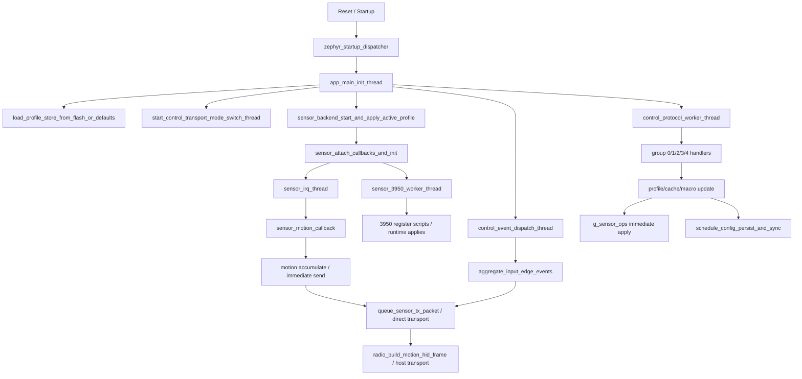
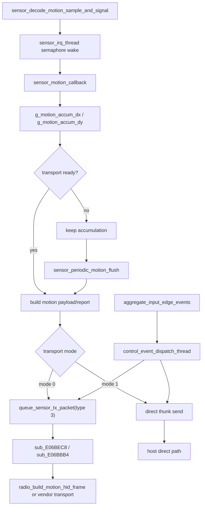

# CRDRAKO 54H 滑鼠韌體架構與行為分析

> [!IMPORTANT]
> <sub><strong>逆向聲明：</strong>本報告僅供合法的互通性研究、防禦性安全分析、教學、資料保存，以及裝置所有人或經授權者進行維修與維護時參考之用；不授權未經許可的刷寫、再散布、規避、侵權或其他違法用途，相關第三方權利仍歸各自權利人所有。</sub>

## 家族選用說明

收錄本報告，是因為 CRDRAKO 家族可作為由專門嵌入式方案供應商提供之高階無線遊戲滑鼠韌體代表樣本。它能較好反映市場上大量商用滑鼠在實作模式、工程成熟度與整體韌體水準上的常見做法。

## 0. 文件說明

### 0.1 目標

本文件用於固化 `54H_mouse_Cpurad_App_v01.06.01.12` 滑鼠韌體的逆向分析結論，重點覆蓋以下問題：

- 韌體程式碼框架與模組邊界
- 執行緒、回撥、佇列和執行組織方式
- 感測器運動資料從原始取樣到最終上報的路徑
- WebHID / Vendor 配置協議、命令字與配置項語義
- 競技模式開關對應的執行時模式與 3950 暫存器指令碼
- 真正屬於韌體層的運動 / 事件時序處理邏輯
- 睡眠、喚醒、功耗與重置監督路徑

### 0.2 分析依據

本檔案以當前 IDA Pro 逆向資料庫為一手分析結果，輔助參考以下材料：

- IDA 資料庫：`/54H_mouse_Cpurad_App_v01.06.01.12.hex.i64`

### 0.3 更新章節（更新時間：2026-04-30，新韌體：`54H_mouse_Cpurad_App_v01.07.01.14.bin`，相對 `v01.06.01.12`）

#### 0.3.1 結論

這次更新屬於一次明確的產品化迭代，而不是單純的參數刷新。韌體底座沒有改變，仍然沿用同一條 `Zephyr + PAW3950 + profile/macro/protocol` 路線；主要差異在執行時組織方式，以及產品周邊子系統的補齊。

從舊版報告與舊版反編譯 C 來看，`v01.06.01.12` 的主線仍然高度集中在 `feature_report_rx_thread`、`control_protocol_worker_thread`、`control_event_dispatch_thread`、`control_transport_mode_switch_thread`，以及 `sensor_3950_worker_thread + sensor_irq_thread` 這組核心執行緒上。新版本沒有推翻這套骨架，但把更多職責拆成了顯式背景服務。

#### 0.3.2 已確認的變化

##### 1. 建置平台版本更明確

- 新韌體直接暴露：
  - `Booting nRF Connect SDK v3.1.0-6c6e5b32496e`
  - `Using Zephyr OS v4.1.99-1612683d4010`
- 這表示新版本已經明確落在新的 nRF Connect SDK / Zephyr 組合上，而不只是從執行模型側間接判斷平台風格。

##### 2. 執行時任務拆分明顯增多

相較舊版主要依賴少數幾個大執行緒承載控制、事件與後端邏輯，新版本啟動路徑中已確認建立出下列命名服務：

| 新執行單元 | 建立位置 | 作用方向 |
| --- | --- | --- |
| `battery_adc_thread` | `sub_E05C5C8` | 電池取樣 |
| `Button liftoff Thread` | `sub_E05D490` | 按鍵放開 / 邊沿處理 |
| `Button event Main Thread` | `sub_E05E19C` | 輸入事件聚合 |
| `Keep CPU alive Thread` | `sub_E05E4C0` | 保活策略 |
| `effect process Thread` | `sub_E05ED4C` | 效果處理 |
| `Sleep Wakeup check Thread` | `sub_E05F044` | 睡眠 / 喚醒巡檢 |
| `SPI_Prepare_Thread` | `sub_E05FB10` | 感測器側 SPI 準備 |
| `rf_voice_ctrl cmd process Thread` | `sub_E060310` | RF 側輔助命令通道 |
| `macro Main Thread` | `sub_E0619D4` | 巨集服務 |
| `system mode Thread` | `sub_E061D34` | 模式管理 |
| `Protocol cmd process Thread` | `sub_E062538` | 協議命令處理 |
| `RF_test_Thread` | `sub_E0632F8` | RF 測試路徑 |
| `usbd_app` | `sub_E064620` | USB 應用側服務 |
| `RF_RX_DECODE_Thread` | `sub_E0654A0` | RF 接收 decode 階段 |
| `RF_RX_RECV_Thread` | `sub_E0659B4` | RF 接收 recv 階段 |
| `usbd` | `sub_E0688B8` | USB device 側服務 |
| `PAW3950 Main Thread` + `PAW3950 Poll done Thread` | `sub_E070188` | 感測器主循環與 poll 完成處理 |

從工程角度來看，這表示新版已經從「少數核心 worker 承載多數職責」的組織方式，轉向「依產品子系統拆出背景服務」的組織方式。

##### 3. 感測器後端被重組成更明確的流水線

- 舊版報告中的 3950 後端主要圍繞 `sensor_3950_worker_thread` 和 `sensor_irq_thread` 展開。
- 新版則明確出現：
  - `SPI_Prepare_Thread`
  - `PAW3950 Main Thread`
  - `PAW3950 Poll done Thread`
- `sub_E070230()` 反映出分階段的 PAW3950 握手 / bring-up 路徑。
- `sub_E070530()` 反映出初始化完成後對快取執行態參數的批量回放。

這表示新版在感測器後端組織上更完整：匯流排準備、主處理與 poll 完成三個環節都被明確分離了出來。

##### 4. 電源與電池相關邏輯顯式化

- 新版新增了：
  - `battery_adc_thread`
  - `Keep CPU alive Thread`
  - `Sleep Wakeup check Thread`
- 相較舊版主要從 transport switching 和 reset supervision 的角度描述低功耗 / 恢復邏輯，新版把電量取樣、保活與喚醒巡檢直接做成了背景服務。

這種變化更接近商用品韌體常見的組織方式，因為它把功耗相關職責從附屬邏輯提升成了可獨立排程的執行單元。

##### 5. USB 與 RF 接收路徑更完整

- 新版字串中直接出現：
  - `USBHS_CORE`
  - `hid_dev_0/1/2`
  - `hid_0/1/2`
  - `usbhs@86000`
- 同時還有顯式執行緒：
  - `usbd_app`
  - `usbd`
  - `RF_RX_DECODE_Thread`
  - `RF_RX_RECV_Thread`
  - `RF_test_Thread`

相較舊版報告更強調 feature report 入口與統一控制執行緒的寫法，新版在 USB 裝置堆疊與 RF 接收流水線上給出了更完整的背景結構。

##### 6. 側功能面持續擴展

- `effect process Thread` 說明效果處理被單獨抽離。
- `rf_voice_ctrl cmd process Thread` 說明存在額外的 RF 側輔助命令路徑。
- 二進位中也出現了產品字串 `KO-ONE`。

這表示新版不只是內部重組，面向產品功能面的韌體職責本身也在擴大。

#### 0.3.3 未改變的骨架

- 新版仍然沿用同一家族的核心方向：
  - 仍然是 Zephyr / nRF Connect SDK 路線
  - 仍然是 PAW3950 路線
  - 仍然保留 profile / protocol / macro 這套基本模型
- 因此，這次更新更適合被理解為在舊底座上的擴展，而不是重新設計。

#### 0.3.4 工程含義

相較 `v01.06.01.12`，新版本在產品完整度上前進了一步。USB、RF 接收、電池管理、睡眠喚醒與感測器後端編排都比舊版更完整，也更容易在執行時結構中被辨識出來。

同時，它的演進方式仍然是增量式的：透過增加背景服務與狀態組織來擴展能力，而不是透過一次架構收斂來降低控制面的複雜度。換句話說，這是一次內容充實、組織更完整的版本更新，但不是一次推倒重來的重構版。

#### 0.3.5 協議欄位與 profile 語義層更新

舊版 `v01.06.01.12` 的活動配置熱路徑，基本上仍然是「`214B profile` 固定偏移 + 直接改位元組 + 直接調 `g_sensor_ops`」這一套；新版 `v01.07.01.14` 在 `sub_E070530()` / `sub_E0705C0()` 這條鏈路裡，已經改成「活動快取 + 內部命令號 + 感測器指令碼回放」的組織方式。也就是說，舊版那種從 profile 偏移直接讀出執行時語義的觀察方法，在新版裡仍然部分成立，但已經不足以覆蓋整條熱路徑。

| 舊版欄位 / 結構 | `v01.06.01.12` 語義 | `v01.07.01.14` 對應落點 | 更新判讀 |
| --- | --- | --- | --- |
| `profile +0x35/+0x37`、`+0x39/+0x3B`、`+0x5C` | 目前 DPI 對、次級 DPI 對，以及兩者之間的選擇旗標 | `word_2300A4CA/word_2300A4C8`、內部 `case 2`、`sub_E070530()`；`sub_E0705C0()` 仍保留 `6999 DPI` 閾值聯動 | DPI 對本身已被確認保留，但已不再用「單一 profile 位元組 + 直接回撥」的方式暴露；舊版獨立的 `+0x5C` 選擇旗標，在這條新熱路徑裡不再作為單獨欄位出現，更像是被吸收到快取態與模式態裡 |
| `profile +0x59` | `LOD code` | `byte_2300B882`、內部 `case 5` | 高信度延續。新版仍保留一個原始編碼位元組，而且仍有後端/模式相關的取值分支，只是不再直接表現為 profile 固定偏移 |
| `profile +0x5A` | `Angle Tune` | `byte_2300B87F`、內部 `case 8` | 高信度延續。舊版的單位元組調參項，在新版裡仍然是獨立的標量快取與獨立 apply case |
| `profile +0x54` | `Motion Sync` | 高機率對應 `byte_2300B87E`、內部 `case 9`、`sub_E06FE2C()` / `sub_E070490()` | 高機率對映。新版這裡已不是簡單布林回撥，而是帶有一組暫存器位與參數回放的啟停序列，表示該項已被提升成顯式後端配置過程 |
| `profile +0x55`、`+0x56`、`+0x58` | `Angle Snap`、`Ripple Control`、`XY Sync` 三個小開關 | `byte_2300B883`、`byte_2300B881`、`byte_2300B880`，對應內部 `case 4/6/7` | 可以確認這三類小型布林感測器配置仍然存在，但新版已將它們拆成獨立活動快取；僅從目前工作執行緒還無法把三者和 `case 4/6/7` 做完全無歧義的一一命名，還需要再沿外層協議分發點追一跳 |
| `profile +0x57`、`+0x5B` | `Hyper Mode`、`Competition Mode`，並與 polling / perf 模式聯動 | `byte_2300B885`、`byte_2300B884`、內部 `case 3`，以及 `sub_E076FB8()`、`sub_E0772B6()`、`sub_E0775B4()`、`sub_E07798A()`、`sub_E077CB2()`、`sub_E077FDE()` 這組感測器指令碼函式 | 這是本次語義層更新裡最明確的一處重寫。舊版是「兩個 profile 開關位 + 若干條件分支」，新版已改成「請求模式值 + 目前已套用的指令碼類別 + 多個後端指令碼入口」的顯式狀態機；其中 `value == 4` 還保留了 `6999 DPI` 閾值驅動的自動分流 |
| `profile +0x53` | polling / perf 混合控制位元組 | 在目前新工作執行緒裡，不再以單一 profile 熱欄位形態出現；只剩 `case 1/10` 重放門、`byte_2300B87C/byte_2300B87D` 與 `word_2300A49C` 這類外圍狀態可見 | 這不能證明該控制已消失，但可以確認它不再和其它感測器熱配置一起，以「連續 profile 位元組」的形式暴露在同一條執行時路徑上 |

這一層更新的工程意義很直接：舊版更接近「儲存布局就是執行時語義」，新版則已經拆成「儲存語義、活動快取、內部命令、後端指令碼」四層。這樣做的直接收益，是感測器重新 bring-up 之後可以透過 `sub_E070530()` 做一次集中回放，也更適合處理初始化失敗、後端切換與模式重入。

但也要注意，當前證據只足以證明「執行時熱路徑被重新序列化了」，還不能僅憑這條鏈路就斷言底層持久化 blob 已經徹底放棄舊版 `214B profile` 結構。能被確認的變化，是配置語義已經從「固定偏移直達行為」變成了「快取態與狀態機驅動行為」。

---

## 1. 韌體總體框架

### 1.1 執行模型

該韌體的整體執行模型為：

- `Zephyr 風格 RTOS 多執行緒 + 回撥 + 佇列 + 中斷/訊號量混合模型`
- 高頻資料路徑：
  - `sensor_decode_motion_sample_and_signal` 原始 sample 解碼
  - `sensor_irq_thread` `0xE07C084`
  - `sensor_motion_callback` `0xE06FCE8`
  - `sensor_periodic_motion_flush` `0xE0700A4`
- 前臺控制路徑：
  - 控制前端接收執行緒 `feature_report_rx_thread` `0xE06F9B4`
  - 統一命令執行執行緒 `control_protocol_worker_thread`
  - 非同步事件執行緒 `control_event_dispatch_thread`
  - 傳輸模式切換執行緒 `control_transport_mode_switch_thread`

### 1.2 主模組劃分

| 子系統 | 主要職責 | 代表函式 / 代表物件 |
| --- | --- | --- |
| 啟動與執行緒框架 | 靜態 init、應用初始化、執行緒建立 | `zephyr_startup_dispatcher`, `app_main_init_thread` |
| 配置儲存 | 裝載 profile blob、CRC 校驗、預設回退、落盤排程 | `load_profile_store_from_flash_or_defaults`, `schedule_config_persist_and_sync`, `g_default_profile_store_blob` |
| 配置協議 / 命令入口 | 解析 group/cmd，呼叫各子系統 | `control_protocol_worker_thread`, `handle_device_misc_command_group`, `handle_perf_sensor_command_group` |
| 感測器抽象層 | 將協議項對映到 3950 後端 vtable | `g_sensor_ops`, `apply_active_profile_runtime_state`, 各 `set_*_from_command` |
| 3950 後端 | 初始化、控制訊息處理、暫存器指令碼應用 | `sensor_3950_initialize`, `sensor_3950_worker_thread`, `sensor_3950_load_startup_register_table` |
| 輸入系統 | 運動 sample、按鍵邊沿 / 擴充套件事件聚合 | `sensor_decode_motion_sample_and_signal`, `sensor_motion_callback`, `aggregate_input_edge_events` |
| 輸出系統 | 運動包 / 狀態包構造與發佇列 | `queue_sensor_tx_packet`, `queue_control_status_report`, `radio_build_motion_hid_frame` |
| 宏儲存 | 20 槽索引、flash 頁分配、分塊讀寫 | `macro_slot_allocate_storage`, `macro_slot_write_chunk`, `macro_slot_delete` |
| 功耗與恢復 | 傳輸切換、監督定時器、重置請求 | `control_transport_mode_switch_thread`, `reset_supervisor_thread`, `request_system_reset_forever` |

### 1.3 啟動階段

韌體啟動時按以下順序建立系統：

1. `zephyr_startup_dispatcher()` 輸出 Zephyr banner，遍歷靜態 init 表 `unk_E084BB0`，隨後進入應用初始化執行緒。
2. `app_main_init_thread()` 執行硬體 / watchdog 風格初始化，並呼叫 `load_profile_store_from_flash_or_defaults()` 裝載配置。
3. 初始化控制通道、非同步事件執行緒、宏執行緒、傳輸模式切換執行緒、無線/傳輸工作執行緒。
4. 呼叫 `sensor_backend_start_and_apply_active_profile()`，繫結 3950 回撥並啟動 `sensor_3950_worker_thread + sensor_irq_thread`。
5. `sensor_3950_initialize()` 執行一次性 startup register table，並在 ready 後恢復 DPI、LOD、Motion Sync、Angle Snap、Ripple、Angle Tune、perf mode 等執行態。
6. 主初始化執行緒隨後進入長期等待 / 訊號量式維護迴圈。

### 1.4 執行階段

- 資料取樣路徑
  - `sensor_decode_motion_sample_and_signal` 解碼原始 sample 並 post semaphore
  - `sensor_irq_thread` 透過 callback 間接呼叫 `sensor_motion_callback`
- 報告生成路徑
  - 運動累加先進入 `g_motion_accum_dx/g_motion_accum_dy`
  - 再按 transport mode 走直接傳送路徑或 `queue_sensor_tx_packet()` 排隊路徑
  - 無線側最終由 `radio_build_motion_hid_frame()` 構造緊湊 HID 幀
- 配置處理路徑
  - 傳輸前端執行緒收包並轉成內部請求
  - `control_protocol_worker_thread` 統一執行 group 0..4 命令
  - 寫 profile / cache / macro 後觸發 `schedule_config_persist_and_sync()`
- 模式切換路徑
  - profile 切換、DPI 切換、Hyper / Competition 切換、profile 子塊延遲應用，均透過統一事件執行緒與 sensor backend 協同
- 低功耗 / 恢復路徑
  - `control_transport_mode_switch_thread` 和 `reset_supervisor_thread` 共同參與傳輸切換與監督
  - 本輪已經明確“監督復位與恢復”路徑；本文不把更深層 SoC sleep 分級作為主體展開

### 1.5 程式碼設計風格

#### 特徵 1：狀態組織方式

- `大量全域性變數 + 小型上下文結構 + 任務佇列`
- 說明：
  - 例如 profile 執行態分散在 `g_profile_storage/g_profile_records`、`g_active_dpi_x/g_active_dpi_y`、`g_motion_queue_payload`、`byte_2300B87D` 等全域性物件中
  - 感測器後端透過 `g_sensor_ops` 把“協議邏輯”和“3950 具體實現”隔離開

#### 特徵 2：中斷與前臺分工

- IRQ / callback 中主要做：
  - 原始 sample 解碼
  - semaphore / event 喚醒
  - 少量狀態位更新
- 前臺執行緒中主要做：
  - 暫存器指令碼寫入
  - profile / macro / cache 的更新
  - 非同步狀態包和運動包構造

#### 特徵 3：配置應用風格

- `先改 RAM profile / cache，再按是否為 active profile 決定是否立即作用於 sensor backend，同時非同步排程持久化`
- 說明：
  - group 1/2/3 命令幾乎都遵循“改 RAM -> 若當前 profile 生效則呼叫 g_sensor_ops -> schedule_config_persist_and_sync() -> queue_control_status_report()”這一統一處理範式

#### 特徵 4：模式實現風格

- `點陣圖開關 + 列舉 perf mode + 長暫存器指令碼驅動`
- 說明：
  - 競技模式不是單純 UI 布林位；它最終會驅動 `sensor_backend_apply_perf_mode()`，進入不同 3950 暫存器指令碼

---

## 2. 配置系統與命令入口

### 2.1 章節邊界

本章只保留“命令從哪裡進來、怎樣被執行”的執行路徑；配置映象佈局、profile 欄位、宏儲存、報文格式和配置項對映統一收攏到第 7 章，避免與協議摘要重複展開。

### 2.2 配置命令入口

按傳輸通道分別說明命令入口：

#### USB / WebHID / HID Feature

- 控制前端接收執行緒：`feature_report_rx_thread` `0xE06F9B4`
- 前端工作區：`unk_23009818` 及周邊 20 位元組結構
- 內部分發函式：`sub_E07103C()`
- 統一執行入口：`control_protocol_worker_thread()`
- 工作方式：前端執行緒把收到的控制幀整理成內部工作項，再由統一 worker 按 `group/cmd` 執行

#### BLE / GATT / Vendor Service

- 本報告不把 BLE 單獨作為配置入口展開。

#### 2.4G / Vendor 自定義協議

- 出站非同步包入口：`queue_sensor_tx_packet()` -> `sub_E06BEC8()` -> `sub_E06BBB4()`
- 無線運動幀構造：`radio_build_motion_hid_frame()`
- 無線排程配置：`radio_apply_polling_schedule_profile()`, `radio_restart_timeslot_scheduler()`
- 佇列訊息依賴內部 packet type 與 payload length 組織，不單獨附加 checksum 欄位。

### 2.3 配置執行模型

該韌體的配置執行風格可概括為：

- `前端收包 -> 統一 worker 按 group/cmd 執行 -> 寫 RAM profile/cache/macro -> 若當前 profile 生效則立即下發到 g_sensor_ops -> 排程非同步狀態上報與持久化`

優點：

- 所有配置項最終都落到同一套 profile / cache 物件，斷電恢復一致性好
- 3950 暫存器寫入被隔離在 sensor backend，協議層與硬體層邊界清晰
- 非同步 `queue_control_status_report()` 讓 UI 狀態回顯與核心寫配置邏輯解耦

閱讀注意點：

- `feature_report_rx_thread` 在本文統一視作“控制前端接收層”，不再強分更底層承載匯流排。
- `g_profile_storage` / `g_profile_records` 的別名會讓反編譯公式出現偏移錯覺，分析時必須回到複製長度與步長常量。
- 某些低位 offset（如 `+0x17/+0x18`）只有穩定的命令級語義，因此本文以工程行為描述為主。

---

## 3. 感測器運動資料流轉流程

### 3.1 取樣入口

感測器取樣入口函式 / 中斷 / 回撥鏈如下：

- 原始 sample 解碼：`sensor_decode_motion_sample_and_signal(unsigned char *raw, ...)`
- IRQ 執行緒：`sensor_irq_thread()`
- 回撥安裝：`sensor_attach_callbacks_and_init()` 將 `motion_cb/raw_cb/ready_cb` 寫入 `unk_2300A3C4/unk_2300A3C0/unk_2300A3BC`
- 最終運動回撥：`sensor_motion_callback(sensor_motion_sample_t *sample)`
- 取樣觸發方式：
  - 3950 raw sample 解碼後 post semaphore
  - `sensor_irq_thread` 阻塞在 semaphore 上，喚醒後呼叫安裝好的 motion callback

### 3.2 原始資料解碼

`sensor_decode_motion_sample_and_signal()` 對 sample 位元組做了如下轉換：

| 原始欄位 | 含義 | 目標變數 / 結構 |
| --- | --- | --- |
| `raw[0] >> 7` | motion 狀態位 | `g_sensor_sample_motion_flag` |
| `raw[0] & 0x08` | 額外狀態位 | `g_sensor_sample_aux_flag` |
| `(raw[0] & 0x20) == 0` | 樣本狀態位；後續參與 `sub_E07C330()` 的異常 / 恢復門控 | `g_sensor_sample_bit20_clear` |
| `raw[1]` | sample 附加狀態 / 標誌位元組 | 區域性輸出 `out_value` |
| `*(uint16_t *)(raw + 2)` | `dx` | `g_sensor_sample_dx` |
| `*(uint16_t *)(raw + 4)` | `dy` | `g_sensor_sample_dy` |

說明：

- `dx/dy`、`motion flag`、`aux flag` 與 `bit20_clear` 這四條賦值路徑都由 IDA 直接確認。
- 本節只記錄韌體裡真實發生的位運算與落點；如果後續需要把這些位精確對映到 3950 資料手冊欄位，可再單獨補暫存器 / burst 欄位附表。

### 3.3 中間態累計與整形

從原始運動量到最終輸出之間的中間狀態如下：

- 累計變數：
  - `g_motion_accum_dx`
  - `g_motion_accum_dy`
- 處理方式：
  - `sensor_motion_callback()` 每收到一幀 sample 先累加到上述兩個變數
  - 如果 transport 當前可傳送，則立刻嘗試構造本次 payload / report，成功後清空累計值
  - 如果 transport 暫時不發包，則累計值保留到下一次週期沖刷 `sensor_periodic_motion_flush()`
- 平滑 / 濾波：
  - 在 `sensor_decode_motion_sample_and_signal()` 到 `sensor_motion_callback()` 之間，沒有額外的軟體平滑 / 濾波分支。
  - Motion Sync / Ripple / Angle Snap 等選項主要透過 3950 暫存器指令碼實現，不應誤寫為本節的軟體演算法。
- 事件編排：
  - `sample->has_button_event` 會觸發 `sub_E068ADC()` 或 `sub_E068B14()`，並與按鍵事件管線交叉

### 3.4 不同傳輸模式下的資料路徑

#### transport mode 0

1. `sensor_motion_callback()` 構造本地 8 位元組 payload，寫入 `g_motion_queue_payload[0..7]`。
2. payload 中包含按鈕位和 `dx/dy`。
3. 呼叫 `queue_sensor_tx_packet(3, ..., 8)` 嘗試進入傳送佇列；該 helper 自身還會檢查 `BYTE1(g_control_transport_mode)`，因此真正排隊成功依賴更高層 transport 狀態。
4. 佇列項後續由 `sub_E06BEC8()` 消費，再轉入 `sub_E06BBB4()`。

工程解釋：

- 這是一個“先排隊、後統一路由”的路徑。
- 從 IDA 能確認的是：這一路徑依賴內部 packet queue，而不是 RAM thunk 直接傳送路徑。

#### transport mode 1

1. `sensor_motion_callback()` 透過 RAM thunk `sub_E084490()` / `sub_E084498()` 檢查傳送可用性並下發本次 report。
2. 若傳送成功，則清零累計的 `dx/dy`。
3. 某些路徑會順帶處理按鈕位並呼叫 `refresh_activity_supervisor_timer()` 維持活動定時器。

工程解釋：

- 這是一個更直接的傳送路徑，沒有經過 `queue_sensor_tx_packet()` 佇列。
- 從 IDA 能確認的是：`sub_E084490()` / `sub_E084498()` 組成了獨立於 packet queue 的直接傳送分支。

#### 無線 HID 構幀路徑

- `radio_build_motion_hid_frame()` 把當前按鈕位、狀態位和 `dx/dy` 打成緊湊無線 HID 幀。
- `sub_E087DEC()` 是其上層排程 / 傳送路徑，受無線狀態機與 polling schedule 參數影響。

### 3.5 滾輪資料鏈路

單獨描述滾輪鏈路：

- 存在滾輪 / 擴充套件輸入事件聚合：
  - `aggregate_input_edge_events()` 會處理多種事件型別，並向 `587241424`/`587241420` 等 event 物件投遞位級變化
  - `control_event_dispatch_thread()` 會把 case `5/6` 類事件打成短包，並按 transport mode 走直接路徑或 `queue_sensor_tx_packet(9)`
- 與滾輪相關的配置項：
  - `Tournament Scroll / Window Time` 由 group 0 `cmd 0x19/0x99` 讀寫
- 本報告覆蓋到“配置入口 -> 事件聚合 -> 非同步短包”的韌體層路徑，不繼續展開更底層滾輪取樣外設。

### 3.6 最終報告生成

最終報告的形成方式如下：

- 標準運動報告：
  - mode 1 直接路徑：`sensor_motion_callback()` / `sensor_periodic_motion_flush()` -> RAM thunk 傳送
  - mode 0 佇列路徑：`queue_sensor_tx_packet(3)` -> `sub_E06BEC8()` -> `sub_E06BBB4()` -> 後端傳送
- 無線最終 HID 幀：
  - `radio_build_motion_hid_frame()`
- 非同步狀態 / 配置回顯：
  - `queue_control_status_report()` 根據 report kind 構造 8 位元組狀態包
- busy 重試 / carry 保留：
  - 如果當前路徑傳送失敗，`g_motion_accum_dx/g_motion_accum_dy` 不會被清零，後續由下一次 sample 或週期沖刷繼續嘗試傳送。
- 何時不發包：
  - `queue_sensor_tx_packet()` 僅在 `BYTE1(g_control_transport_mode)` 非零時工作
  - mode 1 直接傳送路徑會先檢查 thunk 返回狀態，未就緒則不清累計、不發包

---

## 4. 競技模式

### 4.1 模式定義

本韌體中的“競技模式”不是獨立於其它選項的單一布林狀態，而是 3950 後端 `perf mode` 選擇鏈中的一環。與該鏈直接相關的 profile 欄位有三項：

- `profile +0x53`：polling code / perf 速率編碼
- `profile +0x57`：Hyper Mode 位
- `profile +0x5B`：Competition Mode 位

IDA 中 `set_hyper_mode_enabled_from_command()`、`set_competition_mode_enabled_from_command()`、`apply_polling_rate_command()` 三條路徑都會直接呼叫 `g_sensor_ops->apply_perf_mode()`。這說明“競技模式”的真實硬體含義不是 UI 開關本身，而是把 3950 切到另一組 perf mode 暫存器指令碼。

### 4.2 模式選擇邏輯

從 IDA 反編譯和反彙編可以直接還原出這條選擇鏈：

1. `set_hyper_mode_enabled_from_command()` 寫 `profile +0x57`。
2. `set_competition_mode_enabled_from_command()` 寫 `profile +0x5B`。
3. `apply_polling_rate_command()` 在更新 `profile +0x53` 後，會重新把 backend 拉回與當前速率編碼匹配的 perf mode。
4. `sensor_backend_apply_perf_mode()` 把目標 mode 打包為 worker 訊息 `case 3`，交給 `sensor_3950_worker_thread()` 執行真正指令碼。

對使用者可見的配置組合，韌體內部的 mode 歸約關係如下：

| Hyper | Competition | 速率編碼作用 | 最終 perf mode |
| --- | --- | --- | --- |
| `0` | `0/1` | 低速率編碼會把 backend 拉回基礎指令碼 | `2` |
| `1` | `0` | 高速率編碼 / Hyper 路徑會切到高效能指令碼族 | `4` |
| `1` | `1` | Competition 開啟後強制切到競技指令碼 | `5` |

補充說明：

- `Competition` 只有在 `Hyper` 開啟的情況下才會把 backend 推到 `perf mode 5`；如果 `Hyper` 關閉，程式碼會直接回到 `perf mode 2`。
- `apply_polling_rate_command()` 會把 `g_active_polling_code` 分成兩組：
  - `0x20/0x40/0x80` 這一組屬於高效能速率編碼，Competition 關閉時回到 `mode 4`
  - `0x01/0x02/0x04/0x08/0x10` 這一組走基礎指令碼，Competition 關閉時回到 `mode 2`
- `sensor_backend_apply_perf_mode(4)` 不是單指令碼呼叫，而是先依據兩枚 16 位 DPI 快取字選擇一個 `mode 4` 子選擇器，再封裝成 worker 訊息。
- `sensor_3950_worker_thread()` 在 `case 2` 寫完 `reg 0x48..0x4B` 後，會用 `g_sensor_cached_dpi_x/g_sensor_cached_dpi_y` 再次檢查 `0x1B57`（6999）閾值，並在需要時補發 `case 3`，把 `mode 4` 的最終指令碼校正到與當前 DPI 檔位一致。
- `g_sensor_backend_id == 2` 時，Competition 開啟路徑會被拒絕，不會強行下發 `mode 5`。

### 4.3 模式的暫存器寫入 / 參數寫入

`sensor_3950_worker_thread(case 3)` 中的 `v42/v43` 分發可以直接整理成以下指令碼族。下面的清單按 IDA 中真實函式邊界和真實暫存器寫入組織；為了可讀性，列表中省略了每次切 bank 的 `reg 0x7F = bank` 寫入，只保留各 bank 內的有效暫存器賦值。

| 內部 perf mode | worker 選擇器 | 函式 | 說明 |
| --- | --- | --- | --- |
| `1` | `v42 = 1` | `sub_E083F76` | 3950 perf script 1 |
| `2` | `v42 = 2` | `sub_E083C4A` | 3950 perf script 2 |
| `3` | `v42 = 3` | `sub_E083922` | 3950 perf script 3 |
| `4A` | `v42 = 4, v43 = 1` | `sub_E082F50` | perf mode 4 的高 DPI 變體；worker `case 2` 中任一軸 `> 6999` 時最終落此指令碼 |
| `4B` | `v42 = 4, v43 = 2` | `sub_E08324E` | perf mode 4 的低 DPI 變體；worker `case 2` 中雙軸 `<= 6999` 時最終落此指令碼 |
| `5` | `v42 = 5` | `sub_E08354C` | Competition 對應指令碼 |

#### perf mode 1 / `sub_E083F76`

入口特點：
先讀 `bank 0, reg 0x40`，結尾按位回寫 `reg 0x40 = (old & 0xFC) | 0x02`。

完整寫入：
bank `0x07`：`0x40=0x40, 0x42=0x28, 0x43=0x00`
bank `0x05`：`0x43=0xE4, 0x44=0x05, 0x49=0x10, 0x51=0x28, 0x53=0x30, 0x55=0xFB, 0x5B=0xFB, 0x5F=0x90, 0x61=0x3B, 0x6D=0xB8, 0x6E=0xDF, 0x7B=0x10`
bank `0x06`：`0x53=0x03, 0x62=0x01, 0x7A=0x02, 0x6B=0x20, 0x6D=0x8F, 0x6E=0x70, 0x6F=0x04`
bank `0x09`：`0x40=0x01, 0x43=0x13, 0x44=0x88, 0x47=0x00, 0x4F=0x0C, 0x51=0x04, 0x55=0x3F, 0x56=0x3F, 0x59=0x0F, 0x5A=0x0F, 0x73=0x0C`
bank `0x0A`：`0x4A=0x14`
bank `0x19`：`0x41=0x53, 0x47=0x64, 0x4B=0x02, 0x4C=0x02`
bank `0x0C`：`0x4A=0x1C, 0x4B=0x14, 0x4C=0x4F, 0x4D=0x02, 0x50=0x00, 0x51=0x01, 0x53=0x16, 0x55=0x10, 0x62=0x18`
bank `0x14`：`0x62=0x14`
bank `0x18`：`0x48=0x65, 0x50=0x34, 0x51=0x54, 0x52=0x38, 0x53=0x5F, 0x55=0x7F, 0x61=0x1C, 0x62=0x60, 0x63=0xFF, 0x64=0x00, 0x70=0x22, 0x71=0xF2, 0x72=0xF6, 0x77=0x32, 0x79=0xCC`
bank `0x00`：`0x4E=0x00, 0x4F=0x4F, 0x51=0x00, 0x52=0x4F, 0x47=0x01, 0x54=0x52, 0x5A=0x80, 0x78=0x0A, 0x79=0x10, 0x40=(old & 0xFC) | 0x02`

#### perf mode 2 / `sub_E083C4A`

入口特點：
先讀 `bank 0, reg 0x40`，結尾按位回寫 `reg 0x40 = (old & 0xFC) | 0x01`。

完整寫入：
bank `0x07`：`0x40=0x41, 0x42=0x28, 0x43=0x00`
bank `0x05`：`0x43=0xE4, 0x44=0x05, 0x49=0x10, 0x51=0x40, 0x53=0x40, 0x55=0xFC, 0x5B=0xFC, 0x5F=0x90, 0x61=0x3B, 0x6D=0xB8, 0x6E=0xDF, 0x7B=0x10`
bank `0x06`：`0x53=0x03, 0x62=0x01, 0x7A=0x02, 0x6B=0x20, 0x6D=0x8F, 0x6E=0x70, 0x6F=0x04`
bank `0x09`：`0x40=0x01, 0x43=0x13, 0x44=0x88, 0x47=0x00, 0x4F=0x0C, 0x51=0x04, 0x55=0x3F, 0x56=0x3F, 0x59=0x0F, 0x5A=0x0F, 0x73=0x0C`
bank `0x0A`：`0x4A=0x11`
bank `0x19`：`0x41=0x32, 0x47=0x12, 0x4B=0x01, 0x4C=0x01`
bank `0x0C`：`0x4A=0x1C, 0x4B=0x14, 0x4C=0x4F, 0x4D=0x02, 0x50=0x00, 0x51=0x01, 0x53=0x16, 0x55=0x10, 0x62=0x18`
bank `0x14`：`0x62=0x14`
bank `0x18`：`0x48=0x65, 0x50=0x34, 0x51=0x54, 0x52=0x38, 0x53=0x5F, 0x55=0x7F, 0x61=0x1C, 0x62=0x60, 0x63=0xFF, 0x64=0x00, 0x70=0x22, 0x71=0xF2, 0x72=0xF6, 0x77=0x32, 0x79=0xCC`
bank `0x00`：`0x4E=0x00, 0x4F=0x4F, 0x51=0x00, 0x52=0x4F, 0x47=0x01, 0x54=0x53, 0x5A=0x80, 0x78=0x01, 0x79=0x9C, 0x40=(old & 0xFC) | 0x01`

#### perf mode 3 / `sub_E083922`

入口特點：
先讀 `bank 0, reg 0x40`，結尾按位回寫 `reg 0x40 = old & 0xFC`。

完整寫入：
bank `0x07`：`0x40=0x41, 0x42=0x28, 0x43=0x00`
bank `0x05`：`0x43=0xE4, 0x44=0x05, 0x49=0x10, 0x51=0x40, 0x53=0x40, 0x55=0xFB, 0x5B=0xFB, 0x5F=0x90, 0x61=0x31, 0x6D=0xB8, 0x6E=0xCF, 0x7B=0x10`
bank `0x06`：`0x53=0x03, 0x62=0x01, 0x7A=0x02, 0x6B=0x20, 0x6D=0x8F, 0x6E=0x70, 0x6F=0x04`
bank `0x09`：`0x40=0x01, 0x43=0x13, 0x44=0x88, 0x47=0x00, 0x4F=0x0C, 0x51=0x04, 0x55=0x3F, 0x56=0x3F, 0x59=0x0F, 0x5A=0x0F, 0x73=0x0C`
bank `0x0A`：`0x4A=0x14`
bank `0x19`：`0x41=0x32, 0x47=0x12, 0x4B=0x01, 0x4C=0x01`
bank `0x0C`：`0x4A=0x1C, 0x4B=0x14, 0x4C=0x4F, 0x4D=0x02, 0x50=0x00, 0x51=0x01, 0x53=0x16, 0x55=0x10, 0x62=0x18`
bank `0x14`：`0x62=0x14`
bank `0x18`：`0x48=0x65, 0x50=0x34, 0x51=0x54, 0x52=0x38, 0x53=0x5F, 0x55=0x7F, 0x61=0x1C, 0x62=0x60, 0x63=0xFF, 0x64=0x00, 0x70=0x22, 0x71=0xF2, 0x72=0xF6, 0x77=0x32, 0x79=0xCC`
bank `0x00`：`0x4E=0x00, 0x4F=0x4F, 0x51=0x00, 0x52=0x4F, 0x47=0x01, 0x54=0x53, 0x5A=0x80, 0x78=0x01, 0x79=0x9C, 0x40=old & 0xFC`

#### perf mode 4A / `sub_E082F50`

完整寫入：
bank `0x07`：`0x40=0x41, 0x42=0x14, 0x43=0x00`
bank `0x05`：`0x43=0x64, 0x44=0x05, 0x49=0x20, 0x51=0x40, 0x53=0x40, 0x55=0xFB, 0x5B=0xFB, 0x5F=0x90, 0x61=0x31, 0x6D=0xB8, 0x6E=0xCF, 0x7B=0x50`
bank `0x06`：`0x53=0x03, 0x62=0x02, 0x7A=0x03, 0x6B=0x20, 0x6D=0x8F, 0x6E=0x70, 0x6F=0x07`
bank `0x09`：`0x40=0x01, 0x43=0x23, 0x44=0x88, 0x47=0x00, 0x4F=0x0C, 0x51=0x04, 0x55=0x3F, 0x56=0x3F, 0x59=0x0F, 0x5A=0x0F, 0x73=0x0C`
bank `0x0A`：`0x4A=0x14`
bank `0x19`：`0x41=0x32, 0x47=0x24, 0x4B=0x02, 0x4C=0x02`
bank `0x0C`：`0x4A=0x20, 0x4B=0x1F, 0x4C=0x5C, 0x4D=0x90, 0x50=0x14, 0x51=0x15, 0x53=0x1E, 0x55=0x02, 0x62=0x02`
bank `0x14`：`0x62=0x14`
bank `0x18`：`0x48=0x55, 0x50=0x18, 0x51=0x40, 0x52=0x20, 0x53=0x38, 0x55=0x68, 0x61=0x0A, 0x62=0x1A, 0x63=0x48, 0x64=0x40, 0x70=0x22, 0x71=0x88, 0x72=0x88, 0x77=0x22, 0x79=0xCB`
bank `0x00`：`0x4C=0x20, 0x4D=0x30, 0x4E=0x28, 0x4F=0x4F, 0x51=0x00, 0x52=0x4F, 0x47=0x01, 0x54=0x55, 0x5A=0x80, 0x5B=0x24, 0x5D=0x02, 0x5E=0x01, 0x6D=0x85, 0x6E=0x0C, 0x6F=0x0A, 0x40=0x83`

#### perf mode 4B / `sub_E08324E`

完整寫入：
bank `0x07`：`0x40=0x41, 0x42=0x14, 0x43=0x00`
bank `0x05`：`0x43=0x64, 0x44=0x05, 0x49=0x20, 0x51=0x10, 0x53=0x40, 0x55=0xFB, 0x5B=0xFB, 0x5F=0x80, 0x61=0x31, 0x6D=0xA7, 0x6E=0xCD, 0x7B=0x50`
bank `0x06`：`0x53=0x02, 0x62=0x02, 0x7A=0x03, 0x6B=0x20, 0x6D=0x98, 0x6E=0x80, 0x6F=0x07`
bank `0x09`：`0x40=0x03, 0x43=0x23, 0x44=0x98, 0x47=0x18, 0x4F=0x00, 0x51=0x11, 0x55=0x54, 0x56=0x54, 0x59=0x20, 0x5A=0x20, 0x73=0x0E`
bank `0x0A`：`0x4A=0x14`
bank `0x19`：`0x41=0x32, 0x47=0x24, 0x4B=0x02, 0x4C=0x02`
bank `0x0C`：`0x4A=0x20, 0x4B=0x1F, 0x4C=0x5C, 0x4D=0x90, 0x50=0x14, 0x51=0x15, 0x53=0x1E, 0x55=0x02, 0x62=0x02`
bank `0x14`：`0x62=0x14`
bank `0x18`：`0x48=0x55, 0x50=0x18, 0x51=0x40, 0x52=0x20, 0x53=0x38, 0x55=0x68, 0x61=0x0A, 0x62=0x1A, 0x63=0x48, 0x64=0x40, 0x70=0x22, 0x71=0x88, 0x72=0x88, 0x77=0x22, 0x79=0xCB`
bank `0x00`：`0x4E=0x00, 0x4F=0x95, 0x51=0x00, 0x52=0x95, 0x47=0x01, 0x54=0x55, 0x5A=0x80, 0x40=0x83`

#### perf mode 5 / `sub_E08354C`

入口特點：
指令碼開始先直接把 DPI 相關暫存器寫成 `0x003F / 0x003F`，隨後執行一套與 `perf mode 4B` 同核的主體指令碼，最後在 `bank 0` 追加兩次完全相同的尾段。

指令碼起始 DPI 預裝載：
bank `0x00`：`0x48=0x3F, 0x49=0x00, 0x4A=0x3F, 0x4B=0x00, 0x47=0x01`

主體指令碼：
與 `perf mode 4B / sub_E08324E` 的 `bank 0x07/0x05/0x06/0x09/0x0A/0x19/0x0C/0x14/0x18/0x00` 寫入集合相同。

競技模式追加尾段：
bank `0x00`：`0x40=0x03, 0x7D=0x0A, 0x77=0xFF, 0x7E=0x77, 0x79=0xFF, 0x7B=0xFF, 0x7A=0x01, 0x40=0x83`
上述尾段會連續重複兩次。

指令碼退出後的固定動作：
`sensor_3950_worker_thread()` 在執行完 `sub_E08354C()` 後，會額外延時 `0x4E20`，然後透過 `g_sensor_ops->set_dpi_xy()` 重新下發當前執行時 DPI。

### 4.4 模式差異分析

#### 共性

- 所有指令碼都透過 `sensor_reg_write_u8()` 成批下發 bank/reg/value 三元組。
- `bank 0x0C/0x14/0x18/0x19` 是共享度最高的公共主體，mode 1/2/3/4/5 都在這些 bank 上寫了大量基礎參數。
- `perf mode 1/2/3` 這三組指令碼都包含“先讀 `reg 0x40`、末尾按位回寫”的結構。

#### 差異點

- `perf mode 4A` 與 `4B` 的主要差異集中在 `bank 0x05`、`bank 0x06`、`bank 0x09` 和 `bank 0x00` 尾段，說明 mode 4 本身就是一個帶變體的指令碼族。
- `sub_E082F50` 與 `sub_E08324E` 的切換不是 UI 層抽象，而是 worker 在寫完當前 DPI 後再圍繞 `6999 DPI` 閾值做的最終指令碼選擇。
- `perf mode 5` 以 `4B` 為主體，但額外加入了 DPI 預裝載和兩輪重複尾段，這是它最顯著的識別特徵。
- `perf mode 1/2/3` 與 `4/5` 在 `bank 0x19`、`bank 0x18` 和 `bank 0x00` 尾段差異很大，說明內部確實存在多套效能指令碼，而不是同一套參數做輕微微調。

#### 關鍵工程解釋

- “競技模式”在韌體裡真正做的事，是把 3950 切換到 `perf mode 5` 指令碼族。
- “Hyper / Polling / Competition” 三個配置項共同決定的是 backend 指令碼族，而不是單一暫存器位。
- `perf mode 4` 之所以需要兩個變體，是因為韌體會在 DPI 真正寫入 3950 後，再按 `6999 DPI` 閾值把指令碼固定到高 DPI 或低 DPI 變體。
- 這一整章描述的是暫存器指令碼與模式系統，不屬於韌體層運動整形演算法。

### 4.5 模式切換前後流程

競技模式及其相關指令碼切換，按 IDA 中的真實執行順序可歸納為：

1. 協議層先寫 `profile +0x57/+0x5B/+0x53` 等欄位。
2. `set_hyper_mode_enabled_from_command()`、`set_competition_mode_enabled_from_command()` 或 `apply_polling_rate_command()` 選出目標 `perf mode`。
3. `sensor_backend_apply_perf_mode()` 把目標 mode 封裝成 worker 訊息 `case 3`。
4. 若目標 mode 為 `4`，封裝時會先帶一個子選擇器；若後續 DPI 寫入使閾值關係發生變化，worker `case 2` 會再補發一次 `case 3`，最終落到 `sub_E082F50()` 或 `sub_E08324E()`。
5. 若目標 mode 為 `5`，worker 進入 `sub_E08354C()`，執行完指令碼後固定延時並重下發 DPI。
6. 正常 Competition/Hyper 切換路徑不會呼叫 `sensor_3950_initialize()` 全量初始化；全量重初始化屬於獨立的 worker `case 10`。

---

## 5. 廠商獨有功能與韌體層運動 / 事件處理演算法

### 5.1 功能清單

| 功能名 | 入口配置 | 生效層級 | 是否為韌體層演算法 | 備註 |
| --- | --- | --- | --- | --- |
| 運動累計與傳送門控 | 無獨立 UI；由常規 motion path 自動觸發 | 運動資料處理 / 輸出時序 | 是 | `sensor_motion_callback` 核心職責 |
| carry 補償量回灌 | 內部事件位 `0x20` | 運動資料處理 / 重發補償 | 是 | `aggregate_input_edge_events` 與 `sensor_motion_callback` 聯動 |
| 週期沖刷 | `Polling Rate` 間接決定節拍 | 輸出時序 | 是 | `sensor_periodic_motion_flush` 按 tick 強制嘗試發包 |
| 輸入邊沿聚合與非同步包化 | 按鍵 / 擴充套件輸入 / 組合鍵 | 事件處理 | 是 | `aggregate_input_edge_events` + `control_event_dispatch_thread` |
| 回報率到無線時隙排程對映 | `Polling Rate` | 輸出時序 / 無線排程 | 是 | 同時影響 flush 節拍和 radio 子時隙 |
| Competition / Hyper / Motion Sync / LOD 等 | group 1 配置項 | 感測器暫存器 | 否 | 這些屬於第 4 章的暫存器指令碼系統 |

### 5.2 運動累計、carry 合併與即時傳送

#### 功能定位

- 使用者側表現：運動並不是“每來一個 sample 就機械發一個包”，而是先進入累計器，再由 transport 就緒狀態決定是否立刻傳送。
- 韌體側目標：把感測器 sample 頻率、鏈路傳送視窗和按鈕 / 擴充套件輸入事件合併成同一條穩定輸出節奏。
- 關鍵物件：`g_motion_accum_dx`、`g_motion_accum_dy`、`g_pending_carry_dx`、`g_pending_carry_dy`、`g_motion_queue_payload[8]`

#### IDA 中能直接看到的執行鏈

1. `sensor_motion_callback(sample)` 先看 `sample->has_motion`，有運動就把 `sample->dx/dy` 累加到 `g_motion_accum_dx/dy`。
2. 如果當前 `transport mode == 0`，函式會把 `g_motion_queue_payload[0..7]` 清零，再把按鈕位、擴充套件事件計數和累計的 `dx/dy` 填進這個 8 位元組 payload，最後呼叫 `queue_sensor_tx_packet(3, ..., 8)`。
3. 如果當前 `transport mode == 1`，函式先透過 `sub_E084490()` 做傳送前探測，再透過 `sub_E084498()` 走直接傳送路徑。
4. 無論走哪條路徑，都是傳送成功後才清零累計器；如果傳送失敗，累計器會原樣保留到下一次 sample 或下一次週期沖刷。
5. `queue_sensor_tx_packet()` 本身還檢查 `BYTE1(g_control_transport_mode)`，因此“構造了 queued payload”與“真正入隊成功”是兩層條件。

#### carry / 補償量回灌

這是本輪在 IDA 中直接明確、很值得單獨寫明的一段韌體層邏輯：

- `aggregate_input_edge_events()` 的 `case 8` 會把一組 16 位增量加到 `g_pending_carry_dx` 與 `g_pending_carry_dy`，同時對事件物件 `587241424` 置位 `0x20`。
- `sensor_motion_callback()` 在 `transport mode == 1` 路徑下，如果發現這個 `0x20` 位已置位，就會先清掉該位，再把 `g_pending_carry_dx/g_pending_carry_dy` 累加回 `g_motion_accum_dx/dy`，隨後才發包。
- 這說明韌體裡存在一條“延後補償量回灌”通道：不是把補償量立即強行插進當前 sample，而是在下一次合適的傳送視窗前合併到累計器中。

這不是感測器暫存器功能，而是實打實的韌體層事件/運動融合機制。

#### 關鍵函式

| 函式 | 作用 |
| --- | --- |
| `sensor_motion_callback` | 累計 `dx/dy`，根據 transport 狀態立即發包或保留累計 |
| `queue_sensor_tx_packet` | `mode 0` 路徑下嘗試把運動包塞入非同步佇列；是否成功還受 transport 高位元組狀態約束 |
| `sub_E084490` | `mode 1` 直接傳送路徑的傳送前探測 |
| `sub_E084498` | `mode 1` 直接傳送路徑的實際傳送 |
| `refresh_activity_supervisor_timer` | 成功傳送或短事件傳送後重新整理活動計時器 |

#### 虛擬碼

```c
on_motion_sample(sample):
    if (sample.has_motion) {
        accum_dx += sample.dx;
        accum_dy += sample.dy;
    }

    if (transport_mode == 0) {
        build_8byte_motion_payload(button_bits, edge_count, accum_dx, accum_dy);
        if (queue_sensor_tx_packet(TYPE_MOTION, payload, 8)) {
            accum_dx = 0;
            accum_dy = 0;
            clear_pending_edge_counters_if_needed();
        }
    } else if (transport_mode == 1) {
        if (pending_carry_bit_0x20) {
            clear_pending_carry_bit();
            accum_dx += carry_dx;
            accum_dy += carry_dy;
        }
        if (direct_send_ready() && direct_send_motion() == 1) {
            accum_dx = 0;
            accum_dy = 0;
        }
        if (pending_button_or_edge_bits && direct_send_short_event() == 1) {
            clear_pending_edge_counters();
        }
        refresh_activity_timer();
    }

    dispatch_button_scan_followup(sample.has_button_event);
```

#### 通俗舉例

- 例 1：連續 3 幀小位移到來，但當前鏈路視窗忙，韌體不會丟掉這 3 幀，而是把它們繼續累在 `g_motion_accum_dx/dy` 裡，等下一次可發時一起送出。
- 例 2：如果中間出現一筆“延後補償量”，它不會立即搶先傳送，而是先記到 `g_pending_carry_dx/g_pending_carry_dy`，等下一次直接傳送視窗到來前再並回累計器。

#### 工程結論

- 這段邏輯真正改變的是：`傳送時機、累計方式、重發補償的併入時機`
- 它不屬於：`3950 感測器內部濾波、Angle Snap、Motion Sync 之類的暫存器功能`

### 5.3 週期沖刷與回報率耦合

#### 週期沖刷本身

`sensor_periodic_motion_flush()` 不是簡單定時器回撥，而是 motion 累計器的第二條傳送出口：

- `g_motion_flush_tick_counter` 每次進入函式自增。
- 當計數達到 `g_motion_flush_period_ticks` 後，函式會把計數清零，並嘗試對當前累計的 `g_motion_accum_dx/dy` 做一次強制傳送。
- 如果 sensor backend 自己提供 `periodic_flush` 回撥，則優先呼叫後端回撥；否則複用與 `sensor_motion_callback()` 同一套 queued/direct 傳送路徑，並同步處理掛起的短事件計數字節。

其工程意義是：即使沒有新的 sample 到來，只要累計器裡還壓著未發出的運動量，韌體仍會在 flush 週期到來時推動一次傳送。

#### 回報率如何直接影響 flush 節拍

`apply_polling_rate_command()` 直接改寫 `g_motion_flush_period_ticks`：

| polling code | `g_motion_flush_period_ticks` | `sub_E06BAAC()` 參數 | backend perf mode 回套 |
| --- | --- | --- | --- |
| `0x80` | `1` | `125` | Competition 關時回 `mode 4` |
| `0x40` | `1` | `250` | Competition 關時回 `mode 4` |
| `0x20` | `1` | `500` | Competition 關時回 `mode 4` |
| `0x10` | `1` | `1000` | Competition 關時回 `mode 2` |
| `0x01` | `1` | `1000` | Competition 關時回 `mode 2` |
| `0x02` | `2` | `1000` | Competition 開時回 `mode 5` |
| `0x04` | `4` | `1000` | Competition 開時回 `mode 5` |
| `0x08` | `8` | `1000` | Competition 開時回 `mode 5` |

這張表說明了一點：使用者調 Polling Rate，不只是改 radio 端的傳送視窗，還直接改了 firmware 層多久強制觸發一次累計器沖刷。

#### 無線側時隙排程對映

`radio_apply_polling_schedule_profile()` 又把同一個 polling code 對映成無線排程參數：

| polling code | `g_radio_base_polling_rate_hz` | `g_radio_subslots_per_cycle` |
| --- | --- | --- |
| `0x40` / `0x80` | `125` | `4` |
| `0x20` | `250` | `4` |
| `0x10` / `0x01` | `500` | `4` |
| `0x02` | `1000` | `6` |
| `0x04` | `1000` | `8` |
| `0x08` | `1000` | `12` |

因此 polling code 同時控制三件事：

- flush 節拍
- backend perf mode 回套
- radio 子時隙排程密度

這是一條非常明確的韌體層時序策略鏈，而不是單點暫存器配置。

### 5.4 輸入邊沿聚合與非同步事件出包

#### `aggregate_input_edge_events()` 做了什麼

IDA 裡這不是一個“讀按鈕然後立刻發包”的簡單函式，而是一個 20 槽掃描器：

- 函式主體迴圈 20 次，說明它按固定槽表掃描輸入 / 宏 / 擴充套件事件源。
- 每個槽都有自己的延時計數、當前位置、剩餘長度和重灌值。
- 事件型別不同，走的聚合邏輯也不同。

其中與最終手感和事件時序最相關的幾類型別如下：

- `case 8`：把一組位移增量累加到 `g_pending_carry_dx/g_pending_carry_dy`，並對事件物件置位 `0x20`，供 motion callback 在下一個傳送視窗前回灌。
- `case 16`：更新 `byte_2300A6DE` 並對事件物件置位 `0x10`，這會進入運動包中的“附加計數字節”。
- `case 9/10`：對一組點陣圖做置位 / 清位，並維護對應計數器，最終影響非同步短包或附加按鈕狀態。
- `case 4/5/6/7`：把短事件寫入共享區並設定事件物件，使 `control_event_dispatch_thread()` 去組織短 report。

#### `control_event_dispatch_thread()` 如何把它們變成 host 可見事件

這個執行緒會消費內部事件佇列，再按 transport mode 做分流：

- `transport mode == 0`：
  - 按鍵位變化會走 `queue_sensor_tx_packet(2, ...)`
  - 擴充套件狀態變化會走 `queue_sensor_tx_packet(6, ...)`
  - 某些短事件會走 `queue_sensor_tx_packet(9, ...)`
- `transport mode == 1`：
  - 執行緒先呼叫 `sub_E084490()` 做傳送探測
  - 然後呼叫 `sub_E084498()` 直接把短 payload 發出去
  - 成功後重新整理活動計時器

這裡的工程含義很清晰：按鈕邊沿、短事件、擴充套件狀態並不是“外掛通道”，而是與 motion 一樣，遵守同一套 transport ready / 直接傳送 / 排隊傳送策略。

#### 虛擬碼

```c
aggregate_input_edge_events():
    for each slot in 20_slots:
        if slot.delay_not_expired:
            continue;
        event = decode_slot_event(slot);
        switch (event.type) {
        case CARRY_DELTA:
            carry_dx += event.dx;
            carry_dy += event.dy;
            set_event_bit(0x20);
            break;
        case EXTRA_COUNTER:
            extra_counter = event.value;
            set_event_bit(0x10);
            break;
        case BUTTON_SET:
        case BUTTON_CLEAR:
            update_internal_button_bitmap_and_counters();
            break;
        case SHORT_EVENT:
            write_shared_short_event_buffer();
            signal_dispatch_thread();
            break;
        }

control_event_dispatch_thread():
    pop_async_event();
    if (transport_mode == 0)
        queue_sensor_tx_packet(packet_type, payload, len);
    else if (transport_mode == 1)
        direct_send(payload, len);
```

### 5.5 無線最終構幀與主觀表現

`radio_build_motion_hid_frame()` 是 firmware 層運動鏈路的最後一道整形：

- 它從無線傳送快取裡取出按鈕、擴充套件狀態和 `dx/dy`。
- 低 5 位承載按鈕 / 標誌位。
- 高位拼入一個短狀態欄位。
- 最終構造成 `report_id = 2`、`length = 7` 的緊湊無線滑鼠 report。

它的意義不是“改運動軌跡”，而是把前面已經累計、補償、合併好的 motion/event 結果壓縮成無線鏈路真正要發出去的最終格式。

### 5.6 功能之間的關係

- `sensor_motion_callback()` 負責“把原始 sample 變成累計狀態，並在可發時嘗試立即傳送”。
- `aggregate_input_edge_events()` 負責“把按鈕、擴充套件輸入和延後補償量變成統一的內部事件位與短包資料”。
- `sensor_periodic_motion_flush()` 負責“即使沒有新 sample，也要按節拍推動一次傳送”。
- `apply_polling_rate_command()` 和 `radio_apply_polling_schedule_profile()` 共同決定“多久沖刷一次、無線視窗多密”。
- `radio_build_motion_hid_frame()` 負責把已經整理好的結果壓縮成最終無線 report。

把這幾條鏈合在一起看，當前韌體真正的“手感層差異”主要來自以下三點：

1. 運動量不會逐 sample 直接透傳，而是先進入累計器。
2. 延後補償量透過獨立事件位回灌到累計器，而不是立即插入。
3. flush 節拍和無線子時隙由 polling code 聯動控制，改變的是事件流和傳送時序。

---

## 6. 睡眠、喚醒與功耗管理

### 6.1 進入低功耗的條件

- 存在 16 位 inactivity / sleep 參數：
  - group 0 `cmd 0x07` 寫入 profile 中的 16 位欄位
  - `refresh_activity_supervisor_timer()` 會讀當前 active profile 的這一值，並呼叫 `set_activity_timeout_or_clear()` 武裝或清除監督定時器
- 存在監督執行緒：
  - `reset_supervisor_thread()` 會輪詢多個 event 物件，必要時寫 magic 到 `0x2FC0FFF0/0x2FC0FFF4` 並最終呼叫 `request_system_reset_forever()`
- `refresh_activity_supervisor_timer()` 在 transport 狀態滿足條件時會根據 profile 超時值呼叫 `arm_supervisor_timeout_seconds(timeout)`；若 transport 不滿足該條件，則走固定 `30` 的預設監督視窗。

### 6.2 睡眠前動作

在傳輸切換 / 恢複相關路徑 `rebuild_transport_and_sensor_link()` 中，存在如下動作：

1. 清理傳送通道與狀態：
   - `sub_E06BB30()`
   - `sub_E06BA4C()`
   - `sub_E07CE50()`
2. 再根據 transport 狀態位元組 `0x2300A9D6/0x2300A9D7` 選擇呼叫 `g_sensor_ops->reserved_2C` 或 `reserved_30`，並在其中一條分支上清空 `g_sensor_ops`。
3. 隨後重建 transport / timer 狀態，並對 `587235328` 重新武裝 `864000` 監督視窗。

工程解釋：

- 這是一條“傳輸 / 感測器後端重構前的停機序列”，正文應把它歸入監督恢復路徑，而不是把它誤寫成 SoC 深睡入口。

### 6.3 喚醒源

| 喚醒源 | 實現方式 | 備註 |
| --- | --- | --- |
| 傳輸模式切換事件 | `control_transport_mode_switch_thread` 處理訊息並重啟相關路徑 | 負責鏈路重構 |
| 輸入活動 / 運動活動 | `refresh_activity_supervisor_timer()` / `sub_E06B238()` 對監督定時器和事件位進行更新 | 與活動計時直接相關 |
| 監督定時器超時 | `reset_supervisor_thread` 輪詢多個 event 物件 | 會進入監督恢復路徑 |
| GPIO / USB 喚醒源 | 本文不單獨展開 | 重點放在已明確的監督與恢復鏈 |

### 6.4 喚醒後恢復動作

1. 若走到 3950 恢復路徑，則呼叫 `sensor_3950_reinitialize_and_restore_settings()`。
2. 恢復 DPI、Motion Sync、LOD、Angle Snap、Angle Tune、Ripple 和 perf mode。
3. 重建 transport / timer 狀態，重新武裝監督視窗。

### 6.5 功耗相關 profile / 參數

| 階段 | 暫存器 / 參數 | 值 | 說明 |
| --- | --- | --- | --- |
| `runtime` | profile 16 位 sleep 參數 | host 可配置 | group 0 `cmd 0x07` |
| `runtime` | `set_activity_timeout_or_clear(param)` | `param != 0` 時武裝監督定時器 | 作為 inactivity / 監督計時的統一入口 |
| `reset path` | `SCB->AIRCR = 0x5FA0004` | 固定 | 明確是系統復位請求，不應誤寫成 sleep |

結論：

- 本節描述的是“activity timeout + supervisor recovery”體系。
- 本章重點是傳輸切換、監督計時和恢復動作，不再把系統復位請求與更底層 SoC 睡眠級別混寫。

---

## 7. 協議與配置語義總結

### 7.1 配置儲存佈局

#### 7.1.1 profile blob

| 偏移 / 欄位 | 含義 | 長度 | 備註 |
| --- | --- | --- | --- |
| `0x000` | `total_size_bytes` | `2` | 預設值 `0x0290`；`load_profile_store_from_flash_or_defaults()` 用它校驗配置 blob 長度 |
| `0x002` | `header_02` | `1` | 版本 / 標誌欄位，本文不展開命名 |
| `0x003` | `header_03` | `1` | 版本 / 標誌欄位，本文不展開命名 |
| `0x004` | `active_profile_index` | `1` | 執行時對應 `g_active_profile_index` |
| `0x005` | `profile_count` | `1` | 執行時對應 `g_profile_count`，韌體上限為 `3` |
| `0x006..0x00D` | `reserved_06[8]` | `8` | 頭部保留區 |
| `0x00E..0x289` | `profiles[3]` | `3 x 214` | 每個 profile 的原始跨度為 `214` 位元組 |

補充說明：

- `load_profile_store_from_flash_or_defaults()` 從 `0x1A7000` 讀入 656 位元組配置映象；長度或 CRC 不匹配則整塊回退到 `g_default_profile_store_blob`。
- runtime 中 `g_profile_storage` 與 `g_profile_records` 存在別名；本文統一按“214 位元組 profile 記錄”表述欄位。
- 配置 blob 與宏目錄都呼叫 `sub_E07D062()` 做 CRC 校驗。

#### 7.1.2 214 位元組 profile 記錄中的已定位欄位

| profile 相對偏移 | 含義 | 依據 |
| --- | --- | --- |
| `+0x10` | 16 位 sleep / inactivity 參數 | group 0 `cmd 0x07` 寫入 `__rev16()` 後的 16 位值 |
| `+0x13` | `Speed Click` 使能 | group 0 `cmd 0x1A` 寫入布林值 |
| `+0x14` | `Tournament Scroll` 模式 / 使能 | group 0 `cmd 0x19` 寫單位元組 |
| `+0x15..0x16` | `Tournament Scroll` 16 位視窗參數 | group 0 `cmd 0x19` 寫入 16 位值 |
| `+0x35/+0x37` | 當前生效 DPI X / Y | `set_active_dpi_stage_from_command`, `handle_perf_sensor_command_group(cmd 3)` |
| `+0x39/+0x3B` | 次級 DPI 對 X / Y | `set_secondary_dpi_pair_from_command`, getter `cmd 0x97` |
| `+0x3D` | DPI stage 數量 | group 1 `cmd 0x01` |
| `+0x3E` | 當前 DPI stage 索引 | group 1 `cmd 0x02` |
| `+0x53` | polling / perf 速率編碼位元組 | `apply_polling_rate_command()` 與 `sub_E06DB90()` 參與轉換 |
| `+0x54` | Motion Sync | group 1 `cmd 0x09` |
| `+0x55` | Angle Snap | group 1 `cmd 0x04` |
| `+0x56` | Ripple Control | group 1 `cmd 0x0A` |
| `+0x57` | Hyper Mode | group 1 `cmd 0x0B` |
| `+0x58` | XY Sync | group 1 `cmd 0x0D` |
| `+0x59` | LOD code | group 1 `cmd 0x08` |
| `+0x5A` | Angle Tune | group 1 `cmd 0x14` |
| `+0x5B` | Competition Mode | group 1 `cmd 0x13` |
| `+0x5C` | 使用次級 DPI 對的選擇標誌 | getter `cmd 0x97` 與 `sensor_backend_start_and_apply_active_profile()` 交叉支援 |
| `+0x5E..` | 7 個按鍵繫結記錄 | `button_binding_record_t[7]`，每條 `16` 位元組 |

#### 7.1.3 profile 子塊快取與宏儲存

| 物件 | 佈局 | 作用 |
| --- | --- | --- |
| `g_profile_subblock_cache[3]` | 每項 `72` 位元組 | group 2 的 26 位元組子塊、15 位元組 DPI 顏色和亮度相關的暫存 / 延遲應用 |
| `g_macro_slot_table[20]` | `macro_slot_entry_t[20]` | 20 個宏槽索引，記錄 `macro_id/size/storage_addr/crc16` |
| `g_macro_page_free_bitmap[4]` | 128 bit 點陣圖 | 跟蹤宏頁空閒狀態 |
| `g_macro_page_staging_buffer[2048]` | 2 KB | flash 頁級讀改寫暫存 |
| 宏資料池 | `0x1A9000`, `100 x 2048B` | 宏正文分頁儲存區 |

執行態全域性變數對映：

- DPI 執行態：`g_dpi_stage_count[]`, `g_active_dpi_stage_index`, `g_active_dpi_x`, `g_active_dpi_y`
- 感測器選項執行態：`byte_2300B87D[0..5]`, `g_sensor_cached_dpi_y/g_sensor_cached_dpi_x`, `unk_2300B884`

### 7.2 協議入口與報文格式

前端控制協議在韌體裡有兩層表示：

1. host 側 64 位元組控制幀，關鍵欄位是 `byte[4]=group`、`byte[5]=cmd`。
2. 韌體內部由 `feature_report_rx_thread()` 壓縮成 `unk_23009818` 周邊的 20 位元組工作項，再交給 `sub_E07103C()` 與 `control_protocol_worker_thread()`。

命令組劃分如下：

| 命令組 | 範圍 | 代表內容 |
| --- | --- | --- |
| `group 0` | 裝置 / profile 基礎項 | active profile、profile count、sleep、Tournament Scroll、Speed Click |
| `group 1` | 感測器 / 效能項 | polling、DPI、Hyper、Competition、Motion Sync、LOD、Angle Tune |
| `group 2` | profile 子塊 | DPI 顏色、亮度、燈效 / 子塊快取 |
| `group 3` | 按鍵系統 | 按鍵繫結、組合鍵、按鍵模式位元組 |
| `group 4` | 宏系統 | 分配宏頁、刪除宏、分塊寫宏 |

出站非同步路徑則採用內部 packet type：

- `type 2`：按鍵位變化短包
- `type 3`：motion 包
- `type 6`：擴充套件狀態 / 組合狀態包
- `type 9`：某些非同步短事件包

### 7.3 配置項語義與執行時落點

| 配置項 | profile / 全域性物件 | 執行時落點 |
| --- | --- | --- |
| Polling Rate | `profile +0x53`, `g_active_polling_code` | flush 週期、radio 排程、perf mode 回套 |
| Hyper Mode | `profile +0x57` | `sensor_backend_apply_perf_mode(4)` 或回到 `2` |
| Competition Mode | `profile +0x5B` | `sensor_backend_apply_perf_mode(5)` |
| Active DPI / DPI Table | `profile +0x35/+0x37/+0x3D/+0x3E` | worker `case 2` 寫 `reg 0x48..0x4B` |
| Tournament Scroll | `profile +0x14/+0x15..16` | 擴充套件輸入 / 短事件路徑 |
| Speed Click | `profile +0x13` 附近 | 內部事件位與短事件路徑 |
| Macro | `g_macro_slot_table` + flash pool | 分頁分配、分塊讀寫 |

附錄 C 保留一份更適合快速查表的配置語義索引。

---

## 8. 風險點與後續分析建議

### 8.1 核心結論

- 韌體整體是 Zephyr 風格多執行緒架構。
- profile blob 長度為 `656`，採用 `14B 頭 + 3 x 214B profile` 模型。
- `control_protocol_worker_thread()` 是統一配置命令執行中心，按 group `0..4` 分發。
- 3950 初始化與控制寫入透過 `sensor_3950_worker_thread()` 和 `g_sensor_ops` 隔離。
- motion 路徑存在“先累加，後按 transport ready / 週期沖刷傳送”的韌體層時序機制。
- 競技模式會驅動不同的 3950 perf script，不是單純 UI 標誌。
- 宏系統採用 `20` 槽目錄 + `100 x 2KB` 分頁資料池。

---

## 9. 附錄 A：韌體框架圖



## 10. 附錄 B：感測器資料流圖



## 11. 附錄 C：配置語義表

| 配置項 | 協議欄位 | 全域性變數 / profile 欄位 | 生效路徑 | 是否持久化 |
| --- | --- | --- | --- | --- |
| Active Profile | `G0:0x05` | `g_active_profile_index` | 排程 profile 切換與子塊延遲應用 | 是 |
| Profile Count | `G0:0x06` | `g_profile_count` | worker 直接更新 | 是 |
| Polling Rate | `G1:0x00` | perf/polling code byte | 無線排程對映 + 狀態包 | 是 |
| DPI Table | `G1:0x01` | `g_dpi_stage_count[]` + profile DPI 表 | active 時立即寫 sensor DPI | 是 |
| Active DPI Stage | `G1:0x02` | `g_active_dpi_stage_index` | `set_active_dpi_stage_from_command()` | 是 |
| Active DPI X/Y | `G1:0x03` | `g_active_dpi_x/g_active_dpi_y` | `sensor_backend_set_dpi_xy()` | 是 |
| Secondary DPI Pair | `G1:0x97` / setter path | profile secondary pair + select flag | 可在 start/apply path 使用 | 是 |
| Motion Sync | `G1:0x09` | profile `+0x54` | `sensor_backend_set_motion_sync()` | 是 |
| Angle Snap | `G1:0x04` | profile `+0x55` | `sensor_backend_set_angle_snap()` | 是 |
| Ripple Control | `G1:0x0A` | profile `+0x56` | `sensor_backend_set_ripple_control()` | 是 |
| Hyper Mode | `G1:0x0B` | profile `+0x57` | `sensor_backend_apply_perf_mode()` | 是 |
| Competition Mode | `G1:0x13` | profile `+0x5B` | `sensor_backend_apply_perf_mode()` -> perf script | 是 |
| Angle Tune | `G1:0x14` | profile `+0x5A` | `sensor_backend_set_angle_tune()` | 是 |
| LOD | `G1:0x08` | profile `+0x59` | `sensor_backend_set_lod_code()` | 是 |
| Speed Click | `G0:0x1A` | profile `+0x13` 附近 | 寫 profile 位元組並驅動內部事件位 | 是 |
| Tournament Scroll | `G0:0x19` | profile `+0x14/+0x15..16` | 寫 profile 欄位並進入擴充套件輸入事件路徑 | 是 |
| Button Binding | `G3:0x00` | `button_binding_record_t[7]` | 輸入事件解釋層 | 是 |
| Profile Subblock | `G2:0x00` | `g_profile_subblock_cache[]` | 延遲應用到燈效 / UI 子系統 | 是 / 延遲 |
| Macro | `G4:*` | `g_macro_slot_table` + flash pool | flash 頁分配與 chunk 讀寫 | 是 |

## 12. 總結

本文已經將這份韌體的主骨架系統梳理為四個層面。第一，整體架構是標準的 Zephyr 風格多執行緒模型，配置協議、感測器後端、非同步事件和無線排程之間的分層關係已經清楚。第二，3950 相關的 Hyper / Competition / Polling 不是零散暫存器位，而是共同驅動 `perf mode 1/2/3/4A/4B/5` 六套指令碼，其中 `mode 4` 還會在 DPI 真正寫入後按 `6999 DPI` 閾值校正到最終子指令碼。第三，配置命令最終統一匯入 `control_protocol_worker_thread`，profile 欄位、執行態全域性物件和 backend 應用路徑之間已經能夠逐項對齊。第四，真正改變主觀輸出節奏的韌體層機制，不是 Motion Sync / Angle Snap 這些感測器暫存器選項，而是“運動累計 + carry 回灌 + 週期沖刷 + radio 子時隙排程”這一整條事件時序鏈。


