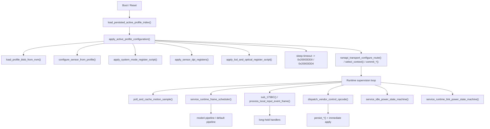
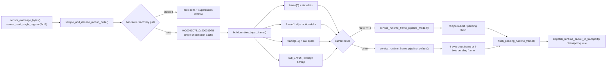

# `Ninjutso Sora V3` Mouse Firmware Architecture and Behavior Analysis

> [!IMPORTANT]
> <sub><strong>Reverse-Engineering Notice:</strong> This report is provided solely for lawful interoperability research, defensive security analysis, education, archival, and reference use by device owners or authorized parties during repair and maintenance. It does not authorize unauthorized flashing, redistribution, circumvention, infringement, or any other unlawful use. All relevant third-party rights remain with their respective rightsholders.</sub>

## Family Selection Note

`Ninjutso Sora V3` can be regarded as a representative high-end wireless gaming mouse firmware sample built on a PixArt-custom main controller and a PixArt-custom sensor. It is a useful reference for examining firmware layering, sensor script application, runtime frame construction, and wireless `transport` organization under a PixArt-custom solution.

---

## 0. Document Notes

### 0.1 Goals

This report focuses on answering the following questions:

- How the firmware divides responsibilities between the `ROM` layer and the `RAM runtime` layer
- How a `profile` is loaded, split, and materialized into the runtime image
- How sensor motion data travels from raw sampling all the way to the final runtime frame and transport packet transmission
- Where vendor-private commands, status reply frames, and debug read-window entry points are located, and what their execution model is
- What `System Mode`, `LOD`, optical-related settings, and `report-rate` actually mean inside the firmware
- Which parts are genuine software behavior and which parts are merely sensor register scripts

### 0.2 Sample Information

| Item | Value |
| --- | --- |
| Vendor / Model | `Ninjutso Sora V3` |
| Firmware package / image name | `sora-v3_mouse_pid57360_ver_ae1609.bin` |
| Firmware version | `ver_ae1609` |

---

## 1. Overall Firmware Framework

### 1.1 Architectural Conclusion and System Positioning

Based on the call boundaries, state layout, and `ramapi_*` thunk relationships already recovered from the current `IDA` database, this firmware should be understood as a `ROM`-driven dual-layer runtime architecture. It is neither a flat bare-metal main loop nor an `RTOS`-style multitasking system.

Its core conclusions can be summarized in four points:

1. `ROM` is not responsible only for power-on initialization. It continuously handles configuration loading, mode application, motion-sample gating, runtime frame construction, transmission strategy, and power supervision.
2. `RAM` is not a full business-logic layer. It behaves more like a runtime / transport execution plane invoked by `ROM`, carrying route selection, context switching, link I/O, and part of the high-frequency channel logic.
3. The entire system revolves around the `active profile`. A `profile` is not merely a persisted record; it simultaneously determines sensor scripts, runtime image contents, route selection, and status-reply content.
4. What the product calls a "mode" is implemented primarily through register scripts, route / context selection, and shadow-state updates, rather than through a standalone software algorithm framework.

The architectural positioning of the current sample can be summarized as follows:

| Dimension | Behavior in the current sample | Direct evidence |
| --- | --- | --- |
| System shape | `ROM` leads the policy layer, while `RAM` carries transport / runtime execution | A set of `ramapi_*` thunks at `0x3B6C..0x3CD4`; `ROM` still contains `build_runtime_input_frame()`, `apply_*()`, and `service_*power*()` |
| Concurrency organization | Periodic service routines + shared state blocks + short critical-section protection | Flows such as `sensor_exchange_bytes()`, `sample_and_decode_motion_delta()`, and `persist_*()` all show clear shared-state protection |
| Data-plane main chain | Sampling, gating, caching, frame construction, route branching, and transport bridging | `sample_and_decode_motion_delta()` -> `poll_and_cache_motion_sample()` -> `build_runtime_input_frame()` -> `service_runtime_frame_pipeline_*()` |
| Control-plane main chain | Host commands / local long-hold events -> persistence -> immediate application -> reply | `dispatch_vendor_control_opcode()`, `persist_*()`, `apply_*()`, `emit_*()` |
| Supervision-plane main chain | Joint supervision of idle / sleep / runtime / link | `service_idle_power_state_machine()`, `service_active_transport_timeout()`, `service_sleep_transition_timeout()`, `service_runtime_link_power_state_machine()` |
| Runtime style | Centered on register scripts, state images, and route selection | `apply_system_mode_register_script()`, `apply_lod_and_optical_register_script()`, `normalize_report_rate_setting_for_route()` |

Throughout the rest of this chapter, this firmware should always be read as a system in which "`ROM` is responsible for policy and shaping, while `RAM` is responsible for execution and carriage." If it is misread as "`ROM` only performs startup, and `RAM` takes over everything afterward," the most important engineering structure of this sample will be misidentified.

### 1.2 Three Planes and Seven Layers

From an engineering perspective, the current firmware is best understood as a "three-plane, seven-layer" system rather than as a set of isolated modules. The three planes are the control plane, the data plane, and the supervision plane. The seven layers describe where these planes actually land in the implementation.

| Plane | Layer | Primary responsibility | Representative functions / objects |
| --- | --- | --- | --- |
| Control plane | Persistence and image layer | Read the `active profile`, load the `profile blob`, and maintain mirrored button blocks and scalar blocks | `load_persisted_active_profile_index()` `0x8D58`, `load_profile_blob_from_nvm()` `0xA1E8`, `persist_*()`, `sub_11994()`, `sub_119F4()` |
| Control plane | Configuration execution layer | Translate logical settings into sensor scripts, `DPI`, `LOD`, and route / context | `configure_sensor_from_profile()`, `apply_sensor_dpi_registers()` `0xF1C8`, `apply_system_mode_register_script()` `0x1022C`, `apply_lod_and_optical_register_script()` `0xEF38` |
| Control plane | Command and local-entry layer | Receive host commands, process onboard long-hold events, and generate status replies | `dispatch_vendor_control_opcode()` `0xDAF4`, `handle_*_transport()`, `handle_*_checksum()`, `process_local_input_event_frame()` `0x4EBC` |
| Data plane | Sampling and decode layer | Exchange serial transactions with the sensor, read burst samples, identify bad-state conditions, and execute recovery sequences | `sensor_exchange_bytes()` `0x15AF6`, `sensor_read_single_register()` `0x15B5C`, `sample_and_decode_motion_delta()` |
| Data plane | Runtime shaping layer | Cache motion data, aggregate asynchronous status bits, and generate the fixed `7`-byte runtime input frame | `poll_and_cache_motion_sample()` `0x17B50`, `build_runtime_input_frame()` `0x1618C` |
| Data plane | Transmission strategy and bridging layer | Choose short frames, full frames, and pending / flush strategy by route, then bridge into `RAM transport` | `service_runtime_frame_pipeline_mode4()`, `service_runtime_frame_pipeline_default()`, `send_short_runtime_frame_over_link()` `0x166EA`, `flush_pending_runtime_frame()` `0x17FE6`, `ramapi_transport_*` |
| Supervision plane | Power and link supervision layer | Maintain idle, sleep, and runtime / link state, and drive recovery and timeout actions | `service_idle_power_state_machine()` `0xC9A0`, `service_active_transport_timeout()` `0x52A8`, `service_sleep_transition_timeout()` `0x5334`, `service_runtime_link_power_state_machine()` `0x16AF0` |

These seven layers are not parallel blocks. They are strictly chained together. The control plane determines the currently active configuration image and route; the data plane uses those images to decide how to sample, shape, and transmit; the supervision plane rewrites the runtime boundaries of the other two whenever the system is idle, the link is blocked, or a power transition is taking place.

The key engineering conclusion here is that `ROM` does not leave the stage after configuration is complete. It continuously acts as the control hub and data-shaping layer, while `RAM` behaves much more like a transport executor and context runtime plane.

### 1.3 Startup Assembly Chain: From `NVM` to a Runnable System

The startup sequence can be summarized in eight steps:

1. The current `ROM` image directly exposes the `ramapi_*` thunk group at `0x3B6C..0x3CD4`; the post-boot configuration and runtime flow continues to call through this boundary, forming a fixed interface where `ROM` invokes the `RAM runtime`.
2. `load_persisted_active_profile_index()` reads the current `active profile index` from `NVM key 0x2000`.
3. `apply_active_profile_configuration()` drives the entire assembly process around that index. If the loaded value is `0xFF`, it sets `0x20003DD8/0x20003DD9/0x20003DDC/0x20003DDD` and enters the default fallback branch.
4. `load_profile_blob_from_nvm()` selects `0x2001`, `0x2100`, or `0x2200` according to the profile index and reads a fixed `57`-byte record.
5. Inside `ROM`, the `57`-byte `profile blob` is split into two runtime images:
   - `0..27` -> `0x20004961..0x2000497C`, the seven button-binding blocks
   - `28..56` -> `0x20004922..0x2000493E`, the scalar configuration block
6. `apply_active_profile_configuration()` then executes the firmware-side application sequence in a fixed order:
   - `configure_sensor_from_profile()`
   - `apply_system_mode_register_script()`
   - `apply_sensor_dpi_registers()`
   - `apply_lod_and_optical_register_script()`
7. After sensor-script application completes, the firmware commits the current route / context through `ramapi_transport_configure_route()`, `ramapi_transport_select_context()`, `ramapi_transport_commit_primary()`, and `ramapi_transport_commit_secondary()`.
8. At that point the system enters a fully materialized runtime state. Subsequent host commands and local long-hold events no longer rebuild the whole system; they perform incremental updates on top of this active image.

The engineering meaning of this startup chain is very clear:

- The core output of startup is not "a set of initialization-complete flags," but a fully materialized `active profile runtime image`.
- Here, `profile` simultaneously determines three things: sensor register scripts, runtime-image contents, and transport route / context.
- The reason later runtime configuration changes can take effect immediately is that the startup path has already aligned the persistent structure with the runtime structure.

### 1.4 Runtime Coordination Model: Control Plane, Data Plane, and Supervision Plane

Once the system enters stable runtime, the current sample is not a giant loop in which all tasks have equal weight. More accurately, it consists of three coupled planes, each with its own trigger sources, shared state, and output targets.

| Plane | Trigger source | Main chain | Key shared state | Final output |
| --- | --- | --- | --- | --- |
| Control plane | Host vendor commands, local long-hold events | `dispatch_vendor_control_opcode()` / `handle_*()` / `process_local_input_event_frame()` -> `persist_*()` -> `apply_*()` | `0x20004921..0x2000493E`, `0x20004961..0x2000497C`, and multiple shadow states | Register-script application, route / context updates, status replies |
| Data plane | Scheduler ticks, sensor readability, motion-cache state | `service_runtime_frame_scheduler()` -> `poll_and_cache_motion_sample()` -> `build_runtime_input_frame()` -> `service_runtime_frame_pipeline_*()` | `0x20003D76..0x20003D82`, `0x20003C78`, `0x20003BD3..0x20003BE2` | Short frames, full frames, pending frame, transport submission |
| Supervision plane | Idle timers, link state, runtime activity | `service_idle_power_state_machine()`, `service_active_transport_timeout()`, `service_sleep_transition_timeout()`, `service_runtime_link_power_state_machine()` | `0x20003C5x`, `0x20003DDx`, transport channel state | Idle / sleep migration, recovery actions, link / runtime constraints |

The coupling between these three planes is as follows:

- The control plane defines how the system should currently behave. It modifies the `profile` image, applies scripts, switches routes, and refreshes status replies.
- The data plane turns input events under the current configuration into transmittable content. It does not interpret UI semantics directly; it consumes the currently effective `profile` and route.
- The supervision plane constrains when work is allowed to continue. It does not generate business data itself, but it changes the advancement conditions of the data plane and the execution window of the control plane.

Overall, the current runtime can be understood as the following closed loop:

1. The control plane materializes logical configuration into the runtime image and register scripts.
2. The data plane captures motion samples from that image state and builds a fixed `7`-byte runtime input frame.
3. The transmission-strategy layer chooses the sending branch according to the current route:
   - `mode 4` uses `service_runtime_frame_pipeline_mode4()`, which emphasizes full-frame semantics and in-flight-state maintenance.
   - Other routes use `service_runtime_frame_pipeline_default()`, which emphasizes direct short-frame transmission and later replay of a pending full frame.
4. Both sending branches ultimately bridge to the `RAM runtime` through `ramapi_transport_*` or the transport service.
5. The supervision plane continuously monitors idle, sleep, and link state, and interrupts, throttles, or resumes the above process when necessary.

Therefore, the real architectural conclusion of this chapter is not "how many function call chains the firmware has," but rather this: it is a closed-loop system centered on the `profile` image, led by `ROM`-side shaping, and terminated by route-aware transport execution.

### 1.5 Key State Surfaces and Engineering Style

To understand this sample, reading function names is not enough; it is also necessary to understand how its state surfaces are organized. The most important shared state blocks in the current `IDB` are as follows:

| Address range / object | Role | Architectural meaning |
| --- | --- | --- |
| `0x20004921..0x2000493E` | `active profile` and scalar configuration image | The central state of the control plane. `DPI`, `LOD`, `System Mode`, optical settings, and `report-rate` all read from here |
| `0x20004961..0x2000497C` | Seven button-binding images | The input-definition area split out of the `profile blob`; a major source for local input handling and status replies |
| `0x20003C08..0x20003C28` | Local event / long-hold context | Onboard events do not write registers directly; they first enter this runtime context block and then pass through the unified handler |
| `0x20003C78` | Fixed `7`-byte runtime input frame buffer | The unified output surface of the data plane; motion, status bits, and tail bytes are assembled here first |
| `0x20003BD3..0x20003BE2` | Asynchronous status bits, tail bytes, and frame-construction helper state | This shows that the sample does not transmit only motion; `ROM` also maintains timing-level shaping of asynchronous input |
| `0x20003D76..0x20003D82` | Motion cache, sample-quality gating, and recovery state | This block ties sampling results, bad-state detection, and recovery actions into one continuous state group |
| `0x20003D4C/0x20003D4D`, `0x20003D54/0x20003D55`, `0x20003D68/0x20003D69` | Transport queue / channel state | The key bridge points between the `ROM` transmission-strategy layer and the `RAM transport` execution plane |
| `0x20003C5x`, `0x20003DDx` | Idle / sleep / runtime supervision state | The main landing points of the supervision plane, used to control entry into low power and recovery entry points |

Based on these state surfaces, the current sample exhibits four very stable engineering characteristics:

1. `ROM`, `RAM runtime`, and `NVM` are not three isolated data structures. They share the same active image around a small set of dense state blocks.
2. Multiple shared-state-sensitive flows explicitly enter short critical sections, so `profile` loading, bad-state recovery sequences, and part of persistent writeback all show clear timing protection.
3. The major configuration items confirmed so far follow a unified pattern: modify the current active image, perform persistence writeback if needed, and immediately execute `apply_*()` against the currently effective profile rather than requiring a reboot.
4. In this sample, a "mode" is usually implemented as a combination of three things: register scripts, route / context selection, and shadow-state updates. It should not be misread as an independent software algorithm module.

Taken together, the overall framework of the sample can be reduced to a single sentence:

`ROM` reshapes "configuration semantics" and "input events" into executable runtime state for the system, while `RAM` turns those states into transport behavior that the link layer can carry. The two are stably connected by the `active profile` image and the `ramapi_*` boundary.

---

## 2. Configuration System and Command Entry Points

What can be closed directly inside the current `ROM` is not the physical ingress layer of `USB`, `BLE`, or the air-interface protocol, but a higher-level "control-plane execution layer." This execution layer receives external control packets or onboard input events, commits configuration semantics into the active image, then synchronizes the result into register scripts, `route/context`, runtime shadow values, and status replies. This chapter discusses only that control execution chain, which already has a complete evidence chain in `IDA`, and does not speculate beyond the `IDB` about low-level physical receive callbacks or final air-interface frame formats.

### 2.1 Control-Plane Boundaries and Command Families

The control-plane entry points that can be directly confirmed in the current sample can be divided into five families:

| Command family | Primary entry | Confirmed role | Direct output surface |
| --- | --- | --- | --- |
| Outer `vendor control` wrapper layer | `dispatch_vendor_control_opcode()` `0xDAF4` | Dispatch outer opcode by `packet[0]`; confirmed values include `24`, `34`, `35`, `37`, `39`, `42`, `43`, `64`, `65`, `66` | Internal runtime packets, temporary replies, transport-state latches |
| Internal runtime execution layer | `dispatch_runtime_packet_to_transport()` `0xD6D4` | Interpret internal opcodes in a unified way; try the fast-path ring first, then fall back to the slow-path interpreter | `RAM transport` callbacks, status-frame construction, route switching |
| `checksum` protocol family | `handle_report_rate_setting_request_checksum()` `0x6E84`, `handle_system_mode_setting_request_checksum()` `0x6EE6`, etc. | Shares the same configuration-materialization logic as the transport family, but changes the reply format to a `checksum guarded frame` | Status frames with a `0x0A 0x40` header |
| Onboard local-event family | `process_local_input_event_frame()` `0x4EBC` | Processes onboard `8`-byte event frames, drives long-hold control logic, and continues to dispatch into the transport execution chain | `DPI` / `System Mode` / route-related control chain |
| Engineering debug read-window family | `handle_read_amb_cmd()` `0xC52C`, `handle_read_reg_cmd()` `0xC588` | Reads the target window directly and builds a vendor reply | Reply frames with a `0x04 0x80` header |

This layering matters. For the current sample, the stable analysis object is not "where a packet enters from," but "how it enters the unified execution layer after reception." Based on the `IDA` evidence, the core of the control system lies in `dispatch_vendor_control_opcode()`, `dispatch_runtime_packet_to_transport()`, the various `handle_*()` configuration handlers, and the `0x200049xx` active image. That is already sufficient to reconstruct the overall configuration-plane architecture.

### 2.2 How External Commands Enter the Unified Execution Layer

When an external control packet enters the unified execution layer, it first passes through `dispatch_vendor_control_opcode()` `0xDAF4`. This function handles the outer protocol, not the final configuration semantics themselves. It uses `packet[0]` as the outer opcode and performs the first level of unpacking for the confirmed command families.

Its execution model can be summarized in four steps:

1. Read the outer opcode and determine whether the current packet belongs to a direct-execution branch, an execute-and-reply branch, or a state-latch branch.
2. For most configuration branches, strip the leading `3`-byte wrapper and pass `packet + 3` and `packet[2]` as the internal payload and length to `dispatch_runtime_packet_to_transport()`.
3. For command branches such as `42`, `43`, and `66`, which require immediate reply reorganization after execution, first let the runtime execution layer consume the payload, then extract and format the reply through `sub_DF74()` and `sub_141A()`.
4. For branch `65`, do not enter the regular configuration handlers directly. Instead, update `0x20003A74` and `0x20003A76`, compare them with `0x20003A78`, and treat the result as a separate transport-state latch / segmented-state-processing branch.

The true unified execution layer is `dispatch_runtime_packet_to_transport()` `0xD6D4`. Internally, it has a clear dual-branch structure:

- The first layer is the fast path. When `!bypass_fast_path` is true and queue conditions around `0x20003B90`, `0x20003B94`, `0x20003B88`, and `0x20003B6A` are satisfied, the function updates the ring state inside a critical section and sends the packet directly into the cached queue through `enqueue_runtime_fast_path_payload()`.
- The second layer is the slow-path interpreter. When the fast path does not apply, the function interprets the runtime opcode in `packet[0]`. The currently confirmed visible internal opcodes include at least `16`, `24`, `34`, `35`, `37`, `39`, `40`, `41`, `42`, and `43`.

Several behaviors inside the slow path are especially important:

- Control items such as `24`, `34`, and `37` enter unified deferred-callback queueing nodes such as `enqueue_runtime_deferred_callback()`.
- Internal opcodes `40`, `41`, `42`, and `43` invoke runtime callback entry points such as `sub_DF48()`, `MEMORY[0x20003BC0]`, `MEMORY[0x20003BC4]`, `MEMORY[0x20003BC8]`, and `MEMORY[0x20003BCC]`, then package the result into transport-sendable content through `build_runtime_transport_reply_frame()`.
- `39` is an explicit route-affecting control branch. The function first calls `open_runtime_transport_session_from_packet(packet + 1, packet_len, 39, 536886116)`, and when conditions are met, it then executes `ramapi_transport_configure_route(1, 5, 0)`, `ramapi_set_run_state_code(1)`, and `sub_3B48(1)`.

The engineering importance of this layer lies in its explicit separation between the outer protocol opcode and the internal runtime opcode. The former determines how a packet is unpacked and categorized; the latter determines how the actual control semantics are materialized. Mixing these two layers together will directly mislead the analysis of the command-table structure and the status-reply chain.

### 2.3 Configuration-Item Execution Pipeline

The current sample does not implement configuration as "each handler writes its own field after receiving a packet." From the implementations of the confirmed handlers, it follows a highly unified materialization pipeline:

`packet ingress / local event -> persist_*() updates the active image and writes back to the current profile -> normalize / apply -> refresh route/context or shadow if needed -> emit status echo`

The most important value of this pipeline is not that it makes configuration "savable," but that it makes configuration "immediately become the current runtime state." Several fully verified representative execution chains are listed below.

| Configuration item | Primary handler | Confirmed materialization chain | Engineering conclusion |
| --- | --- | --- | --- |
| `System Mode` | `handle_system_mode_setting_request_transport()` `0x72AA` | `persist_system_mode_setting(a1[1], *a1)` -> select `apply_system_mode_register_script(0/2/4)` according to host value `0/1/2` -> `set_active_system_mode_shadow(a1[1])` | The host-written value is not the final script selector; there is an intermediate `0/2/4` script-mapping layer |
| `report-rate` | `handle_report_rate_setting_request_transport()` `0x7230` | Choose between `persist_report_rate_setting_for_link_mode()` and `persist_report_rate_setting_for_wireless_mode()` according to `sub_BD2C()` -> `normalize_report_rate_setting_for_route()` -> `ramapi_publish_run_state_code()` -> optionally `ramapi_transport_configure_route()` / `ramapi_transport_select_context()` / `ramapi_transport_commit_*()` | `report-rate` is not a single field; it is a route-bound configuration family |
| `LOD` | `handle_lod_setting_request_transport()` `0x7118` | `persist_lod_setting(packet[1], *packet)` -> `apply_lod_and_optical_register_script(packet[1], ...)` | Changing `LOD` directly triggers reapplication of optical-related register scripts |
| `active optical flag` | `handle_active_optical_flag_request_transport()` `0x70DC` | `persist_active_optical_engine_flag(a1[1], *a1)` -> `apply_lod_and_optical_register_script(MEMORY[0x20004932], ...)` | This flag shares the same optical-script application chain as `LOD` |
| `staged optical mode` | `handle_staged_optical_engine_setting_request_transport()` `0x71EC` | Call `get_system_mode_setting()` first; only when the result is not `2` does it execute `persist_staged_optical_engine_mode(a1[1], *a1)`, then call `sub_11CF0(4, 268454107, 0x4000, 1)` | This is a staged setting constrained by `System Mode`, not something that can always be applied immediately |

The `checksum` variants share the same core materialization logic as the transport variants, but their tail actions are not identical:

- `handle_report_rate_setting_request_checksum()` `0x6E84` also persists first and normalizes afterward, but in its tail it first executes `clear_pending_vendor_slot(16)`, then updates runtime state through `sub_C284()` and `ramapi_publish_run_state_code()`, and finally performs route switching if needed.
- `handle_system_mode_setting_request_checksum()` `0x6EE6` also starts with `persist_system_mode_setting()`, then selects the script by `0/2/4`; compared with the transport version, the currently visible implementation does not show a separate `set_active_system_mode_shadow()` step.

Onboard local events are folded into the same control plane as well. `process_local_input_event_frame()` `0x4EBC` reads the event code represented by `0x20003D1D`, and after confirming the event is valid it calls `handle_dpi_stage_hold_event()`, `sub_CCF0()`, and `handle_system_mode_hold_event()` in sequence. It then decides whether to enter the `ramapi_transport_can_poll_channel()` branch immediately or continue queueing the event into transport. In other words, host commands and onboard long-hold events are not two independent systems; before they reach the actual application layer, they have already converged onto the same control chain.

Therefore, the most important structural conclusion of this chapter is that the core of the configuration system is not the opcode table itself, but the coordination between `persist_*()`, `apply_*()`, `ramapi_transport_*()`, and the `0x200049xx` active image. As long as that chain closes, the configuration is immediately materialized into the current runtime state.

### 2.4 Status Echo and Reply Packaging

The current sample contains three reply surfaces for different purposes: transport status frames, `checksum guarded` status frames, and vendor replies used for engineering debug. All three share the same configuration image, but their headers, trigger points, and usage contexts differ.

First, consider transport status echo. The currently confirmed status emitters are as follows:

| Status item | Transport emitter | Opcode | Value source | Abnormal-value correction |
| --- | --- | --- | --- | --- |
| `report-rate` | `emit_report_rate_status_transport()` `0x6854` | `6` | `get_effective_report_rate_setting()` | Returns the effective value after route normalization |
| `LOD` | `emit_lod_status_transport()` `0x674C` | `8` | `get_lod_setting()` | If the value is `0xFF`, it is immediately rewritten to `1` and persisted |
| `System Mode` | `emit_system_mode_status_transport()` `0x68B0` | `12` | `get_system_mode_setting()` | If the value is greater than `2`, it is immediately rewritten to `0`, then `persist_system_mode_setting()` and `set_active_system_mode_shadow()` are called |
| `staged optical mode` | `emit_staged_optical_engine_mode_transport()` `0x681C` | `50` | `get_staged_optical_engine_mode()` | No extra correction has been observed so far |
| `active optical flag` | `emit_active_optical_flag_transport()` `0x66D4` | `58` | `0x2000493E` | If the value is greater than `1`, it is immediately rewritten to `0` and persisted |

All of these transport status frames are emitted through `emit_transport_frame_via_channel_table()`. In essence, they are an outward echo of the current active image.

The second family is the `checksum guarded frame`. Its unified constructor is `build_checksum_guarded_frame()` `0x4B64`, whose confirmed behavior is as follows:

- The fixed header bytes are `0x0A 0x40`.
- The third byte stores the business opcode.
- A simple additive checksum is computed over the payload and written into the frame header.
- The total length is calculated as `payload_len + 4`, but truncated to `15`.
- The output length is stored in `0x20003DFC`.

The currently confirmed `checksum` status constructors include:

- `build_report_rate_status_frame()` `0x6C30`, opcode `6`, payload `[2, effective_rate]`
- `build_lod_status_checksum()` `0x6B64`, opcode `8`, payload `[2, lod]`, and writes back `1` when `lod == 0xFF`
- `build_system_mode_status_checksum()` `0x6CC4`, opcode `12`, payload `[2, system_mode]`, and writes back `0` when the value is out of range
- `build_active_optical_flag_checksum()` `0x6AD4`, opcode `58`, payload `[2, flag]`, and writes back `0` when the value is out of range

The third family is the vendor reply. Its unified constructor is `build_vendor_reply_buffer()` `0x4D94`, and its confirmed format is as follows:

- The output buffer is located at `0x200039EC`.
- The fixed header bytes are `0x04 0x80`.
- Byte `3` stores `reply_type`.
- If payload exists, it is copied after the header.
- The total length is always written as `payload_len + 3`.

This vendor-reply family mainly serves the engineering debug read-window entry points:

- `handle_read_amb_cmd()` `0xC52C` executes `copy_amb_payload_bytes()` -> `build_vendor_reply_buffer(3, payload, len)` -> `clear_pending_vendor_slot(3)`
- `handle_read_reg_cmd()` `0xC588` executes `copy_reg_window_bytes()` -> `build_vendor_reply_buffer(1, payload, len)` -> `clear_pending_vendor_slot(2)`

From an engineering point of view, the commonality among these three reply surfaces is very clear: none of them maintains an independent copy of state. Instead, they all reread the `0x200049xx` active image and expose it externally through different packaging formats. Therefore, the essence of the reply system is not "many protocol variants," but "the same runtime state reused through multiple exits."

### 2.5 Runtime Image, Persistence, and Deferred Writeback

The configuration system only works because the active image is stably organized. The key configuration landing points confirmed in the current sample are as follows:

| Address | Confirmed role | Direct evidence |
| --- | --- | --- |
| `0x20004930` | Wireless-side `report-rate` slot | `persist_report_rate_setting_for_wireless_mode()`, `normalize_report_rate_setting_for_route()`, `get_effective_report_rate_setting()` |
| `0x20004931` | Link-mode `report-rate` slot | `persist_report_rate_setting_for_link_mode()`, `normalize_report_rate_setting_for_route()`, `get_effective_report_rate_setting()` |
| `0x2000493A` | Another route-related `report-rate` slot | `persist_report_rate_setting_for_link_mode()`, `normalize_report_rate_setting_for_route()`, `get_effective_report_rate_setting()` |
| `0x20004932` | Current `LOD` value | `persist_lod_setting()`, `apply_lod_and_optical_register_script()` |
| `0x20004935` | Current `System Mode` value | `persist_system_mode_setting()`, `get_system_mode_setting()` |
| `0x2000493D` | `staged optical mode` | `persist_staged_optical_engine_mode()`, `get_staged_optical_engine_mode()`, `sample_and_decode_motion_delta()` |
| `0x2000493E` | `active optical flag` | `persist_active_optical_engine_flag()`, `emit_active_optical_flag_transport()`, `build_active_optical_flag_checksum()`, `apply_lod_and_optical_register_script()` |

These addresses establish two key facts.

First, the active image is a semantically meaningful field set, not a meaningless blob. `System Mode`, `LOD`, `active optical flag`, `staged optical mode`, and `report-rate` can all be traced to real runtime landing points.

Second, in this sample `report-rate` is a typical route-aware configuration family, not a one-byte switch. `normalize_report_rate_setting_for_route()` `0x7414` rewrites `0x20004930`, `0x20004931`, and `0x2000493A` according to current link conditions and the results of `sub_BD2C()` / `sub_3C08(0)`, then returns a runtime code value consumed by `ramapi_publish_run_state_code()`. In other words, what the UI displays as "`report-rate`" is actually bound inside the firmware to a linked tuple of "configured value + route selection + runtime code."

The single-field writeback flow is also highly uniform. `persist_system_mode_setting()`, `persist_lod_setting()`, `persist_active_optical_engine_flag()`, `persist_staged_optical_engine_mode()`, `persist_report_rate_setting_for_wireless_mode()`, and `persist_report_rate_setting_for_link_mode()` all follow the same template:

1. Update the `0x200049xx` active image first.
2. Enter a short critical section.
3. Select the corresponding `NVM key` by profile.
4. Call `sub_F634()` to write the single field.
5. On failure, retry using `0x20003E77` as a retry counter, up to `3` times.

In addition to immediate single-field writeback, the current sample also retains a clear dirty-slot incremental writeback mechanism. `mark_profile_dpi_stage_dirty_descriptor()` `0x117C4` writes a `5`-byte `DPI stage descriptor` sub-block into `0x20004BAE + 5 * index`, while marking the corresponding slot dirty at `0x20004BC2 + index + 7`. `service_profile_incremental_dirty_writeback()` `0x9A90` then uses `0x20003E76` as the global "continue scanning" flag and `0x20003E78` as the current dirty-slot cursor, scanning slot by slot for pending entries and dispatching writeback:

- `case 0..6` goes through `sub_F634()`, with each dirty slot writing back `4` bytes and the target key varying by the current profile
- `case 7..10` dispatches to the four dedicated `DPI stage` writeback routines: `persist_profile_dpi_stage0_value()`, `persist_profile_dpi_stage1_value()`, `persist_profile_dpi_stage2_value()`, and `persist_profile_dpi_stage3_value()`
- `case 11` reads the `1`-byte `dpi_stage_count` from `0x20004922`, then writes it back through `sub_F634()`
- After each successful writeback, the corresponding dirty flag is cleared and the scan state is raised again

This shows that the firmware does not rely solely on the simple model of "receive a command and immediately write one field." It also implements a staged-writeback mechanism for multi-subitem configuration blocks.

In addition, two full-block commit flows can be confirmed:

- `sub_11994()` calls `sub_FF8C()` inside a critical section to write a `28`-byte block to `0x2001`, `0x2100`, or `0x2200` according to the current profile
- `sub_119F4()` likewise calls `sub_FF8C()` inside a critical section to write a `29`-byte block to `0x201D`, `0x211C`, or `0x221C` according to the current profile

Therefore, the persistence layer in this sample clearly supports at least three granularities at the same time: single-field writeback, dirty-subblock writeback, and full profile-block writeback. The engineering maturity of the control plane is reflected precisely in the fact that these three granularities coexist without conflicting with one another.

### 2.6 Debug Read Windows and Chapter Boundaries

The existence of `handle_read_amb_cmd()` and `handle_read_reg_cmd()` shows that the current sample contains explicit engineering read-window capabilities. However, the role of these two read-window commands is very narrow: read a window, build a reply, and clear a pending slot. They do not trigger configuration-materialization actions such as `persist_*()`, `apply_*()`, or `ramapi_transport_configure_route()`, and therefore should not be confused with ordinary end-user configuration commands.

Taking all evidence in this chapter together, the current control plane can be reduced to one sentence:

This firmware concentrates configuration semantics in the `0x200049xx` active image, then materializes that image into a real runtime state through `persist_*()`, `apply_*()`, `ramapi_transport_*()`, and multiple status-reply surfaces. For this sample, the true architectural center is not a single command table, but this active image and the execution chain around it.

---

## 3. Sensor Motion Data Flow

This chapter discusses only the motion-data plane, namely, how one raw sensor sample enters `ROM`, how it is gated, cached, framed, and then handed to the route-aware transmission strategy. The current `IDB` is already sufficient to close this chain down to the level of `sub_1776A()`, but the motion interrupt source, the final internal scheduling of `RAM transport`, and air-interface multiplexing details remain outside the scope of this chapter.

### 3.1 Data-Plane Overview

The main data-plane chain that can be directly confirmed from the current `ROM` is as follows:

`sub_15702()` / `sub_15730()` -> `poll_and_cache_motion_sample()` -> `sample_and_decode_motion_delta()` -> `consume_cached_motion_sample_*()` -> `build_runtime_input_frame()` -> `service_runtime_frame_scheduler()` -> `service_runtime_frame_pipeline_mode4()` / `service_runtime_frame_pipeline_default()` -> `send_short_runtime_frame_over_link()` / `flush_pending_runtime_frame()` / `sub_1776A()`

This chain is not a simple "read coordinates and send immediately" design. It is divided into six responsibility layers:

| Layer | Key functions | Key state / buffers | Problem it solves |
| --- | --- | --- | --- |
| Sampling transaction layer | `sensor_exchange_bytes()` `0x15AF6`, `sensor_read_single_register()` `0x15B5C`, `sample_and_decode_motion_delta()` `0x17B9C` | Sensor serial-register window, `0x20003D80..0x20003D82`, `0x2000493D` | How to fetch one raw sample from the sensor and determine whether that sample is usable |
| Single-shot cache layer | `poll_and_cache_motion_sample()` `0x17B50`, `consume_cached_motion_sample_for_mode4()` `0x17B34`, `consume_cached_motion_sample_for_runtime_frame()` `0x17B66` | `0x20003D76..0x20003D7B` | Each sample is decoded only once and then consumed uniformly by later stages |
| Frame-shaping layer | `build_runtime_input_frame()` `0x1618C` | `0x20003BD3..0x20003BE2`, `0x20003BDF`, `0x20003BE1`, `0x20003C78` | Merge motion delta and asynchronous status bits into a fixed `7`-byte runtime frame |
| Scheduler layer | `service_runtime_frame_scheduler()` `0x169FC` | `0x20003C74`, `0x20003C5C` | Decide when to build a frame immediately, when to run periodically, and which transmission pipeline to enter |
| `mode 4` transmission pipeline | `service_runtime_frame_pipeline_mode4()` `0x16800` | `0x20003C4C..0x20003C4E`, `0x20003DE6`, `0x20003DEB` | Maintain a prepare / stage / submit state machine for the full `9`-byte frame |
| Default transmission pipeline | `service_runtime_frame_pipeline_default()` `0x16940`, `send_short_runtime_frame_over_link()` `0x166EA`, `flush_pending_runtime_frame()` `0x17FE6` | `0x20003DEE`, `0x20003DED`, `0x20003D68`, `0x20003D69` | Balance between "send short frame immediately" and "defer then replay a full frame" |

This architecture has two direct consequences:

1. There are at least three layers of state surfaces between motion samples and actual transmission behavior. The firmware does not push coordinates to the lower layer as soon as they are read.
2. `route` affects not only the air-interface exit, but also the cache-consumption mode, frame-construction logic, and subsequent transmission strategy.

### 3.2 Sampling Transactions: How One Sample Is Read and Judged Usable

#### 3.2.1 Sensor Byte-Exchange Layer

The low-level sensor transaction is handled by `sensor_exchange_bytes()` `0x15AF6`. Its behavior is already very clear:

1. It limits the transfer length to no more than `7` bytes.
2. It writes the length to the hardware control bits corresponding to `0x5002C008`.
3. It writes the pending transmit bytes from `tx_buf` into the hardware window one by one.
4. It triggers one transaction through `0x5002C001`.
5. It polls `0x5002C00B` until the hardware completes.
6. It then copies the received bytes from the receive window back into `rx_buf` one by one.

Therefore, `sensor_exchange_bytes()` is not an abstract "read sensor" black box. It is a serial exchange routine with directly visible register operations.

`sensor_read_single_register()` `0x15B5C` is a single-register wrapper on top of it: the caller passes a register number and a `1`-byte output buffer, and the function internally performs the read through a `1`-byte transaction via `sensor_exchange_bytes()`.

#### 3.2.2 Sample Decoding and Bad-State Recovery

The core function that turns one raw sample into a motion delta is `sample_and_decode_motion_delta()` `0x17B9C`. It places four jobs into one routine: sampling transaction, bad-state gating, recovery write sequence, and output packaging.

In execution order, the function can be broken down into the following steps:

1. Prepare a fixed `7`-byte burst-read command.
2. Call `sensor_exchange_bytes()` to fetch the burst data for the current sample.
3. Additionally call `sensor_read_single_register(22, ...)` to read `register 22`.
4. Extract the current quality byte, status byte, and motion-valid bit from the burst result.
5. Decide whether to enter bad-state handling according to the quality threshold, `staged optical mode`, and recovery state.
6. If the sample is classified as bad, execute an explicit recovery write sequence.
7. If the system is inside the post-recovery suppression window, continue suppressing output for this sample.
8. Only when the sample-valid gating bit is active and the current sample is not suppressed does the function write a `4`-byte `delta` result.

The currently confirmed relationship between inputs and state is as follows:

| Source | Actual role inside this function |
| --- | --- |
| `bit7` of burst return byte `0` | The master output gate for motion in the current sample; if it is absent, the current `delta` is zeroed immediately |
| Four core bytes in the burst return | Form the final `4`-byte motion `delta` |
| Burst quality byte `BYTE2(v17)` | Together with `0x2000493D`, decides the bad-state threshold |
| `register 22` read value | Participates in suppression-window evaluation after recovery, and is written back to `0x20003D82` |
| `0x20003D7F` | When true, multiplies the two `16-bit` halfwords by `2` |
| `0x2000493D` | `staged optical mode`; directly participates in bad-state threshold selection |

The bad-state detection conditions can also be written directly from the pseudocode:

- `is_sensor_bad_state_latched()` returns true.
- The quality byte is greater than or equal to `0xC0`, and `0x2000493D == 1`.
- The quality byte is greater than or equal to `0xE0`, and `0x2000493D == 0` or `0x2000493D == 2`.
- And `0x20003D80 == 0`, meaning that the recovery-executed state has not yet been entered.

When these conditions are met, the function enters a critical section and executes the following recovery write sequence:

```c
0x7F = 0
0x09 = 0x5A
0x54 = 0x01
0x7F = 4
0x1D = 0x77
0x7F = 0
0x09 = 0x00
```

After the recovery action is committed, three state bytes are updated:

| Address | Role |
| --- | --- |
| `0x20003D80` | Marks that the recovery sequence has already been executed |
| `0x20003D81` | Marks that the recovery suppression window is active |
| `0x20003D82` | Stores the most recent `register 22` value |

The function then enters an explicit suppression-window check:

- If `0x20003D81` is active, and either the old value in `0x20003D82` or the current `register 22` value is below `0x50`, output for this sample remains suppressed.
- Only when both read values are no longer below `0x50` does the function clear `0x20003D81` and allow later samples to return to normal output.

The final output condition is strict: only when the gating bit is active and the current sample is not suppressed does the function return `1` and write the `4`-byte motion result. Otherwise, it clears `out_delta[0..3]` and returns `0`.

This implementation shows that the current sample does not treat the sensor as a complete hardware black box. At least on the chain of "bad-state detection -> execute recovery -> temporarily suppress output -> release suppression," `ROM` clearly assumes an active control role.

The boundaries that must be preserved are equally clear:

- It can currently be confirmed only that a certain quality byte participates in threshold evaluation; no unsupported datasheet name should be assigned to it.
- It can currently be confirmed only that a recovery sequence is executed; it should not be renamed into a public marketing term without evidence.
- It can currently be confirmed that the output is a `4`-byte `delta` made from two `16-bit` quantities, but without real-device cross-checking, the public coordinate semantics of each raw bit field should not be forced.

### 3.3 Single-Shot Cache: Each Sample Is Decoded Once and Then Consumed Uniformly

The output of the sampling-transaction layer is not reread repeatedly by multiple consumers. Instead, it first enters a compact group of single-shot cache states:

| Address | Role |
| --- | --- |
| `0x20003D76` | Most recent return state from `sample_and_decode_motion_delta()` |
| `0x20003D77` | Cache-valid flag |
| `0x20003D78..0x20003D7B` | Most recent `4`-byte motion `delta` |
| `0x20003D7F` | Output scaling control bit |
| `0x20003D80..0x20003D82` | Recovery-executed flag, recovery-suppression flag, most recent `register 22` value |

The logic of the cache-fill function `poll_and_cache_motion_sample()` `0x17B50` is extremely direct:

1. Read `0x20003D77`.
2. If the cache is already valid, return directly without accessing the sensor.
3. If the cache is invalid, call `sample_and_decode_motion_delta((uint8_t *)0x20003D78)`.
4. Write the return value into both `0x20003D76` and `0x20003D77`.

This means that in the current implementation, `0x20003D77` is both the "cache valid" flag and a quick mirror of whether the previous sample successfully produced a valid `delta`.

The cache-consumption side is completely symmetric as well:

- `consume_cached_motion_sample_for_mode4()` `0x17B34`
- `consume_cached_motion_sample_for_runtime_frame()` `0x17B66`

Both functions:

1. Copy `0x20003D78..0x20003D7B` into the caller-provided `dst`.
2. Clear `0x20003D77`.
3. Return `0x20003D76`.

This shows that the current cache is a "single-shot one-time-consumption" model, not a shared multi-read cache. Whichever consumer reads first is responsible for clearing valid; the next genuinely new sample must go through `poll_and_cache_motion_sample()` again.

#### 3.3.1 Confirmed Sampling Trigger Points

At present, `IDA` directly confirms two cache-prefetch entry points:

- `sub_15702()` `0x15702`
- `sub_15730()` `0x15730`

Both explicitly call `poll_and_cache_motion_sample()`, but differ in what they do afterward:

- `sub_15730()` simply prefetches one sample, then calls `sub_1569A()` and returns.
- `sub_15702()` enters `sub_16A84()` after prefetch and tries a lighter runtime-send branch.

Therefore, sampling triggers in the current data plane do not exist only in the form of "the periodic scheduler expires and immediately reads the sensor." More accurately, a sample is usually prefetched into cache first, and only then does a later framer decide when to consume it.

### 3.4 Runtime Input Framer: How the `7`-Byte Internal Frame Is Built

#### 3.4.1 Frame Structure and Return Semantics

`build_runtime_input_frame()` `0x1618C` is the central framer of the current data plane. Its output is fixed around `0x20003C78`, forming a unified `7`-byte runtime input frame.

The frame structure can be directly confirmed from the function tail:

| Frame offset | Source | Meaning |
| --- | --- | --- |
| `frame[0]` | `0x20003BE2 | (2 * 0x20003BD5) | 0x20003BD4` | Aggregated result of status bits |
| `frame[1..4]` | Cached `4`-byte motion `delta` | Motion payload |
| `frame[5]` | `0x20003BDF` | Tail byte `0` |
| `frame[6]` | `0x20003BE1` | Tail byte `1` |

The return value of this function also has explicit semantics and should not be reduced to a Boolean:

| Return value | Meaning |
| --- | --- |
| `0` | No new motion and no new status changes in this round |
| `1` | Status-bit changes only, no new motion `delta` |
| `2` | New motion `delta` only, no extra status changes |
| `3` | Both new motion and new status changes are present |

This is determined directly by the way the internal variable `v3` is assembled: motion changes are written into `bit1`, and status changes into `bit0`.

#### 3.4.2 How the Motion Portion Is Loaded into the Frame

The function handles the motion portion first:

1. If the call parameter `mode == 2`, it zeroes `frame[1..4]` directly.
2. Otherwise it first reads the current `route`: `sub_15816()` returns `0x20003839`.
3. If `route == 4`, it calls `consume_cached_motion_sample_for_mode4(&frame[1])`.
4. Otherwise it calls `consume_cached_motion_sample_for_runtime_frame(&frame[1])`.
5. If the cache-consumption function returns nonzero, it folds the motion bit from that return value into `v3`.

In other words, the framer itself does not resample. It only consumes cache. The actual split of responsibilities is "the upstream places the sample into cache; the framer consumes the cache under the current route and merges it into the frame."

#### 3.4.3 Status Bits Are Not a Simple Concatenation, but a State-Shaping Machine

The most complex part of `build_runtime_input_frame()` is not the motion data but the shaping of status bits. Three classes of input sources can currently be observed directly:

1. A group of route-aware raw-state readers:
   - `sub_15A98()`: reads a masked `4`-byte state from `0x5002C028..0x5002C02B`
   - `sub_15A2C()`: reads the same state window, but with one-shot clearing control via `0x20003ADC`
2. A group of edge / timeout detectors driven by event IDs:
   - `sub_15F88(..., 24, 8000)`
   - `sub_15F88(..., 7, 8000)`
   - `sub_15F88(..., 8, 30000)`
   - `sub_15F88(..., 3, 30000)`
   - `sub_15F88(..., 4, 30000)`
3. A set of internal persistent state bits and timers:
   - `0x20003BD3`
   - `0x20003BD4`
   - `0x20003BD5`
   - `0x20003BD6`
   - `0x20003BD8`
   - `0x20003BDA`
   - `0x20003BDC`
   - `0x20003BE2`

These states are not laid out flat. They are organized into two parallel asynchronous channels, and each channel contains:

- A primary enable bit
- A current output latch
- A hold / stretch timer
- A secondary timeout timer
- A "second-stage" state bit

Described structurally rather than by physical meaning, this state machine performs four jobs:

1. When a new edge arrives, it is not always cleared immediately; it first enters a hold stage.
2. When the hold stage lasts too long, it transitions into a second-stage state.
3. When the input disappears, it is not always released immediately; it may first enter a secondary timeout window and only then clear.
4. Certain additional bits are written into `0x20003BE2` in parallel and are ultimately merged into `frame[0]`.

The two time thresholds that can be directly confirmed are:

- `0x36B0`: threshold used by the two main hold timers
- `0x7530`: threshold used by the two secondary timeout timers

Both are accumulated through the return value of `sub_16556()`. In essence, they are state retainers advanced by system ticks rather than static flags.

#### 3.4.4 Forced Transmission and State Snapshot

There is also an explicit "forced send" path at the end of the function:

1. If `0x20003E70` is set, the function clears it first.
2. It then compares the newly generated `frame[0]` with the old snapshot stored in `0x20003E72`.
3. If the two differ, it returns `v3 | 1` directly.

This shows that the firmware not only sends because of real new motion or new edges, but also allows some upper control entry point to force the status-change bits to be raised again through `0x20003E70/0x20003E72`.

In summary, the essence of this framer is that it outputs not "raw motion data," but a unified internal frame of "motion `delta` + asynchronous-status shaping result + two tail bytes." The truly complex part is not coordinate packing, but how asynchronous state is held, delayed in release, and force-retransmitted.

### 3.5 Scheduler: When to Build a Frame and Which Pipeline to Enter

`service_runtime_frame_scheduler()` `0x169FC` is the top-level scheduler of the current data plane. It supports three operating modes rather than a single fixed periodic poll:

| Entry mode | Condition | Behavior |
| --- | --- | --- |
| Immediate frame-build mode | `force_mode != 0` | Directly calls `build_runtime_input_frame((runtime_input_frame_t *)0x20003C78, 7, force_mode)` |
| Immediate pipeline-run mode | `force_mode == 0 && run_pipeline != 0` | Reads the current `route` immediately and enters `service_runtime_frame_pipeline_mode4()` or `service_runtime_frame_pipeline_default()` |
| Periodic service mode | Both are `0` | Accumulates `sub_16556()` into `0x20003C74`, and only after it reaches `0x3E80` does it enter the corresponding pipeline according to the current `route` |

Therefore, the scheduler is not a single "run once when the timer expires" mechanism. It simultaneously supports:

- Being asked by an external caller to generate a frame immediately
- Being asked by an external caller to run one transmission pipeline immediately
- Running periodically on internal ticks when there is no explicit request

The coexistence of these three modes is exactly why the current firmware can simultaneously handle a high-frequency motion data plane and the immediacy of asynchronous status changes.

### 3.6 Transmission Strategy: Why `mode 4` and the Default Route Are Fundamentally Different

#### 3.6.1 `mode 4`: A State Machine That Prioritizes the Full `9`-Byte Frame

`service_runtime_frame_pipeline_mode4()` `0x16800` is structurally much heavier than the default branch. It is not a simple "detect a change and send one frame" routine; it maintains a small transmission state machine.

The function first checks the current link-queue state:

- It uses `sub_15E4E(..., 0x20003D68, 0x20003D69)` to determine whether a lower-layer transaction is already in flight.
- If the link is busy and `sub_164F8()` returns true, it merely marks progress for this round and clears `0x20003C5C`.
- If the link is busy and `sub_164F8()` returns false, it exits directly and waits for the next round.

When the link is idle, the function enters the state machine driven by `0x20003C4C`. The currently confirmed state fields are:

| Address | Role |
| --- | --- |
| `0x20003C4C` | Main state of the `mode 4` pipeline |
| `0x20003C4D` | An auxiliary preparation flag |
| `0x20003C4E` | Current staging length |
| `0x20003DE6` | Full runtime payload area pending transmission |
| `0x20003DEB` | Additional inhibit bit coupled to pending judgment |

Only when the main state is `0` does the function truly build new data:

1. Call `build_runtime_input_frame((runtime_input_frame_t *)0x20003C78, 7, 0)`.
2. Call `sub_17F56(0x20003C78, 0, 5, 0)` to refresh the change bitmap and related shadow image.
3. If the framer returns nonzero, the current round contains new motion or new state.
4. Even if the framer returns `0`, as long as `0x20003DE6` is nonzero, or `is_runtime_frame_pending()` is true while `0x20003DEB == 0`, the function still enters the full-frame submission flow.
5. Once any of the above conditions is satisfied, it first executes `mark_runtime_frame_pending(0)`, then copies the `7`-byte payload from `0x20003DE6` into the `9`-byte staging frame around `0x20003C8F/0x20003C91`, and finally submits it via `sub_1776A(..., 9)`.

In other words, the core of `mode 4` is not "always use a full frame," but "maintain a full `9`-byte staging-frame state machine around prepare, copy, and submit." It prioritizes full-frame semantics rather than minimizing link occupancy.

There are also two explicit staging / submit branches inside the function:

- One branch directly submits the full frame through `copy_runtime_frame_to_tx_buffer()` and `sub_1776A(..., 9)`.
- The other branch first copies the full frame into a temporary area around `0x20004808`, stores its length in `0x20003C4E`, and waits for state `2` before submitting.

This is exactly why `mode 4` is much heavier than the default branch: it explicitly maintains the state of a complete frame that has been prepared but not yet physically sent.

#### 3.6.2 Default Route: Short Frames First, Full Frames Replayed Later

`service_runtime_frame_pipeline_default()` `0x16940` follows a completely different strategy. It behaves more like a throttled transmission chain than a full-frame state machine.

Its execution order can be written precisely as follows:

1. First use `sub_15E4E(..., 0x20003D68, 0x20003D69)` to determine whether the lower layer is busy.
2. If the link is busy:
   - If `sub_164F8()` returns true, record one unit of progress and clear `0x20003C5C`.
   - If `sub_18308()` allows it, call `flush_chunked_runtime_transport_frame()` to continue completing previously unfinished fragments.
3. If the link is idle:
   - Call `build_runtime_input_frame((runtime_input_frame_t *)0x20003C78, 7, 0)`.
   - Call `sub_17F56(0x20003C78, 0, 5, 0)` to update the change bitmap.
   - If the return value is `0`, there is no new content in this round, and the function enters `flush_pending_runtime_frame()` directly.
   - If the return value is nonzero, it continues by deciding whether this round should send a short frame immediately or mark the full frame as pending.

This branch condition is very important:

- If the return value shifted left by `31` is nonzero, meaning the motion bit is present, the function calls `mark_runtime_frame_pending(1)`.
- If the motion bit is absent but `frame[0]` is nonzero, meaning status bits are present, the function also calls `mark_runtime_frame_pending(1)`.
- Only in the light branch where there is no motion bit and `frame[0]` is also zero does the function take `4` bytes from `0x20003C79..0x20003C7C` and call `send_short_runtime_frame_over_link(payload, 4, 3)` to send a short frame first.

In other words, the default branch makes an explicit distinction between content whose full semantics should be preserved and content that may be sent early in short form:

- Motion or nonempty status bits: mark pending first, then replay the full frame afterward.
- Lightweight short payload: can be sent immediately as a short frame.

At the end of the function, it always calls `flush_pending_runtime_frame()`, so previously pending content is replayed whenever the window permits.

#### 3.6.3 Three Auxiliary Mechanisms: `pending`, `flush`, and `short frame`

This default transmission chain depends on three small but crucial auxiliary mechanisms.

First, the full-frame pending flag:

- `mark_runtime_frame_pending()` `0x17D34` writes directly to `0x20003DEE`.
- `is_runtime_frame_pending()` `0x17D3A` reads directly from `0x20003DEE`.

Second, another deferred-send flag:

- `sub_17D28()` `0x17D28` writes directly to `0x20003DED`.

Third, the unified pending-frame flush function:

`flush_pending_runtime_frame()` `0x17FE6` has a very clear priority order:

1. If `0x20003DED` is set, clear it first and push the pending `8`-byte onboard event frame starting at `0x20003DDE` to the lower layer through `sub_15E74(..., 8)`.
2. Otherwise, if `0x20003DEE` is set, clear that flag.
3. Then choose according to the current `route`:
   - When `route == 4`, call `copy_runtime_frame_to_tx_buffer(0x20003DE6)`.
   - For other routes, call `send_short_runtime_frame_over_link(0x20003DE6, 7, 3)`.

This shows that "full-frame pending" and "onboard-event pending" share one flush entry point, but the onboard `8`-byte event frame has higher priority.

The short-frame encoder `send_short_runtime_frame_over_link()` `0x166EA` is not a simple `memcpy`, either. The current database directly confirms that it:

1. Prepends a `2`-byte header in front of the payload.
2. Uses a fixed header format of `byte0 = 0x02`, `byte1 = frame_class`.
3. Goes straight to `sub_1776A()` when the fast path is available.
4. Queues through `sub_15E74()` when the fast path is not available.
5. Actively calls `flush_chunked_runtime_transport_frame()` when queue depth meets the required condition.

`flush_chunked_runtime_transport_frame()` `0x16644` is responsible for combining multiple small records into one full submission block:

- It only processes queue records whose header is `byte0 == 0x02` and `byte1 == 0x05`.
- Records with length `6` append their last `4` bytes into the staging area at `0x20003C98`.
- `0x20003C4F` stores the current staging length.
- Once the accumulated length reaches `9`, the function calls `sub_1776A(0x20003C98, 9)` for a one-shot full submission.

Therefore, a "short frame" in the default branch does not mean "always one packet per transmission." When lower-layer queue pressure is suitable, it can still be repacked into a larger submission block.

### 3.7 How Local Events Merge into the Same Data Plane

Although this chapter focuses on motion data, the runtime data plane of the current sample does not carry only motion. `process_local_input_event_frame()` `0x4EBC` clearly shows that onboard `8`-byte event frames also enter the same runtime behavior chain.

The currently confirmed behavior is:

1. The function reads and validates the local event frame.
2. Using `0x20003D1D` as the current event code, it calls in sequence:
   - `handle_dpi_stage_hold_event()`
   - `sub_CCF0()`
   - `handle_system_mode_hold_event()`
3. It then chooses, according to the current channel state, whether to go directly into transport or be queued temporarily.

This proves at least one important point: the runtime transmission plane of the current device is responsible not only for motion coordinates but also for onboard state changes. Motion deltas and local events ultimately converge into the same runtime frame / transport strategy layer.

### 3.8 Conclusions and Boundaries of This Chapter

Taking the current `IDA` evidence together, this chapter can be compressed into four structural conclusions:

1. A motion sample must first pass through the bad-state gate and recovery suppression in `sample_and_decode_motion_delta()` before it is eligible to enter the later transmission chain.
2. Once the sample enters `0x20003D76..0x20003D7B`, it follows a single-shot one-time-consumption model; the framer only consumes cache and does not resample directly.
3. The complexity of `build_runtime_input_frame()` lies primarily in asynchronous-state shaping rather than coordinate packing itself.
4. The final transmission strategy depends strongly on `route`: `mode 4` prefers a full `9`-byte frame state machine, while the default branch prefers short frames first and full-frame replay afterward.

Several analysis boundaries also need to be made explicit:

- The current `ROM` has not yet revealed a named motion ISR or a clearer upstream interrupt entry, so the sampling origin cannot be written as a known interrupt name.
- The chain can currently be described accurately down to `sub_1776A()`, but how `RAM transport` actually queues, schedules, and transmits internally is outside the visible scope of the current `ROM`.
- The state machines, buffers, and threshold logic can be described accurately, but all raw event IDs and status bits cannot be forcibly mapped to public product terminology by guesswork.

---

## 4. Performance Modes / Special Operating Modes

This chapter analyzes only the two groups of features visible in the user interface:

- `System Mode`: `High-Speed`, `Competitive`, `Competitive+`
- `Engine Algorithm`: `Burst Off`, `Burst On`

The current firmware does not implement these two groups as "five fully independent configuration sets." Instead, it implements them as two overlaid layers:

1. `configure_sensor_from_profile()` `0xE4B4` is responsible for the sensor main `bring-up`. Internally it contains only two full bodies: `NORMAL` and `BURST`. The `ULTRA` corresponding to parameter `2` is not a third independent body, but an internal selector that enters the shared `NORMAL/ULTRA` body.
2. After the main `bring-up` finishes, `apply_system_mode_register_script()` `0x1022C` overwrites a small group of system-mode registers. The primary differences between `High-Speed`, `Competitive`, and `Competitive+` are concentrated in this layer.

### 4.1 Scope of This Chapter

This chapter answers only three questions:

1. Which registers are written by each of the three `System Mode` options.
2. Which registers are changed by `Burst Off / Burst On` in the sensor main `bring-up`.
3. What effective operating states are actually formed inside the firmware once these two configuration layers are superimposed.

This chapter does not discuss protocol packaging, configuration transport, state readback, `LOD`, `report-rate`, or frontend synchronization logic.

### 4.2 `System Mode`: `High-Speed` / `Competitive` / `Competitive+`

The persisted configuration value for `System Mode` is stored at `0x20004935`. Both `apply_active_profile_configuration()` `0x11628` and `handle_system_mode_setting_request_transport()` `0x72AA` map it into the script selector consumed by `apply_system_mode_register_script()` `0x1022C`.

The three-way mapping is directly visible in the disassembly:

| UI label | `System Mode` value | Script selector |
| --- | --- | --- |
| `High-Speed` | `0` | `0` |
| `Competitive` | `1` | `2` |
| `Competitive+` | `2` | `4` |

This shows that the engineering essence of `System Mode` is not "rerun the full sensor initialization," but "append a very short system script after the main `bring-up` completes."

The three scripts can be directly reconstructed from the write sequence in `apply_system_mode_register_script()` `0x1022C`.

`High-Speed` corresponds to script selector `0`:

- `page0`: `0x30=0x00`, `0x34=0xA3`
- `page1`: `0x53=0x06`, `0x61=0x8A`, `0x62=0x27`, `0x64=0xCC`, `0x65=0xFF`, `0x66=0x2B`, `0x6D=0x1D`, `0x73=0x09`

`Competitive` corresponds to script selector `2`:

- `page0`: `0x30=0x02`, `0x34=0xA3`
- `page1`: `0x53=0x26`, `0x61=0x8A`, `0x62=0x21`, `0x64=0xCC`, `0x65=0xFF`, `0x66=0x4B`, `0x6D=0x1C`, `0x73=0x49`

`Competitive+` corresponds to script selector `4`:

- `page0`: `0x30=0x02`, `0x34=0xA3`
- `page1`: `0x53=0x26`, `0x61=0x8A`, `0x62=0x21`, `0x64=0xCC`, `0x65=0xFF`, `0x66=0x50`, `0x6D=0x1C`, `0x73=0x49`

If the differences are broken down register by register, `System Mode` has two layers of distinction:

1. The difference between `High-Speed` and `Competitive` is a grouped switch: `page0 0x30`, and `page1 0x53`, `0x62`, `0x66`, `0x6D`, and `0x73` all change together. This is not a single-register micro-tuning, but a clearly defined mode script.
2. Compared with `Competitive`, `Competitive+` changes only one extra register, `page1 0x66`, raising it from `0x4B` to `0x50`; all remaining short-script registers are identical.

Therefore, if only `apply_system_mode_register_script()` itself is considered, `Competitive+` is not a completely new script. It is a variant of "the `Competitive` script with one key parameter raised further."

An additional action that appears only in the direct-switch branch can also be confirmed. In `handle_system_mode_setting_request_transport()` `0x72AA`, the `Competitive+` branch first calls `apply_system_mode_register_script(4)` and then unconditionally calls `sub_FF60()`. The `High-Speed` and `Competitive` branches execute the same post-processing step only when `sub_7778() == 2`. In the current `ROM`, `sub_FF60()` can only be classified as an extra refresh / synchronization action, but the fact that "`Competitive+` always performs one additional fixed post-processing step compared with the other two modes" is certain.

### 4.3 `Engine Algorithm`: `Burst Off` / `Burst On`

The core of `Engine Algorithm` does not lie in the short script, but in `configure_sensor_from_profile()` `0xE4B4`. The function contains a clear debug string internally:

`setting = %d(0:NORMAL, 1:BURST, 2:ULTRA)`

Together with the branch at `0xE4FA`, this confirms the following:

- Parameter `1` enters the dedicated `BURST` initialization body.
- Parameters `0` and `2` enter the same shared `NORMAL/ULTRA` initialization body.

Therefore, `Burst Off / Burst On` in the UI correspond only to internal parameters `0` and `1`. Parameter `2` is not the third visible mode of this UI group, but the internal value forcibly passed to `configure_sensor_from_profile()` by `apply_active_profile_configuration()` `0x11628` when `System Mode == Competitive+`.

#### 4.3.1 Common Initialization Segment of the Main `bring-up`

Regardless of whether the firmware currently enters `NORMAL/ULTRA` or `BURST`, the following common initialization segment is identical:

- Initial page selection and global-switch preset: `page0 0x06=0x40`
- `page0` common initial writes: `0x09=0x5A`, `0x34=0x31`, `0x39=0x00`, `0x43=0x09`, `0x4B=0x12`, `0x4F=0x00`
- `page2` common initial writes: `0x4C=0x01`, `0x16=0x20`, `0x11=0x1A`, `0x4C=0x00`, `0x0E=0xE0`, `0x6D=0xC0`, `0x6E=0xBD`, `0x74=0x9C`, `0x2B=0x18`, `0x33=0x30`, `0x73=0xAA`, `0x7A=0x40`

The block parameters on `page3` are also entirely identical between the two initialization bodies. The writes appear in the following order:

```text
page3
0x2D=0x01, 0x0C=0xA0, 0x12=0x9C, 0x19=0x20, 0x1F=0x20, 0x30=0x40, 0x39=0x50,
0x3D=0x1C, 0x47=0x0A, 0x4B=0x0C, 0x54=0x89, 0x55=0x09, 0x56=0x04, 0x57=0x04,
0x5E=0x09, 0x5F=0x04, 0x38=0x23, 0x4C=0x00, 0x58=0x00, 0x7C=0x23, 0x63=0x14,
0x64=0x07, 0x66=0x07, 0x67=0x1C, 0x68=0x07, 0x69=0x08, 0x6A=0x07, 0x6B=0xA5,
0x6C=0x05, 0x6D=0xD5, 0x6E=0x35, 0x78=0x06, 0x35=0x01, 0x36=0x48, 0x37=0x48,
0x50=0x7E, 0x7D=0x50, 0x34=0x03, 0x3A=0x38, 0x41=0x20, 0x0A=0x9E, 0x10=0x9C,
0x01=0x05, 0x06=0x08, 0x18=0x18, 0x1E=0x16, 0x4D=0x07, 0x53=0x80, 0x5D=0x30,
0x51=0x2D, 0x24=0x6C, 0x25=0x24, 0x26=0x70, 0x27=0xB0, 0x29=0x04, 0x52=0x14,
0x2D=0x00
```

The common closing segment of the two initialization bodies is also identical:

- `page0` common closing writes: `0x4F=0x0F`, `0x06=0x80`, `0x05=0x08`
- `page4` common closing writes: `0x17=0x68`, `0x18=0x5A`, `0x40=0xE4`, `0x41=0x03`, `0x69=0x10`, `0x6A=0x04`, `0x6B=0x08`, `0x6C=0x08`

This means that the primary difference between `Burst Off / Burst On` does not lie in the overall common initialization segment, but in a few critical page-register groups.

#### 4.3.2 The `NORMAL` Initialization Body Corresponding to `Burst Off`

When the parameter passed to `configure_sensor_from_profile()` is `0` or `2`, the firmware enters the shared `NORMAL/ULTRA` initialization body. Relative to the common initialization segment above, its unique writes are as follows.

`page2` differential register group:

- `0x46=0x2C`
- `0x1A=0xA2`
- `0x1B=0xBD`

`page4` first write block:

- `0x6D=0x04`
- `0x73=0x01`
- `0x79=0x00`
- `0x7B=0x40`
- `0x60=0xFB`
- `0x6E=0x0E`
- `0x5F=0x88`
- `0x6F=0x40`
- `0x74=0x13`
- `0x75=0x40`
- `0x7A=0x14`

`page4` second write block:

```text
page4
0x01=0x24, 0x0B=0x10, 0x12=0x26, 0x14=0x4C, 0x22=0x48, 0x2B=0x03, 0x2C=0x08,
0x2D=0x34, 0x2E=0x12, 0x2F=0x10, 0x34=0x20, 0x35=0x18, 0x3A=0x03, 0x3C=0x50,
0x3D=0x40, 0x27=0x01, 0x02=0x7C, 0x03=0x7A, 0x23=0x22, 0x24=0x20, 0x25=0x0A,
0x26=0x01, 0x40=0x94, 0x41=0x01, 0x05=0x01, 0x39=0x07, 0x16=0x84, 0x1D=0x77,
0x31=0x5D, 0x0C=0x28, 0x0D=0x3C, 0x1C=0x2B, 0x30=0xC0, 0x1E=0xA0, 0x20=0x4C,
0x04=0x46, 0x08=0x0A, 0x09=0x14, 0x15=0x24, 0x1F=0x18, 0x28=0x11, 0x21=0x04,
0x32=0x18, 0x10=0x22, 0x29=0x80, 0x2A=0x20
```

This initialization body is the actual body used by `Burst Off`, and it is also the body reused by `ULTRA` in the current `ROM`.

#### 4.3.3 The `BURST` Initialization Body Corresponding to `Burst On`

When the parameter passed to `configure_sensor_from_profile()` is `1`, the firmware enters the dedicated `BURST` initialization body. Relative to the common initialization segment, its unique writes are as follows.

`page2` differential register group:

- `0x1A=0x82`
- `0x1B=0x9D`
- `0x46=0x3C`

`page4` first write block:

- `0x6D=0x04`
- `0x73=0x01`
- `0x79=0x00`
- `0x60=0xFB`
- `0x6E=0x0E`
- `0x5F=0x88`
- `0x6F=0x30`
- `0x74=0x0F`
- `0x75=0x30`
- `0x7A=0x0F`
- `0x7B=0x30`

`page4` second write block:

```text
page4
0x01=0x24, 0x0B=0x10, 0x12=0x26, 0x14=0x4C, 0x22=0x48, 0x34=0x20, 0x35=0x18,
0x3A=0x03, 0x3C=0x50, 0x3D=0x40, 0x27=0x01, 0x02=0x7C, 0x03=0x7A, 0x23=0x22,
0x24=0x20, 0x25=0x0A, 0x26=0x01, 0x40=0x94, 0x41=0x01, 0x05=0x01, 0x39=0x07,
0x16=0x84, 0x1D=0x77, 0x31=0x5D, 0x0C=0x28, 0x0D=0x3C, 0x1C=0x2B, 0x30=0xC0,
0x1E=0xA0, 0x20=0x4C, 0x04=0x46, 0x08=0x0A, 0x09=0x14, 0x15=0x24, 0x1F=0x18,
0x28=0x11, 0x32=0x18, 0x10=0x22, 0x29=0x80, 0x2A=0x20, 0x00=0x05, 0x21=0x02,
0x2B=0x07, 0x2C=0x01, 0x2D=0x30, 0x2E=0x10, 0x2F=0x00
```

Compared with `NORMAL`, the `BURST` differences are concentrated in three places:

1. `page2` registers `0x1A`, `0x1B`, and `0x46`
2. `page4` first-block registers `0x6F`, `0x74`, `0x75`, `0x7A`, and `0x7B`
3. `page4` second-block registers `0x00`, `0x21`, `0x2B`, `0x2C`, `0x2D`, `0x2E`, and `0x2F`

This shows that the implementation of `Burst` does not merely flip one global switch. It switches an entire group of page registers related to the internal processing behavior of the sensor.

#### 4.3.4 Runtime Bad-State Threshold for Motion

`sample_and_decode_motion_delta()` `0x17B9C` also confirms the direct influence of `Engine Algorithm` on runtime sample gating.

The function reads `0x2000493D`, that is, the currently staged engine-algorithm value, then selects the bad-state threshold according to that value:

- When `0x2000493D == 1`, the bad-state threshold is `BYTE2(sample) >= 0xC0`
- When `0x2000493D == 0` or `0x2000493D == 2`, the bad-state threshold is `BYTE2(sample) >= 0xE0`

Once the function enters the bad-state recovery branch, it executes a fixed recovery sequence:

- `page0`: `0x09=0x5A`
- `page0`: `0x54=0x01`
- `page4`: `0x1D=0x77`
- `page0`: `0x09=0x00`

The accompanying page-switch order is `0x7F=0 -> 0x7F=4 -> 0x7F=0`. This code proves two things:

1. `Burst` affects not only the initialization script, but also the bad-state detection threshold at runtime.
2. The runtime threshold logic reads `0x2000493D`, not some unified shadow value of the "finally effective mode."

### 4.4 The Actual Composition of the Five Visible UI Modes Inside the Firmware

By combining `apply_active_profile_configuration()` `0x11628`, `configure_sensor_from_profile()` `0xE4B4`, `apply_system_mode_register_script()` `0x1022C`, and `sample_and_decode_motion_delta()` `0x17B9C`, the five visible UI modes can be reconstructed into the following execution relationships.

| UI combination | Main `bring-up` parameter | Main `bring-up` initialization body | Appended system script | Key confirmed difference |
| --- | --- | --- | --- | --- |
| `High-Speed + Burst Off` | `0` | `NORMAL` | `selector 0` | `NORMAL` initialization body + `High-Speed` short script |
| `High-Speed + Burst On` | `1` | `BURST` | `selector 0` | `BURST` initialization body + `High-Speed` short script |
| `Competitive + Burst Off` | `0` | `NORMAL` | `selector 2` | `NORMAL` initialization body + `Competitive` short script |
| `Competitive + Burst On` | `1` | `BURST` | `selector 2` | `BURST` initialization body + `Competitive` short script |
| `Competitive+` | Forced `2` | Shared `NORMAL/ULTRA` initialization body | `selector 4` | Main body is forced to the `ULTRA` parameter, and the short script is fixed to `Competitive+` |

There are three key conclusions here.

First, `Competitive+` overrides the right of `Burst Off / Burst On` to choose the main `bring-up` initialization body. Once `apply_active_profile_configuration()` `0x11628` reads `System Mode == 2`, it no longer calls `get_staged_optical_engine_mode()` and instead passes parameter `2` directly into `configure_sensor_from_profile()`.

Second, the uniqueness of `Competitive+` comes from the superposition of two layers rather than from a single source:

1. The main `bring-up` parameter is forcibly changed to `2`
2. The appended system script is fixed to `selector 4`

In other words, `Competitive+` is not simply "one more register written than `Competitive`," nor is it simply "equal to `ULTRA`." It is the combination of "main `bring-up` with the `ULTRA` parameter + `Competitive+` short script."

Third, `Competitive+` still does not form a fully closed third optical-engine chain. The reason is that the bad-state threshold in `sample_and_decode_motion_delta()` `0x17B9C` still reads directly from `0x2000493D`. Therefore:

- In the main initialization phase, `Competitive+` forcibly uses parameter `2`
- In the runtime bad-state gating phase, the firmware may still continue to reference the staged `Burst` selector value

This is why the more accurate statement in the current `ROM` is not "five independent modes," but rather "`2` main `bring-up` initialization bodies + `3` system short scripts + one forced override of the main `bring-up` by `Competitive+`."

### 4.5 Conclusions of This Chapter

Based on the current `IDA` database, this chapter can be reduced to four final conclusions:

1. `System Mode` is responsible for appending a short system script, not for full sensor initialization. The three UI levels are in essence three short scripts: `selector 0 / 2 / 4`.
2. `Engine Algorithm` is responsible for selecting the main `bring-up` initialization body. `Burst Off` corresponds to `NORMAL`, `Burst On` corresponds to `BURST`, and `ULTRA` is not the third visible UI level of this group.
3. The firmware essence of `Competitive+` is "force `configure_sensor_from_profile(2)` + `apply_system_mode_register_script(4)`." Compared with `Competitive`, its short-script difference is confirmed only at `page1 0x66`, but the overall behavior difference is not limited to that one register.
4. The runtime bad-state threshold still reads directly from `0x2000493D`, so although `Competitive+` forcibly switches the main initialization into the `ULTRA` parameter path, it does not fully erase the influence of the `Burst` selection from the entire motion-processing chain.

---

## 5. Vendor-Specific Features and Firmware-Level Motion / Event Processing Algorithms

This chapter discusses only those parts that can be strictly grounded in runtime software behavior within the current `IDA` database. Pure configuration fields, pure register-script selection, and pure persistence actions are not treated here as standalone "algorithms."

Based on the current `ROM` implementation, the software value of this firmware in the area of "motion / event processing" is concentrated in three layers:

1. `sample_and_decode_motion_delta()` performs trust judgment, anomaly recovery, and output suppression on each single-shot sensor sample.
2. `build_runtime_input_frame()` merges motion, raw GPIO state, and several edge events with time windows into a unified internal frame.
3. `service_runtime_frame_scheduler()` together with the two pipelines decides whether that frame is sent immediately, split into short frames, or first marked pending and replayed later.

There is also a separate onboard `8`-byte event chain used to carry long-hold handling for `DPI`, route / `report-rate`, and `System Mode`. This chain does not belong to the frontend protocol layer, but is part of the device-local input-processing logic.

### 5.1 Scope and Overall Structure of This Chapter

| Chain | Entry function | Direct output | Key state |
| --- | --- | --- | --- |
| Motion-sample chain | `poll_and_cache_motion_sample()` `0x17B50` / `sample_and_decode_motion_delta()` `0x17B9C` | `4`-byte delta cache at `0x20003D78..0x20003D7B` | `0x20003D76`, `0x20003D77`, `0x20003D7F`, `0x20003D80..0x20003D82` |
| Runtime internal-frame chain | `build_runtime_input_frame()` `0x1618C` | `7`-byte internal frame starting at `0x20003C78` | `0x20003BD3..0x20003BE2`, `0x20003E70`, `0x20003E72` |
| Transmission chain | `service_runtime_frame_scheduler()` `0x169FC` | `9`-byte submission frame for `route == 4`, or short / pending frames on the default branch | `0x20003C4C..0x20003C5C`, `0x20003C74`, `0x20003DEE`, `0x20003DED` |
| Onboard-event chain | `sub_175BC()` `0x175BC` / `process_local_input_event_frame()` `0x4EBC` | Onboard `8`-byte event frames and calls into three long-hold handlers | `0x20003D1C`, `0x20003D1D`, `0x20003C08..0x20003C24` |

In execution order, this chapter can be reconstructed as four execution chains connected front to back:

1. A periodic task or event entry first calls `poll_and_cache_motion_sample()` to ensure that at most one motion sample is consumed in the current round.
2. `build_runtime_input_frame()` constructs a unified `7`-byte internal frame from the motion cache and local input registers.
3. The scheduler enters `service_runtime_frame_pipeline_mode4()` or `service_runtime_frame_pipeline_default()` according to the current route and link-idle state.
4. A separate onboard `8`-byte event chain drives three long-hold handlers inside `sub_175BC()` / `process_local_input_event_frame()`, and reuses the same pending-send mechanism through `flush_pending_runtime_frame()`.

This means that the focus of this chapter is not "complex coordinate math," but rather "sample-trust control, edge visibility retention, and transmission timing control under link constraints."

### 5.2 Motion-Sample Chain: Sampling, Bad-State Gating, and Single-Shot Cache

#### Sampling Entry and Cache Boundary

The logic of `poll_and_cache_motion_sample()` is very direct, but it defines the consumption semantics of the entire motion chain:

- `0x20003D77` is the sole flag indicating whether the current cache is valid.
- If `0x20003D77 == 0`, the function calls `sample_and_decode_motion_delta((uint8_t *)0x20003D78)` to fetch one new sample.
- The return value is written into both `0x20003D76` and `0x20003D77`. In other words, `0x20003D76` stores the most recent decode result, and `0x20003D77` determines whether that result remains consumable.
- In the current database, it has only two direct call sites, at `0x1570C` and `0x15732`. This shows that it is an upstream sampling-cache node rather than a complex multi-sample filter.

The two corresponding consumer functions, `consume_cached_motion_sample_for_mode4()` `0x17B34` and `consume_cached_motion_sample_for_runtime_frame()` `0x17B66`, are fully symmetric:

- Both copy `4` bytes of motion data out of `0x20003D78..0x20003D7B`.
- Both clear `0x20003D77` after consumption.
- Both return `0x20003D76`.

Therefore, the cache semantics here are "single-shot cache," not accumulated cache. One successfully sampled frame can be consumed by at most one logical branch in the current round.

#### The Real Role of `sample_and_decode_motion_delta()`

`sample_and_decode_motion_delta()` `0x17B9C` does much more than "read the sensor once." If its actual internal order is unfolded, the complete flow is as follows:

1. Initiate one bulk exchange through `sensor_exchange_bytes()`.
2. Read one additional status byte through `sensor_read_single_register(0x16, ...)`.
3. Extract two `16`-bit halfwords and two status bytes from the receive buffer in preparation for generating a `4`-byte `delta`.
4. Perform bad-state judgment on the current sample before actually outputting it.
5. If an anomaly is detected and recovery state has not yet been entered, execute an explicit register recovery sequence.
6. After recovery finishes, output does not resume immediately; the function enters a short suppression window.
7. Only when the header conditions of the sample are satisfied and the current state is not suppressed does the function write the `delta` into `out_delta[0..3]`.

This shows that the core responsibility of the function is "read a sample + decide whether the sample is worth reporting right now," rather than simple data movement.

#### Bad-State Judgment and Recovery Write Sequence

The current database directly confirms two bad-state thresholds, both depending on the current value of `0x2000493D`:

- When `0x2000493D == 1`, a status byte of `BYTE2(v17) >= 0xC0` is enough to enter the bad-state branch.
- When `0x2000493D == 0` or `0x2000493D == 2`, the threshold becomes `BYTE2(v17) >= 0xE0`.
- Another parallel trigger is that `is_sensor_bad_state_latched()` is nonzero. Any one of these branches may trigger recovery.

Once the trigger condition is met, if `0x20003D80 == 0`, the function executes the following write sequence with interrupts disabled:

1. `0x7F <- 0x00`
2. `0x09 <- 0x5A`
3. `0x54 <- 0x01`
4. `0x7F <- 0x04`
5. `0x1D <- 0x77`
6. `0x7F <- 0x00`
7. `0x09 <- 0x00`

This sequence comes from the actual disassembly at `0x17C22..0x17C56`, not from pseudocode inference. After the sequence executes:

- `0x20003D80` is set to `1`, indicating that the recovery script has been applied once.
- `0x20003D81` is set to `1`, indicating that the following suppression window is active.

#### Suppression Window After Recovery

The recovery script is not itself the end condition. There is another layer of output gating afterward:

- The current additional status byte is written into `0x20003D82`.
- If `0x20003D81` remains active, the function checks whether both the "previous status byte" and the current register `0x16` readback have reached `0x50`.
- As long as either one is below `0x50`, the local suppression flag `v3` is set and the output of the current round is forced to zero.
- Only when both are no longer below `0x50` does the function clear `0x20003D81` and allow later samples to pass through again.

This chain is very important. It shows that the firmware does not behave like "detect an anomaly, recover immediately, and resume transmission on the next sample right away." Instead, it explicitly preserves an observation window after recovery.

#### Output Conditions and the `x2` Scaling Switch

Even after a sample passes bad-state judgment, it still must satisfy another header condition, `v20 != 0`, before it may actually output a `delta`. If `v20 == 0`, the function clears `out_delta[0..3]` and returns directly.

When output is allowed, there is also a clear numeric transformation switch:

- If `0x20003D7F != 0`, the function multiplies the two `16`-bit halfwords by `2`, then writes them out as `4` bytes.
- If `0x20003D7F == 0`, it writes the original values directly.

There is no visible "residual pool," "fractional-bit accumulation and reinjection," or multi-sample smoothing here. What can be confirmed is only single-shot `x2` scaling.

#### Conclusion of This Section

The motion-sample chain can be summarized precisely into three points:

1. Each round fetches and consumes at most one sample.
2. Before entering the transmission chain, the sample passes through anomaly judgment, a recovery script, and a post-recovery suppression window.
3. No confirmable complex coordinate algorithm is present in the current sample. The key question is whether the current sample is trustworthy and when output is allowed to resume.

### 5.3 Runtime Internal Frame: State Machines, Edge Stretching, and Change Bitmaps

#### Output Structure of `build_runtime_input_frame()`

`build_runtime_input_frame()` `0x1618C` generates a unified internal input frame. The current database directly confirms the following structure:

| Byte | Source |
| --- | --- |
| `frame[0]` | `0x20003BE2 | (2 * 0x20003BD5) | 0x20003BD4` |
| `frame[1..4]` | Motion cache `0x20003D78..0x20003D7B` |
| `frame[5]` | `0x20003BDF` |
| `frame[6]` | `0x20003BE1` |

The return value `v3` is a two-bit state:

- `bit0` means "state changed in this round."
- `bit1` means "this round carries a new motion sample."

Therefore, the observable semantics of the return value are:

- `0`: no motion, no state change
- `1`: state change only
- `2`: motion only
- `3`: motion and state change both present

This is not an extrapolation. It is jointly determined by the way the function sets `v3 |= 1` and `v3 = 2`, and by the later pipeline branches that test `v3`.

#### Route-Dependent Differences in Input Acquisition

The function first distinguishes `route == 4` from other branches according to the result of `sub_15816()`:

- Non-`4` branches use `consume_cached_motion_sample_for_runtime_frame()` to read motion cache, then call `sub_15A98()` to read local raw input registers.
- The `route == 4` branch uses `consume_cached_motion_sample_for_mode4()` to read the same motion cache, then calls `sub_15A2C()` to read local raw input registers.

Both `sub_15A98()` and `sub_15A2C()`:

- Trigger `0x5002C001 |= 0x02`
- Read `4` bytes from `0x5002C028..0x5002C02B`
- Apply masking against `0x20003ADF..0x20003AE2`

The only clearly visible semantic difference is that `sub_15A2C()` introduces an extra one-shot gate:

- If `0x20003ADC` is already set, it clears the flag first and returns `0` directly.
- If the read succeeds this time, it sets `0x20003ADC` back to `1` before returning.

Therefore, the `route == 4` branch is not using a different set of raw registers. It adds single-shot gating on top of the same underlying raw inputs.

#### `sub_15F88()`: Edge-Stretching Helper

`build_runtime_input_frame()` calls `sub_15F88()` `0x15F88` heavily. This helper is one of the most important functions in the chapter because it stretches instantaneous input edges into a state that is guaranteed to remain visible for at least one frame.

The currently confirmed mapping from event codes to output bits is:

| Event code | Modified bit in `frame[0]` |
| --- | --- |
| `24` | `bit0` |
| `7` | `bit1` |
| `8` | `bit2` |
| `3` | `bit3` |
| `4` | `bit4` |

Internally it uses three groups of state:

- Current latched state bits `0x20003BF0..0x20003BF4`
- Already-published shadow bits `0x20003BF5..0x20003BF9`
- Two timer groups `0x200047E0..` and `0x200047F4..`

The key logic is:

1. When an event first appears, it does not immediately change `frame[0]`, but first enters an ingress timer.
2. Only after the ingress timer reaches its threshold is the corresponding state latched into `0x20003BF0..0x20003BF4`.
3. When the source event disappears, the bit is not cleared immediately either; it enters another exit timer.
4. `frame[0]` is actually modified, and a change is reported, only when the "current latched bit" differs from the "published shadow bit."

This is a typical "edge stretching + transient filtering" implementation. It does not exist to change the meaning of the event, but to ensure that short pulses are not completely lost when the transmission chain is congested.

#### Two Main State Machines: `0x20003BD3`, `0x20003BD4`, `0x20003BD5`

Besides `sub_15F88()`, `build_runtime_input_frame()` itself also maintains two fully symmetric state machines:

- The output bit of the first group is `0x20003BD4`, with timers `0x20003BD6` and `0x20003BDA`.
- The output bit of the second group is `0x20003BD5`, with timers `0x20003BD8` and `0x20003BDC`.
- The master status word is `0x20003BD3`, whose observable state bits include at least `0x01`, `0x02`, `0x04`, `0x08`, `0x10`, and `0x20`.

Both state machines revolve around two thresholds:

- `0x36B0`: main hold-stage threshold
- `0x7530`: post-release delay threshold

From the code behavior, the following properties can be confirmed strictly:

- When the input condition first becomes true, the corresponding output bit is set to `1` immediately and enters the active state.
- While the input persists, once the active-state timer approaches or crosses `0x36B0`, the state machine transitions between the main active state and an extended state.
- When the input disappears, the output bit does not always clear immediately; if the machine has already entered the extended state, it also enters a post-release delay stage.
- The post-release delay is timed by `0x20003BDA` or `0x20003BDC`, and only after it reaches `0x7530` does the state machine leave completely.

This implementation explains why some internal states do not vanish immediately when the raw input flips for only a single shot.

#### Forced Reporting Snapshot and Change Bitmap

After `frame[0]`, `frame[5]`, and `frame[6]` are written back, the function also checks `0x20003E70`:

- If `0x20003E70 != 0`, the function clears the flag first.
- It then compares the current `frame[0]` against the snapshot in `0x20003E72`.
- If the two differ, it forcibly sets the "state changed in this round" return bit.

This means that even if the upper layer does not see a new raw input, the internals can still force one status report simply because the snapshot is inconsistent.

Afterward, `sub_17F56()` `0x17F56` further refines this into a bitmap:

- When `a4 == 0`, it copies `frame[1..4]` into the runtime shadow area at `0x20003DE7..0x20003DEA`, with the full-frame buffer starting at `0x20003DE6`.
- When `a4 != 0`, it copies `frame[1..4]` into the onboard-event shadow area at `0x20003DDF..0x20003DE2`, with the full-frame buffer starting at `0x20003DDE`.
- It computes a new change bitmap through `sub_17D40()` and compares it with `0x20003E7D`.
- For every changed bit, it writes the bit index into `0x20003E7C`, then calls `sub_17E84(bit_index, 0xFF/0x00, dst)` to update the corresponding output descriptor.

The meaning of this step is not to build the frame again, but to cache explicitly which state bits changed in the current round, so that the later transmission strategy can decide whether to send a full frame or a short frame.

#### Conclusion of This Section

In the current firmware, internal-frame construction is not just "package motion coordinates." It also performs three key jobs:

1. Convert raw GPIO state into publishable state with a time window.
2. Map motion and asynchronous state uniformly into a fixed `7`-byte internal format.
3. Generate a reusable change bitmap and shadow buffer for the later transmission chain.

### 5.4 Transmission Chain: Scheduler, Two Pipelines, and Pending-Frame Flush

#### Top-Level Scheduler

`service_runtime_frame_scheduler()` `0x169FC` is the unified entry point of this chain. It has three working modes:

1. When `force_mode != 0`, it immediately calls `build_runtime_input_frame((runtime_input_frame_t *)0x20003C78, 7, force_mode)` and only forces frame construction.
2. When `run_pipeline != 0`, it directly enters `service_runtime_frame_pipeline_mode4()` or `service_runtime_frame_pipeline_default()` according to the result of `sub_15816()`.
3. Otherwise, it first accumulates the return value of `sub_16556()` into `0x20003C74`, and only after the total reaches `0x3E80` does it execute one pipeline run, then clears `0x20003C74`.

In other words, this transmission chain is not "send once per main-loop iteration," but a coexistence of event-triggered and periodic triggering.

#### Default Pipeline: Short Frames First, Full Frames Later

The behavior of `service_runtime_frame_pipeline_default()` `0x16940` can be split into two stages.

When the link is busy:

- It first uses `sub_15E4E(0x20003D64, ...)` to check whether a lower-layer transmission is still in flight.
- If `sub_164F8()` returns nonzero, it clears `0x20003C5C` and marks the current round as handled.
- It then calls `sub_18308()` to check whether the chunked staging buffer may continue to be flushed; if yes, it executes `flush_chunked_runtime_transport_frame()`.

When the link is idle:

1. Call `build_runtime_input_frame((uint8_t *)0x20003C78, 7, 0)` to generate the internal frame.
2. Call `sub_17F56(0x20003C78, ..., 5, 0)` to refresh the change bitmap and the runtime shadow area.
3. If `build_runtime_input_frame()` returns nonzero, then the current round contains at least one type of change.
4. Two transmission strategies are then distinguished:
   - If `bit0` of the return value is set, or `frame[0] != 0`, call `mark_runtime_frame_pending(1)` and set `0x20003DEE = 1`, indicating that a full runtime frame must be replayed later.
   - If the return value is nonzero but `bit0 == 0` and `frame[0] == 0`, then take only `frame[1..4]` and call `send_short_runtime_frame_over_link(..., 4, 3)` to send a short frame immediately.
5. Regardless of whether a short frame was sent first in this round, the function always calls `flush_pending_runtime_frame()` at the end.

This logic is important. It shows that on the default branch, "having motion" does not automatically imply "send a full frame." If the current round contains pure motion only, and the status-byte `frame[0]` is zero, the firmware prefers the `4`-byte short frame.

#### `route == 4` Pipeline: Explicit State Machine + `9`-Byte Submission

`service_runtime_frame_pipeline_mode4()` `0x16800` is clearly heavier. It internally maintains an explicit state machine:

- `0x20003C4C`: main state
- `0x20003C4D`: preparation flag
- `0x20003C4E`: current staged length
- `0x20003C5C`: progress / clear marker

Its behavior is as follows:

- When `state == 0`, if `sub_18308(0)` allows submission, it first builds the `7`-byte internal frame at `0x20003C78`, then calls `sub_17F56(..., 5, 0)` to refresh the change bitmap.
- If any of the following conditions is true, it enters the full-frame send branch:
  - `build_runtime_input_frame()` returns nonzero
  - `0x20003DE6` is nonzero
  - `is_runtime_frame_pending()` is true and `0x20003DEB == 0`
- Once the branch is entered, it first executes `mark_runtime_frame_pending(0)`, then moves the runtime shadow frame starting at `0x20003DE6` into the transmit buffer and submits it.

`state == 1` and `state == 2` correspond to a two-stage flow of "build a `9`-byte staging block first, then wait until the lower layer can submit":

- In the preparation state, the function fetches a `9`-byte submission block from a staging buffer such as `0x20003C8F` or `0x20003C86`.
- If the lower layer can submit immediately, it goes straight to `sub_1776A(..., 9)`.
- If the lower layer cannot submit immediately, it first copies the block into `0x20004808`, records the length in `0x20003C4E`, and then waits in `state == 2` for the next submission chance.

The design goal of this branch is very clear: under `route == 4`, full-frame semantics are prioritized rather than being aggressively split into short frames like on the default branch.

#### Pending Flags and `flush_pending_runtime_frame()`

This firmware explicitly maintains two pending-send flags:

- `mark_runtime_frame_pending()` `0x17D34` writes `0x20003DEE`, meaning "one runtime frame is pending replay."
- `sub_17D28()` `0x17D28` writes `0x20003DED`, meaning "one onboard `8`-byte event frame is pending replay."

The priority order of `flush_pending_runtime_frame()` `0x17FE6` is equally explicit:

1. If `0x20003DED != 0`, clear the flag first, then push the onboard `8`-byte event frame starting at `0x20003DDE` down through `sub_15E74(..., 8)`.
2. Otherwise, if `0x20003DEE != 0`, clear that flag.
3. Then choose according to the current route:
   - When `route == 4`, call `copy_runtime_frame_to_tx_buffer(0x20003DE6)`.
   - On other routes, call `send_short_runtime_frame_over_link(0x20003DE6, 7, 3)`.

This shows that "pending full runtime frame" and "pending onboard event frame" share one flush entry, but the onboard `8`-byte event frame has higher priority.

#### Short-Frame Encoder and Chunked Flush

`send_short_runtime_frame_over_link()` `0x166EA` is responsible for pushing short frames into the active link queue. The current database directly confirms the following:

- All short frames prepend a `2`-byte header before the payload.
- The header is fixed as `byte0 = 0x02`, `byte1 = frame_class`.
- If the fast path is available, the function goes directly through `sub_1776A()`.
- If the fast path is unavailable, the function queues through `sub_15E74()`.
- Once queued, if queue depth reaches the required condition, it will also actively call `flush_chunked_runtime_transport_frame()`.

`flush_chunked_runtime_transport_frame()` `0x16644` then repacks multiple small records into one full submission block:

- It only processes queue records whose header satisfies `byte0 == 0x02` and `byte1 == 0x05`.
- Records with length `6` append their last `4` bytes into the staging area at `0x20003C98`.
- `0x20003C4F` stores the current staging length.
- Once the accumulated length reaches `9`, the function calls `sub_1776A(0x20003C98, 9)` for one-shot submission.

Therefore, a "short frame" on the default branch does not mean "always one packet per transmission." When lower-layer queue pressure is suitable, it may still be repacked into a larger submission block.

#### Conclusion of This Section

The essence of the transmission chain is not a simple "finish framing and send." It is a clear scheduling system:

1. The top-level scheduler controls when a pipeline is entered.
2. `route == 4` and the default branch use two different transmission strategies.
3. `0x20003DEE` / `0x20003DED` explicitly hold content that could not be sent in the current round.
4. The short-frame branch may still be repacked later by the lower-layer chunking mechanism.

### 5.5 Onboard `8`-Byte Event Chain and the Three Long-Hold Handlers

#### Two Entry Points for Onboard Event Frames

In the current database, the onboard-event chain has at least two direct entry points:

- `sub_175BC()` `0x175BC`
- `process_local_input_event_frame()` `0x4EBC`

Both share the same class of local event buffer, whose core event code is located at `0x20003D1D`.

`sub_175BC()` behaves more like "build a local event frame":

1. If the lower-layer channel is idle, it calls `build_runtime_input_frame((runtime_input_frame_t *)0x20003D1D, 8, 0)` to generate an onboard `8`-byte event frame.
2. It then calls `sub_17F56(0x20003D1C, ..., 6, 1)` to write the change bitmap into the onboard-event shadow area.
3. If `build_runtime_input_frame()` returns nonzero, it calls `sub_17D28(1)` to set `0x20003DED`.
4. It then calls `flush_pending_runtime_frame()` so that the onboard event frame is sent through the unified flush entry.
5. Finally, it continues later processing through trampolines such as `sub_18428()`, `sub_1841C()`, `sub_18440()`, `sub_18380()`, and `sub_1844C()`.

`process_local_input_event_frame()` behaves more like "receive an existing event frame and dispatch it":

1. It first confirms that the `8`-byte event buffer is currently readable.
2. It takes the event code at `0x20003D1D` as the current event.
3. It then calls the three long-hold handlers in sequence:
   - `handle_dpi_stage_hold_event(1, MEMORY[0x20003D1D])`
   - `sub_CCF0(1, MEMORY[0x20003D1D])`
   - `handle_system_mode_hold_event(1, MEMORY[0x20003D1D])`
4. If the channel is pollable, it goes directly to `sub_3B78()`. Otherwise, it sets `0x20003D1C = 1` and queues the frame through `ramapi_transport_enqueue_frame(..., 8)`.

This shows that onboard long-hold functionality is not "the host sends a command to switch a mode." The device-local event frame triggers first, and the local firmware handler then decides whether a state transition should occur.

#### Shared Framework of the Three Long-Hold Handlers

`handle_dpi_stage_hold_event()`, `sub_CCF0()`, and `handle_system_mode_hold_event()` have highly similar structures:

1. They first normalize the source flag and write it into `0x20003BFC`.
2. They normalize the event code through `raw_event_code & 0x1F`.
3. They use their own "most recent event code" state byte to determine whether they are still tracking the same event.
4. On the first match of the target event, they set their own "armed" flag, clear accumulated time, and call `sub_FF78()`.
5. During later polling, they accumulate hold time through `ramapi_get_hold_elapsed_ticks()`.
6. Once the accumulated value exceeds `0x2DC6C0`, they execute the corresponding mode-switch action.
7. After switching, they clear the armed flag and accumulated time.

This implementation means that the three categories of long-hold features share the same local long-hold detection framework. The only differences lie in the target event code and the timeout action.

#### `DPI` Long-Hold Handler

`handle_dpi_stage_hold_event()` `0xCBE0` responds only to event code `0x0A`. Its key state is as follows:

- Most recent event code: `0x20003C09`
- Whether the current target event is being tracked: `0x20003C08`
- Armed flag: `0x20003BFF`
- Accumulated hold time: `0x20003C1C`
- Current `DPI` stage shadow: `0x20003C03`

When the long-hold timeout is reached, its action chain is completely explicit:

1. `MEMORY[0x20003C03] = (get_active_dpi_stage() + 1) & 3`
2. `persist_active_dpi_stage(MEMORY[0x20003C03], get_active_profile_index())`
3. `get_dpi_value_for_stage(MEMORY[0x20003C03])`
4. `apply_sensor_dpi_registers(dpi_value_for_stage)`

There is no extra intermediate state machine here. It is a standard long-hold switcher that rotates among four stages and immediately writes the sensor registers.

#### Route / `report-rate` Long-Hold Handler

`sub_CCF0()` `0xCCF0` responds only to event code `0x12`. It is the most complex of the three handlers because, after timeout, it not only changes a persisted field but also directly reconfigures the transport route.

Its key state is:

- Most recent event code: `0x20003C0C`
- Whether the target event is currently being tracked: `0x20003C0B`
- Armed flag: `0x20003C0A`
- Accumulated hold time: `0x20003C20`

After timeout, the function first reads `ramapi_publish_run_state_code()`, then computes a new internal route value `v3` by combining `0x20003BFC` and `sub_3C08()`, and then executes:

1. `ramapi_transport_configure_route(...)`
2. Write the persisted field according to the source:
   - The main branch writes `persist_report_rate_setting_for_wireless_mode(...)`
   - The other branch writes `persist_report_rate_setting_for_link_mode(...)`
3. If `0x20003BFC != 0`, continue with `ramapi_transport_select_context()` and `ramapi_transport_commit_primary()`.
4. Otherwise, execute `ramapi_set_run_state_code(1)`, `sub_3B48(1)`, and `clear_pending_vendor_slot(16)`.
5. Finally, call `sub_C284(v3)` to commit the new internal state.

The mapping from internal route `v3` to the persisted `report-rate` slot is explicitly hard-coded:

| Internal route `v3` | Persisted value |
| --- | --- |
| `1` | `0` |
| `4` | `4` |
| `5` | `3` |
| `6` | `2` |
| Other | `1` |

The engineering meaning of this handler is that the firmware designs "route / `report-rate` switching" as a local long-hold event, not as a mere write into one profile field.

#### `System Mode` Long-Hold Handler

`handle_system_mode_hold_event()` `0xCED4` responds only to event code `0x1A`. Its key state is as follows:

- Most recent event code: `0x20003C0F`
- Whether the target event is currently being tracked: `0x20003C0E`
- Armed flag: `0x20003C0D`
- Accumulated hold time: `0x20003C24`
- Current system-mode shadow: `0x20003C10`

The action chain after timeout is very clear:

1. `0x20003C10` rotates through `0 -> 1 -> 2 -> 0`.
2. The new mode is not written directly as a single field. Instead, it is mapped to a register-script parameter:
   - Mode `0` corresponds to `apply_system_mode_register_script(0)`
   - Mode `1` corresponds to `apply_system_mode_register_script(2)`
   - Mode `2` corresponds to `apply_system_mode_register_script(4)`
3. `set_active_system_mode_shadow(0x20003C10)` updates the runtime shadow.
4. `persist_system_mode_setting(0x20003C10, get_active_profile_index())` writes the new mode back to the current profile.

This handler shows that inside the firmware, `System Mode` is not merely a UI-facing enumeration. It directly drives one set of register-script switches.

### 5.6 Conclusions of This Chapter

Based on the current `IDA` database, Chapter 5 can be reduced to the following definite conclusions:

1. The center of gravity of this firmware's "motion algorithm" is not complex coordinate math, but single-shot sample trust control. `sample_and_decode_motion_delta()` explicitly implements bad-state gating, a recovery script, and a post-recovery suppression window.
2. `build_runtime_input_frame()` is not merely a packaging function, but the core of the entire input-semantics layer. It is responsible for state stretching, maintaining edge visibility, the unified internal-frame format, and change-bitmap output.
3. The transmission chain is not a straight pass-through structure. It is a complete system with scheduling, route branching, pending flags, and chunked flush. The default branch and the `route == 4` branch clearly use different transmission strategies.
4. The onboard `8`-byte event chain is a major entry point for local function switching. `DPI`, route / `report-rate`, and `System Mode` can all be detected, switched, and persisted on the device side through the same long-hold framework.
5. Therefore, the most important software implementation in this sample is not "whether it has an advanced smoothing curve," but rather "how anomalous samples are suppressed, how transient states are retained, and how critical state is eventually delivered when the link is busy."

---

## 6. Sleep, Wake, and Power Management

### 6.1 Layered Structure of Power Supervision

Power management in the current sample is not driven by one idle timer. It is implemented as a four-layer supervision stack:

| Layer | Entry function | Primary timers / states | Responsibility |
| --- | --- | --- | --- |
| `active transport timeout` | `service_active_transport_timeout()` `0x52A8` | `0x20003C64` | Handles the short transition period where the channel is still active but already approaching idle |
| `idle supervisor` | `service_idle_power_state_machine()` `0xC9A0` | `0x20003C60`, `0x20003DD4`, `0x20003C58` | Decides whether the current state should enter `idle` or a deeper `idle` stage |
| `sleep transition timeout` | `service_sleep_transition_timeout()` `0x5334` | `0x20003C64`, `0x20003C50` | Handles the final transition window before real sleep entry |
| `runtime / link supervisor` | `service_runtime_link_power_state_machine()` `0x16AF0` | `0x20003C5C`, `0x20003DD0`, `0x20003DD4`, `0x20003C4A` | Supervises runtime frame activity, link state, and the `2.4G MCU` operating tier together |

These four layers do not duplicate each other. They form a staged escalation chain:

1. Check whether the transport side is still active.
2. Check whether the `idle` timer has exceeded the profile-derived timeout.
3. Check whether the sleep-transition window has fully expired.
4. Let the runtime / link supervisor decide whether link state and the `2.4G MCU` operating tier should be moved further down.

### 6.2 Decision Chain for Entering Low Power

#### `service_idle_power_state_machine()`: `idle` entry decision

After entering `service_idle_power_state_machine()`, the function first sets the run state to `2`, then evaluates conditions in the following order:

1. If the relevant gate bits in `0x20003C58` do not allow the current branch to continue, control is diverted directly to `service_active_transport_timeout()` or `service_sleep_transition_timeout()`.
2. If `sub_3B9C(0, 1)` indicates recent activity, the function clears `0x20003C5C` and `0x20003C60`, then pulls the run state back to `1`.
3. If the transport channel is not idle, it calls `ramapi_publish_run_state_code(0)`; if the returned state is not `5`, the function exits for this round.
4. If `sub_B1B4() == 2`, the current state is not allowed to continue accumulating `idle` time, and `0x20003C60` is cleared.
5. Otherwise, it adds `ramapi_get_elapsed_ticks()` into `0x20003C60`.
6. When `0x20003C60 > 0x20003DD4`, the function clears `0x20003C60`, calls `ramapi_reset_idle_transport_state()`, and pushes the run state to `3`.
7. If `0x20003C60` has not exceeded `0x20003DD4`, it simply keeps the run state at `2`.

This shows that `0x20003DD4` is the main threshold used by the `idle supervisor`, not the only threshold used for sleep transition.

#### `service_active_transport_timeout()`: short transition timer

`service_active_transport_timeout()` does one narrow job: while transport still shows activity but deeper sleep is not yet allowed, it maintains an independent short-duration transition window.

Its behavior is straightforward:

- It always adds `ramapi_get_elapsed_ticks()` into `0x20003C64`.
- If `ramapi_transport_can_poll_channel(...)` or `sub_3B9C(0, 0)` shows that activity has resumed, it pulls the run state back to `1` and clears `0x20003C64`.
- If `0x20003C64 <= 0x1E8480`, the function only keeps the current intermediate state.
- If `0x20003C64 > 0x1E8480`, it clears `0x20003C64`, calls `ramapi_reset_idle_transport_state()`, and pushes the run state to `3`.

Accordingly, this chain is not "sleep itself." It is a short delay window placed before the real sleep transition.

#### `service_sleep_transition_timeout()`: real sleep-transition window

`service_sleep_transition_timeout()` uses the same timer `0x20003C64` as the previous layer, but both its threshold and its actions are heavier.

The action chain confirmed in the current database is:

1. Add `ramapi_get_elapsed_ticks()` into `0x20003C64`.
2. If `sub_3B9C(1, 0) == 1`, recent activity has recovered, so `0x20003C64` is cleared immediately.
3. If `sub_CCE0(MEMORY[0x20003C78])` indicates that runtime input frames still carry activity, `0x20003C64` is also cleared.
4. If `0x20003C64 > 0x1C9C380`, the function executes the real sleep-transition sequence:
   - `0x20003C64 = 0`
   - `0x20003C50 = 0`
   - `ramapi_reset_idle_transport_state()`
   - `sub_CFF8(0)`
   - `sub_86E8(0)`
   - Set run state to `3`

Compared with the previous layer, this branch no longer stops at changing a state code. It clearly begins to touch transport-idle state and external peripheral / link helpers.

#### `service_runtime_link_power_state_machine()`: high-level runtime supervisor

`service_runtime_link_power_state_machine()` is not a duplicate of the `idle supervisor`. It sits one layer above it and supervises runtime activity and link state together. It ties runtime frame generation, route state, link idleness, and `MCU` frequency into one decision loop.

Four key behaviors can be confirmed:

1. Every round it calls `service_runtime_frame_scheduler(0, 1)`.
   - If the scheduler produces real transmit activity, it immediately clears `0x20003C5C` and `0x20003C60`.
   - If no activity is produced, it continues accumulating `0x20003C5C`.
2. When `0x20003C5C` is used together with `0x20003C4A`, the function compares both `0x20003DD0` and `0x20003DD4`, then generates internal state codes `2`, `3`, `4`, or `9`.
3. It also uses helpers such as `sub_18398()` and `sub_15816()` to decide whether the current `route` / `link` state is allowed to descend into a deeper runtime-quiet stage.
4. When sustained idleness lasts long enough, it triggers a separate `2.4G MCU` frequency-recovery chain. This path contains the explicit string `-----2.4G MCU_SPEED_64MHZ\r\n` together with a group of link- and clock-related helper calls.

This means power management in the current firmware is not "stop sending packets, then sleep." The cadence of runtime frame output is itself part of the power-decision input.

### 6.3 Transition Actions and Wake-Recovery Entry Points

#### Direct actions before sleep

Taken together, `service_idle_power_state_machine()`, `service_active_transport_timeout()`, `service_sleep_transition_timeout()`, and `service_runtime_link_power_state_machine()` let us confirm the following pre-sleep actions directly from the database:

- Clear activity timers:
  - `0x20003C60`
  - `0x20003C64`
  - `0x20003C5C`
- Clear transition state:
  - `0x20003C50`
- Reset the transport-idle side state:
  - `ramapi_reset_idle_transport_state()`
- Invoke link / peripheral helpers:
  - `sub_CFF8(0)`
  - `sub_86E8(0)`
  - `sub_165CC(1)`
  - `sub_16610()`
- Update run state:
  - `ramapi_set_run_state_code(1/2/3)`
  - `ramapi_publish_run_state_code(...)`

Among these, `sub_CFF8(0)` and `sub_86E8(0)` appear only on the real sleep-transition timeout branch, indicating that they belong to a deeper power-state switch rather than a shallow idle update.

#### Activity recovery and wake entry points

Current static analysis is sufficient to confirm three categories of recovery entry points, but not yet sufficient to bind them directly to a specific physical pin or interrupt number:

| Recovery source | Direct evidence | Recovery action |
| --- | --- | --- |
| transport activity | `ramapi_transport_can_poll_channel(...)`, `sub_3B9C(...)` | Clear `0x20003C60 / 0x20003C64`, pull run state back to `1` |
| runtime frame activity | nonzero return from `service_runtime_frame_scheduler(0, 1)` | Clear `0x20003C5C` and `0x20003C60` |
| local input events | `sub_CCE0(MEMORY[0x20003C78])`, `process_local_input_event_frame()` | Reset the sleep-transition timer and restore the later runtime send chain |

These three recovery sources together show that the current firmware does not enter one monolithic "dead sleep." It preserves three independent software recovery paths: `transport`, `runtime`, and `local input`.

### 6.4 How Profile Parameters Become Power Thresholds

Power thresholds are not hard-coded constants. They are generated dynamically when the active profile is applied.

The power-related portion of `apply_active_profile_configuration()` `0x11628` can be reduced directly to the following sequence:

1. `get_sleep_timeout_setting()` reads `0x20004938` directly.
2. If `get_sleep_timeout_setting() < 3`, then:
   - `0x20003DD0 = 60000000 * sleep_timeout`
3. If `get_sleep_timeout_setting() >= 3`, then:
   - `0x20003DD0 = 60000000 * sleep_timeout / 2`
4. In both cases, it also sets:
   - `0x20003DD4 = 60000000 * sleep_timeout`

Therefore, the relationship between `0x20003DD0` and `0x20003DD4` is:

- `0x20003DD4` is always the main threshold derived from the full `sleep timeout`.
- `0x20003DD0` is the earlier threshold used by the runtime / link supervisor.

The parameter path is as follows:

| Item | Stored source | Runtime sink | Direct user |
| --- | --- | --- | --- |
| active profile index | `NVM key 0x2000` | `0x20004921` | `apply_active_profile_configuration()` |
| sleep timeout | `blob 0x32` | `0x20004938` | `get_sleep_timeout_setting()` |
| runtime pre-threshold | derived from `0x20004938` | `0x20003DD0` | `service_runtime_link_power_state_machine()` |
| idle / sleep threshold | derived from `0x20004938` | `0x20003DD4` | `service_idle_power_state_machine()`, `service_runtime_link_power_state_machine()` |

### 6.5 Conclusions of This Chapter

Power management in the current sample can be summarized precisely as follows:

1. It is a layered power-supervision system, not one unified "idle timeout" function.
2. The low-power decision uses transport activity, runtime frame activity, and profile-derived timing thresholds at the same time.
3. During profile application, `sleep timeout` is expanded into two runtime thresholds with different responsibilities: `0x20003DD0` and `0x20003DD4`.
4. The real sleep-transition path resets transport-idle state and invokes extra link / peripheral helpers instead of merely changing the run state.

---

## 7. Protocol and Configuration Semantics Summary

Chapter 2 already expanded the configuration fields, the active image, and the configuration-application chain. This chapter does not repeat that material. It only adds three points that remain useful for overall understanding: debug read windows, incremental writeback, and the protocol boundary of `runtime transport`.

### 7.1 Debug Read Windows and Reply Formats

The current sample retains two explicit engineering read-window commands:

- `handle_read_amb_cmd()`: reads a raw window by absolute address plus length.
- `handle_read_reg_cmd()`: reads a restricted window by `region_id + offset + length`.

Neither command participates in ordinary configuration application. Both only read target content and package a reply. The two reply wrappers are also explicit:

- `build_vendor_reply_buffer()`: standard `vendor reply`.
- `build_checksum_guarded_frame()`: small status frame with checksum protection.

From the protocol perspective, the importance of this block is that the firmware exposes both a normal configuration-execution plane and an engineering debug read plane.

### 7.2 Incremental Writeback Semantics

At least two persistence granularities exist for the profile:

- Whole-block writeback: `sub_11994()` writes the button block, and `sub_119F4()` writes the scalar block.
- Incremental writeback: `service_profile_incremental_dirty_writeback()` `0x9A90` scans dirty slots and writes them back one item at a time.

The dirty-slot semantics currently confirmed are:

- `0..6`: `7` button slots.
- `7..0xA`: `4` `DPI stage` values.
- `0xB`: `dpi_stage_count`.

This shows that the current firmware does not depend only on whole-profile overwrite. It supports deferred field-level persistence.

### 7.3 Boundary of `runtime transport`

`dispatch_runtime_packet_to_transport()` `0xD6D4` is the key boundary between the protocol layer and the runtime transport layer:

- The fast path pushes payload bytes into the runtime byte ring.
- The slow path handles opcode interpretation and dispatches into callback slots, reply helpers, or deferred workers.

The most important conclusion at this layer is not "which opcodes exist." It is that the firmware contains a clear intermediate abstraction made of `queue / callback / session` handling. External control commands do not enter the runtime state directly. They pass through an independent transport-abstraction layer first.

### 7.4 Conclusions of This Chapter

Chapter 7 retains only three conclusions:

1. Chapter 2 discusses the configuration system itself. Chapter 7 only supplements protocol boundaries and persistence granularity, without repeating field and application-chain details.
2. The firmware exposes both a normal configuration-execution plane and an engineering debug read plane. They share the same runtime, but serve different purposes.
3. Both `runtime transport` and dirty writeback show that the firmware contains explicit intermediate abstractions rather than a flat register map or flat command-dispatch layer.

---

## 8. `Frame Sync` Claim Verification and Non-Frame-Sync Classification

### 8.1 Why This Chapter Exists and What It Verifies

The current device is marketed as using a `Frame Sync` feature similar to `Razer`. However, based on the measured displacement plots and the current `IDA` database used in this report, the device does not exhibit any behavior that should appear on a truly frame-synchronized device.

In this chapter, a "displacement plot" means the discrete trajectory obtained by expanding continuous `Raw Input DeltaX / DeltaY` samples along the original sampling timeline.  
It is not a subjective feel metric. It is a direct observation window into the timing structure of motion data. For this chapter, the key question is not whether the graph looks "smooth." The key questions are:

- Does the same physical motion phase collapse into one main track, or into multiple parallel tracks?
- Is the dominant discreteness caused by ordinary quantization, or by a structural mismatch between the sampling window and the report cadence?

The reason to introduce displacement plots first is that `Frame Sync` is not fundamentally a branding question. It is a timing-relationship question.  
If the device truly had an effective `Frame Sync`, that timing relationship would have to leave observable traces in the output data. The displacement plot is the most direct external tool currently available for verifying exactly that.

> **Method Note**  
> Displacement plots can be obtained through two paths:  
> `1.` Bus / `HID` report side: use a `USB` protocol-capture tool such as `Bus Hound` to capture mouse `HID` traffic, then expand the motion-related `DeltaX / DeltaY` fields along the original sampling timeline and render them as a discrete trajectory plot.  
> `2.` System-output side: if no additional bus-capture setup is available, system-layer tools can still be used for auxiliary observation, such as [`ClickSyncMouseTester`](https://github.com/Nuitfanee/ClickSyncMouseTester) and [`MouseTester`](https://github.com/microe1/MouseTester). These tools are more suitable for observing trajectories, layering, and discrete distributions from the perspective of `Raw Input` or other system-visible input streams.  
> The evidentiary boundary is different between the two paths: the former stays closer to the actual `HID report` stream emitted by the device, while the latter stays closer to the input result ultimately received by the operating system. For this chapter, both can be used to observe the core phenomenon of single-layer versus multi-layer output, but they should not be treated as the same evidence layer.

This chapter therefore checks only three things:

- What data-layer behavior should appear if `Frame Sync` were real.
- Whether the measured output of the current device matches those behaviors.
- Whether the current firmware structure contains a corresponding implementation chain.

Conclusion first: the current claim is clearly inconsistent with the measured output, and the device should be classified as a `non-Frame-Sync` device.

### 8.2 Validation Criteria

This chapter judges only by engineering-observable behavior, not by marketing wording. If the device truly implements `Frame Sync`, at least two conditions should hold at the same time:

- Data condition: the same physical motion phase should map stably onto one main trajectory. Integer quantization steps may still exist, but the main body should converge into a single layer.
- Implementation condition: the firmware or sensor-configuration chain should contain a mechanism that stabilizes the phase relationship between the sampling window and the report cadence, such as alignment, window recutting, resampling, or equivalent phase compensation.

If both the measured output and the visible implementation instead show the following traits, the device should be judged non-frame-synchronized:

- Sensor sampling free-runs, and the report boundary keeps drifting relative to the sensor-frame boundary.
- The same physical phase repeatedly falls into different sampling-window combinations.
- The displacement plot body forms multiple stable parallel bands rather than a single-layer staircase.
- The runtime main chain only performs single-sample sampling, caching, framing, and transmission, with no visible phase-shaping node.

Therefore, the core judgment in this chapter is not whether the graph is "perfectly smooth," but whether the body converges into one layer or splits into multiple layers.

### 8.3 Principle: Why Multi-Layer Output Directly Contradicts `Frame Sync`

The `delta` contained in one report is, in essence, the discretized result of integrating motion over some effective time window:

`Delta(i) ~= Q(Integral(v(t), t_i -> t_i + window_i))`

The key factor behind the plot shape is not only the velocity `v(t)`, but also whether `window_i` itself is stable.  
If the phase relationship between the sampling window and the report cadence is not stable, the same physical motion phase will be sliced into different time windows, and the output will not collapse into only one result.

For the current device's high-performance operating model, the relationship between a `20,000 FPS` free-running sensor and `8 kHz` reporting is a useful simplification:

- `20,000 FPS` is roughly `50 us` per sensor frame.
- `8 kHz` reporting is roughly `125 us` per report.
- One report therefore spans not an integer number of sensor frames, but something closer to `2.5` frames.

The key issue is not the number `2.5` itself. The key issue is that the report window cannot stay stably cut on sensor-frame boundaries.

You can think of the sensor's continuous output as a sequence of short time slices: `F0`, `F1`, `F2`, `F3`...

If the report period were exactly an integer number of sensor frames, for example always consuming a full `2` frames or `3` frames, then every report would integrate the same window structure.  
The output value would still change with motion, but the composition of the window itself would stay stable, and the temporal weighting would not drift.

Under the current `125 us` versus `50 us` relationship, however, the cut is not an integer-frame cut. It looks more like:

- Report `1`: `F0 + F1 + 0.5*F2`
- Report `2`: `0.5*F2 + F3 + F4`
- Report `3`: another nearby recurring cut pattern

In other words, the partially sliced frame does not remain fixed on one side of the window. It keeps rotating with the report cadence.  
From the integration perspective, this is no longer "summing the same kind of window every report." It is alternating between several fixed but different window compositions.

Why does this become stable layering rather than just a little jitter?  
Because a displacement-plot test is not observing a perfectly constant-velocity straight segment. It is observing continuous motion whose instantaneous velocity changes with phase. As long as the earlier and later parts of the window correspond to different instantaneous velocities:

- When `0.5*F2` sits at the beginning of the window, the integral is biased toward the earlier part of the motion.
- When `0.5*F2` sits at the end of the window, the integral is biased toward the later part of the motion.

These windows have the same total length, but their temporal weight distributions are different, so the integral results are not identical.  
As a result, one continuous motion trajectory does not produce only one `delta` sequence. It produces several close but stably recurring `delta` sequences.

Those sequences appear as parallel main bands on the displacement plot, not as random scatter, because the window combinations are not random. They recur with a fixed cadence.  
Each recurring window composition corresponds to a recurring `delta` offset. Once accumulated over time, they become several stable, parallel, repeatable layers.

Three phenomena must therefore be distinguished clearly:

- Ordinary quantization: one main track with staircase steps.
- Random noise: one main track becoming thicker, or producing a few outliers.
- Phase drift: one main track splitting for a long time into several stable, repeatable, parallel bands.

So the first goal of `Frame Sync` is not to "make the values larger" or to "make the graph smoother." Its first goal is to stabilize the phase relationship between the sampling window and the report cadence. Once that is truly achieved, the displacement-plot body should collapse into a single layer, and the remaining discreteness should mainly be integer quantization.

Therefore, a multi-layer displacement plot is not merely an absence of positive evidence. It is negative evidence by itself: it directly contradicts the output shape that an effective `Frame Sync` should produce.

The rest of this chapter uses a comparison between the current device's layered displacement plot and a reference single-layer displacement plot, without embedding the images directly in the Markdown. The former is used to observe structural non-Frame-Sync layering, while the latter represents the single-main-track shape expected from an effective `Frame Sync`.

### 8.4 Measured Verification: Why the Current Plot Is a Non-Frame-Sync Shape

When the current device's layered displacement plot is compared directly with a reference single-layer displacement plot, the measured result is the opposite of what `Frame Sync` would require. The body is not a single converged layer. It is a stable multi-layer structure:

- Multiple tracks of fixed height reappear around the same motion phase.
- The same kind of parallel layering can be seen on both the positive and negative sides.
- The layering persists across the main motion interval instead of appearing as a few local burrs.

This conclusion is valid because the current plot excludes two common misreadings:

- It is not ordinary quantization. Quantization creates staircase steps, but it does not split the main trajectory into several long-lived parallel bands.
- It is not random noise. Noise thickens one trajectory, but it does not keep producing several stable, repeating layers across the whole motion span.

So what the current plot reflects is not "a single-layer output with a bit of discreteness on top." It reflects "the same physical phase being mapped repeatedly into several stable `delta` solutions." That is the direct external signature of an unstabilized sampling-window phase relationship.

From an engineering-judgment perspective, this is already sufficient to reject `Frame Sync`.  
If the current device truly had an effective frame-synchronization mechanism, the first thing it should eliminate is exactly this kind of structural layering, rather than preserving a multi-layer body.

Therefore, the most accurate engineering description of the current measured plot is: the output data of the current device already presents a non-Frame-Sync shape.

### 8.5 Firmware-Side Verification: Why the Visible Implementation Chain Cannot Support the `Frame Sync` Claim

The evidentiary boundary of this section must be stated first. The current `IDA` database shows the main-controller firmware and the MCU-side register-access paths into the sensor; it does not equal the entire internal implementation inside the sensor itself.  
Therefore, this section can answer only one question: whether the currently visible MCU-side main chain contains an identifiable implementation path that supports `Frame Sync`.  
By itself, it cannot prove that no unpublished hardware-level mechanism exists inside the sensor.

Within that boundary, the `IDA` database is consistent with the measured behavior.

The responsibilities of `sample_and_decode_motion_delta()` `0x17B9C` can be confirmed directly:

- It calls `sensor_exchange_bytes()` and `sensor_read_single_register(0x16)` to fetch one sensor sample.
- It uses `0x2000493D` together with the status-byte thresholds `0xC0` / `0xE0` to decide whether to enter bad-state recovery.
- When needed, it executes the recovery write sequence `0x7F -> 0x09 -> 0x54 -> 0x7F -> 0x1D -> 0x7F -> 0x09`.
- It uses `0x20003D80..0x20003D82` to maintain the short suppression window after recovery.
- It finally uses `0x20003D7F` to decide whether to apply a one-shot `x2` scale to the current `delta`.

What this function chain visibly contains is one-sample sampling, bad-state gating, recovery, and output scaling. What it does not visibly contain, in the current MCU-side main chain, is report-aligned window recutting, residual reinjection, or any MCU-side phase-shaping logic.

`poll_and_cache_motion_sample()` `0x17B50`, together with `consume_cached_motion_sample_for_mode4()` `0x17B34` and `consume_cached_motion_sample_for_runtime_frame()` `0x17B66`, further shows that the current implementation uses a standard single-sample cache model:

- A new sample is written into `0x20003D78..0x20003D7B`.
- `0x20003D77` is only a valid flag.
- The consumer copies out the `4`-byte `delta` and then clears the valid flag.
- The chain contains no multi-sample accumulation, no residual reinjection, and no second-stage reshaping.

`build_runtime_input_frame()` `0x1618C` also shows no synchronizer-like behavior. It reads the cached sample, combines `flags` and auxiliary bytes, and emits a uniform `7`-byte runtime frame. What it clearly contains is event stretching and state shaping, not sampling-window recutting aligned to the report cadence.

The mode-switch chain leads to the same conclusion. `apply_active_profile_configuration()` `0x11628` only does two things during configuration:

- It selects the main initialization body `0:NORMAL / 1:BURST / 2:ULTRA` through `configure_sensor_from_profile()` `0xE4B4`.
- It selects the additional `System Mode` script through `apply_system_mode_register_script()` `0x1022C`, with the current effective mapping `0 -> 0`, `1 -> 2`, and `2 -> 4`.

At the same time, the runtime bad-state threshold still branches directly on `0x2000493D`. In other words, within the current database, `System Mode` and `Burst` appear as changes in register scripts and threshold paths, not as a separately identifiable `Frame Sync` control chain.

So the firmware-side conclusion must be framed as follows:

- No explicit MCU-side `Frame Sync` implementation path is identified in the currently visible main chain.
- No mode-switch semantics independently pointing to `Frame Sync` are identified either.
- Therefore, the MCU firmware analysis does not provide implementation-level support for the current claim.

At the same time, the evidentiary boundary must be preserved: this does not by itself prove that absolutely no hardware-level synchronization capability exists inside the sensor. It only shows that, within the portion visible to `IDA`, no implementation evidence sufficient to support the claim has appeared.

### 8.6 Final Conclusion

Once the measured output and the visible firmware structure are combined, the conclusion is sufficiently clear:

- The displacement-plot body of the current device is a stable set of multi-layer parallel bands, which does not match the single-layer convergence expected from `Frame Sync`.
- The currently visible MCU firmware chain does not provide implementation-level evidence supporting the claim, although that alone does not exhaust every possible sensor-internal hardware path.
- Even with that evidentiary boundary preserved, the final product output still does not show the data characteristics that an effective `Frame Sync` should produce.
- Therefore, when product behavior and visible implementation evidence are judged together, the current device should still be classified as a `non-Frame-Sync` device, and the current claim is inconsistent with the measured results.

---

## 9. Appendix A: Firmware Framework Diagram



## 10. Appendix B: Sensor Data-Flow Diagram



## 11. Appendix C: Configuration Semantics Table

This appendix is only an index. It does not repeat the execution-chain explanations already expanded in Chapter 2 and Chapter 7.

| Configuration item | Storage location | RAM mirror | Index note |
| --- | --- | --- | --- |
| active profile index | `NVM key 0x2000` | `0x20004921` | Byte that selects the current active profile |
| button mapping block | `blob 0x00..0x1B` | `0x20004961..0x2000497C` | `7` button slots; incremental writeback maps to dirty slots `0..6` |
| `DPI stage count` | `blob 0x1C` | `0x20004922` | Incremental writeback maps to dirty slot `0xB` |
| active `DPI stage` | `blob 0x1D` | `0x20004923` | Currently active `DPI stage` |
| `DPI stage 0..3` values | `blob 0x1E..0x29` | `0x20004924..0x2000492F` | `4` groups of `24-bit` values; incremental writeback maps to dirty slots `7..0xA` |
| `LOD` | `blob 0x2C` | `0x20004932` | Current `LOD` value |
| `System Mode` | `blob 0x2F` | `0x20004935` | Current `System Mode` value |
| sleep timeout | `blob 0x32` | `0x20004938` | Sleep-timeout configuration |
| report-rate family | `blob 0x2A / 0x2B / 0x34` | `0x20004930 / 0x20004931 / 0x2000493A` | Route-specific `report-rate` configuration slots |
| staged optical mode | `blob 0x37` | `0x2000493D` | Current staged-optical value |
| active optical flag | `blob 0x38` | `0x2000493E` | Current optical-flag value |

## 12. Summary

The most important thing to remember about this firmware is not any single register script and not any single `vendor opcode`. What matters is that the system is split into three very clear engineering chains:

1. profile chain: `NVM blob -> RAM mirror -> immediate apply -> transport context`
2. runtime input chain: `sample gate -> internal frame -> route-specific pipeline -> pending flush`
3. power-supervision chain: `transport activity -> idle timer -> sleep transition -> runtime/link supervisor`

What this sample shares with others is the typical organization of runtime state around `0x20003Cxx`, `0x20003Dxx`, and `0x200049xx`, together with the implementation style of "small persistence blocks + RAM mirror + immediate apply." What distinguishes it is:

- The motion chain emphasizes sample trust control rather than complex coordinate math.
- `System Mode`, `LOD`, `active optical flag`, `staged optical mode`, and the `report-rate family` can all be traced to explicit firmware-side actions in the current `IDA` database.
- Local long-hold events and the host configuration-execution chain share the same core configuration-application chain rather than splitting into two fully separate logic trees.
- Inside `runtime transport`, the firmware clearly separates the fast path, slow path, deferred callback worker, and callback-slot profile, showing that a real `session / queue` abstraction exists internally.
- Incremental profile writeback is not a minor optimization. It is a complete field-level persistence path already refined down to `7` button slots, `4` `DPI stage` values, and `1` `dpi_stage_count` byte.
