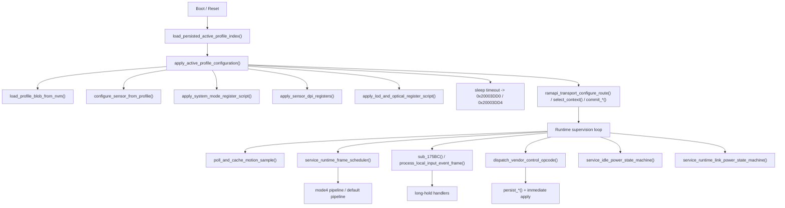
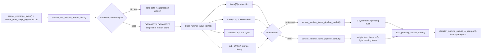

# `Ninjutso Sora V3` 鼠标固件架构与行为分析

> [!IMPORTANT]
> <sub><strong>逆向声明：</strong>本报告仅供合法的互操作性研究、防御性安全分析、教学、资料保存，以及设备所有人或经授权者进行维修与维护时参考之用；不授权未经许可的刷写、再分发、规避、侵权或其他违法用途，相关第三方权利仍归各自权利人所有。</sub>

## 家族选用说明

`Ninjutso Sora V3` 可视为采用原相定制主控与原相定制传感器的高端无线游戏鼠标固件代表样本，适合作为观察原相定制方案在固件分层、传感器脚本应用、运行时构帧与无线 `transport` 组织方式上的参考对象。

---

## 0. 文档说明

### 0.1 目标

报告重点回答以下问题：

- 固件的 `ROM` 层和 `RAM runtime` 层如何分工
- `profile` 是如何装载、拆分、落到运行时镜像的
- 传感器运动数据如何从原始采样一路走到最终运行时帧和 transport 发包
- 厂商私有命令、状态回包、调试读窗入口在哪里，执行模型是什么
- `System Mode`、`LOD`、optical 相关配置、`report rate` 在固件中的真实实现分别是什么
- 哪些逻辑属于真正的软件行为，哪些只是传感器寄存器脚本

### 0.2 样本信息

| 项目 | 内容 |
| --- | --- |
| 厂商 / 型号 | `Ninjutso Sora V3` |
| 固件包名 / 映像名 | `sora-v3_mouse_pid57360_ver_ae1609.bin` |
| 固件版本 | `ver_ae1609` |

---

## 1. 固件总体框架

### 1.1 架构结论与系统定位

从当前 `IDA` 数据库中已经恢复出的调用边界、状态布局和 `ramapi_*` thunk 关系看，这份固件应被理解为一套 `ROM` 主导的双层运行架构，而不是单层裸机主循环，也不是 `RTOS` 式多任务系统。

它的核心结论可以先概括为四点：

1. `ROM` 不是只负责上电初始化。它持续负责配置装载、模式应用、运动样本门控、运行时构帧、发送策略和功耗监督。
2. `RAM` 不是完整业务层。它更像由 `ROM` 调用的 runtime/transport 执行面，承接 route、context、链路收发和部分高频通道逻辑。
3. 整个系统围绕 `active profile` 运转。`profile` 不只是持久化记录，它同时决定传感器脚本、运行时镜像、route 选择和状态回包内容。
4. 所谓“模式”主要通过寄存器脚本、route/context 和影子状态实现，而不是通过独立的软件算法框架实现。

可将当前样本的架构定位总结如下：

| 维度 | 当前样本表现 | 直接证据 |
| --- | --- | --- |
| 系统形态 | `ROM` 主导策略层，`RAM` 承接 transport/runtime | `0x3B6C..0x3CD4` 一组 `ramapi_*` thunk；`ROM` 内仍保留 `build_runtime_input_frame()`、`apply_*()`、`service_*power*()` |
| 并发组织 | 周期服务例程 + 共享状态块 + 短临界区保护 | `sensor_exchange_bytes()`、`sample_and_decode_motion_delta()`、`persist_*()` 一类流程都带明显共享状态保护 |
| 数据面主链 | 采样、门控、缓存、构帧、route 分流、transport 桥接 | `sample_and_decode_motion_delta()` -> `poll_and_cache_motion_sample()` -> `build_runtime_input_frame()` -> `service_runtime_frame_pipeline_*()` |
| 控制面主链 | host 命令 / 本地长按 -> 持久化 -> 立即应用 -> 回包 | `dispatch_vendor_control_opcode()`、`persist_*()`、`apply_*()`、`emit_*()` |
| 监督面主链 | idle / sleep / runtime / link 联合监督 | `service_idle_power_state_machine()`、`service_active_transport_timeout()`、`service_sleep_transition_timeout()`、`service_runtime_link_power_state_machine()` |
| 运行风格 | 以寄存器脚本、状态镜像和 route 选择为中心 | `apply_system_mode_register_script()`、`apply_lod_and_optical_register_script()`、`normalize_report_rate_setting_for_route()` |

本章后续展开时，应始终把它看成一套“`ROM` 负责策略与整形，`RAM` 负责执行与承载”的系统。若把它误读成“`ROM` 只做启动，`RAM` 全权接管”，会直接错判本样本最重要的工程结构。

### 1.2 三平面、七层分解

从工程角度，当前固件最适合按“三平面、七层”理解，而不是按“若干孤立模块”理解。三条平面分别是控制平面、数据平面和监督平面；七个层次则给出了这些平面的真实落点。

| 平面 | 层次 | 主要职责 | 代表函数 / 对象 |
| --- | --- | --- | --- |
| 控制平面 | 持久化与镜像层 | 读取 `active profile`、装载 `profile blob`、维护按键块与 scalar 块镜像 | `load_persisted_active_profile_index()` `0x8D58`、`load_profile_blob_from_nvm()` `0xA1E8`、`persist_*()`、`sub_11994()`、`sub_119F4()` |
| 控制平面 | 配置执行层 | 把逻辑配置翻译为传感器脚本、`DPI`、`LOD`、route/context | `configure_sensor_from_profile()`、`apply_sensor_dpi_registers()` `0xF1C8`、`apply_system_mode_register_script()` `0x1022C`、`apply_lod_and_optical_register_script()` `0xEF38` |
| 控制平面 | 命令与本地入口层 | 接收 host 命令、处理板载长按、生成状态回包 | `dispatch_vendor_control_opcode()` `0xDAF4`、`handle_*_transport()`、`handle_*_checksum()`、`process_local_input_event_frame()` `0x4EBC` |
| 数据平面 | 采样与解码层 | 与传感器串行交换，读取 burst sample，识别坏状态并执行恢复序列 | `sensor_exchange_bytes()` `0x15AF6`、`sensor_read_single_register()` `0x15B5C`、`sample_and_decode_motion_delta()` |
| 数据平面 | 运行时整形层 | 缓存运动数据、聚合异步状态位、生成固定 `7` 字节运行时输入帧 | `poll_and_cache_motion_sample()` `0x17B50`、`build_runtime_input_frame()` `0x1618C` |
| 数据平面 | 发送策略与桥接层 | 按 route 决定短帧、完整帧、pending/flush 策略，并桥接到 `RAM transport` | `service_runtime_frame_pipeline_mode4()`、`service_runtime_frame_pipeline_default()`、`send_short_runtime_frame_over_link()` `0x166EA`、`flush_pending_runtime_frame()` `0x17FE6`、`ramapi_transport_*` |
| 监督平面 | 功耗与链路监督层 | 维护 idle、sleep、runtime/link 状态，驱动恢复和超时动作 | `service_idle_power_state_machine()` `0xC9A0`、`service_active_transport_timeout()` `0x52A8`、`service_sleep_transition_timeout()` `0x5334`、`service_runtime_link_power_state_machine()` `0x16AF0` |

这七层不是并列关系，而是严格串接的。控制平面决定当前生效的配置镜像和 route；数据平面根据这些镜像决定如何采样、整形和发送；监督平面则在系统空闲、链路阻塞或功耗切换时改写前两者的运行边界。

这里最关键的工程结论是：`ROM` 并没有在“配置完成”后退出主舞台。它持续扮演控制枢纽和数据整形层；`RAM` 的角色更接近 transport 执行器和 context 运行面。

### 1.3 启动装配链：从 `NVM` 到可运行系统

启动顺序可归纳为以下八步：

1. 从当前 `ROM` 映像可以直接看到 `0x3B6C..0x3CD4` 这组 `ramapi_*` thunk；而启动后的配置与运行流程也确实持续调用这组入口，形成 `ROM` 调用 `RAM runtime` 的固定边界。
2. `load_persisted_active_profile_index()` 从 `NVM key 0x2000` 读取当前 `active profile index`。
3. `apply_active_profile_configuration()` 以该 index 为中心驱动整个装配过程；若读取值为 `0xFF`，则设置 `0x20003DD8/0x20003DD9/0x20003DDC/0x20003DDD` 并转入默认回退分支。
4. `load_profile_blob_from_nvm()` 根据 profile index 选择 `0x2001`、`0x2100` 或 `0x2200`，读取固定长度 `57` 字节记录。
5. `57` 字节 `profile blob` 在 `ROM` 中被拆成两个运行时镜像：
   - `0..27` -> `0x20004961..0x2000497C`，七组按键绑定块。
   - `28..56` -> `0x20004922..0x2000493E`，scalar 配置块。
6. `apply_active_profile_configuration()` 继续按固定顺序执行 backend 应用：
   - `configure_sensor_from_profile()`
   - `apply_system_mode_register_script()`
   - `apply_sensor_dpi_registers()`
   - `apply_lod_and_optical_register_script()`
7. 传感器脚本应用完成后，再通过 `ramapi_transport_configure_route()`、`ramapi_transport_select_context()`、`ramapi_transport_commit_primary()`、`ramapi_transport_commit_secondary()` 提交当前 route/context。
8. 至此，系统进入“已物化的运行态”：后续 host 命令和本地长按不再重新构建整套系统，而是在这份活动镜像上做增量修改。

这一启动链的工程含义非常明确：

- 启动阶段的核心产物不是“若干初始化完成标志”，而是一份已落地的 `active profile runtime image`。
- `profile` 在这里同时决定三件事：传感器寄存器脚本、运行时镜像内容、transport route/context。
- 后续运行阶段的配置变更之所以能够立即生效，是因为启动时已经把持久化结构和运行时结构对齐了。

### 1.4 运行期协同模型：控制平面、数据平面、监督平面

进入稳定运行后，当前样本并不是一个“所有任务权重相同的大循环”。更准确地说，它由三条相互耦合的平面组成，每条平面都有自己的触发源、共享状态和输出对象。

| 平面 | 触发源 | 主链 | 关键共享状态 | 最终输出 |
| --- | --- | --- | --- | --- |
| 控制平面 | host vendor 命令、本地长按事件 | `dispatch_vendor_control_opcode()` / `handle_*()` / `process_local_input_event_frame()` -> `persist_*()` -> `apply_*()` | `0x20004921..0x2000493E`、`0x20004961..0x2000497C`、若干 shadow 状态 | 寄存器脚本应用、route/context 更新、状态回包 |
| 数据平面 | 调度周期、传感器可读、运动缓存状态 | `service_runtime_frame_scheduler()` -> `poll_and_cache_motion_sample()` -> `build_runtime_input_frame()` -> `service_runtime_frame_pipeline_*()` | `0x20003D76..0x20003D82`、`0x20003C78`、`0x20003BD3..0x20003BE2` | 短帧、完整帧、pending frame、transport 提交 |
| 监督平面 | idle 计时、链路状态、runtime 活动 | `service_idle_power_state_machine()`、`service_active_transport_timeout()`、`service_sleep_transition_timeout()`、`service_runtime_link_power_state_machine()` | `0x20003C5x`、`0x20003DDx`、transport 通道状态 | idle/sleep 迁移、恢复动作、link/runtime 约束 |

三条平面的耦合方式如下：

- 控制平面负责“定义现在应该怎样工作”。它修改 `profile` 镜像、下发脚本、切换 route，并刷新状态回包。
- 数据平面负责“把当前配置下的输入事件变成可发送内容”。它不直接解释 UI 语义，而是消费当前已生效的 `profile` 和 route。
- 监督平面负责“约束何时允许继续工作”。它不生成业务数据，但会改变数据平面的推进条件和控制平面的可执行窗口。

总的来说，当前运行期可以理解为以下闭环：

1. 控制平面把逻辑配置落成运行时镜像和寄存器脚本。
2. 数据平面基于这份镜像抓取 motion sample，并构造成固定 `7` 字节运行时输入帧。
3. 发送策略层根据当前 route 选择发送分支：
   - `mode 4` 走 `service_runtime_frame_pipeline_mode4()`，更强调完整帧和在途状态维护。
   - 其他 route 走 `service_runtime_frame_pipeline_default()`，更强调短帧直发与 pending full frame 补发。
4. 两套发送分支最终都通过 `ramapi_transport_*` 或 transport service 桥接到 `RAM runtime`。
5. 监督平面持续监视 idle、sleep 和 link 状态，在必要时打断、限流或恢复上述过程。

因此，本章真正的架构结论不是“固件有几条函数调用链”，而是：这是一套以 `profile` 镜像为中心、以 `ROM` 整形为主导、以 route-aware transport 为执行末端的闭环系统。

### 1.5 关键状态面与工程实现风格

要读懂本样本，光看函数名不够，还必须看“状态面”如何组织。当前 `IDB` 中最重要的共享状态块如下：

| 地址区间 / 对象 | 角色 | 在架构中的意义 |
| --- | --- | --- |
| `0x20004921..0x2000493E` | `active profile` 与 scalar 配置镜像 | 控制平面的中心状态；`DPI`、`LOD`、`System Mode`、optical、report-rate 都从这里取值 |
| `0x20004961..0x2000497C` | 七组按键绑定镜像 | `profile blob` 拆分后的输入定义区，是本地输入和状态回包的重要来源 |
| `0x20003C08..0x20003C28` | 本地事件 / 长按上下文 | 板载事件不会直接改寄存器，而是先进入这组运行时上下文，再走统一处理器 |
| `0x20003C78` | 固定 `7` 字节运行时输入帧缓冲 | 数据平面的统一输出面；运动、状态位、尾字节都先在这里装配 |
| `0x20003BD3..0x20003BE2` | 异步状态位、尾字节和构帧辅助状态 | 说明当前样本不只是传 motion，`ROM` 还在维护异步输入的时序整形 |
| `0x20003D76..0x20003D82` | motion cache、样本质量门控与恢复状态 | 这里把“采样结果”“坏状态检测”“恢复动作”绑成了一组连续状态 |
| `0x20003D4C/0x20003D4D`、`0x20003D54/0x20003D55`、`0x20003D68/0x20003D69` | transport 队列 / 通道状态 | 连接 `ROM` 发送策略层和 `RAM transport` 执行面的关键桥位 |
| `0x20003C5x`、`0x20003DDx` | idle/sleep/runtime 监督状态 | 监督平面的主要状态落点，用于控制进入低功耗与恢复入口 |

在这些状态面的基础上，当前样本表现出四个非常稳定的工程风格：

1. `ROM`、`RAM runtime` 和 `NVM` 不是三套彼此独立的数据结构，而是围绕少量密集状态块共享同一套活动镜像。
2. 多处共享状态敏感流程会显式进入短临界区，因此 `profile` 装载、坏状态恢复序列和部分持久化写回都带明显的时序保护痕迹。
3. 当前已确认的主要配置项遵循统一范式：修改当前活动镜像，必要时回写持久化，再对当前有效 profile 立即执行 `apply_*()`，而不是要求整机重启。
4. “模式”在本样本中的真实实现通常是三件事的组合：寄存器脚本、route/context 选择、影子状态更新；不要把它误读成独立的软件算法模块。

综合以上结构，可以把本样本的总体框架归结为一句话：

`ROM` 负责把“配置语义”和“输入事件”整形成系统可执行的运行时状态，`RAM` 负责把这些状态变成链路层可承载的 transport 行为；两者之间由 `active profile` 镜像和 `ramapi_*` 边界稳定连接。

---

## 2. 配置系统与命令入口

当前 `ROM` 中能够被直接闭合的，不是 `USB`、`BLE` 或空口协议的物理接入层，而是更上层的“控制面执行层”。这条执行层负责接收外部控制包或板载输入事件，把配置语义落到活动镜像，再把结果同步到寄存器脚本、`route/context`、运行态影子值和状态回包。本章只讨论这条已经在 `IDA` 中有完整证据链的控制执行链，不对底层物理接收回调和最终空口帧格式做超出 `IDB` 的推测。

### 2.1 控制面边界与命令家族

当前样本可直接确认的控制面入口可以分成五类：

| 命令家族 | 主入口 | 已确认作用 | 直接输出面 |
| --- | --- | --- | --- |
| 外层 `vendor control` 包装层 | `dispatch_vendor_control_opcode()` `0xDAF4` | 按 `packet[0]` 分发外层 opcode；已见 `24`、`34`、`35`、`37`、`39`、`42`、`43`、`64`、`65`、`66` | 内部 runtime 包、临时回包、传输状态锁存 |
| 内部 runtime 执行层 | `dispatch_runtime_packet_to_transport()` `0xD6D4` | 统一解释内部 opcode；先尝试 fast-path ring，失败再走 slow-path 解释器 | `RAM transport` 回调、状态帧构造、route 切换 |
| `checksum` 协议族 | `handle_report_rate_setting_request_checksum()` `0x6E84`、`handle_system_mode_setting_request_checksum()` `0x6EE6` 等 | 与 transport 族共享配置落地逻辑，但回包格式改为 `checksum guarded frame` | `0x0A 0x40` 头格式状态帧 |
| 板载本地事件族 | `process_local_input_event_frame()` `0x4EBC` | 处理板载 `8` 字节事件帧，驱动长按类控制逻辑，并继续投递到 transport 执行链 | `DPI` / `System Mode` / route 相关控制链 |
| 工程调试读窗族 | `handle_read_amb_cmd()` `0xC52C`、`handle_read_reg_cmd()` `0xC588` | 直接读取目标窗口并构造 vendor reply | `0x04 0x80` 头格式 reply |

这一分层很关键。对当前样本来说，真正稳定的分析对象不是“某条链路从哪里收到包”，而是“收到包之后如何进入统一执行层”。从 `IDA` 证据看，控制系统的核心在 `dispatch_vendor_control_opcode()`、`dispatch_runtime_packet_to_transport()`、各 `handle_*()` 配置处理器，以及 `0x200049xx` 活动镜像；这已经足够重建配置面的总体架构。

### 2.2 外部命令如何进入统一执行层

外部控制包进入统一执行层时，首先经过 `dispatch_vendor_control_opcode()` `0xDAF4`。这个函数处理的是“外层协议”，不是最终配置语义本身。它使用 `packet[0]` 作为外层 opcode，对已确认的若干命令家族做第一层拆包。

其执行模型可以概括为四步：

1. 读取外层 opcode，决定当前包属于直接执行、执行后回包，还是状态锁存类分支。
2. 对大多数配置类分支，剥掉前 `3` 字节包装后，把 `packet + 3` 和 `packet[2]` 作为内部 payload 与长度传给 `dispatch_runtime_packet_to_transport()`。
3. 对 `42`、`43`、`66` 这类“执行后需要立刻整理返回内容”的命令分支，先让 runtime 执行层消费 payload，再通过 `sub_DF74()` 和 `sub_141A()` 抽取结果并组织回复。
4. 对 `65` 这条分支，不直接进入常规配置处理器，而是更新 `0x20003A74`、`0x20003A76`，并与 `0x20003A78` 比较，表现为一类单独的传输状态锁存 / 分段状态处理分支。

真正的统一执行层是 `dispatch_runtime_packet_to_transport()` `0xD6D4`。它内部有清晰的双分支结构：

- 第一层是 fast-path。满足 `!bypass_fast_path` 且 `0x20003B90`、`0x20003B94`、`0x20003B88`、`0x20003B6A` 等队列条件时，函数会在临界区内更新 ring 状态，并通过 `enqueue_runtime_fast_path_payload()` 把包直接送入缓存队列。
- 第二层是 slow-path 解释器。fast-path 不成立时，函数按内部 `packet[0]` 解释 runtime opcode；当前已确认可见的内部 opcode 至少包括 `16`、`24`、`34`、`35`、`37`、`39`、`40`、`41`、`42`、`43`。

slow-path 中的几类行为尤其重要：

- `24`、`34`、`37` 这类控制项会进入 `enqueue_runtime_deferred_callback()` 这一类统一 deferred-callback 入队节点。
- `40`、`41`、`42`、`43` 这组内部 opcode 会调用 `sub_DF48()`、`MEMORY[0x20003BC0]`、`MEMORY[0x20003BC4]`、`MEMORY[0x20003BC8]`、`MEMORY[0x20003BCC]` 等运行时回调入口，再经 `build_runtime_transport_reply_frame()` 组装成 transport 可发送内容。
- `39` 是一条显式影响 route 的控制分支：函数先调用 `open_runtime_transport_session_from_packet(packet + 1, packet_len, 39, 536886116)`，在满足条件时再执行 `ramapi_transport_configure_route(1, 5, 0)`、`ramapi_set_run_state_code(1)`、`sub_3B48(1)`。

这一层的工程意义在于，它明确区分了“外层协议 opcode”和“内部 runtime opcode”。前者决定包如何拆解与归类，后者决定真正的控制语义如何落地。把这两层混在一起，会直接导致对命令表结构和状态回包链的误读。

### 2.3 配置项执行流水线

当前样本的配置执行并不是“收包后各写各的”。从已确认的处理器实现看，它遵循一条高度统一的落地流水线：

`入口收包 / 本地事件 -> persist_*() 更新活动镜像并写回当前 profile -> normalize / apply -> 需要时刷新 route/context 或 shadow -> 发出状态回显`

这条流水线最重要的价值，不是让配置“可保存”，而是让配置“立刻变成当前运行态”。下面列出本章已完全核实的几条代表性执行链。

| 配置项 | 主处理器 | 已确认的落地链 | 工程结论 |
| --- | --- | --- | --- |
| `System Mode` | `handle_system_mode_setting_request_transport()` `0x72AA` | `persist_system_mode_setting(a1[1], *a1)` -> 按 host 值 `0/1/2` 选择 `apply_system_mode_register_script(0/2/4)` -> `set_active_system_mode_shadow(a1[1])` | host 写入值不是最终脚本值；中间存在 `0/2/4` 的脚本映射层 |
| `report-rate` | `handle_report_rate_setting_request_transport()` `0x7230` | 根据 `sub_BD2C()` 在 `persist_report_rate_setting_for_link_mode()` 与 `persist_report_rate_setting_for_wireless_mode()` 之间二选一 -> `normalize_report_rate_setting_for_route()` -> `ramapi_publish_run_state_code()` -> 需要时 `ramapi_transport_configure_route()` / `ramapi_transport_select_context()` / `ramapi_transport_commit_*()` | `report-rate` 不是单字段，而是与当前 route 绑定的配置族 |
| `LOD` | `handle_lod_setting_request_transport()` `0x7118` | `persist_lod_setting(packet[1], *packet)` -> `apply_lod_and_optical_register_script(packet[1], ...)` | `LOD` 改动会直接触发光学相关寄存器脚本重应用 |
| `active optical flag` | `handle_active_optical_flag_request_transport()` `0x70DC` | `persist_active_optical_engine_flag(a1[1], *a1)` -> `apply_lod_and_optical_register_script(MEMORY[0x20004932], ...)` | 该标志与 `LOD` 共用同一类光学脚本应用链 |
| `staged optical mode` | `handle_staged_optical_engine_setting_request_transport()` `0x71EC` | 先 `get_system_mode_setting()`；仅当结果不等于 `2` 时才执行 `persist_staged_optical_engine_mode(a1[1], *a1)`，随后调用 `sub_11CF0(4, 268454107, 0x4000, 1)` | 这是一个受 `System Mode` 约束的阶段性配置，不是随时都能落地 |

`checksum` 变体与 transport 变体共享同一套核心落地逻辑，但尾部动作并不完全相同：

- `handle_report_rate_setting_request_checksum()` `0x6E84` 同样先持久化、再归一化，但尾部会先执行 `clear_pending_vendor_slot(16)`，再经 `sub_C284()` 和 `ramapi_publish_run_state_code()` 更新运行态，最后在需要时做 route 切换。
- `handle_system_mode_setting_request_checksum()` `0x6EE6` 也会先 `persist_system_mode_setting()`，再按 `0/2/4` 选择脚本；与 transport 版本相比，当前可见实现里没有单独出现 `set_active_system_mode_shadow()` 这一步。

本地板载事件也汇入同一控制面。`process_local_input_event_frame()` `0x4EBC` 会读取 `0x20003D1D` 所代表的事件码，在确认事件有效后依次调用 `handle_dpi_stage_hold_event()`、`sub_CCF0()`、`handle_system_mode_hold_event()`，随后再决定是立即进入 `ramapi_transport_can_poll_channel()` 分支，还是把事件继续排入 transport。也就是说，host 命令与板载长按不是两套独立系统，它们在进入真正的应用层之前已经收敛到同一条控制链。

因此，本章最重要的结构结论是：配置系统的核心不是 opcode 表本身，而是 `persist_*()`、`apply_*()`、`ramapi_transport_*()` 与 `0x200049xx` 活动镜像之间的协同。只要这条链闭合，配置就会被立刻物化为当前运行态。

### 2.4 状态回显与回包封装

当前样本存在三套不同用途的回包面：transport 状态帧、`checksum guarded` 状态帧，以及工程调试使用的 vendor reply。三者共享同一份配置镜像，但封装头、触发入口和使用场景不同。

先看 transport 状态回显。当前已确认的状态发射器如下：

| 状态项 | transport 发射器 | opcode | 取值来源 | 异常修正 |
| --- | --- | --- | --- | --- |
| `report-rate` | `emit_report_rate_status_transport()` `0x6854` | `6` | `get_effective_report_rate_setting()` | 返回的是 route 归一化后的有效值 |
| `LOD` | `emit_lod_status_transport()` `0x674C` | `8` | `get_lod_setting()` | 若值为 `0xFF`，立即改写为 `1` 并持久化 |
| `System Mode` | `emit_system_mode_status_transport()` `0x68B0` | `12` | `get_system_mode_setting()` | 若值大于 `2`，立即改写为 `0`，并调用 `persist_system_mode_setting()` 与 `set_active_system_mode_shadow()` |
| `staged optical mode` | `emit_staged_optical_engine_mode_transport()` `0x681C` | `50` | `get_staged_optical_engine_mode()` | 当前未见额外修正 |
| `active optical flag` | `emit_active_optical_flag_transport()` `0x66D4` | `58` | `0x2000493E` | 若值大于 `1`，立即改写为 `0` 并持久化 |

这组 transport 状态帧都通过 `emit_transport_frame_via_channel_table()` 发出，本质上是“当前活动镜像的对外回显”。

第二套是 `checksum guarded frame`。其统一构造器是 `build_checksum_guarded_frame()` `0x4B64`，已确认行为如下：

- 固定头字节为 `0x0A 0x40`。
- 第三个字节写入业务 opcode。
- 对 payload 做简单累加和，并把结果写入帧头。
- 总长度按 `payload_len + 4` 计算，但会截断到 `15`。
- 输出长度保存在 `0x20003DFC`。

当前已确认的 `checksum` 状态构造器包括：

- `build_report_rate_status_frame()` `0x6C30`，opcode `6`，payload 为 `[2, effective_rate]`。
- `build_lod_status_checksum()` `0x6B64`，opcode `8`，payload 为 `[2, lod]`，并在 `lod == 0xFF` 时回写 `1`。
- `build_system_mode_status_checksum()` `0x6CC4`，opcode `12`，payload 为 `[2, system_mode]`，并在值超界时回写 `0`。
- `build_active_optical_flag_checksum()` `0x6AD4`，opcode `58`，payload 为 `[2, flag]`，并在值超界时回写 `0`。

第三套是 vendor reply。其统一构造器是 `build_vendor_reply_buffer()` `0x4D94`，已确认格式如下：

- 输出缓冲位于 `0x200039EC`。
- 固定头字节为 `0x04 0x80`。
- 第 `3` 字节为 `reply_type`。
- 若有 payload，则拷贝到头后。
- 总长度固定写成 `payload_len + 3`。

这套 vendor reply 主要服务于工程调试读窗入口：

- `handle_read_amb_cmd()` `0xC52C` 执行 `copy_amb_payload_bytes()` -> `build_vendor_reply_buffer(3, payload, len)` -> `clear_pending_vendor_slot(3)`。
- `handle_read_reg_cmd()` `0xC588` 执行 `copy_reg_window_bytes()` -> `build_vendor_reply_buffer(1, payload, len)` -> `clear_pending_vendor_slot(2)`。

从工程视角看，这三套回包面的共同点非常明确：它们并不各自维护一份独立状态，而是统一回读 `0x200049xx` 活动镜像，再用不同封装格式对外表达。因此，回包体系的本质不是“协议花样很多”，而是“同一份运行态被多个出口复用”。

### 2.5 运行时镜像、持久化与延迟写回

配置系统能成立，前提是活动镜像组织稳定。当前样本已确认的关键配置落点如下：

| 地址 | 已确认角色 | 直接证据 |
| --- | --- | --- |
| `0x20004930` | 无线侧 `report-rate` 槽位 | `persist_report_rate_setting_for_wireless_mode()`、`normalize_report_rate_setting_for_route()`、`get_effective_report_rate_setting()` |
| `0x20004931` | 链路模式 `report-rate` 槽位 | `persist_report_rate_setting_for_link_mode()`、`normalize_report_rate_setting_for_route()`、`get_effective_report_rate_setting()` |
| `0x2000493A` | 另一条 route 相关 `report-rate` 槽位 | `persist_report_rate_setting_for_link_mode()`、`normalize_report_rate_setting_for_route()`、`get_effective_report_rate_setting()` |
| `0x20004932` | `LOD` 当前值 | `persist_lod_setting()`、`apply_lod_and_optical_register_script()` |
| `0x20004935` | `System Mode` 当前值 | `persist_system_mode_setting()`、`get_system_mode_setting()` |
| `0x2000493D` | `staged optical mode` | `persist_staged_optical_engine_mode()`、`get_staged_optical_engine_mode()`、`sample_and_decode_motion_delta()` |
| `0x2000493E` | `active optical flag` | `persist_active_optical_engine_flag()`、`emit_active_optical_flag_transport()`、`build_active_optical_flag_checksum()`、`apply_lod_and_optical_register_script()` |

这些地址说明了两个关键事实。

第一，活动镜像是“语义化字段集合”，不是一块无意义 blob。`System Mode`、`LOD`、`active optical flag`、`staged optical mode` 和 `report-rate` 都能被追到真实的运行态落点。

第二，`report-rate` 在本样本中是典型的 route-aware 配置族，而不是单字节开关。`normalize_report_rate_setting_for_route()` `0x7414` 会根据当前链路条件和 `sub_BD2C()` / `sub_3C08(0)` 的判断，分别改写 `0x20004930`、`0x20004931`、`0x2000493A`，并返回供 `ramapi_publish_run_state_code()` 使用的运行态码值。也就是说，UI 上看到的“回报率”在固件里实际绑定的是“配置值 + route 选择 + 运行态码”这一整套联动关系。

单字段写回流程也很统一。`persist_system_mode_setting()`、`persist_lod_setting()`、`persist_active_optical_engine_flag()`、`persist_staged_optical_engine_mode()`、`persist_report_rate_setting_for_wireless_mode()`、`persist_report_rate_setting_for_link_mode()` 都遵循同一种模板：

1. 先更新 `0x200049xx` 活动镜像。
2. 进入短临界区。
3. 按 profile 选择对应 `NVM key`。
4. 调用 `sub_F634()` 写入单字段。
5. 失败时使用 `0x20003E77` 计数重试，最多 `3` 次。

除了单字段立即写回，当前样本还保留了明确的 dirty-slot 增量写回机制。`mark_profile_dpi_stage_dirty_descriptor()` `0x117C4` 会把一个 `5` 字节 `DPI stage descriptor` 子块写入 `0x20004BAE + 5 * index`，同时把 `0x20004BC2 + index + 7` 对应 slot 置脏。随后 `service_profile_incremental_dirty_writeback()` `0x9A90` 使用 `0x20003E76` 作为“继续扫描”总标志，`0x20003E78` 作为当前 dirty slot 游标，逐槽寻找待写项并分派写回：

- `case 0..6` 走 `sub_F634()`，每个 dirty slot 写回 `4` 字节，目标 key 随当前 profile 变化。
- `case 7..10` 分别转到 `persist_profile_dpi_stage0_value()`、`persist_profile_dpi_stage1_value()`、`persist_profile_dpi_stage2_value()`、`persist_profile_dpi_stage3_value()` 这四条专用 `DPI stage` 写回例程。
- `case 11` 从 `0x20004922` 取 `1` 字节 `dpi_stage_count`，再通过 `sub_F634()` 写回。
- 每次写回成功后都会清掉对应 dirty 标志，并重新拉起扫描状态。

这说明当前固件并不只依赖“收到命令就立即写一个字段”的简单模型，而是同时实现了面向多子项配置块的 staged writeback 机制。

此外，还能确认两条整块提交流程：

- `sub_11994()` 在临界区内调用 `sub_FF8C()`，把一个 `28` 字节块写到按 profile 选择的 `0x2001`、`0x2100`、`0x2200`。
- `sub_119F4()` 同样在临界区内调用 `sub_FF8C()`，把一个 `29` 字节块写到按 profile 选择的 `0x201D`、`0x211C`、`0x221C`。

因此，本样本的持久化层至少同时存在三种粒度：单字段写回、脏子块写回、整块 profile 写回。控制面的工程成熟度，恰恰体现在这三种粒度能够共存而不相互冲突。

### 2.6 调试读窗与章节边界

`handle_read_amb_cmd()` 和 `handle_read_reg_cmd()` 的存在，说明当前样本内置了明确的工程调试读窗能力。但这两条读窗命令的职责非常单纯：读取窗口、组 reply、清 pending slot。它们不会触发 `persist_*()`、`apply_*()`、`ramapi_transport_configure_route()` 这类配置落地动作，因此不应与正常用户配置命令混为一谈。

综合本章全部证据，可以把当前控制面概括为一句话：

这套固件把“配置语义”集中落在 `0x200049xx` 活动镜像，再通过 `persist_*()`、`apply_*()`、`ramapi_transport_*()` 和多种状态回包把这份镜像物化为真实运行态。对本样本而言，真正的架构中心不是某一张命令字表，而是这份活动镜像及其周围的执行链。

---

## 3. 传感器运动数据流转流程
这一章只讨论运动数据面，也就是“传感器一拍原始样本如何进入 `ROM`，如何被门控、缓存、装帧，再如何交给 route-aware 发送策略”。当前 `IDB` 已经足够把这条链闭合到 `sub_1776A()` 一层，但运动中断源、最终 `RAM transport` 内部调度与空口复用细节仍不在本章讨论范围内。

### 3.1 数据面总览

从当前 `ROM` 可直接确认的数据面主链如下：

`sub_15702()` / `sub_15730()` -> `poll_and_cache_motion_sample()` -> `sample_and_decode_motion_delta()` -> `consume_cached_motion_sample_*()` -> `build_runtime_input_frame()` -> `service_runtime_frame_scheduler()` -> `service_runtime_frame_pipeline_mode4()` / `service_runtime_frame_pipeline_default()` -> `send_short_runtime_frame_over_link()` / `flush_pending_runtime_frame()` / `sub_1776A()`

这条链不是“读到坐标就直接发”。它分成六个职责层：

| 层次 | 关键函数 | 关键状态 / 缓冲 | 负责的问题 |
| --- | --- | --- | --- |
| 采样事务层 | `sensor_exchange_bytes()` `0x15AF6`、`sensor_read_single_register()` `0x15B5C`、`sample_and_decode_motion_delta()` `0x17B9C` | 传感器串口寄存器窗口、`0x20003D80..0x20003D82`、`0x2000493D` | 如何从传感器拿到一拍原始数据，并判断这一拍是否可用 |
| 单拍缓存层 | `poll_and_cache_motion_sample()` `0x17B50`、`consume_cached_motion_sample_for_mode4()` `0x17B34`、`consume_cached_motion_sample_for_runtime_frame()` `0x17B66` | `0x20003D76..0x20003D7B` | 一拍样本只解码一次，后续由不同消费者统一取用 |
| 构帧整形层 | `build_runtime_input_frame()` `0x1618C` | `0x20003BD3..0x20003BE2`、`0x20003BDF`、`0x20003BE1`、`0x20003C78` | 把运动增量与异步状态位拼成固定 `7` 字节 runtime frame |
| 调度层 | `service_runtime_frame_scheduler()` `0x169FC` | `0x20003C74`、`0x20003C5C` | 决定何时立即构帧、何时周期驱动、何时进入哪条发送流水线 |
| `mode 4` 发送流水线 | `service_runtime_frame_pipeline_mode4()` `0x16800` | `0x20003C4C..0x20003C4E`、`0x20003DE6`、`0x20003DEB` | 维护完整 `9` 字节帧的 prepare / stage / submit 状态机 |
| 默认发送流水线 | `service_runtime_frame_pipeline_default()` `0x16940`、`send_short_runtime_frame_over_link()` `0x166EA`、`flush_pending_runtime_frame()` `0x17FE6` | `0x20003DEE`、`0x20003DED`、`0x20003D68`、`0x20003D69` | 在“短帧立即发”和“完整帧延后补发”之间做折中 |

这一架构有两个直接后果：

1. 运动样本与发送行为之间隔了至少三层状态面，固件并不是拿到坐标就马上发给下层。
2. `route` 不只影响空口出口，还会影响缓存消费方式、构帧逻辑以及后续发送策略。

### 3.2 采样事务：一拍样本如何被读出并判定可用

#### 3.2.1 传感器字节交换层

底层的传感器事务由 `sensor_exchange_bytes()` `0x15AF6` 完成。该函数的行为已经非常清楚：

1. 把传输长度限制在 `7` 字节以内。
2. 把长度写入 `0x5002C008` 对应的硬件控制位。
3. 将 `tx_buf` 中的待发送字节逐个写入硬件窗口。
4. 通过 `0x5002C001` 启动一次事务。
5. 轮询 `0x5002C00B` 直到硬件完成。
6. 再把接收窗口中的字节逐个拷回 `rx_buf`。

因此，`sensor_exchange_bytes()` 不是抽象的“读传感器”黑盒，而是一条可直接看到寄存器操作的串行交换例程。

`sensor_read_single_register()` `0x15B5C` 则是它的单寄存器包装器：调用方传入寄存器号和 `1` 字节输出缓冲，函数内部用 `1` 字节事务调用 `sensor_exchange_bytes()` 完成读取。

#### 3.2.2 样本解码与坏状态恢复

真正把一拍原始样本变成运动增量的核心函数是 `sample_and_decode_motion_delta()` `0x17B9C`。它把“采样事务”“坏状态门控”“恢复写序列”“输出打包”四件事放在了一起。

按执行顺序，可以把该函数拆成以下步骤：

1. 准备固定的 `7` 字节 burst 读命令。
2. 调用 `sensor_exchange_bytes()` 取回本拍 burst 数据。
3. 额外调用 `sensor_read_single_register(22, ...)` 读取 `register 22`。
4. 从 burst 返回值中提取本拍质量字节、状态字节和运动位。
5. 根据质量门槛、`staged optical mode` 和恢复状态决定是否进入坏状态处理。
6. 若判定为坏状态，执行一段显式的恢复写序列。
7. 若处于恢复抑制窗口，则继续压制本拍输出。
8. 只有在“样本门控位有效且本拍未被抑制”时，才把结果写成 `4` 字节 `delta` 输出。

当前可直接确认的输入与状态关系如下：

| 来源 | 在当前函数中的真实作用 |
| --- | --- |
| burst 返回值第 `0` 字节的 `bit7` | 本拍运动输出的总门控位；无此位则本拍 `delta` 直接清零 |
| burst 返回值中的 `4` 个核心字节 | 组成最终 `4` 字节运动 `delta` |
| burst 质量字节 `BYTE2(v17)` | 与 `0x2000493D` 一起决定坏状态门槛 |
| `register 22` 读值 | 参与恢复抑制窗口判断，并回写到 `0x20003D82` |
| `0x20003D7F` | 为真时对两个 `16-bit` 半字做 `x2` 放大 |
| `0x2000493D` | `staged optical mode`，直接参与坏状态门槛选择 |

坏状态判定条件也可以直接从伪代码中写清：

- `is_sensor_bad_state_latched()` 返回真。
- 质量字节大于等于 `0xC0`，且 `0x2000493D == 1`。
- 质量字节大于等于 `0xE0`，且 `0x2000493D == 0` 或 `0x2000493D == 2`。
- 并且当前 `0x20003D80 == 0`，即尚未进入恢复已执行状态。

满足上述条件后，函数会进入临界区并执行以下恢复写序列：

```c
0x7F = 0
0x09 = 0x5A
0x54 = 0x01
0x7F = 4
0x1D = 0x77
0x7F = 0
0x09 = 0x00
```

恢复动作落地后，三个状态位会被更新：

| 地址 | 作用 |
| --- | --- |
| `0x20003D80` | 标记恢复序列已经执行 |
| `0x20003D81` | 标记恢复抑制窗口有效 |
| `0x20003D82` | 记录最近一次 `register 22` 的值 |

之后函数还会进入一个明确的抑制窗口判断：

- 如果 `0x20003D81` 有效，且旧值 `0x20003D82` 或当前 `register 22` 值有任一小于 `0x50`，则本拍继续抑制输出。
- 只有当两次读值都不再低于 `0x50` 时，函数才清除 `0x20003D81`，允许后续样本恢复正常输出。

最终输出条件非常严格：只有在门控位有效且本拍未被抑制时，函数才返回 `1` 并写出 `4` 字节运动结果；否则会把 `out_delta[0..3]` 清零并返回 `0`。

这一实现说明，当前样本在传感器层面并非完全依赖硬件黑盒。至少在“坏状态检测 -> 执行恢复 -> 临时抑制输出 -> 恢复放行”这段链路上，`ROM` 明确承担了主动控制职责。

需要保持的边界也同样明确：

- 当前只能确认“某个质量字节参与门槛判断”，不能据此给出未经证据支持的 datasheet 命名。
- 当前只能确认“恢复序列被执行”，不能进一步把它命名成某个公开营销术语。
- 当前可以确认输出是两个 `16-bit` 量组成的 `4` 字节 `delta`，但不能在没有实机对照的前提下强行定义每个原始位段的公开坐标语义。

### 3.3 单拍缓存：样本只解码一次，后续统一消费

采样事务层的输出不会直接被多个消费者反复读取，而是先进入一组非常紧凑的单拍缓存状态：

| 地址 | 作用 |
| --- | --- |
| `0x20003D76` | 最近一次 `sample_and_decode_motion_delta()` 的返回状态 |
| `0x20003D77` | cache valid 标志 |
| `0x20003D78..0x20003D7B` | 最近一拍的 `4` 字节运动 `delta` |
| `0x20003D7F` | 输出放大控制位 |
| `0x20003D80..0x20003D82` | 恢复执行标志、恢复抑制标志、最近一次 `register 22` 值 |

缓存填充函数 `poll_and_cache_motion_sample()` `0x17B50` 的逻辑极其直接：

1. 先读取 `0x20003D77`。
2. 若缓存已有效，直接返回，不再访问传感器。
3. 若缓存无效，调用 `sample_and_decode_motion_delta((uint8_t *)0x20003D78)`。
4. 把返回值同时写到 `0x20003D76` 和 `0x20003D77`。

这意味着 `0x20003D77` 在当前实现里既是“缓存是否有效”的标志，也是“上一拍是否成功产生有效 `delta`”的快速镜像。

缓存消费端也完全对称：

- `consume_cached_motion_sample_for_mode4()` `0x17B34`
- `consume_cached_motion_sample_for_runtime_frame()` `0x17B66`

这两个函数都会：

1. 复制 `0x20003D78..0x20003D7B` 到调用方提供的 `dst`。
2. 把 `0x20003D77` 清零。
3. 返回 `0x20003D76`。

这说明当前缓存是“单拍一次性消费”模型，不是多读共享缓存。谁先消费，谁负责把 valid 清掉；下一次真正的新样本必须重新经过 `poll_and_cache_motion_sample()`。

#### 3.3.1 已确认的采样触发点

`IDA` 中目前能直接确认的缓存预取入口有两条：

- `sub_15702()` `0x15702`
- `sub_15730()` `0x15730`

两者都显式调用 `poll_and_cache_motion_sample()`，区别在于后续动作不同：

- `sub_15730()` 只是简单预取一拍样本，然后调用 `sub_1569A()` 返回。
- `sub_15702()` 则在预取后继续进入 `sub_16A84()`，尝试走一条更轻的 runtime 发送分支。

因此，当前数据面的采样触发并不只存在“定时调度器到了就现读传感器”这一种形态。更准确地说，样本通常会先被预取进缓存，再由后续构帧器决定何时消费。

### 3.4 运行时输入帧装配器：`7` 字节内部帧如何生成

#### 3.4.1 帧结构与返回语义

`build_runtime_input_frame()` `0x1618C` 是当前数据面的中心装配器。它的输出固定落在 `0x20003C78` 一带，对外形成统一的 `7` 字节 runtime input frame。

从函数尾部可直接确认帧结构如下：

| 帧偏移 | 来源 | 说明 |
| --- | --- | --- |
| `frame[0]` | `0x20003BE2 | (2 * 0x20003BD5) | 0x20003BD4` | 状态位聚合结果 |
| `frame[1..4]` | 缓存中的 `4` 字节运动 `delta` | 运动负载 |
| `frame[5]` | `0x20003BDF` | 尾字节 `0` |
| `frame[6]` | `0x20003BE1` | 尾字节 `1` |

这个函数的返回值同样有明确语义，不应被简单看成布尔值：

| 返回值 | 含义 |
| --- | --- |
| `0` | 本轮没有新的运动，也没有新的状态变化 |
| `1` | 本轮只有状态位变化，没有新的运动 `delta` |
| `2` | 本轮有新的运动 `delta`，但没有额外状态变化 |
| `3` | 本轮既有新的运动，也有新的状态变化 |

这是由函数内部变量 `v3` 的组合方式直接决定的：运动变化写入 `bit1`，状态变化写入 `bit0`。

#### 3.4.2 运动部分如何被装入帧

函数先处理运动部分：

1. 如果调用参数 `mode == 2`，则直接把 `frame[1..4]` 清零。
2. 否则先读取当前 `route`：`sub_15816()` 返回 `0x20003839`。
3. 若 `route == 4`，调用 `consume_cached_motion_sample_for_mode4(&frame[1])`。
4. 否则调用 `consume_cached_motion_sample_for_runtime_frame(&frame[1])`。
5. 若缓存消费函数返回非零，则把返回标志的运动位计入 `v3`。

也就是说，装配器本身不负责重新采样，它只消费缓存。真正的分工是“上游负责把样本放进缓存，装配器负责按当前 route 取走缓存并并入帧”。

#### 3.4.3 状态位并不是简单拼接，而是一套整形状态机

`build_runtime_input_frame()` 最复杂的部分不是运动数据，而是状态位整形。当前能直接看到三类输入源：

1. 一组 route-aware 原始状态读取器：
   - `sub_15A98()`：从 `0x5002C028..0x5002C02B` 读取掩码后的 `4` 字节状态。
   - `sub_15A2C()`：同样读取该状态窗口，但带有 `0x20003ADC` 的单次清除门控。
2. 一组基于事件号的边沿 / 超时检测器：
   - `sub_15F88(..., 24, 8000)`
   - `sub_15F88(..., 7, 8000)`
   - `sub_15F88(..., 8, 30000)`
   - `sub_15F88(..., 3, 30000)`
   - `sub_15F88(..., 4, 30000)`
3. 一组内部持久状态位与计时器：
   - `0x20003BD3`
   - `0x20003BD4`
   - `0x20003BD5`
   - `0x20003BD6`
   - `0x20003BD8`
   - `0x20003BDA`
   - `0x20003BDC`
   - `0x20003BE2`

这些状态不是平铺存放，而是组织成两条并行的异步通道，每条通道都包含：

- 主使能位
- 当前输出 latch
- 一段保持 / 拉伸计时器
- 一段次级超时计时器
- 一个“第二阶段”状态位

以结构而不是物理含义来描述，这套状态机完成了四件事：

1. 新边沿出现时，不一定立即清掉，而是先进入保持阶段。
2. 保持阶段持续过久时，会切到第二阶段状态。
3. 输入消失时，也不一定立刻释放，而是可能进入一个次级超时窗口后再清。
4. 某些附加位会同步写入 `0x20003BE2`，最终并入 `frame[0]`。

当前可直接确认的两个时间阈值是：

- `0x36B0`：两条主保持计时器使用的阈值。
- `0x7530`：两条次级超时计时器使用的阈值。

它们都通过 `sub_16556()` 的返回值累加，因此本质上是“以系统节拍推进的状态保持器”，而不是纯静态标志位。

#### 3.4.4 强制发送与状态快照

函数尾部还存在一条明确的“强制发送”逻辑：

1. 若 `0x20003E70` 置位，先把它清零。
2. 再比较本次生成的 `frame[0]` 与 `0x20003E72` 中的旧快照。
3. 若两者不同，则直接返回 `v3 | 1`。

这说明当前固件不仅会因为真实的新运动或新边沿而发送，还允许某个上层控制入口通过 `0x20003E70/0x20003E72` 强制把状态变化位重新拉起。

总结这一装配器的本质：它输出的不是“裸运动数据”，而是“运动 `delta` + 异步状态整形结果 + 两个尾字节”的统一内部帧。真正复杂的地方不在坐标打包，而在异步状态如何被保持、延迟释放和强制重发。

### 3.5 调度器：何时构帧，何时进入哪条发送流水线

`service_runtime_frame_scheduler()` `0x169FC` 是当前数据面的总调度器。它有三种工作方式，而不是一种固定周期轮询：

| 入口模式 | 条件 | 行为 |
| --- | --- | --- |
| 立即构帧模式 | `force_mode != 0` | 直接调用 `build_runtime_input_frame((runtime_input_frame_t *)0x20003C78, 7, force_mode)` |
| 立即跑 pipeline 模式 | `force_mode == 0 && run_pipeline != 0` | 立刻读取当前 `route`，转入 `service_runtime_frame_pipeline_mode4()` 或 `service_runtime_frame_pipeline_default()` |
| 周期服务模式 | 两者都为 `0` | 累加 `sub_16556()` 到 `0x20003C74`，达到 `0x3E80` 后再按当前 `route` 进入对应 pipeline |

因此，调度器并不是单一的“定时器到点就跑一次”。它同时支持：

- 被外部调用方立即要求生成一帧。
- 被外部调用方立即要求跑一次发送流水线。
- 在无显式请求时按内部节拍周期服务。

这三种模式的存在，正是当前固件能够同时兼顾“高频运动数据面”和“异步状态变化即时性”的原因。

### 3.6 发送策略：`mode 4` 与默认 route 为何完全不同

#### 3.6.1 `mode 4`：完整 `9` 字节帧优先的状态机

`service_runtime_frame_pipeline_mode4()` `0x16800` 的结构明显重于默认分支。它不是简单地“发现变化就发一帧”，而是维护一套小型发送状态机。

函数首先检查当前链路队列状态：

- 使用 `sub_15E4E(..., 0x20003D68, 0x20003D69)` 判断下层是否已有在途事务。
- 若链路忙且 `sub_164F8()` 返回真，则只标记本轮有推进并清零 `0x20003C5C`。
- 若链路忙且 `sub_164F8()` 返回假，则直接退出，等待下一轮。

在链路空闲时，函数再转入 `0x20003C4C` 驱动的状态机。当前可直接确认的状态字段有：

| 地址 | 作用 |
| --- | --- |
| `0x20003C4C` | `mode 4` 流水线主状态 |
| `0x20003C4D` | 一条辅助准备标志 |
| `0x20003C4E` | 当前 staging 长度 |
| `0x20003DE6` | 待发完整 runtime 负载区 |
| `0x20003DEB` | 与 pending 判定耦合的附加禁止位 |

主状态为 `0` 时，才会真正构造新数据：

1. 调用 `build_runtime_input_frame((runtime_input_frame_t *)0x20003C78, 7, 0)`。
2. 调用 `sub_17F56(0x20003C78, 0, 5, 0)` 刷新变化位图与相关镜像。
3. 若构帧返回值非零，则说明本轮有新运动或新状态。
4. 即使构帧返回 `0`，只要 `0x20003DE6` 非零，或 `is_runtime_frame_pending()` 为真且 `0x20003DEB == 0`，也会继续进入完整帧提交流程。
5. 满足上述任一条件后，先 `mark_runtime_frame_pending(0)`，再把 `0x20003DE6` 中的 `7` 字节负载复制到 `0x20003C8F/0x20003C91` 一带的 `9` 字节 staging 帧，最后调用 `sub_1776A(..., 9)` 提交。

也就是说，`mode 4` 的核心不是“总是完整帧”，而是“存在一套围绕完整 `9` 字节 staging 帧组织的准备、复制、提交状态机”。它优先保证完整帧语义，而不是优先压缩链路占用。

函数中还存在两条显式的 staging / submit 分支：

- 一条分支会通过 `copy_runtime_frame_to_tx_buffer()` 和 `sub_1776A(..., 9)` 直接提交完整帧。
- 另一条分支则会先把完整帧复制到 `0x20004808` 一带的暂存区，并把长度记录到 `0x20003C4E`，等待后续状态 `2` 再提交。

这正是 `mode 4` 比默认分支重得多的地方：它显式维护“准备好了但尚未真正发出”的完整帧状态。

#### 3.6.2 默认 route：短帧优先，完整帧延后补发

`service_runtime_frame_pipeline_default()` `0x16940` 的策略完全不同。它更像一条节流发送链，而不是完整帧状态机。

执行顺序可以精确写成：

1. 先用 `sub_15E4E(..., 0x20003D68, 0x20003D69)` 判断下层是否在忙。
2. 若链路忙：
   - 若 `sub_164F8()` 返回真，则记一次推进并清零 `0x20003C5C`。
   - 若 `sub_18308()` 允许，则调用 `flush_chunked_runtime_transport_frame()` 继续把前面没发完的片段拼完。
3. 若链路空闲：
   - 调用 `build_runtime_input_frame((runtime_input_frame_t *)0x20003C78, 7, 0)`。
   - 调用 `sub_17F56(0x20003C78, 0, 5, 0)` 更新变化位图。
   - 若返回值为 `0`，说明本轮没有新内容，直接进入 `flush_pending_runtime_frame()`。
   - 若返回值非零，继续判断本轮到底应立即发短帧，还是把完整帧挂起。

这一步的分流条件非常重要：

- 如果返回值左移 `31` 后非零，也就是运动位存在，函数会 `mark_runtime_frame_pending(1)`。
- 如果运动位不在，但 `frame[0]` 非零，也就是状态位存在，函数同样会 `mark_runtime_frame_pending(1)`。
- 只有在“没有运动位，且 `frame[0]` 也为空”的那条轻分支里，函数才会从 `0x20003C79..0x20003C7C` 取出 `4` 字节负载，调用 `send_short_runtime_frame_over_link(payload, 4, 3)` 先发一帧短包。

换句话说，默认分支对“值得保留完整语义的内容”和“可以先短发的内容”做了明确区分：

- 运动或者非空状态位：先标记 pending，后面补完整帧。
- 轻量短载荷：可以直接打成短帧先发。

函数最后无条件调用 `flush_pending_runtime_frame()`，把前面挂起的内容在窗口允许时补出去。

#### 3.6.3 `pending` / `flush` / `short frame` 三个辅助机制

这条默认发送链能成立，依赖三个小但关键的辅助机制。

第一，完整帧 pending 标志：

- `mark_runtime_frame_pending()` `0x17D34` 直接写 `0x20003DEE`。
- `is_runtime_frame_pending()` `0x17D3A` 直接读 `0x20003DEE`。

第二，另一条延迟发送标志：

- `sub_17D28()` `0x17D28` 直接写 `0x20003DED`。

第三，统一的挂起帧冲刷函数：

`flush_pending_runtime_frame()` `0x17FE6` 的行为非常清楚：

1. 若 `0x20003DED` 置位，先清它，再通过 `sub_15E74(..., 8)` 送出一帧待发的 `8` 字节数据。
2. 否则若 `0x20003DEE` 置位，先清它。
3. 接着读取当前 `route`：
   - 若 `sub_15816() == 4`，调用 `copy_runtime_frame_to_tx_buffer(...)`，走完整 runtime 帧复制流程。
   - 否则调用 `send_short_runtime_frame_over_link(..., 7, 3)`，把缓存的 `7` 字节 runtime frame 交给短帧发送器。

短帧发送器 `send_short_runtime_frame_over_link()` `0x166EA` 也不是简单 memcpy。它会：

1. 在 payload 前加 `2` 字节头，头格式固定为 `[2, frame_class]`。
2. 根据当前链路状态，选择“直接提交”或“先排队后冲刷”。
3. 必要时调用 `flush_chunked_runtime_transport_frame()`，把先前积累的片段补齐成完整 `9` 字节提交。

而 `flush_chunked_runtime_transport_frame()` `0x16644` 明确使用 `0x20003C4F` 作为已累积长度状态：当累计到 `9` 字节时，调用 `sub_1776A(..., 9)` 完成一次完整提交。

因此，默认分支并不是“简化版 mode `4`”，而是一条独立的策略链：短帧先行、完整帧延后、链路空闲时再补齐。

### 3.7 本地事件如何并入同一数据面

虽然本章主题是运动数据，但当前样本里运行时数据面并不只承载 motion。`process_local_input_event_frame()` `0x4EBC` 明确表明，板载 `8` 字节事件帧也会进入同一条 runtime 行为链。

当前可直接确认的行为是：

1. 函数读取并验证本地事件帧。
2. 以 `0x20003D1D` 作为当前事件码，依次调用：
   - `handle_dpi_stage_hold_event()`
   - `sub_CCF0()`
   - `handle_system_mode_hold_event()`
3. 再根据当前通道状态，决定是直接走 transport，还是暂时排队。

这至少说明一件事：当前设备的 runtime 发送面并不只对“运动坐标”负责，也对板载状态变化负责。运动增量和本地事件最终会在同一套 runtime 帧 / transport 策略层汇合。

### 3.8 本章结论与边界

综合当前 `IDA` 证据，可以把本章压缩成四条最重要的结构结论：

1. 运动样本必须先通过 `sample_and_decode_motion_delta()` 的坏状态门控和恢复抑制，才有资格进入后续发送链。
2. 样本进入 `0x20003D76..0x20003D7B` 后，遵循单拍一次性消费模型；装帧器只消费缓存，不直接重新采样。
3. `build_runtime_input_frame()` 的复杂度主要来自异步状态整形，而不是运动坐标打包本身。
4. 最终发送策略强烈依赖 `route`：`mode 4` 偏向完整 `9` 字节帧状态机，默认分支偏向短帧优先与完整帧延后补发。

本章也需要明确几个分析边界：

- 当前 `ROM` 尚未恢复出具名的 motion ISR 或更上游中断入口，因此不能把采样起点写成某个已知中断名。
- 当前可以完整描述到 `sub_1776A()` 一层，但 `RAM transport` 内部如何真正排队、调度与发射，不在当前 `ROM` 可见范围内。
- 当前可以准确描述状态机、缓冲区和门槛逻辑，但不能凭推测把所有原始事件号和状态位强行映射成公开产品术语。

---

## 4. 性能模式 / 特殊工作模式

本章只分析界面可见的两组功能：

- `系统模式`：`高速`、`竞技`、`竞技+`
- `引擎算法`：`Burst 关`、`Burst 开`

当前固件对这两组功能的实现，不是“五套彼此独立的完整配置”，而是两层叠加：

1. `configure_sensor_from_profile()` `0xE4B4` 负责传感器主 `bring-up`。它内部只有两套完整主体：`NORMAL` 与 `BURST`。参数 `2` 对应的 `ULTRA` 并不是第三套独立主体，而是进入 `NORMAL/ULTRA` 共用主体的一种内部选择值。
2. `apply_system_mode_register_script()` `0x1022C` 在主 `bring-up` 完成后，再覆盖一小组系统模式寄存器。`高速`、`竞技`、`竞技+` 的主要差异集中在这一层。

### 4.1 本章讨论范围

本章只回答三个问题：

1. `系统模式` 三档各自写了哪些寄存器。
2. `Burst 关 / 开` 在传感器主 `bring-up` 里分别改了哪些寄存器。
3. 这两层配置叠加后，固件内部实际形成哪几种有效工作状态。

本章不讨论协议封装、配置传输、状态回读、`LOD`、回报率或前端同步逻辑。

### 4.2 `系统模式`：`高速` / `竞技` / `竞技+`

`系统模式` 的持久化配置值位于 `0x20004935`。`apply_active_profile_configuration()` `0x11628` 与 `handle_system_mode_setting_request_transport()` `0x72AA` 都会把它映射成 `apply_system_mode_register_script()` `0x1022C` 的脚本选择值。

三档映射关系在反汇编中是直接可见的：

| 界面名称 | `系统模式` 值 | 脚本选择值 |
| --- | --- | --- |
| `高速` | `0` | `0` |
| `竞技` | `1` | `2` |
| `竞技+` | `2` | `4` |

这说明 `系统模式` 的工程本质不是“重新跑一遍完整传感器初始化”，而是“在主 `bring-up` 完成后追加一段很短的系统脚本”。

从 `apply_system_mode_register_script()` `0x1022C` 的反汇编顺序写入可直接还原三套脚本。

`高速` 对应脚本选择值 `0`：

- `page0`：`0x30=0x00`，`0x34=0xA3`
- `page1`：`0x53=0x06`，`0x61=0x8A`，`0x62=0x27`，`0x64=0xCC`，`0x65=0xFF`，`0x66=0x2B`，`0x6D=0x1D`，`0x73=0x09`

`竞技` 对应脚本选择值 `2`：

- `page0`：`0x30=0x02`，`0x34=0xA3`
- `page1`：`0x53=0x26`，`0x61=0x8A`，`0x62=0x21`，`0x64=0xCC`，`0x65=0xFF`，`0x66=0x4B`，`0x6D=0x1C`，`0x73=0x49`

`竞技+` 对应脚本选择值 `4`：

- `page0`：`0x30=0x02`，`0x34=0xA3`
- `page1`：`0x53=0x26`，`0x61=0x8A`，`0x62=0x21`，`0x64=0xCC`，`0x65=0xFF`，`0x66=0x50`，`0x6D=0x1C`，`0x73=0x49`

按寄存器差异拆开看，`系统模式` 有两个层次：

1. `高速` 与 `竞技` 的差异是成组切换：`page0 0x30`、`page1 0x53`、`0x62`、`0x66`、`0x6D`、`0x73` 一起变化，说明这不是单寄存器微调，而是一套明确的模式脚本。
2. `竞技+` 相比 `竞技` 只再额外改动 `page1 0x66`，由 `0x4B` 提高到 `0x50`；其余短脚本寄存器完全相同。

因此，若只看 `apply_system_mode_register_script()` 本身，`竞技+` 不是一套全新脚本，而是“`竞技` 脚本再提高一个关键参数位”的变体。

还可以确认一个只出现在直接切换分支上的附加动作。`handle_system_mode_setting_request_transport()` `0x72AA` 在 `竞技+` 分支上会先调用 `apply_system_mode_register_script(4)`，然后无条件继续调用 `sub_FF60()`；`高速` 与 `竞技` 分支只有在 `sub_7778() == 2` 时才会执行同一后处理。当前 `ROM` 只能把 `sub_FF60()` 定性为额外刷新 / 同步动作，但“`竞技+` 比另外两档多一步固定后处理”这一点是确定的。

### 4.3 `引擎算法`：`Burst 关` / `Burst 开`

`引擎算法` 的核心不在短脚本，而在 `configure_sensor_from_profile()` `0xE4B4`。该函数内部存在明确调试字符串：

`setting = %d(0:NORMAL, 1:BURST, 2:ULTRA)`

结合 `0xE4FA` 的分支可以确认：

- 参数 `1` 进入专用 `BURST` 初始化主体。
- 参数 `0` 与 `2` 进入同一套 `NORMAL/ULTRA` 共用初始化主体。

因此，界面里的 `Burst 关 / 开` 只对应内部参数 `0` 与 `1`。参数 `2` 并不是这组界面的第三档，而是由 `系统模式 == 竞技+` 时在 `apply_active_profile_configuration()` `0x11628` 中强制传给 `configure_sensor_from_profile()` 的内部值。

#### 4.3.1 主 `bring-up` 的公共初始化段

无论当前进入 `NORMAL/ULTRA` 还是 `BURST`，下列公共初始化段都相同：

- 起始页选择与总开关预设：`page0 0x06=0x40`
- `page0` 公共起始写入：`0x09=0x5A`，`0x34=0x31`，`0x39=0x00`，`0x43=0x09`，`0x4B=0x12`，`0x4F=0x00`
- `page2` 公共起始写入：`0x4C=0x01`，`0x16=0x20`，`0x11=0x1A`，`0x4C=0x00`，`0x0E=0xE0`，`0x6D=0xC0`，`0x6E=0xBD`，`0x74=0x9C`，`0x2B=0x18`，`0x33=0x30`，`0x73=0xAA`，`0x7A=0x40`

两套初始化主体在 `page3` 的整块参数也完全一致。按顺序写入结果如下：

```text
page3
0x2D=0x01, 0x0C=0xA0, 0x12=0x9C, 0x19=0x20, 0x1F=0x20, 0x30=0x40, 0x39=0x50,
0x3D=0x1C, 0x47=0x0A, 0x4B=0x0C, 0x54=0x89, 0x55=0x09, 0x56=0x04, 0x57=0x04,
0x5E=0x09, 0x5F=0x04, 0x38=0x23, 0x4C=0x00, 0x58=0x00, 0x7C=0x23, 0x63=0x14,
0x64=0x07, 0x66=0x07, 0x67=0x1C, 0x68=0x07, 0x69=0x08, 0x6A=0x07, 0x6B=0xA5,
0x6C=0x05, 0x6D=0xD5, 0x6E=0x35, 0x78=0x06, 0x35=0x01, 0x36=0x48, 0x37=0x48,
0x50=0x7E, 0x7D=0x50, 0x34=0x03, 0x3A=0x38, 0x41=0x20, 0x0A=0x9E, 0x10=0x9C,
0x01=0x05, 0x06=0x08, 0x18=0x18, 0x1E=0x16, 0x4D=0x07, 0x53=0x80, 0x5D=0x30,
0x51=0x2D, 0x24=0x6C, 0x25=0x24, 0x26=0x70, 0x27=0xB0, 0x29=0x04, 0x52=0x14,
0x2D=0x00
```

两套初始化主体的公共收尾段也相同：

- `page0` 公共收尾写入：`0x4F=0x0F`，`0x06=0x80`，`0x05=0x08`
- `page4` 公共收尾写入：`0x17=0x68`，`0x18=0x5A`，`0x40=0xE4`，`0x41=0x03`，`0x69=0x10`，`0x6A=0x04`，`0x6B=0x08`，`0x6C=0x08`

这意味着 `Burst 关 / 开` 的主要差异，不在初始化序列的总体公共初始化段，而在少数几段关键页寄存器。

#### 4.3.2 `Burst 关` 对应的 `NORMAL` 初始化主体

当 `configure_sensor_from_profile()` 参数为 `0` 或 `2` 时，进入 `NORMAL/ULTRA` 共用初始化主体。相对上面的公共初始化段，其独有写入如下。

`page2` 差异寄存器组：

- `0x46=0x2C`
- `0x1A=0xA2`
- `0x1B=0xBD`

`page4` 第一段写入块：

- `0x6D=0x04`
- `0x73=0x01`
- `0x79=0x00`
- `0x7B=0x40`
- `0x60=0xFB`
- `0x6E=0x0E`
- `0x5F=0x88`
- `0x6F=0x40`
- `0x74=0x13`
- `0x75=0x40`
- `0x7A=0x14`

`page4` 第二段写入块：

```text
page4
0x01=0x24, 0x0B=0x10, 0x12=0x26, 0x14=0x4C, 0x22=0x48, 0x2B=0x03, 0x2C=0x08,
0x2D=0x34, 0x2E=0x12, 0x2F=0x10, 0x34=0x20, 0x35=0x18, 0x3A=0x03, 0x3C=0x50,
0x3D=0x40, 0x27=0x01, 0x02=0x7C, 0x03=0x7A, 0x23=0x22, 0x24=0x20, 0x25=0x0A,
0x26=0x01, 0x40=0x94, 0x41=0x01, 0x05=0x01, 0x39=0x07, 0x16=0x84, 0x1D=0x77,
0x31=0x5D, 0x0C=0x28, 0x0D=0x3C, 0x1C=0x2B, 0x30=0xC0, 0x1E=0xA0, 0x20=0x4C,
0x04=0x46, 0x08=0x0A, 0x09=0x14, 0x15=0x24, 0x1F=0x18, 0x28=0x11, 0x21=0x04,
0x32=0x18, 0x10=0x22, 0x29=0x80, 0x2A=0x20
```

这套初始化主体就是 `Burst 关` 的实际初始化主体，同时也是 `ULTRA` 在当前 `ROM` 中复用的初始化主体。

#### 4.3.3 `Burst 开` 对应的 `BURST` 初始化主体

当 `configure_sensor_from_profile()` 参数为 `1` 时，进入专用 `BURST` 初始化主体。相对公共初始化段，其独有写入如下。

`page2` 差异寄存器组：

- `0x1A=0x82`
- `0x1B=0x9D`
- `0x46=0x3C`

`page4` 第一段写入块：

- `0x6D=0x04`
- `0x73=0x01`
- `0x79=0x00`
- `0x60=0xFB`
- `0x6E=0x0E`
- `0x5F=0x88`
- `0x6F=0x30`
- `0x74=0x0F`
- `0x75=0x30`
- `0x7A=0x0F`
- `0x7B=0x30`

`page4` 第二段写入块：

```text
page4
0x01=0x24, 0x0B=0x10, 0x12=0x26, 0x14=0x4C, 0x22=0x48, 0x34=0x20, 0x35=0x18,
0x3A=0x03, 0x3C=0x50, 0x3D=0x40, 0x27=0x01, 0x02=0x7C, 0x03=0x7A, 0x23=0x22,
0x24=0x20, 0x25=0x0A, 0x26=0x01, 0x40=0x94, 0x41=0x01, 0x05=0x01, 0x39=0x07,
0x16=0x84, 0x1D=0x77, 0x31=0x5D, 0x0C=0x28, 0x0D=0x3C, 0x1C=0x2B, 0x30=0xC0,
0x1E=0xA0, 0x20=0x4C, 0x04=0x46, 0x08=0x0A, 0x09=0x14, 0x15=0x24, 0x1F=0x18,
0x28=0x11, 0x32=0x18, 0x10=0x22, 0x29=0x80, 0x2A=0x20, 0x00=0x05, 0x21=0x02,
0x2B=0x07, 0x2C=0x01, 0x2D=0x30, 0x2E=0x10, 0x2F=0x00
```

与 `NORMAL` 相比，`BURST` 的差异集中在三处：

1. `page2` 的 `0x1A`、`0x1B`、`0x46`
2. `page4` 第一段写入块的 `0x6F`、`0x74`、`0x75`、`0x7A`、`0x7B`
3. `page4` 第二段写入块的 `0x00`、`0x21`、`0x2B`、`0x2C`、`0x2D`、`0x2E`、`0x2F`

这说明 `Burst` 的实现并不是只改一个总开关，而是切换了一整组与传感器内部处理行为相关的页寄存器。

#### 4.3.4 运行时运动坏状态门槛

`sample_and_decode_motion_delta()` `0x17B9C` 还能确认 `引擎算法` 对运行时采样门控的直接影响。

函数会读取 `0x2000493D`，也就是当前暂存的引擎算法值，然后按该值选择坏状态门槛：

- 当 `0x2000493D == 1` 时，坏状态判定门槛是 `BYTE2(sample) >= 0xC0`
- 当 `0x2000493D == 0` 或 `0x2000493D == 2` 时，坏状态判定门槛是 `BYTE2(sample) >= 0xE0`

一旦进入坏状态恢复分支，函数会执行固定恢复序列：

- `page0`：`0x09=0x5A`
- `page0`：`0x54=0x01`
- `page4`：`0x1D=0x77`
- `page0`：`0x09=0x00`

配套页切换顺序是 `0x7F=0 -> 0x7F=4 -> 0x7F=0`。这段代码能证明两件事：

1. `Burst` 不只影响初始化脚本，也影响运行时坏状态判定门槛。
2. 运行时门槛判断读取的是 `0x2000493D`，不是某个“最终实际生效模式”的统一影子值。

### 4.4 五种界面模式在固件中的实际组合关系

把 `apply_active_profile_configuration()` `0x11628`、`configure_sensor_from_profile()` `0xE4B4`、`apply_system_mode_register_script()` `0x1022C` 和 `sample_and_decode_motion_delta()` `0x17B9C` 合起来，可以把界面上的五种可见模式还原成如下执行关系。

| 界面组合 | 主 `bring-up` 参数 | 主 `bring-up` 初始化主体 | 追加系统脚本 | 当前可确认的关键差异 |
| --- | --- | --- | --- | --- |
| `高速 + Burst 关` | `0` | `NORMAL` | `selector 0` | `NORMAL` 初始化主体 + `高速` 短脚本 |
| `高速 + Burst 开` | `1` | `BURST` | `selector 0` | `BURST` 初始化主体 + `高速` 短脚本 |
| `竞技 + Burst 关` | `0` | `NORMAL` | `selector 2` | `NORMAL` 初始化主体 + `竞技` 短脚本 |
| `竞技 + Burst 开` | `1` | `BURST` | `selector 2` | `BURST` 初始化主体 + `竞技` 短脚本 |
| `竞技+` | 强制 `2` | `NORMAL/ULTRA` 共用初始化主体 | `selector 4` | 初始化主体固定走 `ULTRA` 参数，短脚本固定为 `竞技+` |

这里最关键的结论有三条。

第一，`竞技+` 会覆盖 `Burst 关 / 开` 对主 `bring-up` 初始化主体的选择权。`apply_active_profile_configuration()` `0x11628` 在读到 `系统模式 == 2` 后，不再调用 `get_staged_optical_engine_mode()`，而是直接把参数 `2` 传给 `configure_sensor_from_profile()`。

第二，`竞技+` 的独特性来自“两层叠加”而不是单一来源：

1. 主 `bring-up` 参数被强制改为 `2`
2. 追加系统脚本固定切到 `selector 4`

也就是说，`竞技+` 不是单纯“比 `竞技` 多写一个寄存器”，也不是单纯“等于 `ULTRA`”。它是“`ULTRA` 参数的主 `bring-up` + `竞技+` 短脚本”的组合结果。

第三，`竞技+` 仍然不是一条完全封闭的第三光学引擎链。原因是 `sample_and_decode_motion_delta()` `0x17B9C` 的坏状态门槛仍然直接读取 `0x2000493D`。因此：

- 在主初始化阶段，`竞技+` 会强制使用参数 `2`
- 在运行时坏状态门控阶段，固件仍然可能继续参考暂存的 `Burst` 选择值

这就是为什么当前 `ROM` 里更准确的表述不是“五套独立模式”，而是“`2` 套主 `bring-up` 初始化主体 + `3` 套系统短脚本 + `竞技+` 对主 `bring-up` 的一次强制覆盖”。

### 4.5 本章结论

基于当前 `IDA` 数据库，可以把本章压缩为四条最终结论：

1. `系统模式` 负责追加系统短脚本，不负责完整传感器初始化；三档实质上是 `selector 0 / 2 / 4` 三套短脚本。
2. `引擎算法` 负责主 `bring-up` 初始化主体选择；`Burst 关` 对应 `NORMAL`，`Burst 开` 对应 `BURST`，`ULTRA` 不是这组界面的第三档。
3. `竞技+` 的固件本质是“强制 `configure_sensor_from_profile(2)` + `apply_system_mode_register_script(4)`”；它相对 `竞技` 的短脚本差异仅明确落在 `page1 0x66`，但整体行为差异不只这一项。
4. 运行时坏状态门槛仍直接读取 `0x2000493D`，因此 `竞技+` 虽然强制切入 `ULTRA` 参数初始化，但并没有把 `Burst` 相关影响从整个运动处理链中完全抹掉。

---
## 5. 厂商独有功能与固件层运动 / 事件处理算法

本章只讨论当前 `IDA` 数据库中可以严格落为运行时软件行为的部分。纯配置字段、纯寄存器脚本选择、纯持久化动作，不单独当作“算法”处理。

基于 `ROM` 当前实现，这份固件在“运动 / 事件处理”上的软件价值主要集中在三层：

1. `sample_and_decode_motion_delta()` 对单拍传感器样本做可信性判定、异常恢复和输出抑制。
2. `build_runtime_input_frame()` 把运动、GPIO 原始状态和若干带时间窗的边沿事件合成为统一内部帧。
3. `service_runtime_frame_scheduler()` 与两条 pipeline 决定该帧是立即发、拆短帧发，还是先挂起后补发。

另有一条独立的板载 `8` 字节事件链，用于承载 `DPI`、路由 / 回报率以及 `System Mode` 的长按处理。这条链不属于前端协议层，而是设备本地输入处理逻辑的一部分。

### 5.1 本章边界与总体结构

| 链路 | 入口函数 | 直接输出 | 关键状态 |
| --- | --- | --- | --- |
| 运动样本链 | `poll_and_cache_motion_sample()` `0x17B50` / `sample_and_decode_motion_delta()` `0x17B9C` | `0x20003D78..0x20003D7B` 的 `4` 字节 delta 缓存 | `0x20003D76`、`0x20003D77`、`0x20003D7F`、`0x20003D80..0x20003D82` |
| 运行时内部帧链 | `build_runtime_input_frame()` `0x1618C` | `0x20003C78` 起始的 `7` 字节内部帧 | `0x20003BD3..0x20003BE2`、`0x20003E70`、`0x20003E72` |
| 发送链 | `service_runtime_frame_scheduler()` `0x169FC` | `route == 4` 的 `9` 字节提交帧，或默认分支的短帧 / 待发帧 | `0x20003C4C..0x20003C5C`、`0x20003C74`、`0x20003DEE`、`0x20003DED` |
| 板载事件链 | `sub_175BC()` `0x175BC` / `process_local_input_event_frame()` `0x4EBC` | 板载 `8` 字节事件帧与三条长按处理器调用 | `0x20003D1C`、`0x20003D1D`、`0x20003C08..0x20003C24` |

从执行顺序看，本章可还原为四条前后串接的执行链：

1. 周期任务或事件入口先调用 `poll_and_cache_motion_sample()`，确保本轮最多只消费一拍运动样本。
2. `build_runtime_input_frame()` 从运动缓存和本地输入寄存器构造统一的 `7` 字节内部帧。
3. 调度器根据当前 route 和链路空闲状态，进入 `service_runtime_frame_pipeline_mode4()` 或 `service_runtime_frame_pipeline_default()`。
4. 另一条并行的板载 `8` 字节事件链在 `sub_175BC()` / `process_local_input_event_frame()` 中驱动三个长按处理器，并通过 `flush_pending_runtime_frame()` 复用同一套待发机制。

这意味着本章讨论的重点不是“复杂坐标数学”，而是“样本可信性控制、边沿可见性维持、链路发送时机控制”。

### 5.2 运动样本链：采样、坏状态门控与单拍缓存

#### 采样入口与缓存边界

`poll_and_cache_motion_sample()` 的逻辑非常直接，但它定义了整条运动链的消费语义：

- `0x20003D77` 是“当前缓存是否有效”的唯一标志。
- 若 `0x20003D77 == 0`，函数调用 `sample_and_decode_motion_delta((uint8_t *)0x20003D78)` 拉取一拍新样本。
- 返回值同时写入 `0x20003D76` 和 `0x20003D77`。也就是说，`0x20003D76` 保存最近一次解码结果，`0x20003D77` 决定该结果是否仍可被消费。
- 当前数据库里它只有两个直接调用点，分别位于 `0x1570C` 和 `0x15732`。这说明它是一个上游采样缓存节点，而不是复杂的多拍滤波器。

对应的两个消费函数 `consume_cached_motion_sample_for_mode4()` `0x17B34` 与 `consume_cached_motion_sample_for_runtime_frame()` `0x17B66` 完全对称：

- 都从 `0x20003D78..0x20003D7B` 拷出 `4` 字节运动数据。
- 都在消费后清零 `0x20003D77`。
- 都返回 `0x20003D76`。

因此，这里的缓存语义是“单拍缓存”，不是累计缓存。一次成功采样最多被当前轮次的一个逻辑分支消费一次。

#### `sample_and_decode_motion_delta()` 的真实职责

`sample_and_decode_motion_delta()` `0x17B9C` 做的事情比“读一次传感器”多得多。按函数内实际顺序拆开，完整流程如下：

1. 先通过 `sensor_exchange_bytes()` 发起一次批量交换。
2. 再通过 `sensor_read_single_register(0x16, ...)` 读取附加状态字节。
3. 从接收缓存中抽取两个 `16` 位半字和两个状态字节，准备生成 `4` 字节 `delta`。
4. 在真正输出前，对本次样本执行坏状态判定。
5. 若命中异常且尚未进入恢复态，则执行一段明确的寄存器恢复序列。
6. 恢复完成后，并不会立刻恢复输出，而是再经过一个短暂的抑制窗口。
7. 只有当样本头部条件满足，且当前不在抑制态时，才把 `delta` 写入 `out_delta[0..3]`。

这说明该函数的核心职责是“读样本 + 判断样本当前是否值得上报”，而不是单纯的数据搬运。

#### 坏状态判定与恢复写序列

当前数据库可以直接确认两组坏状态阈值，它们取决于 `0x2000493D` 的当前值：

- 当 `0x2000493D == 1` 时，只要状态字节 `BYTE2(v17) >= 0xC0`，就进入坏状态判定分支。
- 当 `0x2000493D == 0` 或 `0x2000493D == 2` 时，阈值变为 `BYTE2(v17) >= 0xE0`。
- 另一路条件是 `is_sensor_bad_state_latched()` 非零。该条件与上述阈值条件并列，任何一路成立都可触发恢复。

触发条件成立后，若 `0x20003D80 == 0`，函数会在关中断条件下执行以下写序列：

1. `0x7F <- 0x00`
2. `0x09 <- 0x5A`
3. `0x54 <- 0x01`
4. `0x7F <- 0x04`
5. `0x1D <- 0x77`
6. `0x7F <- 0x00`
7. `0x09 <- 0x00`

这段序列来自 `0x17C22..0x17C56` 的实际反汇编，不是伪代码推测。序列执行后：

- `0x20003D80` 被置 `1`，表示恢复脚本已经打过一次。
- `0x20003D81` 被置 `1`，表示后续进入抑制窗口。

#### 恢复后的抑制窗口

恢复脚本不是结束条件，后面还有一层输出门控：

- 本轮附加状态字节会写入 `0x20003D82`。
- 如果 `0x20003D81` 仍然有效，则函数比较“上一轮状态字节”与“当前读回的寄存器 `0x16` 值”是否都达到 `0x50`。
- 只要两者之一低于 `0x50`，局部抑制标志 `v3` 就会被置位，本轮输出被压成全零。
- 只有当两者都不再低于 `0x50`，函数才会清掉 `0x20003D81`，允许后续样本重新透传。

这条链路非常关键。它表明当前固件不是“发现异常就立刻恢复、下一拍立刻继续发”，而是显式保留了一个恢复后的观察窗口。

#### 输出条件与 `x2` 放大开关

样本通过坏状态判定之后，还必须满足另一个头部条件 `v20 != 0` 才能真正输出 `delta`。若 `v20 == 0`，函数直接把 `out_delta[0..3]` 清零返回。

当允许输出时，还存在一个明确的数值变换开关：

- 若 `0x20003D7F != 0`，函数会把两个 `16` 位半字各自乘 `2` 后再拆成 `4` 个字节写出。
- 若 `0x20003D7F == 0`，则按原值写出。

这里看不到“残差池”“分数位累计回灌”或多拍平滑。能确认的只是单拍级别的 `x2` 放大。

#### 本节结论

运动样本链可以精确概括为三件事：

1. 每轮最多取并消费一拍样本。
2. 样本在进入发送链之前，先经过异常判定、恢复脚本和恢复后抑制窗口。
3. 当前样本中不存在可确认的复杂坐标算法，真正重要的是“这一拍是否可信、何时允许重新出样”。

### 5.3 运行时内部帧：状态位机、边沿拉伸与变化位图

#### `build_runtime_input_frame()` 的输出结构

`build_runtime_input_frame()` `0x1618C` 生成的是统一的内部输入帧。当前数据库可直接确认其结构如下：

| 字节 | 来源 |
| --- | --- |
| `frame[0]` | `0x20003BE2 | (2 * 0x20003BD5) | 0x20003BD4` |
| `frame[1..4]` | 运动缓存 `0x20003D78..0x20003D7B` |
| `frame[5]` | `0x20003BDF` |
| `frame[6]` | `0x20003BE1` |

函数返回值 `v3` 是一个两位状态：

- `bit0` 表示“本轮有状态变化”。
- `bit1` 表示“本轮带有新运动样本”。

因此返回值的可观察语义是：

- `0`：无运动、无状态变化。
- `1`：仅状态变化。
- `2`：仅运动。
- `3`：运动和状态变化同时存在。

这不是外推，而是由函数内部 `v3 |= 1`、`v3 = 2` 的置位方式，以及后续 pipeline 对 `v3` 的分支逻辑共同确定的。

#### route 相关的输入采集差异

该函数会先根据 `sub_15816()` 的结果区分 `route == 4` 与其他分支：

- 非 `4` 分支使用 `consume_cached_motion_sample_for_runtime_frame()` 读取运动缓存，再调用 `sub_15A98()` 读取本地原始输入寄存器。
- `route == 4` 分支使用 `consume_cached_motion_sample_for_mode4()` 读取同一份运动缓存，再调用 `sub_15A2C()` 读取本地原始输入寄存器。

`sub_15A98()` 与 `sub_15A2C()` 都会：

- 触发 `0x5002C001 |= 0x02`。
- 从 `0x5002C028..0x5002C02B` 读取 `4` 个字节。
- 分别与 `0x20003ADF..0x20003AE2` 做掩码。

二者唯一明确的语义差异在于 `sub_15A2C()` 额外引入了一次性门控：

- 若 `0x20003ADC` 已经置位，它先清零该标志，然后直接返回 `0`。
- 若本次成功读取，则在结束前把 `0x20003ADC` 重新置为 `1`。

所以 `route == 4` 分支不是换了一套原始寄存器，而是在同一批原始输入之上增加了单拍门控。

#### `sub_15F88()`：边沿拉伸辅助器

`build_runtime_input_frame()` 大量调用 `sub_15F88()` `0x15F88`。这个函数是本章最关键的辅助器之一，因为它负责把瞬时输入边沿拉伸成“至少能被一帧看见”的状态。

当前数据库可确认的事件码到输出位映射如下：

| 事件码 | 修改的 `frame[0]` 位 |
| --- | --- |
| `24` | `bit0` |
| `7` | `bit1` |
| `8` | `bit2` |
| `3` | `bit3` |
| `4` | `bit4` |

它内部使用了三组状态：

- 当前锁存状态位 `0x20003BF0..0x20003BF4`
- 已对外发布的影子位 `0x20003BF5..0x20003BF9`
- 两组计时器 `0x200047E0..` 与 `0x200047F4..`

逻辑要点如下：

1. 当某事件刚刚出现时，并不是立刻改 `frame[0]`，而是先进入一段进入计时。
2. 进入计时达到阈值后，才把相应状态锁存到 `0x20003BF0..0x20003BF4`。
3. 当源事件消失时，也不是立刻清零，而是进入另一组退出计时。
4. 只有当“当前锁存位”和“已发布影子位”不一致时，才真正改动 `frame[0]` 并返回变化。

这就是典型的“边沿拉伸 + 去瞬态”实现。它不是为了改变事件含义，而是为了保证短脉冲在发送链拥塞时不被完全漏掉。

#### 两组主状态机：`0x20003BD3`、`0x20003BD4`、`0x20003BD5`

除 `sub_15F88()` 外，`build_runtime_input_frame()` 自身还维护了两组完全对称的状态机：

- 第一组输出位是 `0x20003BD4`，计时器是 `0x20003BD6` 与 `0x20003BDA`。
- 第二组输出位是 `0x20003BD5`，计时器是 `0x20003BD8` 与 `0x20003BDC`。
- 总状态字是 `0x20003BD3`，其中可观察到的状态位至少包括 `0x01`、`0x02`、`0x04`、`0x08`、`0x10`、`0x20`。

这两组状态机都围绕两个阈值展开：

- `0x36B0`：主保持阶段阈值。
- `0x7530`：释放后延阶段阈值。

从代码行为看，可以严格确认以下性质：

- 当输入条件刚成立时，相应输出位会被立即置 `1`，并进入活动态。
- 在输入持续期间，活动态计时器累加到 `0x36B0` 前后，状态机会在主活动态和扩展态之间转换。
- 当输入消失时，输出位不会总是立即归零；若已经进入扩展态，则还会进入一个释放后延阶段。
- 释放后延阶段由 `0x20003BDA` 或 `0x20003BDC` 计时，到达 `0x7530` 后才彻底退出。

这一实现解释了为什么某些内部状态不会随着原始输入的单拍翻转而立即抖动消失。

#### 强制上报快照与变化位图

在最终写回 `frame[0]`、`frame[5]`、`frame[6]` 之后，函数还会检查 `0x20003E70`：

- 若 `0x20003E70 != 0`，则先清零该标志。
- 再将本轮 `frame[0]` 与快照 `0x20003E72` 比较。
- 若两者不同，则强制把“本轮有状态变化”的返回位带出来。

这意味着即便上层没有检测到新的原始输入，内部也可以因为“快照不一致”而强制触发一次状态上报。

随后，`sub_17F56()` `0x17F56` 会继续把变化细化成位图：

- 当 `a4 == 0` 时，把 `frame[1..4]` 复制到 `0x20003DE7..0x20003DEA` 对应的运行时影子区，整帧缓冲起点是 `0x20003DE6`。
- 当 `a4 != 0` 时，把 `frame[1..4]` 复制到 `0x20003DDF..0x20003DE2` 对应的板载事件影子区，整帧缓冲起点是 `0x20003DDE`。
- 它通过 `sub_17D40()` 计算新的变化位图，并与 `0x20003E7D` 比较。
- 对每一个变化位，都会把位号写入 `0x20003E7C`，然后调用 `sub_17E84(bit_index, 0xFF/0x00, dst)` 更新对应输出描述。

这一步的意义不是再次组帧，而是把“哪些状态位在本轮发生了跳变”显式缓存下来，供后续发送策略决定用完整帧还是短帧。

#### 本节结论

当前固件的内部帧构建并不只是“把运动坐标打包”。它同时完成了三件关键工作：

1. 把原始 GPIO 状态转换为带时间窗的可发布状态。
2. 把运动和异步状态统一映射到固定的 `7` 字节内部格式。
3. 为后续发送链生成可直接复用的变化位图和影子缓冲。

### 5.4 发送链：调度器、两套 pipeline 与挂起帧 flush

#### 顶层调度器

`service_runtime_frame_scheduler()` `0x169FC` 是这条链的统一入口。它有三种工作模式：

1. `force_mode != 0` 时，立即调用 `build_runtime_input_frame((runtime_input_frame_t *)0x20003C78, 7, force_mode)`，只负责强制构帧。
2. `run_pipeline != 0` 时，直接根据 `sub_15816()` 的结果进入 `service_runtime_frame_pipeline_mode4()` 或 `service_runtime_frame_pipeline_default()`。
3. 其他情况下，先把 `sub_16556()` 的返回值累加到 `0x20003C74`，累计到 `0x3E80` 才执行一次 pipeline，然后把 `0x20003C74` 清零。

也就是说，这条发送链并不是“主循环每圈都发”，而是“事件触发 + 周期触发”并存。

#### 默认 pipeline：短帧优先，完整帧后补

`service_runtime_frame_pipeline_default()` `0x16940` 的行为可以拆成两个阶段。

链路忙时：

- 先用 `sub_15E4E(0x20003D64, ...)` 检查底层是否仍有传输在飞。
- 若 `sub_164F8()` 返回非零，则把 `0x20003C5C` 清零并把本轮记为已处理。
- 再调用 `sub_18308()` 检查是否可以继续刷新拼包缓冲；若可以，则执行 `flush_chunked_runtime_transport_frame()`。

链路空闲时：

1. 调 `build_runtime_input_frame((uint8_t *)0x20003C78, 7, 0)` 生成内部帧。
2. 调 `sub_17F56(0x20003C78, ..., 5, 0)` 刷新变化位图和运行时影子区。
3. 若 `build_runtime_input_frame()` 返回非零，则本轮至少有一种变化。
4. 之后再区分两种发送策略：
   - 若返回值的 `bit0` 置位，或者 `frame[0] != 0`，则调用 `mark_runtime_frame_pending(1)`，把 `0x20003DEE` 置 `1`，表示需要补发完整运行时帧。
   - 若返回值非零但 `bit0 == 0` 且 `frame[0] == 0`，则只取 `frame[1..4]`，调用 `send_short_runtime_frame_over_link(..., 4, 3)` 立即发送短帧。
5. 无论本轮是否先发短帧，函数最后都会调用 `flush_pending_runtime_frame()`。

这段逻辑很重要。它说明默认分支下并不是“只要有运动就一定发完整帧”。当本轮只是纯运动、而状态位字节 `frame[0]` 又为零时，固件会优先走 `4` 字节短帧。

#### `route == 4` pipeline：显式状态机 + `9` 字节提交

`service_runtime_frame_pipeline_mode4()` `0x16800` 明显更重。它内部维护了一套显式状态机：

- `0x20003C4C`：主状态
- `0x20003C4D`：预备标志
- `0x20003C4E`：当前已暂存长度
- `0x20003C5C`：进度 / 清零标记

对应行为如下：

- `state == 0` 时，若 `sub_18308(0)` 允许提交，则先构建 `0x20003C78` 的 `7` 字节内部帧，再调用 `sub_17F56(..., 5, 0)` 刷新变化位图。
- 只要满足以下任一条件，就会进入完整帧发送分支：
  - `build_runtime_input_frame()` 返回非零
  - `0x20003DE6` 非零
  - `is_runtime_frame_pending()` 为真且 `0x20003DEB == 0`
- 一旦进入该分支，就先执行 `mark_runtime_frame_pending(0)`，再把 `0x20003DE6` 起始的运行时影子帧搬到发送缓冲并提交。

`state == 1` 与 `state == 2` 则对应“先组出 `9` 字节 staging，再等待底层可提交”的两段式流程：

- 预备态会从 `0x20003C8F` 或 `0x20003C86` 一类 staging 缓冲中取出 `9` 字节提交块。
- 若底层此刻可以直接提交，就立刻走 `sub_1776A(..., 9)`。
- 若底层不允许直接提交，就先复制到 `0x20004808`，记录长度到 `0x20003C4E`，随后在 `state == 2` 时等待再次提交。

这条分支的设计目标非常明确：`route == 4` 下优先保证完整帧语义，而不是像默认分支那样积极拆成短帧。

#### 挂起位与 `flush_pending_runtime_frame()`

这份固件明确维护了两个待发标志：

- `mark_runtime_frame_pending()` `0x17D34` 负责写 `0x20003DEE`，表示“有一份运行时帧待补发”。
- `sub_17D28()` `0x17D28` 负责写 `0x20003DED`，表示“有一份板载 `8` 字节事件帧待补发”。

`flush_pending_runtime_frame()` `0x17FE6` 的优先级也很明确：

1. 若 `0x20003DED != 0`，先清零该标志，并把 `0x20003DDE` 起始的 `8` 字节板载事件帧通过 `sub_15E74(..., 8)` 推到底层。
2. 否则若 `0x20003DEE != 0`，清零该标志。
3. 然后根据当前 route 决定：
   - `route == 4` 时，调用 `copy_runtime_frame_to_tx_buffer(0x20003DE6)`。
   - 其他 route 时，调用 `send_short_runtime_frame_over_link(0x20003DE6, 7, 3)`。

这说明“完整帧挂起”与“板载事件挂起”共用一套 flush 入口，但板载 `8` 字节事件帧优先级更高。

#### 短帧编码器与分块 flush

`send_short_runtime_frame_over_link()` `0x166EA` 负责把短帧塞进活动链路队列。当前数据库可直接确认：

- 所有短帧都会在 payload 前面加 `2` 字节头。
- 头部固定为 `byte0 = 0x02`，`byte1 = frame_class`。
- 若 fast-path 可用，则直接走 `sub_1776A()`。
- 若 fast-path 不可用，则通过 `sub_15E74()` 入队。
- 入队后如果队列深度达到条件，还会主动调用 `flush_chunked_runtime_transport_frame()`。

`flush_chunked_runtime_transport_frame()` `0x16644` 则负责把多个小记录拼成一个完整提交块：

- 只处理头部为 `byte0 == 0x02` 且 `byte1 == 0x05` 的队列记录。
- 长度为 `6` 的记录会把后 `4` 字节数据附加到 `0x20003C98` staging 区。
- `0x20003C4F` 保存当前 staging 长度。
- 长度累加到 `9` 后，调用 `sub_1776A(0x20003C98, 9)` 一次性提交。

因此，默认分支中的“短帧”并不等于“永远单包单发”。在底层队列压力合适时，它仍然可能被拼接成更大的实际提交块。

#### 本节结论

发送链的本质不是简单的“组完帧就发”，而是一个明确的调度系统：

1. 顶层调度器控制何时进入 pipeline。
2. `route == 4` 与默认分支采用两套不同的发送策略。
3. `0x20003DEE` / `0x20003DED` 把“本轮来不及发”的内容显式挂起。
4. 短帧分支还能继续被底层拼包器重组。

### 5.5 板载 `8` 字节事件链与三条长按处理器

#### 板载事件帧的两条入口

当前数据库里，板载事件链至少有两个直接入口：

- `sub_175BC()` `0x175BC`
- `process_local_input_event_frame()` `0x4EBC`

二者共享同一类本地事件缓冲，核心事件码位于 `0x20003D1D`。

`sub_175BC()` 的作用更偏“本地构帧”：

1. 若底层通道空闲，则调用 `build_runtime_input_frame((runtime_input_frame_t *)0x20003D1D, 8, 0)` 生成板载 `8` 字节事件帧。
2. 随后调用 `sub_17F56(0x20003D1C, ..., 6, 1)`，把变化位图写入板载事件影子区。
3. 若 `build_runtime_input_frame()` 返回非零，则调用 `sub_17D28(1)`，把 `0x20003DED` 置位。
4. 再调用 `flush_pending_runtime_frame()`，让板载事件帧沿统一 flush 入口下发。
5. 最后经由 `sub_18428()`、`sub_1841C()`、`sub_18440()`、`sub_18380()`、`sub_1844C()` 这些跳板继续驱动后续处理。

`process_local_input_event_frame()` 则更偏“接收现成事件帧并分发”：

1. 先确认 `8` 字节事件缓冲当前可读。
2. 以 `0x20003D1D` 处的事件码作为当前事件。
3. 依次调用三条长按处理器：
   - `handle_dpi_stage_hold_event(1, MEMORY[0x20003D1D])`
   - `sub_CCF0(1, MEMORY[0x20003D1D])`
   - `handle_system_mode_hold_event(1, MEMORY[0x20003D1D])`
4. 若通道可轮询，则直接走 `sub_3B78()`；否则把 `0x20003D1C` 置 `1` 后调用 `ramapi_transport_enqueue_frame(..., 8)` 入队。

这说明板载长按功能并不是“上位机发命令改模式”，而是设备本地事件帧先触发，再由固件本地处理器决定是否切换状态。

#### 三条长按处理器的共同框架

`handle_dpi_stage_hold_event()`、`sub_CCF0()`、`handle_system_mode_hold_event()` 三者结构非常一致：

1. 先把来源标志规整后写入 `0x20003BFC`。
2. 对事件码执行 `raw_event_code & 0x1F` 归一化。
3. 用各自的“最近事件码”状态字判断这次是否仍在跟踪同一事件。
4. 第一次命中目标事件时，置位各自的“已 armed”标志，清零累计时间，并调用 `sub_FF78()`。
5. 后续轮询中通过 `ramapi_get_hold_elapsed_ticks()` 累计保持时间。
6. 当累计值超过 `0x2DC6C0` 后，执行对应的模式切换动作。
7. 切换完成后，清除 `armed` 标志和累计时间。

这套实现意味着：三类长按功能共享相同的“本地长按检测框架”，区别只在目标事件码和超时后的动作。

#### `DPI` 长按处理器

`handle_dpi_stage_hold_event()` `0xCBE0` 只响应事件码 `0x0A`。其关键状态如下：

- 最近事件码：`0x20003C09`
- 当前是否处于目标事件跟踪中：`0x20003C08`
- 已 armed 标志：`0x20003BFF`
- 累计保持时间：`0x20003C1C`
- 当前 `DPI` stage shadow：`0x20003C03`

当长按超时后，它执行的动作链是完全明确的：

1. `MEMORY[0x20003C03] = (get_active_dpi_stage() + 1) & 3`
2. `persist_active_dpi_stage(MEMORY[0x20003C03], get_active_profile_index())`
3. `get_dpi_value_for_stage(MEMORY[0x20003C03])`
4. `apply_sensor_dpi_registers(dpi_value_for_stage)`

这里没有额外的中间状态机。它就是一个标准的“四档轮换并立即写传感器”的长按切换器。

#### 路由 / 回报率长按处理器

`sub_CCF0()` `0xCCF0` 只响应事件码 `0x12`。它是三条处理器里最复杂的一条，因为超时后不仅改持久化字段，还会直接重配 transport route。

关键状态如下：

- 最近事件码：`0x20003C0C`
- 当前是否处于目标事件跟踪中：`0x20003C0B`
- 已 armed 标志：`0x20003C0A`
- 累计保持时间：`0x20003C20`

当超时后，函数会先读取 `ramapi_publish_run_state_code()`，再结合 `0x20003BFC` 和 `sub_3C08()` 计算新的内部 route 值 `v3`，随后执行：

1. `ramapi_transport_configure_route(...)`
2. 按来源不同写入持久化字段：
- 主分支写 `persist_report_rate_setting_for_wireless_mode(...)`
- 另一处分支写 `persist_report_rate_setting_for_link_mode(...)`
3. 若 `0x20003BFC != 0`，则继续执行 `ramapi_transport_select_context()` 与 `ramapi_transport_commit_primary()`。
4. 否则执行 `ramapi_set_run_state_code(1)`、`sub_3B48(1)`、`clear_pending_vendor_slot(16)`。
5. 最后调用 `sub_C284(v3)` 提交新的内部状态。

其中 route 到持久化回报率槽位的映射是明确写死的：

| 内部 route `v3` | 持久化值 |
| --- | --- |
| `1` | `0` |
| `4` | `4` |
| `5` | `3` |
| `6` | `2` |
| 其他 | `1` |

这条处理器的工程意义在于：当前固件把“路由 / 回报率切换”设计成了一个本地长按事件，而不是单纯修改某个 profile 字段。

#### `System Mode` 长按处理器

`handle_system_mode_hold_event()` `0xCED4` 只响应事件码 `0x1A`。其关键状态如下：

- 最近事件码：`0x20003C0F`
- 当前是否处于目标事件跟踪中：`0x20003C0E`
- 已 armed 标志：`0x20003C0D`
- 累计保持时间：`0x20003C24`
- 当前系统模式 shadow：`0x20003C10`

超时后的动作链非常清楚：

1. `0x20003C10` 在 `0 -> 1 -> 2 -> 0` 之间轮换。
2. 新模式并不是直接写入单字段，而是映射为寄存器脚本参数：
   - 模式 `0` 对应 `apply_system_mode_register_script(0)`
   - 模式 `1` 对应 `apply_system_mode_register_script(2)`
   - 模式 `2` 对应 `apply_system_mode_register_script(4)`
3. 调 `set_active_system_mode_shadow(0x20003C10)` 更新运行时 shadow。
4. 调 `persist_system_mode_setting(0x20003C10, get_active_profile_index())` 写回当前 profile。

这条处理器说明，“System Mode” 在固件内部不是一个只影响 UI 的枚举值，而是直接驱动一套寄存器脚本切换。

### 5.6 本章结论

基于当前 `IDA` 数据库，第五章可以收敛为以下几个确定结论：

1. 这份固件的“运动算法”重心不在复杂坐标数学，而在单拍样本可信性控制。`sample_and_decode_motion_delta()` 明确实现了坏状态门控、恢复脚本和恢复后抑制窗口。
2. `build_runtime_input_frame()` 不只是打包函数，而是整个输入语义层的核心。它负责状态拉伸、边沿可见性维持、内部帧统一格式以及变化位图输出。
3. 发送链不是直通式结构，而是带调度、带 route 分流、带挂起位、带分块 flush 的完整系统。默认分支与 `route == 4` 分支的发送策略明确不同。
4. 板载 `8` 字节事件链是本地功能切换的重要入口。`DPI`、路由 / 回报率以及 `System Mode` 都可以在设备侧通过统一的长按框架完成检测、切换和落盘。
5. 因此，本样本最值得关注的软件实现不是“有没有高级平滑曲线”，而是“异常样本如何被抑制、瞬时状态如何被保留、链路繁忙时如何保证关键状态最终被送出”。

---

## 6. 睡眠、唤醒与功耗管理

### 6.1 功耗监督的层级结构

当前样本的功耗管理不是单一超时器，而是四层叠加监督：

| 层级 | 入口函数 | 主要计时 / 状态 | 职责 |
| --- | --- | --- | --- |
| active transport timeout | `service_active_transport_timeout()` `0x52A8` | `0x20003C64` | 处理“通道仍活跃但已接近空闲”的短时过渡 |
| idle supervisor | `service_idle_power_state_machine()` `0xC9A0` | `0x20003C60`、`0x20003DD4`、`0x20003C58` | 判断当前是否进入 idle / deeper idle |
| sleep transition timeout | `service_sleep_transition_timeout()` `0x5334` | `0x20003C64`、`0x20003C50` | 处理真正进入睡眠前的最后一段过渡 |
| runtime / link supervisor | `service_runtime_link_power_state_machine()` `0x16AF0` | `0x20003C5C`、`0x20003DD0`、`0x20003DD4`、`0x20003C4A` | 把运行时构帧活动、link 状态和 MCU 档位一起纳入监督 |

这四层的关系不是并列重复，而是由低到高逐步加码：

1. 先看 transport 是否仍然有活动。
2. 再看 idle 计时是否超过 profile 派生的空闲门限。
3. 再看睡眠迁移窗口是否已经结束。
4. 最后由 runtime / link 监督器决定是否进一步改变 link 运行状态和 `2.4G MCU` 档位。

### 6.2 进入低功耗的判定链

#### `service_idle_power_state_machine()`：idle 入口判定

`service_idle_power_state_machine()` 进入函数后先把 run state 置为 `2`，随后按下面的顺序判断：

1. 若 `0x20003C58` 的相应门控位不允许当前分支继续，则直接分流到 `service_active_transport_timeout()` 或 `service_sleep_transition_timeout()`。
2. 若 `sub_3B9C(0, 1)` 表示近期存在活动，则清零 `0x20003C5C` 与 `0x20003C60`，并把 run state 拉回 `1`。
3. 若 transport 通道并未空闲，则调用 `ramapi_publish_run_state_code(0)`；若其返回状态不是 `5`，函数本轮直接退出。
4. 若 `sub_B1B4() == 2`，说明当前不应继续累计 idle 时间，`0x20003C60` 被清零。
5. 否则把 `ramapi_get_elapsed_ticks()` 累加到 `0x20003C60`。
6. 当 `0x20003C60 > 0x20003DD4` 时，函数清零 `0x20003C60`，调用 `ramapi_reset_idle_transport_state()`，并把 run state 推到 `3`。
7. 若尚未超过 `0x20003DD4`，则仅维持 run state `2`。

这说明 `0x20003DD4` 是 idle supervisor 的主门限，而不是 sleep transition 的唯一门限。

#### `service_active_transport_timeout()`：短时过渡计时

`service_active_transport_timeout()` 只做一件事：在 transport 仍有活动、但又没有达到更深层睡眠条件时，维护一个独立的短时窗口。

它的行为很明确：

- 始终把 `ramapi_get_elapsed_ticks()` 累加到 `0x20003C64`。
- 如果 `ramapi_transport_can_poll_channel(...)` 或 `sub_3B9C(0, 0)` 反映出活动恢复，则把 run state 拉回 `1`，并清零 `0x20003C64`。
- 若 `0x20003C64 <= 0x1E8480`，函数只维持传入的中间状态。
- 若 `0x20003C64 > 0x1E8480`，则清零 `0x20003C64`，调用 `ramapi_reset_idle_transport_state()`，并把 run state 推到 `3`。

因此这条链不是“睡眠本身”，而是 sleep transition 前的短延迟窗口。

#### `service_sleep_transition_timeout()`：真正的睡眠迁移窗口

`service_sleep_transition_timeout()` 使用与上一层同一个计时器 `0x20003C64`，但门限和动作都更重。

它内部可确认的动作链如下：

1. 把 `ramapi_get_elapsed_ticks()` 累加到 `0x20003C64`。
2. 若 `sub_3B9C(1, 0) == 1`，说明近期有恢复活动，立即清零 `0x20003C64`。
3. 若 `sub_CCE0(MEMORY[0x20003C78])` 表示运行时输入帧仍在带活动，同样清零 `0x20003C64`。
4. 若 `0x20003C64 > 0x1C9C380`，则执行真正的睡眠迁移动作：
   - `0x20003C64 = 0`
   - `0x20003C50 = 0`
   - `ramapi_reset_idle_transport_state()`
   - `sub_CFF8(0)`
   - `sub_86E8(0)`
   - run state 置为 `3`

与上一层相比，这里已经不再只是“改状态码”，而是明确开始触碰 transport idle 状态和外设 / link helper。

#### `service_runtime_link_power_state_machine()`：高层运行时监督

`service_runtime_link_power_state_machine()` 不是 idle supervisor 的重复版本，而是更高一层的运行时 / link 监督器。它把运行时构帧结果、route 状态、link 空闲与 MCU 频率都绑在一起处理。

其关键行为有四点：

1. 每轮都会调用 `service_runtime_frame_scheduler(0, 1)`。
   - 若 scheduler 产生了实际发送活动，则立即清零 `0x20003C5C` 与 `0x20003C60`。
   - 若没有活动，则持续累加 `0x20003C5C`。
2. 当 `0x20003C5C` 与 `0x20003C4A` 配合使用时，会同时比较 `0x20003DD0` 与 `0x20003DD4` 两个门限，并生成内部状态码 `2`、`3`、`4` 或 `9`。
3. 它还会根据 `sub_18398()`、`sub_15816()` 等 helper 决定当前 route / link 是否允许进入更深一层的 runtime 静默态。
4. 当持续空闲足够长时，它会触发一条单独的 `2.4G MCU` 频率恢复链；这条链里出现了明确字符串 `-----2.4G MCU_SPEED_64MHZ\r\n`，并伴随一组 link / 时钟相关 helper 调用。

这意味着当前固件的功耗管理不是“停发包就睡”，而是把运行时帧输出节奏本身也作为功耗决策输入。

### 6.3 迁移动作与恢复入口

#### 睡眠前的直接动作

综合 `service_idle_power_state_machine()`、`service_active_transport_timeout()`、`service_sleep_transition_timeout()` 与 `service_runtime_link_power_state_machine()`，当前数据库中可直接确认的“睡眠前动作”包括：

- 清零活动计时器：
  - `0x20003C60`
  - `0x20003C64`
  - `0x20003C5C`
- 清零过渡状态：
  - `0x20003C50`
- 重置 transport idle 侧状态：
  - `ramapi_reset_idle_transport_state()`
- 调用 link / 外设 helper：
  - `sub_CFF8(0)`
  - `sub_86E8(0)`
  - `sub_165CC(1)`
  - `sub_16610()`
- 更新 run state：
  - `ramapi_set_run_state_code(1/2/3)`
  - `ramapi_publish_run_state_code(...)`

其中 `sub_CFF8(0)` 与 `sub_86E8(0)` 只出现在真正的 sleep transition 超时分支里，说明它们属于更深层的功耗切换动作。

#### 活动恢复与“唤醒”入口

当前静态分析已经足够确认三类恢复入口，但还不足以把它们直接绑定到某个具体物理引脚或中断号：

| 恢复来源 | 直接证据 | 恢复动作 |
| --- | --- | --- |
| transport 活动 | `ramapi_transport_can_poll_channel(...)`、`sub_3B9C(...)` | 清零 `0x20003C60/0x20003C64`，run state 回到 `1` |
| runtime 帧活动 | `service_runtime_frame_scheduler(0, 1)` 返回非零 | 清零 `0x20003C5C` 与 `0x20003C60` |
| 本地输入事件 | `sub_CCE0(MEMORY[0x20003C78])`、`process_local_input_event_frame()` | 重置 sleep transition 计时，恢复后续运行时发送链 |

这三类恢复入口共同说明：当前固件不是一刀切的“睡死”，而是保留了 transport、runtime、local input 三条独立的软件恢复入口。

### 6.4 profile 参数如何落到功耗门限

功耗门限并不是硬编码常量，而是在 profile 应用阶段动态生成。

`apply_active_profile_configuration()` `0x11628` 里与功耗最相关的部分可以直接还原为：

1. `get_sleep_timeout_setting()` 直接读取 `0x20004938`。
2. 若 `get_sleep_timeout_setting() < 3`，则：
   - `0x20003DD0 = 60000000 * sleep_timeout`
3. 若 `get_sleep_timeout_setting() >= 3`，则：
   - `0x20003DD0 = 60000000 * sleep_timeout / 2`
4. 无论哪种情况，都会设置：
   - `0x20003DD4 = 60000000 * sleep_timeout`

因此 `0x20003DD0` 与 `0x20003DD4` 的关系是：

- `0x20003DD4` 始终是完整 sleep timeout 派生出的主门限。
- `0x20003DD0` 是 runtime / link supervisor 使用的提前门限。

对应参数链如下：

| 项目 | 存储来源 | 运行时落点 | 直接使用者 |
| --- | --- | --- | --- |
| active profile index | `NVM key 0x2000` | `0x20004921` | `apply_active_profile_configuration()` |
| sleep timeout | `blob 0x32` | `0x20004938` | `get_sleep_timeout_setting()` |
| runtime pre-threshold | 由 `0x20004938` 派生 | `0x20003DD0` | `service_runtime_link_power_state_machine()` |
| idle / sleep threshold | 由 `0x20004938` 派生 | `0x20003DD4` | `service_idle_power_state_machine()`、`service_runtime_link_power_state_machine()` |

### 6.5 本章结论

当前样本的功耗管理可以精确总结为：

1. 这是一套分层功耗监督系统，而不是一个统一的“空闲超时”函数。
2. 低功耗判定同时使用 transport 活动、runtime 构帧活动和 profile 派生的时间门限。
3. `sleep timeout` 会在 profile 应用阶段被展开成 `0x20003DD0` / `0x20003DD4` 两个不同职责的运行时门限。
4. 真正的睡眠迁移动作会重置 transport idle 状态并调用额外的 link / 外设 helper，而不是只改 run state。

---

## 7. 协议与配置语义总结

第 2 章已经展开了配置字段、活动镜像与配置落地链。本章不再重复这些内容，只补充三个对整体理解仍有价值的点：调试读窗、增量写回，以及 `runtime transport` 的协议边界。

### 7.1 调试读窗与回包格式

当前样本保留了两条明确的工程读窗命令：

- `handle_read_amb_cmd()`：按绝对地址 + 长度读取原始窗口。
- `handle_read_reg_cmd()`：按 `region_id + offset + length` 读取受限窗口。

它们都不参与正常配置落地，只负责读取目标内容并回包。对应的两类回包封装也很清楚：

- `build_vendor_reply_buffer()`：标准 `vendor reply`。
- `build_checksum_guarded_frame()`：带校验和的小状态帧。

因此，从协议视角看，这部分内容的意义在于说明固件同时暴露了“正常配置执行面”和“工程调试读窗面”。

### 7.2 增量写回语义

profile 持久化至少有两种粒度：

- 整块写回：`sub_11994()` 写按键块，`sub_119F4()` 写 scalar 块。
- 增量写回：`service_profile_incremental_dirty_writeback()` `0x9A90` 扫描 dirty slot 并逐项写回。

当前已确认的 dirty slot 语义如下：

- `0..6`：`7` 个按键槽。
- `7..0xA`：`4` 个 `DPI stage` 值。
- `0xB`：`dpi_stage_count`。

这说明当前固件不是单纯依赖 profile 整块覆写，而是支持字段级延迟持久化。

### 7.3 `runtime transport` 边界

`dispatch_runtime_packet_to_transport()` `0xD6D4` 是协议层与运行时传输层的关键边界：

- fast path 把 payload 压入 runtime byte ring。
- slow path 负责 opcode 解释，并分发到 callback slot、reply helper 或 deferred worker。

这一层最重要的结论不是“有哪些 opcode”，而是该固件内部存在明确的 `queue / callback / session` 中间层。也就是说，外层控制命令进入运行态之前，还要经过一层独立的 transport 抽象。

### 7.4 本章结论

第 7 章只保留三个结论：

1. 第 2 章讨论的是配置系统本体，第 7 章只补充协议边界与持久化粒度，不再重复字段和落地链细节。
2. 固件同时存在正常配置执行面与工程调试读窗面，两者共享同一套运行态，但用途不同。
3. `runtime transport` 与 dirty writeback 都说明该固件内部存在明确的中间抽象，而不是简单的平铺寄存器或平铺命令分发。

---

## 8. `Frame Sync` 宣传核验与非帧同步判定

### 8.1 讨论缘起与章节目标

当前设备在宣传中宣称采用了与 `Razer` 同类的 `Frame Sync`。但就本报告所依据的实测位移图与 `IDA` 数据库而言，设备没有表现出任何帧同步应有的特征行为。

这里所说的“位移图”，指的是把连续采集到的 `Raw Input DeltaX / DeltaY` 按原始采样时间展开后的离散轨迹图。  
它不是主观手感描述，而是观察运动数据时间结构的直接窗口。对本章而言，位移图最重要的用途不是看“平不平滑”，而是看：

- 同一物理运动相位最终落到一条主轨迹，还是多条平行轨迹。
- 数据的主要离散来自普通量化，还是来自采样窗口与回报节拍之间的结构性错位。

之所以要先引入位移图概念，是因为 `Frame Sync` 本质上不是一个口号问题，而是一个时间关系问题。  
如果设备真的具备有效的 `Frame Sync`，那么这种时间关系必须在输出数据中留下可观察的痕迹；而位移图正是当前最直接、最适合用来验证这一点的外部观测方式。

> **方法说明**  
> 位移图可通过两类路径获得：  
> `1.` 总线 / `HID` 报告侧：使用 `Bus Hound` 等 `USB` 协议抓包工具，对滑鼠 `HID` 数据进行抓包，再把运动相关回报中的 `DeltaX / DeltaY` 按原始采样时间展开，绘制成离散轨迹图。  
> `2.` 系统层输出侧：若没有额外的总线抓包条件，可使用系统层工具辅助观察，例如 [`ClickSyncMouseTester`](https://github.com/Nuitfanee/ClickSyncMouseTester) 与 [`MouseTester`](https://github.com/microe1/MouseTester)。这类工具更适合从 `Raw Input` 或系统可见输入流角度观察轨迹、分层与离散分布。  
> 两类方法的证据边界不同：前者更接近装置实际发出的 `HID report`，后者更接近作业系统最终接收到的输入结果。对本章而言，两者都可以用来观察“单层还是多层”这一核心现象，但不应视为同一证据层级。

因此，本章只核验三件事：

- 若 `Frame Sync` 为真，数据层应出现什么特征。
- 当前设备的实测数据是否满足这些特征。
- 当前固件结构中是否存在对应的实现链。

结论先行：当前宣传与实测表现明显不符，设备应判定为`非帧同步功能设备`。

### 8.2 验证标准

本章只按工程可验证结果判断，不按宣传术语判断。若设备真实具备 `Frame Sync`，至少应同时满足两项条件：

- 数据条件：同一物理运动相位应稳定落到单一主轨迹。位移图允许存在整数量化台阶，但主体应单层收敛。
- 实现条件：固件或传感器配置链中应存在稳定采样窗与回报节拍相位关系的机制，例如对齐、重切窗、重采样，或等效的相位补偿。

若实测与实现同时表现出以下特征，则应判为非帧同步：

- 传感器采样自由运行，回报边界相对帧边界持续漂移。
- 同一物理相位反复落入不同采样窗组合。
- 位移图主体出现多条稳定平行带，而不是单层台阶。
- 运行主链只做单拍采样、缓存、构帧和发送，没有相位整形节点。

因此，本章的判断核心不是图像是否“绝对平滑”，而是：`主体究竟是单层收敛，还是多层分裂。`

### 8.3 原理：为什么多层会直接否定 `Frame Sync`

一次回报里的 `delta`，本质上是某个有效时间窗内位移积分后的离散化结果：

`Delta(i) ~= Q(Integral(v(t), t_i -> t_i + window_i))`

决定图像形态的关键，不只是速度 `v(t)`，更是 `window_i` 本身是否稳定。  
如果采样窗与回报节拍的相位关系不稳定，同一物理运动相位就会被切进不同时间窗，输出自然不会只有一个结果。

对当前设备的高性能工作模型，可以用 `20,000 FPS` 传感器自由运行与 `8 kHz` 回报关系做简化说明：

- `20,000 FPS` 约等于 `50 us` 一帧。
- `8 kHz` 回报约等于 `125 us` 一拍。
- 一次回报对应的不是整数个传感器帧，而更接近 `2.5` 帧。

这里最关键的，不是 `2.5` 这个数本身，而是“回报窗不能稳定切在传感器帧边界上”。

可以把传感器连续输出的帧，想成一串按时间排开的短片段：`F0`、`F1`、`F2`、`F3`……

如果回报周期正好等于整数个传感器帧，例如每次都吃满 `2` 帧或 `3` 帧，那么每一拍回报的积分窗口结构都是固定的。  
这意味着，不同拍之间虽然数值会随运动变化，但“这拍到底由哪几段帧拼出来”是稳定的，窗口权重不会漂移。

但在当前这种 `125 us` 对 `50 us` 的关系下，窗口切法不是整数帧，而更像：

- 第 `1` 拍：`F0 + F1 + 0.5*F2`
- 第 `2` 拍：`0.5*F2 + F3 + F4`
- 第 `3` 拍：再回到另一类相近切法

也就是说，被切开的那一小段帧，不会永远固定在窗口同一侧，而会随着回报节拍持续轮转。  
从积分角度看，这不再是“每拍都对同一种窗口求和”，而是在几种固定但不同的窗口组合之间来回切换。

为什么这会变成多层，而不是只带来一点抖动？  
因为测试位移图时，观察的并不是绝对恒速直线段，而是速度随相位持续变化的连续运动过程。只要窗口前半段和后半段对应的瞬时速度不同，那么：

- `0.5*F2` 落在窗口开头时，总积分会更偏向较早那一段速度。
- `0.5*F2` 落在窗口结尾时，总积分会更偏向较晚那一段速度。

这两种窗口长度虽然相同，但时间权重分布不同，所以积分结果不会完全一样。  
于是，同一条连续运动轨迹不会只产生一组 `delta` 序列，而会产生几组彼此接近、但稳定重复出现的 `delta` 序列。

这些序列之所以在位移图上表现为“平行主带”，而不是随机散点，是因为窗口组合不是随机出现的，而是按固定节拍反复出现的。  
固定窗口组合对应固定的 `delta` 偏移，长期叠加后，就形成几条稳定、平行、可重复的层。

这里必须把三种现象分开看：

- 普通量化：一条主轨迹上出现台阶。
- 随机噪声：一条主轨迹变厚，或出现少量离群点。
- 相位漂移：主轨迹长期分裂成几条稳定、重复、平行的离散带。

因此，`Frame Sync` 的首要目标不是“让数值更大”或“让图更顺”，而是把采样窗与回报拍之间的相位关系稳定下来。只要这件事真正做到，位移图主体就应收敛成单层，剩余离散主要只会表现为整数量化。

所以，多层位移图不是“缺少正向证据”，而是反向证据：`它本身就与有效 Frame Sync 的输出预期相矛盾。`

本章后续核验采用“当前设备分层位移图”与“参考单层位移图”的对照思路，不再在正文内贴图。前者用于观察非帧同步的结构性分层，后者用于对应有效 `Frame Sync` 预期下的单层主轨迹形态。


### 8.4 实测核验：为什么当前图像属于非帧同步形态

结合当前设备分层位移图与参考单层位移图的对照，当前设备的实测位移图，与 `Frame Sync` 预期正相反。图像主体不是单层收敛，而是稳定多层：

- 同一相位附近反复出现多条固定高度的轨迹。
- 正半轴与负半轴都能看到相同类型的并行分层。
- 分层贯穿主要运动区间，不是少量局部毛刺。

这个结论之所以成立，是因为当前图像排除了两种常见误判：

- 这不是普通量化。量化会产生台阶，但不会把主轨迹长期拆成几条平行主带。
- 这不是随机噪声。噪声会让轨迹变厚，但不会在整段运动里维持几条重复、稳定的层。

因此，当前图像反映的不是“单层输出上叠加少量离散”，而是“同一物理相位被稳定映射成多组 `delta` 结果”。这正是采样窗相位没有锁住的直接外观。

从工程判据上说，这一点已经足以否定 `Frame Sync`。  
如果当前设备真有有效帧同步，首先被消除的就应是这种结构性分层，而不是继续让主体保持多层状态。

所以，对当前实测图像最准确的描述是：`当前设备的输出数据已经直接表现为非帧同步形态。`

### 8.5 固件侧核验：为什么当前可见实现链不能为 `Frame Sync` 宣传提供支撑

这一小节的证据边界需要先说清楚。当前 `IDA` 数据库展示的是主控固件，以及主控对传感器的寄存器访问路径；它并不等于传感器内部全部实现。  
因此，本节能回答的是：`在当前可见的 MCU 侧主链中，是否存在能够识别出来的 Frame Sync 支撑路径。`  
它不能单独证明：`传感器内部绝对不存在任何未公开硬件机制。`

在这个边界下，`IDA` 数据库中的主链与实测现象是一致的。

`sample_and_decode_motion_delta()` `0x17B9C` 的职责可以直接确认：

- 调 `sensor_exchange_bytes()` 与 `sensor_read_single_register(0x16)` 读取一拍样本。
- 按 `0x2000493D` 和状态字节门限 `0xC0` / `0xE0` 判断是否进入坏状态恢复。
- 必要时执行恢复写序列 `0x7F -> 0x09 -> 0x54 -> 0x7F -> 0x1D -> 0x7F -> 0x09`。
- 通过 `0x20003D80..0x20003D82` 维持恢复后的短抑制窗口。
- 最终按 `0x20003D7F` 决定是否把本拍 `delta` 做一次 `x2` 输出。

这条函数链里能看到的是单拍采样、坏状态门控、恢复和输出缩放；在当前可见主链里，看不到按回报节拍重切采样窗、做残差累计回灌，或做主控侧相位整形的逻辑。

`poll_and_cache_motion_sample()` `0x17B50` 与 `consume_cached_motion_sample_for_mode4()` `0x17B34`、`consume_cached_motion_sample_for_runtime_frame()` `0x17B66` 进一步说明，当前实现是标准的单拍缓存模型：

- 新样本写入 `0x20003D78..0x20003D7B`。
- `0x20003D77` 只是 valid 标志。
- 消费端直接拷走 `4` 字节 `delta`，随后清掉 valid。
- 链路中不存在多拍累计、残差回灌或二次整形。

`build_runtime_input_frame()` `0x1618C` 也没有显示任何同步器特征。它做的是读取缓存样本、组合 `flags` 与辅助字节、生成统一 `7` 字节 runtime frame。这里看到的是事件拉伸和状态整形，不是按回报节拍重切采样窗。

模式切换链也支持同样结论。`apply_active_profile_configuration()` `0x11628` 只是在配置阶段做两件事：

- 通过 `configure_sensor_from_profile()` `0xE4B4` 选择 `0:NORMAL / 1:BURST / 2:ULTRA` 的寄存器初始化主体。
- 通过 `apply_system_mode_register_script()` `0x1022C` 选择 `系统模式` 附加脚本，当前实际映射为 `0 -> 0`、`1 -> 2`、`2 -> 4`。

同时，运行期坏状态门限仍由 `0x2000493D` 直接分流。也就是说，`系统模式` 与 `Burst` 在当前数据库里体现为寄存器脚本与门限路径的变化，而不是一条能够被单独识别出来的 `Frame Sync` 控制链。

因此，固件侧能落下的结论应当是：

- 当前可见的 `MCU` 主链中，没有识别出明确的 `Frame Sync` 主控实现路径。
- 当前模式切换链里，也没有识别出能单独指向 `Frame Sync` 的专用控制语义。
- 所以，主控固件分析不能为现有宣传提供实现层支撑。

但同时也必须保留边界：这并不单独等于“已证明传感器内部绝对不存在任何硬件级同步能力”；它只是说明，当前 `IDA` 可见范围内，没有出现足以支撑该宣传的实现证据。

### 8.6 最终结论

把实测数据与固件结构合并后，结论已经足够明确：

- 当前设备的位移图主体为稳定多层平行带，不符合 `Frame Sync` 应有的单层收敛形态。
- 当前 `IDA` 可见的主控固件链路，没有提供能够支撑该宣传的实现层证据；但这一点本身并不足以单独否定一切传感器内部硬件可能。
- 即便保留上述边界，当前成品的最终输出仍然没有表现出有效 `Frame Sync` 应有的数据特征。
- 因此，从产品行为和可见实现证据两方面综合判断，当前设备仍应判定为 `非帧同步功能设备`，现有相关宣传与实测结果不符。

---

## 9. 附录 A：固件框架图



## 10. 附录 B：传感器数据流图



## 11. 附录 C：配置语义表

本附录只做索引，不再重复第 2 章和第 7 章中已经展开的执行链说明。

| 配置项 | 存储位置 | RAM mirror | 索引说明 |
| --- | --- | --- | --- |
| active profile index | `NVM key 0x2000` | `0x20004921` | 当前活动 profile 选择字节 |
| button mapping block | `blob 0x00..0x1B` | `0x20004961..0x2000497C` | `7` 组按键槽，增量写回对应 dirty slot `0..6` |
| `DPI stage count` | `blob 0x1C` | `0x20004922` | 增量写回对应 dirty slot `0xB` |
| active `DPI stage` | `blob 0x1D` | `0x20004923` | 当前启用的 `DPI stage` |
| `DPI stage 0..3` values | `blob 0x1E..0x29` | `0x20004924..0x2000492F` | `4` 组 `24-bit` 值，增量写回对应 dirty slot `7..0xA` |
| `LOD` | `blob 0x2C` | `0x20004932` | `LOD` 当前值 |
| `System Mode` | `blob 0x2F` | `0x20004935` | 系统模式当前值 |
| sleep timeout | `blob 0x32` | `0x20004938` | 休眠超时配置 |
| report-rate family | `blob 0x2A / 0x2B / 0x34` | `0x20004930 / 0x20004931 / 0x2000493A` | 按 route 分开的 `report-rate` 配置槽 |
| staged optical mode | `blob 0x37` | `0x2000493D` | staged optical 当前值 |
| active optical flag | `blob 0x38` | `0x2000493E` | optical flag 当前值 |

## 12. 总结

这份固件最值得记住的，不是某个单独的寄存器脚本，也不是某个单独的 vendor opcode，而是它把整套系统拆成了三条非常清楚的工程链：

1. profile 链：`NVM blob -> RAM mirror -> immediate apply -> transport context`
2. runtime 输入链：`sample gate -> internal frame -> route-specific pipeline -> pending flush`
3. 功耗监督链：`transport activity -> idle timer -> sleep transition -> runtime/link supervisor`

这份样本的共性在于典型的 `0x20003Cxx` / `0x20003Dxx` / `0x200049xx` 运行时状态组织，以及“小块持久化 + RAM mirror + 立即 apply”的实现风格。它的个性则在于：

- 运动链强调样本可信性控制，而不是复杂坐标数学。
- `System Mode`、`LOD`、active optical flag、staged optical mode 与 report-rate family 都能在当前 `IDA` 数据库中追到明确的后端动作。
- 本地长按事件和 host 配置执行链共享同一套核心配置执行链，而不是两套完全独立逻辑。
- runtime transport 内部明确区分 fast path、slow path、deferred callback worker 与 callback slot profile，说明它内部存在真实的 session / queue 抽象。
- profile 增量写回不是附带小优化，而是完整的字段级持久化通路，已经细化到 `7` 个按键槽、`4` 个 DPI stage 和 `1` 个 `dpi_stage_count` 字节。
