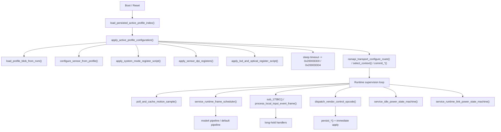
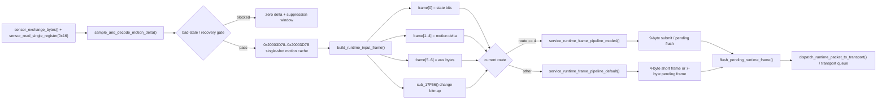

# `Ninjutso Sora V3` 滑鼠韌體架構與行為分析

> [!IMPORTANT]
> <sub><strong>逆向聲明：</strong>本報告僅供合法的互通性研究、防禦性安全分析、教學、資料保存，以及裝置所有人或經授權者在維修與維護時參考使用；不授權未經許可的刷寫、再散布、規避、侵權或其他違法用途，相關第三方權利仍歸各自權利人所有。</sub>

## 家族選用說明

`Ninjutso Sora V3` 可視為採用原相客製主控與原相客製感測器的高階無線電競滑鼠韌體代表樣本，適合作為觀察原相客製方案在韌體分層、感測器腳本套用、執行期組幀與無線 `transport` 組織方式上的參考對象。

---

## 0. 文件說明

### 0.1 目標

本報告重點回答以下問題：

- 韌體的 `ROM` 層與 `RAM runtime` 層如何分工
- `profile` 如何被載入、拆分並落到執行期映像
- 感測器運動資料如何從原始取樣一路走到最終執行期幀與 transport 發包
- 廠商私有命令、狀態回應封包、除錯讀窗入口位於何處，其執行模型為何
- `System Mode`、`LOD`、optical 相關設定、`report rate` 在韌體中的真實實作分別是什麼
- 哪些邏輯屬於真正的軟體行為，哪些只是感測器暫存器腳本

### 0.2 樣本資訊

| 項目 | 內容 |
| --- | --- |
| 廠商 / 型號 | `Ninjutso Sora V3` |
| 韌體包名 / 映像名 | `sora-v3_mouse_pid57360_ver_ae1609.bin` |
| 韌體版本 | `ver_ae1609` |

---

## 1. 韌體總體框架

### 1.1 架構結論與系統定位

從目前 `IDA` 資料庫中已恢復出的呼叫邊界、狀態佈局與 `ramapi_*` thunk 關係來看，這份韌體應被理解為一套由 `ROM` 主導的雙層執行架構，而不是單層裸機主循環，也不是 `RTOS` 式多工系統。

其核心結論可先概括為四點：

1. `ROM` 不是只負責上電初始化。它持續負責設定載入、模式套用、運動樣本門控、執行期組幀、傳送策略與功耗監督。
2. `RAM` 不是完整的業務層。它更像由 `ROM` 呼叫的 runtime / transport 執行面，承接 route、context、鏈路收發與部分高頻通道邏輯。
3. 整個系統圍繞 `active profile` 運轉。`profile` 不只是持久化紀錄，它同時決定感測器腳本、執行期映像、route 選擇與狀態回應封包內容。
4. 所謂「模式」主要透過暫存器腳本、route / context 與影子狀態實作，而不是透過獨立的軟體演算法框架實作。

可將目前樣本的架構定位總結如下：

| 維度 | 目前樣本表現 | 直接證據 |
| --- | --- | --- |
| 系統形態 | `ROM` 主導策略層，`RAM` 承接 transport / runtime | `0x3B6C..0x3CD4` 一組 `ramapi_*` thunk；`ROM` 內仍保留 `build_runtime_input_frame()`、`apply_*()`、`service_*power*()` |
| 並行組織 | 週期服務例程 + 共享狀態塊 + 短臨界區保護 | `sensor_exchange_bytes()`、`sample_and_decode_motion_delta()`、`persist_*()` 一類流程都帶有明顯共享狀態保護 |
| 資料面主鏈 | 取樣、門控、快取、組幀、route 分流、transport 橋接 | `sample_and_decode_motion_delta()` -> `poll_and_cache_motion_sample()` -> `build_runtime_input_frame()` -> `service_runtime_frame_pipeline_*()` |
| 控制面主鏈 | host 命令 / 裝置端長按 -> 持久化 -> 立即套用 -> 回應封包 | `dispatch_vendor_control_opcode()`、`persist_*()`、`apply_*()`、`emit_*()` |
| 監督面主鏈 | idle / sleep / runtime / link 聯合監督 | `service_idle_power_state_machine()`、`service_active_transport_timeout()`、`service_sleep_transition_timeout()`、`service_runtime_link_power_state_machine()` |
| 執行風格 | 以暫存器腳本、狀態映像與 route 選擇為中心 | `apply_system_mode_register_script()`、`apply_lod_and_optical_register_script()`、`normalize_report_rate_setting_for_route()` |

本章後續展開時，應始終把它視為一套「`ROM` 負責策略與整形，`RAM` 負責執行與承載」的系統。若把它誤讀成「`ROM` 只做啟動，`RAM` 全權接管」，就會直接誤判本樣本最重要的工程結構。

### 1.2 三平面、七層拆解

從工程角度來看，目前韌體最適合按「三平面、七層」理解，而不是按「若干孤立模組」理解。三條平面分別是控制平面、資料平面與監督平面；七個層次則給出了這些平面的真實落點。

| 平面 | 層次 | 主要職責 | 代表函式 / 物件 |
| --- | --- | --- | --- |
| 控制平面 | 持久化與映像層 | 讀取 `active profile`、載入 `profile blob`、維護按鍵塊與 scalar 塊映像 | `load_persisted_active_profile_index()` `0x8D58`、`load_profile_blob_from_nvm()` `0xA1E8`、`persist_*()`、`sub_11994()`、`sub_119F4()` |
| 控制平面 | 設定套用層 | 將邏輯設定翻譯為感測器腳本、`DPI`、`LOD`、route / context | `configure_sensor_from_profile()`、`apply_sensor_dpi_registers()` `0xF1C8`、`apply_system_mode_register_script()` `0x1022C`、`apply_lod_and_optical_register_script()` `0xEF38` |
| 控制平面 | 命令與裝置端入口層 | 接收 host 命令、處理板載長按、生成狀態回應封包 | `dispatch_vendor_control_opcode()` `0xDAF4`、`handle_*_transport()`、`handle_*_checksum()`、`process_local_input_event_frame()` `0x4EBC` |
| 資料平面 | 取樣與解碼層 | 與感測器進行序列交換、讀取 burst sample、辨識壞狀態並執行恢復序列 | `sensor_exchange_bytes()` `0x15AF6`、`sensor_read_single_register()` `0x15B5C`、`sample_and_decode_motion_delta()` |
| 資料平面 | 執行期整形層 | 快取運動資料、聚合非同步狀態位、生成固定 `7` 位元組執行期輸入幀 | `poll_and_cache_motion_sample()` `0x17B50`、`build_runtime_input_frame()` `0x1618C` |
| 資料平面 | 傳送策略與橋接層 | 依 route 決定短幀、完整幀、pending / flush 策略，並橋接到 `RAM transport` | `service_runtime_frame_pipeline_mode4()`、`service_runtime_frame_pipeline_default()`、`send_short_runtime_frame_over_link()` `0x166EA`、`flush_pending_runtime_frame()` `0x17FE6`、`ramapi_transport_*` |
| 監督平面 | 功耗與鏈路監督層 | 維護 idle、sleep、runtime / link 狀態，驅動恢復與逾時動作 | `service_idle_power_state_machine()` `0xC9A0`、`service_active_transport_timeout()` `0x52A8`、`service_sleep_transition_timeout()` `0x5334`、`service_runtime_link_power_state_machine()` `0x16AF0` |

這七層不是並列關係，而是嚴格串接。控制平面決定目前生效的設定映像與 route；資料平面根據這些映像決定如何取樣、整形與傳送；監督平面則在系統閒置、鏈路阻塞或功耗切換時改寫前兩者的執行邊界。

這裡最關鍵的工程結論是：`ROM` 並沒有在「設定完成」後退出主舞台。它持續扮演控制樞紐與資料整形層；`RAM` 的角色則更接近 transport 執行器與 context 執行面。

### 1.3 啟動裝配鏈：從 `NVM` 到可執行系統

啟動順序可歸納為以下八步：

1. 從目前 `ROM` 映像可直接看到 `0x3B6C..0x3CD4` 這組 `ramapi_*` thunk；而啟動後的設定與執行流程也確實持續呼叫這組入口，形成 `ROM` 呼叫 `RAM runtime` 的固定邊界。
2. `load_persisted_active_profile_index()` 從 `NVM key 0x2000` 讀取目前 `active profile index`。
3. `apply_active_profile_configuration()` 以該 index 為中心驅動整個裝配過程；若讀取值為 `0xFF`，則設定 `0x20003DD8/0x20003DD9/0x20003DDC/0x20003DDD` 並轉入預設回退分支。
4. `load_profile_blob_from_nvm()` 根據 profile index 選擇 `0x2001`、`0x2100` 或 `0x2200`，讀取固定長度 `57` 位元組紀錄。
5. `57` 位元組的 `profile blob` 在 `ROM` 中被拆成兩個執行期映像：
   - `0..27` -> `0x20004961..0x2000497C`，七組按鍵綁定塊。
   - `28..56` -> `0x20004922..0x2000493E`，scalar 設定塊。
6. `apply_active_profile_configuration()` 接著按固定順序執行韌體端套用：
   - `configure_sensor_from_profile()`
   - `apply_system_mode_register_script()`
   - `apply_sensor_dpi_registers()`
   - `apply_lod_and_optical_register_script()`
7. 感測器腳本套用完成後，再透過 `ramapi_transport_configure_route()`、`ramapi_transport_select_context()`、`ramapi_transport_commit_primary()`、`ramapi_transport_commit_secondary()` 提交目前 route / context。
8. 至此，系統進入「已物化的執行狀態」：後續 host 命令與裝置端長按不再重建整套系統，而是在這份活動映像上做增量修改。

這條啟動鏈的工程意義非常明確：

- 啟動階段的核心產物不是「若干初始化完成旗標」，而是一份已完成套用的 `active profile runtime image`。
- `profile` 在此同時決定三件事：感測器暫存器腳本、執行期映像內容、transport route / context。
- 後續執行階段的設定變更之所以能立即生效，是因為啟動時已經把持久化結構與執行期結構對齊。

### 1.4 執行期協同模型：控制平面、資料平面、監督平面

進入穩定執行後，目前樣本並不是一個「所有任務權重相同的大循環」。更準確地說，它由三條相互耦合的平面構成，每條平面都有自己的觸發源、共享狀態與輸出對象。

| 平面 | 觸發源 | 主鏈 | 關鍵共享狀態 | 最終輸出 |
| --- | --- | --- | --- | --- |
| 控制平面 | host vendor 命令、裝置端長按事件 | `dispatch_vendor_control_opcode()` / `handle_*()` / `process_local_input_event_frame()` -> `persist_*()` -> `apply_*()` | `0x20004921..0x2000493E`、`0x20004961..0x2000497C`、若干 shadow 狀態 | 暫存器腳本套用、route / context 更新、狀態回應封包 |
| 資料平面 | 調度週期、感測器可讀、運動快取狀態 | `service_runtime_frame_scheduler()` -> `poll_and_cache_motion_sample()` -> `build_runtime_input_frame()` -> `service_runtime_frame_pipeline_*()` | `0x20003D76..0x20003D82`、`0x20003C78`、`0x20003BD3..0x20003BE2` | 短幀、完整幀、pending frame、transport 提交 |
| 監督平面 | idle 計時、鏈路狀態、runtime 活動 | `service_idle_power_state_machine()`、`service_active_transport_timeout()`、`service_sleep_transition_timeout()`、`service_runtime_link_power_state_machine()` | `0x20003C5x`、`0x20003DDx`、transport 通道狀態 | idle / sleep 遷移、恢復動作、link / runtime 約束 |

三條平面的耦合方式如下：

- 控制平面負責「定義現在應該如何工作」。它修改 `profile` 映像、下發腳本、切換 route，並刷新狀態回應封包。
- 資料平面負責「把目前設定下的輸入事件轉成可傳送內容」。它不直接解釋 UI 語義，而是消費目前已生效的 `profile` 與 route。
- 監督平面負責「約束何時允許繼續工作」。它不產生業務資料，但會改變資料平面的推進條件與控制平面的可執行視窗。

總的來說，目前執行期可理解為以下閉環：

1. 控制平面把邏輯設定轉成執行期映像與暫存器腳本。
2. 資料平面基於這份映像抓取 motion sample，並組成固定 `7` 位元組執行期輸入幀。
3. 傳送策略層根據目前 route 選擇傳送分支：
   - `mode 4` 走 `service_runtime_frame_pipeline_mode4()`，更強調完整幀與在途狀態維護。
   - 其他 route 走 `service_runtime_frame_pipeline_default()`，更強調短幀直發與 pending full frame 補發。
4. 兩套傳送分支最終都透過 `ramapi_transport_*` 或 transport service 橋接到 `RAM runtime`。
5. 監督平面持續監視 idle、sleep 與 link 狀態，在必要時打斷、限流或恢復上述過程。

因此，本章真正的架構結論不是「韌體有幾條函式呼叫鏈」，而是：這是一套以 `profile` 映像為中心、以 `ROM` 整形為主導、以 route-aware transport 為執行末端的閉環系統。

### 1.5 關鍵狀態面與工程實作風格

要讀懂本樣本，光看函式名稱還不夠，還必須看「狀態面」如何組織。目前 `IDB` 中最重要的共享狀態塊如下：

| 位址區間 / 物件 | 角色 | 在架構中的意義 |
| --- | --- | --- |
| `0x20004921..0x2000493E` | `active profile` 與 scalar 設定映像 | 控制平面的中心狀態；`DPI`、`LOD`、`System Mode`、optical、`report-rate` 都從這裡取值 |
| `0x20004961..0x2000497C` | 七組按鍵綁定映像 | `profile blob` 拆分後的輸入定義區，是裝置端輸入與狀態回應封包的重要來源 |
| `0x20003C08..0x20003C28` | 裝置端事件 / 長按上下文 | 板載事件不會直接改寫暫存器，而是先進入這組執行期上下文，再走統一處理器 |
| `0x20003C78` | 固定 `7` 位元組執行期輸入幀緩衝 | 資料平面的統一輸出面；運動、狀態位與尾位元組都先在這裡裝配 |
| `0x20003BD3..0x20003BE2` | 非同步狀態位、尾位元組與組幀輔助狀態 | 說明目前樣本不只是傳 motion，`ROM` 還在維護非同步輸入的時序整形 |
| `0x20003D76..0x20003D82` | motion cache、樣本品質門控與恢復狀態 | 這裡把「取樣結果」「壞狀態檢測」「恢復動作」綁成一組連續狀態 |
| `0x20003D4C/0x20003D4D`、`0x20003D54/0x20003D55`、`0x20003D68/0x20003D69` | transport 佇列 / 通道狀態 | 連接 `ROM` 傳送策略層與 `RAM transport` 執行面的關鍵橋位 |
| `0x20003C5x`、`0x20003DDx` | idle / sleep / runtime 監督狀態 | 監督平面的主要狀態落點，用於控制進入低功耗與恢復入口 |

在這些狀態面的基礎上，目前樣本呈現出四個非常穩定的工程風格：

1. `ROM`、`RAM runtime` 與 `NVM` 不是三套彼此獨立的資料結構，而是圍繞少量密集狀態塊共享同一套活動映像。
2. 多處共享狀態敏感流程都會顯式進入短臨界區，因此 `profile` 載入、壞狀態恢復序列與部分持久化寫回都帶有明顯的時序保護痕跡。
3. 目前已確認的主要設定項遵循統一範式：修改目前活動映像，必要時回寫持久化，再對目前有效 profile 立即執行 `apply_*()`，而不是要求整機重啟。
4. 本樣本中的「模式」真實實作通常是三件事的組合：暫存器腳本、route / context 選擇、影子狀態更新；不要把它誤讀成獨立的軟體演算法模組。

綜合以上結構，可將本樣本的總體框架歸結為一句話：

`ROM` 負責把「設定語義」與「輸入事件」整形成系統可執行的執行期狀態，`RAM` 負責把這些狀態變成鏈路層可承載的 transport 行為；兩者之間由 `active profile` 映像與 `ramapi_*` 邊界穩定連接。

---

## 2. 設定系統與命令入口

目前 `ROM` 中能被直接閉合的，不是 `USB`、`BLE` 或空口協定的實體接入層，而是更上層的「控制面執行層」。這條執行層負責接收外部控制封包或板載輸入事件，把設定語義寫入作用中的設定映像，再把結果同步到暫存器腳本、`route/context`、執行態影子值與狀態回應封包。本章只討論這條已在 `IDA` 中擁有完整證據鏈的控制執行鏈，不對底層實體接收回呼與最終空口幀格式做超出 `IDB` 的推測。

### 2.1 控制面邊界與命令家族

目前樣本可直接確認的控制面入口可分為五類：

| 命令家族 | 主入口 | 已確認作用 | 直接輸出面 |
| --- | --- | --- | --- |
| 外層 `vendor control` 包裝層 | `dispatch_vendor_control_opcode()` `0xDAF4` | 依 `packet[0]` 分發外層 opcode；已見 `24`、`34`、`35`、`37`、`39`、`42`、`43`、`64`、`65`、`66` | 內部 runtime 封包、暫時性回應封包、傳輸狀態鎖存 |
| 內部 runtime 執行層 | `dispatch_runtime_packet_to_transport()` `0xD6D4` | 統一解釋內部 opcode；先嘗試 fast-path ring，失敗再走 slow-path 解釋器 | `RAM transport` 回呼、狀態幀構造、route 切換 |
| `checksum` 協定家族 | `handle_report_rate_setting_request_checksum()` `0x6E84`、`handle_system_mode_setting_request_checksum()` `0x6EE6` 等 | 與 transport 家族共享設定套用邏輯，但回應封包格式改為 `checksum guarded frame` | `0x0A 0x40` 標頭格式狀態幀 |
| 板載事件家族 | `process_local_input_event_frame()` `0x4EBC` | 處理板載 `8` 位元組事件幀，驅動長按控制邏輯，並繼續投遞到 transport 執行鏈 | `DPI` / `System Mode` / route 相關控制鏈 |
| 工程除錯讀窗家族 | `handle_read_amb_cmd()` `0xC52C`、`handle_read_reg_cmd()` `0xC588` | 直接讀取目標視窗並構造 vendor reply | `0x04 0x80` 標頭格式 reply |

這一分層很關鍵。對目前樣本而言，真正穩定的分析對象不是「某條鏈路從哪裡收到封包」，而是「收到封包後如何進入統一執行層」。從 `IDA` 證據來看，控制系統的核心在 `dispatch_vendor_control_opcode()`、`dispatch_runtime_packet_to_transport()`、各個 `handle_*()` 設定處理器，以及 `0x200049xx` 活動映像；這已足以重建設定面的總體架構。

### 2.2 外部命令如何進入統一執行層

外部控制封包進入統一執行層時，首先經過 `dispatch_vendor_control_opcode()` `0xDAF4`。這個函式處理的是「外層協定」，不是最終設定語義本身。它使用 `packet[0]` 作為外層 opcode，對已確認的若干命令家族進行第一層拆包。

其執行模型可概括為四步：

1. 讀取外層 opcode，決定目前封包屬於直接執行、執行後回應，或狀態鎖存類分支。
2. 對大多數設定類分支，去掉前 `3` 位元組包裝後，把 `packet + 3` 與 `packet[2]` 作為內部 payload 與長度傳給 `dispatch_runtime_packet_to_transport()`。
3. 對 `42`、`43`、`66` 這類「執行後需要立刻整理返回內容」的命令分支，先讓 runtime 執行層消費 payload，再透過 `sub_DF74()` 與 `sub_141A()` 抽取結果並組織回覆。
4. 對 `65` 這條分支，不直接進入常規設定處理器，而是更新 `0x20003A74`、`0x20003A76`，並與 `0x20003A78` 比較，表現為一類獨立的傳輸狀態鎖存 / 分段狀態處理分支。

真正的統一執行層是 `dispatch_runtime_packet_to_transport()` `0xD6D4`。它內部有清晰的雙分支結構：

- 第一層是 fast-path。當 `!bypass_fast_path` 且 `0x20003B90`、`0x20003B94`、`0x20003B88`、`0x20003B6A` 等佇列條件滿足時，函式會在臨界區內更新 ring 狀態，並透過 `enqueue_runtime_fast_path_payload()` 直接把封包送入快取佇列。
- 第二層是 slow-path 解釋器。當 fast-path 不成立時，函式依 `packet[0]` 解釋 runtime opcode；目前已確認可見的內部 opcode 至少包括 `16`、`24`、`34`、`35`、`37`、`39`、`40`、`41`、`42`、`43`。

slow-path 中有幾類行為尤其重要：

- `24`、`34`、`37` 這類控制項會進入 `enqueue_runtime_deferred_callback()` 這類統一 deferred-callback 入佇列節點。
- `40`、`41`、`42`、`43` 這組內部 opcode 會呼叫 `sub_DF48()`、`MEMORY[0x20003BC0]`、`MEMORY[0x20003BC4]`、`MEMORY[0x20003BC8]`、`MEMORY[0x20003BCC]` 等執行時回呼入口，再經 `build_runtime_transport_reply_frame()` 組裝成 transport 可傳送內容。
- `39` 是一條明確影響 route 的控制分支：函式先呼叫 `open_runtime_transport_session_from_packet(packet + 1, packet_len, 39, 536886116)`，在條件滿足時再執行 `ramapi_transport_configure_route(1, 5, 0)`、`ramapi_set_run_state_code(1)` 與 `sub_3B48(1)`。

這一層的工程意義在於，它明確區分了「外層協定 opcode」與「內部 runtime opcode」。前者決定封包如何拆解與歸類，後者決定真正的控制語義如何套用。把這兩層混在一起，會直接導致對命令表結構與狀態回應封包鏈的誤讀。

### 2.3 設定項執行流水線

目前樣本的設定執行並不是「收包後各寫各的」。從已確認的處理器實作來看，它遵循一條高度統一的套用流水線：

`入口收包 / 裝置端事件 -> persist_*() 更新作用中的設定映像並寫回目前 profile -> normalize / apply -> 需要時刷新 route/context 或 shadow -> 送出狀態回應`

這條流水線最重要的價值，不是讓設定「可保存」，而是讓設定「立即變成目前執行態」。下面列出本章已完全核實的幾條代表性執行鏈。

| 設定項 | 主處理器 | 已確認的套用鏈 | 工程結論 |
| --- | --- | --- | --- |
| `System Mode` | `handle_system_mode_setting_request_transport()` `0x72AA` | `persist_system_mode_setting(a1[1], *a1)` -> 依 host 值 `0/1/2` 選擇 `apply_system_mode_register_script(0/2/4)` -> `set_active_system_mode_shadow(a1[1])` | host 寫入值不是最終腳本值；中間存在 `0/2/4` 的腳本映射層 |
| `report-rate` | `handle_report_rate_setting_request_transport()` `0x7230` | 根據 `sub_BD2C()` 在 `persist_report_rate_setting_for_link_mode()` 與 `persist_report_rate_setting_for_wireless_mode()` 之間二選一 -> `normalize_report_rate_setting_for_route()` -> `ramapi_publish_run_state_code()` -> 需要時 `ramapi_transport_configure_route()` / `ramapi_transport_select_context()` / `ramapi_transport_commit_*()` | `report-rate` 不是單欄位，而是與目前 route 綁定的設定家族 |
| `LOD` | `handle_lod_setting_request_transport()` `0x7118` | `persist_lod_setting(packet[1], *packet)` -> `apply_lod_and_optical_register_script(packet[1], ...)` | `LOD` 改動會直接觸發光學相關暫存器腳本重套用 |
| `active optical flag` | `handle_active_optical_flag_request_transport()` `0x70DC` | `persist_active_optical_engine_flag(a1[1], *a1)` -> `apply_lod_and_optical_register_script(MEMORY[0x20004932], ...)` | 該旗標與 `LOD` 共用同一類光學腳本套用鏈 |
| `staged optical mode` | `handle_staged_optical_engine_setting_request_transport()` `0x71EC` | 先 `get_system_mode_setting()`；僅當結果不等於 `2` 時才執行 `persist_staged_optical_engine_mode(a1[1], *a1)`，隨後呼叫 `sub_11CF0(4, 268454107, 0x4000, 1)` | 這是一個受 `System Mode` 約束的階段式設定，不是隨時都能套用 |

`checksum` 變體與 transport 變體共享同一套核心套用邏輯，但尾部動作並不完全相同：

- `handle_report_rate_setting_request_checksum()` `0x6E84` 同樣先持久化、再歸一化，但尾部會先執行 `clear_pending_vendor_slot(16)`，再經 `sub_C284()` 與 `ramapi_publish_run_state_code()` 更新執行態，最後在需要時做 route 切換。
- `handle_system_mode_setting_request_checksum()` `0x6EE6` 也會先 `persist_system_mode_setting()`，再按 `0/2/4` 選擇腳本；與 transport 版本相比，目前可見實作中沒有單獨出現 `set_active_system_mode_shadow()` 這一步。

裝置端板載事件也匯入同一控制面。`process_local_input_event_frame()` `0x4EBC` 會讀取 `0x20003D1D` 所代表的事件碼，在確認事件有效後依序呼叫 `handle_dpi_stage_hold_event()`、`sub_CCF0()`、`handle_system_mode_hold_event()`，隨後再決定是立即進入 `ramapi_transport_can_poll_channel()` 分支，還是把事件繼續排入 transport。也就是說，host 命令與板載長按不是兩套獨立系統，它們在進入真正的應用層之前已經收斂到同一條控制鏈。

因此，本章最重要的結構結論是：設定系統的核心不是 opcode 表本身，而是 `persist_*()`、`apply_*()`、`ramapi_transport_*()` 與 `0x200049xx` 活動映像之間的協同。只要這條鏈閉合，設定就會被立即物化為目前執行態。

### 2.4 狀態回傳與回應封包封裝

目前樣本存在三套不同用途的回應封包面：transport 狀態幀、`checksum guarded` 狀態幀，以及工程除錯使用的 vendor reply。三者共享同一份設定映像，但封裝標頭、觸發入口與使用場景不同。

先看 transport 狀態回傳。目前已確認的狀態發射器如下：

| 狀態項 | transport 發射器 | opcode | 取值來源 | 異常修正 |
| --- | --- | --- | --- | --- |
| `report-rate` | `emit_report_rate_status_transport()` `0x6854` | `6` | `get_effective_report_rate_setting()` | 返回的是 route 歸一化後的有效值 |
| `LOD` | `emit_lod_status_transport()` `0x674C` | `8` | `get_lod_setting()` | 若值為 `0xFF`，立即改寫為 `1` 並持久化 |
| `System Mode` | `emit_system_mode_status_transport()` `0x68B0` | `12` | `get_system_mode_setting()` | 若值大於 `2`，立即改寫為 `0`，並呼叫 `persist_system_mode_setting()` 與 `set_active_system_mode_shadow()` |
| `staged optical mode` | `emit_staged_optical_engine_mode_transport()` `0x681C` | `50` | `get_staged_optical_engine_mode()` | 目前未見額外修正 |
| `active optical flag` | `emit_active_optical_flag_transport()` `0x66D4` | `58` | `0x2000493E` | 若值大於 `1`，立即改寫為 `0` 並持久化 |

這組 transport 狀態幀都透過 `emit_transport_frame_via_channel_table()` 發出，本質上是「目前活動映像的對外回傳」。

第二套是 `checksum guarded frame`。其統一構造器是 `build_checksum_guarded_frame()` `0x4B64`，已確認行為如下：

- 固定標頭位元組為 `0x0A 0x40`。
- 第三個位元組寫入業務 opcode。
- 對 payload 做簡單累加和，並把結果寫入幀頭。
- 總長度按 `payload_len + 4` 計算，但會截斷到 `15`。
- 輸出長度保存在 `0x20003DFC`。

目前已確認的 `checksum` 狀態構造器包括：

- `build_report_rate_status_frame()` `0x6C30`，opcode `6`，payload 為 `[2, effective_rate]`
- `build_lod_status_checksum()` `0x6B64`，opcode `8`，payload 為 `[2, lod]`，並在 `lod == 0xFF` 時回寫 `1`
- `build_system_mode_status_checksum()` `0x6CC4`，opcode `12`，payload 為 `[2, system_mode]`，並在值越界時回寫 `0`
- `build_active_optical_flag_checksum()` `0x6AD4`，opcode `58`，payload 為 `[2, flag]`，並在值越界時回寫 `0`

第三套是 vendor reply。其統一構造器是 `build_vendor_reply_buffer()` `0x4D94`，已確認格式如下：

- 輸出緩衝位於 `0x200039EC`
- 固定標頭位元組為 `0x04 0x80`
- 第 `3` 位元組為 `reply_type`
- 若有 payload，則拷貝到標頭之後
- 總長度固定寫為 `payload_len + 3`

這套 vendor reply 主要服務於工程除錯讀窗入口：

- `handle_read_amb_cmd()` `0xC52C` 執行 `copy_amb_payload_bytes()` -> `build_vendor_reply_buffer(3, payload, len)` -> `clear_pending_vendor_slot(3)`
- `handle_read_reg_cmd()` `0xC588` 執行 `copy_reg_window_bytes()` -> `build_vendor_reply_buffer(1, payload, len)` -> `clear_pending_vendor_slot(2)`

從工程視角來看，這三套回應封包面的共同點非常明確：它們並不各自維護一份獨立狀態，而是統一回讀 `0x200049xx` 活動映像，再用不同封裝格式對外表達。因此，回應封包體系的本質不是「協定花樣很多」，而是「同一份執行態被多個出口複用」。

### 2.5 執行期映像、持久化與延遲寫回

設定系統能成立，前提是作用中的設定映像組織穩定。目前樣本已確認的關鍵設定落點如下：

| 位址 | 已確認角色 | 直接證據 |
| --- | --- | --- |
| `0x20004930` | 無線側 `report-rate` 槽位 | `persist_report_rate_setting_for_wireless_mode()`、`normalize_report_rate_setting_for_route()`、`get_effective_report_rate_setting()` |
| `0x20004931` | 鏈路模式 `report-rate` 槽位 | `persist_report_rate_setting_for_link_mode()`、`normalize_report_rate_setting_for_route()`、`get_effective_report_rate_setting()` |
| `0x2000493A` | 另一條 route 相關 `report-rate` 槽位 | `persist_report_rate_setting_for_link_mode()`、`normalize_report_rate_setting_for_route()`、`get_effective_report_rate_setting()` |
| `0x20004932` | `LOD` 目前值 | `persist_lod_setting()`、`apply_lod_and_optical_register_script()` |
| `0x20004935` | `System Mode` 目前值 | `persist_system_mode_setting()`、`get_system_mode_setting()` |
| `0x2000493D` | `staged optical mode` | `persist_staged_optical_engine_mode()`、`get_staged_optical_engine_mode()`、`sample_and_decode_motion_delta()` |
| `0x2000493E` | `active optical flag` | `persist_active_optical_engine_flag()`、`emit_active_optical_flag_transport()`、`build_active_optical_flag_checksum()`、`apply_lod_and_optical_register_script()` |

這些位址說明了兩個關鍵事實。

第一，活動映像是「語義化欄位集合」，不是一塊無意義 blob。`System Mode`、`LOD`、`active optical flag`、`staged optical mode` 與 `report-rate` 都能追到真實的執行態落點。

第二，`report-rate` 在本樣本中是典型的 route-aware 設定家族，而不是單位元組開關。`normalize_report_rate_setting_for_route()` `0x7414` 會根據目前鏈路條件與 `sub_BD2C()` / `sub_3C08(0)` 的判斷，分別改寫 `0x20004930`、`0x20004931`、`0x2000493A`，並返回供 `ramapi_publish_run_state_code()` 使用的執行態碼值。也就是說，UI 上看到的「回報率」在韌體裡實際綁定的是「設定值 + route 選擇 + 執行態碼」這一整套聯動關係。

單欄位寫回流程也很統一。`persist_system_mode_setting()`、`persist_lod_setting()`、`persist_active_optical_engine_flag()`、`persist_staged_optical_engine_mode()`、`persist_report_rate_setting_for_wireless_mode()`、`persist_report_rate_setting_for_link_mode()` 都遵循同一種模板：

1. 先更新 `0x200049xx` 活動映像。
2. 進入短臨界區。
3. 按 profile 選擇對應 `NVM key`。
4. 呼叫 `sub_F634()` 寫入單欄位。
5. 失敗時使用 `0x20003E77` 計數重試，最多 `3` 次。

除了單欄位立即寫回，目前樣本還保留了明確的 dirty-slot 增量寫回機制。`mark_profile_dpi_stage_dirty_descriptor()` `0x117C4` 會把一個 `5` 位元組 `DPI stage descriptor` 子塊寫入 `0x20004BAE + 5 * index`，同時把 `0x20004BC2 + index + 7` 對應 slot 置髒。隨後 `service_profile_incremental_dirty_writeback()` `0x9A90` 使用 `0x20003E76` 作為「繼續掃描」總旗標，`0x20003E78` 作為目前 dirty slot 游標，逐槽尋找待寫項並分派寫回：

- `case 0..6` 走 `sub_F634()`，每個 dirty slot 寫回 `4` 位元組，目標 key 隨目前 profile 變化
- `case 7..10` 分別轉到 `persist_profile_dpi_stage0_value()`、`persist_profile_dpi_stage1_value()`、`persist_profile_dpi_stage2_value()`、`persist_profile_dpi_stage3_value()` 這四條專用 `DPI stage` 寫回例程
- `case 11` 從 `0x20004922` 取 `1` 位元組 `dpi_stage_count`，再透過 `sub_F634()` 寫回
- 每次寫回成功後都會清掉對應 dirty 旗標，並重新拉起掃描狀態

這說明目前韌體並不只依賴「收到命令就立即寫一個欄位」的簡單模型，而是同時實作了面向多子項設定塊的 staged writeback 機制。

此外，還能確認兩條整塊提交流程：

- `sub_11994()` 在臨界區內呼叫 `sub_FF8C()`，把一個 `28` 位元組塊寫到按 profile 選擇的 `0x2001`、`0x2100`、`0x2200`
- `sub_119F4()` 同樣在臨界區內呼叫 `sub_FF8C()`，把一個 `29` 位元組塊寫到按 profile 選擇的 `0x201D`、`0x211C`、`0x221C`

因此，本樣本的持久化層至少同時存在三種粒度：單欄位寫回、髒子塊寫回、整塊 profile 寫回。控制面的工程成熟度，恰恰體現在這三種粒度能夠共存而不互相衝突。

### 2.6 除錯讀窗與章節邊界

`handle_read_amb_cmd()` 與 `handle_read_reg_cmd()` 的存在，說明目前樣本內建了明確的工程除錯讀窗能力。但這兩條讀窗命令的職責非常單純：讀取視窗、組成 reply、清 pending slot。它們不會觸發 `persist_*()`、`apply_*()`、`ramapi_transport_configure_route()` 這類設定套用動作，因此不應與正常使用者設定命令混為一談。

綜合本章全部證據，可將目前控制面概括為一句話：

這套韌體把「設定語義」集中寫入 `0x200049xx` 活動映像，再透過 `persist_*()`、`apply_*()`、`ramapi_transport_*()` 與多種狀態回應封包把這份映像物化為真實執行態。對本樣本而言，真正的架構中心不是某一張命令字表，而是這份活動映像及其周圍的執行鏈。

---

## 3. 感測器運動資料流轉流程

本章只討論運動資料面，也就是「感測器一拍原始樣本如何進入 `ROM`、如何被門控、快取、裝幀，再如何交給 route-aware 傳送策略」。目前 `IDB` 已足以把這條鏈閉合到 `sub_1776A()` 這一層，但運動中斷源、最終 `RAM transport` 內部調度與空口複用細節仍不在本章討論範圍內。

### 3.1 資料面總覽

從目前 `ROM` 可直接確認的資料面主鏈如下：

`sub_15702()` / `sub_15730()` -> `poll_and_cache_motion_sample()` -> `sample_and_decode_motion_delta()` -> `consume_cached_motion_sample_*()` -> `build_runtime_input_frame()` -> `service_runtime_frame_scheduler()` -> `service_runtime_frame_pipeline_mode4()` / `service_runtime_frame_pipeline_default()` -> `send_short_runtime_frame_over_link()` / `flush_pending_runtime_frame()` / `sub_1776A()`

這條鏈不是「讀到座標就直接發」。它分成六個職責層：

| 層次 | 關鍵函式 | 關鍵狀態 / 緩衝 | 負責的問題 |
| --- | --- | --- | --- |
| 取樣事務層 | `sensor_exchange_bytes()` `0x15AF6`、`sensor_read_single_register()` `0x15B5C`、`sample_and_decode_motion_delta()` `0x17B9C` | 感測器串列暫存器視窗、`0x20003D80..0x20003D82`、`0x2000493D` | 如何從感測器取回一拍原始資料，並判斷這一拍是否可用 |
| 單拍快取層 | `poll_and_cache_motion_sample()` `0x17B50`、`consume_cached_motion_sample_for_mode4()` `0x17B34`、`consume_cached_motion_sample_for_runtime_frame()` `0x17B66` | `0x20003D76..0x20003D7B` | 一拍樣本只解碼一次，後續由不同消費者統一取用 |
| 組幀整形層 | `build_runtime_input_frame()` `0x1618C` | `0x20003BD3..0x20003BE2`、`0x20003BDF`、`0x20003BE1`、`0x20003C78` | 把運動增量與非同步狀態位拼成固定 `7` 位元組 runtime frame |
| 調度層 | `service_runtime_frame_scheduler()` `0x169FC` | `0x20003C74`、`0x20003C5C` | 決定何時立即組幀、何時週期驅動、何時進入哪條傳送流水線 |
| `mode 4` 傳送流水線 | `service_runtime_frame_pipeline_mode4()` `0x16800` | `0x20003C4C..0x20003C4E`、`0x20003DE6`、`0x20003DEB` | 維護完整 `9` 位元組幀的 prepare / stage / submit 狀態機 |
| 預設傳送流水線 | `service_runtime_frame_pipeline_default()` `0x16940`、`send_short_runtime_frame_over_link()` `0x166EA`、`flush_pending_runtime_frame()` `0x17FE6` | `0x20003DEE`、`0x20003DED`、`0x20003D68`、`0x20003D69` | 在「短幀立即發」與「完整幀延後補發」之間折衷 |

這套架構有兩個直接後果：

1. 運動樣本與傳送行為之間至少隔了三層狀態面，韌體不是拿到座標就立刻交給下層。
2. `route` 不只影響空口出口，也會影響快取消費方式、組幀邏輯以及後續傳送策略。

### 3.2 取樣事務：一拍樣本如何被讀出並判定可用

#### 3.2.1 感測器位元組交換層

底層感測器事務由 `sensor_exchange_bytes()` `0x15AF6` 完成。該函式的行為已經非常清楚：

1. 將傳輸長度限制在 `7` 位元組以內。
2. 將長度寫入 `0x5002C008` 對應的硬體控制位。
3. 將 `tx_buf` 中待發送的位元組逐個寫入硬體視窗。
4. 透過 `0x5002C001` 啟動一次事務。
5. 輪詢 `0x5002C00B` 直到硬體完成。
6. 再把接收視窗中的位元組逐個拷回 `rx_buf`。

因此，`sensor_exchange_bytes()` 不是抽象的「讀感測器」黑盒，而是一條可直接看見暫存器操作的序列交換例程。

`sensor_read_single_register()` `0x15B5C` 則是它的單暫存器包裝器：呼叫方傳入暫存器號與 `1` 位元組輸出緩衝，函式內部使用 `1` 位元組事務呼叫 `sensor_exchange_bytes()` 完成讀取。

#### 3.2.2 樣本解碼與壞狀態恢復

真正把一拍原始樣本轉成運動增量的核心函式是 `sample_and_decode_motion_delta()` `0x17B9C`。它把「取樣事務」「壞狀態門控」「恢復寫序列」「輸出打包」四件事放在一起。

按執行順序，可將此函式拆成以下步驟：

1. 準備固定的 `7` 位元組 burst 讀命令。
2. 呼叫 `sensor_exchange_bytes()` 取回本拍 burst 資料。
3. 額外呼叫 `sensor_read_single_register(22, ...)` 讀取 `register 22`。
4. 從 burst 返回值中提取本拍品質位元組、狀態位元組與運動位。
5. 根據品質門檻、`staged optical mode` 與恢復狀態，決定是否進入壞狀態處理。
6. 若判定為壞狀態，執行一段顯式的恢復寫序列。
7. 若處於恢復抑制視窗，則繼續壓制本拍輸出。
8. 只有在「樣本門控位有效且本拍未被抑制」時，才把結果寫成 `4` 位元組 `delta` 輸出。

目前可直接確認的輸入與狀態關係如下：

| 來源 | 在目前函式中的真實作用 |
| --- | --- |
| burst 返回值第 `0` 位元組的 `bit7` | 本拍運動輸出的總門控位；若沒有此位，本拍 `delta` 直接清零 |
| burst 返回值中的 `4` 個核心位元組 | 構成最終 `4` 位元組運動 `delta` |
| burst 品質位元組 `BYTE2(v17)` | 與 `0x2000493D` 一起決定壞狀態門檻 |
| `register 22` 讀值 | 參與恢復抑制視窗判斷，並回寫到 `0x20003D82` |
| `0x20003D7F` | 為真時對兩個 `16-bit` 半字做 `x2` 放大 |
| `0x2000493D` | `staged optical mode`，直接參與壞狀態門檻選擇 |

壞狀態判定條件也可直接從偽碼中寫清：

- `is_sensor_bad_state_latched()` 返回真。
- 品質位元組大於等於 `0xC0`，且 `0x2000493D == 1`。
- 品質位元組大於等於 `0xE0`，且 `0x2000493D == 0` 或 `0x2000493D == 2`。
- 並且目前 `0x20003D80 == 0`，亦即尚未進入恢復已執行狀態。

滿足上述條件後，函式會進入臨界區並執行以下恢復寫序列：

```c
0x7F = 0
0x09 = 0x5A
0x54 = 0x01
0x7F = 4
0x1D = 0x77
0x7F = 0
0x09 = 0x00
```

恢復動作套用後，三個狀態位會被更新：

| 位址 | 作用 |
| --- | --- |
| `0x20003D80` | 標記恢復序列已經執行 |
| `0x20003D81` | 標記恢復抑制視窗有效 |
| `0x20003D82` | 記錄最近一次 `register 22` 的值 |

之後函式還會進入一個明確的抑制視窗判斷：

- 若 `0x20003D81` 有效，且舊值 `0x20003D82` 或目前 `register 22` 值有任一小於 `0x50`，則本拍繼續抑制輸出。
- 只有當兩次讀值都不再低於 `0x50` 時，函式才清除 `0x20003D81`，允許後續樣本恢復正常輸出。

最終輸出條件非常嚴格：只有在門控位有效且本拍未被抑制時，函式才返回 `1` 並寫出 `4` 位元組運動結果；否則會把 `out_delta[0..3]` 清零並返回 `0`。

這項實作說明，目前樣本在感測器層面並非完全依賴硬體黑盒。至少在「壞狀態檢測 -> 執行恢復 -> 臨時抑制輸出 -> 恢復放行」這段鏈路上，`ROM` 明確承擔了主動控制職責。

需要維持的邊界也同樣明確：

- 目前只能確認「某個品質位元組參與門檻判斷」，不能據此給出沒有證據支持的 datasheet 命名。
- 目前只能確認「恢復序列被執行」，不能再進一步把它命名成某個公開行銷術語。
- 目前可以確認輸出是兩個 `16-bit` 量構成的 `4` 位元組 `delta`，但在沒有實機對照的前提下，不能強行定義每個原始位段的公開座標語義。

### 3.3 單拍快取：樣本只解碼一次，後續統一消費

取樣事務層的輸出不會直接被多個消費者反覆讀取，而是先進入一組非常緊湊的單拍快取狀態：

| 位址 | 作用 |
| --- | --- |
| `0x20003D76` | 最近一次 `sample_and_decode_motion_delta()` 的返回狀態 |
| `0x20003D77` | cache valid 旗標 |
| `0x20003D78..0x20003D7B` | 最近一拍的 `4` 位元組運動 `delta` |
| `0x20003D7F` | 輸出放大控制位 |
| `0x20003D80..0x20003D82` | 恢復執行旗標、恢復抑制旗標、最近一次 `register 22` 值 |

快取填充函式 `poll_and_cache_motion_sample()` `0x17B50` 的邏輯極其直接：

1. 先讀取 `0x20003D77`。
2. 若快取已有效，直接返回，不再訪問感測器。
3. 若快取無效，呼叫 `sample_and_decode_motion_delta((uint8_t *)0x20003D78)`。
4. 把返回值同時寫到 `0x20003D76` 與 `0x20003D77`。

這意味著 `0x20003D77` 在目前實作裡既是「快取是否有效」的旗標，也是「上一拍是否成功產生有效 `delta`」的快速鏡像。

快取消費端也完全對稱：

- `consume_cached_motion_sample_for_mode4()` `0x17B34`
- `consume_cached_motion_sample_for_runtime_frame()` `0x17B66`

這兩個函式都會：

1. 拷貝 `0x20003D78..0x20003D7B` 到呼叫方提供的 `dst`。
2. 把 `0x20003D77` 清零。
3. 返回 `0x20003D76`。

這說明目前快取採用的是「單拍一次性消費」模型，而不是多讀共享快取。誰先消費，誰就負責把 valid 清掉；下一次真正的新樣本必須重新經過 `poll_and_cache_motion_sample()`。

#### 3.3.1 已確認的取樣觸發點

`IDA` 中目前可直接確認的快取預取入口有兩條：

- `sub_15702()` `0x15702`
- `sub_15730()` `0x15730`

兩者都顯式呼叫 `poll_and_cache_motion_sample()`，差別在於後續動作不同：

- `sub_15730()` 只是簡單預取一拍樣本，然後呼叫 `sub_1569A()` 返回。
- `sub_15702()` 則在預取後繼續進入 `sub_16A84()`，嘗試走一條更輕的 runtime 傳送分支。

因此，目前資料面的取樣觸發不只存在「定時調度器到點就現讀感測器」這一種形態。更準確地說，樣本通常會先被預取進快取，再由後續組幀器決定何時消費。

### 3.4 執行期輸入幀裝配器：`7` 位元組內部幀如何生成

#### 3.4.1 幀結構與返回語義

`build_runtime_input_frame()` `0x1618C` 是目前資料面的中心裝配器。它的輸出固定落在 `0x20003C78` 一帶，對外形成統一的 `7` 位元組 runtime input frame。

從函式尾部可直接確認幀結構如下：

| 幀偏移 | 來源 | 說明 |
| --- | --- | --- |
| `frame[0]` | `0x20003BE2 | (2 * 0x20003BD5) | 0x20003BD4` | 狀態位聚合結果 |
| `frame[1..4]` | 快取中的 `4` 位元組運動 `delta` | 運動負載 |
| `frame[5]` | `0x20003BDF` | 尾位元組 `0` |
| `frame[6]` | `0x20003BE1` | 尾位元組 `1` |

這個函式的返回值同樣有明確語義，不應被簡單看成布林值：

| 返回值 | 含義 |
| --- | --- |
| `0` | 本輪沒有新的運動，也沒有新的狀態變化 |
| `1` | 本輪只有狀態位變化，沒有新的運動 `delta` |
| `2` | 本輪有新的運動 `delta`，但沒有額外狀態變化 |
| `3` | 本輪既有新的運動，也有新的狀態變化 |

這是由函式內部變數 `v3` 的組合方式直接決定的：運動變化寫入 `bit1`，狀態變化寫入 `bit0`。

#### 3.4.2 運動部分如何被裝入幀

函式先處理運動部分：

1. 若呼叫參數 `mode == 2`，則直接把 `frame[1..4]` 清零。
2. 否則先讀取目前 `route`：`sub_15816()` 返回 `0x20003839`。
3. 若 `route == 4`，呼叫 `consume_cached_motion_sample_for_mode4(&frame[1])`。
4. 否則呼叫 `consume_cached_motion_sample_for_runtime_frame(&frame[1])`。
5. 若快取消費函式返回非零，則把返回旗標的運動位計入 `v3`。

也就是說，裝配器本身不負責重新取樣，它只消費快取。真正的分工是「上游負責把樣本放進快取，裝配器負責按目前 route 取走快取並併入幀」。

#### 3.4.3 狀態位不是簡單拼接，而是一套整形狀態機

`build_runtime_input_frame()` 最複雜的部分不是運動資料，而是狀態位整形。目前能直接看到三類輸入源：

1. 一組 route-aware 原始狀態讀取器：
   - `sub_15A98()`：從 `0x5002C028..0x5002C02B` 讀取遮罩後的 `4` 位元組狀態。
   - `sub_15A2C()`：同樣讀取該狀態視窗，但帶有 `0x20003ADC` 的單次清除門控。
2. 一組基於事件號的邊沿 / 逾時檢測器：
   - `sub_15F88(..., 24, 8000)`
   - `sub_15F88(..., 7, 8000)`
   - `sub_15F88(..., 8, 30000)`
   - `sub_15F88(..., 3, 30000)`
   - `sub_15F88(..., 4, 30000)`
3. 一組內部持久狀態位與計時器：
   - `0x20003BD3`
   - `0x20003BD4`
   - `0x20003BD5`
   - `0x20003BD6`
   - `0x20003BD8`
   - `0x20003BDA`
   - `0x20003BDC`
   - `0x20003BE2`

這些狀態不是平鋪存放，而是組織成兩條並行的非同步通道，每條通道都包含：

- 主使能位
- 目前輸出 latch
- 一段保持 / 拉伸計時器
- 一段次級逾時計時器
- 一個「第二階段」狀態位

以結構而非實體含義描述，這套狀態機完成了四件事：

1. 新邊沿出現時，不一定立即清掉，而是先進入保持階段。
2. 保持階段持續過久時，會切到第二階段狀態。
3. 輸入消失時，也不一定立刻釋放，而是可能先進入一個次級逾時視窗後再清。
4. 某些附加位會同步寫入 `0x20003BE2`，最終併入 `frame[0]`。

目前可直接確認的兩個時間閾值是：

- `0x36B0`：兩條主保持計時器使用的閾值。
- `0x7530`：兩條次級逾時計時器使用的閾值。

它們都透過 `sub_16556()` 的返回值累加，因此本質上是「以系統節拍推進的狀態保持器」，而不是純靜態旗標位。

#### 3.4.4 強制傳送與狀態快照

函式尾部還存在一條明確的「強制傳送」邏輯：

1. 若 `0x20003E70` 置位，先把它清零。
2. 再比較本次生成的 `frame[0]` 與 `0x20003E72` 中的舊快照。
3. 若兩者不同，則直接返回 `v3 | 1`。

這說明目前韌體不只會因為真實的新運動或新邊沿而傳送，還允許某個上層控制入口透過 `0x20003E70/0x20003E72` 強制把狀態變化位重新拉起。

總結這個裝配器的本質：它輸出的不是「裸運動資料」，而是「運動 `delta` + 非同步狀態整形結果 + 兩個尾位元組」的統一內部幀。真正複雜的地方不在座標打包，而在非同步狀態如何被保持、延遲釋放與強制重發。

### 3.5 調度器：何時組幀，何時進入哪條傳送流水線

`service_runtime_frame_scheduler()` `0x169FC` 是目前資料面的總調度器。它有三種工作方式，而不是一種固定週期輪詢：

| 入口模式 | 條件 | 行為 |
| --- | --- | --- |
| 立即組幀模式 | `force_mode != 0` | 直接呼叫 `build_runtime_input_frame((runtime_input_frame_t *)0x20003C78, 7, force_mode)` |
| 立即跑 pipeline 模式 | `force_mode == 0 && run_pipeline != 0` | 立刻讀取目前 `route`，轉入 `service_runtime_frame_pipeline_mode4()` 或 `service_runtime_frame_pipeline_default()` |
| 週期服務模式 | 兩者都為 `0` | 累加 `sub_16556()` 到 `0x20003C74`，達到 `0x3E80` 後再按目前 `route` 進入對應 pipeline |

因此，調度器並不是單一的「定時器到點就跑一次」。它同時支援：

- 被外部呼叫方立即要求生成一幀。
- 被外部呼叫方立即要求跑一次傳送流水線。
- 在無顯式請求時按內部節拍週期服務。

這三種模式的存在，正是目前韌體能同時兼顧「高頻運動資料面」與「非同步狀態變化即時性」的原因。

### 3.6 傳送策略：`mode 4` 與預設 route 為何完全不同

#### 3.6.1 `mode 4`：完整 `9` 位元組幀優先的狀態機

`service_runtime_frame_pipeline_mode4()` `0x16800` 的結構明顯重於預設分支。它不是簡單地「發現變化就發一幀」，而是維護一套小型傳送狀態機。

函式首先檢查目前鏈路佇列狀態：

- 使用 `sub_15E4E(..., 0x20003D68, 0x20003D69)` 判斷下層是否已有在途事務。
- 若鏈路忙且 `sub_164F8()` 返回真，則只標記本輪有推進並清零 `0x20003C5C`。
- 若鏈路忙且 `sub_164F8()` 返回假，則直接退出，等待下一輪。

在鏈路空閒時，函式再轉入 `0x20003C4C` 驅動的狀態機。目前可直接確認的狀態欄位有：

| 位址 | 作用 |
| --- | --- |
| `0x20003C4C` | `mode 4` 流水線主狀態 |
| `0x20003C4D` | 一條輔助準備旗標 |
| `0x20003C4E` | 目前 staging 長度 |
| `0x20003DE6` | 待發完整 runtime 負載區 |
| `0x20003DEB` | 與 pending 判定耦合的附加禁止位 |

主狀態為 `0` 時，才會真正構造新資料：

1. 呼叫 `build_runtime_input_frame((runtime_input_frame_t *)0x20003C78, 7, 0)`。
2. 呼叫 `sub_17F56(0x20003C78, 0, 5, 0)` 刷新變化位圖與相關映像。
3. 若組幀返回值非零，則說明本輪有新運動或新狀態。
4. 即使組幀返回 `0`，只要 `0x20003DE6` 非零，或 `is_runtime_frame_pending()` 為真且 `0x20003DEB == 0`，也會繼續進入完整幀提交流程。
5. 滿足上述任一條件後，先 `mark_runtime_frame_pending(0)`，再把 `0x20003DE6` 中的 `7` 位元組負載複製到 `0x20003C8F/0x20003C91` 一帶的 `9` 位元組 staging 幀，最後呼叫 `sub_1776A(..., 9)` 提交。

也就是說，`mode 4` 的核心不是「總是完整幀」，而是「存在一套圍繞完整 `9` 位元組 staging 幀組織的準備、複製、提交狀態機」。它優先保證完整幀語義，而不是優先壓縮鏈路佔用。

函式中還存在兩條顯式的 staging / submit 分支：

- 一條分支會透過 `copy_runtime_frame_to_tx_buffer()` 與 `sub_1776A(..., 9)` 直接提交完整幀。
- 另一條分支則會先把完整幀複製到 `0x20004808` 一帶的暫存區，並把長度記錄到 `0x20003C4E`，等待後續狀態 `2` 再提交。

這正是 `mode 4` 比預設分支重得多的地方：它顯式維護「準備好了但尚未真正發出」的完整幀狀態。

#### 3.6.2 預設 route：短幀優先，完整幀延後補發

`service_runtime_frame_pipeline_default()` `0x16940` 的策略完全不同。它更像一條節流傳送鏈，而不是完整幀狀態機。

執行順序可精確寫成：

1. 先用 `sub_15E4E(..., 0x20003D68, 0x20003D69)` 判斷下層是否在忙。
2. 若鏈路忙：
   - 若 `sub_164F8()` 返回真，則記一次推進並清零 `0x20003C5C`。
   - 若 `sub_18308()` 允許，則呼叫 `flush_chunked_runtime_transport_frame()` 繼續把前面沒發完的片段拼完。
3. 若鏈路空閒：
   - 呼叫 `build_runtime_input_frame((runtime_input_frame_t *)0x20003C78, 7, 0)`。
   - 呼叫 `sub_17F56(0x20003C78, 0, 5, 0)` 更新變化位圖。
   - 若返回值為 `0`，說明本輪沒有新內容，直接進入 `flush_pending_runtime_frame()`。
   - 若返回值非零，繼續判斷本輪到底應立即發短幀，還是把完整幀掛起。

這一步的分流條件非常重要：

- 若返回值左移 `31` 後非零，也就是運動位存在，函式會 `mark_runtime_frame_pending(1)`。
- 若運動位不在，但 `frame[0]` 非零，也就是狀態位存在，函式同樣會 `mark_runtime_frame_pending(1)`。
- 只有在「沒有運動位，且 `frame[0]` 也為空」的那條輕分支裡，函式才會從 `0x20003C79..0x20003C7C` 取出 `4` 位元組負載，呼叫 `send_short_runtime_frame_over_link(payload, 4, 3)` 先發一幀短包。

換句話說，預設分支對「值得保留完整語義的內容」與「可以先短發的內容」做了明確區分：

- 運動或者非空狀態位：先標記 pending，後面補完整幀。
- 輕量短載荷：可以直接打成短幀先發。

函式最後無條件呼叫 `flush_pending_runtime_frame()`，把前面掛起的內容在視窗允許時補出去。

#### 3.6.3 `pending` / `flush` / `short frame` 三個輔助機制

這條預設傳送鏈能成立，依賴三個小但關鍵的輔助機制。

第一，完整幀 pending 旗標：

- `mark_runtime_frame_pending()` `0x17D34` 直接寫 `0x20003DEE`。
- `is_runtime_frame_pending()` `0x17D3A` 直接讀 `0x20003DEE`。

第二，另一條延遲傳送旗標：

- `sub_17D28()` `0x17D28` 直接寫 `0x20003DED`。

第三，統一的掛起幀沖刷函式：

`flush_pending_runtime_frame()` `0x17FE6` 的行為非常清楚：

1. 若 `0x20003DED` 置位，先清它，再透過 `sub_15E74(..., 8)` 送出一幀待發的 `8` 位元組資料。
2. 否則若 `0x20003DEE` 置位，先清它。
3. 接著讀取目前 `route`：
   - 若 `sub_15816() == 4`，呼叫 `copy_runtime_frame_to_tx_buffer(...)`，走完整 runtime 幀複製流程。
   - 否則呼叫 `send_short_runtime_frame_over_link(..., 7, 3)`，把快取的 `7` 位元組 runtime frame 交給短幀發送器。

短幀發送器 `send_short_runtime_frame_over_link()` `0x166EA` 也不是簡單 `memcpy`。它會：

1. 在 payload 前加 `2` 位元組頭，頭格式固定為 `[2, frame_class]`。
2. 根據目前鏈路狀態，選擇「直接提交」或「先排隊後沖刷」。
3. 必要時呼叫 `flush_chunked_runtime_transport_frame()`，把先前積累的片段補齊成完整 `9` 位元組提交。

而 `flush_chunked_runtime_transport_frame()` `0x16644` 明確使用 `0x20003C4F` 作為已累積長度狀態：當累積到 `9` 位元組時，呼叫 `sub_1776A(..., 9)` 完成一次完整提交。

因此，預設分支中的「短幀」並不等於「永遠單包單發」。在底層佇列壓力合適時，它仍然可能被拼接成更大的實際提交塊。

### 3.7 裝置端事件如何併入同一資料面

雖然本章主題是運動資料，但目前樣本中的執行期資料面並不只承載 motion。`process_local_input_event_frame()` `0x4EBC` 明確表明，板載 `8` 位元組事件幀也會進入同一條 runtime 行為鏈。

目前可直接確認的行為是：

1. 函式讀取並驗證裝置端事件幀。
2. 以 `0x20003D1D` 作為目前事件碼，依序呼叫：
   - `handle_dpi_stage_hold_event()`
   - `sub_CCF0()`
   - `handle_system_mode_hold_event()`
3. 再根據目前通道狀態，決定是直接走 transport，還是暫時排隊。

這至少說明一件事：目前裝置的 runtime 傳送面並不只對「運動座標」負責，也對板載狀態變化負責。運動增量與裝置端事件最終會在同一套 runtime 幀 / transport 策略層匯合。

### 3.8 本章結論與邊界

綜合目前 `IDA` 證據，可將本章壓縮成四條最重要的結構結論：

1. 運動樣本必須先通過 `sample_and_decode_motion_delta()` 的壞狀態門控與恢復抑制，才有資格進入後續傳送鏈。
2. 樣本進入 `0x20003D76..0x20003D7B` 後，遵循單拍一次性消費模型；裝幀器只消費快取，不直接重新取樣。
3. `build_runtime_input_frame()` 的複雜度主要來自非同步狀態整形，而不是運動座標打包本身。
4. 最終傳送策略強烈依賴 `route`：`mode 4` 偏向完整 `9` 位元組幀狀態機，預設分支偏向短幀優先與完整幀延後補發。

本章也需要明確幾個分析邊界：

- 目前 `ROM` 尚未恢復出具名的 motion ISR 或更上游中斷入口，因此不能把取樣起點寫成某個已知中斷名稱。
- 目前可以完整描述到 `sub_1776A()` 這一層，但 `RAM transport` 內部如何真正排隊、調度與發射，不在目前 `ROM` 可見範圍內。
- 目前可以準確描述狀態機、緩衝區與門檻邏輯，但不能憑推測把所有原始事件號與狀態位強行映射成公開產品術語。

---

## 4. 效能模式 / 特殊工作模式

本章只分析介面可見的兩組功能：

- `系統模式`：`高速`、`競技`、`競技+`
- `引擎演算法`：`Burst 關`、`Burst 開`

目前韌體對這兩組功能的實作，不是「五套彼此獨立的完整設定」，而是兩層疊加：

1. `configure_sensor_from_profile()` `0xE4B4` 負責感測器主 `bring-up`。它內部只有兩套完整主體：`NORMAL` 與 `BURST`。參數 `2` 對應的 `ULTRA` 並不是第三套獨立主體，而是進入 `NORMAL/ULTRA` 共用主體的一種內部選擇值。
2. `apply_system_mode_register_script()` `0x1022C` 在主 `bring-up` 完成後，再覆蓋一小組系統模式暫存器。`高速`、`競技`、`競技+` 的主要差異集中在這一層。

### 4.1 本章討論範圍

本章只回答三個問題：

1. `系統模式` 三檔各自寫了哪些暫存器。
2. `Burst 關 / 開` 在感測器主 `bring-up` 中分別改了哪些暫存器。
3. 這兩層設定疊加後，韌體內部實際形成哪幾種有效工作狀態。

本章不討論協定封裝、設定傳輸、狀態回讀、`LOD`、回報率或前端同步邏輯。

### 4.2 `系統模式`：`高速` / `競技` / `競技+`

`系統模式` 的持久化設定值位於 `0x20004935`。`apply_active_profile_configuration()` `0x11628` 與 `handle_system_mode_setting_request_transport()` `0x72AA` 都會把它映射成 `apply_system_mode_register_script()` `0x1022C` 的腳本選擇值。

三檔映射關係在反組譯中是直接可見的：

| 介面名稱 | `系統模式` 值 | 腳本選擇值 |
| --- | --- | --- |
| `高速` | `0` | `0` |
| `競技` | `1` | `2` |
| `競技+` | `2` | `4` |

這說明 `系統模式` 的工程本質不是「重新跑一遍完整感測器初始化」，而是「在主 `bring-up` 完成後追加一段很短的系統腳本」。

從 `apply_system_mode_register_script()` `0x1022C` 的反組譯順序寫入可直接還原三套腳本。

`高速` 對應腳本選擇值 `0`：

- `page0`：`0x30=0x00`，`0x34=0xA3`
- `page1`：`0x53=0x06`，`0x61=0x8A`，`0x62=0x27`，`0x64=0xCC`，`0x65=0xFF`，`0x66=0x2B`，`0x6D=0x1D`，`0x73=0x09`

`競技` 對應腳本選擇值 `2`：

- `page0`：`0x30=0x02`，`0x34=0xA3`
- `page1`：`0x53=0x26`，`0x61=0x8A`，`0x62=0x21`，`0x64=0xCC`，`0x65=0xFF`，`0x66=0x4B`，`0x6D=0x1C`，`0x73=0x49`

`競技+` 對應腳本選擇值 `4`：

- `page0`：`0x30=0x02`，`0x34=0xA3`
- `page1`：`0x53=0x26`，`0x61=0x8A`，`0x62=0x21`，`0x64=0xCC`，`0x65=0xFF`，`0x66=0x50`，`0x6D=0x1C`，`0x73=0x49`

按暫存器差異拆開看，`系統模式` 有兩個層次：

1. `高速` 與 `競技` 的差異是成組切換：`page0 0x30`、`page1 0x53`、`0x62`、`0x66`、`0x6D`、`0x73` 一起變化，說明這不是單暫存器微調，而是一套明確的模式腳本。
2. `競技+` 相比 `競技` 只再額外改動 `page1 0x66`，由 `0x4B` 提高到 `0x50`；其餘短腳本暫存器完全相同。

因此，若只看 `apply_system_mode_register_script()` 本身，`競技+` 不是一套全新腳本，而是「`競技` 腳本再提高一個關鍵參數位」的變體。

還可確認一個只出現在直接切換分支上的附加動作。`handle_system_mode_setting_request_transport()` `0x72AA` 在 `競技+` 分支上會先呼叫 `apply_system_mode_register_script(4)`，然後無條件繼續呼叫 `sub_FF60()`；`高速` 與 `競技` 分支只有在 `sub_7778() == 2` 時才會執行同一後處理。當前 `ROM` 只能把 `sub_FF60()` 定性為額外刷新 / 同步動作，但「`競技+` 比另外兩檔多一步固定後處理」這一點是確定的。

### 4.3 `引擎演算法`：`Burst 關` / `Burst 開`

`引擎演算法` 的核心不在短腳本，而在 `configure_sensor_from_profile()` `0xE4B4`。該函式內部存在明確除錯字串：

`setting = %d(0:NORMAL, 1:BURST, 2:ULTRA)`

結合 `0xE4FA` 的分支可確認：

- 參數 `1` 進入專用 `BURST` 初始化主體。
- 參數 `0` 與 `2` 進入同一套 `NORMAL/ULTRA` 共用初始化主體。

因此，介面裡的 `Burst 關 / 開` 只對應內部參數 `0` 與 `1`。參數 `2` 並不是這組介面的第三檔，而是由 `系統模式 == 競技+` 時在 `apply_active_profile_configuration()` `0x11628` 中強制傳給 `configure_sensor_from_profile()` 的內部值。

#### 4.3.1 主 `bring-up` 的公共初始化段

無論目前進入 `NORMAL/ULTRA` 還是 `BURST`，下列公共初始化段都相同：

- 起始頁選擇與總開關預設：`page0 0x06=0x40`
- `page0` 公共起始寫入：`0x09=0x5A`，`0x34=0x31`，`0x39=0x00`，`0x43=0x09`，`0x4B=0x12`，`0x4F=0x00`
- `page2` 公共起始寫入：`0x4C=0x01`，`0x16=0x20`，`0x11=0x1A`，`0x4C=0x00`，`0x0E=0xE0`，`0x6D=0xC0`，`0x6E=0xBD`，`0x74=0x9C`，`0x2B=0x18`，`0x33=0x30`，`0x73=0xAA`，`0x7A=0x40`

兩套初始化主體在 `page3` 的整塊參數也完全一致。按順序寫入結果如下：

```text
page3
0x2D=0x01, 0x0C=0xA0, 0x12=0x9C, 0x19=0x20, 0x1F=0x20, 0x30=0x40, 0x39=0x50,
0x3D=0x1C, 0x47=0x0A, 0x4B=0x0C, 0x54=0x89, 0x55=0x09, 0x56=0x04, 0x57=0x04,
0x5E=0x09, 0x5F=0x04, 0x38=0x23, 0x4C=0x00, 0x58=0x00, 0x7C=0x23, 0x63=0x14,
0x64=0x07, 0x66=0x07, 0x67=0x1C, 0x68=0x07, 0x69=0x08, 0x6A=0x07, 0x6B=0xA5,
0x6C=0x05, 0x6D=0xD5, 0x6E=0x35, 0x78=0x06, 0x35=0x01, 0x36=0x48, 0x37=0x48,
0x50=0x7E, 0x7D=0x50, 0x34=0x03, 0x3A=0x38, 0x41=0x20, 0x0A=0x9E, 0x10=0x9C,
0x01=0x05, 0x06=0x08, 0x18=0x18, 0x1E=0x16, 0x4D=0x07, 0x53=0x80, 0x5D=0x30,
0x51=0x2D, 0x24=0x6C, 0x25=0x24, 0x26=0x70, 0x27=0xB0, 0x29=0x04, 0x52=0x14,
0x2D=0x00
```

兩套初始化主體的公共收尾段也相同：

- `page0` 公共收尾寫入：`0x4F=0x0F`，`0x06=0x80`，`0x05=0x08`
- `page4` 公共收尾寫入：`0x17=0x68`，`0x18=0x5A`，`0x40=0xE4`，`0x41=0x03`，`0x69=0x10`，`0x6A=0x04`，`0x6B=0x08`，`0x6C=0x08`

這意味著 `Burst 關 / 開` 的主要差異，不在初始化序列的總體公共初始化段，而在少數幾段關鍵頁暫存器。

#### 4.3.2 `Burst 關` 對應的 `NORMAL` 初始化主體

當 `configure_sensor_from_profile()` 參數為 `0` 或 `2` 時，進入 `NORMAL/ULTRA` 共用初始化主體。相對上面的公共初始化段，其獨有寫入如下。

`page2` 差異暫存器組：

- `0x46=0x2C`
- `0x1A=0xA2`
- `0x1B=0xBD`

`page4` 第一段寫入塊：

- `0x6D=0x04`
- `0x73=0x01`
- `0x79=0x00`
- `0x7B=0x40`
- `0x60=0xFB`
- `0x6E=0x0E`
- `0x5F=0x88`
- `0x6F=0x40`
- `0x74=0x13`
- `0x75=0x40`
- `0x7A=0x14`

`page4` 第二段寫入塊：

```text
page4
0x01=0x24, 0x0B=0x10, 0x12=0x26, 0x14=0x4C, 0x22=0x48, 0x2B=0x03, 0x2C=0x08,
0x2D=0x34, 0x2E=0x12, 0x2F=0x10, 0x34=0x20, 0x35=0x18, 0x3A=0x03, 0x3C=0x50,
0x3D=0x40, 0x27=0x01, 0x02=0x7C, 0x03=0x7A, 0x23=0x22, 0x24=0x20, 0x25=0x0A,
0x26=0x01, 0x40=0x94, 0x41=0x01, 0x05=0x01, 0x39=0x07, 0x16=0x84, 0x1D=0x77,
0x31=0x5D, 0x0C=0x28, 0x0D=0x3C, 0x1C=0x2B, 0x30=0xC0, 0x1E=0xA0, 0x20=0x4C,
0x04=0x46, 0x08=0x0A, 0x09=0x14, 0x15=0x24, 0x1F=0x18, 0x28=0x11, 0x21=0x04,
0x32=0x18, 0x10=0x22, 0x29=0x80, 0x2A=0x20
```

這套初始化主體就是 `Burst 關` 的實際初始化主體，同時也是 `ULTRA` 在目前 `ROM` 中複用的初始化主體。

#### 4.3.3 `Burst 開` 對應的 `BURST` 初始化主體

當 `configure_sensor_from_profile()` 參數為 `1` 時，進入專用 `BURST` 初始化主體。相對公共初始化段，其獨有寫入如下。

`page2` 差異暫存器組：

- `0x1A=0x82`
- `0x1B=0x9D`
- `0x46=0x3C`

`page4` 第一段寫入塊：

- `0x6D=0x04`
- `0x73=0x01`
- `0x79=0x00`
- `0x60=0xFB`
- `0x6E=0x0E`
- `0x5F=0x88`
- `0x6F=0x30`
- `0x74=0x0F`
- `0x75=0x30`
- `0x7A=0x0F`
- `0x7B=0x30`

`page4` 第二段寫入塊：

```text
page4
0x01=0x24, 0x0B=0x10, 0x12=0x26, 0x14=0x4C, 0x22=0x48, 0x34=0x20, 0x35=0x18,
0x3A=0x03, 0x3C=0x50, 0x3D=0x40, 0x27=0x01, 0x02=0x7C, 0x03=0x7A, 0x23=0x22,
0x24=0x20, 0x25=0x0A, 0x26=0x01, 0x40=0x94, 0x41=0x01, 0x05=0x01, 0x39=0x07,
0x16=0x84, 0x1D=0x77, 0x31=0x5D, 0x0C=0x28, 0x0D=0x3C, 0x1C=0x2B, 0x30=0xC0,
0x1E=0xA0, 0x20=0x4C, 0x04=0x46, 0x08=0x0A, 0x09=0x14, 0x15=0x24, 0x1F=0x18,
0x28=0x11, 0x32=0x18, 0x10=0x22, 0x29=0x80, 0x2A=0x20, 0x00=0x05, 0x21=0x02,
0x2B=0x07, 0x2C=0x01, 0x2D=0x30, 0x2E=0x10, 0x2F=0x00
```

與 `NORMAL` 相比，`BURST` 的差異集中在三處：

1. `page2` 的 `0x1A`、`0x1B`、`0x46`
2. `page4` 第一段寫入塊的 `0x6F`、`0x74`、`0x75`、`0x7A`、`0x7B`
3. `page4` 第二段寫入塊的 `0x00`、`0x21`、`0x2B`、`0x2C`、`0x2D`、`0x2E`、`0x2F`

這說明 `Burst` 的實作並不是只改一個總開關，而是切換了一整組與感測器內部處理行為相關的頁暫存器。

#### 4.3.4 執行期運動壞狀態門檻

`sample_and_decode_motion_delta()` `0x17B9C` 也能確認 `引擎演算法` 對執行期取樣門控的直接影響。

函式會讀取 `0x2000493D`，也就是目前暫存的引擎演算法值，然後按該值選擇壞狀態門檻：

- 當 `0x2000493D == 1` 時，壞狀態判定門檻是 `BYTE2(sample) >= 0xC0`
- 當 `0x2000493D == 0` 或 `0x2000493D == 2` 時，壞狀態判定門檻是 `BYTE2(sample) >= 0xE0`

一旦進入壞狀態恢復分支，函式會執行固定恢復序列：

- `page0`：`0x09=0x5A`
- `page0`：`0x54=0x01`
- `page4`：`0x1D=0x77`
- `page0`：`0x09=0x00`

配套頁切換順序是 `0x7F=0 -> 0x7F=4 -> 0x7F=0`。這段程式碼能證明兩件事：

1. `Burst` 不只影響初始化腳本，也影響執行時壞狀態判定門檻。
2. 執行時門檻判斷讀取的是 `0x2000493D`，不是某個「最終實際生效模式」的統一影子值。

### 4.4 五種介面模式在韌體中的實際組合關係

把 `apply_active_profile_configuration()` `0x11628`、`configure_sensor_from_profile()` `0xE4B4`、`apply_system_mode_register_script()` `0x1022C` 與 `sample_and_decode_motion_delta()` `0x17B9C` 合起來，可把介面上的五種可見模式還原成如下執行關係。

| 介面組合 | 主 `bring-up` 參數 | 主 `bring-up` 初始化主體 | 追加系統腳本 | 目前可確認的關鍵差異 |
| --- | --- | --- | --- | --- |
| `高速 + Burst 關` | `0` | `NORMAL` | `selector 0` | `NORMAL` 初始化主體 + `高速` 短腳本 |
| `高速 + Burst 開` | `1` | `BURST` | `selector 0` | `BURST` 初始化主體 + `高速` 短腳本 |
| `競技 + Burst 關` | `0` | `NORMAL` | `selector 2` | `NORMAL` 初始化主體 + `競技` 短腳本 |
| `競技 + Burst 開` | `1` | `BURST` | `selector 2` | `BURST` 初始化主體 + `競技` 短腳本 |
| `競技+` | 強制 `2` | `NORMAL/ULTRA` 共用初始化主體 | `selector 4` | 初始化主體固定走 `ULTRA` 參數，短腳本固定為 `競技+` |

這裡最關鍵的結論有三條。

第一，`競技+` 會覆蓋 `Burst 關 / 開` 對主 `bring-up` 初始化主體的選擇權。`apply_active_profile_configuration()` `0x11628` 在讀到 `系統模式 == 2` 後，不再呼叫 `get_staged_optical_engine_mode()`，而是直接把參數 `2` 傳給 `configure_sensor_from_profile()`。

第二，`競技+` 的獨特性來自「兩層疊加」而不是單一來源：

1. 主 `bring-up` 參數被強制改為 `2`
2. 追加系統腳本固定切到 `selector 4`

也就是說，`競技+` 不是單純「比 `競技` 多寫一個暫存器」，也不是單純「等於 `ULTRA`」。它是「`ULTRA` 參數的主 `bring-up` + `競技+` 短腳本」的組合結果。

第三，`競技+` 仍然不是一條完全封閉的第三光學引擎鏈。原因是 `sample_and_decode_motion_delta()` `0x17B9C` 的壞狀態門檻仍然直接讀取 `0x2000493D`。因此：

- 在主初始化階段，`競技+` 會強制使用參數 `2`
- 在執行時壞狀態門控階段，韌體仍然可能繼續參考暫存的 `Burst` 選擇值

這就是為什麼目前 `ROM` 裡更準確的表述不是「五套獨立模式」，而是「`2` 套主 `bring-up` 初始化主體 + `3` 套系統短腳本 + `競技+` 對主 `bring-up` 的一次強制覆蓋」。

### 4.5 本章結論

基於目前 `IDA` 資料庫，可將本章壓縮為四條最終結論：

1. `系統模式` 負責追加系統短腳本，不負責完整感測器初始化；三檔實質上是 `selector 0 / 2 / 4` 三套短腳本。
2. `引擎演算法` 負責主 `bring-up` 初始化主體選擇；`Burst 關` 對應 `NORMAL`，`Burst 開` 對應 `BURST`，`ULTRA` 不是這組介面的第三檔。
3. `競技+` 的韌體本質是「強制 `configure_sensor_from_profile(2)` + `apply_system_mode_register_script(4)`」；它相對 `競技` 的短腳本差異僅明確落在 `page1 0x66`，但整體行為差異不只這一項。
4. 執行時壞狀態門檻仍直接讀取 `0x2000493D`，因此 `競技+` 雖然強制切入 `ULTRA` 參數初始化，但並沒有把 `Burst` 相關影響從整個運動處理鏈中完全抹掉。

---

## 5. 廠商獨有功能與韌體層運動 / 事件處理演算法

本章只討論目前 `IDA` 資料庫中可以嚴格落為執行時軟體行為的部分。純設定欄位、純暫存器腳本選擇、純持久化動作，不單獨當作「演算法」處理。

基於 `ROM` 目前實作，這份韌體在「運動 / 事件處理」上的軟體價值主要集中在三層：

1. `sample_and_decode_motion_delta()` 對單拍感測器樣本做可信性判定、異常恢復與輸出抑制。
2. `build_runtime_input_frame()` 把運動、GPIO 原始狀態與若干帶時間窗的邊沿事件合成為統一內部幀。
3. `service_runtime_frame_scheduler()` 與兩條 pipeline 決定該幀是立即發、拆短幀發，還是先掛起後補發。

另有一條獨立的板載 `8` 位元組事件鏈，用於承載 `DPI`、路由 / 回報率以及 `System Mode` 的長按處理。這條鏈不屬於前端協定層，而是裝置端輸入處理邏輯的一部分。

### 5.1 本章邊界與總體結構

| 鏈路 | 入口函式 | 直接輸出 | 關鍵狀態 |
| --- | --- | --- | --- |
| 運動樣本鏈 | `poll_and_cache_motion_sample()` `0x17B50` / `sample_and_decode_motion_delta()` `0x17B9C` | `0x20003D78..0x20003D7B` 的 `4` 位元組 delta 快取 | `0x20003D76`、`0x20003D77`、`0x20003D7F`、`0x20003D80..0x20003D82` |
| 執行時內部幀鏈 | `build_runtime_input_frame()` `0x1618C` | `0x20003C78` 起始的 `7` 位元組內部幀 | `0x20003BD3..0x20003BE2`、`0x20003E70`、`0x20003E72` |
| 傳送鏈 | `service_runtime_frame_scheduler()` `0x169FC` | `route == 4` 的 `9` 位元組提交幀，或預設分支的短幀 / 待發幀 | `0x20003C4C..0x20003C5C`、`0x20003C74`、`0x20003DEE`、`0x20003DED` |
| 板載事件鏈 | `sub_175BC()` `0x175BC` / `process_local_input_event_frame()` `0x4EBC` | 板載 `8` 位元組事件幀與三條長按處理器呼叫 | `0x20003D1C`、`0x20003D1D`、`0x20003C08..0x20003C24` |

從執行順序看，本章可還原為四條前後串接的執行鏈：

1. 週期任務或事件入口先呼叫 `poll_and_cache_motion_sample()`，確保本輪最多只消費一拍運動樣本。
2. `build_runtime_input_frame()` 從運動快取與裝置端輸入暫存器構造統一的 `7` 位元組內部幀。
3. 調度器根據目前 route 與鏈路空閒狀態，進入 `service_runtime_frame_pipeline_mode4()` 或 `service_runtime_frame_pipeline_default()`。
4. 另一條並行的板載 `8` 位元組事件鏈在 `sub_175BC()` / `process_local_input_event_frame()` 中驅動三個長按處理器，並透過 `flush_pending_runtime_frame()` 複用同一套待發機制。

這意味著本章討論的重點不是「複雜座標數學」，而是「樣本可信性控制、邊沿可見性維持、鏈路發送時機控制」。

### 5.2 運動樣本鏈：取樣、壞狀態門控與單拍快取

#### 取樣入口與快取邊界

`poll_and_cache_motion_sample()` 的邏輯非常直接，但它定義了整條運動鏈的消費語義：

- `0x20003D77` 是「目前快取是否有效」的唯一旗標。
- 若 `0x20003D77 == 0`，函式呼叫 `sample_and_decode_motion_delta((uint8_t *)0x20003D78)` 拉取一拍新樣本。
- 返回值同時寫入 `0x20003D76` 與 `0x20003D77`。也就是說，`0x20003D76` 保存最近一次解碼結果，`0x20003D77` 決定該結果是否仍可被消費。
- 目前資料庫裡它只有兩個直接呼叫點，分別位於 `0x1570C` 與 `0x15732`。這說明它是一個上游取樣快取節點，而不是複雜的多拍濾波器。

對應的兩個消費函式 `consume_cached_motion_sample_for_mode4()` `0x17B34` 與 `consume_cached_motion_sample_for_runtime_frame()` `0x17B66` 完全對稱：

- 都從 `0x20003D78..0x20003D7B` 拷出 `4` 位元組運動資料。
- 都在消費後清零 `0x20003D77`。
- 都返回 `0x20003D76`。

因此，這裡的快取語義是「單拍快取」，不是累積快取。一次成功取樣最多只會被目前輪次的一個邏輯分支消費一次。

#### `sample_and_decode_motion_delta()` 的真實職責

`sample_and_decode_motion_delta()` `0x17B9C` 做的事情比「讀一次感測器」多得多。按函式內實際順序拆開，完整流程如下：

1. 先透過 `sensor_exchange_bytes()` 發起一次批量交換。
2. 再透過 `sensor_read_single_register(0x16, ...)` 讀取附加狀態位元組。
3. 從接收快取中抽取兩個 `16` 位半字與兩個狀態位元組，準備生成 `4` 位元組 `delta`。
4. 在真正輸出前，對本次樣本執行壞狀態判定。
5. 若命中異常且尚未進入恢復態，則執行一段明確的暫存器恢復序列。
6. 恢復完成後，並不會立刻恢復輸出，而是再經過一個短暫的抑制視窗。
7. 只有當樣本頭部條件滿足，且目前不在抑制態時，才把 `delta` 寫入 `out_delta[0..3]`。

這說明該函式的核心職責是「讀樣本 + 判斷該樣本目前是否值得上報」，而不是單純的資料搬運。

#### 壞狀態判定與恢復寫序列

目前資料庫可以直接確認兩組壞狀態閾值，它們取決於 `0x2000493D` 的目前值：

- 當 `0x2000493D == 1` 時，只要狀態位元組 `BYTE2(v17) >= 0xC0`，就進入壞狀態判定分支。
- 當 `0x2000493D == 0` 或 `0x2000493D == 2` 時，閾值變為 `BYTE2(v17) >= 0xE0`。
- 另一路條件是 `is_sensor_bad_state_latched()` 非零。該條件與上述閾值條件並列，任何一路成立都可觸發恢復。

觸發條件成立後，若 `0x20003D80 == 0`，函式會在關中斷條件下執行以下寫序列：

1. `0x7F <- 0x00`
2. `0x09 <- 0x5A`
3. `0x54 <- 0x01`
4. `0x7F <- 0x04`
5. `0x1D <- 0x77`
6. `0x7F <- 0x00`
7. `0x09 <- 0x00`

這段序列來自 `0x17C22..0x17C56` 的實際反組譯，不是偽碼推測。序列執行後：

- `0x20003D80` 被置 `1`，表示恢復腳本已經打過一次。
- `0x20003D81` 被置 `1`，表示後續進入抑制視窗。

#### 恢復後的抑制視窗

恢復腳本不是結束條件，後面還有一層輸出門控：

- 本輪附加狀態位元組會寫入 `0x20003D82`。
- 如果 `0x20003D81` 仍然有效，函式比較「上一輪狀態位元組」與「目前讀回的暫存器 `0x16` 值」是否都達到 `0x50`。
- 只要兩者之一低於 `0x50`，局部抑制旗標 `v3` 就會被置位，本輪輸出被壓成全零。
- 只有當兩者都不再低於 `0x50`，函式才會清掉 `0x20003D81`，允許後續樣本重新透傳。

這條鏈路非常關鍵。它表明目前韌體不是「發現異常就立刻恢復、下一拍立刻繼續發」，而是顯式保留了一個恢復後的觀察視窗。

#### 輸出條件與 `x2` 放大開關

樣本通過壞狀態判定之後，還必須滿足另一個頭部條件 `v20 != 0` 才能真正輸出 `delta`。若 `v20 == 0`，函式直接把 `out_delta[0..3]` 清零返回。

當允許輸出時，還存在一個明確的數值變換開關：

- 若 `0x20003D7F != 0`，函式會把兩個 `16` 位半字各自乘 `2` 後再拆成 `4` 個位元組寫出。
- 若 `0x20003D7F == 0`，則按原值寫出。

這裡看不到「殘差池」「小數位累積回灌」或多拍平滑。能確認的只是單拍級別的 `x2` 放大。

#### 本節結論

運動樣本鏈可以精確概括為三件事：

1. 每輪最多取並消費一拍樣本。
2. 樣本在進入傳送鏈之前，先經過異常判定、恢復腳本與恢復後抑制視窗。
3. 目前樣本中不存在可確認的複雜座標演算法，真正重要的是「這一拍是否可信、何時允許重新出樣」。

### 5.3 執行時內部幀：狀態位機、邊沿拉伸與變化位圖

#### `build_runtime_input_frame()` 的輸出結構

`build_runtime_input_frame()` `0x1618C` 生成的是統一的內部輸入幀。目前資料庫可直接確認其結構如下：

| 位元組 | 來源 |
| --- | --- |
| `frame[0]` | `0x20003BE2 | (2 * 0x20003BD5) | 0x20003BD4` |
| `frame[1..4]` | 運動快取 `0x20003D78..0x20003D7B` |
| `frame[5]` | `0x20003BDF` |
| `frame[6]` | `0x20003BE1` |

函式返回值 `v3` 是一個兩位狀態：

- `bit0` 表示「本輪有狀態變化」。
- `bit1` 表示「本輪帶有新運動樣本」。

因此返回值的可觀察語義是：

- `0`：無運動、無狀態變化。
- `1`：僅狀態變化。
- `2`：僅運動。
- `3`：運動與狀態變化同時存在。

這不是外推，而是由函式內部 `v3 |= 1`、`v3 = 2` 的置位方式，以及後續 pipeline 對 `v3` 的分支邏輯共同確定的。

#### route 相關的輸入採集差異

該函式會先根據 `sub_15816()` 的結果區分 `route == 4` 與其他分支：

- 非 `4` 分支使用 `consume_cached_motion_sample_for_runtime_frame()` 讀取運動快取，再呼叫 `sub_15A98()` 讀取裝置端原始輸入暫存器。
- `route == 4` 分支使用 `consume_cached_motion_sample_for_mode4()` 讀取同一份運動快取，再呼叫 `sub_15A2C()` 讀取裝置端原始輸入暫存器。

`sub_15A98()` 與 `sub_15A2C()` 都會：

- 觸發 `0x5002C001 |= 0x02`。
- 從 `0x5002C028..0x5002C02B` 讀取 `4` 個位元組。
- 分別與 `0x20003ADF..0x20003AE2` 做遮罩。

兩者唯一明確的語義差異在於 `sub_15A2C()` 額外引入了一次性門控：

- 若 `0x20003ADC` 已經置位，它先清零該旗標，然後直接返回 `0`。
- 若本次成功讀取，則在結束前把 `0x20003ADC` 重新置為 `1`。

所以 `route == 4` 分支不是換了一套原始暫存器，而是在同一批原始輸入之上增加了單拍門控。

#### `sub_15F88()`：邊沿拉伸輔助器

`build_runtime_input_frame()` 大量呼叫 `sub_15F88()` `0x15F88`。這個函式是本章最關鍵的輔助器之一，因為它負責把瞬時輸入邊沿拉伸成「至少能被一幀看見」的狀態。

目前資料庫可確認的事件碼到輸出位映射如下：

| 事件碼 | 修改的 `frame[0]` 位 |
| --- | --- |
| `24` | `bit0` |
| `7` | `bit1` |
| `8` | `bit2` |
| `3` | `bit3` |
| `4` | `bit4` |

它內部使用了三組狀態：

- 目前鎖存狀態位 `0x20003BF0..0x20003BF4`
- 已對外發布的影子位 `0x20003BF5..0x20003BF9`
- 兩組計時器 `0x200047E0..` 與 `0x200047F4..`

邏輯要點如下：

1. 當某事件剛出現時，並不是立刻改 `frame[0]`，而是先進入一段進入計時。
2. 進入計時達到閾值後，才把相應狀態鎖存到 `0x20003BF0..0x20003BF4`。
3. 當源事件消失時，也不是立刻清零，而是進入另一組退出計時。
4. 只有當「目前鎖存位」與「已發布影子位」不一致時，才真正改動 `frame[0]` 並返回變化。

這就是典型的「邊沿拉伸 + 去瞬態」實作。它不是為了改變事件含義，而是為了保證短脈衝在傳送鏈擁塞時不會被完全漏掉。

#### 兩組主狀態機：`0x20003BD3`、`0x20003BD4`、`0x20003BD5`

除 `sub_15F88()` 外，`build_runtime_input_frame()` 自身還維護了兩組完全對稱的狀態機：

- 第一組輸出位是 `0x20003BD4`，計時器是 `0x20003BD6` 與 `0x20003BDA`。
- 第二組輸出位是 `0x20003BD5`，計時器是 `0x20003BD8` 與 `0x20003BDC`。
- 總狀態字是 `0x20003BD3`，其中可觀察到的狀態位至少包括 `0x01`、`0x02`、`0x04`、`0x08`、`0x10`、`0x20`。

這兩組狀態機都圍繞兩個閾值展開：

- `0x36B0`：主保持階段閾值。
- `0x7530`：釋放後延階段閾值。

從程式行為看，可以嚴格確認以下性質：

- 當輸入條件剛成立時，相應輸出位會被立即置 `1`，並進入活動態。
- 在輸入持續期間，活動態計時器累加到 `0x36B0` 前後，狀態機會在主活動態與擴展態之間轉換。
- 當輸入消失時，輸出位不會總是立即歸零；若已進入擴展態，還會進入一個釋放後延階段。
- 釋放後延階段由 `0x20003BDA` 或 `0x20003BDC` 計時，到達 `0x7530` 後才徹底退出。

這項實作解釋了為什麼某些內部狀態不會隨著原始輸入的單拍翻轉而立即抖動消失。

#### 強制上報快照與變化位圖

在最終寫回 `frame[0]`、`frame[5]`、`frame[6]` 之後，函式還會檢查 `0x20003E70`：

- 若 `0x20003E70 != 0`，則先清零該旗標。
- 再將本輪 `frame[0]` 與快照 `0x20003E72` 比較。
- 若兩者不同，則強制把「本輪有狀態變化」的返回位帶出來。

這意味著即便上層沒有檢測到新的原始輸入，內部也可以因為「快照不一致」而強制觸發一次狀態上報。

隨後，`sub_17F56()` `0x17F56` 會繼續把變化細化為位圖：

- 當 `a4 == 0` 時，把 `frame[1..4]` 複製到 `0x20003DE7..0x20003DEA` 對應的執行時影子區，整幀緩衝起點是 `0x20003DE6`。
- 當 `a4 != 0` 時，把 `frame[1..4]` 複製到 `0x20003DDF..0x20003DE2` 對應的板載事件影子區，整幀緩衝起點是 `0x20003DDE`。
- 它透過 `sub_17D40()` 計算新的變化位圖，並與 `0x20003E7D` 比較。
- 對每一個變化位，都會把位號寫入 `0x20003E7C`，然後呼叫 `sub_17E84(bit_index, 0xFF/0x00, dst)` 更新對應輸出描述。

這一步的意義不是再次組幀，而是把「哪些狀態位在本輪發生了跳變」顯式快取下來，供後續傳送策略決定用完整幀還是短幀。

#### 本節結論

目前韌體的內部幀構建不只是「把運動座標打包」。它同時完成了三件關鍵工作：

1. 把原始 GPIO 狀態轉換為帶時間窗的可發布狀態。
2. 把運動與非同步狀態統一映射到固定的 `7` 位元組內部格式。
3. 為後續傳送鏈生成可直接複用的變化位圖與影子緩衝。

### 5.4 傳送鏈：調度器、兩套 pipeline 與掛起幀 flush

#### 頂層調度器

`service_runtime_frame_scheduler()` `0x169FC` 是這條鏈的統一入口。它有三種工作模式：

1. `force_mode != 0` 時，立即呼叫 `build_runtime_input_frame((runtime_input_frame_t *)0x20003C78, 7, force_mode)`，只負責強制組幀。
2. `run_pipeline != 0` 時，直接根據 `sub_15816()` 的結果進入 `service_runtime_frame_pipeline_mode4()` 或 `service_runtime_frame_pipeline_default()`。
3. 其他情況下，先把 `sub_16556()` 的返回值累加到 `0x20003C74`，累計到 `0x3E80` 才執行一次 pipeline，然後把 `0x20003C74` 清零。

也就是說，這條傳送鏈並不是「主循環每圈都發」，而是「事件觸發 + 週期觸發」並存。

#### 預設 pipeline：短幀優先，完整幀後補

`service_runtime_frame_pipeline_default()` `0x16940` 的行為可拆成兩個階段。

鏈路忙時：

- 先用 `sub_15E4E(0x20003D64, ...)` 檢查底層是否仍有傳輸在飛。
- 若 `sub_164F8()` 返回非零，則把 `0x20003C5C` 清零並把本輪記為已處理。
- 再呼叫 `sub_18308()` 檢查是否可以繼續刷新拼包緩衝；若可以，則執行 `flush_chunked_runtime_transport_frame()`。

鏈路空閒時：

1. 呼叫 `build_runtime_input_frame((uint8_t *)0x20003C78, 7, 0)` 生成內部幀。
2. 呼叫 `sub_17F56(0x20003C78, ..., 5, 0)` 刷新變化位圖與執行時影子區。
3. 若 `build_runtime_input_frame()` 返回非零，則本輪至少有一種變化。
4. 之後再區分兩種傳送策略：
   - 若返回值的 `bit0` 置位，或者 `frame[0] != 0`，則呼叫 `mark_runtime_frame_pending(1)`，把 `0x20003DEE` 置 `1`，表示需要補發完整執行時幀。
   - 若返回值非零但 `bit0 == 0` 且 `frame[0] == 0`，則只取 `frame[1..4]`，呼叫 `send_short_runtime_frame_over_link(..., 4, 3)` 立即發送短幀。
5. 無論本輪是否先發短幀，函式最後都會呼叫 `flush_pending_runtime_frame()`。

這段邏輯很重要。它說明預設分支下並不是「只要有運動就一定發完整幀」。當本輪只是純運動、而狀態位位元組 `frame[0]` 又為零時，韌體會優先走 `4` 位元組短幀。

#### `route == 4` pipeline：顯式狀態機 + `9` 位元組提交

`service_runtime_frame_pipeline_mode4()` `0x16800` 明顯更重。它內部維護了一套顯式狀態機：

- `0x20003C4C`：主狀態
- `0x20003C4D`：預備旗標
- `0x20003C4E`：目前已暫存長度
- `0x20003C5C`：進度 / 清零標記

對應行為如下：

- `state == 0` 時，若 `sub_18308(0)` 允許提交，則先構建 `0x20003C78` 的 `7` 位元組內部幀，再呼叫 `sub_17F56(..., 5, 0)` 刷新變化位圖。
- 只要滿足以下任一條件，就會進入完整幀發送分支：
  - `build_runtime_input_frame()` 返回非零
  - `0x20003DE6` 非零
  - `is_runtime_frame_pending()` 為真且 `0x20003DEB == 0`
- 一旦進入該分支，就先執行 `mark_runtime_frame_pending(0)`，再把 `0x20003DE6` 起始的執行時影子幀搬到發送緩衝並提交。

`state == 1` 與 `state == 2` 則對應「先組出 `9` 位元組 staging，再等待底層可提交」的兩段式流程：

- 預備態會從 `0x20003C8F` 或 `0x20003C86` 一類 staging 緩衝中取出 `9` 位元組提交塊。
- 若底層此刻可以直接提交，就立刻走 `sub_1776A(..., 9)`。
- 若底層不允許直接提交，就先複製到 `0x20004808`，記錄長度到 `0x20003C4E`，隨後在 `state == 2` 時等待再次提交。

這條分支的設計目標非常明確：`route == 4` 下優先保證完整幀語義，而不是像預設分支那樣積極拆成短幀。

#### 掛起位與 `flush_pending_runtime_frame()`

這份韌體明確維護了兩個待發旗標：

- `mark_runtime_frame_pending()` `0x17D34` 負責寫 `0x20003DEE`，表示「有一份執行時幀待補發」。
- `sub_17D28()` `0x17D28` 負責寫 `0x20003DED`，表示「有一份板載 `8` 位元組事件幀待補發」。

`flush_pending_runtime_frame()` `0x17FE6` 的優先級也很明確：

1. 若 `0x20003DED != 0`，先清零該旗標，並把 `0x20003DDE` 起始的 `8` 位元組板載事件幀透過 `sub_15E74(..., 8)` 推到底層。
2. 否則若 `0x20003DEE != 0`，清零該旗標。
3. 然後根據目前 route 決定：
   - `route == 4` 時，呼叫 `copy_runtime_frame_to_tx_buffer(0x20003DE6)`。
   - 其他 route 時，呼叫 `send_short_runtime_frame_over_link(0x20003DE6, 7, 3)`。

這說明「完整幀掛起」與「板載事件掛起」共用一套 flush 入口，但板載 `8` 位元組事件幀優先級更高。

#### 短幀編碼器與分塊 flush

`send_short_runtime_frame_over_link()` `0x166EA` 負責把短幀塞進活動鏈路佇列。目前資料庫可直接確認：

- 所有短幀都會在 payload 前面加 `2` 位元組頭。
- 頭部固定為 `byte0 = 0x02`，`byte1 = frame_class`。
- 若 fast-path 可用，則直接走 `sub_1776A()`。
- 若 fast-path 不可用，則透過 `sub_15E74()` 入佇列。
- 入佇列後若佇列深度達到條件，還會主動呼叫 `flush_chunked_runtime_transport_frame()`。

`flush_chunked_runtime_transport_frame()` `0x16644` 則負責把多個小紀錄拼成一個完整提交塊：

- 只處理頭部為 `byte0 == 0x02` 且 `byte1 == 0x05` 的佇列紀錄。
- 長度為 `6` 的紀錄會把後 `4` 位元組資料附加到 `0x20003C98` staging 區。
- `0x20003C4F` 保存目前 staging 長度。
- 長度累加到 `9` 後，呼叫 `sub_1776A(0x20003C98, 9)` 一次性提交。

因此，預設分支中的「短幀」並不等於「永遠單包單發」。在底層佇列壓力合適時，它仍然可能被拼接成更大的實際提交塊。

#### 本節結論

傳送鏈的本質不是簡單的「組完幀就發」，而是一個明確的調度系統：

1. 頂層調度器控制何時進入 pipeline。
2. `route == 4` 與預設分支採用兩套不同的傳送策略。
3. `0x20003DEE` / `0x20003DED` 把「本輪來不及發」的內容顯式掛起。
4. 短幀分支還能繼續被底層拼包器重組。

### 5.5 板載 `8` 位元組事件鏈與三條長按處理器

#### 板載事件幀的兩條入口

目前資料庫裡，板載事件鏈至少有兩個直接入口：

- `sub_175BC()` `0x175BC`
- `process_local_input_event_frame()` `0x4EBC`

二者共享同一類裝置端事件緩衝，核心事件碼位於 `0x20003D1D`。

`sub_175BC()` 的作用更偏「裝置端構幀」：

1. 若底層通道空閒，則呼叫 `build_runtime_input_frame((runtime_input_frame_t *)0x20003D1D, 8, 0)` 生成板載 `8` 位元組事件幀。
2. 隨後呼叫 `sub_17F56(0x20003D1C, ..., 6, 1)`，把變化位圖寫入板載事件影子區。
3. 若 `build_runtime_input_frame()` 返回非零，則呼叫 `sub_17D28(1)`，把 `0x20003DED` 置位。
4. 再呼叫 `flush_pending_runtime_frame()`，讓板載事件幀沿統一 flush 入口下發。
5. 最後經由 `sub_18428()`、`sub_1841C()`、`sub_18440()`、`sub_18380()`、`sub_1844C()` 這些跳板繼續驅動後續處理。

`process_local_input_event_frame()` 則更偏「接收現成事件幀並分發」：

1. 先確認 `8` 位元組事件緩衝目前可讀。
2. 以 `0x20003D1D` 處的事件碼作為目前事件。
3. 依序呼叫三條長按處理器：
   - `handle_dpi_stage_hold_event(1, MEMORY[0x20003D1D])`
   - `sub_CCF0(1, MEMORY[0x20003D1D])`
   - `handle_system_mode_hold_event(1, MEMORY[0x20003D1D])`
4. 若通道可輪詢，則直接走 `sub_3B78()`；否則把 `0x20003D1C` 置 `1` 後呼叫 `ramapi_transport_enqueue_frame(..., 8)` 入佇列。

這說明板載長按功能並不是「上位機發命令改模式」，而是裝置端事件幀先觸發，再由韌體端處理器決定是否切換狀態。

#### 三條長按處理器的共同框架

`handle_dpi_stage_hold_event()`、`sub_CCF0()`、`handle_system_mode_hold_event()` 三者結構非常一致：

1. 先把來源旗標規整後寫入 `0x20003BFC`。
2. 對事件碼執行 `raw_event_code & 0x1F` 歸一化。
3. 用各自的「最近事件碼」狀態字判斷這次是否仍在追蹤同一事件。
4. 第一次命中目標事件時，置位各自的「已 armed」旗標，清零累計時間，並呼叫 `sub_FF78()`。
5. 後續輪詢中透過 `ramapi_get_hold_elapsed_ticks()` 累計保持時間。
6. 當累計值超過 `0x2DC6C0` 後，執行對應的模式切換動作。
7. 切換完成後，清除 `armed` 旗標與累計時間。

這套實作意味著：三類長按功能共享相同的「裝置端長按檢測框架」，差別只在目標事件碼與逾時後的動作。

#### `DPI` 長按處理器

`handle_dpi_stage_hold_event()` `0xCBE0` 只響應事件碼 `0x0A`。其關鍵狀態如下：

- 最近事件碼：`0x20003C09`
- 目前是否處於目標事件追蹤中：`0x20003C08`
- 已 armed 旗標：`0x20003BFF`
- 累計保持時間：`0x20003C1C`
- 目前 `DPI` stage shadow：`0x20003C03`

當長按逾時後，它執行的動作鏈是完全明確的：

1. `MEMORY[0x20003C03] = (get_active_dpi_stage() + 1) & 3`
2. `persist_active_dpi_stage(MEMORY[0x20003C03], get_active_profile_index())`
3. `get_dpi_value_for_stage(MEMORY[0x20003C03])`
4. `apply_sensor_dpi_registers(dpi_value_for_stage)`

這裡沒有額外的中間狀態機。它就是一個標準的「四檔輪換並立即寫感測器」長按切換器。

#### 路由 / 回報率長按處理器

`sub_CCF0()` `0xCCF0` 只響應事件碼 `0x12`。它是三條處理器中最複雜的一條，因為逾時後不僅改持久化欄位，還會直接重配 transport route。

關鍵狀態如下：

- 最近事件碼：`0x20003C0C`
- 目前是否處於目標事件追蹤中：`0x20003C0B`
- 已 armed 旗標：`0x20003C0A`
- 累計保持時間：`0x20003C20`

當逾時後，函式會先讀取 `ramapi_publish_run_state_code()`，再結合 `0x20003BFC` 與 `sub_3C08()` 計算新的內部 route 值 `v3`，隨後執行：

1. `ramapi_transport_configure_route(...)`
2. 按來源不同寫入持久化欄位：
   - 主分支寫 `persist_report_rate_setting_for_wireless_mode(...)`
   - 另一處分支寫 `persist_report_rate_setting_for_link_mode(...)`
3. 若 `0x20003BFC != 0`，則繼續執行 `ramapi_transport_select_context()` 與 `ramapi_transport_commit_primary()`。
4. 否則執行 `ramapi_set_run_state_code(1)`、`sub_3B48(1)`、`clear_pending_vendor_slot(16)`。
5. 最後呼叫 `sub_C284(v3)` 提交新的內部狀態。

其中 route 到持久化回報率槽位的映射是明確寫死的：

| 內部 route `v3` | 持久化值 |
| --- | --- |
| `1` | `0` |
| `4` | `4` |
| `5` | `3` |
| `6` | `2` |
| 其他 | `1` |

這條處理器的工程意義在於：目前韌體把「路由 / 回報率切換」設計成了一個裝置端長按事件，而不是單純修改某個 profile 欄位。

#### `System Mode` 長按處理器

`handle_system_mode_hold_event()` `0xCED4` 只響應事件碼 `0x1A`。其關鍵狀態如下：

- 最近事件碼：`0x20003C0F`
- 目前是否處於目標事件追蹤中：`0x20003C0E`
- 已 armed 旗標：`0x20003C0D`
- 累計保持時間：`0x20003C24`
- 目前系統模式 shadow：`0x20003C10`

逾時後的動作鏈非常清楚：

1. `0x20003C10` 在 `0 -> 1 -> 2 -> 0` 之間輪換。
2. 新模式並不是直接寫入單欄位，而是映射為暫存器腳本參數：
   - 模式 `0` 對應 `apply_system_mode_register_script(0)`
   - 模式 `1` 對應 `apply_system_mode_register_script(2)`
   - 模式 `2` 對應 `apply_system_mode_register_script(4)`
3. 呼叫 `set_active_system_mode_shadow(0x20003C10)` 更新執行時 shadow。
4. 呼叫 `persist_system_mode_setting(0x20003C10, get_active_profile_index())` 寫回目前 profile。

這條處理器說明，`System Mode` 在韌體內部不是一個只影響 UI 的枚舉值，而是直接驅動一套暫存器腳本切換。

### 5.6 本章結論

基於目前 `IDA` 資料庫，第五章可以收斂為以下幾個確定結論：

1. 這份韌體的「運動演算法」重心不在複雜座標數學，而在單拍樣本可信性控制。`sample_and_decode_motion_delta()` 明確實作了壞狀態門控、恢復腳本與恢復後抑制視窗。
2. `build_runtime_input_frame()` 不只是打包函式，而是整個輸入語義層的核心。它負責狀態拉伸、邊沿可見性維持、內部幀統一格式以及變化位圖輸出。
3. 傳送鏈不是直通式結構，而是帶調度、帶 route 分流、帶掛起位、帶分塊 flush 的完整系統。預設分支與 `route == 4` 分支的傳送策略明確不同。
4. 板載 `8` 位元組事件鏈是裝置端功能切換的重要入口。`DPI`、路由 / 回報率以及 `System Mode` 都可以在裝置側透過統一的長按框架完成檢測、切換與寫回持久化。
5. 因此，本樣本最值得關注的軟體實作不是「有沒有高級平滑曲線」，而是「異常樣本如何被抑制、瞬時狀態如何被保留、鏈路繁忙時如何保證關鍵狀態最終被送出」。

---

## 6. 睡眠、喚醒與功耗管理

### 6.1 功耗監督的分層結構

目前樣本的功耗管理不是單一逾時計時器，而是由四層監督鏈疊加而成：

| 層級 | 入口函式 | 主要計時 / 狀態 | 職責 |
| --- | --- | --- | --- |
| `active transport timeout` | `service_active_transport_timeout()` `0x52A8` | `0x20003C64` | 處理「通道仍有活動，但已接近空閒」的短暫過渡期 |
| `idle supervisor` | `service_idle_power_state_machine()` `0xC9A0` | `0x20003C60`、`0x20003DD4`、`0x20003C58` | 判斷目前是否應進入 `idle` 或更深一層的 `idle` 狀態 |
| `sleep transition timeout` | `service_sleep_transition_timeout()` `0x5334` | `0x20003C64`、`0x20003C50` | 處理真正進入睡眠前的最後過渡視窗 |
| `runtime / link supervisor` | `service_runtime_link_power_state_machine()` `0x16AF0` | `0x20003C5C`、`0x20003DD0`、`0x20003DD4`、`0x20003C4A` | 把執行時構幀活動、link 狀態與 `2.4G MCU` 檔位一併納入監督 |

這四層並不是平行重複，而是按強度逐步加碼：

1. 先判斷 transport 端是否仍有活動。
2. 再判斷 `idle` 計時是否超過由 profile 衍生的門檻。
3. 再判斷睡眠遷移視窗是否已完整結束。
4. 最後由 runtime / link 監督器決定 link 執行狀態與 `2.4G MCU` 檔位是否要再往下切。

### 6.2 進入低功耗的判定鏈

#### `service_idle_power_state_machine()`：`idle` 入口判定

`service_idle_power_state_machine()` 進入後，會先把 run state 設為 `2`，接著依下列順序判斷：

1. 若 `0x20003C58` 的相關 gate bit 不允許目前分支繼續，則直接分流到 `service_active_transport_timeout()` 或 `service_sleep_transition_timeout()`。
2. 若 `sub_3B9C(0, 1)` 表示近期仍有活動，便清零 `0x20003C5C` 與 `0x20003C60`，並把 run state 拉回 `1`。
3. 若 transport 通道並未空閒，則呼叫 `ramapi_publish_run_state_code(0)`；若其返回狀態不是 `5`，本輪直接退出。
4. 若 `sub_B1B4() == 2`，代表目前不應繼續累加 `idle` 時間，`0x20003C60` 會被清零。
5. 否則就把 `ramapi_get_elapsed_ticks()` 累加到 `0x20003C60`。
6. 當 `0x20003C60 > 0x20003DD4` 時，函式會清零 `0x20003C60`，呼叫 `ramapi_reset_idle_transport_state()`，並把 run state 推到 `3`。
7. 若尚未超過 `0x20003DD4`，則只維持 run state `2`。

這代表 `0x20003DD4` 是 `idle supervisor` 使用的主門檻，而不是 sleep transition 唯一使用的門檻。

#### `service_active_transport_timeout()`：短過渡計時

`service_active_transport_timeout()` 的職責非常單純：在 transport 仍有活動、但尚未滿足更深層睡眠條件時，維護一個獨立的短時過渡視窗。

其行為可以直接整理為：

- 持續把 `ramapi_get_elapsed_ticks()` 累加到 `0x20003C64`。
- 若 `ramapi_transport_can_poll_channel(...)` 或 `sub_3B9C(0, 0)` 顯示活動恢復，便把 run state 拉回 `1`，並清零 `0x20003C64`。
- 若 `0x20003C64 <= 0x1E8480`，函式只維持目前的中間狀態。
- 若 `0x20003C64 > 0x1E8480`，則清零 `0x20003C64`，呼叫 `ramapi_reset_idle_transport_state()`，並把 run state 推到 `3`。

因此，這一層不是「睡眠本身」，而是放在真正 sleep transition 前面的短延遲視窗。

#### `service_sleep_transition_timeout()`：真正的睡眠遷移視窗

`service_sleep_transition_timeout()` 與上一層共用同一個計時器 `0x20003C64`，但它的門檻與動作都更重。

目前資料庫中可直接確認的動作鏈如下：

1. 把 `ramapi_get_elapsed_ticks()` 累加到 `0x20003C64`。
2. 若 `sub_3B9C(1, 0) == 1`，表示近期活動恢復，立即清零 `0x20003C64`。
3. 若 `sub_CCE0(MEMORY[0x20003C78])` 表示執行時輸入幀仍帶有活動，同樣清零 `0x20003C64`。
4. 若 `0x20003C64 > 0x1C9C380`，就執行真正的睡眠遷移序列：
   - `0x20003C64 = 0`
   - `0x20003C50 = 0`
   - `ramapi_reset_idle_transport_state()`
   - `sub_CFF8(0)`
   - `sub_86E8(0)`
   - 將 run state 設為 `3`

與上一層相比，這裡已經不只是「改狀態碼」，而是明確開始觸碰 transport-idle 狀態以及外設 / link helper。

#### `service_runtime_link_power_state_machine()`：高層執行時監督器

`service_runtime_link_power_state_machine()` 不是 `idle supervisor` 的重複版本，而是更高一層的 runtime / link 監督器。它把執行時構幀結果、route 狀態、link 空閒情況與 `MCU` 頻率放進同一條判定鏈。

目前可以確認四個關鍵行為：

1. 每一輪都會呼叫 `service_runtime_frame_scheduler(0, 1)`。
   - 若 scheduler 產生了實際傳送活動，便立即清零 `0x20003C5C` 與 `0x20003C60`。
   - 若沒有活動，則持續累加 `0x20003C5C`。
2. 當 `0x20003C5C` 與 `0x20003C4A` 一起使用時，函式會同時比較 `0x20003DD0` 與 `0x20003DD4`，並生成內部狀態碼 `2`、`3`、`4` 或 `9`。
3. 它也會透過 `sub_18398()`、`sub_15816()` 等 helper，判斷目前 `route` / `link` 狀態是否允許再往更深的 runtime 靜默態下降。
4. 當持續空閒時間足夠長時，它會觸發一條獨立的 `2.4G MCU` 頻率恢復鏈；該路徑裡可以看到明確字串 `-----2.4G MCU_SPEED_64MHZ\r\n`，並伴隨一組與 link 與時鐘相關的 helper 呼叫。

這表示目前韌體的功耗管理不是「不發包就睡」，而是把執行時幀輸出節奏本身也當成功耗決策輸入。

### 6.3 遷移動作與喚醒恢復入口

#### 睡眠前的直接動作

綜合 `service_idle_power_state_machine()`、`service_active_transport_timeout()`、`service_sleep_transition_timeout()` 與 `service_runtime_link_power_state_machine()`，目前資料庫中可以直接確認的「睡眠前動作」包括：

- 清零活動計時器：
  - `0x20003C60`
  - `0x20003C64`
  - `0x20003C5C`
- 清零過渡狀態：
  - `0x20003C50`
- 重設 transport-idle 側狀態：
  - `ramapi_reset_idle_transport_state()`
- 呼叫 link / 外設 helper：
  - `sub_CFF8(0)`
  - `sub_86E8(0)`
  - `sub_165CC(1)`
  - `sub_16610()`
- 更新 run state：
  - `ramapi_set_run_state_code(1/2/3)`
  - `ramapi_publish_run_state_code(...)`

其中 `sub_CFF8(0)` 與 `sub_86E8(0)` 只出現在真正的 sleep transition 逾時分支，代表它們屬於更深一層的功耗切換動作，而不是淺層 `idle` 更新。

#### 活動恢復與喚醒入口

目前的靜態分析已足以確認三類恢復入口，但還不足以把它們直接綁定到某個實體腳位或中斷號：

| 恢復來源 | 直接證據 | 恢復動作 |
| --- | --- | --- |
| transport 活動 | `ramapi_transport_can_poll_channel(...)`、`sub_3B9C(...)` | 清零 `0x20003C60 / 0x20003C64`，把 run state 拉回 `1` |
| runtime 幀活動 | `service_runtime_frame_scheduler(0, 1)` 返回非零 | 清零 `0x20003C5C` 與 `0x20003C60` |
| 裝置端輸入事件 | `sub_CCE0(MEMORY[0x20003C78])`、`process_local_input_event_frame()` | 重設 sleep transition 計時，恢復後續 runtime 傳送鏈 |

這三類恢復來源共同說明：目前韌體並不是切成單一的「死睡」。它保留了 `transport`、`runtime`、`local input` 三條獨立的軟體恢復入口。

### 6.4 profile 參數如何落到功耗門檻

功耗門檻不是硬編碼常數，而是在套用 profile 的階段動態生成。

`apply_active_profile_configuration()` `0x11628` 中與功耗最相關的部分，可以直接還原為：

1. `get_sleep_timeout_setting()` 直接讀取 `0x20004938`。
2. 若 `get_sleep_timeout_setting() < 3`，則：
   - `0x20003DD0 = 60000000 * sleep_timeout`
3. 若 `get_sleep_timeout_setting() >= 3`，則：
   - `0x20003DD0 = 60000000 * sleep_timeout / 2`
4. 不論哪種情況，都會設定：
   - `0x20003DD4 = 60000000 * sleep_timeout`

因此，`0x20003DD0` 與 `0x20003DD4` 的關係可以整理為：

- `0x20003DD4` 永遠是由完整 `sleep timeout` 衍生出的主門檻。
- `0x20003DD0` 是 runtime / link 監督器提前使用的前置門檻。

對應的參數鏈如下：

| 項目 | 儲存來源 | 執行時落點 | 直接使用者 |
| --- | --- | --- | --- |
| active profile index | `NVM key 0x2000` | `0x20004921` | `apply_active_profile_configuration()` |
| sleep timeout | `blob 0x32` | `0x20004938` | `get_sleep_timeout_setting()` |
| runtime pre-threshold | 由 `0x20004938` 衍生 | `0x20003DD0` | `service_runtime_link_power_state_machine()` |
| idle / sleep threshold | 由 `0x20004938` 衍生 | `0x20003DD4` | `service_idle_power_state_machine()`、`service_runtime_link_power_state_machine()` |

### 6.5 本章結論

目前樣本的功耗管理可以精確收斂為：

1. 這是一套分層功耗監督系統，而不是單一的「空閒逾時」函式。
2. 低功耗判定同時使用 transport 活動、runtime 構幀活動與 profile 衍生的時間門檻。
3. `sleep timeout` 會在套用 profile 階段展開成職責不同的兩個執行時門檻：`0x20003DD0` 與 `0x20003DD4`。
4. 真正的睡眠遷移路徑會重設 transport-idle 狀態，並呼叫額外的 link / 外設 helper，而不是只改 run state。

---

## 7. 協定與設定語義總結

第 2 章已經展開設定欄位、作用中的設定映像與套用鏈。本章不再重複這些內容，只補充三個仍然有助於理解整體架構的點：除錯讀窗、增量寫回，以及 `runtime transport` 的協定邊界。

### 7.1 除錯讀窗與回應封包格式

目前樣本保留了兩條明確的工程讀窗命令：

- `handle_read_amb_cmd()`：按絕對位址加長度讀取原始視窗。
- `handle_read_reg_cmd()`：按 `region_id + offset + length` 讀取受限視窗。

這兩條命令都不參與正常設定套用，只負責讀取目標內容並封裝回應封包。對應的兩種回應封包封裝也很清楚：

- `build_vendor_reply_buffer()`：標準 `vendor reply`。
- `build_checksum_guarded_frame()`：帶校驗和保護的小型狀態幀。

因此，從協定角度看，這部分的意義在於說明韌體同時暴露了「正常設定執行面」與「工程除錯讀窗面」。

### 7.2 增量寫回語義

profile 持久化至少存在兩種粒度：

- 整塊寫回：`sub_11994()` 寫按鍵塊，`sub_119F4()` 寫 scalar 塊。
- 增量寫回：`service_profile_incremental_dirty_writeback()` `0x9A90` 掃描 dirty slot，並逐項寫回。

目前已確認的 dirty slot 語義如下：

- `0..6`：`7` 個按鍵槽。
- `7..0xA`：`4` 個 `DPI stage` 值。
- `0xB`：`dpi_stage_count`。

這表示目前韌體不是只依賴整份 profile 覆寫，而是支援延遲的欄位級持久化。

### 7.3 `runtime transport` 邊界

`dispatch_runtime_packet_to_transport()` `0xD6D4` 是協定層與執行時傳輸層之間的關鍵邊界：

- fast path 會把 payload 壓入 runtime byte ring。
- slow path 負責 opcode 解譯，並分發到 callback slot、reply helper 或 deferred worker。

這一層最重要的結論不是「有哪些 opcode」，而是韌體內部存在一個由 `queue / callback / session` 組成的明確中介抽象。外層控制命令並不是直接進入執行時狀態，而是先穿過一層獨立的 transport abstraction。

### 7.4 本章結論

第 7 章只保留三個結論：

1. 第 2 章討論的是設定系統本體；第 7 章只補充協定邊界與持久化粒度，不重複欄位與套用鏈細節。
2. 韌體同時暴露了正常設定執行面與工程除錯讀窗面。兩者共用同一套執行時，但用途不同。
3. `runtime transport` 與 dirty writeback 都說明，韌體內部存在明確的中介抽象，而不是平鋪式的暫存器圖或平鋪式命令分發層。

---

## 8. `Frame Sync` 宣稱核驗與非幀同步判定

### 8.1 討論緣起與章節目標

目前裝置在宣稱中表示採用了與 `Razer` 同類的 `Frame Sync`。但就本報告所依據的實測位移圖與 `IDA` 資料庫而言，裝置並沒有表現出任何幀同步裝置應有的特徵行為。

本章所說的「位移圖」，是指將連續取得的 `Raw Input DeltaX / DeltaY` 依原始取樣時間展開後得到的離散軌跡圖。  
它不是主觀手感描述，而是觀察運動資料時間結構的直接視窗。對本章而言，位移圖最重要的用途不是看「夠不夠平滑」，而是看：

- 同一個實體運動相位，最終落到單一主軌跡，還是多條平行軌跡。
- 資料的主要離散，是來自一般量化，還是來自取樣窗與回報節拍之間的結構性錯位。

之所以先引入位移圖概念，是因為 `Frame Sync` 本質上不是口號問題，而是時間關係問題。  
如果裝置真的具備有效的 `Frame Sync`，那麼這種時間關係就必須在輸出資料中留下可觀察的痕跡；而位移圖正是目前最直接、也最適合用來驗證這一點的外部觀測方式。

> **方法說明**  
> 位移圖可透過兩類路徑取得：  
> `1.` 匯流排 / `HID` 回報側：使用 `Bus Hound` 等 `USB` 協定抓包工具，對滑鼠 `HID` 資料進行抓包，再把運動相關回報中的 `DeltaX / DeltaY` 依原始取樣時間展開，繪製成離散軌跡圖。  
> `2.` 系統層輸出側：若沒有額外的匯流排抓包條件，可使用系統層工具輔助觀察，例如 [`ClickSyncMouseTester`](https://github.com/Nuitfanee/ClickSyncMouseTester) 與 [`MouseTester`](https://github.com/microe1/MouseTester)。這類工具更適合從 `Raw Input` 或系統可見輸入流的角度觀察軌跡、分層與離散分布。  
> 兩類方法的證據邊界不同：前者更接近裝置實際發出的 `HID report`，後者更接近作業系統最終接收到的輸入結果。對本章而言，兩者都可用於觀察「單層還是多層」這個核心現象，但不應視為相同的證據層級。

因此，本章只核驗三件事：

- 若 `Frame Sync` 為真，資料層應該出現什麼特徵。
- 目前裝置的實測資料是否符合這些特徵。
- 目前韌體結構中是否存在對應的實作鏈。

結論先行：目前宣稱與實測表現明顯不符，裝置應判定為 `非 Frame Sync` 裝置。

### 8.2 驗證標準

本章只依工程上可驗證的結果判斷，不依宣傳術語判斷。若裝置確實具備 `Frame Sync`，至少應同時滿足兩項條件：

- 資料條件：同一實體運動相位應穩定落到單一主軌跡。位移圖可以存在整數量化台階，但主體應收斂成單層。
- 實作條件：韌體或感測器設定鏈中，應存在能穩定取樣窗與回報節拍相位關係的機制，例如對齊、重切窗、重取樣，或等效的相位補償。

若實測與可見實作反而同時呈現以下特徵，就應判定為非幀同步：

- 感測器取樣自由運行，回報邊界相對幀邊界持續漂移。
- 同一實體相位反覆落入不同的取樣窗組合。
- 位移圖主體形成多條穩定平行帶，而不是單層台階。
- 執行期主鏈只做單拍取樣、快取、組幀與傳送，沒有可見的相位整形節點。

因此，本章的判斷核心不是圖像是否「絕對平滑」，而是：主體究竟是單層收斂，還是多層分裂。

### 8.3 原理：為什麼多層會直接否定 `Frame Sync`

單次回報中的 `delta`，本質上是某個有效時間窗內位移積分之後的離散化結果：

`Delta(i) ~= Q(Integral(v(t), t_i -> t_i + window_i))`

決定位移圖形態的關鍵，不只是速度 `v(t)`，更是 `window_i` 本身是否穩定。  
如果取樣窗與回報節拍之間的相位關係不穩定，同一個實體運動相位就會被切進不同的時間窗，輸出自然不會只剩單一結果。

就目前裝置的高效能工作模型來說，可以用 `20,000 FPS` 感測器自由運行與 `8 kHz` 回報的關係做簡化說明：

- `20,000 FPS` 約等於每幀 `50 us`。
- `8 kHz` 回報約等於每拍 `125 us`。
- 單次回報涵蓋的不是整數個感測器幀，而更接近 `2.5` 幀。

真正關鍵的不是 `2.5` 這個數字本身，而是「回報窗無法穩定切在感測器幀邊界上」。

可以把感測器連續輸出的幀想成一串依時間排列的短片段：`F0`、`F1`、`F2`、`F3`……

如果回報週期剛好等於整數個感測器幀，例如每次都完整吃滿 `2` 幀或 `3` 幀，那麼每一拍回報的積分窗結構就會固定。  
這代表不同拍之間雖然數值會隨運動變化，但「這一拍究竟由哪幾段幀拼出來」是穩定的，時間權重不會漂移。

但在目前這種 `125 us` 對 `50 us` 的關係下，切窗不是整數幀切法，而更像：

- 第 `1` 拍：`F0 + F1 + 0.5*F2`
- 第 `2` 拍：`0.5*F2 + F3 + F4`
- 第 `3` 拍：再回到另一類相近的重複切法

也就是說，被切開的那一小段幀，不會永遠固定在視窗同一側，而會隨著回報節拍持續輪轉。  
從積分角度來看，這已經不是「每一拍都對同一種視窗求和」，而是在幾種固定但不同的視窗組合之間來回切換。

為什麼這會形成多層，而不只是帶來一點抖動？  
因為位移圖測試觀察的並不是理想的恆速直線段，而是速度會隨相位持續變化的連續運動。只要視窗前半段和後半段對應的瞬時速度不同，那麼：

- `0.5*F2` 落在視窗開頭時，總積分會偏向較早那一段速度。
- `0.5*F2` 落在視窗結尾時，總積分會偏向較晚那一段速度。

這兩種視窗雖然總長度相同，但時間權重分布不同，所以積分結果不會完全一樣。  
因此，同一條連續運動軌跡不會只產生一組 `delta` 序列，而會產生幾組彼此接近、但穩定重複出現的 `delta` 序列。

這些序列在位移圖上之所以表現為「平行主帶」，而不是隨機散點，是因為視窗組合不是隨機出現，而是依固定節拍反覆出現。  
固定的視窗組合對應固定的 `delta` 偏移，長期疊加之後，就會形成幾條穩定、平行、可重現的層。

因此，必須把三種現象明確分開：

- 一般量化：單一主軌跡上出現台階。
- 隨機雜訊：單一主軌跡變厚，或出現少量離群點。
- 相位漂移：單一主軌跡長時間分裂成幾條穩定、可重現、彼此平行的離散帶。

所以，`Frame Sync` 的首要目標不是「讓數值更大」或「讓圖看起來更順」，而是把取樣窗與回報節拍的相位關係穩定下來。只要這件事真的做到，位移圖主體就應收斂成單層，剩餘離散主要只會表現為整數量化。

因此，多層位移圖不是「缺少正向證據」，而是反向證據：它本身就與有效 `Frame Sync` 應有的輸出形態相矛盾。

本章後續核驗採用「目前裝置分層位移圖」與「參考單層位移圖」的對照思路，不再在正文內貼圖。前者用來觀察非幀同步的結構性分層，後者則對應有效 `Frame Sync` 預期下的單層主軌跡形態。

### 8.4 實測核驗：為什麼目前圖像屬於非幀同步形態

把目前裝置分層位移圖與參考單層位移圖直接對照後，可以看到目前裝置的實測位移圖與 `Frame Sync` 預期正好相反。其主體不是單層收斂，而是穩定多層：

- 同一相位附近反覆出現多條固定高度的軌跡。
- 正半軸與負半軸都能看到同類型的平行分層。
- 分層貫穿主要運動區間，而不是少量局部毛邊。

這個結論之所以成立，是因為目前圖像已排除兩種常見誤判：

- 這不是一般量化。量化會產生台階，但不會讓主軌跡長時間拆成幾條平行主帶。
- 這不是隨機雜訊。雜訊會讓軌跡變厚，但不會在整段運動中持續形成幾條穩定、重複的層。

因此，目前圖像反映的不是「單層輸出上疊加一點離散」，而是「同一實體相位被穩定映射成多組 `delta` 結果」。這正是取樣窗相位沒有鎖定的直接外觀。

從工程判據來看，這一點已足以否定 `Frame Sync`。  
如果目前裝置真的具備有效的幀同步機制，首先應該被消除的就是這種結構性分層，而不是讓主體繼續維持多層。

因此，對目前實測圖像最準確的工程描述是：目前裝置的輸出資料本身，已經直接表現為非幀同步形態。

### 8.5 韌體側核驗：為什麼目前可見的實作鏈無法為 `Frame Sync` 宣稱提供支撐

本節的證據邊界必須先說清楚。現在的 `IDA` 資料庫展示的是主控韌體，以及主控對感測器的暫存器存取路徑；它不等於感測器內部全部實作。  
因此，本節能回答的只有一件事：目前可見的 `MCU` 主鏈中，是否存在可以被識別出來、足以支撐 `Frame Sync` 的實作路徑。  
它本身不能單獨證明感測器內部絕對不存在任何未公開的硬體機制。

在這個邊界下，`IDA` 資料庫呈現出的主鏈與實測現象是一致的。

`sample_and_decode_motion_delta()` `0x17B9C` 的職責可以直接確認：

- 呼叫 `sensor_exchange_bytes()` 與 `sensor_read_single_register(0x16)` 讀取一拍樣本。
- 依 `0x2000493D` 與狀態位元組門檻 `0xC0` / `0xE0` 判斷是否進入壞狀態恢復。
- 必要時執行恢復寫序列 `0x7F -> 0x09 -> 0x54 -> 0x7F -> 0x1D -> 0x7F -> 0x09`。
- 透過 `0x20003D80..0x20003D82` 維持恢復後的短抑制視窗。
- 最後依 `0x20003D7F` 決定是否把本拍 `delta` 做一次 `x2` 輸出。

這條函式鏈可見的是單拍取樣、壞狀態門控、恢復與輸出縮放；在目前可見的主鏈裡，並看不到依回報節拍重切取樣窗、做殘差回灌，或做主控側相位整形的邏輯。

`poll_and_cache_motion_sample()` `0x17B50`，以及 `consume_cached_motion_sample_for_mode4()` `0x17B34`、`consume_cached_motion_sample_for_runtime_frame()` `0x17B66`，也進一步說明目前實作是標準的單拍快取模型：

- 新樣本寫入 `0x20003D78..0x20003D7B`。
- `0x20003D77` 只是 valid 旗標。
- 消費端直接拷出 `4` 位元組 `delta`，之後清掉 valid。
- 鏈路中不存在多拍累積、殘差回灌或第二階段整形。

`build_runtime_input_frame()` `0x1618C` 也沒有顯示任何同步器特徵。它做的是讀取快取樣本、組合 `flags` 與輔助位元組，最後生成統一的 `7` 位元組 runtime frame。這裡可見的是事件拉伸與狀態整形，而不是依回報節拍重切取樣窗。

模式切換鏈也支持相同結論。`apply_active_profile_configuration()` `0x11628` 在設定階段只做兩件事：

- 透過 `configure_sensor_from_profile()` `0xE4B4` 選擇 `0:NORMAL / 1:BURST / 2:ULTRA` 的主要初始化主體。
- 透過 `apply_system_mode_register_script()` `0x1022C` 選擇 `系統模式` 的附加腳本，目前實際映射為 `0 -> 0`、`1 -> 2`、`2 -> 4`。

同時，執行期壞狀態門檻仍直接由 `0x2000493D` 分流。也就是說，在目前資料庫中，`系統模式` 與 `Burst` 呈現的是暫存器腳本與門檻路徑的變化，而不是一條可以單獨識別出來的 `Frame Sync` 控制鏈。

因此，韌體側能夠落下的結論應當是：

- 目前可見的 `MCU` 主鏈中，沒有識別出明確的 `Frame Sync` 主控實作路徑。
- 目前模式切換語義中，也沒有識別出能單獨指向 `Frame Sync` 的專用控制語義。
- 所以，主控韌體分析無法為目前宣稱提供實作層支撐。

但同時也必須保留邊界：這並不單獨等於「已證明感測器內部絕對不存在任何硬體級同步能力」；它只是表示，在目前 `IDA` 可見範圍內，尚未出現足以支撐該宣稱的實作證據。

### 8.6 最終結論

把實測輸出與可見韌體結構合併後，結論已足夠明確：

- 目前裝置的位移圖主體是穩定的多層平行帶，不符合 `Frame Sync` 應有的單層收斂形態。
- 目前 `IDA` 可見的主控韌體鏈路，沒有提供足以支撐該宣稱的實作層證據；但這一點本身並不足以單獨否定所有感測器內部硬體可能。
- 即便保留上述證據邊界，目前成品最終輸出仍然沒有表現出有效 `Frame Sync` 應有的資料特徵。
- 因此，從產品行為與可見實作證據兩方面綜合判斷，目前裝置仍應判定為 `非 Frame Sync` 裝置，現有宣稱與實測結果不符。

---

## 9. 附錄 A：韌體框架圖



## 10. 附錄 B：感測器資料流圖



## 11. 附錄 C：設定語義表

本附錄只作索引，不再重複第 2 章與第 7 章中已經展開的執行鏈說明。

| 設定項 | 儲存位置 | RAM 鏡像 | 索引說明 |
| --- | --- | --- | --- |
| active profile index | `NVM key 0x2000` | `0x20004921` | 目前活動 profile 的選擇位元組 |
| button mapping block | `blob 0x00..0x1B` | `0x20004961..0x2000497C` | `7` 組按鍵槽；增量寫回對應 dirty slot `0..6` |
| `DPI stage count` | `blob 0x1C` | `0x20004922` | 增量寫回對應 dirty slot `0xB` |
| active `DPI stage` | `blob 0x1D` | `0x20004923` | 目前啟用的 `DPI stage` |
| `DPI stage 0..3` values | `blob 0x1E..0x29` | `0x20004924..0x2000492F` | `4` 組 `24-bit` 值；增量寫回對應 dirty slot `7..0xA` |
| `LOD` | `blob 0x2C` | `0x20004932` | `LOD` 目前值 |
| `System Mode` | `blob 0x2F` | `0x20004935` | `System Mode` 目前值 |
| sleep timeout | `blob 0x32` | `0x20004938` | 睡眠逾時設定 |
| report-rate family | `blob 0x2A / 0x2B / 0x34` | `0x20004930 / 0x20004931 / 0x2000493A` | 依 route 分離的 `report-rate` 設定槽 |
| staged optical mode | `blob 0x37` | `0x2000493D` | staged optical 目前值 |
| active optical flag | `blob 0x38` | `0x2000493E` | optical flag 目前值 |

## 12. 總結

這份韌體最值得記住的，不是某一條單獨的暫存器腳本，也不是某一個單獨的 `vendor opcode`，而是整個系統被拆成了三條非常清楚的工程鏈：

1. profile 鏈：`NVM blob -> RAM 鏡像 -> immediate apply -> transport context`
2. runtime 輸入鏈：`sample gate -> internal frame -> route-specific pipeline -> pending flush`
3. 功耗監督鏈：`transport activity -> idle timer -> sleep transition -> runtime/link supervisor`

這份樣本與其他同類樣本的共性，在於以 `0x20003Cxx`、`0x20003Dxx`、`0x200049xx` 為核心的執行時狀態組織，以及「小塊持久化 + RAM 鏡像 + 立即套用」的實作風格。它的個性則體現在：

- 運動鏈強調的是樣本可信性控制，而不是複雜座標數學。
- `System Mode`、`LOD`、`active optical flag`、`staged optical mode` 與 `report-rate family` 都可以在目前 `IDA` 資料庫中追到明確的韌體端動作。
- 裝置端長按事件與主機設定執行鏈共用同一套核心設定套用鏈，而不是拆成兩棵完全獨立的邏輯樹。
- `runtime transport` 內部明確區分 fast path、slow path、deferred callback worker 與 callback-slot profile，說明其內部確實存在 `session / queue` 抽象。
- profile 增量寫回不是附帶的小優化，而是一條完整的欄位級持久化路徑，已經細化到 `7` 個按鍵槽、`4` 個 `DPI stage` 值，以及 `1` 個 `dpi_stage_count` 位元組。
