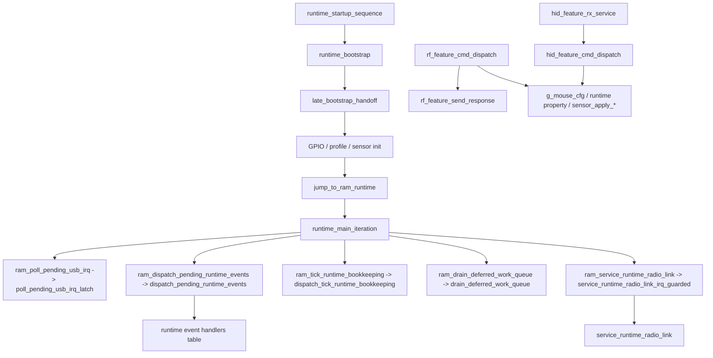

# NP-01S v2 Mouse Firmware Architecture and Behavior Analysis

> [!IMPORTANT]
> <sub><strong>Reverse-Engineering Notice:</strong> This report is provided solely for lawful interoperability research, defensive security analysis, education, archival study, and owner-authorized repair or maintenance. It does not authorize unauthorized flashing, redistribution, circumvention, infringement, or other unlawful use; all third-party rights remain with their respective owners.</sub>

## Why This Family Was Selected

This report is included because the VAXEE family serves as a representative sample of self-developed firmware for a high-end wireless gaming mouse. It is especially valuable for studying vendors that appear to have a stronger in-house understanding of sensor tuning, motion-path handling, and feel-oriented firmware behavior.

## 0. Document Notes

### 0.1 Goal

This document consolidates the current reverse-engineering results for `NP-01S_v2_Driver_Version.bin`, with emphasis on the following:

- Firmware code structure and module boundaries
- ROM startup, RAM main loop, event dispatch, and 2.4G runtime organization
- Configuration protocol, opcodes, packet format, and setting semantics
- The full path from raw sensor motion to the final output queue
- Mode system, profile/script switching, and runtime property restore
- Vendor-specific firmware-layer motion/event timing logic
- USB 5V plug events, runtime restoration, and low-power / wake-related paths

### 0.2 Analysis Basis

- Firmware binary: `NP-01S_v2_Driver_Version.bin`
- IDA / MCP database: functions, cross-references, disassembly, decompilation, type information, global objects, and call paths are treated as the primary source

---

## 1. Overall Firmware Framework

### 1.1 Execution Model

The overall execution model of this firmware is:

- A hybrid of ROM startup + RAM superloop + interrupt latching / foreground dispatch + multiple state machines
- High-frequency data path:
  - `motion_pipeline_service`
  - `motion_postprocess_dispatch`
  - `postprocess_motion_direct_mode`
  - `postprocess_motion_buffered_mode`
  - `drain_motion_output_queue`
- Foreground control path:
  - `runtime_main_iteration`
  - `dispatch_pending_runtime_events`
  - `drain_deferred_work_queue`
  - `service_runtime_radio_link`

From the code organization, this firmware is much closer to a classic bare-metal `superloop` design than to an RTOS design. `runtime_startup_sequence -> runtime_bootstrap -> late_bootstrap_handoff` completes the ROM-side initialization and then jumps directly into `runtime_main_iteration` in RAM. `runtime_main_iteration` itself is a fixed-order foreground service loop: it first polls USB IRQs, then calls the current state handler through a table, and then runs event dispatch, tick maintenance, deferred work draining, and RF link service in sequence. The current database also shows no common RTOS signs such as task creation, scheduler switching, semaphores, message queues, or kernel import symbols.

It can be summarized as follows:

| Dimension | Behavior in This Firmware |
| --- | --- |
| System form | Bare-metal + foreground/background split, not RTOS |
| Startup method | ROM finishes initialization and hands off to the RAM main loop |
| Scheduling style | Fixed-order polling + interrupt latching + foreground dispatch |
| Concurrency organization | Relies on global state, event flags, deferred work queues, and small handler tables |
| Typical features | `g_runtime_handler_table`, `ram_dispatch_pending_runtime_events`, `ram_drain_deferred_work_queue` |

From an engineering perspective, this design gives tight timing control and short execution paths, which fits a high-polling-rate mouse very well. The tradeoff is that it relies on many global states, and module boundaries depend more heavily on names, comments, and manual reconstruction than in a clean RTOS task model.

### 1.2 Major Module Breakdown

| Subsystem | Main Responsibility | Representative Functions / Objects |
| --- | --- | --- |
| Startup and RAM runtime | ROM initialization and jump into RAM main loop | `runtime_startup_sequence`, `runtime_bootstrap`, `late_bootstrap_handoff`, `runtime_main_iteration` |
| Configuration protocol / command entry | Receive, dispatch, and respond to USB/WebHID and RF configuration commands | `hid_feature_rx_service`, `hid_feature_cmd_dispatch`, `rf_feature_cmd_dispatch`, `rf_feature_send_response` |
| Configuration persistence | Runtime property read/write | `get_runtime_property_u8`, `set_runtime_property_u8`, `notify_*`, `get_*_property` |
| Sensor interface | CPI/LOD/mode/script programming and register access | `sensor_program_cpi_registers`, `sensor_set_lod_registers`, `sensor_set_tracking_mode_register`, `sensor_set_tracking_profile_registers`, `sensor_read_register_bytes_ram` |
| Motion data pipeline | Motion sample decoding, queueing, buffered/direct branching, and send scheduling | `motion_pipeline_service`, `motion_postprocess_dispatch`, `prime_buffered_motion_state`, `drain_motion_output_queue`, `g_motion_sample`, `g_motion_queue` |
| Mode switching | Report rate, tracking mode, LOD, active DPI slot, Track Trail | `commit_pending_report_rate_change`, `set_tracking_setting_index`, `set_lod_setting_index`, `set_active_dpi_slot`, `g_track_trail_mode` |
| Power / link switching | USB 5V plug events, wireless link maintenance, shadow register restoration | `handle_usb_5v_plug_up`, `mouse_protocol_usb_plug_process`, `service_runtime_radio_link`, `restore_sensor_shadow_after_resume` |

### 1.3 Startup Stage

At boot, the firmware brings the system up in this order:

1. `runtime_startup_sequence -> scatterload_dispatch -> runtime_bootstrap`
2. `late_bootstrap_handoff`
3. The ROM side completes multiple system initialization calls:
   - `sub_C9AC`, `sub_C212`, `sub_CA6C`, `sub_C98C`, `sub_C996`, `sub_C208`
4. Runtime environment and GPIO/peripheral startup checks:
   - `sub_AF60`
   - `sub_7B70`
5. If `g_mouse_cfg.reserved_16+3 == 0`, execute a set of boot probing scripts:
   - `sub_92C4`
   - `sub_936C`
   - `sub_9318`
   - `sub_9280`
6. Enable runtime:
   - `sub_5F00`
   - `sub_5F24`
7. `jump_to_ram_runtime -> runtime_main_iteration`

### 1.4 Runtime Stage

- Data sampling path
  - Sensor register reads are performed by `sensor_read_register_bytes_ram`
  - From the call relationships, the raw sample is first written into `g_motion_sample`, then consumed by `motion_pipeline_service`
- Report generation path
  - `g_motion_sample -> motion_postprocess_dispatch -> g_motion_queue -> drain_motion_output_queue`
  - At the tail, it most likely goes through several transport helpers before being sent through USB or RF
- Configuration handling path
  - USB: `hid_feature_rx_service -> hid_feature_cmd_dispatch`
  - RF: `rf_feature_cmd_dispatch -> rf_feature_send_response`
- Mode switching path
  - DPI: `set_active_dpi_slot -> sensor_apply_cpi`
  - report rate: `set_report_rate_index -> commit_pending_report_rate_change`
  - tracking mode / motion sync: `set_tracking_setting_index -> process_delayed_tracking_change / sensor_apply_tracking_profile`
  - Track Trail: `g_track_trail_mode -> notify_track_trail_setting_changed -> configure_motion_tick_profile`
- Low-power path
  - Multiple inactivity timers inside `motion_pipeline_service`, together with `handle_usb_5v_plug_up`, `service_runtime_radio_link`, and `restore_sensor_shadow_after_resume`, likely form a shared power/link recovery path

### 1.5 Code Design Style

#### Characteristic 1: State Organization

- A hybrid style of many globals plus a small number of structure contexts
- Notes:
  - Configuration is concentrated in `g_mouse_cfg`
  - Sensor shadow state is kept in `g_sensor_shadow`
  - Motion runtime state is concentrated around `g_motion_pipeline_state` and `g_motion_tick_state`
  - Feature report buffers are stored separately in `g_hid_feature_rx_report` / `g_hid_feature_tx_report`

#### Characteristic 2: Interrupt vs. Foreground Split

- IRQ / callback side mainly does:
  - Set event flags, update latches, and fill runtime queues
- Foreground main loop mainly does:
  - `runtime_main_iteration` polls USB IRQs, dispatches callbacks, performs tick bookkeeping, handles deferred work, and services the RF link

#### Characteristic 3: Configuration Application Style

- A hybrid style of "cache / persist first, then commit immediately or later depending on context"
- Notes:
  - DPI/CPI and LOD can be pushed to sensor registers immediately
  - report rate first writes `g_mouse_cfg.report_rate_idx`, then `commit_pending_report_rate_change` maps it to an internal tick profile
  - tracking-related settings may be postponed to an idle window by `process_delayed_tracking_change`

#### Characteristic 4: Mode Implementation Style

- Enumerations + table-driven logic + a small amount of script-style switching
- Notes:
  - report rate switches through a tick profile table
  - tracking profiles are written as grouped registers by `sensor_set_tracking_profile_registers`
  - profile/script slot switching is table-driven through `apply_profile_script_and_persist_slot`

---

## 2. Configuration System and Command Entry

### 2.1 Configuration Storage Layout

What is directly visible in the firmware right now is a unified "runtime property" backend; the original flash/NVM physical layout has not yet been fully recovered.

| Property ID / Field | Meaning | Length | Basis |
| --- | --- | --- | --- |
| `0x1005` | LOD | 1 byte | `get_lod_property`, `notify_lod_setting_changed` |
| `0x1006` | tracking mode flag | 1 byte | `get_tracking_mode_property`, `notify_tracking_mode_flag_changed` |
| `0x1007` | motion sync flag | 1 byte | `get_motion_sync_property`, `notify_motion_sync_flag_changed` |
| `0x1024` | Track Trail mode | 1 byte | `get_track_trail_setting_property`, `notify_track_trail_setting_changed` |
| `0x1000` | profile/script slot (inferred) | 1 byte | `apply_profile_script_and_persist_slot` |
| `0x1001` | DPI slot limit or profile-related property (inferred) | 1 byte | `sub_5C1C`, `apply_active_dpi_slot_with_limit` |
| `0x1002` / `0x1008` | tracking profile selector by context (inferred) | 1 byte | `get_tracking_profile_property_by_context`, `set_tracking_profile_property_by_context` |

Additional notes:

- `get_runtime_property_u8` / `set_runtime_property_u8` are the unified backend entry points, but they are only indirect wrappers; the real storage backend function has not yet been fully recovered.
- The boot-time restore path restores Track Trail / LOD / tracking mode / motion sync from properties.
- The mapping from properties to physical flash pages / records still needs further verification.

### 2.2 Configuration Command Entry

#### USB / WebHID / HID Feature

- Receive entry: `hid_feature_rx_service`
- Buffer objects: `g_hid_feature_rx_report`, `g_hid_feature_tx_report`
- Processing timing:
  - First check `report_id == 0x0E`
  - Then validate header `0xA5`
  - Dispatch immediately through `hid_feature_cmd_dispatch`, and build the response packet immediately

#### 2.4G / Vendor Protocol

- Receive entry: `rf_feature_cmd_dispatch`
- Buffer / packet send:
  - `rf_feature_send_response`
- Processing timing:
  - Semantics are highly mirrored to the USB path, but the packet is wrapped into the RF transport buffer

#### Debug / Sensor Register Read

- `queue_read_ambient_command`
- `queue_read_register_command`

These two paths turn read commands into internal queue packets and then send them through `sub_80B8`.

### 2.3 Configuration Execution Model

- Immediate execution + runtime-property persistence + delayed commit in certain scenarios
- Strengths:
  - The relationship between configuration objects, sensor scripts, and UI commands is clear
  - Settings that affect timing, such as Track Trail / report rate, do not need to be completed entirely in interrupt context
- Risks and notes:
  - The current USB path for `cmd 0x08` uses a reduced selector rather than a full four-combination encoding
  - A report-rate change is not complete just by writing `g_mouse_cfg.report_rate_idx`; it must still go through `commit_pending_report_rate_change`
  - Tracking-related mode switching has a delayed-commit window

---

## 3. Sensor Motion Data Flow

### 3.1 Main Chain and Supporting Functions in This Chapter

The goal of this chapter is not to explain every related function one by one, but to make the main motion path clear from sampling to final output. Based on the current call relationships recovered in IDA, the main and secondary roles can be organized as follows:

| Role | Function | Responsibility in the Data Flow |
| --- | --- | --- |
| Scheduling entry | `motion_pipeline_service` | Decides whether the current tick advances the main motion path |
| Path dispatch | `motion_postprocess_dispatch` | Decides whether the current sample enters the direct path or the buffered path |
| Direct-output path | `postprocess_motion_direct_mode` | Turns the sample into either a full record or an XY-only record |
| Buffered-output path | `postprocess_motion_buffered_mode` | Maintains the buffered state machine and emits a staging packet |
| Output fork | `queue_motion_payload_record` | Decides whether the current record is sent immediately or turned into deferred history |
| Final dequeue | `drain_motion_output_queue` | Performs final aggregation, delay decisions, and send-out |

The major supporting nodes around this main chain are:

| Helper Function | Purpose |
| --- | --- |
| `decode_motion_sample_flags` | Normalizes `g_motion_sample` in place into the unified post-processing format |
| `prime_buffered_motion_state` | Preload helper for the buffered path; used only by the buffered state machine |
| `pack_queued_motion_history` | Mid-pipeline aggregator for the history queue; merges short XY history in advance |
| `can_delay_xy_history_record` | Decides whether the short history at the queue head may stay delayed for one more cycle |

The rest of this chapter follows the same main chain: `sampling -> normalization -> path dispatch -> record construction -> immediate send or queue -> mid-stage aggregation -> final dequeue`.

### 3.2 Data Entry and the Unified Working Buffer

Low-level sensor register reads are handled by `sensor_read_register_bytes_ram`. This RAM-side routine directly operates on peripheral base `0x5002C000`: it writes the register address to `+0x0C`, waits until the interface is ready, and then reads the returned data from `+0x1C`.

The earliest burst-sampling predecessor has not yet been fully renamed in the database, but the downstream call chain is already sufficient to confirm the following:

- Raw motion data first enters `g_motion_sample`
- `g_motion_sample` is reused by the entire main path as a fixed 7-byte object
- `motion_postprocess_dispatch`, `postprocess_motion_direct_mode`, `postprocess_motion_buffered_mode`, and `prime_buffered_motion_state` all treat it as the unified input sample

The meaning of `g_motion_sample` before and after post-processing can be summarized as follows:

| Byte Range | Before Post-Processing | After Post-Processing |
| --- | --- | --- |
| `byte0` | raw motion / flag / state bits | normalized into a compact change mask |
| `byte1..4` | XY-related fields | normalized into directly packable XY payload |
| `byte5..6` | additional state bytes | normalized into the 2-byte state summary used by full records |

This shows that `g_motion_sample` is not a one-shot raw burst buffer. It is a unified working buffer where raw input arrives first and the normalized result remains in place for the later stages.

### 3.3 First-Level Scheduling: `motion_pipeline_service` and `motion_postprocess_dispatch`

No single function alone pushes a sample into the post-processing chain. The real first-level scheduler is the combined layer `motion_pipeline_service -> motion_postprocess_dispatch`.

`motion_pipeline_service` is responsible for two things:

1. Based on whether a new sample exists, the current window state, and the internal tick counters, decide whether this round should advance the main motion path
2. Call `motion_postprocess_dispatch` when advancement is required

`motion_postprocess_dispatch` then handles three more decisions:

1. Whether `g_motion_sample` should first go through `decode_motion_sample_flags`
2. Whether Track Trail in Stable & Controlled mode should insert a `sub_1353C` gate before post-processing starts
3. Whether the current `profile_idx` chooses the direct path or the buffered path

From the control flow, three key conclusions are stable:

- `profile_idx == 4` enters `postprocess_motion_buffered_mode`
- Other profiles enter `postprocess_motion_direct_mode`
- When `g_track_trail_mode == 1`, the immediate path inserts a `sub_1353C` gate before post-processing

Counters and idle accumulation state are concentrated around `g_motion_pipeline_state+0x20`. This means that whether the current sample may immediately enter post-processing depends not only on the existence of new motion, but also on mode gating and cadence counters.

### 3.4 Main Path A: How the Direct Path Turns a Sample into a Motion Record

Once `motion_postprocess_dispatch` selects the direct path, the main chain enters `postprocess_motion_direct_mode`. The core of this path is not recalculating `dx/dy`, but deciding what output shape the current sample should take.

Its processing sequence can be summarized as:

1. Check whether `g_motion_queue` is full
2. If the queue is full, first try `pack_queued_motion_history` to recover queue space
3. Once the queue is usable, run `decode_motion_sample_flags` on `g_motion_sample`
4. Based on the decode result, decide whether the current record is full or XY-only
5. Hand the record to `queue_motion_payload_record`

Inside the direct path, the rule for deciding between full and XY-only is clear:

- Generate a full record when bit0 from `decode_motion_sample_flags` is set, or when `g_motion_sample[0] != 0`
- Otherwise generate an XY-only record

So the main action of the direct path is not value recomputation. It decides which record shape the current sample becomes:

- `len = 9` full record: `[type=2][subtype][sample7]`
- `len = 6` XY-only record: `[type=2][subtype][xy4]`

### 3.5 Output Fork: How `queue_motion_payload_record` Decides Between Immediate Send and Queueing

`queue_motion_payload_record` is the structural turning point between the direct path and the later queue / drain chain. It decides whether the current motion record leaves the firmware immediately or is converted into deferred history first.

The queue-record fields used throughout this chapter are:

| Field | Meaning |
| --- | --- |
| `type = 2` | standard motion payload record |
| `subtype = 3` | direct candidate that still has immediate-send eligibility in the current cycle |
| `subtype = 5` | deferred history that has lost immediate-send eligibility and entered later history / drain scheduling |

The function applies the following rules:

- If the transport window is open and `g_motion_queue` is empty, keep the original `subtype` and send immediately
- If the send window is not hit, or the queue is non-empty, rewrite the `subtype` to `5` and push the record into `g_motion_queue`

At the end, it also calls `sub_10C80` to compute current queue occupancy. If the occupancy reaches `>= 2`, it proactively calls `pack_queued_motion_history` to merge short history earlier.

Therefore, the difference between `subtype=3` and `subtype=5` is not payload content. It is send eligibility and the downstream scheduling path.

### 3.6 Main Path B: How the Buffered Path Turns a Sample into a Staging Packet

When `motion_postprocess_dispatch` selects `profile_idx == 4`, the main chain stops producing a direct record and instead takes the buffered path. The real main-path function here is `postprocess_motion_buffered_mode`; `prime_buffered_motion_state` is only the preload helper for this buffered state machine.

The core buffered state lives at `g_motion_pipeline_state+0x03`, together with three key buffers:

| Address / Object | Role |
| --- | --- |
| `g_motion_pipeline_state+0x03` | current state of the buffered state machine |
| `0x20004ABA` | XY-only staging buffer |
| `0x20004AC3` | full staging buffer |
| `0x200056C0` | deferred holding copy used when the send window is closed |

Its data flow can be divided into four phases:

1. `prime_buffered_motion_state` preloads the current sample when `state=0`  
   - If decode decides XY-only, it writes the XY payload into the XY staging area and marks the current packet type  
   - If decode decides full, it writes `sample7` into the full staging area
2. `postprocess_motion_buffered_mode` then reads the state machine  
   - `state=1`: write the current content into the selected template and decide whether to send immediately or copy it to `0x200056C0`  
   - `state=2`: do not decode again, only wait for the later flush  
   - `state=3`: perform cleanup and return to idle
3. If the send window is not open, the current packet is held temporarily at `0x200056C0` as a staging copy
4. Once the window allows it, the staging packet finally leaves the buffered path

The key value of this path is that it splits "what shape this sample should have" from "when this sample is allowed to be sent."

### 3.7 Mid-Queue Aggregation and Final Dequeue

Once a motion record enters the queue, it does not leave one-by-one in raw FIFO form. The second half of the main chain still contains two stages:

- Mid-stage aggregation: `pack_queued_motion_history`
- Final dequeue: `drain_motion_output_queue`

#### 3.7.1 `pack_queued_motion_history`: Mid-Stage Aggregation

`pack_queued_motion_history` is not the entry of the main chain, but it determines the first convergence step for short history while it is still in the queue. It only handles one object:

- A queue-head short XY history of `type=2 / subtype=5 / len=6`

It takes the 4-byte XY payload from `record[2..5]` at the queue head and appends it to `0x20004ACC`. Once the cursor at `g_motion_pipeline_state+0x06` reaches `9`, it sends the aggregate packet immediately and resets the cursor.

When the queue head is a `len=9` full history:

- If `0x20004ACC` is empty, it sends that full history directly
- If `0x20004ACC` is already half full, it uses the cached tail XY bytes at `g_motion_pipeline_state+0x18..0x1B` to complete the packet before sending

This means that short history is already compressed once before it leaves the queue.

#### 3.7.2 `drain_motion_output_queue`: Final Dequeue

`drain_motion_output_queue` is the last gate before a queued motion record leaves the firmware. It is responsible for:

- Reading the queue head from `g_motion_queue`
- Using `0x20005756` as the current peek / send buffer
- Using `0x20004BD8` as the final aggregation buffer

Its behavior differs by mode.

On the Smooth & Responsive path:

- When `g_track_trail_mode == 0` and `profile_idx != 5`, it preferentially absorbs queue-head records of `type=2 / subtype=5 / len=6`
- It appends these short history fragments to `0x20004BD8`
- It flushes immediately when the cursor reaches `9`
- The result is that short history is aggregated earlier and sent earlier

On the Stable & Controlled path:

- If the queue head is `type=2 / subtype=5 / len=6`, it first calls `can_delay_xy_history_record()`
- When the return value allows delay, this cycle does not `pop + send`
- The record remains in the queue for longer, and dequeue cadence becomes more conservative

So the direct effect of Track Trail in the back half of the queue is not rewriting record content. It changes when short history is allowed to leave the queue.

### 3.8 End-to-End Data Flow

From raw sensor motion to final output, the main path can be understood as:

1. Sensor-register or burst data enters `g_motion_sample`
2. `decode_motion_sample_flags` normalizes the sample into the unified working format
3. `motion_pipeline_service` decides whether this tick advances the main chain
4. `motion_postprocess_dispatch` decides between the direct path and the buffered path
5. The direct path turns the sample into a full or XY-only motion record
6. The buffered path turns the sample into a staging packet
7. `queue_motion_payload_record` decides whether the record is sent immediately or turned into deferred history
8. `pack_queued_motion_history` performs the first round of mid-stage aggregation
9. `drain_motion_output_queue` performs final aggregation, delay decisions, and send-out

If only the timing- and feel-related trunk nodes are kept, the core is three decisions:

- `motion_postprocess_dispatch`: when the current sample is allowed to enter post-processing
- `queue_motion_payload_record`: whether the current record is sent immediately or queued
- `drain_motion_output_queue`: whether queued short history leaves in this cycle or stays for one more beat

### 3.9 Plain-Language Explanation: How Continuous Movement Is Split and Emitted Inside the Firmware

From the perspective of actual continuous movement, the firmware is not doing "the sensor produces one large displacement and the firmware sends one large displacement unchanged." It behaves more like this:

1. The sensor continuously produces multiple smaller motion samples
2. The firmware normalizes those samples into a sequence of motion records
3. Any record that misses the current send window is downgraded to `subtype=5` history
4. These history records may then be aggregated, delayed, or completed while they stay in the queue

From the feel perspective, the three things that actually change are:

- when a sample enters post-processing
- how long short history stays in the queue
- when aggregate packets are flushed

In Smooth & Responsive mode, the main chain tends to let short history leave the queue sooner. In Stable & Controlled mode, dispatch and drain both add cadence gating, so that small continuous displacements are spread more evenly over time.

---

## 4. Mode System / Slot System / Operating Mode Analysis

> This chapter keeps only the analysis of `tracking mode`. Other features such as DPI, LOD, debounce, and report rate are not the focus of this report and are therefore not expanded here.

### 4.1 Currently Exposed Tracking Modes

The current USB configuration entry `cmd 0x08 -> set_tracking_setting_index(index, 1)` actually exposes only two tracking modes to the front end:

| USB selector | `tracking_mode_flag` | `motion_sync_flag` |
| --- | --- | --- |
| `1` | `0` | `1` |
| `3` | `1` | `1` |

In practical terms, the current front end exposes only two switchable tracking modes, and in both of them `motion_sync_flag` remains fixed at `1`.

### 4.2 What Happens to the Sensor When Tracking Mode Changes

When tracking mode is changed, the firmware mainly does two things to the sensor.

#### 1. First Change the Mode-Bit Register

`set_tracking_setting_index` immediately calls `sensor_apply_tracking_mode_flag`, which writes:

| Mode | Register Writes |
| --- | --- |
| `tracking_mode_flag = 0` | `0x7F = 0x0D`, `0x48 = 0xFC` |
| `tracking_mode_flag = 1` | `0x7F = 0x0D`, `0x48 = 0xFD` |

This is the most direct and most stable sensor-side difference between the two currently exposed tracking modes.

#### 2. Then Replay a Tracking Profile Script

In the same configuration flow, it also calls `sensor_apply_tracking_profile(3, 0)` for one lightweight apply. Later, during an idle window or a restore path, it calls `sensor_apply_tracking_profile(3, 1)` again and replays the full script set.

The full script is:

| Order | Reg | Value |
| --- | --- | --- |
| 1 | `0x40` | read-modify-write |
| 2 | `0x7D` | `0x0A` |
| 3 | `0x77` | `0xFF` |
| 4 | `0x7E` | `0x77` |
| 5 | `0x79` | `0xFF` |
| 6 | `0x7B` | `0xFF` |
| 7 | `0x7A` | `0x01` |

Here, the lightweight `arg1=0` apply mainly touches only `0x40`, while `arg1=1` replays the full script.

### 4.3 Key Similarities and Differences Between the Two Tracking Modes

The relationship between the two current tracking modes can be summarized as follows:

- Similarities:
  - Both enter through `cmd 0x08`
  - Both keep `motion_sync_flag` at `1`
  - Both go through the same `sensor_apply_tracking_profile(3, ...)` path
  - The replayed profile script is identical in both cases: `0x40 / 0x7D / 0x77 / 0x7E / 0x79 / 0x7B / 0x7A`
- Differences:
  - `tracking_mode_flag = 0` writes `0x48 = 0xFC`
  - `tracking_mode_flag = 1` writes `0x48 = 0xFD`

So, in this firmware version, the main difference in tracking mode is not that it switches to an entirely different profile. It is that the same profile is used while register `0x48` changes its mode value.

### 4.4 Additional Note

Internally, the firmware still retains the full combined representation of `tracking_mode_flag + motion_sync_flag`, but the current USB Feature path does not expose the full combination set to the front end. This report therefore describes tracking mode only in terms of the two modes that users can actually switch to in the current product behavior.

---

## 5. Vendor-Specific Features and Firmware-Layer Motion / Event Processing Algorithms

### 5.1 Key Feature: Track Trail (Smooth & Responsive / Stable & Controlled)

Track Trail is the most important firmware-layer motion scheduling feature in the current firmware. Its scope is clearly inside the motion pipeline itself. It does not switch sensor register profiles, and no direct evidence has been found that it numerically recomputes `dx/dy`. What it actually controls is when a motion sample enters post-processing, how a motion record is queued, how history records are aggregated, and when the final drain stage flushes them out.

#### 1. Functional Entry and Analysis Boundary

- Configuration entry: `cmd 0x13`
- Runtime variable: `g_track_trail_mode`
- Persisted property: `property 0x1024`
- Values:
  - `0x00 = Smooth & Responsive`
  - `0x01 = Stable & Controlled`

The key cross-references around `g_track_trail_mode` are concentrated in:

- `configure_motion_tick_profile`
- `sub_10050`
- `sub_100A6`
- `motion_postprocess_dispatch`
- `postprocess_motion_direct_mode`
- `postprocess_motion_buffered_mode`
- `queue_motion_payload_record`
- `pack_queued_motion_history`
- `drain_motion_output_queue`
- `can_delay_xy_history_record`

This makes it clear that Track Trail lands in firmware-side timing and queueing strategy rather than in sensor register scripts.

#### 2. Object Model and Record Syntax

Track Trail operates on three layers of objects:

| Object | Storage Location | Role |
| --- | --- | --- |
| `motion sample` | `g_motion_sample` | working buffer of the current sampling cycle, handled as a 7-byte sample |
| `motion record` | `g_motion_queue` | internal queueing and scheduling unit inside the firmware |
| `transport packet` | send buffer / aggregate buffer | final object handed to the USB / RF transport path |

`motion_queue_push_record` and `motion_queue_peek_record` show that each queue slot is laid out in memory as:

```c
struct motion_queue_slot {
    u8 len;        // slot[0]
    u8 type;       // slot[1]
    u8 subtype;    // slot[2]
    u8 payload[];  // slot[3...]
};
```

Here, `len` is the total length of `type + subtype + payload`. Therefore:

- `len = 6` means `[type][subtype][xy4]`
- `len = 9` means `[type][subtype][sample7]`

#### 3. Engineering Semantics of `type` and `subtype`

`type` and `subtype` describe two different levels of state:

- `type`: the high-level category of the queue entry
- `subtype`: the send semantics within that category

On the main motion path, the most important ones are:

- `type = 2`: standard motion payload record
- `type = 3`: helper queue entry created by `queue_motion_history_tail`, not a focus of this chapter

For `type = 2`, the two `subtype` values that matter most are:

| Field | Meaning | Engineering Interpretation |
| --- | --- | --- |
| `subtype = 3` | direct candidate | still has immediate-send eligibility in the current cycle |
| `subtype = 5` | deferred history | not sent in the current cycle and handed off to later history / drain scheduling |

So the difference between `subtype=3` and `subtype=5` is not in payload content. It lies in send eligibility and downstream scheduling.

#### 4. Two Orthogonal Dimensions of a Motion Record

The differences between motion records can be understood as two orthogonal dimensions.

The first dimension is payload completeness:

- full record: `len=9`, shape `[type=2][subtype][sample7]`
- XY-only record: `len=6`, shape `[type=2][subtype][xy4]`

The second dimension is send semantics:

- direct candidate: `subtype=3`
- deferred history: `subtype=5`

In other words, the firmware is not distinguishing only between "full" and "XY-only". It also distinguishes between "eligible for direct send now" and "deferred for later send".

#### 5. Record Lifecycle: From Sample to History Record

The lifecycle of a normal motion sample is:

1. The sample enters `g_motion_sample`
2. `decode_motion_sample_flags` normalizes the sample
3. `postprocess_motion_direct_mode` decides whether to use the 7-byte full payload or the 4-byte XY-only payload
4. `queue_motion_payload_record` decides whether the record is sent immediately or enters `g_motion_queue`

Using an XY-only sample as an example, the direct path first constructs:

```c
[type=2][subtype=3][xy0][xy1][xy2][xy3]
```

If the transport window is available and the queue is empty, that record is sent directly as `subtype=3`. If the send window is unavailable, or the queue already contains pending entries, `queue_motion_payload_record` no longer preserves `subtype=3`. It rewrites it to `subtype=5` and pushes it into the queue:

```c
[type=2][subtype=5][xy0][xy1][xy2][xy3]
```

Therefore, the essence of `subtype=5` is "a motion record that has lost immediate-send eligibility in the current cycle and entered the later scheduling path."

#### 6. Shared Skeleton: Track Trail Does Not Change the Base Processing Chain, Only the Advancement Strategy

Smooth & Responsive and Stable & Controlled share the same base processing chain:

1. Read the motion sample
2. Normalize the sample
3. Select the direct path or the buffered path
4. Construct a motion record
5. Decide immediate send or queueing according to the window state
6. Complete dequeue through history aggregation and final drain

Four points need to be emphasized.

First, the direct / buffered split is not decided by Track Trail. It is decided by `profile_idx`:

- `profile_idx == 4` uses `postprocess_motion_buffered_mode`
- Other profiles use `postprocess_motion_direct_mode`

Second, `get_motion_tick_profile_index_0` itself only reads the current profile index from `g_motion_tick_state`. What Track Trail changes is the tick-table selection for a given index, not the definition of that profile set itself.

Third, the key difference introduced by Track Trail lies in "when post-processing is allowed to start" and "when short history is allowed to leave the queue", not in record-format definition.

Fourth, `profile_idx == 4` corresponds to an explicit buffered state machine. `postprocess_motion_buffered_mode` uses:

- state byte: `g_motion_pipeline_state+0x03`
- full staging buffer: `0x20004AC3`
- XY-only staging buffer: `0x20004ABA`
- deferred holding buffer: `0x200056C0`

That state machine switches among `0/1/2/3` to implement "construct the current packet -> decide whether this cycle may send it -> hold it temporarily if not -> wait for later flush." Track Trail does not rewrite the basic packet-construction rules of the buffered path; it changes when that state machine advances by means of tick-table choice and gating logic.

#### 7. Queue Occupancy, Two-Level Aggregation, and Flush Mechanism

`g_motion_queue` is a standard ring buffer:

- `motion_queue_is_full` uses `(write+1)%size == read` to decide whether it is full
- the queue-capacity byte is located at `g_motion_queue+0x06`
- `sub_10C80` computes current queue occupancy, not a boolean full/empty state

This means queue pressure is managed explicitly in the firmware. After queueing a record, `queue_motion_payload_record` will proactively call `pack_queued_motion_history` if occupancy has reached `>= 2`. This shows that the firmware already tries to reduce queue pressure once consecutive history records appear.

The current path contains two levels of history aggregation.

The first level is in `pack_queued_motion_history`:

- aggregate buffer: `0x20004ACC`
- aggregate cursor: `g_motion_pipeline_state+0x06`
- target object: queue-head records of `type=2 / subtype=5 / len=6`
- operation: extract `record[2..5]`, that is, the 4-byte XY payload, and append it into `0x20004ACC`
- flush condition: cursor reaches `9`

In addition, when the queue head is a `len=9` full history while `0x20004ACC` is already half full, the function uses the cached tail XY bytes at `g_motion_pipeline_state+0x18..0x1B` to complete the packet and send it immediately. This means the mid-stage aggregator not only merges two short records, but also closes a half-full buffer when full and short records arrive in mixed order.

The second level of aggregation is in `drain_motion_output_queue`:

- aggregate buffer: `0x20004BD8`
- aggregate cursor: `g_motion_drain_state+0x05`
- target object: again prioritizes `type=2 / subtype=5 / len=6`
- flush condition: cursor reaches `9`

Because both aggregation levels coexist, a short XY-history record is not guaranteed to be sent immediately at one fixed stage. It may be absorbed, delayed, or merged either in the middle of the pipeline or during the final drain stage.

#### 8. `postprocess_motion_direct_mode`: Payload Simplification and Queue-Pressure Handling

The behavior of `postprocess_motion_direct_mode` can be divided into two parts.

The first part is payload-shape selection:

- Generate a full record when bit0 from `decode_motion_sample_flags` is set, or when `g_motion_sample[0] != 0`
- Otherwise generate an XY-only record

The second part is queue-pressure handling:

- If `g_motion_queue` is already full, the function does not immediately discard the current sample
- The code first checks the busy state, then calls `sub_1353C`
- If the current window still allows forward progress, it prioritizes `pack_queued_motion_history` to recover queue space

This shows that when queue pressure appears, the direct path prefers "merge existing history first, then make room for the new sample," rather than degenerating immediately into a simple drop path.

#### 9. `queue_motion_payload_record`: The Transition Point from `subtype=3` to `subtype=5`

`queue_motion_payload_record` is a key function in Track Trail analysis because it defines where the send semantics of a motion record actually change.

Its rules are:

- If the transport window is open and `g_motion_queue` is empty, send immediately with the original `subtype`
- Otherwise discard the original `subtype=3`, rewrite it as `subtype=5`, and push it into the queue

Therefore:

- `subtype=3` only means "still eligible for direct send in the current cycle"
- Once the record enters the queue, the send semantics of a normal motion record are uniformly rewritten as `subtype=5`

This is also why later Track Trail analysis must keep focusing on `subtype=5`: the actual timing differences are produced not by the newly constructed direct candidate, but by queue entries that have already entered deferred-history state.

#### 10. Stable & Controlled: Conservative Timing Scheduler

The engineering characteristics of Stable & Controlled can be summarized as "two conservative gates plus later dequeue of short history."

##### 10.1 First Layer: More Conservative Tick Table

`sub_10050` and `sub_100A6` choose different tick tables according to `g_track_trail_mode`:

- Smooth & Responsive uses `0x2000424C[profile_idx]`
- Stable & Controlled uses `0x20004268[profile_idx]`

The effect is that, under the same `profile_idx`, Stable & Controlled drives the motion pipeline from a different timing base. At this point Track Trail changes advancement cadence, not record syntax.

##### 10.2 Second Layer: Send-Window Gate Before Entering Post-Processing

The immediate path inside `motion_postprocess_dispatch` contains Stable & Controlled-specific logic:

1. When `g_track_trail_mode == 1`, call `sub_1353C` first
2. If it returns `0`, return immediately in the current cycle
3. Do not enter either direct or buffered post-processing in this round

Because this gate is placed before post-processing, it controls whether the sample is allowed to advance into post-processing in the current cycle, not whether it is sent after post-processing finishes.

##### 10.3 Third Layer: Short History at the Queue Head May Still Be Delayed

Inside `drain_motion_output_queue`, Stable & Controlled first checks whether the queue head satisfies:

- `type = 2`
- `subtype = 5`
- `len = 6`

If so, it calls `can_delay_xy_history_record`. When that function returns allow, the current head will not execute `pop + send` in this cycle and instead remains in the queue.

This shows that the main intervention target of Stable & Controlled is not the full record, but the short XY-only history that most easily produces fragmented output.

##### 10.4 Fourth Layer: Delay Decision Based on Control Bit `0x2`

The logic of `can_delay_xy_history_record` is equivalent to:

```c
return ((g_motion_pipeline_state.control_flags & 0x2) == 0);
```

That means the delay condition is not derived from `dx/dy` magnitude, trajectory curvature, or direction changes. It is decided by the current pipeline state bits. This mode should therefore be understood as a state-bit-based timing scheduler rather than a mathematical filter based on displacement amplitude.

##### 10.5 Engineering Behavior of Stable & Controlled

Under Stable & Controlled, the following results can be directly observed:

- `subtype=5 len=6` short history stays in the queue longer
- `g_motion_queue` more easily accumulates multiple short history entries for a short period
- flush of `0x20004BD8` happens later
- the final output cadence becomes more regular, and short fragments are less likely to leave the queue individually

#### 11. Smooth & Responsive: Aggressive Aggregation and Dequeue Strategy

The engineering characteristics of Smooth & Responsive can be summarized as "earlier entry into post-processing plus more aggressive absorption of short history."

##### 11.1 First Layer: More Aggressive Tick Table

When `g_track_trail_mode == 0`, `sub_10050` / `sub_100A6` select `0x2000424C[profile_idx]`. This makes the motion pipeline advance with a more aggressive cadence under the same internal profile index.

##### 11.2 Second Layer: No Additional Gate on the Immediate Path

Inside `motion_postprocess_dispatch`, only Stable & Controlled inserts the `sub_1353C` gate before the immediate path. Smooth & Responsive does not add that extra restriction, so the sample is more likely to enter direct / buffered post-processing immediately.

##### 11.3 Third Layer: Final Drain Actively Absorbs Short History

When `g_track_trail_mode == 0` and `profile_idx != 5`, `drain_motion_output_queue` preferentially takes the active aggregation path:

1. Repeatedly inspect the queue head
2. If the queue head is `type=2 / subtype=5 / len=6`
3. Extract `record[2..5]` and append it to `0x20004BD8`
4. Flush immediately once the cursor reaches `9`

The goal of this branch is not to delay. It is to absorb consecutive short history as quickly as possible and emit them once the size condition is met.

##### 11.4 Conservative Exception for `profile_idx == 5`

Smooth & Responsive does not use active drain aggregation in every situation. In `drain_motion_output_queue`, when `profile_idx == 5`, it does not take the active aggregation path above and instead falls into a more conservative drain branch that is closer to Stable & Controlled. Therefore:

- Most Smooth & Responsive cases use "aggregate faster, dequeue faster"
- `profile_idx == 5` retains one conservative exception

##### 11.5 Engineering Behavior of Smooth & Responsive

Under Smooth & Responsive, the following results can be directly observed:

- samples enter post-processing earlier on average
- `subtype=5 len=6` records are consumed by the drain stage sooner
- `0x20004BD8` forms a complete aggregate earlier
- queue residency is shorter on average, and the output cadence of small consecutive displacements becomes tighter

#### 12. Where the Two Modes Differ

The two Track Trail modes share the same record syntax:

- both generate full records and XY-only records
- both use `subtype=5` to represent deferred history once a record enters the queue
- both pass through mid-stage aggregation and final drain

The real differences land on the following four dimensions:

| Dimension | Smooth & Responsive | Stable & Controlled |
| --- | --- | --- |
| tick table | `0x2000424C` | `0x20004268` |
| immediate path | no extra gate | first goes through `sub_1353C` |
| short-history dequeue | faster aggregation and faster flush | more willing to keep delaying |
| queue / flush behavior | shorter residency, tighter output cadence | longer residency, more regular output cadence |

#### 13. Engineering Source of the Subjective Feel Difference

The subjective feel difference can be reduced directly to three kinds of engineering metrics:

- average waiting time before a sample enters post-processing
- queue residency time of short history with `subtype=5 len=6`
- formation and flush timing of the aggregate buffers

Smooth & Responsive creates a tighter output cadence through "earlier post-processing entry + faster consumption of short history". Stable & Controlled creates a more even and less fragmented cadence through "pre-postprocess gating + delayed queue-head short history". The difference comes from event timing structure rather than from a displacement-value recalculation formula.

#### 14. Plain-Language Explanation: How the Two Modes Turn the Same Motion Data into Different Feel

From the firmware's point of view, one continuous movement does not naturally correspond to one single large displacement value. A more common situation is:

1. The sensor produces multiple smaller `dx/dy` groups across consecutive sampling cycles
2. The firmware converts those samples into a sequence of motion records
3. Some records that miss the current send window are converted into short history with `subtype=5`
4. Track Trail then decides whether those short-history records should be aggregated and emitted quickly, or remain in the queue for one more cycle

Therefore, the two modes do not change feel by changing the magnitude of an individual `dx/dy`. They change the time structure by which a sequence of small displacements leaves the firmware.

For Smooth & Responsive, the firmware uses a more aggressive time organization:

- samples are more likely to enter post-processing directly
- short history is absorbed into `0x20004BD8` more quickly
- aggregate packets form earlier and flush earlier

The resulting behavior is:

- shorter output interval between neighboring small displacements
- continuous movement appears in the final report stream sooner
- subjectively, follow-up feels tighter, response feels quicker, and tiny continuous movement appears more immediately

For Stable & Controlled, the firmware uses a more conservative time organization:

- samples pass through one gate before entering post-processing
- short history at the queue head may continue to be delayed
- aggregation is biased toward flushing at a more complete point in time

The resulting behavior is:

- fewer small fragments leave the queue independently
- continuous movement is arranged more evenly on the time axis
- subjectively, fragmentation feels lower, output cadence feels more regular, and control feels stronger

This is why the difference between the two modes appears directly as "feel" rather than as a parameter-table difference: the firmware changes not the displacement values themselves, but the cadence, density, and aggregation style with which displacement events enter the report stream.

#### 15. Conclusion of This Chapter

The essence of Track Trail is a firmware-layer motion scheduling mechanism, not a register configuration item and not a displacement-value recomputation formula. Its main impact points are:

- tick-table selection
- whether the immediate path inserts a gate
- queue-residency strategy for short history of `type=2 / subtype=5 / len=6`
- flush timing of the mid-stage aggregate `0x20004ACC` and the final aggregate `0x20004BD8`

Therefore, "Smooth & Responsive / Stable & Controlled" correspond to the same set of motion data being organized inside the firmware into different advancement cadence, aggregation cadence, and send cadence.

---

## 6. Sleep, Wake, and Power Management

### 6.1 Conditions for Entering Low Power

- Multiple inactivity thresholds exist inside `motion_pipeline_service`:
  - `0xF4240`
  - `0x1E8480`
  - `0xC350`
- Once thresholds are reached, they likely trigger a chain of link / clock / sensor-related calls such as:
  - `sub_135CC`
  - `sub_1011C`
  - `sub_135D8(0x101)`
  - `sub_10AE4(0)`
  - `sub_135E4(0x148)`
  - `sub_12860`
  - `sub_10050`
  - `sub_FFF6`

### 6.2 Actions Before Sleep

- Clear or delay the motion queue
- Adjust tick tables / flush thresholds
- Enter lower-activity RF/USB/runtime states

### 6.3 Wake Sources

- USB 5V insertion:
  - `handle_usb_5v_plug_up`
  - `mouse_protocol_usb_plug_process`
- motion/activity
- RF link events
- Every main-loop iteration checks `poll_pending_usb_irq_latch` first

### 6.4 Restore Actions After Wake

- `restore_sensor_shadow_after_resume`
  - reads sensor `0x5B`
  - replays CPI shadow
  - replays tracking-mode shadow
  - replays LOD shadow
- USB 5V insertion updates state bytes around `unk_20004B74` and calls `sub_D6D4(0)`

### 6.5 Other Power-Related Paths

- `service_rf_protocol_powerdown_timer`
- `service_runtime_radio_link`
- `process_delayed_tracking_change`

Together, these functions indicate that:

- the firmware is not a simple "wired vs. wireless" binary switch
- instead, it contains a runtime state machine that ties together link state, motion idle windows, and sensor restoration

---

## 7. Protocol and Configuration Semantics Summary

### 7.1 USB Feature / RF Configuration Command Table

| cmd | Meaning | Main Write Function | Main Read Function | Notes |
| --- | --- | --- | --- | --- |
| `0x01` | firmware version read | - | internal version field | `hid_feature_cmd_dispatch` case `0x01` |
| `0x02` | current DPI slot | `set_active_dpi_slot` | `get_active_dpi_slot` | immediately followed by `sensor_apply_cpi` |
| `0x03` | DPI slot enable table | `set_dpi_slot_enable_payload` | `get_dpi_slot_enable_payload` | four-slot bit/payload |
| `0x04` | DPI value | `set_dpi_value_by_slot` | `get_dpi_value_by_slot` | persisted first; later applied by `sensor_apply_cpi` |
| `0x05` | debounce setting | `set_debounce_setting_index` | `get_debounce_setting_index` | UI value is mapped to an internal index |
| `0x06` | debounce payload | `set_debounce_slot_payload` | `get_debounce_slot_payload` | internally a 5-byte payload |
| `0x07` | report rate | `set_report_rate_index` | `get_report_rate_index` | actual commit occurs in `commit_pending_report_rate_change` |
| `0x08` | tracking mode | `set_tracking_setting_index(index, 1)` | `get_tracking_setting_index(1)` | the current USB path uses a reduced selector |
| `0x09` | LOD | `set_lod_setting_index` | `get_lod_setting_index` | immediately writes the sensor LOD register |
| `0x0A` | mouse PID read | - | internal PID read | read-only |
| `0x0B` | battery level read | - | battery field | read-only |
| `0x0C` | button mapping | `set_button_macro_assignment` | `get_button_macro_assignment` | vendor-specific function mapping |
| `0x10` | battery charging status | - | `sub_7EC8` | read-only |
| `0x13` | Track Trail | directly writes `g_track_trail_mode` | `get_track_trail_setting_property` | firmware-layer algorithm switch |

### 7.2 Important Semantics

- `report_id = 0x0E`
- `header = 0xA5`
- Feature report structure:
  - `report_id`
  - `header`
  - `cmd_id`
  - `rw`
  - `payload_len`
  - `payload[59]`

### 7.3 Additional Firmware-Side Semantic Notes

#### `cmd 0x08`

- `get_tracking_setting_index(1)` returns only a reduced selector
- `set_tracking_setting_index(index, 1)` only clearly takes effect for two selectors
- Both currently exposed selectors keep `motion_sync_flag` at `1`
- Therefore, the two USB-visible modes share `sensor_apply_tracking_profile(3, ...)` at the profile-script layer, and their stable difference mainly lands in `reg 0x48 = 0xFC / 0xFD`

#### `cmd 0x07`

- `set_report_rate_index` allows writing value `5`
- `commit_pending_report_rate_change` also contains the corresponding internal profile `4`
- The code path exists in firmware, but real-device testing is still needed to judge stability

---

## 8. Risks, Open Questions, and Suggested Next Steps

### 8.1 Risks

- The current USB path for `cmd 0x08` stably exposes only two selectors, so automation must not assume a full four-combination encoding
- The final transport sender for motion output still has several indirect jumps that are not yet fully named
- Orphan region `0x8F4A-0x9076` has not yet had its full function boundaries recovered

---

## 9. Appendix A: Firmware Framework Diagram



---

## 10. Appendix B: Sensor Data Flow Diagram

```mermaid
flowchart LR
    A["sensor_read_register_bytes_ram"] --> B["g_motion_sample (7-byte work buffer)"]
    B --> C["decode_motion_sample_flags\nbyte0 -> change mask\nbyte1..4 -> XY payload\nbyte5..6 -> status2"]
    C --> D["motion_postprocess_dispatch"]

    D --> E["direct path\npostprocess_motion_direct_mode"]
    D --> F["buffered path\npostprocess_motion_buffered_mode"]

    E --> G["type-2 subtype-3\nfull len=9 or XY-only len=6"]
    F --> H["staging buffers\n0x20004ABA / 0x20004AC3 / 0x200056C0"]
    H --> I["queue_motion_payload_record"]
    G --> I

    I --> J{"transport window open\nand queue empty?"}
    J -->|Yes| K["immediate send\nsubtype-3"]
    J -->|No| L["queue as subtype-5 history\ninto g_motion_queue"]

    L --> M["pack_queued_motion_history\nmerge len-6 XY history"]
    M --> N["drain_motion_output_queue"]
    L --> N
    K --> O["transport helpers"]
    N --> P["0x20005756 peek buffer\n0x20004BD8 drain staging"]
    P --> O["USB / RF sender"]

    Q["g_track_trail_mode"] --> D
    Q --> N
    R["g_motion_tick_state"] --> D
    R --> N
```



---

## 11. Appendix C: Configuration Semantics Tables

### 11.1 Overall Configuration Semantics Table

| Setting | Command | Configuration Object | Persisted | Runtime Application Path |
| --- | --- | --- | --- | --- |
| Current DPI slot | `0x02` | `g_mouse_cfg.reserved_16+0xA` | yes | `set_active_dpi_slot -> sensor_apply_cpi` |
| DPI value | `0x04` | `g_dpi_value_table[4]` | yes | `set_dpi_value_by_slot` |
| debounce setting | `0x05` | `g_mouse_cfg.debounce_internal_idx` | yes | `set_debounce_setting_index` |
| debounce payload | `0x06` | `g_debounce_slot_payload` | yes | `set_debounce_slot_payload` |
| report rate | `0x07` | `g_mouse_cfg.report_rate_idx` | yes | `commit_pending_report_rate_change` |
| tracking mode flag | `0x08` | `g_mouse_cfg.tracking_mode_flag` | yes | `sensor_apply_tracking_mode_flag` |
| motion sync flag | `0x08` / internal property | `g_mouse_cfg.motion_sync_flag` | `0x1007` | `sensor_apply_tracking_profile` |
| LOD | `0x09` | `g_mouse_cfg.lod_idx` | `0x1005` | `sensor_apply_lod_index` |
| button mapping | `0x0C` | several runtime objects | yes | `set_button_macro_assignment` |
| Track Trail | `0x13` | `g_track_trail_mode` | `0x1024` | `configure_motion_tick_profile` + motion pipeline |

### 11.2 Mode Register Write Table

| Function | Key Function | Registers Written | Notes |
| --- | --- | --- | --- |
| CPI | `sensor_program_cpi_registers` | `0x47, 0x48, 0x49, 0x4A, 0x4B` | sensor resolution |
| LOD | `sensor_set_lod_registers` | `0x7F, 0x7A` | low / high LOD |
| tracking mode flag | `sensor_set_tracking_mode_register` | `0x7F, 0x48` | binary mode bit |
| tracking profile script | `sensor_set_tracking_profile_registers` | `0x40, 0x7D, 0x77, 0x7E, 0x79, 0x7B, 0x7A` | `arg1=0` only performs the lightweight `0x40` update; `arg1=1` replays the full script set |

---

## 12. Conclusion

What truly affects "feel" is not the sensor register layer, but the full timing chain of `g_track_trail_mode -> g_motion_tick_state -> motion_postprocess_dispatch -> drain_motion_output_queue`. For future analysis, the most valuable direction is not to keep adding more register tables, but to complete the queue record types, flush cadence, and transport send-window behavior down to the packet-capture level. That would allow "Smooth & Responsive / Stable & Controlled" to move from static reverse engineering to measurable behavioral comparison.
