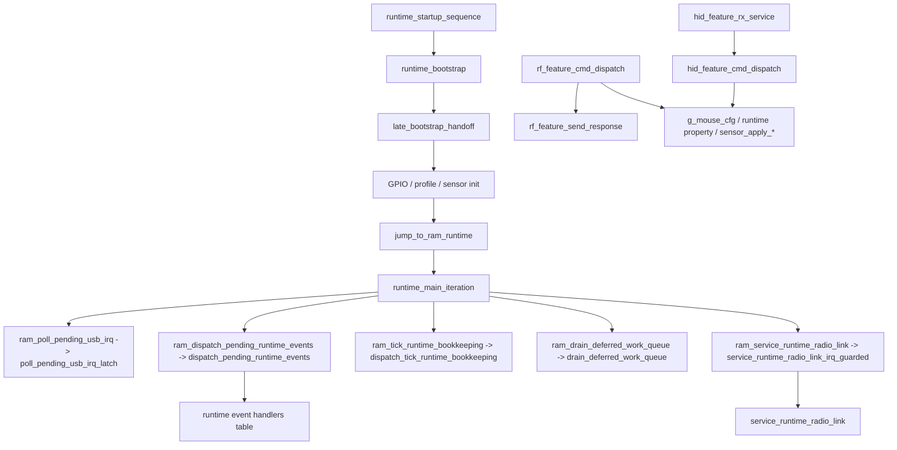

# NP-01S v2 鼠标固件架构与行为分析

> [!IMPORTANT]
> <sub><strong>逆向声明：</strong>本报告仅供合法的互操作性研究、防御性安全分析、教学、资料保存，以及设备所有人或经授权者进行维修与维护时参考之用；不授权未经许可的刷写、再分发、规避、侵权或其他违法用途，相关第三方权利仍归各自权利人所有。</sub>

## 家族选用说明

收录本报告，是因为 VAXEE 家族可作为高端自研无线游戏鼠标固件的代表样本。它尤其适合作为研究传感器调校能力、移动数据处理路径，以及以手感为导向之固件设计思路的重要参考对象。

## 0. 文档说明

### 0.1 目标

本文档用于固化 `NP-01S_v2_Driver_Version.bin` 当前逆向分析结论，重点覆盖以下问题：

- 固件代码框架与模块边界
- ROM 启动、RAM 主循环、事件分发与 2.4G 运行组织方式
- 配置协议、命令字、报文格式与配置项语义
- 传感器原始 motion 到最终输出队列的流转路径
- 模式系统、profile/脚本切换、运行时属性恢复
- 厂商独有的固件层运动/事件时序算法
- USB 5V 插拔、运行时恢复、低功耗/唤醒相关路径

### 0.2 分析依据

- 固件二进制：`NP-01S_v2_Driver_Version.bin`
- IDA / MCP 数据库：以函数、交叉引用、反汇编、反编译、类型信息、全局对象和调用路径为主

---

## 1. 固件总体框架

### 1.1 运行模型

该固件的整体运行模型为：

- ROM 启动 + RAM 超级循环 + 中断置位/前台分发 + 多个状态机的混合模型
- 高频数据路径：
  - `motion_pipeline_service`
  - `motion_postprocess_dispatch`
  - `postprocess_motion_direct_mode`
  - `postprocess_motion_buffered_mode`
  - `drain_motion_output_queue`
- 前台控制路径：
  - `runtime_main_iteration`
  - `dispatch_pending_runtime_events`
  - `drain_deferred_work_queue`
  - `service_runtime_radio_link`

从代码组织方式看，这一版固件更接近典型的裸机 `superloop` 架构，而不是 RTOS 架构。`runtime_startup_sequence -> runtime_bootstrap -> late_bootstrap_handoff` 完成 ROM 侧初始化后，会直接跳到 RAM 中的 `runtime_main_iteration`；而 `runtime_main_iteration` 本身就是一个固定顺序的前台服务循环：先轮询 USB IRQ，再按表调用当前状态处理器，然后依次执行事件分发、tick 维护、延迟工作队列和 RF 链路服务。当前数据库中也没有看到 RTOS 常见的任务创建、调度器切换、信号量、消息队列或内核导入符号。

可以把它概括为下表：

| 维度 | 本固件表现 |
| --- | --- |
| 系统形态 | 裸机 + 前后台分工，不是 RTOS |
| 启动方式 | ROM 完成初始化后 handoff 到 RAM 主循环 |
| 调度方式 | 固定顺序轮询 + 中断置位 + 前台分发 |
| 并发组织 | 靠全局状态、事件标志、延迟工作队列和少量函数表切换 |
| 典型特征 | `g_runtime_handler_table`、`ram_dispatch_pending_runtime_events`、`ram_drain_deferred_work_queue` |

从工程风格上看，这种设计的优点是时序可控、执行路径短、很适合鼠标这类高轮询率外设；代价是全局状态较多，模块边界更依赖命名、注释和人工梳理，后续维护成本会明显高于职责清晰的 RTOS 任务模型。

### 1.2 主模块划分

| 子系统 | 主要职责 | 代表函数 / 代表对象 |
| --- | --- | --- |
| 启动与 RAM 运行时 | ROM 初始化、跳转到 RAM 主循环 | `runtime_startup_sequence`, `runtime_bootstrap`, `late_bootstrap_handoff`, `runtime_main_iteration` |
| 配置协议 / 命令入口 | USB/WebHID 与 RF 配置命令接收、分发、回包 | `hid_feature_rx_service`, `hid_feature_cmd_dispatch`, `rf_feature_cmd_dispatch`, `rf_feature_send_response` |
| 配置持久化 | runtime property 读写 | `get_runtime_property_u8`, `set_runtime_property_u8`, `notify_*`, `get_*_property` |
| 传感器接口 | CPI/LOD/模式/脚本下发与寄存器读写 | `sensor_program_cpi_registers`, `sensor_set_lod_registers`, `sensor_set_tracking_mode_register`, `sensor_set_tracking_profile_registers`, `sensor_read_register_bytes_ram` |
| 运动数据管线 | motion sample 解码、队列化、缓冲/直通分支、排队发送 | `motion_pipeline_service`, `motion_postprocess_dispatch`, `prime_buffered_motion_state`, `drain_motion_output_queue`, `g_motion_sample`, `g_motion_queue` |
| 模式切换 | report rate、tracking mode、LOD、active DPI slot、track trail | `commit_pending_report_rate_change`, `set_tracking_setting_index`, `set_lod_setting_index`, `set_active_dpi_slot`, `g_track_trail_mode` |
| 电源 / 链路切换 | USB 5V 插拔、无线链路维护、恢复 shadow 寄存器 | `handle_usb_5v_plug_up`, `mouse_protocol_usb_plug_process`, `service_runtime_radio_link`, `restore_sensor_shadow_after_resume` |

### 1.3 启动阶段

固件启动时按以下顺序建立系统：

1. `runtime_startup_sequence -> scatterload_dispatch -> runtime_bootstrap`
2. `late_bootstrap_handoff`
3. ROM 侧完成多个系统初始化调用：
   - `sub_C9AC`, `sub_C212`, `sub_CA6C`, `sub_C98C`, `sub_C996`, `sub_C208`
4. 运行时环境与 GPIO/外设启动检查：
   - `sub_AF60`
   - `sub_7B70`
5. 若 `g_mouse_cfg.reserved_16+3 == 0`，执行一组启动探测脚本：
   - `sub_92C4`
   - `sub_936C`
   - `sub_9318`
   - `sub_9280`
6. 使能运行时：
   - `sub_5F00`
   - `sub_5F24`
7. `jump_to_ram_runtime -> runtime_main_iteration`

### 1.4 运行阶段

- 数据采样路径
  - 传感器寄存器读由 `sensor_read_register_bytes_ram` 实现
  - 从调用关系看，原始 sample 先写入 `g_motion_sample`，随后由 `motion_pipeline_service` 消费
- 报告生成路径
  - `g_motion_sample -> motion_postprocess_dispatch -> g_motion_queue -> drain_motion_output_queue`
  - 末端大概率还会经过若干 transport helper 发往 USB 或 RF
- 配置处理路径
  - USB：`hid_feature_rx_service -> hid_feature_cmd_dispatch`
  - RF：`rf_feature_cmd_dispatch -> rf_feature_send_response`
- 模式切换路径
  - DPI：`set_active_dpi_slot -> sensor_apply_cpi`
  - report rate：`set_report_rate_index -> commit_pending_report_rate_change`
  - tracking mode / motion sync：`set_tracking_setting_index -> process_delayed_tracking_change / sensor_apply_tracking_profile`
  - track trail：`g_track_trail_mode -> notify_track_trail_setting_changed -> configure_motion_tick_profile`
- 低功耗路径
  - `motion_pipeline_service` 中多个 inactivity timer、`handle_usb_5v_plug_up`、`service_runtime_radio_link` 和 `restore_sensor_shadow_after_resume` 很可能共同构成电源/链路恢复路径

### 1.5 代码设计风格

#### 特征 1：状态组织方式

- 大量全局变量 + 少量结构体上下文的混合风格
- 说明：
  - 配置集中在 `g_mouse_cfg`
  - 传感器 shadow 在 `g_sensor_shadow`
  - motion 运行时状态集中在 `g_motion_pipeline_state` 一带与 `g_motion_tick_state`
  - Feature 报告缓冲独立放在 `g_hid_feature_rx_report` / `g_hid_feature_tx_report`

#### 特征 2：中断与前台分工

- IRQ / callback 中主要做：
  - 置位事件、更新 latch、填充运行时队列
- 前台主循环中主要做：
  - `runtime_main_iteration` 轮询 USB IRQ、分发 callback、做 tick bookkeeping、处理延迟工作、服务 RF 链路

#### 特征 3：配置应用风格

- “先缓存 / 持久化，再按条件立即或延迟提交”的混合风格
- 说明：
  - DPI/CPI、LOD 可立即下发传感器寄存器
  - report rate 先写 `g_mouse_cfg.report_rate_idx`，再由 `commit_pending_report_rate_change` 映射到内部 tick profile
  - tracking 相关配置可能通过 `process_delayed_tracking_change` 延后到空闲窗口提交

#### 特征 4：模式实现风格

- 枚举 + 表驱动 + 少量脚本式切换
- 说明：
  - report rate 通过 tick profile table 切换
  - tracking profile 通过 `sensor_set_tracking_profile_registers` 写入成组寄存器
  - profile/script slot 切换通过 `apply_profile_script_and_persist_slot` 走表驱动

---

## 2. 配置系统与命令入口

### 2.1 配置存储布局

当前从固件直接可见的是“runtime property”为统一配置后端，原始 flash/NVM 物理布局尚未完全恢复。

| Property ID / 字段 | 含义 | 长度 | 依据 |
| --- | --- | --- | --- |
| `0x1005` | LOD | 1 字节 | `get_lod_property`, `notify_lod_setting_changed` |
| `0x1006` | tracking mode flag | 1 字节 | `get_tracking_mode_property`, `notify_tracking_mode_flag_changed` |
| `0x1007` | motion sync flag | 1 字节 | `get_motion_sync_property`, `notify_motion_sync_flag_changed` |
| `0x1024` | track trail 模式 | 1 字节 | `get_track_trail_setting_property`, `notify_track_trail_setting_changed` |
| `0x1000` | profile/script slot（推测） | 1 字节 | `apply_profile_script_and_persist_slot` |
| `0x1001` | DPI slot 限制或 profile 相关属性（推测） | 1 字节 | `sub_5C1C`, `apply_active_dpi_slot_with_limit` |
| `0x1002` / `0x1008` | tracking profile selector by context（推测） | 1 字节 | `get_tracking_profile_property_by_context`, `set_tracking_profile_property_by_context` |

补充说明：

- `get_runtime_property_u8` / `set_runtime_property_u8` 是统一后端入口，但它们本身只是间接跳转包装器，真正存储后端函数尚未完全恢复。
- 开机 restore 路径会从 property 恢复 track trail / LOD / tracking mode / motion sync。
- property 到物理 flash 页/记录的映射仍待进一步验证。

### 2.2 配置命令入口

#### USB / WebHID / HID Feature

- 接收入口：`hid_feature_rx_service`
- 缓冲区对象：`g_hid_feature_rx_report`, `g_hid_feature_tx_report`
- 处理时机：
  - 先检查 `report_id == 0x0E`
  - 再验证 header `0xA5`
  - 通过 `hid_feature_cmd_dispatch` 立即分发，并立即构造回应包

#### 2.4G / Vendor 协议

- 接收入口：`rf_feature_cmd_dispatch`
- 缓冲区 / 发包：
  - `rf_feature_send_response`
- 处理时机：
  - 语义与 USB 路径高度镜像，但会封装到 RF transport 缓冲区

#### 调试 / 传感器寄存器读取

- `queue_read_ambient_command`
- `queue_read_register_command`

这两条路径会把读命令转成内部队列包，再调用 `sub_80B8` 下发。

### 2.3 配置执行模型

- 即时执行 + runtime property 持久化 + 个别场景延迟提交
- 优点：
  - 配置对象、传感器脚本与 UI 命令之间关系清晰
  - track trail / report rate 这类会影响时序的配置，不必全部在中断中完成
- 风险与注意点：
  - `cmd 0x08` 当前 USB 路径使用 reduced selector，而不是完整四组合编码
  - report rate 改动不是“写 `g_mouse_cfg.report_rate_idx` 就完成”，还要等 `commit_pending_report_rate_change`
  - tracking 相关模式切换存在延迟提交窗口

---

## 3. 传感器运动数据流转流程

### 3.1 本章的主链与辅助函数

第三章的重点不是逐一解释所有相关函数，而是把 motion 数据从采样到最终输出的主链讲清楚。按目前 IDA 中的调用关系，主次可整理如下：

| 角色 | 函数 | 在数据流里的职责 |
| --- | --- | --- |
| 调度入口 | `motion_pipeline_service` | 决定当前这个 tick 是否推进 motion 主链 |
| 路径分发 | `motion_postprocess_dispatch` | 决定当前 sample 进入 direct path 或 buffered path |
| 直接输出路径 | `postprocess_motion_direct_mode` | 把 sample 生成为 full record 或 XY-only record |
| 缓冲输出路径 | `postprocess_motion_buffered_mode` | 维护 buffered state machine，并输出 staging packet |
| 出口分流 | `queue_motion_payload_record` | 决定当前 record 立即发送或转成 deferred history |
| 最终出队 | `drain_motion_output_queue` | 完成最终聚合、延期判定与发送 |

与主链配套的辅助节点主要有：

| 辅助函数 | 作用 |
| --- | --- |
| `decode_motion_sample_flags` | 把 `g_motion_sample` 原地规整成统一后处理格式 |
| `prime_buffered_motion_state` | buffered path 的预装填辅助函数，只服务于 buffered state machine |
| `pack_queued_motion_history` | history queue 的中段聚合器，用于提前合并短 XY history |
| `can_delay_xy_history_record` | 决定队首短 history 在当前周期能否继续延迟 |

本章后续的叙述都围绕这条主链展开：`采样 -> 规范化 -> 路径分发 -> record 构造 -> 立即发送或入队 -> 中段聚合 -> 最终出队`。

### 3.2 数据入口与统一工作缓冲

传感器底层寄存器读取由 `sensor_read_register_bytes_ram` 完成。该 RAM 访问例程直接操作外设基址 `0x5002C000`：先把寄存器地址写到 `+0x0C`，等待 ready，再从 `+0x1C` 取回数据。

目前数据库还没有把最前驱的 burst 采样函数完全恢复到语义命名，但后续调用链已经足以确认：

- 原始 motion 数据会先进入 `g_motion_sample`
- `g_motion_sample` 按固定 7 字节布局被整个主链复用
- `motion_postprocess_dispatch`、`postprocess_motion_direct_mode`、`postprocess_motion_buffered_mode`、`prime_buffered_motion_state` 都把它当成统一输入

`g_motion_sample` 在进入后处理前后的语义如下：

| 字节范围 | 进入后处理前 | 进入后处理后 |
| --- | --- | --- |
| `byte0` | 原始 motion / flag / 状态位 | 被规整成 compact change mask |
| `byte1..4` | XY 相关字段 | 被规整成可直接打包的 XY payload |
| `byte5..6` | 附加状态字节 | 被规整成 full record 用的两字节状态摘要 |

这说明 `g_motion_sample` 不是一次性原始 burst 缓冲，而是“原始输入进入、规整结果继续留在原地”的统一工作缓冲。

### 3.3 一级调度：`motion_pipeline_service` 与 `motion_postprocess_dispatch`

真正把 sample 推进到后处理链的，不是单个函数，而是 `motion_pipeline_service -> motion_postprocess_dispatch` 这一层联合调度。

`motion_pipeline_service` 负责两件事：

1. 根据当前是否有新 sample、当前窗口状态以及内部 tick 计数，决定本轮是否推进 motion 主链
2. 在需要时调用 `motion_postprocess_dispatch`

`motion_postprocess_dispatch` 再负责三件事：

1. 决定本轮是否先对 `g_motion_sample` 执行 `decode_motion_sample_flags`
2. 在 Track Trail 的稳定易控模式下，是否在进入后处理前先做一次 `sub_1353C` 门控
3. 根据 `profile_idx` 选择 direct path 还是 buffered path

从控制流上看，这一层有三个关键结论：

- `profile_idx == 4` 时进入 `postprocess_motion_buffered_mode`
- 其他 profile 进入 `postprocess_motion_direct_mode`
- `g_track_trail_mode == 1` 时，immediate path 会在后处理前插入 `sub_1353C` 门控

计数器和空闲累计状态集中在 `g_motion_pipeline_state+0x20` 一带。这意味着当前 sample 是否能立即进入后处理，不只取决于是否有新位移，也取决于模式门控和节拍计数。

### 3.4 主路径 A：direct path 如何把 sample 变成 motion record

当 `motion_postprocess_dispatch` 选中 direct path 后，主链进入 `postprocess_motion_direct_mode`。这条路径的核心不是修改 `dx/dy` 数值，而是为当前 sample 决定输出形态。

它的处理顺序可以概括为：

1. 先检查 `g_motion_queue` 是否已满
2. 队列已满时，优先通过 `pack_queued_motion_history` 回收队列空间
3. 队列可用时，再对 `g_motion_sample` 执行一次 `decode_motion_sample_flags`
4. 根据 decode 结果决定当前 record 是 full 还是 XY-only
5. 把 record 交给 `queue_motion_payload_record`

在 direct path 中，full 与 XY-only 的判定规则很清晰：

- 当 `decode_motion_sample_flags` 的 bit0 置位，或 `g_motion_sample[0] != 0` 时，生成 full record
- 否则生成 XY-only record

因此，direct path 的主动作不是重算位移值，而是决定当前 sample 会变成哪一种 record：

- `len = 9` 的 full record：`[type=2][subtype][sample7]`
- `len = 6` 的 XY-only record：`[type=2][subtype][xy4]`

### 3.5 出口分流：`queue_motion_payload_record` 如何决定直发还是入队

`queue_motion_payload_record` 是 direct path 与后续 queue / drain 链之间的结构性转折点。它决定当前 motion record 是立即离开 firmware，还是先转成 deferred history 进入队列。

本章后续涉及的 queue record 关键字段如下：

| 字段 | 语义 |
| --- | --- |
| `type = 2` | 标准 motion payload record |
| `subtype = 3` | 当前周期仍具备立即发送资格的 direct candidate |
| `subtype = 5` | 已失去立即发送资格并转入后续 history / drain 调度的 deferred history |

该函数的规则为：

- 若 transport window 已打开，且 `g_motion_queue` 为空，则保留原始 `subtype` 并立即发送
- 若未命中发送窗口，或队列不为空，则把 `subtype` 改写为 `5` 并压入 `g_motion_queue`

函数尾端还会调用 `sub_10C80` 计算当前队列占用数。若占用数达到 `>= 2`，会主动调用 `pack_queued_motion_history`，提前合并短 history。

所以，`subtype=3` 与 `subtype=5` 的差异不在负载内容，而在发送资格与后续调度路径。

### 3.6 主路径 B：buffered path 如何把 sample 变成 staging packet

当 `motion_postprocess_dispatch` 选中 `profile_idx == 4` 时，主链不再生成 direct record，而是改走 buffered path。这里真正的主链函数是 `postprocess_motion_buffered_mode`；`prime_buffered_motion_state` 只是 buffered path 的预装填辅助节点。

buffered path 的核心状态位于 `g_motion_pipeline_state+0x03`，并配套使用三块关键缓冲：

| 地址 / 对象 | 作用 |
| --- | --- |
| `g_motion_pipeline_state+0x03` | buffered state machine 当前状态 |
| `0x20004ABA` | XY-only staging buffer |
| `0x20004AC3` | full staging buffer |
| `0x200056C0` | 发送窗口未打开时使用的延期持有副本 |

其数据流可分成四个阶段：

1. `prime_buffered_motion_state` 在 `state=0` 时先对当前 sample 做一次预装填  
   - 若 decode 判定为 XY-only，则把 XY payload 写入 XY staging 区，并标记当前 packet 类型  
   - 若 decode 判定为 full，则把 sample7 写入 full staging 区
2. `postprocess_motion_buffered_mode` 再读取状态机  
   - `state=1`：依当前 packet 类型把内容正式写入模板，并决定立即发送或复制到 `0x200056C0`  
   - `state=2`：不再重做 decode，只等待后续 flush  
   - `state=3`：执行清理并回到 idle
3. 若发送窗口未开，当前 packet 会以 staging 副本形式暂存在 `0x200056C0`
4. 一旦窗口允许，staging packet 才真正离开 buffered path

这条路径的核心价值在于：它把“当前 sample 应该长什么样”和“当前 sample 何时允许发送”拆成两个阶段。

### 3.7 队列中段聚合与最终出队

进入 queue 的 motion record 不会直接逐条原样离开。主链后半段还有两级处理：

- 中段聚合：`pack_queued_motion_history`
- 最终出队：`drain_motion_output_queue`

#### 3.7.1 `pack_queued_motion_history`：中段聚合

`pack_queued_motion_history` 不是主链入口函数，但它决定了短 history 在队列中的第一轮收敛方式。它只处理一种对象：

- 队首为 `type=2 / subtype=5 / len=6` 的短 XY history

它会从队首取出 `record[2..5]` 的 4 字节 XY payload，追加到 `0x20004ACC`。当 `g_motion_pipeline_state+0x06` 的游标达到 `9` 时，就立即发送聚合包并复位。

当队首是 `len=9` 的 full history 时：

- 若 `0x20004ACC` 为空，则直接发送该 full history
- 若 `0x20004ACC` 已半满，则用 `g_motion_pipeline_state+0x18..0x1B` 缓存的尾部 4 字节 XY 补齐后再发送

这表示 short history 在离开 queue 前，已经先经历了一轮中段压缩。

#### 3.7.2 `drain_motion_output_queue`：最终出队

`drain_motion_output_queue` 是 queue record 离开 firmware 前的最后一道关卡。它同时负责：

- 读取 `g_motion_queue` 的队首
- 使用 `0x20005756` 作为当前 peek / send 缓冲
- 使用 `0x20004BD8` 作为最终聚合缓冲

它在两种模式下的行为不同。

在顺滑灵敏路径下：

- 当 `g_track_trail_mode == 0` 且 `profile_idx != 5` 时，优先吸收队首的 `type=2 / subtype=5 / len=6`
- 把这些短 history 追加到 `0x20004BD8`
- 当游标达到 `9` 时立即 flush
- 结果是短 history 更早聚合、也更早送出

在稳定易控路径下：

- 若队首是 `type=2 / subtype=5 / len=6`，先调用 `can_delay_xy_history_record()`
- 返回允许时，本周期不 `pop + send`，而是继续保留在队列中
- 结果是短 history 在队列中驻留更久，离队节拍更保守

因此，Track Trail 在 queue 后半段的直接作用不是改写 record 内容，而是改变短 history 的离队时机。

### 3.8 端到端数据流

从传感器原始 motion 到最终输出，可按下面这条主链理解：

1. 传感器寄存器或 burst 数据进入 `g_motion_sample`
2. `decode_motion_sample_flags` 把 sample 规整成统一工作格式
3. `motion_pipeline_service` 决定当前 tick 是否推进主链
4. `motion_postprocess_dispatch` 决定 direct path 还是 buffered path
5. direct path 把 sample 变成 full / XY-only motion record
6. buffered path 把 sample 变成 staging packet
7. `queue_motion_payload_record` 决定当前 record 立即发送或转成 deferred history
8. `pack_queued_motion_history` 先做一轮中段聚合
9. `drain_motion_output_queue` 再做最终聚合、延期判定与发送

若只保留真正影响“时序与手感”的主干节点，重点就是三次决策：

- `motion_postprocess_dispatch`：当前 sample 何时被允许进入后处理
- `queue_motion_payload_record`：当前 record 是立即发送还是入队
- `drain_motion_output_queue`：入队后的短 history 是本周期离队，还是再保留一拍

### 3.9 通俗解释：连续移动在固件里如何被拆分并输出

如果从连续移动的体验去理解当前固件，实际发生的事情并不是“传感器给一个大位移，固件原样发一个大位移”，而更像下面这条链：

1. 传感器连续产生多拍较小的 motion sample
2. 固件把这些 sample 规整成一串 motion record
3. 没赶上当前发送窗口的 record 会被降格为 `subtype=5` history
4. 这些 history 还会在 queue 中继续被聚合、延期或补齐

从手感角度看，真正被改变的是三件事：

- sample 进入后处理的时机
- 短 history 在队列中的驻留时间
- 聚合包的 flush 时机

在顺滑灵敏模式下，主链倾向让短 history 更快离队。在稳定易控模式下，主链会在 dispatch 与 drain 两层增加节奏门控，使连续小位移更均匀地展开到时间轴上。

---

## 4. 模式系统 / 档位系统 / 工作模式分析

> 本章只保留对 `tracking mode` 的分析。其他如 DPI、LOD、debounce、report rate 都不是本报告的重点，不在此展开。

### 4.1 当前对外可见的 tracking mode

当前 USB 配置入口 `cmd 0x08 -> set_tracking_setting_index(index, 1)` 对外实际只表现为两种 tracking mode：

| USB selector | `tracking_mode_flag` | `motion_sync_flag` |
| --- | --- | --- |
| `1` | `0` | `1` |
| `3` | `1` | `1` |

可以直接把它理解为：当前前台可切换的是两种 tracking 模式，而且两种模式下 `motion_sync_flag` 都固定为 `1`。

### 4.2 修改 tracking mode 时，对传感器做了什么

tracking mode 切换时，固件对传感器主要做两件事。

#### 1. 先改模式位寄存器

`set_tracking_setting_index` 会立即调用 `sensor_apply_tracking_mode_flag`，对传感器写：

| 模式 | 寄存器写入 |
| --- | --- |
| `tracking_mode_flag = 0` | `0x7F = 0x0D`，`0x48 = 0xFC` |
| `tracking_mode_flag = 1` | `0x7F = 0x0D`，`0x48 = 0xFD` |

这一步就是当前两种 tracking mode 最直接、最稳定的传感器差异。

#### 2. 再补一轮 tracking profile 脚本

在同一次设置流程里，还会调用 `sensor_apply_tracking_profile(3, 0)` 做一次轻量 apply；之后在空闲窗口或恢复路径中，再调用 `sensor_apply_tracking_profile(3, 1)` 把整组脚本重放。

完整脚本如下：

| 顺序 | Reg | 写入值 |
| --- | --- | --- |
| 1 | `0x40` | 读改写 |
| 2 | `0x7D` | `0x0A` |
| 3 | `0x77` | `0xFF` |
| 4 | `0x7E` | `0x77` |
| 5 | `0x79` | `0xFF` |
| 6 | `0x7B` | `0xFF` |
| 7 | `0x7A` | `0x01` |

其中 `arg1=0` 的轻量 apply 主要只动 `0x40`，`arg1=1` 才会把整组脚本完整回放。

### 4.3 两种 tracking mode 的关键相同点与不同点

当前这两种 tracking mode 的关系可以概括为：

- 相同点：
  - 都由 `cmd 0x08` 进入
  - 都会把 `motion_sync_flag` 保持为 `1`
  - 都会走同一条 `sensor_apply_tracking_profile(3, ...)` 路径
  - 后续重放的 profile 脚本完全相同，都是 `0x40 / 0x7D / 0x77 / 0x7E / 0x79 / 0x7B / 0x7A`
- 不同点：
  - `tracking_mode_flag = 0` 时写 `0x48 = 0xFC`
  - `tracking_mode_flag = 1` 时写 `0x48 = 0xFD`

因此，对当前这版固件来说，tracking mode 的主要区别不是换了一整套 profile，而是同一套 profile 下切换了寄存器 `0x48` 的模式值。

### 4.4 补充说明

固件内部仍保留 `tracking_mode_flag + motion_sync_flag` 的完整组合表示，但当前 USB Feature 路径没有把它完整暴露到前台。本报告只按当前用户实际可切换到的两种 tracking mode 描述。

---

## 5. 厂商独有功能与固件层运动 / 事件处理算法

### 5.1 重点功能：Track Trail（顺滑灵敏 / 稳定易控）

Track Trail 是当前固件中最重要的固件层运动调度功能。其作用边界明确位于 motion pipeline 内部，不涉及传感器寄存器 profile 切换，也未观察到对 `dx/dy` 的数值重算。该功能实际控制的是：motion sample 进入后处理的时机、motion record 的入队语义、history record 的聚合策略，以及最终 drain 阶段的 flush 时机。

#### 1. 功能入口与分析边界

- 配置入口：`cmd 0x13`
- 运行时变量：`g_track_trail_mode`
- 持久化属性：`property 0x1024`
- 取值：
  - `0x00 = 顺滑灵敏`
  - `0x01 = 稳定易控`

围绕 `g_track_trail_mode` 的关键交叉引用集中在：

- `configure_motion_tick_profile`
- `sub_10050`
- `sub_100A6`
- `motion_postprocess_dispatch`
- `postprocess_motion_direct_mode`
- `postprocess_motion_buffered_mode`
- `queue_motion_payload_record`
- `pack_queued_motion_history`
- `drain_motion_output_queue`
- `can_delay_xy_history_record`

由此可知，Track Trail 的落点是固件层时序与排队策略，而非传感器寄存器脚本。

#### 2. 对象模型与记录语法

Track Trail 所调度的对象分为三层：

| 对象 | 存放位置 | 作用 |
| --- | --- | --- |
| `motion sample` | `g_motion_sample` | 当前采样周期的工作缓冲，按 7 字节样本处理 |
| `motion record` | `g_motion_queue` | 固件内部的排队与调度单元 |
| `transport packet` | 发送缓冲 / aggregate buffer | 最终交给 USB / RF 发送路径的输出对象 |

`motion_queue_push_record` 与 `motion_queue_peek_record` 显示，队列槽位在内存中的布局为：

```c
struct motion_queue_slot {
    u8 len;        // slot[0]
    u8 type;       // slot[1]
    u8 subtype;    // slot[2]
    u8 payload[];  // slot[3...]
};
```

其中 `len` 表示 `type + subtype + payload` 的总长度。因此：

- `len = 6` 表示 `[type][subtype][xy4]`
- `len = 9` 表示 `[type][subtype][sample7]`

#### 3. `type` 与 `subtype` 的工程语义

`type` 与 `subtype` 分别描述两个不同层级的状态：

- `type`：队列项的大类
- `subtype`：同一类队列项内部的发送语义

当前 motion 主路径中，最重要的是：

- `type = 2`：标准 motion payload record
- `type = 3`：`queue_motion_history_tail` 生成的辅助队列项，不属于本章重点

对 `type = 2` 而言，当前需要重点区分的是两种 `subtype`：

| 字段 | 含义 | 工程语义 |
| --- | --- | --- |
| `subtype = 3` | direct candidate | 当前周期仍具有直发资格 |
| `subtype = 5` | deferred history | 未在当前周期发出，转入后续 history / drain 调度 |

因此，`subtype=3` 与 `subtype=5` 的差异不在负载内容，而在发送资格与后续调度路径。

#### 4. motion record 的两条正交维度

当前 motion record 的差异可以分为两条正交维度。

第一条维度是负载完整度：

- full record：`len=9`，形态为 `[type=2][subtype][sample7]`
- XY-only record：`len=6`，形态为 `[type=2][subtype][xy4]`

第二条维度是发送语义：

- direct candidate：`subtype=3`
- deferred history：`subtype=5`

也就是说，固件并不是只区分“full 与 XY-only”，还同时区分“当前直发”与“后续延期发送”。

#### 5. 记录生命周期：从 sample 到 history record

对一条普通 motion sample，生命周期如下：

1. 样本进入 `g_motion_sample`
2. `decode_motion_sample_flags` 对样本做规范化
3. `postprocess_motion_direct_mode` 根据结果决定使用 7 字节 full 负载还是 4 字节 XY-only 负载
4. `queue_motion_payload_record` 决定该记录是立即发送，还是进入 `g_motion_queue`

以 XY-only 样本为例，direct path 首先构造的对象为：

```c
[type=2][subtype=3][xy0][xy1][xy2][xy3]
```

若当前 transport window 可用且队列为空，则该记录直接按 `subtype=3` 发送。若发送窗口不可用，或队列中已有待发送项，则 `queue_motion_payload_record` 不再保留 `subtype=3`，而是将其改写为 `subtype=5` 后压入队列：

```c
[type=2][subtype=5][xy0][xy1][xy2][xy3]
```

因此，`subtype=5` 的本质是“已失去当前周期直发资格、进入后续调度路径的 motion record”。

#### 6. 共享骨架：Track Trail 不改变基础处理链，只改变推进策略

顺滑灵敏与稳定易控共用同一条基础处理链：

1. 读取 motion sample
2. 规范化 sample
3. 选择 direct path 或 buffered path
4. 构造 motion record
5. 根据窗口状态决定直发或入队
6. 在 history 聚合与最终 drain 阶段完成出队

需要强调三点。

第一，direct / buffered 分支不是由 Track Trail 决定，而是由 `profile_idx` 决定：

- `profile_idx == 4` 时走 `postprocess_motion_buffered_mode`
- 其他 profile 走 `postprocess_motion_direct_mode`

第二，`get_motion_tick_profile_index_0` 本身只是从 `g_motion_tick_state` 中读取当前 profile 索引，Track Trail 改变的是不同索引下的 tick table 选择，而不是重新定义这组 profile。

第三，Track Trail 的核心差异发生在“何时允许进入后处理”与“何时允许短 history 离队”，而不是发生在负载格式定义层。

第四，`profile_idx == 4` 对应的是显式 buffered state machine。`postprocess_motion_buffered_mode` 使用：

- 状态字节：`g_motion_pipeline_state+0x03`
- full staging buffer：`0x20004AC3`
- XY-only staging buffer：`0x20004ABA`
- 延期持有缓冲：`0x200056C0`

该状态机在 `0/1/2/3` 四个状态之间切换，用于“构造当前包 -> 判断是否允许当前周期发送 -> 不允许时暂存 -> 等待后续 flush”。Track Trail 不改写 buffered packet 的基本构造规则，而是通过 tick table 与门控逻辑改变该状态机的推进时机。

#### 7. 队列占用、两级聚合与 flush 机制

`g_motion_queue` 为标准 ring buffer：

- `motion_queue_is_full` 通过 `(write+1)%size == read` 判断是否已满
- 队列容量字节位于 `g_motion_queue+0x06`
- `sub_10C80` 计算的是当前队列占用数，而不是布尔状态

这意味着队列压力在固件中是显式管理的。`queue_motion_payload_record` 在入队后若发现队列占用数已达到 `>= 2`，会主动调用 `pack_queued_motion_history`，说明固件在队列出现连续 history record 时就会尝试中途减压。

当前路径存在两级 history 聚合。

第一层聚合位于 `pack_queued_motion_history`：

- 聚合缓冲：`0x20004ACC`
- 聚合游标：`g_motion_pipeline_state+0x06`
- 处理对象：队首的 `type=2 / subtype=5 / len=6`
- 操作方式：提取 `record[2..5]`，即 4 字节 XY 负载，追加进 `0x20004ACC`
- flush 条件：游标累计到 `9`

此外，当队列头出现 `len=9` full history，而 `0x20004ACC` 已处于半满状态时，函数会使用 `g_motion_pipeline_state+0x18..0x1B` 处缓存的 4 字节尾部 XY 数据完成补齐并立即发送。这说明中段聚合不仅负责“两个短 record 合并”，还负责在 full / short 混合到达时收敛半满缓冲。

第二层聚合位于 `drain_motion_output_queue`：

- 聚合缓冲：`0x20004BD8`
- 聚合游标：`g_motion_drain_state+0x05`
- 处理对象：同样优先针对 `type=2 / subtype=5 / len=6`
- flush 条件：游标累计到 `9`

两级聚合并存，意味着短 XY-history 不一定在一个固定阶段被立即发送，而是可以在 pipeline 中段或最终 drain 阶段被吸收、延后或合并。

#### 8. `postprocess_motion_direct_mode`：负载简化与队列压力处理

`postprocess_motion_direct_mode` 的行为可以分为两部分。

第一部分是负载形态选择：

- 当 `decode_motion_sample_flags` 的 bit0 置位，或 `g_motion_sample[0] != 0` 时，生成 full record
- 否则生成 XY-only record

第二部分是队列压力处理：

- 若 `g_motion_queue` 已满，不会直接丢弃当前 sample
- 代码会先检查 busy 状态，再调用 `sub_1353C`
- 若当前窗口允许推进，则优先执行 `pack_queued_motion_history` 以回收队列空间

这说明 direct path 在队列压力出现时采取的是“优先合并已有 history record，再争取推进新样本”的策略，而非立即退化为简单丢弃路径。

#### 9. `queue_motion_payload_record`：`subtype=3` 到 `subtype=5` 的转换点

`queue_motion_payload_record` 是 Track Trail 分析中的关键函数，因为它定义了 motion record 的发送语义何时发生切换。

其规则为：

- 若 transport window 已打开，且 `g_motion_queue` 为空，则按原始 `subtype` 立即发送
- 否则，放弃原始 `subtype=3`，改写为 `subtype=5` 后压入队列

因此：

- `subtype=3` 仅表示“当前仍具备直发资格”
- 一旦进入队列，普通 motion record 的发送语义就被统一重写为 `subtype=5`

这也是后续 Track Trail 分析要始终盯住 `subtype=5` 的原因：真正产生时序差异的，不是刚构造出的 direct candidate，而是已经进入 deferred history 状态的队列项。

#### 10. 稳定易控：保守型时序调度器

稳定易控的工程特征可以概括为“两层保守门控 + 更晚的短 history 出队”。

##### 10.1 第一层：更保守的 tick table

`sub_10050` 与 `sub_100A6` 根据 `g_track_trail_mode` 选择不同的 tick table：

- 顺滑灵敏使用 `0x2000424C[profile_idx]`
- 稳定易控使用 `0x20004268[profile_idx]`

其效果是：在相同 `profile_idx` 下，稳定易控使用另一套时间基准驱动 motion pipeline。Track Trail 在这里改动的是推进节拍，而不是 record 语法。

##### 10.2 第二层：进入后处理前的发送窗口门控

`motion_postprocess_dispatch` 的 immediate path 内部存在稳定易控专用逻辑：

1. 当 `g_track_trail_mode == 1` 时，先调用 `sub_1353C`
2. 若返回 0，则当前周期直接返回
3. 本轮不进入 direct / buffered 后处理

该门控的落点位于后处理之前，因此它控制的是“样本是否允许在当前周期推进到后处理”，而不是“后处理结束后是否发送”。

##### 10.3 第三层：短 history 在队首仍可继续延期

`drain_motion_output_queue` 中，稳定易控会优先检查队首是否满足：

- `type = 2`
- `subtype = 5`
- `len = 6`

若满足，则调用 `can_delay_xy_history_record`。当该函数返回允许时，当前队首不会在本周期执行 `pop + send`，而是继续保留在队列中。

这说明稳定易控重点干预的对象并不是 full record，而是最容易造成输出碎片化的短 XY-only history。

##### 10.4 第四层：延期判定基于控制位 `0x2`

`can_delay_xy_history_record` 的逻辑等价于：

```c
return ((g_motion_pipeline_state.control_flags & 0x2) == 0);
```

也就是说，延期条件不是依据 `dx/dy` 数值、轨迹曲率或方向变化计算得出，而是由 pipeline 当前状态位决定。该模式因此应理解为“基于状态位的时序调度器”，而不是“基于位移幅值的数学滤波器”。

##### 10.5 稳定易控的工程表现

在稳定易控模式下，可以直接观察到以下结果：

- `subtype=5 len=6` 短 history 的队列驻留时间更长
- `g_motion_queue` 更容易短时积压多个 short history
- `0x20004BD8` 的 flush 更晚发生
- 最终输出节拍更整齐，短小片段单独离队的概率更低

#### 11. 顺滑灵敏：积极型聚合与出队策略

顺滑灵敏的工程特征可以概括为“更早进入后处理 + 更积极吸收短 history”。

##### 11.1 第一层：更积极的 tick table

当 `g_track_trail_mode == 0` 时，`sub_10050` / `sub_100A6` 选择 `0x2000424C[profile_idx]`。这使 motion pipeline 在相同 profile 索引下以更积极的节拍推进。

##### 11.2 第二层：immediate path 不增加额外门控

在 `motion_postprocess_dispatch` 中，只有稳定易控会在 immediate path 前插入 `sub_1353C` 门控。顺滑灵敏没有这层额外限制，因此 sample 更容易直接进入 direct / buffered 后处理。

##### 11.3 第三层：最终 drain 阶段主动吞入短 history

当 `g_track_trail_mode == 0` 且 `profile_idx != 5` 时，`drain_motion_output_queue` 会优先进入主动聚合路径：

1. 反复检查队首
2. 若队首是 `type=2 / subtype=5 / len=6`
3. 则提取 `record[2..5]` 追加到 `0x20004BD8`
4. 游标达到 `9` 后立即 flush

这一分支的目标不是延后，而是尽快吸收连续 short history，并在满足长度条件后立即输出。

##### 11.4 `profile_idx == 5` 的保守例外

顺滑灵敏并非在所有情况下都采用主动 drain 聚合。`drain_motion_output_queue` 在 `profile_idx == 5` 时不会走前述主动聚合路径，而会进入更接近稳定易控的保守 drain 分支。因此：

- 大多数顺滑灵敏场景采用“更快聚合、更快出队”
- `profile_idx == 5` 保留了一个保守例外

##### 11.5 顺滑灵敏的工程表现

在顺滑灵敏模式下，可以直接观察到以下结果：

- sample 平均更早进入后处理
- `subtype=5 len=6` 更快被 drain 阶段消费
- `0x20004BD8` 更容易较早形成完整 aggregate
- 队列平均驻留时间更短，连续小位移的输出节拍更紧凑

#### 12. 两种模式的差异落点

两种 Track Trail 模式共用同一套 record 语法：

- 都会产生 full record 与 XY-only record
- 都会在进入队列后使用 `subtype=5` 表示 deferred history
- 都会经过中段聚合与最终 drain

真正的差异落在以下四个维度：

| 维度 | 顺滑灵敏 | 稳定易控 |
| --- | --- | --- |
| tick table | `0x2000424C` | `0x20004268` |
| immediate path | 不加额外门控 | 先经 `sub_1353C` |
| short history 出队 | 更快聚合、更快 flush | 更愿意继续延期 |
| 队列 / flush 表现 | 驻留时间短、输出节拍紧 | 驻留时间长、输出节拍更整齐 |

#### 13. 主观手感差异的工程来源

主观手感差异可以直接还原为三类工程指标的差异：

- sample 进入后处理的平均等待时间
- `subtype=5 len=6` 短 history 的队列驻留时间
- aggregate buffer 的形成与 flush 时机

顺滑灵敏通过“更快进入后处理 + 更快消费短 history”形成更紧凑的输出节拍；稳定易控通过“后处理前门控 + 队首短 history 延期”形成更均匀、更低碎片化的输出节拍。两者差异来自事件时间结构，而不是位移值重算公式。

#### 14. 通俗解释：移动数据如何被两种模式改写为不同手感

从固件视角看，一次连续移动不会天然对应为“一个完整的大位移值”。更常见的情况是：

1. 传感器在连续多个采样周期中，依次产生多组较小的 `dx/dy`
2. 固件把这些样本转换为一串 motion record
3. 其中一部分 record 如果没有赶上当前发送窗口，就会转成 `subtype=5` 的 short history
4. Track Trail 再决定这些 short history 是尽快被聚合并发出，还是继续在队列里保留一个周期

因此，两种模式改变手感的方式，不是改变单个 `dx/dy` 的数值大小，而是改变“一串连续小位移”离开固件的时间结构。

对顺滑灵敏而言，固件采用的是更积极的时间组织方式：

- sample 更容易直接进入后处理
- short history 更容易在 `0x20004BD8` 中被快速吸收
- 聚合包更早形成，也更早 flush

对应到结果上，就是：

- 相邻小位移之间的输出间隔更短
- 连续移动更快体现在最终报告流
- 主观上表现为跟手、响应更紧、微小连续位移更容易立即体现

对稳定易控而言，固件采用的是更保守的时间组织方式：

- sample 在进入后处理前先经过一次门控
- 队首 short history 仍可能继续延期
- aggregate 更倾向在更完整的时机再 flush

对应到结果上，就是：

- 短小位移片段更少以离散方式单独离队
- 连续移动在时间轴上被整理得更均匀
- 主观上表现为碎感更低、输出节拍更整齐、控制感更强

这也是为什么两种模式的差异会直接体现在“手感”而不是“参数表”上：固件改变的不是位移值本身，而是位移事件进入报告流的节奏、密度和聚合方式。

#### 15. 本章结论

Track Trail 的本质是一套固件层 motion scheduling 机制，而不是寄存器配置项，也不是位移重算公式。其核心影响点包括：

- tick table 选择
- immediate path 是否插入门控
- `type=2 / subtype=5 / len=6` 短 history 的队列驻留策略
- 中段聚合 `0x20004ACC` 与最终聚合 `0x20004BD8` 的 flush 时机

因此，“顺滑灵敏 / 稳定易控”对应的是同一批 motion 数据在固件内部被组织成不同的推进节拍、聚合节拍与发送节拍。

---

## 6. 睡眠、唤醒与功耗管理

### 6.1 进入低功耗的条件

- `motion_pipeline_service` 中存在多组 inactivity threshold：
  - `0xF4240`
  - `0x1E8480`
  - `0xC350`
- 达阈值后很可能会触发一串链路/时钟/传感器相关调用，如：
  - `sub_135CC`
  - `sub_1011C`
  - `sub_135D8(0x101)`
  - `sub_10AE4(0)`
  - `sub_135E4(0x148)`
  - `sub_12860`
  - `sub_10050`
  - `sub_FFF6`

### 6.2 睡眠前动作

- 清空或延迟 motion queue
- 调整 tick table / flush threshold
- 进入更低活动度的 RF/USB/runtime 状态

### 6.3 唤醒源

- USB 5V 插入：
  - `handle_usb_5v_plug_up`
  - `mouse_protocol_usb_plug_process`
- motion/activity
- RF 链路事件
- 主循环每轮都会先检查 `poll_pending_usb_irq_latch`

### 6.4 唤醒后恢复动作

- `restore_sensor_shadow_after_resume`
  - 读传感器 `0x5B`
  - 重放 CPI shadow
  - 重放 tracking_mode shadow
  - 重放 LOD shadow
- USB 5V 插入会更新 `unk_20004B74` 一带状态字节并调用 `sub_D6D4(0)`

### 6.5 其它功耗相关路径

- `service_rf_protocol_powerdown_timer`
- `service_runtime_radio_link`
- `process_delayed_tracking_change`

这些函数共同说明：

- 固件不是简单“有线/无线二选一”
- 而是存在一套 runtime 状态机，把链路状态、motion 空闲窗口和传感器恢复绑在一起

---

## 7. 协议与配置语义总结

### 7.1 USB Feature / RF 配置命令总表

| cmd | 语义 | 主要写函数 | 主要读函数 | 备注 |
| --- | --- | --- | --- | --- |
| `0x01` | 固件版本读取 | - | 内部版本字段 | `hid_feature_cmd_dispatch` case `0x01` |
| `0x02` | 当前 DPI 槽位 | `set_active_dpi_slot` | `get_active_dpi_slot` | 写后立即 `sensor_apply_cpi` |
| `0x03` | DPI 槽位启用表 | `set_dpi_slot_enable_payload` | `get_dpi_slot_enable_payload` | 四槽位 bit/payload |
| `0x04` | DPI 数值 | `set_dpi_value_by_slot` | `get_dpi_value_by_slot` | 持久化后续由 `sensor_apply_cpi` 生效 |
| `0x05` | debounce 档位 | `set_debounce_setting_index` | `get_debounce_setting_index` | UI 值会映射到内部 idx |
| `0x06` | debounce payload | `set_debounce_slot_payload` | `get_debounce_slot_payload` | 固件内部是 5 字节 payload |
| `0x07` | report rate | `set_report_rate_index` | `get_report_rate_index` | 真正提交在 `commit_pending_report_rate_change` |
| `0x08` | 轨迹模式 | `set_tracking_setting_index(index, 1)` | `get_tracking_setting_index(1)` | 当前 USB 路径使用 reduced selector |
| `0x09` | LOD | `set_lod_setting_index` | `get_lod_setting_index` | 立即写 sensor LOD reg |
| `0x0A` | mouse PID read | - | 内部 PID 读取 | 只读 |
| `0x0B` | battery level read | - | 电量字段 | 只读 |
| `0x0C` | 按键映射 | `set_button_macro_assignment` | `get_button_macro_assignment` | vendor 功能映射 |
| `0x10` | battery charging status | - | `sub_7EC8` | 只读 |
| `0x13` | track trail | 直接写 `g_track_trail_mode` | `get_track_trail_setting_property` | 固件层算法开关 |

### 7.2 重要语义点

- `report_id = 0x0E`
- header = `0xA5`
- Feature 报告结构：
  - `report_id`
  - `header`
  - `cmd_id`
  - `rw`
  - `payload_len`
  - `payload[59]`

### 7.3 固件实现补充说明

#### `cmd 0x08`

- `get_tracking_setting_index(1)` 只返回 reduced selector
- `set_tracking_setting_index(index, 1)` 只对两种 selector 明确生效
- 当前这两种 selector 都会把 `motion_sync_flag` 维持在 `1`
- 因而两种 USB 外露模式在 profile 脚本层共用 `sensor_apply_tracking_profile(3, ...)`，稳定差异主要落在 `reg 0x48 = 0xFC / 0xFD`

#### `cmd 0x07`

- `set_report_rate_index` 允许写到 `5`
- `commit_pending_report_rate_change` 也有对应 internal profile `4`
- 代码路径在固件内存在，但是否稳定工作仍需实测

---

## 8. 风险点、待确认点与后续分析建议

### 8.1 风险点

- `cmd 0x08` 当前 USB 路径只稳定暴露两种 selector，自动化写入时不能假设存在完整四组合编码
- motion output 最终 transport sender 仍有若干间接跳转未完全命名
- orphan `0x8F4A-0x9076` 尚未完成完整函数边界恢复

---

## 9. 附录 A：固件框架图



---

## 10. 附录 B：传感器数据流图

```mermaid
flowchart LR
    A["sensor_read_register_bytes_ram"] --> B["g_motion_sample (7-byte work buffer)"]
    B --> C["decode_motion_sample_flags\nbyte0 -> change mask\nbyte1..4 -> XY payload\nbyte5..6 -> status2"]
    C --> D["motion_postprocess_dispatch"]

    D --> E["direct path\npostprocess_motion_direct_mode"]
    D --> F["buffered path\npostprocess_motion_buffered_mode"]

    E --> G["type-2 subtype-3\nfull len=9 or XY-only len=6"]
    F --> H["staging buffers\n0x20004ABA / 0x20004AC3 / 0x200056C0"]
    H --> I["queue_motion_payload_record"]
    G --> I

    I --> J{"transport window open\nand queue empty?"}
    J -->|Yes| K["immediate send\nsubtype-3"]
    J -->|No| L["queue as subtype-5 history\ninto g_motion_queue"]

    L --> M["pack_queued_motion_history\nmerge len-6 XY history"]
    M --> N["drain_motion_output_queue"]
    L --> N
    K --> O["transport helpers"]
    N --> P["0x20005756 peek buffer\n0x20004BD8 drain staging"]
    P --> O["USB / RF sender"]

    Q["g_track_trail_mode"] --> D
    Q --> N
    R["g_motion_tick_state"] --> D
    R --> N
```



---

## 11. 附录 C：配置语义表

### 11.1 配置语义总表

| 配置项 | 命令 | 配置对象 | 持久化 | 运行时应用路径 |
| --- | --- | --- | --- | --- |
| 当前 DPI 槽位 | `0x02` | `g_mouse_cfg.reserved_16+0xA` | 有 | `set_active_dpi_slot -> sensor_apply_cpi` |
| DPI 数值 | `0x04` | `g_dpi_value_table[4]` | 有 | `set_dpi_value_by_slot` |
| debounce 档位 | `0x05` | `g_mouse_cfg.debounce_internal_idx` | 有 | `set_debounce_setting_index` |
| debounce payload | `0x06` | `g_debounce_slot_payload` | 有 | `set_debounce_slot_payload` |
| report rate | `0x07` | `g_mouse_cfg.report_rate_idx` | 有 | `commit_pending_report_rate_change` |
| tracking mode flag | `0x08` | `g_mouse_cfg.tracking_mode_flag` | 有 | `sensor_apply_tracking_mode_flag` |
| motion sync flag | `0x08` / 内部属性 | `g_mouse_cfg.motion_sync_flag` | `0x1007` | `sensor_apply_tracking_profile` |
| LOD | `0x09` | `g_mouse_cfg.lod_idx` | `0x1005` | `sensor_apply_lod_index` |
| 按键映射 | `0x0C` | 若干运行时对象 | 有 | `set_button_macro_assignment` |
| track trail | `0x13` | `g_track_trail_mode` | `0x1024` | `configure_motion_tick_profile` + motion pipeline |

### 11.2 模式寄存器写入表

| 功能 | 关键函数 | 写入寄存器 | 备注 |
| --- | --- | --- | --- |
| CPI | `sensor_program_cpi_registers` | `0x47, 0x48, 0x49, 0x4A, 0x4B` | 传感器分辨率 |
| LOD | `sensor_set_lod_registers` | `0x7F, 0x7A` | 低/高 LOD |
| tracking mode flag | `sensor_set_tracking_mode_register` | `0x7F, 0x48` | 二值模式位 |
| tracking profile script | `sensor_set_tracking_profile_registers` | `0x40, 0x7D, 0x77, 0x7E, 0x79, 0x7B, 0x7A` | `arg1=0` 只做轻量 `0x40` 更新，`arg1=1` 才完整回放整组脚本 |

---

## 12. 总结

真正影响“手感”的核心不在传感器寄存器，而在 `g_track_trail_mode -> g_motion_tick_state -> motion_postprocess_dispatch -> drain_motion_output_queue` 这一整条时序链。对后续分析来说，最有价值的继续方向不是继续堆寄存器表，而是把 queue record 类型、flush 节拍和 transport 发送窗口补全到抓包级别，这样就能把“顺滑灵敏 / 稳定易控”从静态逆向推进到可量化的行为对比。
