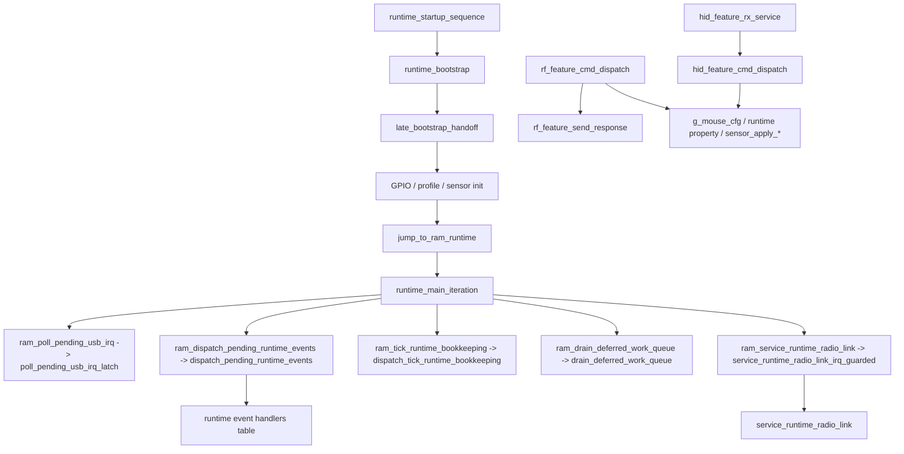

# NP-01S v2 滑鼠韌體架構與行為分析

> [!IMPORTANT]
> <sub><strong>逆向聲明：</strong>本報告僅供合法的互通性研究、防禦性安全分析、教學、資料保存，以及裝置所有人或經授權者進行維修與維護時參考之用；不授權未經許可的刷寫、再散布、規避、侵權或其他違法用途，相關第三方權利仍歸各自權利人所有。</sub>

## 家族選用說明

收錄本報告，是因為 VAXEE 家族可作為高階自研無線遊戲滑鼠韌體的代表樣本。它特別適合作為研究感測器調校能力、移動資料處理路徑，以及以手感為導向之韌體設計思路的重要參考對象。

## 0. 文件說明

### 0.1 目標

本文件用於固化 `NP-01S_v2_Driver_Version.bin` 當前逆向分析結論，重點覆蓋以下問題：

- 固件代碼框架與模組邊界
- ROM 啟動、RAM 主循環、事件分發與 2.4G 運行組織方式
- 配置協議、命令字、報文格式與配置項語義
- 傳感器原始 motion 到最終輸出隊列的流轉路徑
- 模式系統、profile/腳本切換、運行時屬性恢復
- 廠商獨有的固件層運動/事件時序算法
- USB 5V 插拔、運行時恢復、低功耗/喚醒相關路徑

### 0.2 分析依據

- 固件二進位：`NP-01S_v2_Driver_Version.bin`
- IDA / MCP 資料庫：以函數、交叉引用、反組譯、反編譯、型別資訊、全域物件與呼叫路徑為主

---

## 1. 固件總體框架

### 1.1 運行模型

該固件的整體運行模型為：

- ROM 啟動 + RAM 超級循環 + 中斷置位/前臺分發 + 多個狀態機的混合模型
- 高頻數據路徑：
  - `motion_pipeline_service`
  - `motion_postprocess_dispatch`
  - `postprocess_motion_direct_mode`
  - `postprocess_motion_buffered_mode`
  - `drain_motion_output_queue`
- 前臺控制路徑：
  - `runtime_main_iteration`
  - `dispatch_pending_runtime_events`
  - `drain_deferred_work_queue`
  - `service_runtime_radio_link`

從代碼組織方式看，這一版固件更接近典型的裸機 `superloop` 架構，而不是 RTOS 架構。`runtime_startup_sequence -> runtime_bootstrap -> late_bootstrap_handoff` 完成 ROM 側初始化後，會直接跳到 RAM 中的 `runtime_main_iteration`；而 `runtime_main_iteration` 本身就是一個固定順序的前臺服務循環：先輪詢 USB IRQ，再按表調用當前狀態處理器，然後依次執行事件分發、tick 維護、延遲工作隊列和 RF 鏈路服務。當前數據庫中也沒有看到 RTOS 常見的任務創建、調度器切換、信號量、消息隊列或內核導入符號。

可以把它概括為下表：

| 維度 | 本固件表現 |
| --- | --- |
| 系統形態 | 裸機 + 前後臺分工，不是 RTOS |
| 啟動方式 | ROM 完成初始化後 handoff 到 RAM 主循環 |
| 調度方式 | 固定順序輪詢 + 中斷置位 + 前臺分發 |
| 併發組織 | 靠全局狀態、事件標誌、延遲工作隊列和少量函數表切換 |
| 典型特徵 | `g_runtime_handler_table`、`ram_dispatch_pending_runtime_events`、`ram_drain_deferred_work_queue` |

從工程風格上看，這種設計的優點是時序可控、執行路徑短、很適合鼠標這類高輪詢率外設；代價是全局狀態較多，模組邊界更依賴命名、註釋和人工梳理，後續維護成本會明顯高於職責清晰的 RTOS 任務模型。

### 1.2 主模組劃分

| 子系統 | 主要職責 | 代表函數 / 代表對象 |
| --- | --- | --- |
| 啟動與 RAM 運行時 | ROM 初始化、跳轉到 RAM 主循環 | `runtime_startup_sequence`, `runtime_bootstrap`, `late_bootstrap_handoff`, `runtime_main_iteration` |
| 配置協議 / 命令入口 | USB/WebHID 與 RF 配置命令接收、分發、回包 | `hid_feature_rx_service`, `hid_feature_cmd_dispatch`, `rf_feature_cmd_dispatch`, `rf_feature_send_response` |
| 配置持久化 | runtime property 讀寫 | `get_runtime_property_u8`, `set_runtime_property_u8`, `notify_*`, `get_*_property` |
| 傳感器接口 | CPI/LOD/模式/腳本下發與寄存器讀寫 | `sensor_program_cpi_registers`, `sensor_set_lod_registers`, `sensor_set_tracking_mode_register`, `sensor_set_tracking_profile_registers`, `sensor_read_register_bytes_ram` |
| 運動數據管線 | motion sample 解碼、隊列化、緩衝/直通分支、排隊發送 | `motion_pipeline_service`, `motion_postprocess_dispatch`, `prime_buffered_motion_state`, `drain_motion_output_queue`, `g_motion_sample`, `g_motion_queue` |
| 模式切換 | report rate、tracking mode、LOD、active DPI slot、track trail | `commit_pending_report_rate_change`, `set_tracking_setting_index`, `set_lod_setting_index`, `set_active_dpi_slot`, `g_track_trail_mode` |
| 電源 / 鏈路切換 | USB 5V 插拔、無線鏈路維護、恢復 shadow 寄存器 | `handle_usb_5v_plug_up`, `mouse_protocol_usb_plug_process`, `service_runtime_radio_link`, `restore_sensor_shadow_after_resume` |

### 1.3 啟動階段

固件啟動時按以下順序建立系統：

1. `runtime_startup_sequence -> scatterload_dispatch -> runtime_bootstrap`
2. `late_bootstrap_handoff`
3. ROM 側完成多個系統初始化調用：
   - `sub_C9AC`, `sub_C212`, `sub_CA6C`, `sub_C98C`, `sub_C996`, `sub_C208`
4. 運行時環境與 GPIO/外設啟動檢查：
   - `sub_AF60`
   - `sub_7B70`
5. 若 `g_mouse_cfg.reserved_16+3 == 0`，執行一組啟動探測腳本：
   - `sub_92C4`
   - `sub_936C`
   - `sub_9318`
   - `sub_9280`
6. 使能運行時：
   - `sub_5F00`
   - `sub_5F24`
7. `jump_to_ram_runtime -> runtime_main_iteration`

### 1.4 運行階段

- 數據採樣路徑
  - 傳感器寄存器讀由 `sensor_read_register_bytes_ram` 實現
  - 從調用關係看，原始 sample 先寫入 `g_motion_sample`，隨後由 `motion_pipeline_service` 消費
- 報告生成路徑
  - `g_motion_sample -> motion_postprocess_dispatch -> g_motion_queue -> drain_motion_output_queue`
  - 末端大概率還會經過若干 transport helper 發往 USB 或 RF
- 配置處理路徑
  - USB：`hid_feature_rx_service -> hid_feature_cmd_dispatch`
  - RF：`rf_feature_cmd_dispatch -> rf_feature_send_response`
- 模式切換路徑
  - DPI：`set_active_dpi_slot -> sensor_apply_cpi`
  - report rate：`set_report_rate_index -> commit_pending_report_rate_change`
  - tracking mode / motion sync：`set_tracking_setting_index -> process_delayed_tracking_change / sensor_apply_tracking_profile`
  - track trail：`g_track_trail_mode -> notify_track_trail_setting_changed -> configure_motion_tick_profile`
- 低功耗路徑
  - `motion_pipeline_service` 中多個 inactivity timer、`handle_usb_5v_plug_up`、`service_runtime_radio_link` 和 `restore_sensor_shadow_after_resume` 很可能共同構成電源/鏈路恢復路徑

### 1.5 代碼設計風格

#### 特徵 1：狀態組織方式

- 大量全局變量 + 少量結構體上下文的混合風格
- 說明：
  - 配置集中在 `g_mouse_cfg`
  - 傳感器 shadow 在 `g_sensor_shadow`
  - motion 運行時狀態集中在 `g_motion_pipeline_state` 一帶與 `g_motion_tick_state`
  - Feature 報告緩衝獨立放在 `g_hid_feature_rx_report` / `g_hid_feature_tx_report`

#### 特徵 2：中斷與前臺分工

- IRQ / callback 中主要做：
  - 置位事件、更新 latch、填充運行時隊列
- 前臺主循環中主要做：
  - `runtime_main_iteration` 輪詢 USB IRQ、分發 callback、做 tick bookkeeping、處理延遲工作、服務 RF 鏈路

#### 特徵 3：配置應用風格

- “先緩存 / 持久化，再按條件立即或延遲提交”的混合風格
- 說明：
  - DPI/CPI、LOD 可立即下發傳感器寄存器
  - report rate 先寫 `g_mouse_cfg.report_rate_idx`，再由 `commit_pending_report_rate_change` 映射到內部 tick profile
  - tracking 相關配置可能通過 `process_delayed_tracking_change` 延後到空閒窗口提交

#### 特徵 4：模式實現風格

- 枚舉 + 表驅動 + 少量腳本式切換
- 說明：
  - report rate 通過 tick profile table 切換
  - tracking profile 通過 `sensor_set_tracking_profile_registers` 寫入成組寄存器
  - profile/script slot 切換通過 `apply_profile_script_and_persist_slot` 走表驅動

---

## 2. 配置系統與命令入口

### 2.1 配置存儲佈局

當前從固件直接可見的是“runtime property”為統一配置後端，原始 flash/NVM 物理佈局尚未完全恢復。

| Property ID / 字段 | 含義 | 長度 | 依據 |
| --- | --- | --- | --- |
| `0x1005` | LOD | 1 字節 | `get_lod_property`, `notify_lod_setting_changed` |
| `0x1006` | tracking mode flag | 1 字節 | `get_tracking_mode_property`, `notify_tracking_mode_flag_changed` |
| `0x1007` | motion sync flag | 1 字節 | `get_motion_sync_property`, `notify_motion_sync_flag_changed` |
| `0x1024` | track trail 模式 | 1 字節 | `get_track_trail_setting_property`, `notify_track_trail_setting_changed` |
| `0x1000` | profile/script slot（推測） | 1 字節 | `apply_profile_script_and_persist_slot` |
| `0x1001` | DPI slot 限制或 profile 相關屬性（推測） | 1 字節 | `sub_5C1C`, `apply_active_dpi_slot_with_limit` |
| `0x1002` / `0x1008` | tracking profile selector by context（推測） | 1 字節 | `get_tracking_profile_property_by_context`, `set_tracking_profile_property_by_context` |

補充說明：

- `get_runtime_property_u8` / `set_runtime_property_u8` 是統一後端入口，但它們本身只是間接跳轉包裝器，真正存儲後端函數尚未完全恢復。
- 開機 restore 路徑會從 property 恢復 track trail / LOD / tracking mode / motion sync。
- property 到物理 flash 頁/記錄的映射仍待進一步驗證。

### 2.2 配置命令入口

#### USB / WebHID / HID Feature

- 接收入口：`hid_feature_rx_service`
- 緩衝區對象：`g_hid_feature_rx_report`, `g_hid_feature_tx_report`
- 處理時機：
  - 先檢查 `report_id == 0x0E`
  - 再驗證 header `0xA5`
  - 通過 `hid_feature_cmd_dispatch` 立即分發，並立即構造回應包

#### 2.4G / Vendor 協議

- 接收入口：`rf_feature_cmd_dispatch`
- 緩衝區 / 發包：
  - `rf_feature_send_response`
- 處理時機：
  - 語義與 USB 路徑高度鏡像，但會封裝到 RF transport 緩衝區

#### 調試 / 傳感器寄存器讀取

- `queue_read_ambient_command`
- `queue_read_register_command`

這兩條路徑會把讀命令轉成內部隊列包，再調用 `sub_80B8` 下發。

### 2.3 配置執行模型

- 即時執行 + runtime property 持久化 + 個別場景延遲提交
- 優點：
  - 配置對象、傳感器腳本與 UI 命令之間關係清晰
  - track trail / report rate 這類會影響時序的配置，不必全部在中斷中完成
- 風險與注意點：
  - `cmd 0x08` 目前的 USB 路徑使用 reduced selector，而不是完整四組合編碼
  - report rate 改動不是“寫 `g_mouse_cfg.report_rate_idx` 就完成”，還要等 `commit_pending_report_rate_change`
  - tracking 相關模式切換存在延遲提交窗口

---

## 3. 傳感器運動數據流轉流程

### 3.1 本章的主鏈與輔助函數

第三章的重點不是逐一解釋所有相關函數，而是把 motion 數據從採樣到最終輸出的主鏈講清楚。按目前 IDA 中的調用關係，主次可整理如下：

| 角色 | 函數 | 在數據流裡的職責 |
| --- | --- | --- |
| 調度入口 | `motion_pipeline_service` | 決定當前這個 tick 是否推進 motion 主鏈 |
| 路徑分發 | `motion_postprocess_dispatch` | 決定當前 sample 進入 direct path 或 buffered path |
| 直接輸出路徑 | `postprocess_motion_direct_mode` | 把 sample 生成為 full record 或 XY-only record |
| 緩衝輸出路徑 | `postprocess_motion_buffered_mode` | 維護 buffered state machine，並輸出 staging packet |
| 出口分流 | `queue_motion_payload_record` | 決定當前 record 立即發送或轉成 deferred history |
| 最終出隊 | `drain_motion_output_queue` | 完成最終聚合、延期判定與發送 |

與主鏈配套的輔助節點主要有：

| 輔助函數 | 作用 |
| --- | --- |
| `decode_motion_sample_flags` | 把 `g_motion_sample` 原地規整成統一後處理格式 |
| `prime_buffered_motion_state` | buffered path 的預裝填輔助函數，只服務於 buffered state machine |
| `pack_queued_motion_history` | history queue 的中段聚合器，用於提前合併短 XY history |
| `can_delay_xy_history_record` | 決定隊首短 history 在當前週期能否繼續延遲 |

本章後續的敘述都圍繞這條主鏈展開：`採樣 -> 規範化 -> 路徑分發 -> record 構造 -> 立即發送或入隊 -> 中段聚合 -> 最終出隊`。

### 3.2 數據入口與統一工作緩衝

傳感器底層寄存器讀取由 `sensor_read_register_bytes_ram` 完成。該 RAM 訪問例程直接操作外設基址 `0x5002C000`：先把寄存器地址寫到 `+0x0C`，等待 ready，再從 `+0x1C` 取回數據。

目前資料庫還沒有把最前驅的 burst 採樣函數完全恢復到語義命名，但後續調用鏈已經足以確認：

- 原始 motion 數據會先進入 `g_motion_sample`
- `g_motion_sample` 按固定 7 位元組佈局被整個主鏈復用
- `motion_postprocess_dispatch`、`postprocess_motion_direct_mode`、`postprocess_motion_buffered_mode`、`prime_buffered_motion_state` 都把它當成統一輸入

`g_motion_sample` 在進入後處理前後的語義如下：

| 位元組範圍 | 進入後處理前 | 進入後處理後 |
| --- | --- | --- |
| `byte0` | 原始 motion / flag / 狀態位 | 被規整成 compact change mask |
| `byte1..4` | XY 相關欄位 | 被規整成可直接打包的 XY payload |
| `byte5..6` | 附加狀態位元組 | 被規整成 full record 用的兩位元組狀態摘要 |

這說明 `g_motion_sample` 不是一次性原始 burst 緩衝，而是「原始輸入進入、規整結果繼續留在原地」的統一工作緩衝。

### 3.3 一級調度：`motion_pipeline_service` 與 `motion_postprocess_dispatch`

真正把 sample 推進到後處理鏈的，不是單個函數，而是 `motion_pipeline_service -> motion_postprocess_dispatch` 這一層聯合調度。

`motion_pipeline_service` 負責兩件事：

1. 根據當前是否有新 sample、當前視窗狀態以及內部 tick 計數，決定本輪是否推進 motion 主鏈
2. 在需要時調用 `motion_postprocess_dispatch`

`motion_postprocess_dispatch` 再負責三件事：

1. 決定本輪是否先對 `g_motion_sample` 執行 `decode_motion_sample_flags`
2. 在 Track Trail 的穩定易控模式下，是否在進入後處理前先做一次 `sub_1353C` 門控
3. 根據 `profile_idx` 選擇 direct path 還是 buffered path

從控制流上看，這一層有三個關鍵結論：

- `profile_idx == 4` 時進入 `postprocess_motion_buffered_mode`
- 其他 profile 進入 `postprocess_motion_direct_mode`
- `g_track_trail_mode == 1` 時，immediate path 會在後處理前插入 `sub_1353C` 門控

計數器與空閒累積狀態集中在 `g_motion_pipeline_state+0x20` 一帶。這意味著當前 sample 是否能立即進入後處理，不只取決於是否有新位移，也取決於模式門控與節拍計數。

### 3.4 主路徑 A：direct path 如何把 sample 變成 motion record

當 `motion_postprocess_dispatch` 選中 direct path 後，主鏈進入 `postprocess_motion_direct_mode`。這條路徑的核心不是修改 `dx/dy` 數值，而是為當前 sample 決定輸出形態。

它的處理順序可以概括為：

1. 先檢查 `g_motion_queue` 是否已滿
2. 隊列已滿時，優先透過 `pack_queued_motion_history` 回收隊列空間
3. 隊列可用時，再對 `g_motion_sample` 執行一次 `decode_motion_sample_flags`
4. 根據 decode 結果決定當前 record 是 full 還是 XY-only
5. 把 record 交給 `queue_motion_payload_record`

在 direct path 中，full 與 XY-only 的判定規則很清楚：

- 當 `decode_motion_sample_flags` 的 bit0 置位，或 `g_motion_sample[0] != 0` 時，生成 full record
- 否則生成 XY-only record

因此，direct path 的主動作不是重算位移值，而是決定當前 sample 會變成哪一種 record：

- `len = 9` 的 full record：`[type=2][subtype][sample7]`
- `len = 6` 的 XY-only record：`[type=2][subtype][xy4]`

### 3.5 出口分流：`queue_motion_payload_record` 如何決定直發還是入隊

`queue_motion_payload_record` 是 direct path 與後續 queue / drain 鏈之間的結構性轉折點。它決定當前 motion record 是立即離開 firmware，還是先轉成 deferred history 進入隊列。

本章後續涉及的 queue record 關鍵欄位如下：

| 欄位 | 語義 |
| --- | --- |
| `type = 2` | 標準 motion payload record |
| `subtype = 3` | 當前週期仍具備立即發送資格的 direct candidate |
| `subtype = 5` | 已失去立即發送資格並轉入後續 history / drain 調度的 deferred history |

該函數的規則為：

- 若 transport window 已打開，且 `g_motion_queue` 為空，則保留原始 `subtype` 並立即發送
- 若未命中發送視窗，或隊列不為空，則把 `subtype` 改寫為 `5` 並壓入 `g_motion_queue`

函數尾端還會調用 `sub_10C80` 計算當前隊列佔用數。若佔用數達到 `>= 2`，會主動調用 `pack_queued_motion_history`，提前合併短 history。

所以，`subtype=3` 與 `subtype=5` 的差異不在負載內容，而在發送資格與後續調度路徑。

### 3.6 主路徑 B：buffered path 如何把 sample 變成 staging packet

當 `motion_postprocess_dispatch` 選中 `profile_idx == 4` 時，主鏈不再生成 direct record，而是改走 buffered path。這裡真正的主鏈函數是 `postprocess_motion_buffered_mode`；`prime_buffered_motion_state` 只是 buffered path 的預裝填輔助節點。

buffered path 的核心狀態位於 `g_motion_pipeline_state+0x03`，並配套使用三塊關鍵緩衝：

| 位址 / 物件 | 作用 |
| --- | --- |
| `g_motion_pipeline_state+0x03` | buffered state machine 當前狀態 |
| `0x20004ABA` | XY-only staging buffer |
| `0x20004AC3` | full staging buffer |
| `0x200056C0` | 發送視窗未打開時使用的延期持有副本 |

其數據流可分成四個階段：

1. `prime_buffered_motion_state` 在 `state=0` 時先對當前 sample 做一次預裝填  
   - 若 decode 判定為 XY-only，則把 XY payload 寫入 XY staging 區，並標記當前 packet 類型  
   - 若 decode 判定為 full，則把 sample7 寫入 full staging 區
2. `postprocess_motion_buffered_mode` 再讀取狀態機  
   - `state=1`：依當前 packet 類型把內容正式寫入模板，並決定立即發送或複製到 `0x200056C0`  
   - `state=2`：不再重做 decode，只等待後續 flush  
   - `state=3`：執行清理並回到 idle
3. 若發送視窗未開，當前 packet 會以 staging 副本形式暫存在 `0x200056C0`
4. 一旦視窗允許，staging packet 才真正離開 buffered path

這條路徑的核心價值在於：它把「當前 sample 應該長什麼樣」和「當前 sample 何時允許發送」拆成兩個階段。

### 3.7 隊列中段聚合與最終出隊

進入 queue 的 motion record 不會直接逐條原樣離開。主鏈後半段還有兩級處理：

- 中段聚合：`pack_queued_motion_history`
- 最終出隊：`drain_motion_output_queue`

#### 3.7.1 `pack_queued_motion_history`：中段聚合

`pack_queued_motion_history` 不是主鏈入口函數，但它決定了短 history 在隊列中的第一輪收斂方式。它只處理一種物件：

- 隊首為 `type=2 / subtype=5 / len=6` 的短 XY history

它會從隊首取出 `record[2..5]` 的 4 位元組 XY payload，追加到 `0x20004ACC`。當 `g_motion_pipeline_state+0x06` 的游標達到 `9` 時，就立即發送聚合包並復位。

當隊首是 `len=9` 的 full history 時：

- 若 `0x20004ACC` 為空，則直接發送該 full history
- 若 `0x20004ACC` 已半滿，則用 `g_motion_pipeline_state+0x18..0x1B` 緩存的尾部 4 位元組 XY 補齊後再發送

這表示 short history 在離開 queue 前，已經先經歷了一輪中段壓縮。

#### 3.7.2 `drain_motion_output_queue`：最終出隊

`drain_motion_output_queue` 是 queue record 離開 firmware 前的最後一道關卡。它同時負責：

- 讀取 `g_motion_queue` 的隊首
- 使用 `0x20005756` 作為當前 peek / send 緩衝
- 使用 `0x20004BD8` 作為最終聚合緩衝

它在兩種模式下的行為不同。

在順滑靈敏路徑下：

- 當 `g_track_trail_mode == 0` 且 `profile_idx != 5` 時，優先吸收隊首的 `type=2 / subtype=5 / len=6`
- 把這些短 history 追加到 `0x20004BD8`
- 當游標達到 `9` 時立即 flush
- 結果是短 history 更早聚合、也更早送出

在穩定易控路徑下：

- 若隊首是 `type=2 / subtype=5 / len=6`，先調用 `can_delay_xy_history_record()`
- 返回允許時，本週期不 `pop + send`，而是繼續保留在隊列中
- 結果是短 history 在隊列中駐留更久，離隊節拍更保守

因此，Track Trail 在 queue 後半段的直接作用不是改寫 record 內容，而是改變短 history 的離隊時機。

### 3.8 端到端數據流

從傳感器原始 motion 到最終輸出，可按下面這條主鏈理解：

1. 傳感器寄存器或 burst 數據進入 `g_motion_sample`
2. `decode_motion_sample_flags` 把 sample 規整成統一工作格式
3. `motion_pipeline_service` 決定當前 tick 是否推進主鏈
4. `motion_postprocess_dispatch` 決定 direct path 還是 buffered path
5. direct path 把 sample 變成 full / XY-only motion record
6. buffered path 把 sample 變成 staging packet
7. `queue_motion_payload_record` 決定當前 record 立即發送或轉成 deferred history
8. `pack_queued_motion_history` 先做一輪中段聚合
9. `drain_motion_output_queue` 再做最終聚合、延期判定與發送

若只保留真正影響「時序與手感」的主幹節點，重點就是三次決策：

- `motion_postprocess_dispatch`：當前 sample 何時被允許進入後處理
- `queue_motion_payload_record`：當前 record 是立即發送還是入隊
- `drain_motion_output_queue`：入隊後的短 history 是本週期離隊，還是再保留一拍

### 3.9 通俗解釋：連續移動在固件裡如何被拆分並輸出

如果從連續移動的體驗去理解當前固件，實際發生的事情並不是「傳感器給一個大位移，固件原樣發一個大位移」，而更像下面這條鏈：

1. 傳感器連續產生多拍較小的 motion sample
2. 固件把這些 sample 規整成一串 motion record
3. 沒趕上當前發送視窗的 record 會被降格為 `subtype=5` history
4. 這些 history 還會在 queue 中繼續被聚合、延期或補齊

從手感角度看，真正被改變的是三件事：

- sample 進入後處理的時機
- 短 history 在隊列中的駐留時間
- 聚合包的 flush 時機

在順滑靈敏模式下，主鏈傾向讓短 history 更快離隊。在穩定易控模式下，主鏈會在 dispatch 與 drain 兩層增加節奏門控，使連續小位移更均勻地展開到時間軸上。

---

## 4. 模式系統 / 檔位系統 / 工作模式分析

> 本章只保留對 `tracking mode` 的分析。其他如 DPI、LOD、debounce、report rate 都不是本報告的重點，不在此展開。

### 4.1 當前對外可見的 tracking mode

當前 USB 配置入口 `cmd 0x08 -> set_tracking_setting_index(index, 1)` 對外實際只表現為兩種 tracking mode：

| USB selector | `tracking_mode_flag` | `motion_sync_flag` |
| --- | --- | --- |
| `1` | `0` | `1` |
| `3` | `1` | `1` |

可以直接把它理解為：當前前臺可切換的是兩種 tracking 模式，而且兩種模式下 `motion_sync_flag` 都固定為 `1`。

### 4.2 修改 tracking mode 時，對傳感器做了什麼

tracking mode 切換時，固件對傳感器主要做兩件事。

#### 1. 先改模式位寄存器

`set_tracking_setting_index` 會立即調用 `sensor_apply_tracking_mode_flag`，對傳感器寫：

| 模式 | 寄存器寫入 |
| --- | --- |
| `tracking_mode_flag = 0` | `0x7F = 0x0D`，`0x48 = 0xFC` |
| `tracking_mode_flag = 1` | `0x7F = 0x0D`，`0x48 = 0xFD` |

這一步就是當前兩種 tracking mode 最直接、最穩定的傳感器差異。

#### 2. 再補一輪 tracking profile 腳本

在同一次設置流程裡，還會調用 `sensor_apply_tracking_profile(3, 0)` 做一次輕量 apply；之後在空閒窗口或恢復路徑中，再調用 `sensor_apply_tracking_profile(3, 1)` 把整組腳本重放。

完整腳本如下：

| 順序 | Reg | 寫入值 |
| --- | --- | --- |
| 1 | `0x40` | 讀改寫 |
| 2 | `0x7D` | `0x0A` |
| 3 | `0x77` | `0xFF` |
| 4 | `0x7E` | `0x77` |
| 5 | `0x79` | `0xFF` |
| 6 | `0x7B` | `0xFF` |
| 7 | `0x7A` | `0x01` |

其中 `arg1=0` 的輕量 apply 主要只動 `0x40`，`arg1=1` 才會把整組腳本完整回放。

### 4.3 兩種 tracking mode 的關鍵相同點與不同點

當前這兩種 tracking mode 的關係可以概括為：

- 相同點：
  - 都由 `cmd 0x08` 進入
  - 都會把 `motion_sync_flag` 保持為 `1`
  - 都會走同一條 `sensor_apply_tracking_profile(3, ...)` 路徑
  - 後續重放的 profile 腳本完全相同，都是 `0x40 / 0x7D / 0x77 / 0x7E / 0x79 / 0x7B / 0x7A`
- 不同點：
  - `tracking_mode_flag = 0` 時寫 `0x48 = 0xFC`
  - `tracking_mode_flag = 1` 時寫 `0x48 = 0xFD`

因此，對當前這版固件來說，tracking mode 的主要區別不是換了一整套 profile，而是同一套 profile 下切換了寄存器 `0x48` 的模式值。

### 4.4 補充說明

固件內部仍保留 `tracking_mode_flag + motion_sync_flag` 的完整組合表示，但當前 USB Feature 路徑沒有把它完整暴露到前臺。本報告只按當前用戶實際可切換到的兩種 tracking mode 描述。

---

## 5. 廠商獨有功能與固件層運動 / 事件處理算法

### 5.1 重點功能：Track Trail（順滑靈敏 / 穩定易控）

Track Trail 是當前固件中最重要的固件層運動調度功能。其作用邊界明確位於 motion pipeline 內部，不涉及傳感器寄存器 profile 切換，也未觀察到對 `dx/dy` 的數值重算。該功能實際控制的是：motion sample 進入後處理的時機、motion record 的入隊語義、history record 的聚合策略，以及最終 drain 階段的 flush 時機。

#### 1. 功能入口與分析邊界

- 配置入口：`cmd 0x13`
- 運行時變量：`g_track_trail_mode`
- 持久化屬性：`property 0x1024`
- 取值：
  - `0x00 = 順滑靈敏`
  - `0x01 = 穩定易控`

圍繞 `g_track_trail_mode` 的關鍵交叉引用集中在：

- `configure_motion_tick_profile`
- `sub_10050`
- `sub_100A6`
- `motion_postprocess_dispatch`
- `postprocess_motion_direct_mode`
- `postprocess_motion_buffered_mode`
- `queue_motion_payload_record`
- `pack_queued_motion_history`
- `drain_motion_output_queue`
- `can_delay_xy_history_record`

由此可知，Track Trail 的落點是固件層時序與排隊策略，而非傳感器寄存器腳本。

#### 2. 對象模型與記錄語法

Track Trail 所調度的對象分為三層：

| 對象 | 存放位置 | 作用 |
| --- | --- | --- |
| `motion sample` | `g_motion_sample` | 當前採樣週期的工作緩衝，按 7 位元組樣本處理 |
| `motion record` | `g_motion_queue` | 固件內部的排隊與調度單元 |
| `transport packet` | 發送緩衝 / aggregate buffer | 最終交給 USB / RF 發送路徑的輸出對象 |

`motion_queue_push_record` 與 `motion_queue_peek_record` 顯示，隊列槽位在記憶體中的佈局為：

```c
struct motion_queue_slot {
    u8 len;        // slot[0]
    u8 type;       // slot[1]
    u8 subtype;    // slot[2]
    u8 payload[];  // slot[3...]
};
```

其中 `len` 表示 `type + subtype + payload` 的總長度。因此：

- `len = 6` 表示 `[type][subtype][xy4]`
- `len = 9` 表示 `[type][subtype][sample7]`

#### 3. `type` 與 `subtype` 的工程語義

`type` 與 `subtype` 分別描述兩個不同層級的狀態：

- `type`：隊列項的大類
- `subtype`：同一類隊列項內部的發送語義

當前 motion 主路徑中，最重要的是：

- `type = 2`：標準 motion payload record
- `type = 3`：`queue_motion_history_tail` 生成的輔助隊列項，不屬於本章重點

對 `type = 2` 而言，當前需要重點區分的是兩種 `subtype`：

| 欄位 | 含義 | 工程語義 |
| --- | --- | --- |
| `subtype = 3` | direct candidate | 當前週期仍具有直發資格 |
| `subtype = 5` | deferred history | 未在當前週期發出，轉入後續 history / drain 調度 |

因此，`subtype=3` 與 `subtype=5` 的差異不在負載內容，而在發送資格與後續調度路徑。

#### 4. motion record 的兩條正交維度

當前 motion record 的差異可以分為兩條正交維度。

第一條維度是負載完整度：

- full record：`len=9`，形態為 `[type=2][subtype][sample7]`
- XY-only record：`len=6`，形態為 `[type=2][subtype][xy4]`

第二條維度是發送語義：

- direct candidate：`subtype=3`
- deferred history：`subtype=5`

也就是說，固件並不是只區分「full 與 XY-only」，還同時區分「當前直發」與「後續延期發送」。

#### 5. 記錄生命週期：從 sample 到 history record

對一條普通 motion sample，生命週期如下：

1. 樣本進入 `g_motion_sample`
2. `decode_motion_sample_flags` 對樣本做規範化
3. `postprocess_motion_direct_mode` 根據結果決定使用 7 位元組 full 負載還是 4 位元組 XY-only 負載
4. `queue_motion_payload_record` 決定該記錄是立即發送，還是進入 `g_motion_queue`

以 XY-only 樣本為例，direct path 首先構造的對象為：

```c
[type=2][subtype=3][xy0][xy1][xy2][xy3]
```

若當前 transport window 可用且隊列為空，則該記錄直接按 `subtype=3` 發送。若發送視窗不可用，或隊列中已有待發送項，則 `queue_motion_payload_record` 不再保留 `subtype=3`，而是將其改寫為 `subtype=5` 後壓入隊列：

```c
[type=2][subtype=5][xy0][xy1][xy2][xy3]
```

因此，`subtype=5` 的本質是「已失去當前週期直發資格、進入後續調度路徑的 motion record」。

#### 6. 共用骨架：Track Trail 不改變基礎處理鏈，只改變推進策略

順滑靈敏與穩定易控共用同一條基礎處理鏈：

1. 讀取 motion sample
2. 規範化 sample
3. 選擇 direct path 或 buffered path
4. 構造 motion record
5. 根據視窗狀態決定直發或入隊
6. 在 history 聚合與最終 drain 階段完成出隊

需要強調四點。

第一，direct / buffered 分支不是由 Track Trail 決定，而是由 `profile_idx` 決定：

- `profile_idx == 4` 時走 `postprocess_motion_buffered_mode`
- 其他 profile 走 `postprocess_motion_direct_mode`

第二，`get_motion_tick_profile_index_0` 本身只是從 `g_motion_tick_state` 中讀取當前 profile 索引，Track Trail 改變的是不同索引下的 tick table 選擇，而不是重新定義這組 profile。

第三，Track Trail 的核心差異發生在「何時允許進入後處理」與「何時允許短 history 離隊」，而不是發生在負載格式定義層。

第四，`profile_idx == 4` 對應的是顯式 buffered state machine。`postprocess_motion_buffered_mode` 使用：

- 狀態位元組：`g_motion_pipeline_state+0x03`
- full staging buffer：`0x20004AC3`
- XY-only staging buffer：`0x20004ABA`
- 延期持有緩衝：`0x200056C0`

該狀態機在 `0/1/2/3` 四個狀態之間切換，用於「構造當前包 -> 判斷是否允許當前週期發送 -> 不允許時暫存 -> 等待後續 flush」。Track Trail 不改寫 buffered packet 的基本構造規則，而是透過 tick table 與門控邏輯改變該狀態機的推進時機。

#### 7. 隊列佔用、兩級聚合與 flush 機制

`g_motion_queue` 為標準 ring buffer：

- `motion_queue_is_full` 透過 `(write+1)%size == read` 判斷是否已滿
- 隊列容量位元組位於 `g_motion_queue+0x06`
- `sub_10C80` 計算的是當前隊列佔用數，而不是布林狀態

這意味著隊列壓力在固件中是顯式管理的。`queue_motion_payload_record` 在入隊後若發現隊列佔用數已達到 `>= 2`，會主動調用 `pack_queued_motion_history`，說明固件在隊列出現連續 history record 時就會嘗試中途減壓。

當前路徑存在兩級 history 聚合。

第一層聚合位於 `pack_queued_motion_history`：

- 聚合緩衝：`0x20004ACC`
- 聚合游標：`g_motion_pipeline_state+0x06`
- 處理對象：隊首的 `type=2 / subtype=5 / len=6`
- 操作方式：提取 `record[2..5]`，即 4 位元組 XY 負載，追加進 `0x20004ACC`
- flush 條件：游標累計到 `9`

此外，當隊列頭出現 `len=9` full history，而 `0x20004ACC` 已處於半滿狀態時，函數會使用 `g_motion_pipeline_state+0x18..0x1B` 處緩存的 4 位元組尾部 XY 數據完成補齊並立即發送。這說明中段聚合不僅負責「兩個短 record 合併」，還負責在 full / short 混合到達時收斂半滿緩衝。

第二層聚合位於 `drain_motion_output_queue`：

- 聚合緩衝：`0x20004BD8`
- 聚合游標：`g_motion_drain_state+0x05`
- 處理對象：同樣優先針對 `type=2 / subtype=5 / len=6`
- flush 條件：游標累計到 `9`

兩級聚合並存，意味著短 XY-history 不一定在一個固定階段被立即發送，而是可以在 pipeline 中段或最終 drain 階段被吸收、延後或合併。

#### 8. `postprocess_motion_direct_mode`：負載簡化與隊列壓力處理

`postprocess_motion_direct_mode` 的行為可以分為兩部分。

第一部分是負載形態選擇：

- 當 `decode_motion_sample_flags` 的 bit0 置位，或 `g_motion_sample[0] != 0` 時，生成 full record
- 否則生成 XY-only record

第二部分是隊列壓力處理：

- 若 `g_motion_queue` 已滿，不會直接丟棄當前 sample
- 程式碼會先檢查 busy 狀態，再調用 `sub_1353C`
- 若當前視窗允許推進，則優先執行 `pack_queued_motion_history` 以回收隊列空間

這說明 direct path 在隊列壓力出現時採取的是「優先合併已有 history record，再爭取推進新樣本」的策略，而非立即退化為簡單丟棄路徑。

#### 9. `queue_motion_payload_record`：`subtype=3` 到 `subtype=5` 的轉換點

`queue_motion_payload_record` 是 Track Trail 分析中的關鍵函數，因為它定義了 motion record 的發送語義何時發生切換。

其規則為：

- 若 transport window 已打開，且 `g_motion_queue` 為空，則按原始 `subtype` 立即發送
- 否則，放棄原始 `subtype=3`，改寫為 `subtype=5` 後壓入隊列

因此：

- `subtype=3` 僅表示「當前仍具備直發資格」
- 一旦進入隊列，普通 motion record 的發送語義就被統一重寫為 `subtype=5`

這也是後續 Track Trail 分析要始終盯住 `subtype=5` 的原因：真正產生時序差異的，不是剛構造出的 direct candidate，而是已經進入 deferred history 狀態的隊列項。

#### 10. 穩定易控：保守型時序調度器

穩定易控的工程特徵可以概括為「兩層保守門控 + 更晚的短 history 出隊」。

##### 10.1 第一層：更保守的 tick table

`sub_10050` 與 `sub_100A6` 根據 `g_track_trail_mode` 選擇不同的 tick table：

- 順滑靈敏使用 `0x2000424C[profile_idx]`
- 穩定易控使用 `0x20004268[profile_idx]`

其效果是：在相同 `profile_idx` 下，穩定易控使用另一套時間基準驅動 motion pipeline。Track Trail 在這裡改動的是推進節拍，而不是 record 語法。

##### 10.2 第二層：進入後處理前的發送視窗門控

`motion_postprocess_dispatch` 的 immediate path 內部存在穩定易控專用邏輯：

1. 當 `g_track_trail_mode == 1` 時，先調用 `sub_1353C`
2. 若返回 `0`，則當前週期直接返回
3. 本輪不進入 direct / buffered 後處理

該門控的落點位於後處理之前，因此它控制的是「樣本是否允許在當前週期推進到後處理」，而不是「後處理結束後是否發送」。

##### 10.3 第三層：短 history 在隊首仍可繼續延期

`drain_motion_output_queue` 中，穩定易控會優先檢查隊首是否滿足：

- `type = 2`
- `subtype = 5`
- `len = 6`

若滿足，則調用 `can_delay_xy_history_record`。當該函數返回允許時，當前隊首不會在本週期執行 `pop + send`，而是繼續保留在隊列中。

這說明穩定易控重點干預的對象並不是 full record，而是最容易造成輸出碎片化的短 XY-only history。

##### 10.4 第四層：延期判定基於控制位 `0x2`

`can_delay_xy_history_record` 的邏輯等價於：

```c
return ((g_motion_pipeline_state.control_flags & 0x2) == 0);
```

也就是說，延期條件不是依據 `dx/dy` 數值、軌跡曲率或方向變化計算得出，而是由 pipeline 當前狀態位決定。該模式因此應理解為「基於狀態位的時序調度器」，而不是「基於位移幅值的數學濾波器」。

##### 10.5 穩定易控的工程表現

在穩定易控模式下，可以直接觀察到以下結果：

- `subtype=5 len=6` 短 history 的隊列駐留時間更長
- `g_motion_queue` 更容易短時積壓多個 short history
- `0x20004BD8` 的 flush 更晚發生
- 最終輸出節拍更整齊，短小片段單獨離隊的機率更低

#### 11. 順滑靈敏：積極型聚合與出隊策略

順滑靈敏的工程特徵可以概括為「更早進入後處理 + 更積極吸收短 history」。

##### 11.1 第一層：更積極的 tick table

當 `g_track_trail_mode == 0` 時，`sub_10050` / `sub_100A6` 選擇 `0x2000424C[profile_idx]`。這使 motion pipeline 在相同 profile 索引下以更積極的節拍推進。

##### 11.2 第二層：immediate path 不增加額外門控

在 `motion_postprocess_dispatch` 中，只有穩定易控會在 immediate path 前插入 `sub_1353C` 門控。順滑靈敏沒有這層額外限制，因此 sample 更容易直接進入 direct / buffered 後處理。

##### 11.3 第三層：最終 drain 階段主動吞入短 history

當 `g_track_trail_mode == 0` 且 `profile_idx != 5` 時，`drain_motion_output_queue` 會優先進入主動聚合路徑：

1. 反覆檢查隊首
2. 若隊首是 `type=2 / subtype=5 / len=6`
3. 則提取 `record[2..5]` 追加到 `0x20004BD8`
4. 游標達到 `9` 後立即 flush

這一分支的目標不是延後，而是儘快吸收連續 short history，並在滿足長度條件後立即輸出。

##### 11.4 `profile_idx == 5` 的保守例外

順滑靈敏並非在所有情況下都採用主動 drain 聚合。`drain_motion_output_queue` 在 `profile_idx == 5` 時不會走前述主動聚合路徑，而會進入更接近穩定易控的保守 drain 分支。因此：

- 大多數順滑靈敏場景採用「更快聚合、更快出隊」
- `profile_idx == 5` 保留了一個保守例外

##### 11.5 順滑靈敏的工程表現

在順滑靈敏模式下，可以直接觀察到以下結果：

- sample 平均更早進入後處理
- `subtype=5 len=6` 更快被 drain 階段消費
- `0x20004BD8` 更容易較早形成完整 aggregate
- 隊列平均駐留時間更短，連續小位移的輸出節拍更緊湊

#### 12. 兩種模式的差異落點

兩種 Track Trail 模式共用同一套 record 語法：

- 都會產生 full record 與 XY-only record
- 都會在進入隊列後使用 `subtype=5` 表示 deferred history
- 都會經過中段聚合與最終 drain

真正的差異落在以下四個維度：

| 維度 | 順滑靈敏 | 穩定易控 |
| --- | --- | --- |
| tick table | `0x2000424C` | `0x20004268` |
| immediate path | 不加額外門控 | 先經 `sub_1353C` |
| short history 出隊 | 更快聚合、更快 flush | 更願意繼續延期 |
| 隊列 / flush 表現 | 駐留時間短、輸出節拍緊 | 駐留時間長、輸出節拍更整齊 |

#### 13. 主觀手感差異的工程來源

主觀手感差異可以直接還原為三類工程指標的差異：

- sample 進入後處理的平均等待時間
- `subtype=5 len=6` 短 history 的隊列駐留時間
- aggregate buffer 的形成與 flush 時機

順滑靈敏透過「更快進入後處理 + 更快消費短 history」形成更緊湊的輸出節拍；穩定易控透過「後處理前門控 + 隊首短 history 延期」形成更均勻、更低碎片化的輸出節拍。兩者差異來自事件時間結構，而不是位移值重算公式。

#### 14. 通俗解釋：移動數據如何被兩種模式改寫為不同手感

從固件視角看，一次連續移動不會天然對應為「一個完整的大位移值」。更常見的情況是：

1. 傳感器在連續多個採樣週期中，依次產生多組較小的 `dx/dy`
2. 固件把這些樣本轉換為一串 motion record
3. 其中一部分 record 如果沒有趕上當前發送視窗，就會轉成 `subtype=5` 的 short history
4. Track Trail 再決定這些 short history 是儘快被聚合並發出，還是繼續在隊列裡保留一個週期

因此，兩種模式改變手感的方式，不是改變單個 `dx/dy` 的數值大小，而是改變「一串連續小位移」離開固件的時間結構。

對順滑靈敏而言，固件採用的是更積極的時間組織方式：

- sample 更容易直接進入後處理
- short history 更容易在 `0x20004BD8` 中被快速吸收
- 聚合包更早形成，也更早 flush

對應到結果上，就是：

- 相鄰小位移之間的輸出間隔更短
- 連續移動更快體現在最終報告流
- 主觀上表現為跟手、響應更緊、微小連續位移更容易立即體現

對穩定易控而言，固件採用的是更保守的時間組織方式：

- sample 在進入後處理前先經過一次門控
- 隊首 short history 仍可能繼續延期
- aggregate 更傾向在更完整的時機再 flush

對應到結果上，就是：

- 短小位移片段更少以離散方式單獨離隊
- 連續移動在時間軸上被整理得更均勻
- 主觀上表現為碎感更低、輸出節拍更整齊、控制感更強

這也是為什麼兩種模式的差異會直接體現在「手感」而不是「參數表」上：固件改變的不是位移值本身，而是位移事件進入報告流的節奏、密度與聚合方式。

#### 15. 本章結論

Track Trail 的本質是一套固件層 motion scheduling 機制，而不是寄存器配置項，也不是位移重算公式。其核心影響點包括：

- tick table 選擇
- immediate path 是否插入門控
- `type=2 / subtype=5 / len=6` 短 history 的隊列駐留策略
- 中段聚合 `0x20004ACC` 與最終聚合 `0x20004BD8` 的 flush 時機

因此，「順滑靈敏 / 穩定易控」對應的是同一批 motion 數據在固件內部被組織成不同的推進節拍、聚合節拍與發送節拍。

---

## 6. 睡眠、喚醒與功耗管理

### 6.1 進入低功耗的條件

- `motion_pipeline_service` 中存在多組 inactivity threshold：
  - `0xF4240`
  - `0x1E8480`
  - `0xC350`
- 達閾值後很可能會觸發一串鏈路/時鐘/傳感器相關調用，如：
  - `sub_135CC`
  - `sub_1011C`
  - `sub_135D8(0x101)`
  - `sub_10AE4(0)`
  - `sub_135E4(0x148)`
  - `sub_12860`
  - `sub_10050`
  - `sub_FFF6`

### 6.2 睡眠前動作

- 清空或延遲 motion queue
- 調整 tick table / flush threshold
- 進入更低活動度的 RF/USB/runtime 狀態

### 6.3 喚醒源

- USB 5V 插入：
  - `handle_usb_5v_plug_up`
  - `mouse_protocol_usb_plug_process`
- motion/activity
- RF 鏈路事件
- 主循環每輪都會先檢查 `poll_pending_usb_irq_latch`

### 6.4 喚醒後恢復動作

- `restore_sensor_shadow_after_resume`
  - 讀傳感器 `0x5B`
  - 重放 CPI shadow
  - 重放 tracking_mode shadow
  - 重放 LOD shadow
- USB 5V 插入會更新 `unk_20004B74` 一帶狀態字節並調用 `sub_D6D4(0)`

### 6.5 其它功耗相關路徑

- `service_rf_protocol_powerdown_timer`
- `service_runtime_radio_link`
- `process_delayed_tracking_change`

這些函數共同說明：

- 固件不是簡單“有線/無線二選一”
- 而是存在一套 runtime 狀態機，把鏈路狀態、motion 空閒窗口和傳感器恢復綁在一起

---

## 7. 協議與配置語義總結

### 7.1 USB Feature / RF 配置命令總表

| cmd | 語義 | 主要寫函數 | 主要讀函數 | 備註 |
| --- | --- | --- | --- | --- |
| `0x01` | 固件版本讀取 | - | 內部版本字段 | `hid_feature_cmd_dispatch` case `0x01` |
| `0x02` | 當前 DPI 槽位 | `set_active_dpi_slot` | `get_active_dpi_slot` | 寫後立即 `sensor_apply_cpi` |
| `0x03` | DPI 槽位啟用表 | `set_dpi_slot_enable_payload` | `get_dpi_slot_enable_payload` | 四槽位 bit/payload |
| `0x04` | DPI 數值 | `set_dpi_value_by_slot` | `get_dpi_value_by_slot` | 持久化後續由 `sensor_apply_cpi` 生效 |
| `0x05` | debounce 檔位 | `set_debounce_setting_index` | `get_debounce_setting_index` | UI 值會映射到內部 idx |
| `0x06` | debounce payload | `set_debounce_slot_payload` | `get_debounce_slot_payload` | 固件內部是 5 字節 payload |
| `0x07` | report rate | `set_report_rate_index` | `get_report_rate_index` | 真正提交在 `commit_pending_report_rate_change` |
| `0x08` | 軌跡模式 | `set_tracking_setting_index(index, 1)` | `get_tracking_setting_index(1)` | 目前 USB 路徑使用 reduced selector |
| `0x09` | LOD | `set_lod_setting_index` | `get_lod_setting_index` | 立即寫 sensor LOD reg |
| `0x0A` | mouse PID read | - | 內部 PID 讀取 | 只讀 |
| `0x0B` | battery level read | - | 電量字段 | 只讀 |
| `0x0C` | 按鍵映射 | `set_button_macro_assignment` | `get_button_macro_assignment` | vendor 功能映射 |
| `0x10` | battery charging status | - | `sub_7EC8` | 只讀 |
| `0x13` | track trail | 直接寫 `g_track_trail_mode` | `get_track_trail_setting_property` | 固件層算法開關 |

### 7.2 重要語義點

- `report_id = 0x0E`
- header = `0xA5`
- Feature 報告結構：
  - `report_id`
  - `header`
  - `cmd_id`
  - `rw`
  - `payload_len`
  - `payload[59]`

### 7.3 固件實作補充說明

#### `cmd 0x08`

- `get_tracking_setting_index(1)` 只返回 reduced selector
- `set_tracking_setting_index(index, 1)` 只對兩種 selector 明確生效
- 當前這兩種 selector 都會把 `motion_sync_flag` 維持在 `1`
- 因而兩種 USB 外露模式在 profile 腳本層共用 `sensor_apply_tracking_profile(3, ...)`，穩定差異主要落在 `reg 0x48 = 0xFC / 0xFD`

#### `cmd 0x07`

- `set_report_rate_index` 允許寫到 `5`
- `commit_pending_report_rate_change` 也有對應 internal profile `4`
- 這條程式路徑在固件內存在，但是否穩定工作仍需實測

---

## 8. 風險點、待確認點與後續分析建議

### 8.1 風險點

- `cmd 0x08` 目前的 USB 路徑只穩定暴露兩種 selector，自動化寫入時不能假設存在完整四組合編碼
- motion output 最終 transport sender 仍有若干間接跳轉未完全命名
- orphan `0x8F4A-0x9076` 尚未完成完整函數邊界恢復

---

## 9. 附錄 A：固件框架圖



---

## 10. 附錄 B：傳感器數據流圖

```mermaid
flowchart LR
    A["sensor_read_register_bytes_ram"] --> B["g_motion_sample (7-byte work buffer)"]
    B --> C["decode_motion_sample_flags\nbyte0 -> change mask\nbyte1..4 -> XY payload\nbyte5..6 -> status2"]
    C --> D["motion_postprocess_dispatch"]

    D --> E["direct path\npostprocess_motion_direct_mode"]
    D --> F["buffered path\npostprocess_motion_buffered_mode"]

    E --> G["type-2 subtype-3\nfull len=9 or XY-only len=6"]
    F --> H["staging buffers\n0x20004ABA / 0x20004AC3 / 0x200056C0"]
    H --> I["queue_motion_payload_record"]
    G --> I

    I --> J{"transport window open\nand queue empty?"}
    J -->|Yes| K["immediate send\nsubtype-3"]
    J -->|No| L["queue as subtype-5 history\ninto g_motion_queue"]

    L --> M["pack_queued_motion_history\nmerge len-6 XY history"]
    M --> N["drain_motion_output_queue"]
    L --> N
    K --> O["transport helpers"]
    N --> P["0x20005756 peek buffer\n0x20004BD8 drain staging"]
    P --> O["USB / RF sender"]

    Q["g_track_trail_mode"] --> D
    Q --> N
    R["g_motion_tick_state"] --> D
    R --> N
```



---

## 11. 附錄 C：配置語義表

### 11.1 配置語義總表

| 配置項 | 命令 | 配置對象 | 持久化 | 運行時應用路徑 |
| --- | --- | --- | --- | --- |
| 當前 DPI 槽位 | `0x02` | `g_mouse_cfg.reserved_16+0xA` | 有 | `set_active_dpi_slot -> sensor_apply_cpi` |
| DPI 數值 | `0x04` | `g_dpi_value_table[4]` | 有 | `set_dpi_value_by_slot` |
| debounce 檔位 | `0x05` | `g_mouse_cfg.debounce_internal_idx` | 有 | `set_debounce_setting_index` |
| debounce payload | `0x06` | `g_debounce_slot_payload` | 有 | `set_debounce_slot_payload` |
| report rate | `0x07` | `g_mouse_cfg.report_rate_idx` | 有 | `commit_pending_report_rate_change` |
| tracking mode flag | `0x08` | `g_mouse_cfg.tracking_mode_flag` | 有 | `sensor_apply_tracking_mode_flag` |
| motion sync flag | `0x08` / 內部屬性 | `g_mouse_cfg.motion_sync_flag` | `0x1007` | `sensor_apply_tracking_profile` |
| LOD | `0x09` | `g_mouse_cfg.lod_idx` | `0x1005` | `sensor_apply_lod_index` |
| 按鍵映射 | `0x0C` | 若干運行時對象 | 有 | `set_button_macro_assignment` |
| track trail | `0x13` | `g_track_trail_mode` | `0x1024` | `configure_motion_tick_profile` + motion pipeline |

### 11.2 模式寄存器寫入表

| 功能 | 關鍵函數 | 寫入寄存器 | 備註 |
| --- | --- | --- | --- |
| CPI | `sensor_program_cpi_registers` | `0x47, 0x48, 0x49, 0x4A, 0x4B` | 傳感器分辨率 |
| LOD | `sensor_set_lod_registers` | `0x7F, 0x7A` | 低/高 LOD |
| tracking mode flag | `sensor_set_tracking_mode_register` | `0x7F, 0x48` | 二值模式位 |
| tracking profile script | `sensor_set_tracking_profile_registers` | `0x40, 0x7D, 0x77, 0x7E, 0x79, 0x7B, 0x7A` | `arg1=0` 只做輕量 `0x40` 更新，`arg1=1` 才完整回放整組腳本 |

---

## 12. 總結

真正影響“手感”的核心不在傳感器寄存器，而在 `g_track_trail_mode -> g_motion_tick_state -> motion_postprocess_dispatch -> drain_motion_output_queue` 這一整條時序鏈。對後續分析來說，最有價值的繼續方向不是繼續堆寄存器表，而是把 queue record 類型、flush 節拍和 transport 發送窗口補全到抓包級別，這樣就能把“順滑靈敏 / 穩定易控”從靜態逆向推進到可量化的行為對比。
